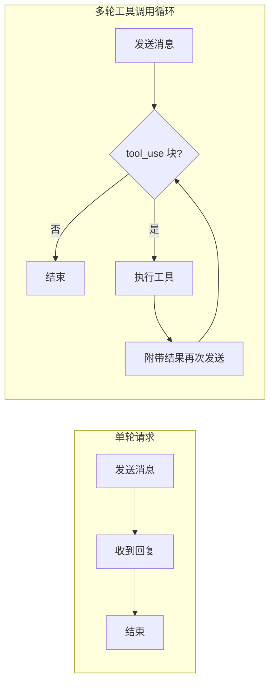
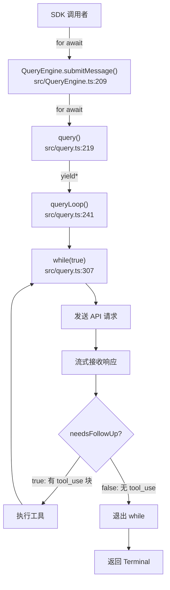
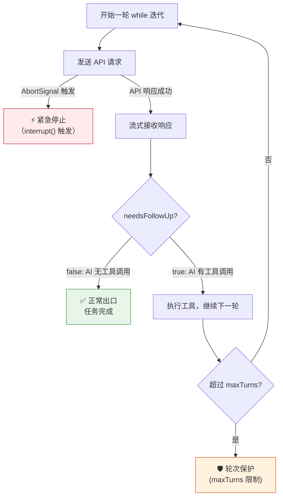

# 第 8 章：QueryEngine 主循环——工具调用的编排逻辑

> "循环的出口不是计时器，而是 AI 自己说'我做完了'。"

在这个代码库里，至少 3 处地方用完全相同的方式解决同一个工程难题：如何驱动一个 AI 模型反复调用工具，直到任务真正完成。`query.ts` 是主 Agent 的循环引擎，`AgentTool/runAgent.ts` 是子 Agent 的循环引擎，它们共用同一个核心函数 `query()`，却在"任务结束时该怎么办"这个问题上做出了截然不同的选择。

这个反复出现的结构叫做**可中断多轮工具调用循环（Interruptible Multi-Turn Tool Loop）**——以工具调用信号为继续条件，以外部中止信号为退出条件，中间配备三道防线防止失控。

识别这个模式，你就能用不到 30 行代码实现一个可调用任意工具、随时停止、不怕 API 超时的 AI 主循环。

---

## 问题：一次用户请求，几轮对话？

我们先从一个具体的用户指令出发：「找到项目里所有 TODO 注释，统计每个文件有几个」。

对 AI 来说，这个任务至少需要两步：先用 bash 工具执行 `grep -rn "TODO" src/`，再分析输出统计数量。如果 AI 第一次调用工具的结果显示目录太多、输出超长，它可能还需要第三步——重新设计搜索策略，缩小范围再来一次。

**这就是多轮对话不可避免的根本原因**：AI 不能在一次 API 请求里执行工具并读到结果。每次工具调用都需要：① 向 API 发送"用户消息 + 工具定义"；② API 返回包含 tool_use 块的 assistant 消息；③ 本地执行工具；④ 把工具结果作为 user 消息再次发送给 API。每一轮都是一个完整的 HTTP 往返。

更棘手的是，**API 的 `stop_reason` 字段不可靠**。源码注释 `src/query.ts:554` 直接说明：

```typescript
// 参见 https://docs.claude.com/en/docs/build-with-claude/tool-use
// 注意：stop_reason === 'tool_use' 是不可靠的——它并不总是被正确设置。
// （原文："Note: stop_reason === 'tool_use' is unreliable -- it's not always set correctly."）
```

**源码参考：** `src/query.ts:554`

这句注释揭示了一个设计约束：系统不能依赖 `stop_reason` 来决定是否继续循环。如果 API 忘记设置 `stop_reason = 'tool_use'`，仅靠 stop_reason 的循环就会提前终止，丢失还未执行的工具调用。系统需要一个更可靠的出口信号——而这个信号就是响应消息中**是否包含 tool_use 块**。

这个设计选择直接催生了 `needsFollowUp` 旗标，以及围绕它构建的整个主循环架构。

**图 8-1：单轮请求 vs 多轮工具调用循环的对比**



单轮请求以收到回复为终点；多轮工具调用循环以"AI 不再返回 tool_use 块"为终点——这个出口完全由 AI 的行为决定，而非调用方预设。

---

## 源码实例 1：QueryEngine.ts——薄壳委托与主循环

`QueryEngine`（`src/QueryEngine.ts:184`）是对外暴露给 SDK 调用者的门面类。我们先看它的入口方法：

```typescript
// src/QueryEngine.ts:209-215（精简版）
async *submitMessage(
  prompt: string | ContentBlockParam[],
  options?: { uuid?: string; isMeta?: boolean },
): AsyncGenerator<SDKMessage, void, unknown> {
  // ...构建 messages、systemPrompt、toolUseContext...
}
```

**源码参考：** `src/QueryEngine.ts:209`

`submitMessage` 是一个异步生成器（`async *`）——调用方通过 `for await` 消费它产出的消息流。它的内部结构是典型的"薄壳"：主要工作是收集参数（`cwd`、`commands`、`maxTurns`、`taskBudget`），然后在第 675 行把工作全部委托给 `query()`：

```typescript
// src/QueryEngine.ts:675-687（精简版）
for await (const message of query({
  messages,
  systemPrompt,
  userContext,
  systemContext,
  canUseTool,
  toolUseContext: processUserInputContext,
  querySource: 'sdk',
  maxTurns,
  taskBudget,
})) {
  // ...将消息转换为 SDK 格式并 yield...
}
```

**源码参考：** `src/QueryEngine.ts:675`

**为什么 `QueryEngine` 是薄壳？** 因为循环逻辑本身并不属于"对象状态管理"的职责范畴。`QueryEngine` 负责的是**跨轮次持久的状态**：`this.mutableMessages`（消息历史）、`this.abortController`（中断控制器，第 203 行）、`this.permissionDenials`（权限拒绝记录）。真正的"循环驱动"是无状态的纯逻辑——它可以被主 Agent 用，也可以被子 Agent 用，所以被提取到独立的 `query.ts`。

---

真正的主循环在 `query.ts`。`query()` 函数（`src/query.ts:219`）本身也是一个薄壳，它在第 230 行通过 `yield*` 委托给 `queryLoop()`：

```typescript
// src/query.ts:230（委托调用）
const terminal = yield* queryLoop(params, consumedCommandUuids)
```

**源码参考：** `src/query.ts:230`

`yield*` 语法将 `queryLoop` 的所有 yield 值直接透传给上层——调用方完全感知不到这层包装的存在。这种**生成器委托**（Generator Delegation）使得 `query()` 对外承诺"我会持续产出消息"，而内部实现可以自由重构。

`queryLoop` 内部是这样的（`src/query.ts:307`）：

```typescript
// src/query.ts:307-320（while true 主循环入口，精简版）
// eslint-disable-next-line no-constant-condition
while (true) {
  // 每次迭代开头解构状态
  let { toolUseContext } = state
  const {
    messages,
    turnCount,
    // ...其他状态字段...
  } = state
```

**源码参考：** `src/query.ts:307`

注释 `eslint-disable-next-line no-constant-condition` 有意抑制了 ESLint 对 `while(true)` 的警告——这不是遗忘，而是明确声明"这个循环的退出由内部逻辑控制，而非循环条件"。

**为什么用 `while(true)` 而不是递归？** 两个原因：第一，异步生成器中的 `yield` 天然支持外层的 `break`（`for await` 的调用方可以随时停止消费），递归则无法在中间打断；第二，Node.js/Bun 的调用栈是有限的，工具调用次数可能达到 20-50 轮，递归面临栈溢出风险，`while(true)` 则零风险。

**图 8-2：QueryEngine 主循环调用链**



注意调用链最深处是 `queryLoop` 内的 `while(true)`——上层三层函数（`submitMessage`、`query`、`queryLoop`）都是包装和委托，真正决定"是否继续循环"的逻辑全部在 `while(true)` 内部。

循环的出口旗标在每次迭代开始时重置（`src/query.ts:558`）：

```typescript
// src/query.ts:555-560（循环出口旗标初始化）
// 注意：stop_reason === 'tool_use' 是不可靠的——不总是被正确设置。
// 在流式响应期间，只要出现 tool_use 块就设置此旗标——这是唯一可靠的循环继续信号。
// 如果流式结束后为 false，说明本轮对话已完成（除非 stop-hook 触发重试）。
// （原文："Set during streaming whenever a tool_use block arrives — the sole
// loop-exit signal. If false after streaming, we're done (modulo stop-hook retry)."）
const toolUseBlocks: ToolUseBlock[] = []
let needsFollowUp = false
```

**源码参考：** `src/query.ts:558`

**这个旗标的命名很有讲究**：`needsFollowUp` 的语义是"这一轮结束后还需要继续对话吗？"——它不关心 `stop_reason` 的值，只关心响应中是否出现了 `ToolUseBlock`。流式接收过程中，每收到一个 tool_use 类型的内容块，就把该块加入 `toolUseBlocks` 数组，同时将 `needsFollowUp` 置为 `true`。流式结束后，检查旗标：

```typescript
// src/query.ts:1062-1065（出口判断）
if (!needsFollowUp) {
  // 没有工具调用——对话完成，退出循环
  // ...处理各类终止情况（紧急停止、PTL 错误恢复等）...
}
```

**源码参考：** `src/query.ts:1062`

**`if (!needsFollowUp)` 是循环的正常出口。** 这里处理的不是"如何退出循环"（直接 break 或 return），而是"退出前还有什么清理工作"——例如检查是否有 prompt-too-long 错误需要恢复，是否触发了停止 Hook 的重试。设计上的精妙在于：**循环退出的条件由 AI 的行为（是否返回工具调用）决定，而非调用方预设的判断逻辑。**

---

## 源码实例 2（变体）：AgentTool/runAgent.ts——子 Agent 的不同退出语义

主循环的第二个实例出现在子 Agent 的执行器中。`AgentTool/runAgent.ts:748` 同样使用 `query()` 驱动循环：

```typescript
// src/tools/AgentTool/runAgent.ts:748-756（子 Agent 循环入口，精简版）
for await (const message of query({
  messages: initialMessages,
  systemPrompt: agentSystemPrompt,
  userContext: resolvedUserContext,
  systemContext: resolvedSystemContext,
  canUseTool,
  toolUseContext: agentToolUseContext,
  querySource,
  maxTurns: maxTurns ?? agentDefinition.maxTurns,
})) {
```

**源码参考：** `src/tools/AgentTool/runAgent.ts:748`

表面上看，子 Agent 的循环和主 Agent 几乎相同——都用 `for await` 消费 `query()` 的输出。**关键区别在于 max_turns_reached 的处理方式**：

```typescript
// src/tools/AgentTool/runAgent.ts:773-786（超轮次处理）
if (message.attachment.type === 'max_turns_reached') {
  logForDebugging(
    `[Agent: ${agentDefinition.agentType}] 达到最大轮次限制 (${message.attachment.maxTurns})`,
  )
  break  // ← 子 Agent：break，优雅降级
}
```

**源码参考：** `src/tools/AgentTool/runAgent.ts:786`

再对比主 Agent 在同一情况下的处理（`src/QueryEngine.ts:870`）：

```typescript
// src/QueryEngine.ts:868-872（主 Agent 超轮次处理）
errors: [
  `Reached maximum number of turns (${message.attachment.maxTurns})`,
],
// ...
return  // ← 主 Agent：return，终止生成器
```

**源码参考：** `src/QueryEngine.ts:870`

**为什么主 Agent 用 `return`（终止）而子 Agent 用 `break`（退出循环但继续执行后续代码）？**

这个差异体现了两个不同的"调用方期望"：

- 主 Agent 是 SDK 的顶层入口——超过轮次意味着任务彻底失败，调用方应该收到错误信息并停止等待。`return` 终止生成器，向 SDK 调用者发出"任务结束，带错误"的信号。
- 子 Agent 是一个工具的内部实现——超过轮次不一定意味着完全失败，子 Agent 可能已经完成了大部分工作。`break` 退出循环后，代码还会继续执行"整理已收集的结果、向父 Agent 汇报"等收尾逻辑。**调用者（`AgentTool`）而非被调用者决定"超轮次是否等于失败"。**

| 维度 | 主 Agent（QueryEngine） | 子 Agent（runAgent） |
|------|------------------------|---------------------|
| 超轮次处理 | `return`（终止生成器） | `break`（退出循环） |
| 对调用方的语义 | 任务彻底失败，带错误消息 | 优雅降级，收集已有结果 |
| 谁决定失败语义 | QueryEngine 自身 | AgentTool（子 Agent 的调用者）|
| 源码位置 | `QueryEngine.ts:870` | `runAgent.ts:786` |

这个对比揭示了复用 `query()` 的设计意图：**核心循环逻辑（while(true) + needsFollowUp）被共享，但生命周期语义（超轮次时该怎么办）由各自的调用层决定。**

**图 8-3：主 Agent 与子 Agent 超轮次的不同生命周期**

```mermaid
flowchart TD
    subgraph 主 Agent（QueryEngine）
        direction TB
        QE1["for await query()"] --> QE2{max_turns_reached?}
        QE2 -->|否| QE3[继续消费消息]
        QE2 -->|是| QE4["return（终止生成器）"]
        QE4 --> QE5["SDK 调用者收到 errors 字段\n（任务彻底失败）"]
    end

    subgraph 子 Agent（runAgent）
        direction TB
        RA1["for await query()"] --> RA2{max_turns_reached?}
        RA2 -->|否| RA3[继续消费消息]
        RA2 -->|是| RA4["break（退出循环）"]
        RA4 --> RA5[继续执行收尾逻辑]
        RA5 --> RA6["AgentTool 决定\n是否视为失败"]
    end
```

主 Agent（左）超轮次后直接 `return`，生成器终止，SDK 调用者立即收到错误；子 Agent（右）超轮次后 `break`，循环退出但函数继续执行，收尾逻辑由父调用者（`AgentTool`）负责——**相同的 `query()` 核心，不同的调用层决定生命周期结局。**

---

## 源码实例 3：重试与中断——循环的两个安全阀

为什么不用……？如果 API 返回 429（超出频率限制）或 500（服务器错误），循环该怎么办？如果用户在第 10 轮工具调用时按下 Ctrl+C，系统又该怎么停止？

主循环有两个互补的安全阀——它们从不同方向保护循环的稳定性。

**安全阀一：API 重试（对内透明）**

当底层 API 请求失败并触发重试时，`queryLoop` 会产出一个 `api_retry` 类型的系统消息（`src/QueryEngine.ts:946`）：

```typescript
// src/QueryEngine.ts:943-951（API 重试事件，精简版）
if (message.subtype === 'api_error') {
  yield {
    type: 'system',
    subtype: 'api_retry' as const,
    attempt: message.retryAttempt,
    max_retries: message.maxRetries,
    retry_delay_ms: message.retryInMs,
    error_status: message.error.status ?? null,
    error: categorizeRetryableAPIError(message.error),
    session_id: getSessionId(),
    uuid: message.uuid,
  }
}
```

**源码参考：** `src/QueryEngine.ts:946`

注意这段代码的设计：**重试本身由底层处理，`QueryEngine` 只是将重试事件透传给 SDK 调用者**。`attempt`、`max_retries`、`retry_delay_ms` 字段让 UI 层可以显示"正在重试（第 2 次，共 3 次）"的进度提示，而不需要 SDK 调用者自己实现重试逻辑。重试对循环来说是透明的——它不影响 `needsFollowUp` 的值，循环在重试成功后继续正常执行。

**安全阀二：外部中断（对外显式）**

中断机制则相反——它是显式的，由外部主动触发（`src/QueryEngine.ts:1158`）：

```typescript
// src/QueryEngine.ts:1158-1160
interrupt(): void {
  this.abortController.abort()
}
```

**源码参考：** `src/QueryEngine.ts:1158`

一行代码，却有深远影响。`QueryEngine` 在构造时初始化 `AbortController`（`src/QueryEngine.ts:203`）：

```typescript
// src/QueryEngine.ts:203
this.abortController = config.abortController ?? createAbortController()
```

**源码参考：** `src/QueryEngine.ts:203`

这个 `AbortController` 通过参数链路传入 `query()` → `queryLoop()` → API 调用层。当 `interrupt()` 被调用时，`this.abortController.abort()` 会触发 `AbortSignal`，所有正在等待的网络请求立即取消，`queryLoop` 内的 `for await` 循环收到取消信号后退出，主循环自然终止。

整个中断路径是：用户按 Ctrl+C → REPL 调用 `queryEngine.interrupt()` → `abortController.abort()` → `AbortSignal` 传播到所有网络请求 → 流式响应中断 → `while(true)` 退出。

**图 8-4：两个安全阀的工作方向**

```mermaid
flowchart TD
    apiError["API 错误（429/500）"] -->|触发重试| retry["底层重试机制"]
    retry -->|透明| loop["while(true) 主循环"]
    retry -->|产出事件| sdkCaller["SDK 调用者\n（可显示重试进度）"]

    userStop["用户 Ctrl+C / Stop 按钮"] -->|调用| interrupt["interrupt()"]
    interrupt -->|abort()| abortController["AbortController.abort()"]
    abortController -->|AbortSignal 传播| loop
    loop -->|收到中断信号| exit["循环退出"]
```

两个安全阀的方向相反：重试向内保护（对循环透明，让它在短暂失败后恢复）；中断向外响应（接收外部停止信号，立即停止循环）。

---

## 模式剖析：可中断多轮工具调用循环

现在我们可以提炼这个在代码库中至少出现 3 次的模式了。

把三个源码实例放在一起，核心结构清晰可见：

1. **以 `while(true)` 驱动循环**，循环条件不在循环头，而在循环体内部
2. **以 `needsFollowUp` 旗标作为业务出口信号**，由 AI 的行为决定，而非调用方预设
3. **以 `AbortController` 作为外部中断通道**，支持任意时刻的强制停止
4. **以 `maxTurns` 作为轮次保护**（`src/QueryEngine.ts:146`），防止无限循环

这三道防线并不是各自独立的——**业务出口（`needsFollowUp`）是正常路径，轮次限制（`maxTurns`）是资源保护，中断信号（`AbortController`）是紧急停止**。三者共同确保循环的稳定性：正常情况走业务出口，资源超限走轮次限制，用户主动停止走中断信号。

**图 8-5：三道防线保护机制**



**绿色路径**（正常出口）是预期的大多数情况；**红色路径**（紧急停止）处理用户主动中断；**橙色路径**（轮次保护）处理 AI 陷入无限工具调用的边缘情况。

---

## 适用范围

| 场景 | 适用 | 理由 | 替代方案 |
|------|------|------|---------|
| AI 多步工具调用（文件读写、代码执行、搜索） | ✓ | 需要多轮对话驱动工具，出口由 AI 决定 | N/A（本模式的核心应用场景） |
| 子 Agent 递归调用 | ✓ | `query()` 可复用，`runAgent.ts` 已验证 | N/A |
| 需要随时中断的交互场景（REPL、CLI） | ✓ | `interrupt()` 支持立即外部中止 | `Promise.race()`，但不支持流式生成器 |
| 纯文本流式输出（无工具调用） | ✗ | 不需要循环，一次 API 调用即可完成 | 直接 `for await` 消费流式响应 |
| 需要精确 token 计费（避免重复计费） | ✗（谨慎） | 重试时 token 可能被重复计费（推断） | 在调用层做幂等保护 |
| 要求每轮结果持久化到数据库的场景 | ✗（需改造） | 默认实现不含持久化钩子 | 在 `submitMessage` 消费循环中扩展 |

值得注意的一个边界：**纯流式输出场景（如生成一篇文章）不需要这个模式**。如果 AI 不调用任何工具，`needsFollowUp` 始终为 `false`，循环只执行一轮就正常退出——这时的"循环"退化为单次请求，带来的是不必要的状态维护开销。

---

## 权衡与局限

为什么不用……？主循环最大的隐患不是功能缺失，而是**无限循环风险**。

考虑一个边缘场景：AI 写了一个工具调用，工具执行失败，AI 再次调用同一个工具……如果没有保护，这个循环可以永远运行下去。`maxTurns` 是唯一的硬性保护（`src/QueryEngine.ts:146`），它的默认值在不同调用场景下不同（推断：主循环默认约 10-50 轮，子 Agent 由 `agentDefinition.maxTurns` 定义）。**如果 `maxTurns` 设置过大，恶意或错误的工具响应可以让系统空转数十轮，耗尽 token 预算。**

**`while(true)` 与 ESLint 的紧张关系**。源码中的 `// eslint-disable-next-line no-constant-condition` 注释是一个信号——团队知道这是一个需要解释的选择。如果项目有严格的 lint 规则，每处 `while(true)` 都需要这行抑制注释，增加认知噪音。替代方案是改用 `while (needsFollowUp || isFirstTurn)`，但这样又把循环条件从循环体内转移到循环头，而循环头在首次进入时无法判断 `needsFollowUp` 的初始语义。`while(true)` 加内部出口，是两害取其轻的选择。

**异步生成器的调试体验**。`while(true)` 内嵌套 `yield*` 嵌套 `yield` 的三层生成器结构，在调试时需要理解生成器的暂停/恢复语义。当工具执行异常时，调用栈会跨越三层生成器，堆栈信息可读性差。这是把循环逻辑提取到独立函数（`queryLoop`）的代价——可测试性提升，但单步调试复杂度随之提升。

**`taskBudget`（token 预算）作为辅助保护**（`src/QueryEngine.ts:148`）。除了 `maxTurns`，系统还支持 `taskBudget: { total: number }` 参数——按 token 使用量限制总消耗，而非按轮次计数。这是第四道防线，专门应对"每轮工具调用很少，但单次 AI 响应消耗大量 token"的场景。

---

## 与已知模式的对话

这个模式与三个经典设计模式有表面的相似之处，但本质不同。

**与 GoF 命令模式（Command Pattern）的比较**。命令模式把操作封装为对象，由调用方决定何时执行。`Tool` 接口（详见第 10 章）确实是一种命令封装——工具就是一个可执行的命令对象。**但命令模式中，执行结果不会反馈给命令发起者并影响下一个命令的选择。** 在多轮工具调用循环中，每次工具执行结果都会被 AI 读取，AI 据此决定下一步调用什么——**执行结果形成了一个反馈环（feedback loop）**，这是传统命令模式中不存在的结构。

**与 EIP 事件驱动消费者（Event-Driven Consumer）的比较**。事件驱动消费者持续从消息源拉取消息并处理。`while(true)` 主循环外观上与之相似——它也在持续"消费"API 的响应。**关键区别是消费者的角色**：在 EIP 模式中，消费者被动处理消息；在本模式中，消费者（AI）不仅处理消息，还主动**产出新的请求**（工具调用结果 → 新 API 请求），形成了生产-消费的双向流动。

| 维度 | 可中断多轮工具调用循环 | GoF 命令模式 | EIP 事件驱动消费者 |
|------|----------------------|-------------|------------------|
| 循环驱动者 | AI（通过 tool_use 信号） | 调用方（显式 execute） | 外部事件源 |
| 执行反馈 | 有（工具结果 → 影响下一步） | 无（执行后丢弃） | 有（但消费者不产出新消息）|
| 退出条件 | AI 行为（无 tool_use）| 调用方决定 | 消息队列为空 |
| 外部中断 | AbortController（显式） | 不调用 execute（隐式） | 停止消费者进程 |

**Claude Code 的选择——`while(true)` + `needsFollowUp`——本质上是一个专门为"AI 工具调用"语义设计的新模式**：让 AI 的输出（是否包含 tool_use）成为循环继续的唯一判断依据，同时保留外部中断通道。这个设计很难从已有模式名称推导出来，但一旦理解，就会觉得它"就该是这样的"。

---

## 模式提炼

### 模式 1：可中断多轮工具调用循环（Interruptible Multi-Turn Tool Loop）

**解决的问题**：AI 工具调用不能在单次 API 请求内完成，需要在收到工具使用信号后自动继续对话，直到 AI 主动结束。

**核心做法**：用 `while(true)` + `needsFollowUp` 旗标驱动循环——每轮检测 AI 响应中是否包含 `ToolUseBlock`，有则继续（执行工具后再次请求），无则退出。以 `AbortController` 支持外部中断。

**前置条件**：AI API 支持 `tool_use` 类型的响应块（或等效的"继续"信号）；运行时支持异步生成器（`async *`）；调用方能传入 `AbortController` 引用。

**源码证据**：`src/query.ts:307`（`while(true)` 主循环）；`src/query.ts:558`（`needsFollowUp` 旗标初始化）；`src/query.ts:1062`（循环出口判断）

---

### 模式 2：三道防线循环保护（Three-Gate Loop Guard）

**解决的问题**：多轮循环如果缺乏出口保护，可能因 AI 错误或恶意工具响应导致无限运行，耗尽 token 和时间。

**核心做法**：三道防线并行：① 业务出口（`needsFollowUp`，AI 行为驱动）；② 轮次限制（`maxTurns`，资源保护）；③ 外部中止（`AbortSignal`，紧急停止）。三者处理的场景互不重叠，共同覆盖所有退出路径。

**前置条件**：调用方能传入 `maxTurns` 配置和 `AbortController` 引用；系统能区分"正常结束"（无工具调用）和"超限结束"（maxTurns）以发出不同的下游信号。

**源码证据**：`src/QueryEngine.ts:870`（超轮次错误消息）；`src/QueryEngine.ts:1158`（`interrupt()` 方法）；`src/QueryEngine.ts:146`（`maxTurns` 配置项）

---

### 模式 3：生成器委托薄壳（Generator Delegation Thin Shell）

**解决的问题**：SDK 门面类（`QueryEngine`）需要管理跨轮次状态（消息历史、AbortController），又不想将循环逻辑与状态管理耦合在同一个函数中。

**核心做法**：SDK 层（`submitMessage`）作为薄壳，仅负责状态组装和格式转换；循环逻辑下沉到独立的 `queryLoop()`，通过 `yield*` 委托——调用方感知不到委托的存在，两层的职责却被清晰分离。

**前置条件**：语言支持异步生成器和 `yield*` 委托语法（TypeScript/JavaScript 均支持）；状态与循环逻辑的边界清晰可分。

**源码证据**：`src/QueryEngine.ts:209`（`submitMessage` 薄壳）；`src/QueryEngine.ts:675`（委托 `query()`）；`src/query.ts:230`（`yield* queryLoop()`）

---

## 你能做什么

- **用 `while(true) + needsFollowUp` 替代递归调用**，在自己的 AI 工具调用系统中实现主循环。递归在 20+ 轮工具调用时面临栈溢出风险，`while(true)` 零风险且支持流式 yield。

- **始终为主循环传入 `AbortController`**。即使当前不需要中断功能，提前设计好中断通道——比在需要时再接入容易得多。参考 `src/QueryEngine.ts:203` 的初始化方式。

- **实现三道防线**，设置合理的 `maxTurns` 默认值（建议 ≤ 20 轮）。业务出口处理正常情况，轮次限制兜底无限循环，AbortController 响应用户停止。三道防线缺一不可。

- **区分主 Agent 和子 Agent 的退出语义**：超轮次时，主 Agent 应返回带错误信息的结果（调用方已无法继续），子 Agent 应 `break` 并返回已收集的结果（调用方可以选择如何处理降级结果）。参考 `QueryEngine.ts:870` vs `runAgent.ts:786`。

- **把循环逻辑与状态管理分离**：循环驱动（`while(true)` + 工具执行）提取为独立函数（参考 `query.ts:queryLoop`），状态管理（消息历史、AbortController）留在外层对象（参考 `QueryEngine`）。这让循环逻辑可以被多个场景复用（主 Agent、子 Agent 都能用同一个 `query()`）。

- **用异步生成器（`async *`）实现主循环**。`for await` 的外层调用方可以随时 `break` 停止消费，内层循环感知到消费者停止后自然退出——这是 `while(true)` + `yield` 组合的关键优势，不需要额外的"停止标志位"。

- **如果你在构建需要监控循环状态的系统**，参考 `src/QueryEngine.ts:946` 的 `api_retry` 事件设计——把重试次数、延迟时间、错误类型封装为可观测的事件，而非让调用方猜测内部状态。透明的重试事件让 UI 层可以显示"正在重试"进度，而不影响循环本身的逻辑。

---

主循环的工具调用结果如何流式传输给调用方、每个 `yield` 产出的消息结构是什么——这是第 9 章的主题。工具接口的定义契约（`Tool` 类型如何约束每个工具的输入输出）将在第 10 章展开。
