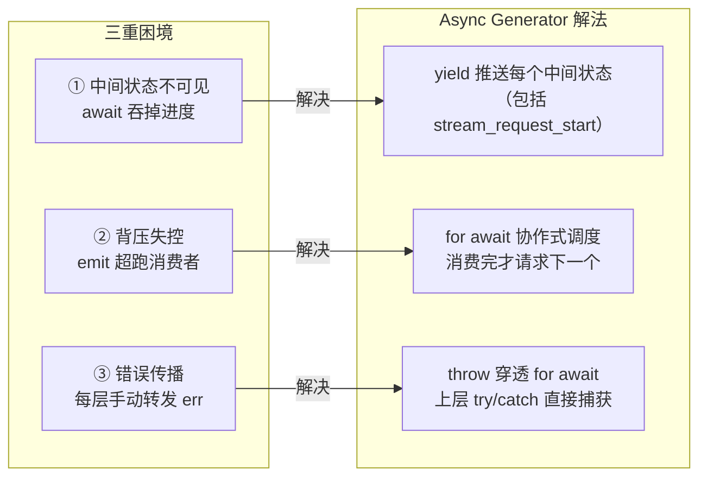
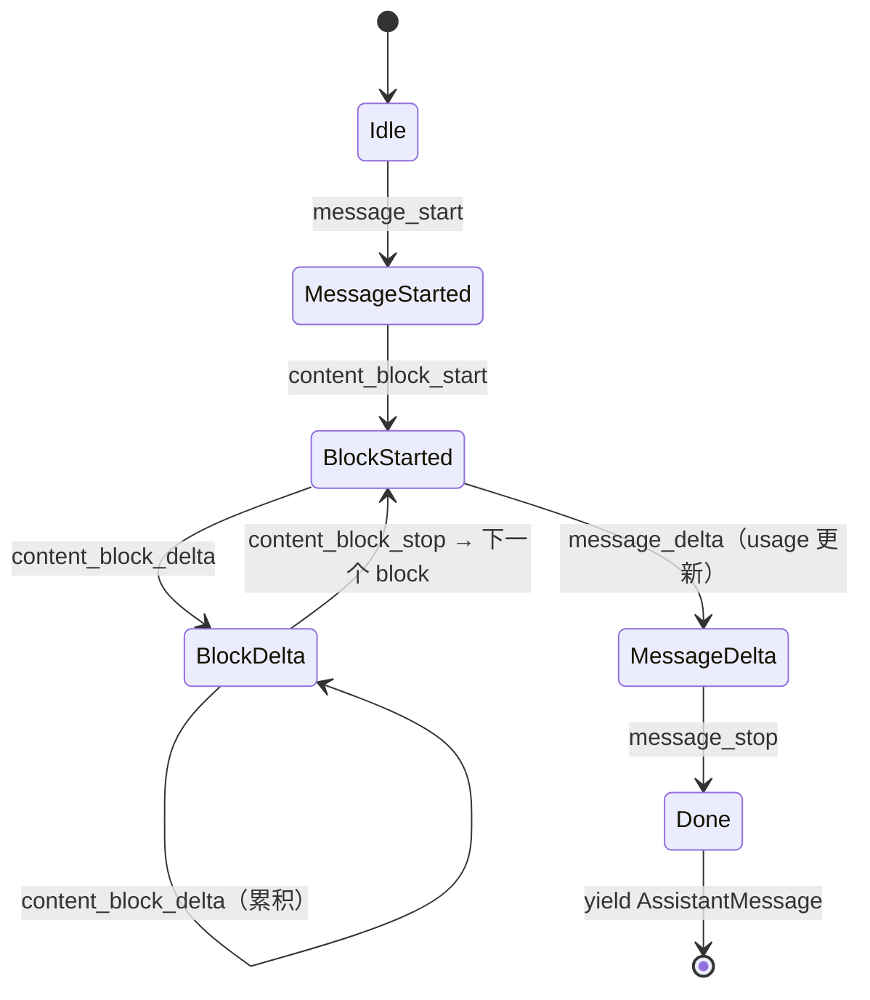
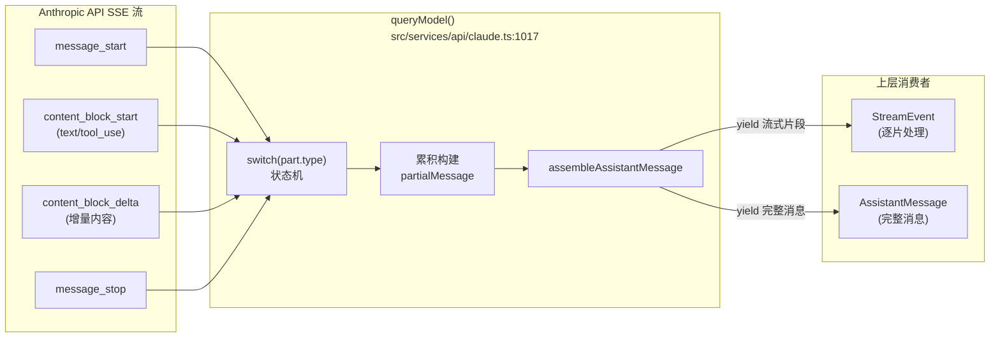
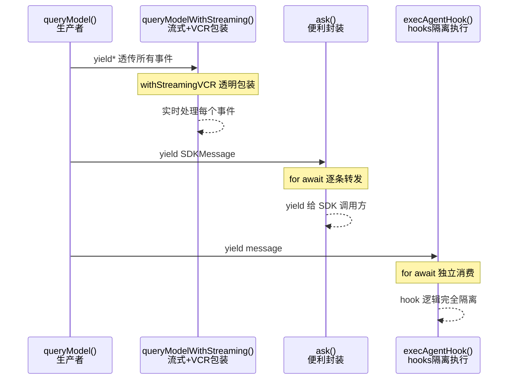
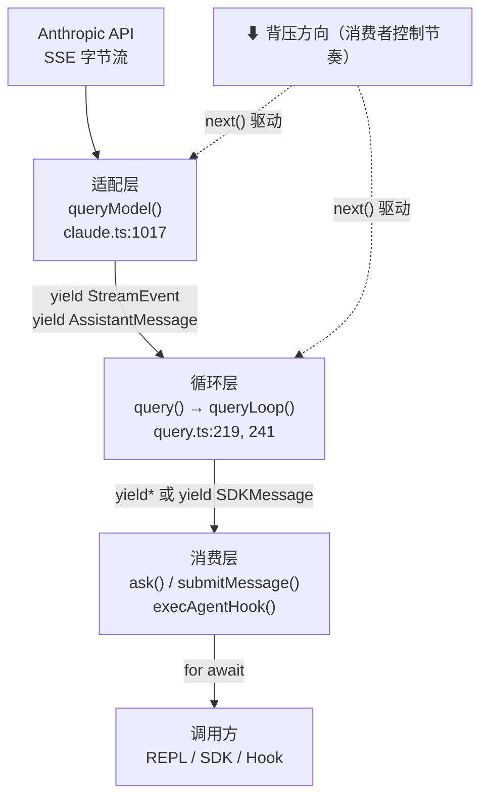

# 第 10 章：流式响应管道——异步生成器的工程应用

> "数据在抵达之前，价值就已经存在了。"

当用户在终端看到 Claude Code 逐字输出——每个词语几乎在 AI 生成的瞬间就出现在屏幕上——背后不是"魔法"，而是一个在代码库里反复出现的工程模式：**用异步生成器把不可预测的 IO 流转化为结构化事件序列**，生产者和消费者互不等待，错误自然穿透层层调用栈。

这个模式至少出现了 3 次：`queryModel()` 把 SSE 字节流转化为 `AssistantMessage` 事件序列；`ask()` 把同一个 generator 以"批量收集"方式消费；`execAgentHook()` 把它用作第三方扩展点的执行引擎。我们将把这个模式命名为**异步生成器流式适配器（Async Generator Streaming Adapter）**。

为什么 Claude Code 没有选择 EventEmitter？为什么不用 RxJS Observable？答案不在哲学偏好里，而在源码里。

---

## 问题：SSE 流的三重消费困境

我们先设想一下，如果不用 async generator，AI 流式响应的消费逻辑会是什么样的。

典型的 AI API 调用延迟在 **2 到 30 秒**之间——这是从发出请求到收到第一个字节的时间窗口。如果用 `await response.json()` 等待完整响应，用户在这段时间内看到的是空白光标，既无法感知进度，也无法中断。对于交互式 CLI，这是不可接受的。

**第一重困境：中间状态不可见**。AI 响应不是一个单一的原子值，而是一个持续增长的流——先出现文本，再出现工具调用，再出现工具结果，最后结束。每个中间状态对消费方都有价值：UI 可以据此更新渲染，日志系统可以据此记录进度，限流机制可以据此调整节奏。`await response.body()` 吞掉了所有中间状态，消费方拿到的是"死"的最终结果，而非"活"的事件流。

**第二重困境：背压控制（Backpressure）失效**。背压（Backpressure）是流式系统中的经典问题：如果生产者（API 流入字节）比消费者（UI 渲染）快，缓冲区会无限积压。传统 EventEmitter 的 `emit` 是同步的——如果渲染跟不上，事件要么丢失、要么堆积在内存中。

Async generator 用 `for await` 的**协作式调度（Cooperative Scheduling）**优雅地解决了这个问题：消费者处理完一个 `yield` 值后，才会让出控制权给生产者产出下一个值。生产者不会"超跑"，不需要显式的背压信号，不需要 RxJS 的 `throttle` 算子——控制流就是背压机制本身。

**第三重困境：错误传播失控**。在回调链中，深层 API 错误需要逐层手动传递：

```
// 回调地狱中的错误传播：每层都要手动转发 err
fetchStream((err, chunk) => {
  if (err) return topCallback(err)  // 手动转发
  parseChunk(chunk, (err2, parsed) => {
    if (err2) return topCallback(err2)  // 再次手动转发
    processResult(parsed, (err3, result) => {
      if (err3) return topCallback(err3)  // 还要转发
      topCallback(null, result)
    })
  })
})
```

Async generator 中，`throw` 穿透 `for await` 边界，直接被上层的 `try/catch` 捕获——不需要任何手动转发。这是 JavaScript 生成器协议的内建保证。

源码中 `src/query.ts:337` 有一行很有代表性的 yield：

```typescript
// src/query.ts:337
// 每轮 API 请求开始时向消费方推送的生命周期信号
yield { type: 'stream_request_start' }
```

**源码参考：** `src/query.ts:337`

**这一行揭示了设计意图**：`stream_request_start` 不是 AI 输出的内容，而是"主循环即将发起一次 API 请求"的通知。消费方收到这个信号，可以更新 UI 状态、启动计时器、或者记录日志。**中间状态是一等公民**——它和最终的 `AssistantMessage` 一样，被 `yield` 推送给消费方，而非通过副作用泄漏出去。

**图 10-1：三重困境与 Async Generator 的解法对应**



三种困境一一对应三种语言机制——这不是偶然，而是 async generator 协议的设计意图：**把 IO 流的中间状态、节奏控制、错误传播都纳入语言原语，而非应用代码的职责**。

---

## 源码实例 1：queryModel() ——从 SSE 字节流到结构化消息

我们来看流式管道的第一层。`queryModel()`（`src/services/api/claude.ts:1017`）是 SSE 协议到 Claude Code 业务层的适配器，它的函数签名就已经告诉我们它做什么：

```typescript
// src/services/api/claude.ts:1017-1027（函数签名精简版）
async function* queryModel(
  messages: Message[],
  systemPrompt: SystemPrompt,
  thinkingConfig: ThinkingConfig,
  tools: Tools,
  signal: AbortSignal,
  options: Options,
): AsyncGenerator<
  StreamEvent | AssistantMessage | SystemAPIErrorMessage,
  void
>
```

**源码参考：** `src/services/api/claude.ts:1017`

三个类型的联合返回值揭示了这个函数的全部职责：
- `StreamEvent`——SSE 协议层的原始事件（文本增量、工具调用块等流式片段）
- `AssistantMessage`——完整组装好的 AI 消息（一次 API 往返的最终结果）
- `SystemAPIErrorMessage`——将 API 层错误封装为可 yield 的事件（而非 throw）

**为什么把错误也 yield 出去，而不是 throw？** 因为流式场景中，"错误"有时是一种中间状态——例如 API 返回 429（频率限制）触发重试，这个错误需要被消费方感知（用于显示"重试中"进度），同时流式处理不能中断。用 `yield SystemAPIErrorMessage` 让错误成为可观察的事件，调用方可以选择处理（显示重试提示）、忽略（继续等待）或中断（调用 `interrupt()`）。

函数内部的核心是一个 `switch(part.type)` 状态机（`src/services/api/claude.ts:1980`）：

```typescript
// src/services/api/claude.ts:1980-2010（switch 状态机，精简版）
switch (part.type) {
  case 'message_start': {
    // SSE 流开始——初始化 partialMessage 对象，记录首字节时间（TTFT）
    partialMessage = part.message
    ttftMs = Date.now() - start
    usage = updateUsage(usage, part.message?.usage)
    break
  }
  case 'content_block_start':
    switch (part.content_block.type) {
      case 'tool_use':
        // 工具调用块开始——分配一个槽位，等待后续 delta 填充 input
        contentBlocks[part.index] = { ...part.content_block, input: '' }
        break
      case 'text':
        contentBlocks[part.index] = { ...part.content_block }
        break
    }
    break
  case 'content_block_delta':
    // 内容增量——文本追加或 tool_use input 累积
    // ...delta 应用逻辑...
    break
  case 'message_stop':
    // SSE 流结束——组装完整的 AssistantMessage 并 yield 出去
    yield assembleAssistantMessage(partialMessage, contentBlocks, ...)
    break
}
```

**源码参考：** `src/services/api/claude.ts:1980`

**这个状态机解决了 SSE 协议的根本问题**：SSE 把一次 AI 响应切成了 7 种不同类型的事件（`message_start`、`content_block_start`、`content_block_delta`、`content_block_stop`、`message_delta`、`message_stop`等），每一种都只携带部分信息。`switch` 状态机把这 7 种碎片事件**聚合**成一个完整的 `AssistantMessage` 对象——上层调用方不需要知道 SSE 协议的存在，它只需要消费 `AssistantMessage`。

**图 10-2：SSE 事件的状态转换序列**



状态转换的顺序是 SSE 协议层的约束——`message_start` 必然先于 `content_block_start`，`message_stop` 必然最后到达。`switch` 语句的 `case` 分支正是这个状态机的直接映射：每个 case 对应一个状态转换，`break` 确保转换是显式的而非穿透的。

**为什么用状态机而不是函数分派表？** 状态机的 `case` 分支有**顺序保证**——`message_start` 必然先于 `content_block_start` 到达，`message_stop` 必然在最后。函数分派表（`{ 'message_start': handleStart, ... }`）可读性类似，但 `case` 语句的**穿透控制流**（`break` 的存在）让顺序依赖更容易表达，也更符合 SSE 协议的状态转换语义。

**图 10-3：SSE 原始事件 → queryModel → 结构化消息的三段管道**



注意管道的两种输出：`StreamEvent`（流式片段，供 UI 实时渲染）和 `AssistantMessage`（完整消息，供主循环逻辑判断）并行产出——消费方可以选择性地处理其中一种或两种。**这正是异步生成器流式适配器模式的信号**：一个函数，一条调用路径，却能同时服务于不同粒度的消费需求。

---

## 源码实例 2（变体）：两种消费同一 Generator 的方式

同一个 async generator（`queryModel`）可以用截然不同的方式消费。代码库里有两个经典变体。

**变体 A：`queryModelWithStreaming()`——保持流式，扩展能力**

```typescript
// src/services/api/claude.ts:752-776（queryModelWithStreaming，精简版）
export async function* queryModelWithStreaming({
  messages, systemPrompt, thinkingConfig, tools, signal, options,
}: { /* ...类型定义... */ }
): AsyncGenerator<StreamEvent | AssistantMessage | SystemAPIErrorMessage, void> {
  // withStreamingVCR：透明包装一层录制/回放能力（VCR = Video Cassette Recorder）
  return yield* withStreamingVCR(messages, async function* () {
    // 直接委托给 queryModel——自身不添加任何逻辑，只增加 VCR 能力
    yield* queryModel(messages, systemPrompt, thinkingConfig, tools, signal, options)
  })
}
```

**源码参考：** `src/services/api/claude.ts:752`

**`yield*` 的语义是"接管控制流"，而非"调用并等待结果"**。`yield* queryModel(...)` 把 `queryModel` 产出的所有值直接透传给 `queryModelWithStreaming` 的调用者——调用者看不到任何中间包装的存在。`withStreamingVCR` 用同样方式包装整个 generator：在开发/测试环境可以录制 API 响应，之后重放而无需真正请求 API。**包装不改变接口，只扩展能力**——这是 `yield*` 委托的核心价值。

**变体 B：`ask()`——批量收集，一次性返回**

`ask()` 是 `QueryEngine` 的一个便利函数（`src/QueryEngine.ts:1186`），它用不同的策略消费同一 generator 栈：

```typescript
// src/QueryEngine.ts:1186（ask 函数入口）
export async function* ask({
  prompt, commands, cwd, tools, /* ...配置参数... */
}: { /* 类型定义 */ }): AsyncGenerator<SDKMessage, void, unknown> {
  // ask() 本身也是 async generator——它创建 QueryEngine 实例后
  // 用 for await 消费 submitMessage 的输出，再 yield 给上层调用者
  const engine = new QueryEngine({ /* 配置 */ })
  for await (const message of engine.submitMessage(prompt)) {
    yield message
  }
}
```

**源码参考：** `src/QueryEngine.ts:1186`

`ask()` 是 SDK 场景下的"便利封装"——调用方不需要手动创建 `QueryEngine` 实例，直接 `for await (const msg of ask({...}))` 即可消费流式响应。它的内部依然是 `for await` 消费 generator，而非批量等待——**这证明了流式适配器模式的层层传递性**：`ask` 是流式的，`submitMessage` 是流式的，`queryLoop` 是流式的，`queryModel` 是流式的——从 SSE 字节到 SDK 调用方，整条链路没有任何"等待全量"的阻塞点。

**第三种消费模式：`execAgentHook()`——扩展点隔离**

Hook 系统（`src/utils/hooks/execAgentHook.ts:167`）用第三种方式消费同一 generator：

```typescript
// src/utils/hooks/execAgentHook.ts:167（hooks 场景中消费 query()）
// 第三方 hook agent 在独立的 generator 循环中执行
for await (const message of query({
  messages: agentMessages,
  systemPrompt,
  userContext: {},
  systemContext: {},
  canUseTool: hasPermissionsToUseTool,
  /* ...其他参数... */
})) {
  // 处理 hook agent 的每条消息
}
```

**源码参考：** `src/utils/hooks/execAgentHook.ts:167`

Hook agent 的消费逻辑完全隔离在 `execAgentHook` 内部，既不影响主循环的状态，也不需要主循环知道 hook 的存在。`query()` 就像一个可以被任何人"插管"的水龙头：谁需要执行 AI 工具调用循环，谁就接上一个 `for await` 消费它。**这里有一个信号**——generator 让消费者成为节奏的主人，生产者（`query()`）对消费者的身份一无所知。

**图 10-4：三种消费模式对比**



三种消费模式的核心差异不在于"消费了什么"，而在于"消费者与生产者的耦合程度"：`queryModelWithStreaming` 通过 `yield*` 委托实现零侵入包装；`ask()` 通过创建新的 `QueryEngine` 实现会话隔离；`execAgentHook` 通过独立的 `for await` 循环实现执行隔离。同一个 `query()` 接口，三种生命周期语义。

---

## 模式剖析：三层 Async Generator 管道

把三个源码实例放在一起，一个清晰的结构浮现出来：

```
Claude Code 的流式响应是一个三层 async generator 栈：

  [消费者] ask() / submitMessage() / execAgentHook()
      ↕  for await / yield*
  [循环层] query() → queryLoop()          ← src/query.ts:219, 241
      ↕  yield* / for await
  [适配层] queryModel()                   ← src/services/api/claude.ts:1017
      ↕  AsyncGenerator protocol
  [协议层] Anthropic SDK SSE 流
```

每层职责单一：
- **适配层**（`queryModel`）：SSE 协议 → 结构化事件，屏蔽 HTTP 细节
- **循环层**（`queryLoop`）：多轮工具调用编排，背压自然控制（详见第 9 章）
- **消费层**（`ask`/`submitMessage`等）：面向业务场景的接口暴露，隔离调用者

**`yield*` 是层间连接的关键**。不同于普通函数调用（`return result`），`yield*` 把被委托 generator 的**控制流所有权**转移给上层——上层的每次 `next()` 请求直接驱动下层 generator 产出下一个值，中间层完全透明。这意味着背压天然传播：如果 `ask()` 的消费者停止调用 `next()`，整条链路都暂停——包括底层的 SSE 字节接收。

**协作式背压（Cooperative Backpressure）的工作原理**：JavaScript 的 `for await` 是基于微任务（microtask）的协作式调度——每次 `await` 让出主线程，其他微任务（包括 UI 更新）可以插入执行。当消费方的渲染逻辑慢于 API 流入速度时，生产者（`queryModel`）的 `yield` 会等待消费方处理完成后才继续——这是语言机制保证的，不需要显式的 `pause()` 调用或 `highWaterMark` 配置。

这就是**异步生成器流式适配器（Async Generator Streaming Adapter）**模式的完整面貌：

> 用 async generator 作为 IO 流与业务逻辑之间的适配层，通过 `yield` 推送中间状态，通过 `yield*` 实现层间委托，通过 `for await` 的协作式调度实现零配置背压控制。

**图 10-5：三层 Generator 管道的数据流向**



箭头的双向性很重要：数据向上流（yield），控制权向下流（next()）。每一层既是下层的消费者（发出 `next()`），又是上层的生产者（调用 `yield`）。

---

## 适用范围

| 场景 | 适用？ | 理由 | 替代方案 |
|------|--------|------|---------|
| 高延迟 AI/LLM API 调用（2-30 秒延迟） | ✓ | 生产速度不可预测，需要中间状态 | 无（本模式的核心应用场景） |
| HTTP SSE / WebSocket 流式接收 | ✓ | 天然适配协议的推送模型 | Node.js Transform Stream（更复杂）|
| 文件系统大文件逐行处理 | ✓ | 背压自动控制，内存友好 | `readline` 模块（更底层）|
| 数据库游标/分页查询 | ✓ | 延迟加载，避免全量加载内存 | Promise.all（全量加载，内存压力大）|
| 多播（一个 producer，多个 consumer）| ✗ | Generator 是单次使用，消费后无法重放 | Subject / BroadcastChannel |
| 需要历史重放（time travel）的流 | ✗ | Generator 消费后状态不可逆 | RxJS ReplaySubject |
| CPU 密集型同步计算 | ✗（谨慎）| `for await` 的微任务调度有额外开销 | 普通 `for` 循环 |
| 组合多个流（zip/merge/race）| ✗（需扩展）| 原生 generator 无组合算子 | `Promise.race` 或 async-iterator 库 |

Claude Code 的实践印证了表中第一行：整条流式链路（SSE → queryModel → queryLoop → ask → SDK 调用方）零等待、零缓冲，平均响应首字节时间（TTFT）直接等于 API 延迟，没有任何框架层面的额外损耗。

---

## 权衡与局限

**① Generator 调试困难**

为什么……调试 async generator 时，调用栈常常让人困惑？`yield` 是一个暂停点，当断点命中时，当前帧是 generator 函数自身，而真实调用者（通过 `for await` 消费的代码）可能已经不在栈上了——它在等待下一个 `next()` 调用，而 `next()` 还没被发出。

Claude Code 的应对策略是**结构化生命周期事件**：`src/query.ts:337` 的 `yield { type: 'stream_request_start' }` 并不携带业务数据，它的存在意义就是"打一个可观测的桩"。类似的还有 `stream_request_end`、`compact_boundary` 等——它们是手工的 trace 点，在调试工具链跟不上 generator 协议时，作为日志追踪的锚点。

**② 中间状态类型爆炸**

`queryModel` yield 的事件类型是一个三元联合：`StreamEvent | AssistantMessage | SystemAPIErrorMessage`。随着功能增长，`StreamEvent` 本身又是一个多元联合（包含 `stream_event`、`tool_use_summary`、`system` 等子类型）。**消费方必须处理所有事件类型，否则容易漏掉错误事件**。

这是 generator 的固有成本：不像 Promise 的两状态（resolve/reject），generator 可以 yield 任意多种类型的值，消费者需要逐一处理。TypeScript 的 discriminated union 是缓解手段——当所有 case 都有 `type` 字段时，`switch(msg.type)` 配合 `never` 检查可以强制穷举。

**③ 内存压力（批量消费场景）**

`ask()` 虽然本身是流式的，但如果调用方用 `for await` 收集所有输出到数组，一次 Claude 响应可能产出 **50 到 200 个事件**（文本 delta + 工具调用块 + 系统消息）。每个事件是一个 JavaScript 对象，全部保存在内存中的代价不小。

实践建议：在 SDK 调用场景中，优先逐事件处理（`for await (const msg of ask()) { handleImmediate(msg) }`），而非先收集再批量处理（`const msgs = []; for await (const msg of ask()) msgs.push(msg); batchHandle(msgs)`）。

---

## 与已知模式的对话

**① 与 EIP 管道-过滤器（Pipe-and-Filter）的比较**

EIP（企业集成模式）的管道-过滤器（Pipe-and-Filter）模式把数据处理分解为独立的过滤器（Filter），通过管道（Pipe）连接。`queryModel → queryLoop → submitMessage` 就是这个模式的 JavaScript 实现：

- 相同点：每一层是独立的 Filter（`queryModel` 做 SSE 适配，`queryLoop` 做多轮编排），层间通过 Pipe（`yield*`）连接，数据单向流动
- 不同点：EIP 原版基于线程模型，每个 Filter 有独立的线程；Claude Code 的实现是单线程协作式调度，微任务切换代替线程上下文切换，**零线程创建开销**

**② 与 Reactive Streams 背压规范（RxJS）的比较**

Reactive Streams 规范（RxJS、Project Reactor）定义了一套标准的背压协议：消费者通过 `request(n)` 向生产者声明它能接受多少元素。Async generator 的 `for await` 是一个天然的"每次 request(1)"实现——消费者处理完一个元素后，才请求下一个，生产者不会主动推送超出处理能力的数据。

- 相同点：都解决了背压问题（慢消费者不会被快生产者淹没）
- 不同点：RxJS 支持多播、操作符组合（`map/filter/zip/merge`）、历史重放；async generator 不支持这些特性，但也不需要引入约 **40KB gzip** 的依赖

**Claude Code 的选择**：不引入 RxJS，接受功能子集（单播、无重放、无内置操作符），换取零依赖和代码简洁性。如果未来需要多播或流合并，可以在 async generator 之上封装一层轻量工具函数，无需迁移整个 pipeline 到 RxJS。

| 维度 | 异步生成器流式适配器 | EIP 管道-过滤器 | RxJS Observable |
|------|--------------------|--------------------|-----------------|
| 背压控制 | 协作式（for await）| 无内置（线程阻塞）| 请求式（request(n)）|
| 多播 | ✗（单消费者）| ✓ | ✓ |
| 组合算子 | ✗（需手写）| ✓（各种适配器）| ✓（丰富算子库）|
| 错误传播 | throw 穿透 try/catch | 消息协议 | onError 回调 |
| 依赖 | 零（语言原语）| 框架依赖 | ~40KB |
| Claude Code 使用 | ✅ 全链路 | 架构概念参考 | 未引入 |

---

## 模式提炼

### 模式 1：异步生成器流式适配器（Async Generator Streaming Adapter）

**解决的问题**：高延迟 IO 流（SSE/WebSocket/文件流）无法用单一 `await` 表达，消费者需要处理中间状态且错误需从深层传播。

**核心做法**：用 `async function*` 封装 IO 流消费逻辑，通过 `yield` 推送中间状态，通过 `try/catch` + `throw` 传播错误，通过 `for await` 的协作式调度实现零配置背压。

**前置条件**：IO 流有多种中间状态值（非原子结果）；单消费者（不需要多播）；语言运行时支持 async generator（Node.js 10+、Bun、Deno）。

**源码证据**：`src/services/api/claude.ts:1017`（`queryModel`，SSE 适配层）；`src/query.ts:219`（`query`，循环层入口）；`src/QueryEngine.ts:1186`（`ask`，消费层封装）

---

### 模式 2：生命周期信号注入（Lifecycle Signal Injection）

**解决的问题**：Async generator 的执行过程难以从外部观测，日志和调试工具难以追踪 generator 的内部进度。

**核心做法**：在 generator 函数的关键节点主动 `yield { type: 'lifecycle_event_name' }` ——这类不携带业务数据的事件仅用于追踪目的，消费者可以选择处理（日志）或忽略（`continue`）。

**前置条件**：Generator 有多个内部阶段需要追踪；调试工具链对 generator 支持有限；消费者能以低成本过滤非业务事件。

**源码证据**：`src/query.ts:337`（`yield { type: 'stream_request_start' }` 轮次开始信号）

---

### 模式 3：`yield*` 委托薄壳（Yield-Star Delegation Thin Shell）

**解决的问题**：需要在不改变 generator 接口的前提下，为现有 generator 扩展新能力（录制/回放、监控、限流等）。

**核心做法**：用 `yield* wrappedGenerator()` 创建透明包装层——外层 generator 不添加任何业务逻辑，仅在调用 `yield*` 前后插入横切关注点（VCR 录制、metrics 记录等）。调用方看不到包装层的存在。

**前置条件**：新能力是横切关注点（与核心逻辑正交）；接口稳定，不需要修改已有消费方；语言支持 `yield*` 委托语法。

**源码证据**：`src/services/api/claude.ts:752`（`queryModelWithStreaming`，用 `yield* withStreamingVCR(...)` 添加 VCR 能力）

---

## 你能做什么

- **将你现有的 `await response.json()` 替换为 async generator**，让 UI 在首字节到达时就开始渲染，而非等待完整响应。参考 `queryModel()` 的三元 yield 设计，用 `StreamEvent | FinalResult | ErrorMessage` 描述流的三种输出类型。

- **给你的 async generator 函数命名**（不要用匿名箭头函数）。调试时具名函数会在调用栈中显示，而 `async () => { yield ... }` 只显示为 `anonymous`。

- **为 generator yield 的事件类型定义 TypeScript discriminated union**，在 switch-case 末尾加 `default: const _: never = event` 检查——TypeScript 会在漏掉任何事件类型时报错，防止遗漏错误事件处理。

- **用生命周期信号模式在关键节点插入追踪**：`yield { type: 'request_start', timestamp: Date.now() }` 和 `yield { type: 'request_end', durationMs }` 。消费者可以在处理这些信号时记录日志，不影响正常业务流程。参考 `src/query.ts:337` 的 `stream_request_start` 模式。

- **用 `yield*` 委托为现有 generator 添加横切能力**，而非修改 generator 内部逻辑。需要添加监控？`yield* withMetrics(yourGenerator())`；需要添加限流？`yield* withRateLimit(yourGenerator(), { rps: 10 })`——接口不变，能力可插拔。参考 `queryModelWithStreaming` 的 `withStreamingVCR` 封装。

- **在子 Agent 或 hook 执行场景中，用 `for await` 消费独立的 `query()` 实例**，而非在主循环内嵌套循环。独立 `for await` 保证了完全隔离——子 Agent 的 generator 状态（错误、中止）不会传播到父级循环。参考 `execAgentHook.ts:167`。

- **深入探索 TC39 的 AsyncIterator Helpers 提案（Stage 3）**：原生的 `iterator.map()`、`iterator.filter()`、`iterator.take(N)` 算子即将进入浏览器和 Node.js，届时 async generator 的组合能力将大幅提升，不再需要手写 for-await 循环来实现过滤和转换。

---

流式响应管道将 SSE 字节流转化为结构化事件序列，最终这些事件以工具调用的形式驱动 `queryLoop` 继续迭代（详见第 9 章）。而工具的接口契约——每个工具必须实现什么接口、工具调用如何被编排执行——将在第 14 章展开。
