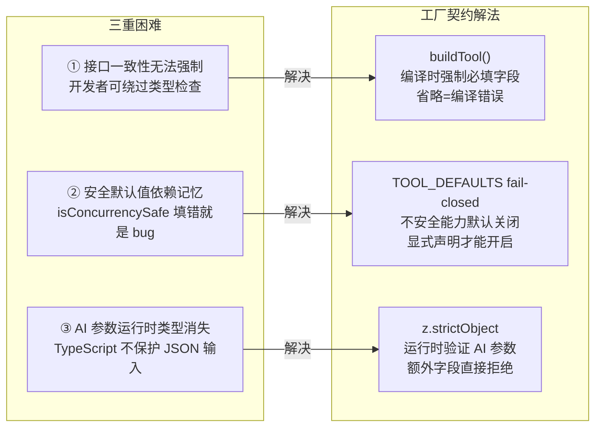
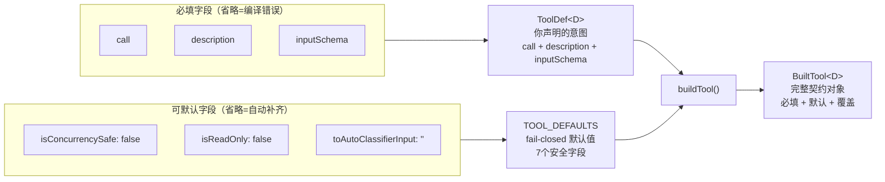
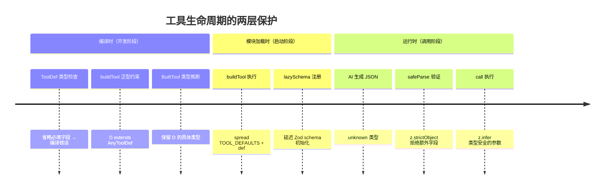
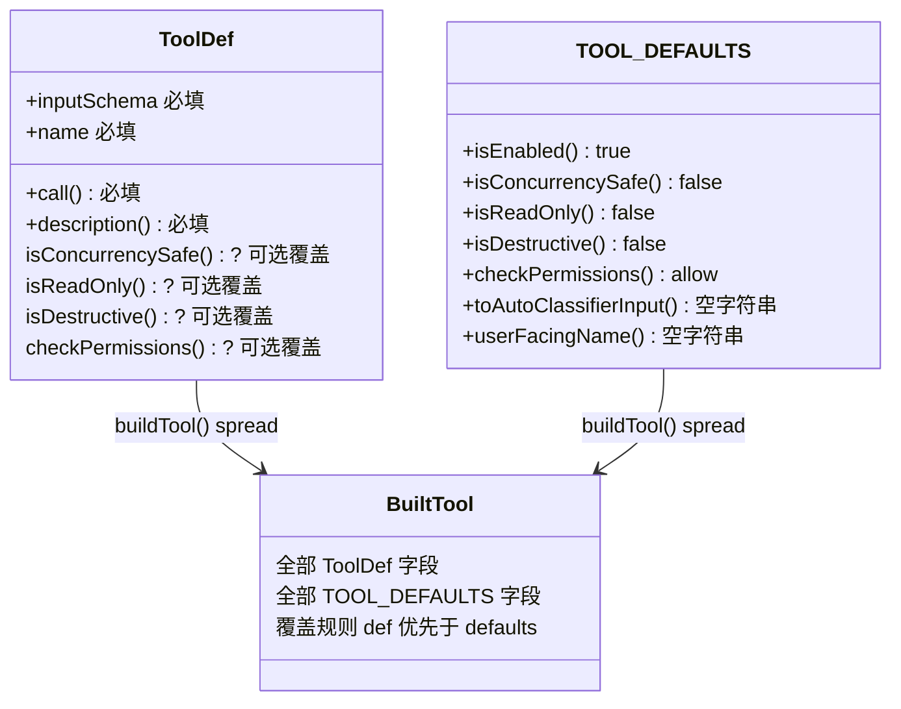

# 第 10 章：工具注册契约——buildTool() 工厂与 Zod 运行时边界

> "工厂函数不是创建对象的地方，而是实施契约的地方。"

在 Claude Code 的工具系统中，58 种工具都通过同一个工厂函数注册——这个模式至少出现了 3 次：**`buildTool()`** 在编译时把"你声明的 `ToolDef`"和"安全的 `TOOL_DEFAULTS`"合并为完整契约；**`FileWriteTool`** 接受所有默认值，因为文件写入本就不该并发；**`FileReadTool`** 显式覆盖两个字段，因为读取操作确实是只读且并发安全的。我们把这两个协同工作的机制命名为**工厂契约（Factory Contract）**和**Schema 即运行时边界（Schema as Runtime Boundary）**。

这两个模式解决了两件不同的事：工厂契约让接口一致性从"开发者自律"变成"编译器强制"；Schema 边界让 TypeScript 的类型检查从编译时延伸到运行时，拦截 AI 生成的格式错误。

为什么不让所有工具直接实现 `Tool` 接口？为什么用 `z.strictObject` 而非 `z.object`？答案不在设计偏好里，而在 `TOOL_DEFAULTS` 那条注释里。

---

## 问题：工具注册的三重困难

我们先设想一下，如果不做任何架构设计，58 种工具的注册代码会是什么样的。

Claude Code 的工具要求实现一个包含 `call`、`description`、`inputSchema`、`isReadOnly`、`isConcurrencySafe`、`isDestructive`、`checkPermissions`、`toAutoClassifierInput`、`userFacingName` 等字段的 `Tool` 接口。如果让每个工具直接实现这个接口，**58 种工具需要 58 次"填写这 9+ 个字段"的决定**，其中多个字段涉及安全性——遗漏一次或填错一次，就是安全漏洞。

**第一重困难：接口一致性无法强制保证**。"让工具开发者实现接口"是 OOP 的经典做法，但在 TypeScript 中，开发者可以用类型断言绕过接口检查，也可以忘记实现某个可选方法，让调用方在运行时碰到 `undefined is not a function`。**接口是文档，工厂是合同**——工厂函数在编译时强制要求所有必填字段存在，省略就是编译错误，无法绕过。

**第二重困难：安全默认值需要开发者主动正确填写**。`isConcurrencySafe` 该填 `true` 还是 `false`？开发者看到一个不确定的工具，很可能倾向于填 `true`（"我觉得可以并发"）。但错误的后果是并发写冲突、数据损坏——比性能损失严重得多。**安全字段应该默认关闭，需要开发者显式声明安全，而非显式声明不安全**。每次让开发者手动填写安全字段，就是一次依赖"记忆"的脆弱决策。

**第三重困难：AI 参数的类型安全在运行时消失**。工具的 `call` 方法接受 `z.infer<InputSchema>` 类型的参数——这个类型保证只在编译时有效。当 AI 生成一段 JSON 字符串并被反序列化时，TypeScript 已经消失，运行时拿到的是 `unknown`。如果 AI 在 `file_path` 字段里传了 `null`，或者带了一个不在 schema 里的 `debug: true` 字段，TypeScript 无能为力——需要一套运行时验证机制在 `call()` 触发前拦截格式错误。

源码中 `src/Tool.ts:749` 有一段很有代表性的注释：

```typescript
// src/Tool.ts:749
/**
 * Defaults (fail-closed where it matters):
 * - `isEnabled` → `true`
 * - `isConcurrencySafe` → `false` (assume not safe)
 * - `isReadOnly` → `false` (assume writes)
 * - `isDestructive` → `false`
 * - `checkPermissions` → `{ behavior: 'allow', updatedInput }`（委托给通用权限系统处理）
 * - `toAutoClassifierInput` → `''`（跳过分类器——安全相关工具必须覆盖此字段）
 * - `userFacingName` → `name`
 */
```

**源码参考：** `src/Tool.ts:749`

**这段注释揭示了设计意图**：注释标题是 `Defaults (fail-closed where it matters)`。"fail-closed"意味着：**不确定时，选择更保守的选项**。`isConcurrencySafe: false` 假设不安全（宁可串行）；`isReadOnly: false` 假设会写（宁可触发权限检查）；`toAutoClassifierInput: ''` 跳过分类器（安全工具必须显式参与分类，不能靠默认混入）。每一个默认值都是"保守优先"的体现。**安全不是例外，是默认**。

**图 10-1：三重困难与工厂契约的解法对应**



三种困难一一对应三种解法——这不是偶然，而是"工厂契约 + Schema 运行时边界"模式的完整设计意图：**把接口一致性、安全默认值、运行时类型安全三个关注点都纳入基础设施，而非应用代码的职责**。

---

## 源码实例 1：buildTool() ——工厂函数的契约实施

我们来看工厂契约的核心。`buildTool()`（`src/Tool.ts:783`）的函数签名就已经告诉我们它的设计意图：

```typescript
// src/Tool.ts:783
export function buildTool<D extends AnyToolDef>(def: D): BuiltTool<D> {
  // 运行时的展开操作本身很直接；`as` 类型断言弥合了
  // 结构化 any 约束和精确的 BuiltTool<D> 返回类型之间的差距。
  // 类型语义的正确性由对 60+ 个工具的 0 错误类型检查所证明。
  return {
    ...TOOL_DEFAULTS,
    userFacingName: () => def.name,
    ...def,
  } as BuiltTool<D>
}
```

**源码参考：** `src/Tool.ts:783`

5 行代码。`D extends AnyToolDef` 约束确保输入必须满足 `ToolDef` 类型；返回类型 `BuiltTool<D>` 保留了 `D` 的完整泛型信息——调用方仍然知道具体的工具类型，而不是退化为通用的 `Tool`。

函数体是三行 spread：先铺 `TOOL_DEFAULTS`（7 个安全默认值），再用 `userFacingName: () => def.name` 注入工具名，最后用 `...def` 覆盖——**工具开发者的显式声明优先级高于默认值**。这意味着开发者可以选择接受所有默认值（最简单），也可以精确覆盖其中某几个（按需定制）。

**为什么用 spread 而非继承？** 因为 TypeScript 的类继承会引入原型链、`this` 绑定、`super()` 调用等复杂性；spread 是纯粹的对象组合，没有副作用，没有动态绑定——工具定义就是一个普通对象字面量，整个创建过程是同步的、可预测的。

`TOOL_DEFAULTS` 的完整内容（`src/Tool.ts:758`）是 fail-closed 哲学的物理实体：

```typescript
// src/Tool.ts:758
const TOOL_DEFAULTS = {
  isEnabled: () => true,
  isConcurrencySafe: (_input?: unknown) => false,   // 假设不并发安全
  isReadOnly: (_input?: unknown) => false,           // 假设会写
  isDestructive: (_input?: unknown) => false,
  checkPermissions: (
    input: { [key: string]: unknown },
    _ctx?: ToolUseContext,
  ): Promise<PermissionResult> =>
    Promise.resolve({ behavior: 'allow', updatedInput: input }),
  toAutoClassifierInput: (_input?: unknown) => '',   // 跳过分类器
  userFacingName: (_input?: unknown) => '',
}
```

**源码参考：** `src/Tool.ts:758`

注意 `toAutoClassifierInput: ''` 的默认值：安全相关的自动分类器遇到空字符串会**跳过分类**。如果工具不覆盖此字段，它不会被 AI 分类器看到——这是对"安全相关工具必须显式参与分类"原则的强制执行。相比"默认参与分类，开发者选择退出"，"默认不参与，开发者选择加入"更安全，因为遗漏退出是安全漏洞，遗漏加入只是功能不可用。

**`ToolDef` 和 `BuiltTool` 的类型关系**（`src/Tool.ts:721`）揭示了工厂的类型层面工作原理：

```typescript
// src/Tool.ts:721
export type ToolDef<Input, Output, P> =
  Omit<Tool<Input, Output, P>, DefaultableToolKeys> &
  Partial<Pick<Tool<Input, Output, P>, DefaultableToolKeys>>
```

**源码参考：** `src/Tool.ts:721`

`ToolDef` 是 `Tool` 的子集：**省略**了 `DefaultableToolKeys` 中的 7 个字段（强制不填），**可选**了这 7 个字段（允许覆盖）。这个类型系统设计确保了：开发者无法在 `ToolDef` 中省略 `call`、`description`、`inputSchema`（必填），但可以省略任何可默认字段（它们会被工厂自动补齐）。**省略必填字段 = 编译错误；省略可选字段 = 工厂补充默认值**。这正是"接口文档变成代码合同"的含义。

**图 10-2：buildTool() 工厂的数据流**



图 10-2 展示了工厂的双输入结构：必填字段来自工具开发者的 `ToolDef`，可默认字段来自 `TOOL_DEFAULTS`，两者在工厂中合并。注意 spread 的优先级：`...def` 在 `...TOOL_DEFAULTS` 之后，确保开发者的显式声明总能覆盖默认值——想让一个工具并发安全，只需在 `def` 中提供 `isConcurrencySafe: () => true`。

---

## 源码实例 2（变体）：三种工具注册策略

同一个 `buildTool()` 工厂，58 种工具可以采用截然不同的注册策略。代码库里有 3 个典型变体。

**变体 A：`FileWriteTool` ——接受所有安全默认值**

`FileWriteTool` 的注册调用（`src/tools/FileWriteTool/FileWriteTool.ts:94`）：

```typescript
// src/tools/FileWriteTool/FileWriteTool.ts:94
export const FileWriteTool = buildTool({
  name: FILE_WRITE_TOOL_NAME,
  searchHint: 'create or overwrite files',
  maxResultSizeChars: 100_000,
  strict: true,
  async description() {
    return 'Write a file to the local filesystem.'
  },
  get inputSchema(): InputSchema { return inputSchema() },
  get outputSchema(): OutputSchema { return outputSchema() },
  toAutoClassifierInput(input) {
    return `${input.file_path}: ${input.content}`  // 覆盖：参与 AI 分类
  },
  // ... call() 等其余字段
})
```

**源码参考：** `src/tools/FileWriteTool/FileWriteTool.ts:94`

注意 `FileWriteTool` 的 `def` 中**没有** `isReadOnly` 和 `isConcurrencySafe`——它接受了 `TOOL_DEFAULTS` 的保守默认值：`isReadOnly: false`（写文件确实会修改文件系统），`isConcurrencySafe: false`（写操作不应并发执行，避免写冲突）。**两个默认值都是正确的**，无需覆盖。

但它覆盖了 `toAutoClassifierInput`，因为文件写入是一个需要 AI 分类器关注的操作——返回 `file_path + content` 让分类器能看到具体内容，做出更准确的权限判断。这是"默认不参与分类，安全相关工具显式加入"原则的正面案例。

**变体 B：`FileReadTool` ——精确覆盖两个关键字段**

`FileReadTool` 的注册（`src/tools/FileReadTool/FileReadTool.ts:337`）：

```typescript
// src/tools/FileReadTool/FileReadTool.ts:373（isConcurrencySafe 和 isReadOnly 覆盖）
  isConcurrencySafe() {
    return true   // 覆盖默认的 false：读取操作并发安全
  },
  isReadOnly() {
    return true   // 覆盖默认的 false：读取操作不修改文件系统
  },
```

**源码参考：** `src/tools/FileReadTool/FileReadTool.ts:373`

这两行是整个"工厂契约"模式的最直接证据——显式覆盖默认值，精确声明工具的安全属性。**`isConcurrencySafe: true` 使 `QueryEngine` 能够并发执行多个文件读取操作**（详见第 8 章的工具调度逻辑）。如果不覆盖这个字段，多个并发代码搜索请求会被降级为串行，性能损失可能达到数倍。**"知道自己是安全的，显式声明"** 比"默认安全，出错再改"成本低得多。

**变体 C：`z.strictObject` ——Schema 即运行时边界**

`FileWriteTool` 的 `inputSchema` 定义（`src/tools/FileWriteTool/FileWriteTool.ts:56`）展示了第三个模式：

```typescript
// src/tools/FileWriteTool/FileWriteTool.ts:56
const inputSchema = lazySchema(() =>
  z.strictObject({
    file_path: z
      .string()
      .describe(
        'The absolute path to the file to write (must be absolute, not relative)',
      ),
    content: z.string().describe('The content to write to the file'),
  }),
)
```

**源码参考：** `src/tools/FileWriteTool/FileWriteTool.ts:56`

**`z.strictObject` 而非 `z.object` 是一个精确的安全决策**。`z.object` 静默忽略 schema 中未声明的额外字段；`z.strictObject` 拒绝任何额外字段并返回 `ZodError`。为什么这很重要？因为额外字段可能是**提示词注入**的载体——如果攻击者诱导 AI 在工具调用中附上 `overwrite_protection: false`，`z.strictObject` 会在 `call()` 触发前就拦截它，而 `z.object` 会让它无声地通过。

`lazySchema(() => z.strictObject(...))` 中的 `lazySchema` 是另一个微妙设计：schema 的初始化被**延迟到第一次调用时**。Claude Code 启动时会同时加载所有 58 个工具模块；如果每个工具的 schema 都在模块加载时立即构建，启动时间会线性增加。延迟初始化让每个 schema 只在实际需要时（第一次工具调用时）才初始化。

**图 10-3：三种变体的字段来源对比**

| 字段 | FileWriteTool | FileReadTool | 来源 |
|------|---------------|--------------|------|
| `name` | `FILE_WRITE_TOOL_NAME` | `FILE_READ_TOOL_NAME` | ToolDef 必填 |
| `call` | `async call(...)` | `async call(...)` | ToolDef 必填 |
| `inputSchema` | `z.strictObject(...)` | `z.strictObject(...)` | ToolDef 必填 |
| `isEnabled` | `() => true`（默认）| `() => true`（默认）| TOOL_DEFAULTS |
| `isReadOnly` | `() => false`（**默认**）| `() => true`（**覆盖**）| FileReadTool 显式覆盖 |
| `isConcurrencySafe` | `() => false`（**默认**）| `() => true`（**覆盖**）| FileReadTool 显式覆盖 |
| `toAutoClassifierInput` | `file_path + content`（覆盖）| `file_path`（覆盖）| 两者均覆盖 |
| `isDestructive` | `() => false`（默认）| `() => false`（默认）| TOOL_DEFAULTS |

图 10-3 揭示了契约弹性的核心机制：**必填字段保证接口一致性；可默认字段允许行为差异**。工厂函数连接两者——确保所有必填字段存在，同时允许工具开发者通过覆盖可选字段声明工具的精确行为特性。

**图 10-4：Zod 运行时验证的位置**

```mermaid
sequenceDiagram
    participant AI as AI 模型
    participant QE as QueryEngine
    participant Schema as inputSchema.safeParse()
    participant Call as tool.call()

    AI->>QE: 工具调用 JSON（unknown 类型）
    QE->>Schema: 验证参数格式
    alt 验证通过
        Schema-->>QE: z.infer&lt;Input&gt;（类型安全）
        QE->>Call: call(verified_args)
        Call-->>QE: ToolResult
    else 验证失败（额外字段/类型错误）
        Schema-->>QE: ZodError（字段路径 + 原因）
        QE-->>AI: 错误反馈，请重新生成参数
    end
```

`inputSchema.safeParse()` 是 TypeScript 类型系统与 AI 动态输出之间的分水岭。只有通过这道门的输入，才能进入类型安全的 `call()` 方法。`ZodError` 包含精确的字段路径和错误描述，AI 可以据此修正参数重试——这是 Agent 容错循环的一部分。

---

## 模式剖析：两层注册契约

把三个变体放在一起，一个清晰的层次结构浮现出来：

```
Claude Code 的工具注册是一个两层契约体系：

  [消费层] QueryEngine / 工具调用 / 权限系统
      ↕  Tool 接口（统一调用入口）
  [注册层] buildTool()                       ← src/Tool.ts:783
      ↕  ToolDef（必填） + TOOL_DEFAULTS（可默认）
  [类型层] Tool / ToolDef / DefaultableToolKeys  ← src/Tool.ts:362, 707, 721
      ↕  TypeScript 编译时类型约束
  [验证层] z.strictObject()                  ← 每个工具的 inputSchema
      ↕  Zod 运行时 JSON 验证
  [调用方] AI 生成的 JSON 参数
```

每层职责单一：
- **类型层**（`Tool`/`ToolDef`）：在编译时定义"合法的工具是什么形状"，强制必填字段
- **注册层**（`buildTool`/`TOOL_DEFAULTS`）：在模块加载时将工具定义合并为完整契约，注入安全默认值
- **验证层**（`z.strictObject`）：在运行时验证 AI 传入的 JSON 参数，拦截格式错误
- **消费层**（`QueryEngine`）：以统一接口遍历 58 种工具，对接口差异一无所知

**编译时与运行时的接力保护**是这个模式的核心机制。`ToolDef` 类型保护开发者编写的代码（编译时）；`z.strictObject` 保护运行时来自 AI 的 JSON 输入。两者覆盖的时间点不同，但防线连续——类型系统在编译时结束的地方，Zod 在运行时接管。

这就是**工厂契约（Factory Contract）**和**Schema 即运行时边界（Schema as Runtime Boundary）**两个模式协同工作的完整面貌：

> 工厂函数不仅创建对象，更是接口契约的强制实施者：它通过类型系统在编译时确保必填字段存在，通过 fail-closed 默认值注入安全基线，通过 `z.strictObject` schema 将类型约束延伸到运行时边界——三个机制覆盖工具从注册到调用的全生命周期。

**图 10-5：两层契约的时间轴**



图 10-5 展示了三个不同时间点的保护机制：编译时的 TypeScript 类型系统、模块加载时的工厂 spread、运行时的 Zod 验证。**没有任何一个时间点是盲区**——类型系统、工厂默认值、运行时验证共同构成了一个无缝的保护链。

---

**图 10-6：ToolDef、TOOL_DEFAULTS、Tool 的关系**



`ToolDef` 中的可选字段和 `TOOL_DEFAULTS` 中的同名字段，最终由 `...def`（优先）合并——开发者的显式声明总能覆盖框架的默认值。未在 `ToolDef` 中出现的可选字段，则自动使用 `TOOL_DEFAULTS` 的保守值。

---

## 适用范围

| 场景 | 适用？ | 理由 | 替代方案 |
|------|--------|------|---------|
| Agent 工具系统（本例，>5 种工具）| ✓ | 工具数量增加时，工厂契约的收益超过学习成本 | 直接实现接口（工具≤5时） |
| 插件系统（宿主-插件架构）| ✓ | 第三方插件开发者不熟悉系统内部，工厂函数是最低摩擦的正确路径 | — |
| API 网关（多后端统一对外）| ✓ | 后端接口差异大，工厂统一注册确保对外一致性 | GraphQL schema |
| 处理来自外部的动态输入（AI、用户表单）| ✓ | Zod `strictObject` 拦截额外字段，防止注入 | 手写验证函数 |
| 需要序列化配置到 JSON（工具元数据）| ✓ | Zod schema 可以导出 JSON Schema，双向使用 | 手写 JSON Schema |
| 工具数量 ≤ 5 的小系统 | ✗（可能过度）| 工厂的收益在工具数量增加时才体现 | 直接实现接口 |
| 工具链（A 的输出是 B 的输入）| ✗（不覆盖）| `buildTool` 管理单个工具，不管理工具间数据流 | Pipeline 模式 |
| 运行时动态注册新字段类型（插件扩展 schema）| ✗（受限）| TOOL_DEFAULTS 是编译时常量，不支持运行时扩展 | 工具注册表 + 接口 |

Claude Code 的实践印证了表中第一行：58 种工具通过同一个 `buildTool()` 注册，`QueryEngine` 无需了解任何具体工具类型，统一遍历 `Tools` 数组，0 个"某工具的特殊逻辑"分支。

---

## 权衡与局限

**① `TOOL_DEFAULTS` 是全局固化的，无法按类别差异化**

7 个默认字段对所有 58 种工具都使用相同的值。如果你想为"网络请求类工具"设置默认 `timeout: 5000`，为"文件操作类工具"设置默认 `timeout: 1000`，当前的 `buildTool()` 模式无法支持——`TOOL_DEFAULTS` 是一个编译时常量，不能动态区分工具类别。解决方案是设计一套"分类工厂"系统（`buildNetworkTool()`、`buildFileTool()` 等），每类工厂有自己的默认值，代价是多维护几个工厂函数。

**② Zod 只管格式，不管语义**

`z.strictObject({ file_path: z.string() })` 验证 `file_path` 是字符串类型，但不能验证"字符串是否是合法的文件路径"、"路径是否在沙箱范围内"、"文件是否存在"。这些**语义约束**需要在 `call()` 方法的业务逻辑中验证，Zod 无法替代它们。实践原则：**格式归 Zod，语义归业务层**——不要用 `.refine()` 把复杂业务规则塞进 schema，那会让 schema 难以维护。

**③ `BuiltTool<D>` 的类型复杂性**

`BuiltTool<D>` 的类型定义（`src/Tool.ts:735`）是一个条件类型（conditional type）——对于每个 `DefaultableToolKeys`，它需要推断"工具是否提供了该字段"来决定类型。这在大型工具定义（包含多个可选字段）时可能导致 TypeScript 的类型推断变慢，在 IDE 中出现短暂的"类型计算中"延迟。这是 TypeScript 高级类型特性的固有代价，当前 58 种工具的规模下可以接受，但如果工具数量增长到数百种，可能需要考虑简化类型层设计。

---

## 与已知模式的对话

**① 与 GoF 抽象工厂（Abstract Factory）的比较**

GoF 抽象工厂：**"提供一个创建一族相关对象的接口，而不指定具体类。"** 抽象工厂的核心价值是让调用方与具体类解耦——调用方只知道工厂接口，不知道生产了哪种具体对象。

Claude Code 的 `buildTool()` 出发点完全不同：它**不隐藏具体类型**——`BuiltTool<D>` 的泛型参数 `D` 保留了工具的精确类型信息。它的核心价值不是"解耦具体类"，而是"强制契约落地"——确保每个工具都正确实现了接口的必填部分，并注入了安全的默认值。**抽象工厂解决"创建哪种产品"的决策问题；工厂契约解决"确保产品合格"的质量问题**。

**② 与 GoF 模板方法（Template Method）的比较**

GoF 模板方法：**"在父类定义算法骨架，将某些步骤的实现延迟到子类。"** 模板方法依赖继承，父类提供"默认步骤"，子类覆盖具体实现——这和 `TOOL_DEFAULTS` + `...def` 的结构看起来非常相似。

关键差异：`buildTool()` 通过**组合（spread）**而非**继承**实现"默认值 + 覆盖"效果。这是 TypeScript 函数式风格的典型选择——避免了 class 继承的原型链、`this` 绑定、`super()` 复杂性，工具定义是一个普通对象字面量，不需要 `class extends BaseTool`。**在需要"默认行为 + 局部覆盖"时，组合比继承更轻量，也更容易测试**。

| 维度 | 工厂契约（buildTool）| GoF 抽象工厂 | GoF 模板方法 |
|------|---------------------|------------|------------|
| 核心价值 | 强制契约 + 安全默认 | 解耦具体类 | 算法骨架 + 钩子 |
| 扩展机制 | 对象 spread 组合 | 工厂类继承 | 类继承覆盖 |
| 类型信息 | 保留具体类型（泛型）| 退化为抽象类型 | 保留（子类化）|
| 默认值来源 | 常量（`TOOL_DEFAULTS`）| 工厂方法 | 父类实现 |
| 测试方式 | 直接构造对象字面量 | 需要 mock 工厂 | 需要实例化子类 |
| Claude Code 使用 | ✅ 完整实现 | 架构概念参考 | 架构概念参考 |

---

## 模式提炼

### 模式 1：工厂契约（Factory Contract）

**解决的问题**：当工具数量增大（≥10 种），如何确保所有工具正确实现统一接口，同时允许行为差异，且不依赖开发者自律？

**核心做法**：工厂函数不仅创建工具对象，更通过类型系统强制接口规范（省略必填字段 = 编译错误），通过 fail-closed 常量注入安全基线，允许工具开发者显式覆盖可默认字段（覆盖 `...def` 优先于 `...TOOL_DEFAULTS`）。

**前置条件**：工具数量 ≥10，工具接口有"必填字段 + 可选字段"的明确分层，有安全相关的字段需要保守默认值。

**源码证据**：`src/Tool.ts:783`（`buildTool()`）；`src/Tool.ts:758`（`TOOL_DEFAULTS`，注释："fail-closed where it matters"）

---

### 模式 2：失败关闭默认值（Fail-Closed Defaults）

**解决的问题**：安全相关字段（是否并发安全、是否只读、是否需要权限检查）的默认值，是"开放（true）"还是"关闭（false）"更安全？当开发者不确定时，框架应该怎么选？

**核心做法**：所有安全相关字段默认为保守值（`isConcurrencySafe: false`、`isReadOnly: false`），需要开放的能力由工具开发者显式声明。遗漏显式声明的后果是性能损失（串行执行），而非安全漏洞（并发写冲突）。

**前置条件**：框架需要为大量开发者提供默认行为；安全字段的"错误开放"后果比"错误关闭"严重。

**源码证据**：`src/Tool.ts:749`（注释："Defaults (fail-closed where it matters)"）；`src/tools/FileReadTool/FileReadTool.ts:373`（`FileReadTool` 显式覆盖 `isConcurrencySafe: true`）

---

### 模式 3：Schema 即运行时边界（Schema as Runtime Boundary）

**解决的问题**：TypeScript 类型系统在 AI 生成的动态 JSON 面前失效——运行时拿到的是 `unknown`，不是编译时声明的类型。如何确保 `call()` 方法收到的参数是类型安全的？

**核心做法**：每个工具的 `inputSchema` 使用 `z.strictObject`，在 `call()` 触发前验证 AI 传入的 JSON。`strictObject` 拒绝额外字段（防注入），`safeParse` 失败时返回 `ZodError`（含字段路径和原因），AI 可以根据错误信息重新生成参数。

**前置条件**：工具输入来自外部动态来源（AI、用户表单、API）；需要防止额外字段注入；需要精确的错误反馈（而非通用的"参数无效"）。

**源码证据**：`src/tools/FileWriteTool/FileWriteTool.ts:56`（`z.strictObject({ file_path, content })`）；`src/Tool.ts:380`（`call` 方法的参数类型 `z.infer<Input>`，强制调用方先验证）

---

## 你能做什么

- **用工厂函数替代"让工具实现接口"的要求**，在有 10 种以上工具的系统中。工厂函数把"你应该提供这些字段"的文档要求变成编译时强制——省略必填字段直接报错，而不是等到运行时崩溃。参考 `buildTool()` 的 `ToolDef` 约束设计。

- **为你的工具集定义 `TOOL_DEFAULTS`，并写注释说明每个默认值的设计理由**。学习 `src/Tool.ts:749` 的注释风格：不只写"默认值是 false"，还要写"为什么选 false 而非 true"（fail-closed where it matters）。这让未来的维护者理解意图，而不是盲目修改默认值。

- **用 `z.strictObject` 代替 `z.object` 处理来自外部的参数**（AI 输出、用户表单、第三方 API 回调）。严格 schema 拒绝额外字段，是防御参数注入的第一道防线。合法调用方通常不会带额外字段；带额外字段的调用通常是异常或攻击。

- **拆分 `ToolDef`（输入）和 `Tool`（输出）两个类型**，用 TypeScript 区分"你声明的"和"框架补全的"。这让编译器在你试图构造缺少必填字段的工具时立即报错，而不是在运行时出现 `undefined is not a function`。

- **在工具的 `toAutoClassifierInput` 字段中显式加入或排除分类器**。默认值 `''` 让工具不参与 AI 自动分类——如果你的工具有安全敏感操作（写文件、执行命令），显式覆盖此字段让分类器能做出更准确的权限决策。

- **把 schema 初始化用 `lazySchema` 延迟**，避免所有工具在模块加载时就构建 Zod schema。特别是在有大量工具的系统里，延迟初始化能显著降低应用启动时间——用户只为"实际调用的工具"付出 schema 构建成本。

- **用 `override: true/false` 的思路审查你的每一个默认值覆盖**。覆盖 `isConcurrencySafe: true` 前，先问自己：如果两个 AI 请求同时触发这个工具，最坏的情况是什么？如果答案是"数据损坏"，不要覆盖；如果答案是"两个独立读取操作"，可以安全覆盖。参考 `FileReadTool` vs `FileWriteTool` 的对比。

---

工具的注册契约定义了"工具是什么"，而"工具是否被允许执行"由下一层决定。当 `QueryEngine` 准备调用某个工具时，会检查当前的 `PermissionMode`（详见第 11 章）以及工具自身的 `checkPermissions` 方法——两者共同构成工具调用前的权限决策链。
