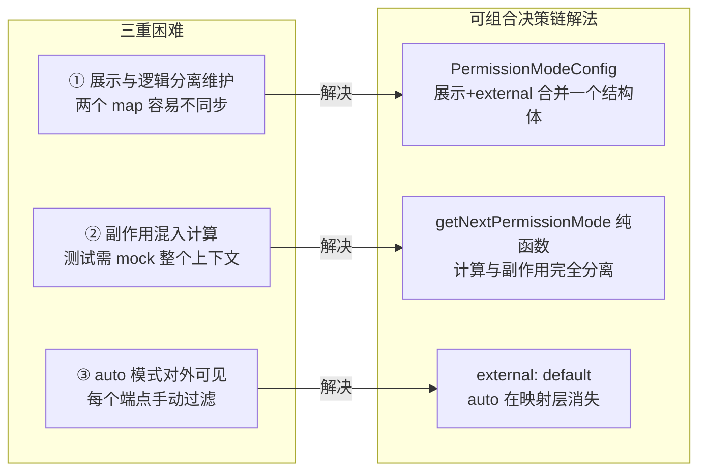
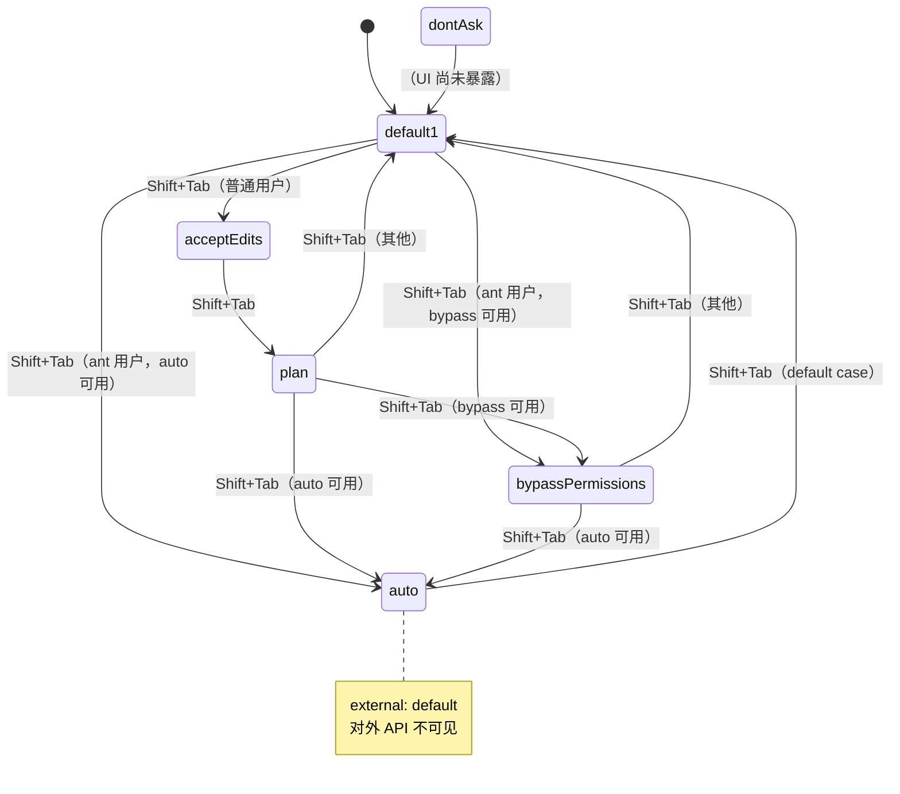
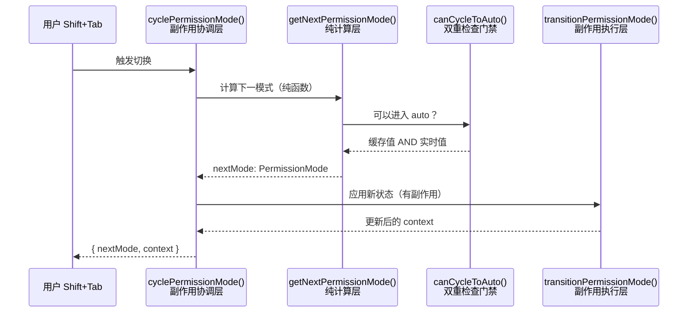
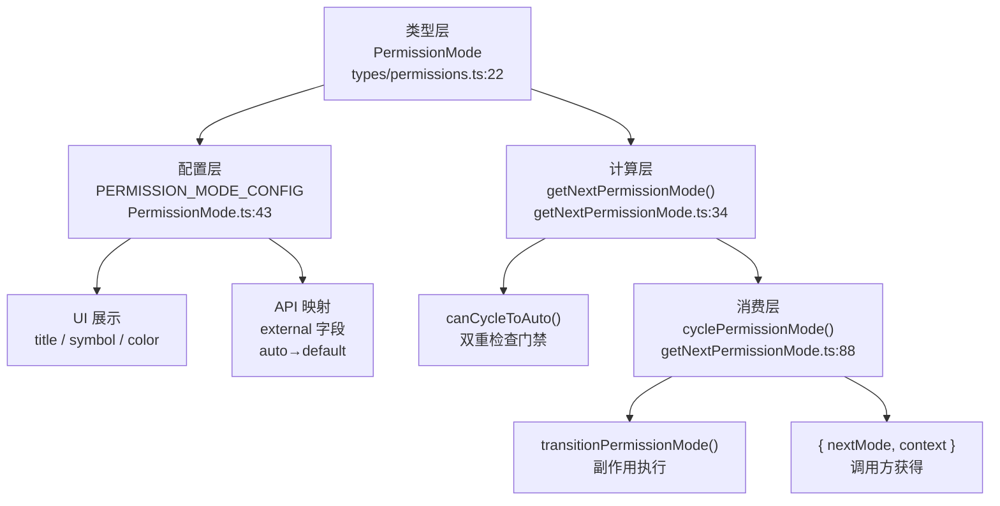
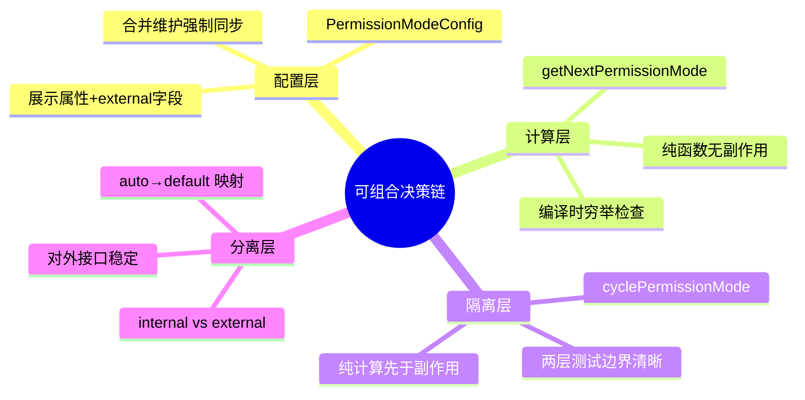

# 第 11 章：权限决策链——PermissionMode 的可组合设计

> "最安全的系统不是拒绝一切，而是默认保守、按需升级。"

用户按下 Shift+Tab，Claude Code 的权限模式从 `default` 切换到 `acceptEdits`，再到 `plan`，最后回到 `default`——整条切换路径在代码库里有 3 处清晰的实现：**PermissionMode.ts** 管理"每种模式长什么样"，**getNextPermissionMode** 用纯函数决定"按 Tab 后去哪里"，**cyclePermissionMode** 把"计算下一跳"和"应用新状态"拆成两个独立函数。我们把这个模式命名为**可组合决策链（Composable Decision Chain）**。

这个模式至少解决了两件事：权限切换逻辑**完全可单元测试**（因为它是纯函数），以及内部的 `auto` 模式对外 API **完全不可见**（因为有 `external` 字段做映射）。

为什么不用一个 if-else 树？为什么把计算和副作用拆成两个函数？答案不在设计偏好里，而在 `getNextPermissionMode.ts` 的那段注释里。

---

## 问题：权限模式的三重管理困难

我们先设想一下，如果不做任何架构设计，权限模式的管理代码会是什么样的。

Claude Code 有 5 种对外可见的权限模式（`default`、`acceptEdits`、`plan`、`bypassPermissions`、`dontAsk`），再加上一个 feature flag 控制的内部模式 `auto`。每种模式有自己的标题、缩写、状态栏符号、颜色键——6 组 UI 属性，如果散落在不同的 `switch` 语句或多个常量 map 里，很容易出现"UI 显示了某模式但权限映射忘了更新"的不一致。

**第一重困难：展示与逻辑的同步**。权限模式的元数据有两类用途：一类服务于 UI（`title`/`shortTitle`/`symbol`/`color`），另一类服务于权限逻辑（`external`——将内部模式映射到对外 API 使用的外部模式）。如果分两个 map 维护，任何新增模式都要改两处，遗漏一处就产生 bug；如果合并到一个结构体，同步就是语言层面的强制要求。

**第二重困难：状态转换的可测试性**。Shift+Tab 的处理链通常包含副作用：清理上下文、触发持久化、更新 UI 状态。如果"下一个模式是什么"和"进入新模式时做什么"混在同一个函数里，单元测试就必须模拟整个副作用链——数据库、UI 组件、session 状态全部都要 mock。测试成本急剧上升，测试覆盖率随之下降。

**第三重困难：feature flag 控制的 `auto` 模式**。`auto` 模式是内部测试功能，由 `TRANSCRIPT_CLASSIFIER` feature flag 控制；对外 API 不应暴露它的存在（否则外部用户会在文档里问"auto 是什么"）。如果没有一套"内部 → 外部"的映射机制，每个对外 API 端点都需要手动过滤 `auto`——遗漏一处就成了安全隐患或 API 不一致。

源码中 `src/types/permissions.ts:16` 有一行很有代表性的定义：

```typescript
// src/types/permissions.ts:16
export const EXTERNAL_PERMISSION_MODES = [
  'acceptEdits',
  'bypassPermissions',
  'default',
  'dontAsk',
  'plan',
] as const
```

**源码参考：** `src/types/permissions.ts:16`

**这一行揭示了设计意图**：`EXTERNAL_PERMISSION_MODES` 只有 5 个元素——`auto` 不在其中。对外只暴露稳定的、文档化的模式；`auto` 是内部概念，通过 `external: 'default'` 的映射对外等同于 `default`，外部世界感知不到它的存在。**内外分离是一等公民**——它和状态转换逻辑一样重要，被设计为显式的数据结构，而非隐藏在 if-else 里的特判。

**图 11-1：三重困难与可组合决策链的解法对应**



三种困难一一对应三种解法——这不是偶然，而是"可组合决策链"模式的完整设计意图：**把模式的形状（配置）、模式的转换（纯函数）、模式的副作用（包装层）拆成三个独立的关注点，各自演进、互不干扰**。

---

## 源码实例 1：PermissionMode.ts ——模式的"形状"定义

我们来看决策链的第一层。`PermissionModeConfig`（`src/utils/permissions/PermissionMode.ts:34`）的类型定义就已经告诉我们它做什么：

```typescript
// src/utils/permissions/PermissionMode.ts:34
type PermissionModeConfig = {
  title: string               // 完整标题，UI 模式选择器显示用
  shortTitle: string          // 短标题，状态栏空间受限时使用
  symbol: string              // 图标符号，⏵⏵ 或 ⏸ 等
  color: ModeColorKey         // 颜色键，映射到 UI 主题颜色
  external: ExternalPermissionMode  // 对外 API 使用的模式名
}
```

**源码参考：** `src/utils/permissions/PermissionMode.ts:34`

5 个字段，前 4 个服务于 UI，最后 1 个服务于权限逻辑。**为什么把 UI 属性和权限逻辑属性放在同一个结构体里？** 答案是强制同步：任何修改 `PermissionModeConfig` 的人，必须同时思考"这个模式的对外名称是什么"——不可能只改 UI 忘记权限映射，因为它们在同一个对象字面量里。

`PERMISSION_MODE_CONFIG`（`src/utils/permissions/PermissionMode.ts:43`）是这个结构体的完整填充：

```typescript
// src/utils/permissions/PermissionMode.ts:43
const PERMISSION_MODE_CONFIG: Partial<
  Record<PermissionMode, PermissionModeConfig>
> = {
  default: {
    title: 'Default',
    shortTitle: 'Default',
    symbol: '',
    color: 'text',
    external: 'default',
  },
  plan: {
    title: 'Plan Mode',
    shortTitle: 'Plan',
    symbol: PAUSE_ICON,
    color: 'planMode',
    external: 'plan',
  },
  acceptEdits: {
    title: 'Accept edits',
    shortTitle: 'Accept',
    symbol: '⏵⏵',
    color: 'autoAccept',
    external: 'acceptEdits',
  },
  bypassPermissions: {
    title: 'Bypass Permissions',
    shortTitle: 'Bypass',
    symbol: '⏵⏵',
    color: 'error',
    external: 'bypassPermissions',
  },
  dontAsk: { ... },
  // auto 模式由 feature flag 条件注入，见下方
}
```

**源码参考：** `src/utils/permissions/PermissionMode.ts:43`

注意类型是 `Partial<Record<PermissionMode, ...>>`，而非完整的 `Record`。这意味着某些内部模式（如 `bubble`）可以不在 map 中。`getModeConfig` 函数（第 107 行）通过 `?? PERMISSION_MODE_CONFIG.default!` 提供优雅降级——**未知模式自动回退到最保守的 `default` 配置**，而非抛出异常。这是 fail-closed 哲学（详见第 10 章）在配置层的体现。

**`auto` 模式的条件注入**（`src/utils/permissions/PermissionMode.ts:87`）是最关键的设计决策：

```typescript
// src/utils/permissions/PermissionMode.ts:87
...(feature('TRANSCRIPT_CLASSIFIER')
  ? {
      auto: {
        title: 'Auto mode',
        shortTitle: 'Auto',
        symbol: '⏵⏵',
        color: 'warning' as ModeColorKey,
        external: 'default' as ExternalPermissionMode,  // ← 关键
      },
    }
  : {}),
```

**源码参考：** `src/utils/permissions/PermissionMode.ts:87`

`external: 'default'` 这一行是整个内外分离设计的物理实体。当 `auto` 模式处于活跃状态时，它的"对外名称"是 `default`——调用 `toExternalPermissionMode('auto')` 得到的是 `'default'`，不是 `'auto'`。任何将内部权限模式转换为 API 响应的代码，只需调用 `toExternalPermissionMode()` 一次，`auto` 就在映射层消失了，外部世界永远看不到它。

**图 11-2：六种权限模式的状态转换与 external 映射**



图 11-1 展示了完整的状态转换图。注意 `auto` 模式的标注：它的 `external` 映射为 `'default'`，在所有对外 API 中不可见。普通用户的循环路径是 `default → acceptEdits → plan → default`，最多 3 步；`ant` 内部用户的路径更短，可直接进入 `bypassPermissions` 或 `auto`。

这正是**这个模式在代码库里出现的第一处信号**：配置 + 映射，让内部实现和外部接口完全解耦。下一处信号在状态转换函数里。

---

## 源码实例 2（变体）：三种模式转换函数的职责分工

同一个决策链里有 3 个函数处理权限模式转换，职责层次分明。

**变体 A：`canCycleToAuto()` ——门禁函数的双重检查**

在主状态机之前，有一个辅助函数 `canCycleToAuto`（`src/utils/permissions/getNextPermissionMode.ts:17`）：

```typescript
// src/utils/permissions/getNextPermissionMode.ts:11（注释块）
// 同时检查缓存的 isAutoModeAvailable（启动时由 verifyAutoModeGateAccess 设置）
// 和实时的 isAutoModeGateEnabled()——
// 如果熔断器触发或设置在会话中途变更，两者可能出现分歧。
// 实时检查防止 transitionPermissionMode 抛出异常
//（permissionSetup.ts:~559），否则会导致 shift+tab 处理器静默崩溃，
// 使用户卡在当前模式无法切换。
function canCycleToAuto(ctx: ToolPermissionContext): boolean {
  if (feature('TRANSCRIPT_CLASSIFIER')) {
    const gateEnabled = isAutoModeGateEnabled()
    return !!ctx.isAutoModeAvailable && gateEnabled
  }
  return false
}
```

**源码参考：** `src/utils/permissions/getNextPermissionMode.ts:17`

这段注释是难得的"为什么"级别文档。`ctx.isAutoModeAvailable` 是**启动时缓存的值**；`isAutoModeGateEnabled()` 是**调用时实时查询的值**。两者通常一致——但如果熔断器在会话中途触发，缓存值仍为 `true`，而实时值已变为 `false`。**如果只检查缓存值，系统会进入 `auto` 模式，然后 `transitionPermissionMode` 抛出异常，Shift+Tab 静默失效，用户被卡住**。双重检查是防止这个隐患的最后一道防线。

**变体 B：`getNextPermissionMode()` ——纯函数状态机**

主状态转换函数（`src/utils/permissions/getNextPermissionMode.ts:34`）的签名揭示了它的设计意图：

```typescript
// src/utils/permissions/getNextPermissionMode.ts:34
export function getNextPermissionMode(
  toolPermissionContext: ToolPermissionContext,
): PermissionMode {
  switch (toolPermissionContext.mode) {
    case 'default':
      // ant 用户路径：跳过 acceptEdits/plan，直接进入 bypassPermissions 或 auto
      if (process.env.USER_TYPE === 'ant') {
        if (toolPermissionContext.isBypassPermissionsModeAvailable) {
          return 'bypassPermissions'
        }
        if (canCycleToAuto(toolPermissionContext)) return 'auto'
        return 'default'
      }
      return 'acceptEdits'

    case 'acceptEdits':
      return 'plan'

    case 'plan':
      if (toolPermissionContext.isBypassPermissionsModeAvailable) {
        return 'bypassPermissions'
      }
      if (canCycleToAuto(toolPermissionContext)) return 'auto'
      return 'default'

    case 'bypassPermissions':
      if (canCycleToAuto(toolPermissionContext)) return 'auto'
      return 'default'

    case 'dontAsk':
      // UI 循环暂未暴露，若某种方式到达此处则回退到 default
      return 'default'

    default:
      // 涵盖 auto（TRANSCRIPT_CLASSIFIER 启用时）及未来新模式——始终回退到 default
      return 'default'
  }
}
```

**源码参考：** `src/utils/permissions/getNextPermissionMode.ts:38`

这个函数接受上下文（当前模式 + 各种权限标志），返回下一个 `PermissionMode`——**没有任何副作用，没有任何状态修改**。测试它只需要构造一个 `ToolPermissionContext` 字面量，直接断言返回值，不需要模拟数据库或 UI 组件。

`default` case 的兜底（最后一个 `return 'default'`）覆盖了所有未在 switch 中显式列出的模式——这是 fail-closed 的另一个体现：未知模式不崩溃，静默回到最保守状态。

**变体 C：`cyclePermissionMode()` ——副作用的隔离层**

`getNextPermissionMode` 是纯计算，但用户实际按下 Shift+Tab 还需要执行副作用：清理上下文、持久化新状态。`cyclePermissionMode`（`src/utils/permissions/getNextPermissionMode.ts:88`）承担这个职责：

```typescript
// src/utils/permissions/getNextPermissionMode.ts:88
export function cyclePermissionMode(
  toolPermissionContext: ToolPermissionContext,
  teamContext?: { leadAgentId: string },
): { nextMode: PermissionMode; context: ToolPermissionContext } {
  const nextMode = getNextPermissionMode(toolPermissionContext, teamContext)
  return {
    nextMode,
    context: transitionPermissionMode(
      toolPermissionContext.mode,
      nextMode,
      toolPermissionContext,
    ),
  }
}
```

**源码参考：** `src/utils/permissions/getNextPermissionMode.ts:88`

**这个函数的结构是"副作用隔离"模式的物理实体**：先调用纯函数计算下一状态，再调用有副作用的 `transitionPermissionMode` 应用转换，最后组装返回结果。测试"下一模式是什么"只需要测试 `getNextPermissionMode`；测试"转换时发生了什么"才需要测试 `cyclePermissionMode`。两个测试层，各自独立。

**图 11-3：三种函数的职责分工**



注意调用顺序：纯计算（`getNextPermissionMode`）**先于**副作用（`transitionPermissionMode`）执行。这不是巧合，而是设计约束——如果纯计算返回了意外结果（如 `canCycleToAuto` 返回 false，下一模式变为 `default`），副作用可以无需执行就返回。计算先于副作用，是"不必要时不执行副作用"的最简实现。

---

## 模式剖析：三层可组合决策链

把三个变体放在一起，一个清晰的层次结构浮现出来：

```
Claude Code 的权限决策链是一个三层可组合结构：

  [消费层] Shift+Tab 处理器 / API 端点 / 配置加载器
      ↕  调用 cyclePermissionMode / toExternalPermissionMode
  [计算层] getNextPermissionMode()       ← getNextPermissionMode.ts:34
      ↕  纯函数，无副作用，可直接单元测试
  [配置层] PERMISSION_MODE_CONFIG         ← PermissionMode.ts:43
      ↕  一个结构体，展示属性 + external 映射
  [类型层] PermissionMode 字符串字面量联合 ← types/permissions.ts:22
```

每层职责单一：
- **类型层**（`PermissionMode`）：定义合法状态集合，5 个对外可见 + `auto` 条件启用
- **配置层**（`PERMISSION_MODE_CONFIG`）：管理展示属性和 `external` 映射，一处修改覆盖所有下游
- **计算层**（`getNextPermissionMode`）：纯函数状态机，决定按 Tab 后的目标模式
- **消费层**（`cyclePermissionMode`/`toExternalPermissionMode` 等）：面向不同场景的接口暴露，隔离调用者

**`return` 是层间连接的关键**。`getNextPermissionMode` 返回的 `PermissionMode` 字符串是所有层共享的"通用货币"——配置层根据它查询 `PERMISSION_MODE_CONFIG`，副作用层根据它调用 `transitionPermissionMode`，UI 层根据它渲染状态符号。没有复杂的接口协议，一个字符串字面量就是层间契约。

**"每个 case 知道自己的后继者"的设计哲学**：`getNextPermissionMode` 的每个 `case` 分支直接返回下一个模式，而不是查询一张"转换表"。这意味着转换规则是**代码**，不是数据——TypeScript 编译器可以检查每个 case 的返回类型，确保它们都是合法的 `PermissionMode`。相比运行时查询转换表，编译时验证更早发现错误。

这就是**可组合决策链（Composable Decision Chain）**模式的完整面貌：

> 用字符串字面量联合类型定义有限状态，用一个统一结构体管理每种状态的所有属性（包括内外映射），用纯函数 switch-case 定义状态转换规则，用独立的包装函数隔离副作用——四个关注点独立演进，四层结构可按需选择性复用。

**图 11-4：四层结构的数据流向**



两条路径的分叉很重要：**配置路径**（类型层 → 配置层 → 展示/映射）服务于 UI 渲染和 API 序列化；**计算路径**（类型层 → 计算层 → 消费层）服务于模式切换。两条路径共享同一个类型层（`PermissionMode`），这是"可组合"的基础——更换配置层不影响计算路径，更换计算层不影响展示逻辑。

---

## 适用范围

| 场景 | 适用？ | 理由 | 替代方案 |
|------|--------|------|---------|
| Agent 系统需要分级权限（默认保守，可升级）| ✓ | 决策链天然支持从最保守状态出发的渐进升级 | 单一布尔值（但无法分级）|
| 权限逻辑需要单元测试覆盖 | ✓ | 纯函数无依赖，测试直接调用 `getNextPermissionMode(ctx)` | — |
| 内部模式对外 API 不可见（feature flag 模式）| ✓ | `external` 字段在映射层屏蔽内部概念 | 每个 API 端点手动过滤（容易遗漏）|
| 权限状态需要序列化到配置文件（用户可读）| ✓ | 字符串字面量（`"plan"`）比数字枚举（`2`）更可读 | 数字枚举（配置文件不友好）|
| 用户可手动切换安全级别（UI 快捷键）| ✓ | 纯函数返回值可直接绑定任何 UI 事件 | — |
| 需要运行时动态注册新权限级别（插件扩展）| ✗ | switch-case 是编译时静态的，新增模式需改代码 | Map + 接口注册表 |
| 权限决策依赖异步操作（网络鉴权）| ✗（谨慎）| `getNextPermissionMode` 是同步函数 | 异步权限验证器链 |
| 权限状态数量超过 10 种且各有复杂行为 | ✗（谨慎）| case 分支过多，switch 维护困难 | 状态注册表 + 策略模式 |

Claude Code 的实践印证了表中前 5 行：整条权限决策链（类型层 → 配置层 → 计算层 → 消费层）完全同步、零依赖注入，`getNextPermissionMode` 的单元测试只需要构造一个 `{ mode: 'plan', isBypassPermissionsModeAvailable: true }` 对象，直接断言返回 `'bypassPermissions'`，没有任何 mock。

---

## 权衡与局限

**① 静态 switch-case 的扩展成本**

`getNextPermissionMode` 的 switch-case 在编译时是固定的——新增一种权限模式需要同时修改 `types/permissions.ts`（添加字符串字面量）、`PermissionMode.ts`（添加 PERMISSION_MODE_CONFIG 条目）、`getNextPermissionMode.ts`（添加 case 分支）三处。这是这个模式最主要的维护成本：不能"只改一处"。

为什么不设计成数据驱动的转换表（`Map<PermissionMode, (ctx) => PermissionMode>`）？因为数据驱动失去了编译时的穷举检查——TypeScript 无法验证"所有 `PermissionMode` 都在 map 里"，而 `switch` + `default: return 'default'` 的 fail-closed 兜底让穷举不是强制要求，是安全选择。这个权衡值得：6 种模式的静态 switch 比运行时 map 的可维护性更好，代价是新增模式时 3 个文件都要改。

**② 双重检查的维护负担**

`canCycleToAuto` 同时依赖两个检查来源：`ctx.isAutoModeAvailable`（启动时缓存）和 `isAutoModeGateEnabled()`（实时查询）。这解决了熔断器触发时的一致性问题，但引入了维护负担：两个来源在不同地方更新，如果熔断器逻辑演进，`canCycleToAuto` 也需要跟着修改。这是分布式状态的固有成本——"两份记录，需要手动保持一致"——无法完全消除，只能通过清晰注释（如源码中的那段注释）来降低理解门槛。

**③ `dontAsk` 模式的不完整状态**

源码注释写道 `dontAsk` 的 case：`// Not exposed in UI cycle yet, but return default if somehow reached`。这说明 `dontAsk` 是一个"存在但未完成"的模式——它在类型定义里，在配置 map 里，但在 UI 循环里没有入口。这是渐进式功能开发的常见状态：先建基础设施，再接入 UI。对系统稳定性没有影响（因为有 fail-closed 的 `return 'default'` 兜底），但对阅读代码的开发者来说是一个需要解释的"悬念"。

---

## 与已知模式的对话

**① 与 GoF 状态模式（State Pattern）的比较**

GoF 状态模式：**"允许对象在内部状态改变时改变它的行为，对象看起来似乎修改了它的类。"** GoF 实现通常为每个状态创建一个类，类内封装该状态下的行为，状态转换通过 `setState()` 完成。

Claude Code 的可组合决策链的相同点：根据当前状态决定行为（下一个模式），状态驱动行为差异。关键差异：**GoF 状态模式用类封装行为**（每个状态类包含行为逻辑），Claude Code 用**数据 + 纯函数**（`PermissionModeConfig` 是数据，`getNextPermissionMode` 是函数）——没有类继承，没有 `this` 绑定。TypeScript 函数式风格下，避免了 class 继承的 OOP 负担，状态转换逻辑全部集中在一个函数里，一次阅读即可掌握所有转换规则。

**② 与 GoF 责任链（Chain of Responsibility）的比较**

GoF 责任链：**"让多个对象都有机会处理请求，将这些对象连成链，沿链传递请求直到有一个对象处理为止。"**

相同点：两者都有一条处理链，当前节点决定处理还是转发（或在 Claude Code 中：当前模式决定下一个模式）。关键差异：GoF 责任链的链是**线性的**（有终点，请求最终被某个节点处理），而可组合决策链是**循环的**（`default → acceptEdits → plan → default`，无终点，所有节点都是中间状态）。此外，GoF 责任链的每个节点是一个**对象**（包含处理逻辑），而 Claude Code 的节点是一个**字符串字面量**，转换逻辑集中在 `getNextPermissionMode` 一处——相比 6 个类分散在代码库各处，集中在一个函数里更容易阅读和修改。

| 维度 | 可组合决策链 | GoF 状态模式 | GoF 责任链 |
|------|------------|------------|----------|
| 状态表示 | 字符串字面量联合类型 | 状态类（实现接口）| 处理者对象 |
| 转换规则存放 | 集中（一个 switch-case 函数）| 分散（每个状态类内部）| 分散（每个处理者内部）|
| 链的形状 | 循环（无终点）| 状态图（无循环限制）| 线性（有终点）|
| 测试方式 | 直接调用纯函数 | 需要 mock 状态类方法 | 需要构造处理者链 |
| 新增状态成本 | 改 3 个文件 | 新增 1 个类 | 新增 1 个处理者类 |
| Claude Code 使用 | ✅ 完整实现 | 架构概念参考 | 架构概念参考 |

---

## 模式提炼

### 模式 1：可组合决策链（Composable Decision Chain）

**解决的问题**：Agent 系统需要多级权限策略，不同安全级别对应不同的操作范围，且用户可以在运行时切换；同时展示属性和权限逻辑属性需要保持同步。

**核心做法**：用字符串字面量联合类型定义有限权限状态，用一个统一结构体（`PermissionModeConfig`）管理每种状态的展示属性和外部映射，用纯函数 switch-case 定义转换规则，副作用单独封装在包装函数中。

**前置条件**：权限状态数量固定（建议 ≤10），转换规则在编译时已知，需要单元测试覆盖。

**源码证据**：`src/utils/permissions/PermissionMode.ts:43`（`PERMISSION_MODE_CONFIG`）；`src/utils/permissions/getNextPermissionMode.ts:34`（`getNextPermissionMode`）

---

### 模式 2：纯函数状态转换（Pure State Transition）

**解决的问题**：UI 快捷键触发的状态切换逻辑难以测试，因为副作用（上下文清理、持久化）和计算逻辑混在一起，测试需要 mock 整个运行时环境。

**核心做法**：将"下一个状态是什么"（纯计算，`getNextPermissionMode`）和"进入新状态时做什么"（副作用，`cyclePermissionMode`）拆成两个独立函数，纯函数先于副作用执行，两层测试边界清晰。

**前置条件**：状态转换可以表达为纯函数（输入=当前状态+上下文，输出=下一状态）；副作用可以在计算完成后统一执行（无需交织）。

**源码证据**：`src/utils/permissions/getNextPermissionMode.ts:34`（纯计算）vs `src/utils/permissions/getNextPermissionMode.ts:88`（副作用包装）

---

### 模式 3：内外模式分离（Internal/External Mode Separation）

**解决的问题**：内部实现需要 feature flag 控制的实验性模式（`auto`），但对外 API 和配置文件不应暴露此内部概念，每个对外接口手动过滤容易遗漏。

**核心做法**：在配置结构体中为每种内部模式显式声明 `external` 字段（对外映射的模式名），通过统一的 `toExternalPermissionMode()` 函数一次性处理内外转换，调用方不需要知道 `auto` 的存在。

**前置条件**：存在需要对外隐藏的内部模式；对外 API 有统一的序列化入口。

**源码证据**：`src/utils/permissions/PermissionMode.ts:87`（`auto` 的 `external: 'default'`）；`src/utils/permissions/PermissionMode.ts:111`（`toExternalPermissionMode`）

---

## 你能做什么

- **用字符串字面量联合类型定义权限模式，而非数字枚举**。`'default' | 'acceptEdits' | 'plan'` 比 `0 | 1 | 2` 更可读，序列化到配置文件时用户直接理解，配合 TypeScript 的 exhaustive switch check 还能防止遗漏 case。

- **将状态转换逻辑写成纯函数**，完全不包含副作用。测试只需要构造一个对象字面量：`getNextPermissionMode({ mode: 'plan', isBypassPermissionsModeAvailable: true })` 直接断言结果，不需要启动应用、不需要 mock 数据库、不需要 mock UI。参考 `getNextPermissionMode.ts:34`。

- **为配置映射表中的每种内部状态显式声明 `external` 字段**，而非在每个 API 端点手动过滤。一个 `toExternalPermissionMode()` 函数覆盖所有对外场景，不可能遗漏。参考 `PermissionMode.ts:87` 的 `external: 'default'` 模式。

- **在条件性高权限状态的门禁函数中做双重检查**——同时检查启动时缓存的值和调用时实时查询的值。缓存值提供性能，实时值提供准确性；当两者不一致时，优先信任实时值，并记录调试日志。参考 `canCycleToAuto` 的实现。

- **将展示属性和逻辑属性合并到同一个配置结构体**（仿照 `PermissionModeConfig`）。强制同步更新比"两个独立 map 约定手动保持一致"更可靠，特别是在多人协作、长期维护的代码库中。

- **用 `default: return conservativeMode`** 的 fail-closed 兜底替代 `default: throw new Error`。未知状态静默回退到最保守选项，比让用户看到崩溃信息更好。参考 `getNextPermissionMode` 最后的 `default: return 'default'`。

---

**图 11-5：三个模式的协同关系**



四个关注点独立演进：配置层决定"模式长什么样"，计算层决定"按 Tab 后去哪"，隔离层决定"切换时做什么"，分离层决定"对外暴露什么"。任意一层的变化不影响其他层。

---

权限模式的定义和切换是权限系统的"顶层"——"当前用户处于哪个安全级别"。更细粒度的问题是：当一个具体工具被调用时，AI 自动判断模式（`auto`）下分类器如何决定是否允许执行？这是第 12 章的主题——我们将深入 `autoModeState` 和 AI 自动分类器的完整决策链。
