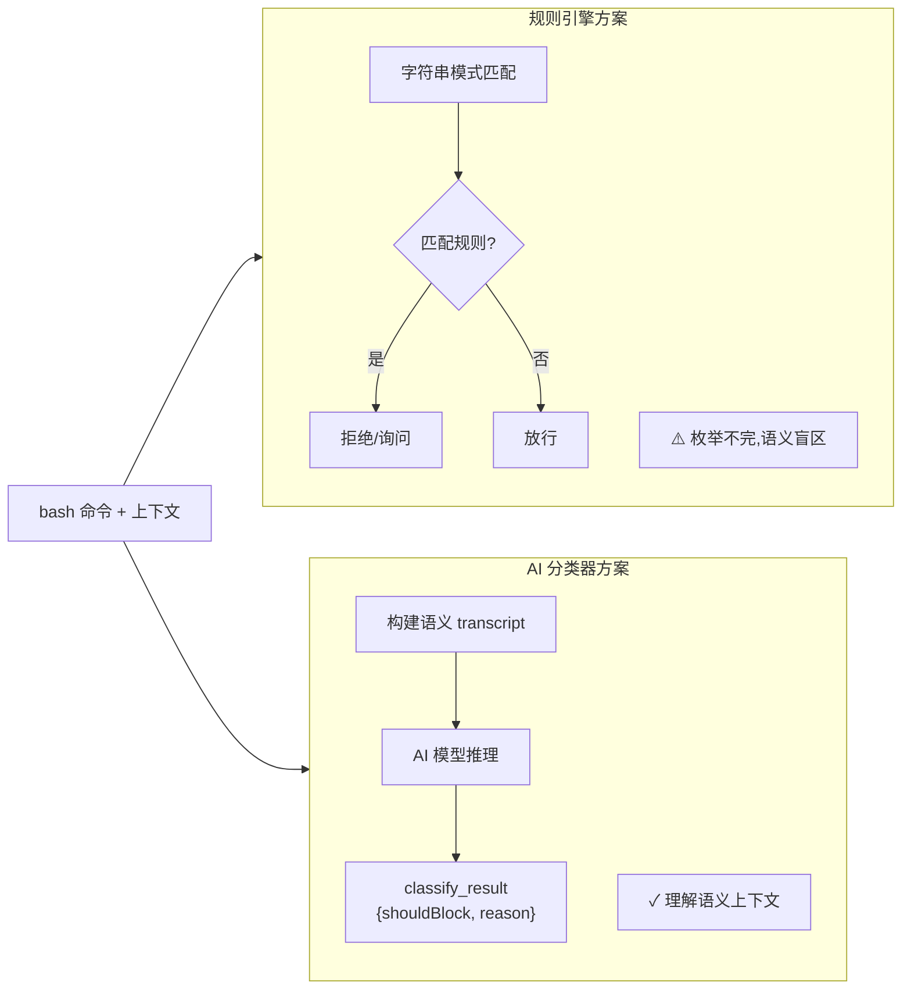
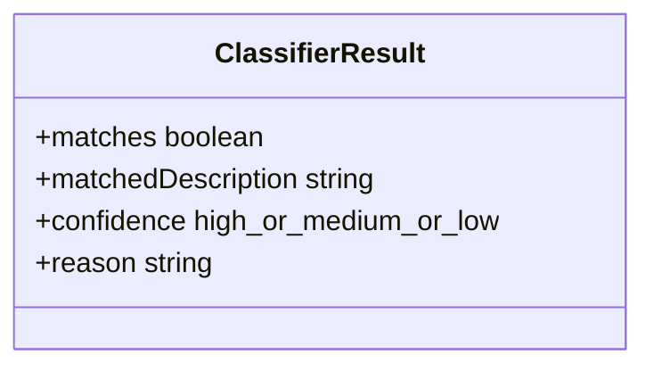
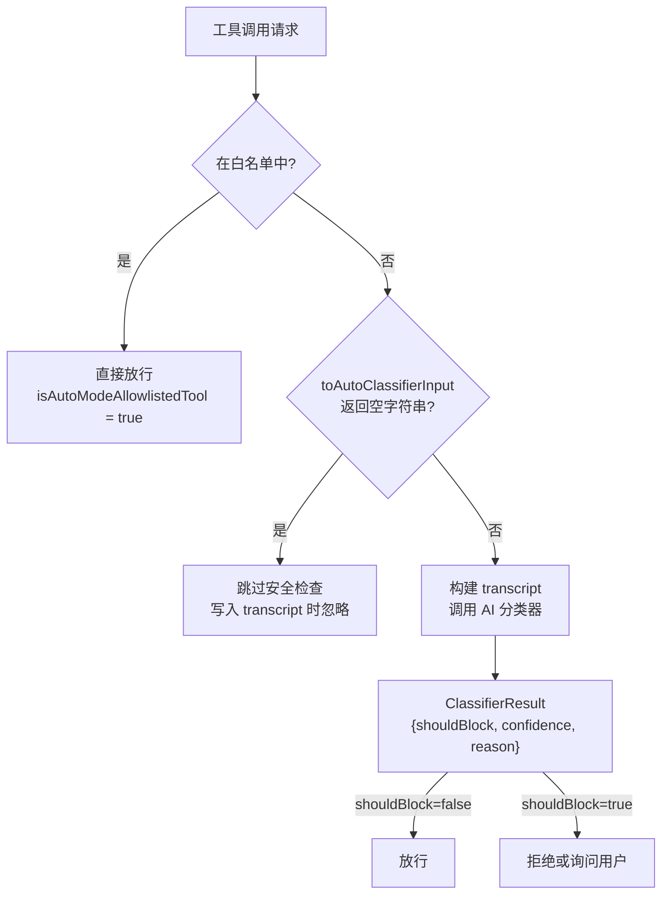
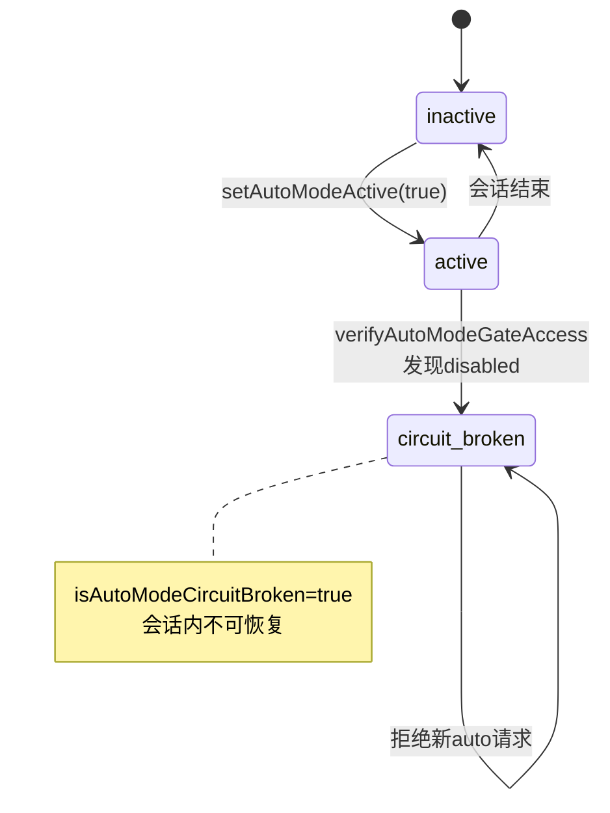
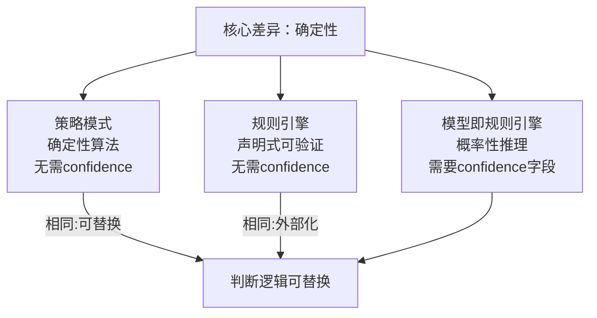

# 第 12 章：AI 分类器替代规则引擎——yolo-classifier 的设计哲学

> "让 AI 裁判 AI,是信任的递归,也是工程的妥协。"

当一个 AI Agent 可以执行任意 bash 命令时,谁来裁判"这条命令是否安全"?直觉上的答案是:写一套规则--"包含 `rm -rf` 的命令拒绝","修改 `/etc` 的操作需要确认"。但这个直觉在第一个边缘案例处就会动摇:`rm -rf /tmp/build-cache` 和 `rm -rf /home/user/projects` 表面上相似,危险程度却天壤之别。危险性不在命令本身,而在命令所处的**语义上下文**。规则引擎处理语法,语义需要理解。

Claude Code 给出的答案是**让另一个 AI 模型来裁判**--这就是"模型即规则引擎"(Model-as-Rule-Engine)模式:将安全判断从 if/else 规则集转移到 AI 模型的推理能力上,利用自然语言理解覆盖规则无法枚举的语义边界。

读完本章,你能分析"AI 分类器 vs 规则引擎"的工程成本与收益,并能在自己的系统中设计出可降级、可白名单化的安全判断接口。

---

## 问题：规则引擎的枚举困境

为什么不用规则引擎?这个问题值得认真回答。

规则引擎在许多场景下工作良好:防火墙规则匹配 IP 地址,垃圾邮件过滤器检查关键词,访问控制列表比对用户 ID。它们有一个共同特征:判断标准是**结构性的**--可以用精确的条件表达式覆盖所有情况。

bash 命令的安全判断不属于这类问题。考虑以下三条命令:

```bash
# 命令 A
rm -rf /tmp/test-artifacts

# 命令 B
git push origin main --force

# 命令 C
curl https://internal-api/reset-database | bash
```

命令 A 是否危险?取决于 `/tmp/test-artifacts` 是用户特意创建的临时目录,还是某个服务的数据目录被错误命名。命令 B 是否危险?取决于这是用户的个人项目仓库,还是团队共享的生产主干分支。命令 C 几乎一定危险--但你只能靠理解 URL 的含义和 `bash` 的语义才能判断。

**规则引擎的根本局限是:它处理的是命令的字符串表示,而危险性存在于命令与执行上下文的语义关系中。** 任何基于字符串匹配或结构分析的规则集,要么过于保守(拦截大量合法操作),要么存在漏洞(遗漏危险操作的语义变体)。

这不是规则写得不够好的问题,而是规则引擎在这个任务上的结构性劣势。

**图 12-1：安全判断方式对比**



**图 12-1：两种判断路径的对比。** 规则引擎只能处理命令的字符串结构,AI 分类器能够理解命令在执行上下文中的语义含义--但后者的代价是网络延迟和 token 消耗。

---

## 源码实例 1：ClassifierResult 的三字段协议

我们先看分类器决策结果的数据结构设计,它揭示了系统对"安全判断"这件事的理解深度。

在 `src/utils/permissions/bashClassifier.ts` 中,分类器返回结果被定义为三个字段:

```typescript
// src/utils/permissions/bashClassifier.ts:5
export type ClassifierResult = {
  matches: boolean
  matchedDescription?: string
  confidence: 'high' | 'medium' | 'low'
  reason: string
}
```

**源码参考:** `src/utils/permissions/bashClassifier.ts:5-10`

这三个字段背后有一套完整的工程考量。**`matches` 是最终决策**(是否触发对应规则),但更值得关注的是另外两个字段:

`confidence` 的三级枚举(`'high' | 'medium' | 'low'`)承认了 AI 判断的**不确定性本质**--这是规则引擎思维和 AI 思维之间最关键的分野。规则引擎的输出总是确定性的(匹配或不匹配),AI 模型的推理是概率性的。将置信度显式建模进接口,迫使调用方思考"当 AI 不确定时应该怎么办"。

`reason` 字段更是有意思的设计选择。AI 分类器的判断理由是系统向用户解释"为什么这个操作被拦截"的原料。这意味着从第一天起,设计者就把"可解释性"列为安全系统的一等公民--被拒绝的操作必须能说清为什么。

值得一提的是,这个 `ClassifierResult` 是第11章介绍的 `PermissionMode` 四层决策体系的内部实现细节之一--当 `PermissionMode` 处于 auto 模式时,才会触发 AI 分类器路径。(详见第11章 PermissionMode 的决策分层设计)

**图 12-3：ClassifierResult 的三字段职责划分**



**图 12-3：ClassifierResult 三字段各司其职。** `matches` 是二值决策结果,`confidence` 承认 AI 判断的概率性本质,`reason` 为用户提供可解释的拒绝理由--三者缺一不可。

决策行为被单独定义为另一个类型:

```typescript
// src/utils/permissions/bashClassifier.ts:12
export type ClassifierBehavior = 'deny' | 'ask' | 'allow'
```

**源码参考:** `src/utils/permissions/bashClassifier.ts:12`

`ClassifierBehavior` 的三值设计(拒绝/询问/放行)对应三种不同的安全策略:确定危险的操作直接拒绝,不确定的操作转交用户判断,明确安全的操作直接放行。这是安全系统的标准"三挡"设计,但在 AI 分类器的语境下,"不确定"的边界是由模型的推理能力动态定义的,而非人工硬编码。

分类器的核心函数是 `classifyBashCommand`,其接口签名揭示了决策所需的全部上下文:

```typescript
// src/utils/permissions/bashClassifier.ts:40
export async function classifyBashCommand(
  _command: string,
  _cwd: string,
  _descriptions: string[],
  _behavior: ClassifierBehavior,
  _signal: AbortSignal,
  _isNonInteractiveSession: boolean,
): Promise<ClassifierResult>
```

**源码参考:** `src/utils/permissions/bashClassifier.ts:40-48`

注意参数列表:不只有命令本身(`_command`),还有当前工作目录(`_cwd`)、自然语言描述规则列表(`_descriptions`)以及交互模式标志(`_isNonInteractiveSession`)。这些参数组合起来,构成了 AI 理解命令**语义上下文**所需的最小信息集合--这正是规则引擎做不到的事:它只能接受命令字符串。

然而,在这份公开代码中,这个函数是一个 stub(占位实现):

```typescript
// src/utils/permissions/bashClassifier.ts:40
return {
  matches: false,
  confidence: 'high',
  reason: 'This feature is disabled',
}
```

**源码参考:** `src/utils/permissions/bashClassifier.ts:48-52`

文件开头的注释点明了原因:`// Stub for external builds - classifier permissions feature is ANT-ONLY`。同样地,`isClassifierPermissionsEnabled()` 函数(`src/utils/permissions/bashClassifier.ts:24`)总是返回 `false`。**这是一个功能开关:AI 分类器功能被 feature flag 保护,在外部构建版本中默认关闭**。这个 stub 的存在本身就是一种架构模式--公开接口完整定义(接口契约可见),核心实现受保护(通过 feature flag 控制可用性),确保外部版本性能不受影响。

---

## 源码实例 2：工具如何定义自己的安全语境

第一个实例展示了分类器的输出协议。我们来看第二个实例:工具如何向分类器**声明自己的语义输入**。

分类器想要理解"AI 代理正在做什么",但它看不到代理的内部状态--它只能通过工具的操作日志来推断。因此,每个工具都需要能够将自己的操作"翻译"成对分类器有意义的文本。这个责任被设计成 `Tool` 接口的必选方法:

```typescript
// src/Tool.ts:550
/**
 * 返回此工具调用的紧凑表示,供 auto-mode 安全分类器使用。
 * 示例:Bash 工具返回 `ls -la`,Edit 工具返回 `/tmp/x: new content`。
 * 返回 '' 表示在分类器 transcript 中跳过此工具
 * (例如与安全无关的工具)。可以返回对象以避免
 * 调用方 JSON 包裹时的双重编码。
 * (原文:"Returns a compact representation of this tool use for the auto-mode
 * security classifier. Examples: `ls -la` for Bash, `/tmp/x: new content`
 * for Edit. Return '' to skip this tool in the classifier transcript
 * (e.g. tools with no security relevance). May return an object to avoid
 * double-encoding when the caller JSON-wraps the value.")
 */
toAutoClassifierInput(input: z.infer<Input>): unknown
```

**源码参考:** `src/Tool.ts:550-556`

这个设计选择值得细品。分类器本可以直接获取工具的原始输入参数,但注释给出了两个例子:Bash 工具返回 `ls -la`(命令本身),Edit 工具返回 `/tmp/x: new content`(路径 + 变更摘要)。这不是简单的参数传递--是**每个工具从分类器视角重新表述"我正在做什么"**。

返回空字符串 `''` 的语义同样关键:注释明确说明"Return '' to skip this tool in the classifier transcript (e.g. tools with no security relevance)"。这给了工具一种"选择退出安全审查"的机制--如果一个工具的操作天然安全(如只读查询),它可以声明自己不需要接受安全审查,从而避免不必要的 AI 调用开销。

但比"选择退出"更粗粒度的优化是**白名单**机制。`classifierDecision.ts` 维护了一个完整的"已知安全工具"集合:

```typescript
// src/utils/permissions/classifierDecision.ts:56
const SAFE_YOLO_ALLOWLISTED_TOOLS = new Set([
  FILE_READ_TOOL_NAME,     // 只读文件操作
  GREP_TOOL_NAME,          // 只读搜索
  GLOB_TOOL_NAME,          // 只读文件列表
  TODO_WRITE_TOOL_NAME,    // 任务元数据(无实际副作用)
  SLEEP_TOOL_NAME,         // 等待(无副作用)
  // ... 约 20 个工具
])
```

**源码参考:** `src/utils/permissions/classifierDecision.ts:56-98`

注释解释了白名单的边界：写入和编辑工具不在白名单内，由 acceptEdits 快路径单独处理（原文："Does NOT include write/edit tools - those are handled by the acceptEdits fast path"）。写入和编辑工具被单独处理(如果在工作目录内则允许,工作目录外则分类),而不是放进白名单。**白名单只包含那些"无论如何都不可能造成安全风险"的工具--而不是"通常安全"的工具**。这是最小化误判风险的保守策略。

查询函数极简:

```typescript
// src/utils/permissions/classifierDecision.ts:96
export function isAutoModeAllowlistedTool(toolName: string): boolean {
  return SAFE_YOLO_ALLOWLISTED_TOOLS.has(toolName)
}
```

**源码参考:** `src/utils/permissions/classifierDecision.ts:96-98`

两个实例的对比揭示了模式的不同层次:`toAutoClassifierInput()` 是细粒度的"工具自定义分类器视角"接口,`isAutoModeAllowlistedTool()` 是粗粒度的"工具完全跳过分类"机制。二者协作,让分类器只在真正需要时才付出 AI 调用的代价。

**图 12-2：工具安全审查的三种路径**



**图 12-2：工具安全审查的三层过滤。** 从白名单快速路径,到工具声明退出,再到 AI 分类器判断--三层设计让大多数操作无需付出 AI 调用代价。

---

## 模式剖析：模型即规则引擎

现在我们有了足够的源码证据,可以提炼这个模式的骨架。

**模式名称:模型即规则引擎(Model-as-Rule-Engine)**

这个模式的核心是**用 AI 模型的推理能力替代规则集来做决策**,尤其适用于判断标准依赖语义理解、无法用精确条件完全枚举的场景。

模式由四个组成部分构成:

**1. 决策接口(ClassifierResult)**:定义分类器的输出协议--不只是 yes/no,还包含置信度(`confidence`)和理由(`reason`)。置信度使调用方可以根据不确定程度决定后续行为;理由为用户提供可解释性。

**2. 语境声明接口(toAutoClassifierInput)**:每个"被裁判对象"(工具)负责将自己的行为翻译成对裁判(分类器)有意义的文本。这将"如何描述操作"的责任下放给了最了解自己的工具,而非集中在分类器。

**3. 白名单快速路径(SAFE_YOLO_ALLOWLISTED_TOOLS)**:对于已知安全的操作,完全跳过 AI 调用。这是性能的安全阀--AI 调用有延迟和成本,白名单确保常见安全操作不付出这个代价。

**4. 功能开关(isClassifierPermissionsEnabled)**:整个分类器功能通过 feature flag 开关控制,默认关闭。这允许系统在 AI 分类器不可用(如离线环境、外部构建版本)时降级到其他安全策略,而不是直接崩溃。

这四个部分组合起来,形成一个**可降级、可优化、可解释的 AI 安全决策系统**--不是一个"替换规则引擎"的简单改装,而是专门为 AI 判断的不确定性和成本特征设计的完整接口。

---

## 适用范围

| 场景 | 适用性 | 理由 | 替代方案 |
|------|--------|------|---------|
| 判断标准依赖语义理解(如 bash 命令危险性) | ✓ | AI 能理解上下文语义,规则引擎处理字符串结构 | 复杂规则集(可维护性差、漏洞多)|
| 覆盖"长尾"边缘案例(无法枚举的变体) | ✓ | AI 能泛化到未见过的模式,规则必须逐条添加 | 机器学习分类器(训练成本高)|
| 延迟敏感场景(<100ms 决策要求) | ✗ | AI 模型调用涉及网络请求,难以保证低延迟 | 规则引擎(本地,无网络开销)|
| 需要完全可审计/可解释的决策链 | ✗(谨慎)| AI 推理存在不透明性,虽有 `reason` 字段但不可完全追溯(推断)| 规则引擎(每条规则可独立追踪)|
| 高频判断(>1000次/秒) | ✗ | API token 成本会随频率线性增长 | 规则引擎 + 白名单缓存 |
| 判断标准频繁变化 | ✓ | 自然语言描述规则(`_descriptions`)比代码规则更易更新 | 可配置规则引擎 |

---

## 权衡与局限

为什么不是所有安全判断都用 AI 分类器?

**延迟代价**:调用 AI 模型涉及网络请求,延迟通常在数百毫秒量级。白名单机制(`isAutoModeAllowlistedTool`)是减少这一开销的主要手段,但对于不在白名单内的工具,每次操作都会有可感知的延迟增加。

**不确定性传播**:AI 模型的判断是概率性的--同一条命令在不同的会话上下文中可能得到不同的分类结果(推断)。`confidence` 字段承认了这一点,但系统的使用者必须接受"安全判断本身不是 100% 确定的"这一前提。对于安全要求极高的场景,这是一个根本性的风险。

**电路断路器**:`src/utils/permissions/autoModeState.ts` 中维护了一个 `autoModeCircuitBroken` 状态:

```typescript
// src/utils/permissions/autoModeState.ts:9
let autoModeCircuitBroken = false
```

**源码参考:** `src/utils/permissions/autoModeState.ts:9`

当 auto mode 的后端权限被撤销时(通过 GrowthBook 功能配置检测),`isAutoModeCircuitBroken()` 返回 `true`,阻止会话内的后续 auto mode 请求。注释说明:这是 `verifyAutoModeGateAccess` 异步检查读取到 `tengu_auto_mode_config.enabled === 'disabled'` 时触发的。**这是对"AI 服务不可用"场景的防御--分类器失败不能导致主功能中断,而是通过断路器降级处理**。

**功能可用性局限**:如前所述,完整的 AI 分类功能是 ANT-ONLY 的,外部版本中是 stub。这意味着外部用户实际上看到的是一个"接口完整但功能关闭"的系统--这种设计为未来开放预留了接口,但当前版本的外部用户无法受益于 AI 安全裁判能力。

**图 12-4：Auto Mode 的状态机与电路断路器**



**图 12-4：Auto Mode 的状态转换。** `active` 到 `circuit_broken` 是单向箭头--一旦触发电路断路,当前会话内不可恢复。这是"快速失败"而非"无限重试"的设计选择,防止损坏的配置状态无限干扰主功能。

---

## 与已知模式的对话

这个模式与业界已知模式有什么异同?

**与 GoF 策略模式(Strategy Pattern)的关系**:策略模式将可替换的算法封装为对象。"模型即规则引擎"与之相似--`classifyBashCommand` 是一个可替换的判断策略,stub 实现和实际 AI 实现共享同一接口。但关键区别是:**策略模式的策略是确定性的算法,AI 分类器是概率性的推理系统**。这要求在策略接口上显式建模不确定性(`confidence` 字段),这是标准策略模式接口没有的需求。

**与规则引擎(如 Drools/RETE 算法)的关系**:规则引擎将判断逻辑外部化为可配置的规则声明,与代码分离。"模型即规则引擎"也实现了判断逻辑的外部化--`_descriptions` 参数就是外部化的自然语言规则。但经典规则引擎的规则是**声明性的、可追溯的**,AI 分类器的"规则"存在于模型权重中,**不可直接检查**。二者都解决了"将判断逻辑从代码中分离"的问题,但可解释性和可审计性的保障程度完全不同。

**与责任链模式（Chain of Responsibility）的关系**：`classifierDecision.ts` 的三层过滤（白名单 → 空字符串退出 → AI 分类）与责任链有相似的结构——每层都可以“处理并终止”或“传递给下一层”。但这里的链条是性能优化导向的（快速路径优先），而非职责划分导向的（每层处理不同类型的请求）。

**图 12-5：本章模式与业界已知模式的核心差异**



**图 12-5：三种模式的核心差异。** 所有三种模式都实现了“判断逻辑可替换”，但确定性是分岐点——策略模式和规则引擎的输出是确定的，AI 分类器的输出是概率性的。这一差异决定了接口必须包含 `confidence` 字段，是架构上的根本分歧。

---

## 模式提炼

---

**模型即规则引擎(Model-as-Rule-Engine)**

**解决的问题**:安全判断需要理解自然语言上下文和操作语义,传统规则引擎只能匹配字符串结构,无法覆盖语义边界。

**核心做法**:将判断任务委托给 AI 模型--通过 `toAutoClassifierInput()` 让被裁判对象声明自己的语义输入,通过结构化输出(`ClassifierResult`)获得带置信度和理由的判断结果,通过白名单和 feature flag 控制可用性和成本。

**前置条件**:判断逻辑可以用自然语言描述;判断延迟和 token 成本在可接受范围内;需要接受 AI 推理的概率性(非确定性)特征。

**源码证据:**
- `src/utils/permissions/bashClassifier.ts:5` - `ClassifierResult` 类型定义(三字段协议)
- `src/utils/permissions/bashClassifier.ts:12` - `ClassifierBehavior` 三值枚举
- `src/Tool.ts:556` - `toAutoClassifierInput()` 接口(工具语境声明)
- `src/utils/permissions/classifierDecision.ts:56` - `SAFE_YOLO_ALLOWLISTED_TOOLS`(白名单快速路径)
- `src/utils/permissions/autoModeState.ts:9` - `autoModeCircuitBroken`(电路断路器)

---

## 你能做什么

- **在安全判断接口中显式建模不确定性**。为 AI 分类器的返回值设计 `confidence: 'high' | 'medium' | 'low'` 字段,让调用方能够根据置信度选择不同的后续行为(低置信度时转交人工判断,而非直接二值决策)。

- **用 `toAutoClassifierInput()` 接口让工具声明自己的安全语境**,而非在分类器层硬编码各工具的语义解析逻辑。这将"如何描述操作"的责任下放给最了解自己的工具,使分类器保持通用性。

- **为 AI 分类器设计白名单快速路径**。维护一个"已知安全工具"集合(对应 `SAFE_YOLO_ALLOWLISTED_TOOLS`),让天然安全的操作(只读、无副作用)完全跳过 AI 调用,控制 token 消耗和延迟。

- **用 feature flag 保护 AI 分类器功能**(对应 `isClassifierPermissionsEnabled` 的设计),默认关闭,确保功能不可用时系统能平稳降级,而非崩溃。这也使得功能可以灰度发布,不需要一次性对所有用户开启。

- **为 AI 安全裁判系统实现电路断路器**(对应 `isAutoModeCircuitBroken`):当后端服务失效或权限被撤销时,断开连接并拒绝新的安全裁判请求,防止分类器失败蔓延影响主功能。

- **在分类结果中保留 `reason` 字段**作为一等公民。即使分类结果不影响最终行为,AI 的判断理由也是向用户解释"为什么被拦截"的关键素材--可解释性不是附加功能,是安全系统的基础能力。

- **当判断标准依赖语义理解、无法用精确条件枚举时**,考虑"模型即规则引擎"模式;当判断标准是结构性的、延迟要求严格或需要完全可审计时,规则引擎仍是更合适的选择。两种方案不是非此即彼,可以通过白名单 + AI fallback 的方式组合使用。

---

AI 分类器的完整工作机制--包括它如何构建 transcript、如何发起 `sideQuery`、如何通过工具调用提取结构化判断结果--将在第 33 章全局安全架构中详细展开。本章聚焦的是这个机制的**接口设计层**:为什么要这样定义 `ClassifierResult`,为什么工具需要实现 `toAutoClassifierInput()`,以及这些设计选择如何共同构成一个可降级、可优化的安全判断系统。安全判断层只是工具系统的一个截面，下一章（第 13 章）将把视角拉到工具协议层——第三方工具如何通过 MCP 协议成为与内置工具同等地位的一等公民。
