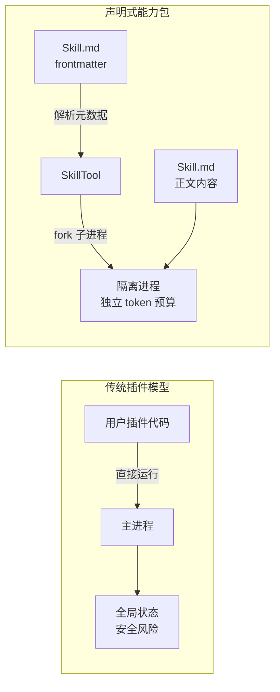
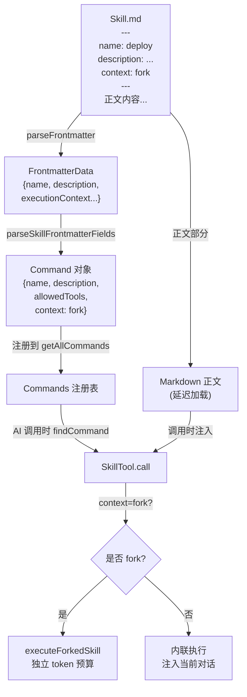
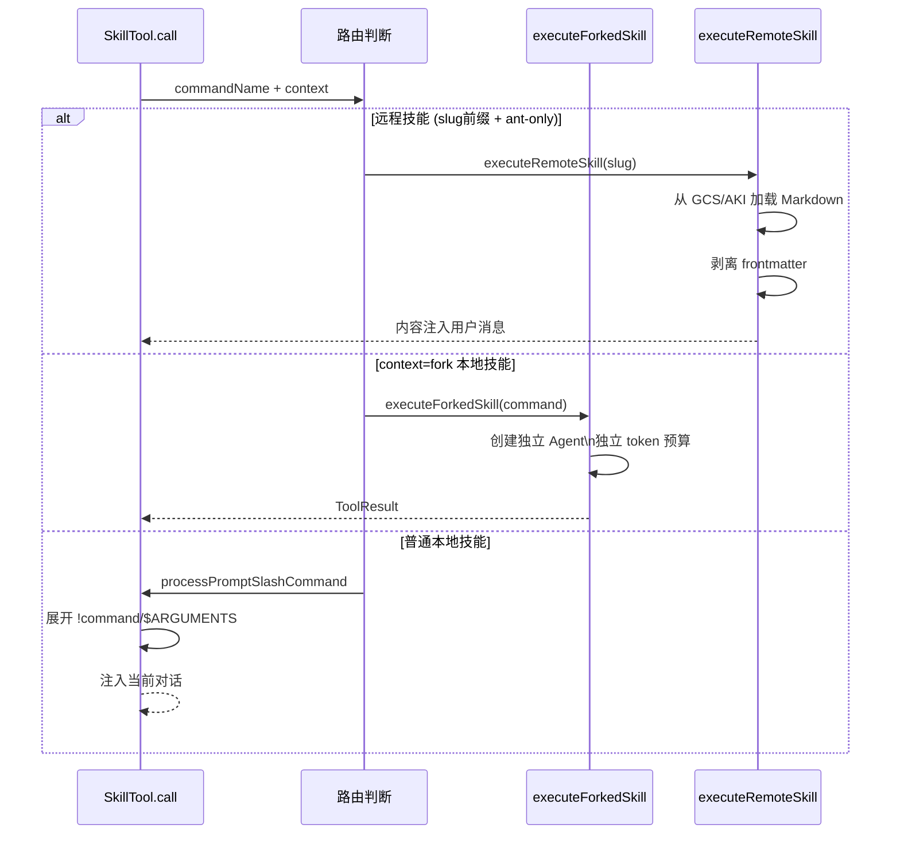
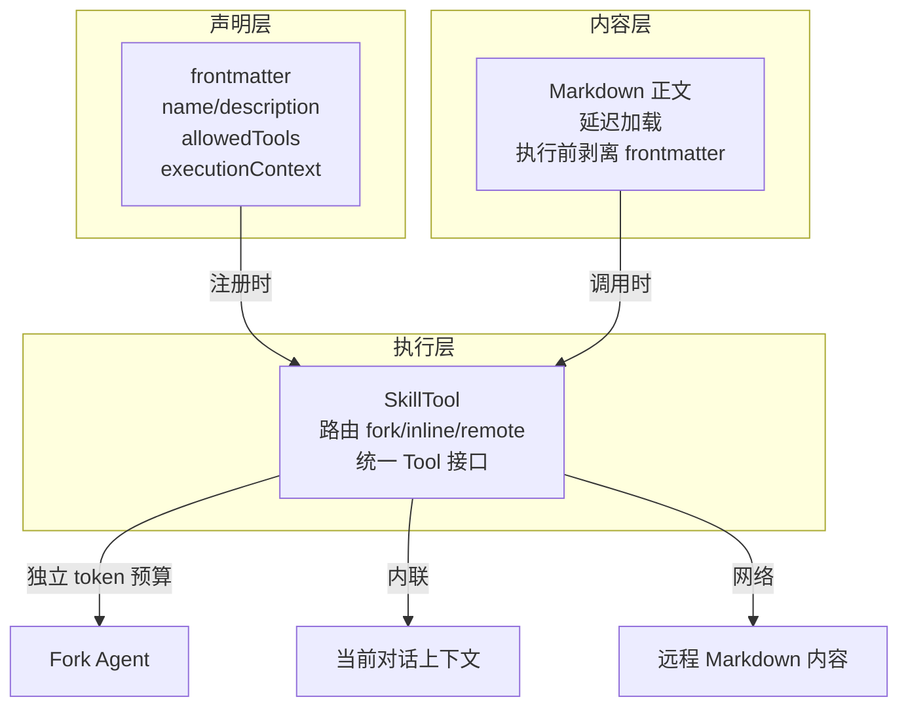
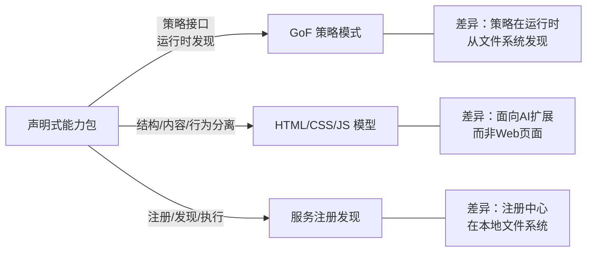

# 第14章：Skill 系统——声明式能力包的加载与执行

> "能力不需要编码才能存在——只需要被声明。"

在 Claude Code 中，你只需在 `.claude/skills/` 目录下放一个 Markdown 文件，就能注册一个新的 AI 能力。不需要修改任何代码，不需要重启进程，下次会话 AI 就能调用它。这个文件的前几行是 YAML frontmatter：`name`、`description`、`allowed-tools`——这些就是"声明"，Skill 系统在运行时读取这份声明，动态创建出一个可调用的工具。

这是**声明式能力包（Declarative Capability Package）**模式：把"能力是什么"（frontmatter 元数据）和"能力怎么执行"（fork 子进程）彻底分离，让 AI 能力扩展这件事，从"写代码"退化为"写文档"。

读完本章，你能理解为什么 Markdown + frontmatter 是比代码插件更合适的 AI 能力扩展格式，并能在自己的系统中设计一套用户只需写声明就能扩展 AI 能力的接口。

---

## 问题：插件系统的侵入性代价

为什么不用传统插件系统？

传统插件系统（如 VSCode 扩展、Webpack 插件）的通常做法是：插件代码被加载进主进程，通过 API 调用注册能力，在主进程的事件循环中运行。这个模型有一个根本性的代价：**用户代码在主进程中运行**。一个恶意或有 bug 的插件可以读取全局状态，阻塞主事件循环，甚至崩溃整个应用。

对于 AI Agent 这类工具，这个代价尤其难以承受——Agent 本身就代表用户执行高权限操作，如果插件代码能在 Agent 的进程内运行，安全边界就形同虚设。

Claude Code 的 Skill 系统回避了这个问题：用户扩展的单位不是"代码"，而是"Markdown 文件"。一个 Skill 文件包含两部分：YAML frontmatter（描述这个技能是什么）和正文（技能的实际 prompt 内容）。前者用于注册，后者用于执行。执行时，内容被注入到一个独立的 fork 子进程中运行，不污染主进程。

**图 14-1：插件系统 vs 声明式能力包的安全边界对比**



**图 14-1：两种模型的安全边界。** 插件模型的用户代码直接进入主进程，声明式能力包的执行路径（fork 子进程）与主进程完全隔离。

---

## 源码实例 1：frontmatter 到 Tool 的转化链路

我们先看技能如何从一个 Markdown 文件变成一个可调用的 `Tool` 对象。这条链路横跨两个模块，但职责划分很清晰。

**第一段链路：frontmatter 解析**

`loadSkillsDir.ts` 负责从 `.claude/skills/` 目录加载所有技能文件。加载时，它调用 `parseFrontmatter` 提取 YAML 头，再调用 `parseSkillFrontmatterFields` 验证并提取所有技能字段：

```typescript
// src/skills/loadSkillsDir.ts:185
export function parseSkillFrontmatterFields(
  frontmatter: FrontmatterData,
  markdownContent: string,
  resolvedName: string,
  descriptionFallbackLabel: 'Skill' | 'Custom command' = 'Skill',
): {
  displayName: string | undefined
  description: string
  allowedTools: string[]
  whenToUse: string | undefined
  executionContext: 'fork' | undefined
  // ... 更多字段
}
```

**源码参考：** `src/skills/loadSkillsDir.ts:185-208`

`parseSkillFrontmatterFields` 的返回值类型就是技能元数据的完整契约——不只是 `name` 和 `description`，还有 `allowedTools`（这个技能允许调用哪些工具）、`whenToUse`（AI 应该什么时候主动调用这个技能）、`executionContext: 'fork' | undefined`（是否需要在独立 fork 子进程中运行）。

一个重要的设计细节：`description` 字段有 fallback 逻辑。注意 `descriptionFallbackLabel` 参数——如果 frontmatter 里没有写 `description`，系统会从 Markdown 正文第一段提取（`extractDescriptionFromMarkdown`）。**这意味着一个写得好的 Skill 文档，即使没有显式声明 `description`，也能为 AI 提供足够的理解**。文档即声明，不是两件事。

还有一个性能细节值得注意。加载阶段只读取 frontmatter，不读取全文：

```typescript
// src/skills/loadSkillsDir.ts:100
export function estimateSkillFrontmatterTokens(skill: Command): number {
  const frontmatterText = [skill.name, skill.description, skill.whenToUse]
    .filter(Boolean)
    .join(' ')
  return roughTokenCountEstimation(frontmatterText)
}
```

**源码参考：** `src/skills/loadSkillsDir.ts:97-103`

注释明确说明：`since full content is only loaded on invocation`（翻译：完整内容仅在调用时加载）。这是**延迟加载**设计——系统启动时只把 frontmatter 元数据放进 AI 的系统提示，调用时才展开完整 Markdown 内容。大量技能并存时，只有被调用的才消耗上下文 token。

**第二段链路：Tool 对象创建**

解析完元数据后，`SkillTool` 把所有技能统一包装成一个通用工具对象：

```typescript
// src/tools/SkillTool/SkillTool.ts:331
export const SkillTool: Tool<InputSchema, Output, Progress> = buildTool({
  name: SKILL_TOOL_NAME,
  description: async ({ skill }) => `Execute skill: ${skill}`,
  toAutoClassifierInput: ({ skill }) => skill ?? '',
  // ...
})
```

**源码参考：** `src/tools/SkillTool/SkillTool.ts:331-352`

注意 `toAutoClassifierInput: ({ skill }) => skill ?? ''`——这是第12章介绍的 AI 分类器接口（详见第12章），这里 SkillTool 把技能名称作为分类器输入，让安全分类器能够判断"调用这个技能是否安全"。技能名称本身就是语义信息，无需暴露执行细节。

**图 14-2：frontmatter 到 Tool 的完整转化链路**



**图 14-2：Skill 从文件到执行的完整路径。** 注意正文内容（体积大）在延迟加载路径上，只在实际调用时才进入上下文。

---

## 源码实例 2：两种执行路径——本地 fork vs 远程调用

同一份 Skill 声明可以有两种执行方式，这是本章第二个模式实例。

**路径一：executeForkedSkill（本地技能，独立子进程）**

当 frontmatter 中声明了 `context: fork` 时，技能在一个隔离的 Agent 实例中运行：

```typescript
// src/tools/SkillTool/SkillTool.ts:122
async function executeForkedSkill(
  command: Command & { type: 'prompt' },
  commandName: string,
  args: string | undefined,
  context: ToolUseContext,
  canUseTool: CanUseToolFn,
  parentMessage: AssistantMessage,
  onProgress?: ToolCallProgress<Progress>,
): Promise<ToolResult<Output>>
```

**源码参考：** `src/tools/SkillTool/SkillTool.ts:122-131`

函数上方的注释（`src/tools/SkillTool/SkillTool.ts:120`）写道：`// This runs the skill prompt in an isolated agent with its own token budget.`（翻译：这在一个拥有独立 token 预算的隔离 Agent 中运行技能 prompt。）**独立 token 预算是关键——fork 子进程不会消耗主会话的上下文窗口**，技能可以有更长的执行链路而不影响主对话。

路由决策发生在 `SkillTool.ts:622`：

```typescript
// src/tools/SkillTool/SkillTool.ts:622
if (command?.type === 'prompt' && command.context === 'fork') {
  return executeForkedSkill(command, commandName, args, context, ...)
}
```

**源码参考：** `src/tools/SkillTool/SkillTool.ts:622-631`

**路径二：executeRemoteSkill（远程技能，网络加载）**

对于 feature flag `EXPERIMENTAL_SKILL_SEARCH` 启用且用户类型为 ant 时，技能可以从远程地址加载（`_canonical_<slug>` 前缀触发）：

```typescript
// src/tools/SkillTool/SkillTool.ts:969
async function executeRemoteSkill(
  slug: string,
  commandName: string,
  parentMessage: AssistantMessage,
  context: ToolUseContext,
): Promise<ToolResult<Output>>
```

**源码参考：** `src/tools/SkillTool/SkillTool.ts:969-974`

注释（`src/tools/SkillTool/SkillTool.ts:960`）说明了远程技能与本地技能的区别：`remote skills are declarative markdown — we wrap the content directly in a user message`（翻译：远程技能是声明式 Markdown——我们直接把内容包装进用户消息）。远程技能不需要 `!command` 或 `$ARGUMENTS` 展开，它只是内容注入——比本地 fork 更轻量，因为省去了子进程启动开销。

不管哪条路径，执行前都有一个统一的步骤：

```typescript
// src/tools/SkillTool/SkillTool.ts:1065
// 执行前剥离 YAML frontmatter（---\nname: x\n---），再添加头部说明
// （与 loadSkillsDir.ts:333 行为一致）。如果没有 frontmatter，parseFrontmatter 原样返回内容。
// （原文："Strip YAML frontmatter (---\nname: x\n---) before prepending the header
// (matches loadSkillsDir.ts:333). parseFrontmatter returns the original
// content unchanged if no frontmatter is present."）
const { content: bodyContent } = parseFrontmatter(content, skillPath)
```

**源码参考：** `src/tools/SkillTool/SkillTool.ts:1065-1068`

注释翻译：`执行前剥离 YAML frontmatter（---\nname: x\n---），再添加头部说明（与 loadSkillsDir.ts:333 行为一致）。如果没有 frontmatter，parseFrontmatter 原样返回内容。`——**这是元数据剥离执行（Metadata-Stripped Execution）模式**：frontmatter 在注册阶段被读取，在执行阶段被剥除，AI 看到的是干净的 prompt 内容，不会被 YAML 结构干扰。

**图 14-3：两种执行路径的对比**



**图 14-3：三种执行路径。** 远程技能最轻量（内容注入），fork 技能最隔离（独立 Agent），普通技能处于中间（内联展开）。

---

## 模式剖析：声明式能力包

现在我们有了足够的源码实例，可以提炼这个模式的结构。

**声明式能力包（Declarative Capability Package）的核心**是元数据与执行的严格分离：

**1. 声明层（frontmatter）**：用 YAML 格式描述能力的所有静态属性——名称、描述、允许的工具列表、调用场景提示、执行上下文。这些数据在系统启动时加载，进入 AI 的系统提示，让 AI 知道"有哪些技能可以调用"。

**2. 内容层（Markdown 正文）**：技能实际执行的 prompt 内容。延迟加载，只在调用时注入。执行前自动剥离 frontmatter（`parseFrontmatter`），保证 AI 收到的是干净的内容，不受元数据格式干扰。

**3. 执行层（SkillTool）**：统一的工具对象，根据声明层的 `context` 字段路由到不同的执行路径（fork / 内联 / 远程）。路由逻辑对调用者透明——AI 只需调用 `SkillTool`，不需要知道背后走哪条路径。

这三层的关键特征：**每一层只对自己的职责负责**。frontmatter 不知道执行路径，执行路径不知道 frontmatter 格式，SkillTool 把两者组合但不依赖任何一层的实现细节。

**图 14-4：声明式能力包的三层结构**



**图 14-4：三层结构与执行路径。** 声明层和内容层各自独立，执行层负责组合——这是关注点分离在 AI 能力扩展上的具体体现。

---

## 适用范围

| 场景 | 适用性 | 理由 | 替代方案 |
|------|--------|------|---------|
| 用户自定义 AI 能力（无需修改代码） | ✓ | 只需一个 .md 文件，frontmatter 即声明 | 传统插件系统（需要 API 权限和代码能力）|
| 能力本身是 LLM 可读的 prompt | ✓ | Markdown 正文即执行内容，文档与能力合一 | JSON/YAML 配置文件（不可直接执行）|
| 需要进程隔离执行（context: fork） | ✓ | fork 子进程天然隔离，不影响主进程 | 沙箱插件（实现复杂度高）|
| 能力需要独立长上下文（大型任务） | ✓ | fork 模式有独立 token 预算 | 内联执行（消耗主会话上下文）|
| 高频调用、低延迟（<50ms 响应） | ✗ | fork 子进程有进程启动开销 | 内置工具（直接在主进程运行）|
| 能力逻辑复杂（需要状态机或条件分支） | ✗（谨慎）| frontmatter 只能描述静态属性，无法表达条件逻辑（推断）| 代码插件（完整编程能力）|

---

## 权衡与局限

为什么不是所有扩展都用声明式能力包？

**表达力上限**：`parseSkillFrontmatterFields` 的返回类型定义了 frontmatter 能描述的全部属性（见 `loadSkillsDir.ts:185-208`）——约 15 个字段。这就是"声明力"的上限。技能不能通过 frontmatter 描述条件逻辑（"如果用户目录是 X 则用工具 Y"），不能描述运行时状态，不能描述动态生成的工具列表。**能力的复杂性被锁在 Markdown 正文（prompt）里**，而 prompt 能做的事受制于 LLM 能理解的范围。

**启动成本**：`executeForkedSkill` 为每次 fork 技能调用创建一个新的 Agent 实例（见 `SkillTool.ts:122`）。`createAgentId()` 调用（`SkillTool.ts:132`）创建新标识，整个子 Agent 生命周期（初始化 → 执行 → 回收）都有开销。对于简单的单步操作，这个开销可能超过操作本身的成本。

**token 成本双重化**：虽然延迟加载节省了系统提示的 token（只加载 frontmatter），但调用时的 Markdown 正文注入会消耗用户会话 token。`estimateSkillFrontmatterTokens`（`loadSkillsDir.ts:100`）只估算注册阶段的成本，调用时的成本取决于正文长度，且当前没有机制预算这部分开销。

**元数据同步问题**：frontmatter 在系统启动时加载，正文在调用时加载。如果用户修改了 Skill 文件的 frontmatter（更改了 `description` 或 `allowedTools`），主进程不感知这个变化（推断：需要重启或刷新命令注册才生效），但正文变更在下次调用时立即生效——这造成了声明层和内容层的潜在不一致窗口。

---

## 与已知模式的对话

这个模式与业界已知模式有什么关系？

**图 14-5：声明式能力包与三种业界模式的关系**



**图 14-5：与三种业界模式的关系定位。** 每种已知模式都能解释声明式能力包的某个维度，但没有一种完整覆盖——文件系统发现、AI 内容执行、frontmatter 剥离的组合是这个模式的独特之处。

**与 GoF 策略模式（Strategy Pattern）的关系**：策略模式封装可替换的算法，通过接口统一调用。`SkillTool` 与之相似——不同的执行路径（fork/inline/remote）是可替换的"策略"，对上层（AI 调用方）完全透明。区别在于：**策略模式的策略在编译时注册，声明式能力包的策略（Skill 文件）在运行时从文件系统发现**。这是"开放-封闭原则"的一种运行时实现——不修改代码，扩展能力集合。

**与 HTML/CSS/JS 分离模型的关系**：Web 开发中，HTML（结构/声明）、CSS（样式/视觉）、JS（行为/逻辑）严格分离。声明式能力包的三层——frontmatter（元数据/声明）、Markdown 正文（内容/prompt）、SkillTool（执行/行为）——在结构上完全对应。更重要的是，两者都追求同一个目标：**让最不会写代码的人也能做最多的定制**。HTML 让非程序员能搭网页，frontmatter 让非程序员能注册 AI 能力。

**与服务注册发现（Service Registry）模式的关系**：微服务架构中，服务在启动时注册到注册中心，消费者按名称发现服务。`loadSkillsDir.ts` 的技能加载与 `getAllCommands(context)`（`SkillTool.ts:615`）的查找机制，与服务注册发现在结构上一致——文件系统即注册中心，frontmatter 即服务元数据，`findCommand` 即服务发现。不同之处：服务注册中心通常在网络层，技能注册在本地文件系统（以及可选的远程 GCS/AKI）。

---

## 模式提炼

---

**声明式能力包（Declarative Capability Package）**

**解决的问题**：AI 系统需要允许用户扩展能力，但传统插件模型要求用户代码在主进程中运行，安全边界难以保障。

**核心做法**：用 Markdown frontmatter 声明能力元数据（名称、描述、工具权限、执行上下文），正文为执行内容，运行时解析元数据创建工具对象，执行时 fork 子进程并剥离 frontmatter 后注入内容。

**前置条件**：有统一的能力描述格式（frontmatter 字段集合）和隔离的执行环境（fork 子进程或远程调用）；能力逻辑可以用自然语言 prompt 表达。

**源码证据：**
- `src/tools/SkillTool/SkillTool.ts:331` — `buildTool()` 调用，将元数据包装为统一 Tool 接口
- `src/skills/loadSkillsDir.ts:185` — `parseSkillFrontmatterFields()`，frontmatter 到元数据的解析
- `src/skills/loadSkillsDir.ts:100` — `estimateSkillFrontmatterTokens()`，延迟加载的实现依据
- `src/tools/SkillTool/SkillTool.ts:122` — `executeForkedSkill()`，隔离执行路径
- `src/tools/SkillTool/SkillTool.ts:1065` — frontmatter 剥离注释，元数据剥离执行的设计说明

---

**元数据剥离执行（Metadata-Stripped Execution）**

**解决的问题**：Markdown 文件同时包含元数据（frontmatter）和执行内容，AI 执行时看到 YAML 结构会干扰 prompt 理解。

**核心做法**：执行前自动剥离 frontmatter，让 AI 只接收纯 Markdown 内容；`parseFrontmatter` 在没有 frontmatter 时原样返回，保证兼容性。

**前置条件**：文档格式有明确的元数据与内容分隔符（`---` 分隔线）；有可复用的 frontmatter 解析工具。

**源码证据：**
-zhrsrc/tools/SkillTool/SkillTool.ts:1065` — 剥离注释（`matches loadSkillsDir.ts:333`）
- `src/utils/frontmatterParser.ts` — `parseFrontmatter()` 实现（被多处共享）

---

## 你能做什么

- **用 Markdown frontmatter 设计"写声明即扩展"的系统**：把能力的元数据（名称、描述、适用场景）与执行内容（prompt/脚本）放在同一个文件中，用 YAML 分隔线明确边界，让文档即声明、内容即实现。

- **实现延迟加载策略**：系统启动时只解析 frontmatter（对应 `estimateSkillFrontmatterTokens` 的思路），将完整内容延迟到实际调用时加载。这让大量能力并存时系统提示不会膨胀。

- **在声明中包含 `executionContext` 字段**：让能力声明者决定执行隔离级别，而非在执行层硬编码。高风险操作声明为 `context: fork`，轻量操作走内联路径——路由由声明驱动，不由调用方决定。

- **执行前自动剥离元数据**（对应 `parseFrontmatter` 的调用）：frontmatter 是"给系统看的"，正文是"给 AI 看的"，执行时必须将两者分离，防止 YAML 结构污染 prompt 内容，影响 AI 理解。

- **设计 `description` 的 fallback 链**（对应 `parseSkillFrontmatterFields` 的 fallback 逻辑）：先读 frontmatter 的显式 `description`，再从 Markdown 正文第一段提取摘要，最后使用文件名作为兜底。这让轻量的技能文件（不写元数据）也能被 AI 正确识别。

- **在 `allowedTools` 中声明技能的工具权限**：每个技能只声明自己需要的工具集合，执行时系统按声明限制可用工具，而非让技能代码自行请求权限——权限模型在声明层完成，不渗入执行层。

---


技能的 Hook 注册机制——当 frontmatter 中声明了 `hooks` 字段时如何注册事件监听——将在第24章详细展开。本章聚焦的是 Skill 系统的核心模式：声明层（frontmatter）、内容层（Markdown 正文）、执行层（SkillTool 路由）三者如何分工协作，让用户能够只写 Markdown 就完成 AI 能力的注册与执行。Skill 的 frontmatter 元数据在系统启动时被加载，最终作为工具声明的一部分进入系统提示——下一章（第 15 章）将拆解这个组装过程：fetchSystemPromptParts() 如何分层并行拉取各路内容，把工具声明、项目指令、环境上下文组装成发往 Claude API 的完整提示词。
