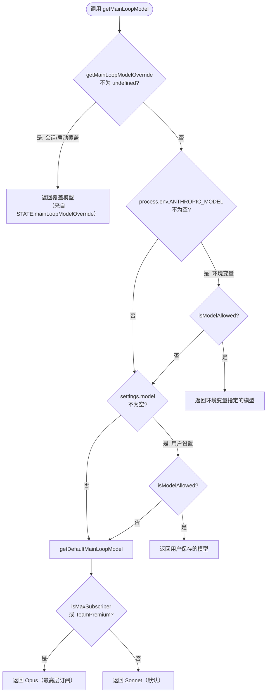
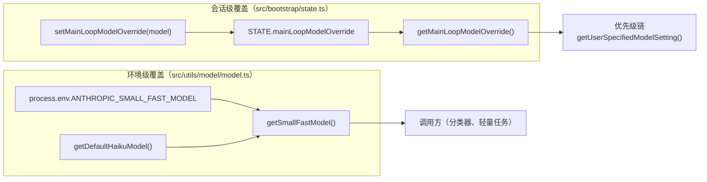
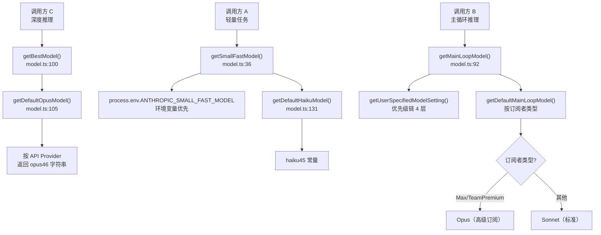
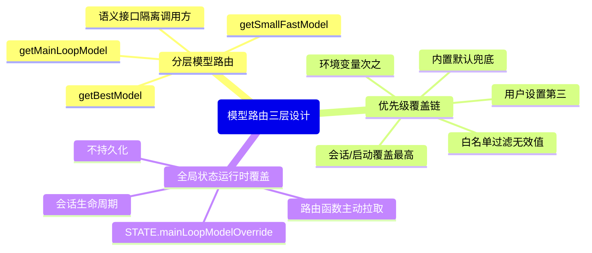
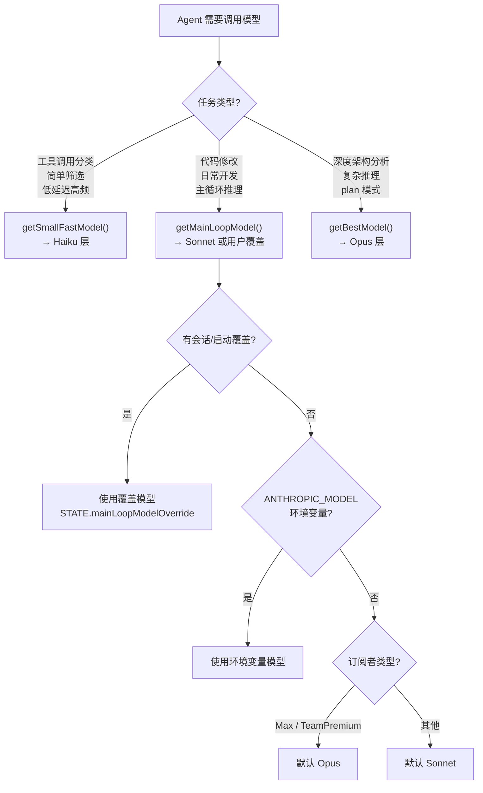

# 第 11 章：模型自动选择——Opus、Sonnet 与 Haiku 的路由逻辑

> "每次调用都写死模型名，就像每次出门都手动选择走哪条神经。"

想象一个 Agent 系统：它需要用 Haiku 快速分类 100 条工具调用结果，用 Sonnet 处理日常代码修改，用 Opus 完成深度架构分析。如果每个调用点都写死 `"claude-haiku-3-5-20241022"` 这样的字符串，那么下次模型版本升级时，你需要在整个代码库里搜索替换。更糟的是，当用户通过 `--model` 标志或 `/model` 命令想要切换模型时，硬编码的分类逻辑根本不响应。

Claude Code 的代码库里有一个反复出现的解决方案：**分层模型路由（Tiered Model Router）**——用语义化函数封装模型选择逻辑，调用方只说"给我快速小模型"或"给我最强模型"，内部实现一条优先级覆盖链，让环境变量、用户设置和会话覆盖自动生效。

读完本章，你能在自己的多模型 Agent 系统中设计同样的路由层，实现模型版本零散落、覆盖逻辑集中管理。

---

## 6.1 问题：多模型 Agent 的调用方困境

多模型系统的核心挑战不是"选哪个模型"，而是"在哪里决定选哪个模型"。

如果决策逻辑散落在调用方，就会出现 N 处重复判断：工具调用路径知道"轻量任务用 Haiku"，摘要生成路径知道"用 Sonnet"，代码审查路径知道"用 Opus"。每处调用方都在做同一件事——映射任务类型到模型名——这是明显的重复。更大的问题是**版本耦合**：一旦要从 `claude-3-5-haiku-20241022` 升级到 `claude-haiku-4-5-20251031`，所有调用点都需要同步更新。

Claude Code 通过三个语义化函数把这个决策收拢到一处。我们先看三层路由的全貌：

**表 11-1：三层模型路由对比**

| 函数 | 语义 | 对应能力层 | 典型场景 | 源码位置 |
|------|------|-----------|---------|---------|
| `getSmallFastModel()` | 快速轻量 | Haiku | 工具调用分类、简单填充、内容筛选 | `model.ts:36` |
| `getMainLoopModel()` | 主力推理 | Sonnet（默认）| 主循环代码修改、日常开发任务 | `model.ts:92` |
| `getBestModel()` | 最强推理 | Opus | 深度架构分析、复杂问题求解 | `model.ts:100` |

这三个函数是调用方的唯一接口。调用方不写模型名，只说"我需要什么级别的模型"。**函数名即是约定，函数体是实现**——这个分离让调用方在模型版本迭代时完全无感。

`getBestModel()` 的实现简单到出乎意料：

```typescript
// src/utils/model/model.ts:100-101
export function getBestModel(): ModelName {
  return getDefaultOpusModel()
}
```

**源码参考：** `src/utils/model/model.ts:100-101`

两行代码，没有条件分支，没有环境变量读取。这不是简陋，而是刻意的设计决策：`getBestModel()` 是**纯语义声明**，它说的是"给我系统知道的最强模型"，不需要任何运行时逻辑——因为"最强"的定义通过 `getDefaultOpusModel()` 统一管理（它会根据 API 提供商和模型发布状态返回正确版本，见 `model.ts:105-117`）。

与之形成对比的是 `getMainLoopModel()`——它的实现复杂得多，因为"主力模型"的选择涉及多个来源的优先级竞争。

---

## 6.2 源码实例 1：getMainLoopModel 的五层优先级链

`getMainLoopModel()` 是整套路由系统中逻辑最复杂的函数。它的文档注释已经清楚地给出了优先级地图。我们来看 `src/utils/model/model.ts:83`：

```typescript
// src/utils/model/model.ts:83-92
// 主循环模型的选择优先级顺序：
// 1. 会话内模型覆盖（来自 /model 命令）——最高优先级
// 2. 启动时模型覆盖（来自 --model flag）
// 3. ANTHROPIC_MODEL 环境变量
// 4. 用户保存的设置（settings.model）
// 5. 内置默认值
//（原文："Model Selection Priority Order:
//   1. Model override during session (from /model command) - highest priority
//   2. Model override at startup (from --model flag)
//   3. ANTHROPIC_MODEL environment variable
//   4. Settings (from user's saved settings)
//   5. Built-in default"）
export function getMainLoopModel(): ModelName {
  const model = getUserSpecifiedModelSetting()
  if (model !== undefined && model !== null) {
    return parseUserSpecifiedModel(model)
  }
  return getDefaultMainLoopModel()
}
```

**源码参考：** `src/utils/model/model.ts:83-97`

注释文档了 5 个概念层，但 `getMainLoopModel()` 的代码只有两行逻辑：调用 `getUserSpecifiedModelSetting()`，如果有结果就解析返回，否则返回内置默认。**复杂性被下推到了 `getUserSpecifiedModelSetting()`**。

我们来看 `getUserSpecifiedModelSetting()` 如何实现前 4 层：

```typescript
// src/utils/model/model.ts:61-77（精简版）
// 函数内优先级顺序：
// 1. 会话/启动覆盖 → getMainLoopModelOverride()
// 2. ANTHROPIC_MODEL 环境变量
// 3. 用户保存的设置
//（原文："Priority order within this function:
//   1. Model override during session (from /model command) - highest priority
//   2. Model override at startup (from --model flag)
//   3. ANTHROPIC_MODEL environment variable
//   4. Settings (from user's saved settings)"）
export function getUserSpecifiedModelSetting(): ModelSetting | undefined {
  let specifiedModel: ModelSetting | undefined

  const modelOverride = getMainLoopModelOverride()
  if (modelOverride !== undefined) {
    specifiedModel = modelOverride
  } else {
    const settings = getSettings_DEPRECATED() || {}
    specifiedModel = process.env.ANTHROPIC_MODEL || settings.model || undefined
  }

  // 如果指定的模型不在 availableModels 白名单中，忽略它
  // （原文："Ignore the user-specified model if it's not in the availableModels allowlist."）
  if (specifiedModel && !isModelAllowed(specifiedModel)) {
    return undefined
  }

  return specifiedModel
}
```

**源码参考：** `src/utils/model/model.ts:61-77`

这里有一个值得关注的设计细节：注释中的层 1（会话 /model 命令）和层 2（启动 --model flag）**在代码中合并为同一个检查**——都通过 `getMainLoopModelOverride()` 读取同一个状态变量 `STATE.mainLoopModelOverride`。注释在概念上区分了两个来源，但实现层将它们统一存储，因为**对于路由逻辑来说，这两种覆盖的语义完全相同**：都是"用户明确指定了一个模型，优先用它"。

这揭示了一个关于"优先级链"的重要洞察：**优先级文档应该列出所有概念来源，而非实现细节**。文档面向"理解系统行为"，代码面向"高效执行"——两者可以有不同的分层粒度。

最后，`getDefaultMainLoopModel()`（第 5 层，内置默认）还有一个额外的复杂性：它根据**订阅者类型**返回不同的默认值：

```typescript
// src/utils/model/model.ts:178-200（精简版）
export function getDefaultMainLoopModelSetting(): ModelName | ModelAlias {
  // Max 和 Team Premium 订阅者默认用 Opus
  if (isMaxSubscriber()) {
    return getDefaultOpusModel() + (isOpus1mMergeEnabled() ? '[1m]' : '')
  }
  if (isTeamPremiumSubscriber()) {
    return getDefaultOpusModel() + (isOpus1mMergeEnabled() ? '[1m]' : '')
  }
  // PAYG、企业版、Team Standard 和 Pro 默认用 Sonnet
  return getDefaultSonnetModel()
}
```

**源码参考：** `src/utils/model/model.ts:178-200`

这意味着"内置默认"不是一个固定值——Max 用户的默认模型是 Opus，普通用户的默认是 Sonnet。**第 5 层优先级本身也是一个路由逻辑**，它把"用户类型"作为路由维度。

**图 11-1：getMainLoopModel 五层优先级链**



图中有一个容易忽略的细节：每个用户指定的模型值在返回前都要经过 `isModelAllowed()` 验证——如果模型不在白名单中，该层会被直接跳过（返回 `undefined`），优先级链继续向下。这是一个**容错设计**：用户设置了一个已弃用的模型名，系统不报错，而是静默降级到下一层默认值。

---

## 6.3 源码实例 2（变体）：覆盖机制的两层实现

上一节看到了优先级链的完整视图。现在我们关注"覆盖"这个维度——系统如何允许不同来源的覆盖在不同生命周期内生效。

**图 11-2：覆盖机制的两个维度**



左侧是会话级覆盖（通过 STATE 对象跨模块传递），右侧是环境级覆盖（通过 env var 内联实现）。两条路径最终都汇入 `getUserSpecifiedModelSetting()` 的优先级链或直接返回给调用方。

**会话级覆盖**存储在 `src/bootstrap/state.ts`，通过 `setMainLoopModelOverride` 写入、`getMainLoopModelOverride` 读取：

```typescript
// src/bootstrap/state.ts:838-851
// 获取通过 --model CLI flag 或用户更新配置时设置的模型覆盖
// （原文："Gets the model override set from the --model CLI flag or after the user
//   updates their configured model."）
export function getMainLoopModelOverride(): ModelSetting | undefined {
  return STATE.mainLoopModelOverride
}

export function setMainLoopModelOverride(
  model: ModelSetting | undefined,
): void {
  STATE.mainLoopModelOverride = model
}
```

**源码参考：** `src/bootstrap/state.ts:838-851`

`setMainLoopModelOverride` 是由 `/model` 命令或 `--model` 启动 flag 调用的。它写入全局 `STATE` 对象，而不是持久化到文件——这意味着会话结束后，这个覆盖就消失了。**会话级覆盖的生命周期 = 会话的生命周期**，这是刻意的设计：用户临时切换模型不应该永久改变默认配置。

**环境级覆盖**则内联在各 `getSmallFastModel()` 的实现中：

```typescript
// src/utils/model/model.ts:36-38
export function getSmallFastModel(): ModelName {
  return process.env.ANTHROPIC_SMALL_FAST_MODEL || getDefaultHaikuModel()
}
```

**源码参考：** `src/utils/model/model.ts:36-38`

`getSmallFastModel()` 只有一行逻辑：先查环境变量 `ANTHROPIC_SMALL_FAST_MODEL`，有就返回，没有就用内置 Haiku 默认。与 `getMainLoopModel` 的 5 层优先级链相比，`getSmallFastModel` 简单得多——**只有 2 层**：环境变量 > 内置默认。

为什么 `getSmallFastModel` 不需要会话覆盖？因为"小快模型"的使用场景是高频轻量任务（内容分类、简单填充），**用户不太可能在会话中临时切换这类模型**。`/model` 命令改变的是主循环模型（`getMainLoopModel`），不影响轻量任务路由。这是一个有意识的分层设计：重度路由（主循环）有完整覆盖链，轻度路由（小模型）保持简单。

两种覆盖机制的差异体现了一个更普遍的模式：**覆盖层的数量应该匹配路由函数的灵活性需求**。不要为所有路由函数都实现 5 层覆盖——对于不需要细粒度控制的路由，2 层（环境变量 + 默认值）就足够了。

---

## 6.4 模式剖析：分层模型路由（Tiered Model Router）

现在我们来为这个模式正式命名和提炼。

### 模式命名

**分层模型路由（Tiered Model Router）**

**解决的问题**：多模型 Agent 系统需要在不同场景下选择不同能力/成本的模型，硬编码模型名导致版本升级时需要修改所有调用点，且无法响应运行时覆盖需求。

**核心做法**：将模型选择封装为语义化函数（`getSmallFast`/`getMainLoop`/`getBest`），函数名表达意图，函数体实现优先级链。调用方只通过语义接口交互，从不直接引用模型名字符串。

**前置条件**：系统使用 2 个以上能力层次不同的模型；任务有明确的复杂度分级（轻量/中等/深度）；需要支持至少一种运行时覆盖（环境变量、会话切换、启动 flag）。

**源码证据**：`src/utils/model/model.ts:36-100`（三个路由函数）；`src/utils/model/model.ts:61-77`（`getUserSpecifiedModelSetting` 优先级链）

**图 11-3：三层路由函数与 Default 函数的关系**



从图中我们能看到三层路由函数的设计对称性：越复杂的路由（`getMainLoopModel`）有越多的覆盖层；越简单的路由（`getBestModel`）实现越薄。这个对称性不是偶然的——**覆盖层的复杂度与该路由函数被用户直接影响的频率成正比**。用户最常切换主循环模型，很少切换分类用的小模型，几乎不切换最强模型（因为总是想要最好的）。

---

## 6.5 适用范围

| 场景 | 适用 | 理由 / 替代方案 |
|------|------|----------------|
| 系统有 2+ 个不同能力层的模型 | ✓ | 分层语义让调用方无需感知具体版本 |
| 任务有明确的轻/中/重分级 | ✓ | 函数名与任务语义对齐，降低调用方思维负担 |
| 需要支持环境变量模型覆盖（CI/测试替换） | ✓ | 环境变量覆盖是 2 层优先级的标准做法 |
| 需要运行时（会话内）模型切换 | ✓ | 状态级覆盖机制专为此场景设计 |
| 只有一个模型（单模型系统） | ✗ | 无需路由层，直接常量即可 |
| 模型选择依赖用户输入的复杂条件 | ✗ | 改用 Strategy 模式（条件逻辑由调用方注入） |
| 需要 A/B 测试两个同级模型 | ✗ | 改用特性开关 + 随机分流，而非固定优先级链 |
| 模型层数 > 5 | ✗ | 改用路由规则表（`{ taskType: model }` 查表），if 链难以维护 |

值得注意的是，Claude Code 中 `getBestModel()` 的调用场景相当有限——**主要用于"plan 模式"等需要深度分析的场景**，而不是默认路径。大多数日常任务走 `getMainLoopModel()`。这个使用分布揭示了一个务实原则：**能力最强的层不一定是最常用的层，路由层应该让调用方按需选择**，而非默认使用最贵的模型。

---

## 6.6 权衡与局限

**5 层注释 vs 4 层实现**。优先级注释文档了 5 个概念层（把会话覆盖和启动覆盖单独列出），但实现只有 4 个代码检查点（两者共享同一个 `STATE.mainLoopModelOverride`）。这是**文档对称性和代码对称性的取舍**：文档更关心"来源是什么"（便于理解调试），代码更关心"效果是什么"（两种覆盖行为相同，合并降低复杂度）。当文档层次和实现层次不一致时，容易让调试者误以为有两个独立的覆盖变量。

**白名单校验的沉默降级**。当用户设置了一个不在 `isModelAllowed` 白名单中的模型，系统不报错——直接返回 `undefined` 并落回到下一层默认值。这个设计对用户友好，但对调试者不友好：如果用户的 `settings.model` 被静默忽略，他们可能不知道为什么模型没有按预期工作。

**默认值的订阅者依赖**。`getDefaultMainLoopModelSetting()` 根据 `isMaxSubscriber()` / `isTeamPremiumSubscriber()` 返回不同默认值（见 `model.ts:178-200`）。这意味着**同一套代码在不同用户手中行为不同**，在没有付费订阅的测试环境中，默认模型是 Sonnet 而非 Opus——需要通过环境变量覆盖来验证 Opus 路径的行为。

**性能影响**：`getSmallFastModel()` 和 `getBestModel()` 都在冷路径（被调用时才执行），无需 memoize。`getMainLoopModel()` 会读取 `STATE`（内存访问），也不是性能瓶颈。环境变量的读取（`process.env.ANTHROPIC_SMALL_FAST_MODEL`）每次都重新读，对 Node.js 环境来说是微秒级操作，不构成问题。

---

## 6.7 与已知模式的对话

**与 GoF 职责链（Chain of Responsibility）的比较**。职责链模式将请求沿处理器链传递，每个处理器可以"处理"或"传递"。`getUserSpecifiedModelSetting()` 的级联 if 链与之非常相似——高优先级检查是否有结果，无结果就传递给下一层。**相同点**：都有"找到就停止"的语义，层次有明确的顺序。**不同点**：职责链通常处理请求并产生副作用，而这里每一层只是"读取值"，没有副作用——更接近"责任链"的查询变体，而非命令处理链。

**与 Strategy 模式的比较**。Strategy 模式将算法封装成对象，由调用方在运行时注入。`getMainLoopModel()` 的覆盖机制看起来像 Strategy（调用方可以注入不同模型），但有本质区别：Strategy 的选择发生在**调用时**（调用方主动传入），这里的覆盖发生在**存储时**（全局 state 在任何时候都可以被设置，路由函数被动读取）。这是**拉取（pull）vs 推送（push）**的区别——Claude Code 选择了拉取模式，让路由函数在调用时自己决定使用哪个模型，而不是要求调用方每次传入策略。

**Claude Code 的选择**。三个路由函数 + 一条优先级覆盖链，是系统中所有模型选择逻辑的唯一入口。没有"在某个地方传入模型参数"的设计，没有"模型工厂"类，只有三个语义清晰的函数。这符合"最少抽象"原则——用函数而非对象解决路由问题，在 TypeScript 生态中是合理的轻量选择。

---

## 模式提炼

### 模式 1：分层模型路由（Tiered Model Router）

**解决的问题**：多模型 Agent 调用方硬编码模型名，导致版本升级需全局搜索替换，且无法响应运行时覆盖。

**核心做法**：用语义化函数封装模型选择（`getSmallFast`/`getMainLoop`/`getBest`），调用方只通过语义接口，函数内部处理所有覆盖和默认逻辑。

**前置条件**：系统有 2+ 个能力层次不同的模型；任务有明确的复杂度分级；需要支持运行时覆盖。

**源码证据**：`src/utils/model/model.ts:36-101`（三个路由函数，语义清晰，实现差异显著）

---

### 模式 2：优先级覆盖链（Priority Override Chain）

**解决的问题**：多个来源（会话状态、环境变量、用户设置、内置默认）都可以影响模型选择，需要明确的优先级顺序。

**核心做法**：`getUserSpecifiedModelSetting()` 用级联 if 链实现 4 层检查（会话/启动覆盖 → 环境变量 → 用户设置），找到非 `undefined` 值立即返回。最终兜底由调用者的 fallback 处理（内置默认）。

**前置条件**：覆盖来源数量固定且优先级关系稳定；需要"沉默降级"而非"报错"的用户体验；白名单校验不阻断链，只过滤无效值。

**源码证据**：`src/utils/model/model.ts:61-77`（`getUserSpecifiedModelSetting` 的 if 链）；`src/utils/model/model.ts:83-89`（5 层优先级注释）

---

### 模式 3：全局状态运行时覆盖（Runtime Override via Global State）

**解决的问题**：用户在会话中切换模型（`/model` 命令），需要跨模块生效但不持久化到配置文件。

**核心做法**：覆盖值写入全局 `STATE` 对象（`state.ts:846`），路由函数调用时主动读取 `getMainLoopModelOverride()`。STATE 不持久化，会话结束后覆盖消失。

**前置条件**：覆盖的生命周期等于会话的生命周期；不需要持久化；路由函数可以访问全局状态。

**源码证据**：`src/bootstrap/state.ts:838-851`（`getMainLoopModelOverride` + `setMainLoopModelOverride`）

---

**图 11-4：三个模式的协作总览**



三个模式并非独立存在——**分层模型路由**是调用方接口，**优先级覆盖链**是接口背后的决策引擎，**全局状态运行时覆盖**是覆盖链中优先级最高的那一层。使用时三者协作，但可以按需独立替换任意一层。

---

## 你能做什么

**图 11-5：三种调用场景的路由函数选择决策**



在设计自己的 Agent 时，以上决策树是起点：先问"任务需要什么级别的能力"，再问"用户是否有覆盖需求"。

- **用语义化函数替代散落的模型名**：在 Agent 系统中，建立 `getSmallFastModel()`/`getMainLoopModel()`/`getBestModel()` 三个函数，所有调用点通过函数而非字符串常量引用模型。版本升级时只改函数内部。

- **为每个路由层设计合适数量的覆盖层**：频繁切换的路由（主循环模型）实现完整覆盖链；稳定的路由（分类用小模型）只需 2 层（环境变量 + 默认值）。不要为所有路由函数都实现相同数量的覆盖层。

- **将运行时覆盖存入会话级全局状态而非持久化配置**：用户的临时切换（`/model` 命令）不应该修改 `settings.json`，会话结束后自动恢复。这防止了一次调试操作意外成为永久配置。

- **在代码注释中显式列出优先级顺序**：仿照 `model.ts:83-89` 的注释风格，用有序列表列出覆盖来源和优先级。当调试"为什么模型不对"时，这个注释是第一个参考点。

- **设计白名单校验时选择沉默降级**：当用户设置的模型已弃用或不可用时，继续链路（返回 `undefined`）而不是报错。对最终用户，沉默降级比报错然后无法使用更友好。

- **如果路由层数超过 5，改用查表法**：当需要根据任务类型路由到 5+ 个模型时，`{ taskType: model }` 字典比 if 链更易维护——新增一个任务类型只需加一行键值对。

---

Effort 和 thinking 机制会进一步影响模型的使用深度——同一个模型在不同 effort 级别下的行为差异，以及 thinking 预算如何控制 Opus 的推理深度，将在第 12 章详细展开。本章的三层路由是"选择哪个模型"，第 12 章解决"如何用好这个模型"。
