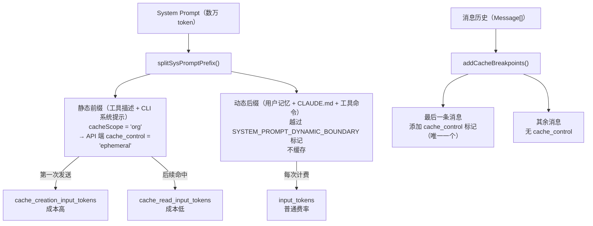
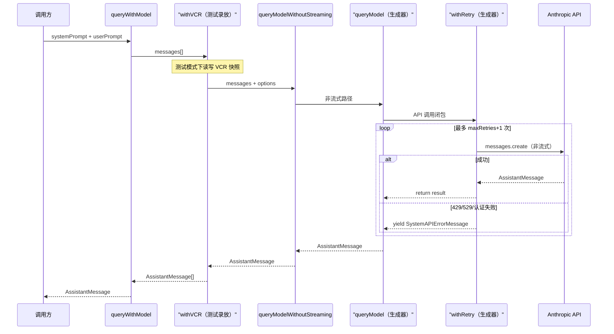
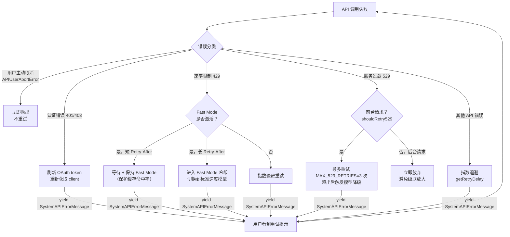

# 第 13 章：API 通信层——Anthropic 客户端、重试机制与提示词缓存策略

> "把缓存命中率当成架构约束来设计，而不是事后优化。"

每次向 Anthropic API 发送请求，system prompt 的每一个 token 都会被计费。Claude Code 的 system prompt 包含工具描述、记忆文件、CLAUDE.md 内容……轻松达到数万 token。如果每轮对话都完整发送这些内容，API 成本会快速累积。

代码库中有两个函数重复出现在所有 API 调用路径上：`addCacheBreakpoints()` 在消息序列里精确放置缓存标记，`splitSysPromptPrefix()` 把 system prompt 切分为可缓存的静态前缀和不可缓存的动态后缀。两者用不同维度实现同一个目标——**让 Anthropic 服务器认出"这部分我上次见过"**，从而跳过重复计算。

同一模块里还有另一个贯穿所有 API 调用的模式：`withRetry()` 用 async generator 把重试过程变成可观测的事件序列，把错误分类成"可重试 + 等待多久"，让每次 API 调用都自带韧性。读完本章，我们将掌握"提示词缓存优先（Cache-First Prompt）"的工程手段，以及把重试逻辑封装成生成器的设计哲学。

---

## 问题：token 计费的双重机会

Anthropic API 的计费有三类 token：`input_tokens`（每次都计）、`cache_creation_input_tokens`（首次写入缓存，费率更高）、`cache_read_input_tokens`（命中缓存，费率大幅低于 input）。

关键在于：**缓存命中的前提是字节级一致性**。发送给 API 的消息只要有任何一个字节变化，前缀缓存就失效。Claude Code 的 `updateUsage` 函数追踪这三类 token 的累计值：

```typescript
// src/services/api/claude.ts:2924
export function updateUsage(
  usage: Readonly<NonNullableUsage>,
  partUsage: BetaMessageDeltaUsage | undefined,
): NonNullableUsage {
  // ...
  return {
    input_tokens: /* ... */,
    cache_creation_input_tokens:
      partUsage.cache_creation_input_tokens !== null &&
      partUsage.cache_creation_input_tokens > 0
        ? partUsage.cache_creation_input_tokens
        : usage.cache_creation_input_tokens,
    cache_read_input_tokens:
      partUsage.cache_read_input_tokens !== null &&
      partUsage.cache_read_input_tokens > 0
        ? partUsage.cache_read_input_tokens
        : usage.cache_read_input_tokens,
    // ...
  }
}
```

**源码参考：** `src/services/api/claude.ts:2924`

`cache_read_input_tokens` 字段是缓存策略是否有效的实测指标。如果每轮对话这个数字都接近于零，说明缓存断点放置有问题——system prompt 在每轮都被当成新内容发送。

**图 13-1：System Prompt 的缓存分区结构**



*图注：缓存分区的设计目标是让"变化最少的部分"进入缓存。工具描述在会话内基本不变，是缓存的最佳候选。用户记忆和 CLAUDE.md 内容可能随时更新，不缓存。消息历史里只有最后一条需要标记——标记过多反而会导致旧的 KV 页面被不必要地保留在服务器内存里。*

**图 13-2：queryWithModel 调用链**



*图注（图 13-2）：queryWithModel 是 claude.ts 暴露的轻量级非流式接口，用于标题生成、分类器判断等内部调用。withVCR 是测试录放层，生产环境透明传递。调用链最终到达 withRetry，由后者负责错误处理和重试。（`src/services/api/claude.ts:3300`）*

---

## 源码实例 1：缓存断点策略——精确到字节的工程决策

### addCacheBreakpoints：一个请求只放一个标记

`src/services/api/claude.ts:3063` 的 `addCacheBreakpoints()` 是消息序列缓存的核心：

```typescript
// src/services/api/claude.ts:3063
export function addCacheBreakpoints(
  messages: (UserMessage | AssistantMessage)[],
  enablePromptCaching: boolean,
  querySource?: QuerySource,
  useCachedMC = false,
  newCacheEdits?: CachedMCEditsBlock | null,
  pinnedEdits?: CachedMCPinnedEdits[],
  skipCacheWrite = false,
): MessageParam[] {
  // 每次请求只放一个消息级 cache_control 标记。Mycro（Anthropic 内部 KV 缓存层）
  // 的逐轮回收机制会释放所有未在 cache_store_int_token_boundaries 中的缓存前缀位置
  // 的本地注意力 KV 页面。若放两个标记，倒数第二个位置会被保护，其 KV 页面多存活
  // 一轮，即使没有请求从那里恢复——只放一个标记时，这些页面立即被释放。
  // 对于"发出即忘"的 fork（skipCacheWrite），标记移到倒数第二条消息。
  // （原文：Exactly one message-level cache_control marker per request. Mycro's
  //  turn-to-turn eviction frees local-attention KV pages at any cached prefix
  //  position NOT in cache_store_int_token_boundaries. With two markers the
  //  second-to-last position is protected... immediately. For fire-and-forget
  //  forks (skipCacheWrite) we shift the marker to the second-to-last message.）
  const markerIndex = skipCacheWrite ? messages.length - 2 : messages.length - 1
```

**源码参考：** `src/services/api/claude.ts:3063`

注释里有一个关键词：**Mycro**（Anthropic 内部的 KV 缓存层）。注释解释了为什么"只放一个标记"：如果放两个，第二个之前的位置就被保护了，对应的 KV 页面会多占一轮服务器内存，即使没有任何请求会从那个位置恢复。`skipCacheWrite` 参数是 fork subagent 专用的——fork 是"发出即忘"的子请求，不需要写入新的缓存，标记移到倒数第二条消息，让服务器知道这是复用已有缓存的请求，不产生新的缓存写入成本。

`markerIndex` 之后的注释还警告了一个微妙的 bug：

```typescript
// src/services/api/claude.ts:624
// 浅拷贝数组内容，防止原地修改（如 insertCacheEditsBlock 的 splice）污染原始消息。
// 若不拷贝，多次调用 addCacheBreakpoints 会共享同一数组，导致重复 splice 插入 cache_edits。
// （原文：Clone array content to prevent in-place mutations (e.g., insertCacheEditsBlock's
//  splice) from contaminating the original message. Without cloning, multiple calls
//  to addCacheBreakpoints share the same array and each splices in duplicate cache_edits.）
return {
  role: 'user',
  content: Array.isArray(message.message.content)
    ? [...message.message.content]
    : message.message.content,
}
```

**源码参考：** `src/services/api/claude.ts:624`

`[...message.message.content]` 是一个浅拷贝——它防止了同一个消息数组被多次调用 `addCacheBreakpoints()` 时重复 splice 的问题。这类防御性拷贝在高频调用路径上很常见，但往往没有注释说明理由——这里的注释是少见的例外，精确描述了不拷贝会发生什么。

### splitSysPromptPrefix：静态与动态的分界线

`src/utils/api.ts:321` 的 `splitSysPromptPrefix()` 把 system prompt 在 `SYSTEM_PROMPT_DYNAMIC_BOUNDARY` 标记处切分：

```typescript
// src/utils/api.ts:321
export function splitSysPromptPrefix(
  systemPrompt: SystemPrompt,
  options?: { skipGlobalCacheForSystemPrompt?: boolean },
): SystemPromptBlock[] {
  const useGlobalCacheFeature = shouldUseGlobalCacheScope()
  // ...
  const boundaryIndex = systemPrompt.findIndex(
    s => s === SYSTEM_PROMPT_DYNAMIC_BOUNDARY,
  )
  if (boundaryIndex !== -1) {
    // boundary 之前 → cacheScope = 'org'（全局缓存，跨请求共享）
    // boundary 之后 → cacheScope = null（不缓存）
```

**源码参考：** `src/utils/api.ts:321`

`SYSTEM_PROMPT_DYNAMIC_BOUNDARY` 是一个字符串常量（`src/constants/prompts.ts:114`：`'__SYSTEM_PROMPT_DYNAMIC_BOUNDARY__'`）。提示词装配时，动态内容（用户记忆、CLAUDE.md 内容、工具命令）会被插入到这个标记之后；工具描述、CLI 系统提示等静态内容在标记之前。`cacheScope = 'org'` 表示这部分内容在**组织级别**共享缓存——同一组织内不同用户的会话，如果 system prompt 前缀相同，可以复用同一份 KV 缓存（推断：这是 Anthropic 内部全局缓存策略的工程体现）。

`splitSysPromptPrefix` 在 `claude.ts:3222` 被调用时，其输出直接决定哪些 system prompt 块携带 `cache_control: { type: 'ephemeral' }` 字段——这个字段就是告诉 Anthropic API"请把这部分内容放入缓存"的信号：

```typescript
// src/services/api/claude.ts:3222
return splitSysPromptPrefix(systemPrompt, {
  skipGlobalCacheForSystemPrompt: options?.skipGlobalCacheForSystemPrompt,
}).map(block => {
  return {
    type: 'text' as const,
    text: block.text,
    ...(enablePromptCaching &&
      block.cacheScope !== null && {
        cache_control: getCacheControl({
          scope: block.cacheScope,
          querySource: options?.querySource,
        }),
      }),
  }
})
```

**源码参考：** `src/services/api/claude.ts:3222`

---

## 源码实例 2（变体）：withRetry——把重试变成可观测的事件序列

缓存策略降低了命中时的成本；重试策略保证了未命中或服务过载时的可靠性。`src/services/api/withRetry.ts:170` 的 `withRetry()` 是一个 `async function*`（异步生成器）：

```typescript
// src/services/api/withRetry.ts:170
export async function* withRetry<T>(
  getClient: () => Promise<Anthropic>,
  operation: (
    client: Anthropic,
    attempt: number,
    context: RetryContext,
  ) => Promise<T>,
  options: RetryOptions,
): AsyncGenerator<SystemAPIErrorMessage, T> {
  const maxRetries = getMaxRetries(options)  // 默认 DEFAULT_MAX_RETRIES = 10
  let consecutive529Errors = options.initialConsecutive529Errors ?? 0
  for (let attempt = 1; attempt <= maxRetries + 1; attempt++) {
    try {
      client = client ?? await getClient()
      return await operation(client, attempt, retryContext)
    } catch (error) {
      // 错误分类与处理...
```

**源码参考：** `src/services/api/withRetry.ts:170`

函数签名的核心是 `AsyncGenerator<SystemAPIErrorMessage, T>`：生成器在每次重试时 `yield` 一条 `SystemAPIErrorMessage`（用户可见的"正在重试..."提示），最终 `return T`（成功的 API 响应）。这让调用方能实时看到重试进度——不需要轮询状态，等待 generator 的 `next()` 就能得到下一条状态更新。

```typescript
// src/services/api/withRetry.ts:52-55
const DEFAULT_MAX_RETRIES = 10
const FLOOR_OUTPUT_TOKENS = 3000
const MAX_529_RETRIES = 3
export const BASE_DELAY_MS = 500
```

**源码参考：** `src/services/api/withRetry.ts:52`

四个常量定义了重试的参数空间。`MAX_529_RETRIES = 3` 特别小——这是刻意的。注释说明了原因：在容量级联崩溃时，每次 529 重试都是对网关 3-10× 的流量放大。非关键路径（摘要、标题生成、分类器）在遇到第一个 529 时立即放弃，只有用户正在等待结果的前台请求（`FOREGROUND_529_RETRY_SOURCES`）才会重试。

### 错误分类：区别对待不同的失败

`getRetryDelay()` 实现了带抖动的指数退避：

```typescript
// src/services/api/withRetry.ts:530
export function getRetryDelay(
  attempt: number,
  retryAfterHeader?: string | null,
  maxDelayMs = 32000,
): number {
  if (retryAfterHeader) {
    const seconds = parseInt(retryAfterHeader, 10)
    if (!isNaN(seconds)) {
      return seconds * 1000  // 优先遵从服务端指令
    }
  }
  const baseDelay = Math.min(
    BASE_DELAY_MS * Math.pow(2, attempt - 1),  // 500ms, 1s, 2s, 4s...
    maxDelayMs,                                  // 上限 32s
  )
  const jitter = Math.random() * 0.25 * baseDelay  // 25% 随机抖动
  return baseDelay + jitter
}
```

**源码参考：** `src/services/api/withRetry.ts:530`

抖动（jitter）是防止"惊群效应"（thundering herd）的标准做法：如果所有客户端在同一时刻重试，会在服务端造成新的峰值压力。25% 随机抖动让重试请求分散到一个时间窗口里。`Retry-After` 头字段的优先级高于计算值——当服务端明确告知"请在 X 秒后重试"时，客户端应该遵守，而不是用自己的算法计算一个更短的等待时间。

**图 13-3：withRetry 重试决策树**



*图注：529（过载）和 429（速率限制）的处理路径完全不同。前台 529 最多重试 3 次后触发模型降级（Opus→Sonnet）；后台 529 直接放弃（避免在容量紧张时雪上加霜）。Fast Mode 的 429 要判断 `Retry-After` 时长——等待时间短就保持 Fast Mode 重试（保住缓存），等待时间长就切换标准模型（放弃等待，换更低延迟）。*

---

## 模式剖析：两个互补的 API 韧性策略

| 维度 | 提示词缓存优先 | 韧性重试生成器 |
|------|-------------|-------------|
| **目标** | 降低"正常调用"的成本 | 保证"失败调用"的最终成功 |
| **核心机制** | 消息末尾一个缓存标记 + system prompt 前缀分割 | async generator 封装重试循环，yield 中间状态 |
| **副作用** | `cache_creation_input_tokens` 首次开销更高 | 重试时用户看到进度提示 |
| **错误处理** | 缓存失效时自动降级为全量计费 | 区分可重试/不可重试，Fast Mode 优先保护缓存 |
| **关键约束** | 字节级一致性，动态内容不能进缓存 | 前台请求 vs 后台请求的重试策略完全不同 |
| **关联源码** | `claude.ts:3063`，`api.ts:321` | `withRetry.ts:170`，`withRetry.ts:530` |

两个模式的深层联系：**withRetry 的 Fast Mode 保护逻辑是"提示词缓存优先"的运行时保障**。当 429 错误发生时，如果 `Retry-After` 很短，withRetry 会保持 Fast Mode 重试（因为 Fast Mode 用固定的模型名，切换模型会破坏缓存前缀）；只有当等待时间过长时，才切换到标准模型（放弃缓存，换更快的恢复速度）。缓存优先的设计约束一直延伸到了重试策略层面。

---

## 适用范围

| 场景 | 适用 | 理由 | 替代方案 |
|------|------|------|---------|
| 高频调用同一 LLM，system prompt 基本不变 | ✓ | 缓存命中率高，节省显著 | 不缓存（接受更高成本） |
| 用户交互型 API 调用（有等待感） | ✓ | generator 重试让用户看到进度 | 静默重试（用户不知道） |
| 多轮对话（消息历史持续增长） | ✓ | 一个消息级缓存标记保持有效 | 每轮清空缓存 |
| 动态生成的 system prompt（每次都不同） | ✗ | 字节不一致，缓存永远失效 | 把动态部分移到用户消息 |
| 后台批处理（用户不等待结果） | △ | 重试：是；缓存：视频率而定 | 直接 `throw`，不重试 |
| 极短对话（< 3 轮）| △ | 缓存首次写入有额外成本，可能得不偿失 | 关闭 `enablePromptCaching` |

---

## 权衡与局限

**缓存的初始成本**：`cache_creation_input_tokens` 的费率高于普通 `input_tokens`。第一次把静态 system prompt 写入缓存时，实际上比不缓存更贵。只有在后续多轮对话中命中缓存，总成本才会降低。Claude Code 的 session 通常有足够多的轮次来摊平这个初始成本——但短暂的单轮调用（如 headless `-p` 模式）可能得不偿失，这也是为什么注释里有 `skipCacheWrite` 参数专门处理 fork subagent 的"发出即忘"场景。

**字节级一致性的脆弱性**：`splitSysPromptPrefix` 里有一段注释（`src/services/api/claude.ts:405`）提到"toggles don't change the server-side cache key and bust ~50-70K tokens"——某些配置变更会意外使缓存失效，一次性损失数万 token 的缓存前缀。维护缓存一致性要求所有生成 system prompt 的代码都要意识到"我在缓存友好的前缀里还是动态后缀里"。这是一个隐式的全局约束，没有类型系统保证，只有代码规范约束。

**重试的惊群风险**：`getRetryDelay` 里的 25% 抖动只能缓解单个客户端的惊群问题。如果数百个 Claude Code 实例同时碰到 529（共同的用量峰值），即使每个实例都有抖动，集体重试仍然可能形成周期性的流量波峰。这也是为什么后台请求遇到 529 直接放弃——用少量用户感知的失败换取系统级的稳定。

---

## 与已知模式的对话

| 维度 | 提示词缓存优先 | HTTP Cache-Control | Redis 缓存 |
|------|-------------|------------------|-----------|
| **缓存键** | 字节级前缀（LLM KV 缓存） | URL + 响应头 | 显式 key（如用户 ID） |
| **失效机制** | 内容变化自动失效 | `max-age`/`ETag` | `TTL` 或显式删除 |
| **写入成本** | `cache_creation_input_tokens`（高于普通） | 无额外成本 | 写入延迟 |
| **控制粒度** | 前缀级（所有前缀相同的请求共享） | 请求级 | 键级 |
| **类比** | HTTP 的 `Cache-Control: max-age=3600` | — | — |

**提示词缓存 vs HTTP Cache-Control**：最准确的类比。`splitSysPromptPrefix` 相当于把 HTTP 响应分成 `Cache-Control: public, max-age=3600` 的部分和 `Cache-Control: no-store` 的部分。`addCacheBreakpoints` 相当于在请求里加 `If-None-Match: etag` 告诉服务端"我有这部分的缓存"。区别在于，HTTP 缓存在客户端，LLM 缓存在服务端（服务器维护 KV 缓存），客户端只负责发送正确的标记告诉服务端"请复用"。

**withRetry vs Circuit Breaker**：断路器（Circuit Breaker）在失败超过阈值时"断路"，停止所有请求。`withRetry` 的 `MAX_529_RETRIES = 3` 配合模型降级更像一个"软断路"：不是完全停止，而是把 Opus 降级到 Sonnet 继续服务。这比硬断路对用户更友好，但需要降级模型的能力存在且服务质量可接受。

---

## 模式提炼

### 提示词缓存优先（Cache-First Prompt）


**解决的问题**：LLM API 的 system prompt 每轮都重新发送，即使内容没有变化，也要全量计费——多轮对话的成本快速积累。

**核心做法**：在 system prompt 里用分隔符标记"静态前缀"（工具描述、CLI 提示等，几乎不变）和"动态后缀"（用户记忆、CLAUDE.md，可能每轮变化）；前缀携带 `cache_control` 标记，后缀不携带。消息序列里只在最后一条消息放一个缓存标记——只放一个，避免保护服务器上不再需要的 KV 页面。

**前置条件**：LLM API 支持提示词缓存（如 Anthropic API 的 `cache_control` 字段），system prompt 有相对稳定的"不变部分"，对话轮次足够多以摊平首次写入的额外成本。

**源码证据**：src/services/api/claude.ts:3063，src/utils/api.ts:321

---

### 韧性重试生成器（Resilient Retry Generator）

**解决的问题**：API 调用失败时"失败即抛出"让用户崩溃，"静默重试"让用户感觉假死，不同错误类型需要完全不同的处理策略。

**核心做法**：把重试循环封装成 `async function*` 生成器——每次等待重试时 `yield` 一条用户可见的系统消息（"正在重试..."），成功时 `return` 最终结果；把错误分类成速率限制（有 `Retry-After`）、过载 529（最多 `MAX_529_RETRIES` 次后降级）、认证失败（刷新 token 后重试）、前台/后台（后台不重试），让不同类型得到各自最优的处理。

**前置条件**：调用方能处理 async generator（通过 `yield*` 传播或 `for await`），错误类型可分类，有明确的"不可重试"错误（如用户主动取消）需要立即抛出。

**源码证据**：src/services/api/withRetry.ts:170，src/services/api/withRetry.ts:530

---

## 你能做什么

- **在 LLM 应用里把 system prompt 显式分成"不变部分"和"可变部分"**：如果 API 支持缓存，把工具描述、角色设定等静态内容放在前面并标记缓存，把用户上下文、记忆注入放在后面不缓存
- **用 `cache_read_input_tokens / input_tokens` 比率衡量缓存效果**：参考 `updateUsage` 的设计，在你的应用里持续追踪这个比率——持续低于 30% 说明缓存策略有问题
- **多轮对话只放一个消息级缓存标记**：参考 `addCacheBreakpoints` 的"only one"原则——多个标记会保护服务端不再需要的 KV 页面，浪费内存，可能影响缓存命中率
- **把 API 重试封装成 async generator 而非 Promise**：generator 的 `yield` 让中间状态对外可见，调用方可以实时展示"正在重试第 N 次"，而不是静默等待——对用户体验的提升远超封装复杂度的增加
- **区分前台请求和后台请求的重试策略**：用户在等待的请求（前台）可以重试 10 次，后台任务遇到 529 应该立即放弃——参考 `FOREGROUND_529_RETRY_SOURCES` 的设计，避免在容量紧张时后台重试加剧问题
- **为重试延迟加 ±25% 的随机抖动**：`BASE_DELAY_MS * Math.pow(2, attempt - 1) + jitter` 是经典的带抖动指数退避——去掉抖动虽然代码更简单，但多客户端场景下会造成同步重试峰值

---

*下一章进入 Harness 控制层最核心的子系统：Tool 接口契约——`buildTool()` 工厂函数如何通过统一接口把 54 个内置工具约束在同一套执行协议里（详见第 14 章）。*
