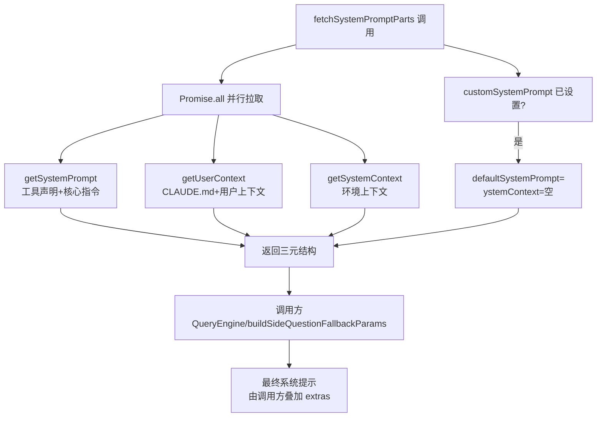
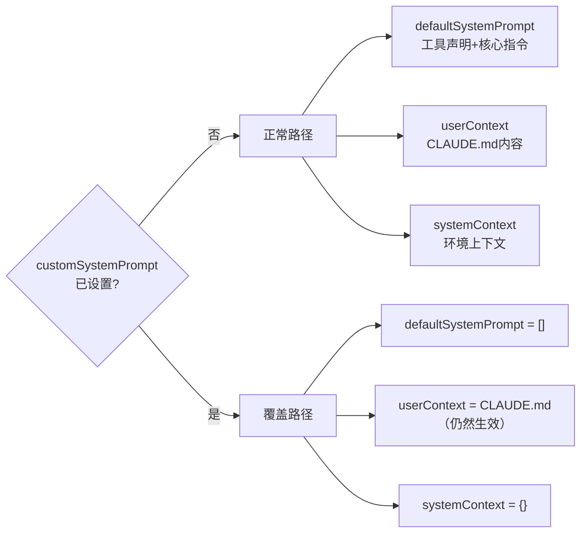
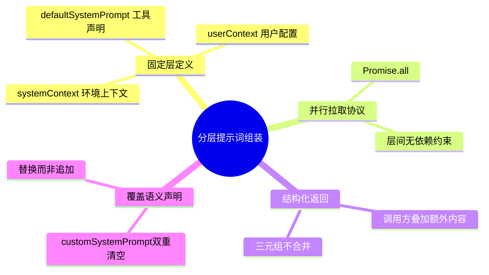
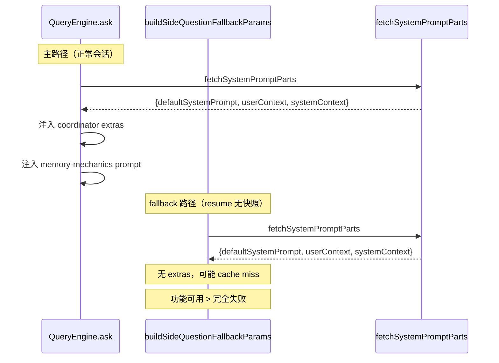
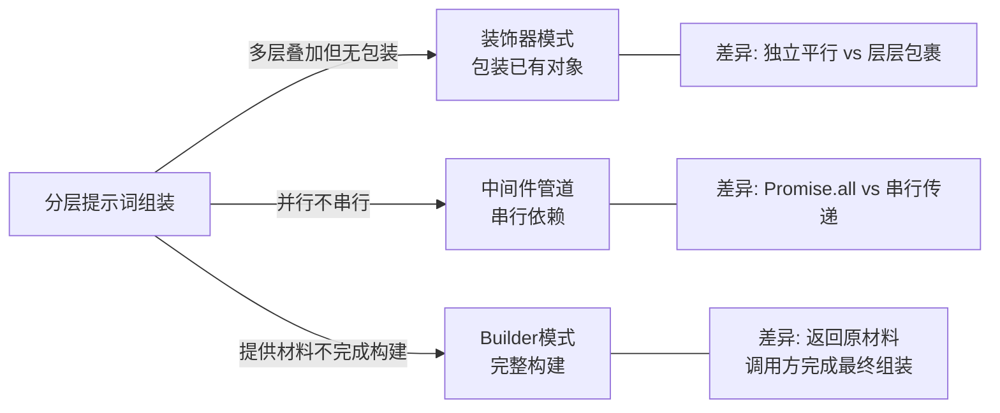

# 第15章：提示词装配——fetchSystemPromptParts() 的分层组装

> "系统提示不是一段文字，而是一次并行拉取、按层组合的结构化装配。"

每次向 Claude API 发请求前，系统提示要从工具声明、CLAUDE.md 配置、环境上下文三处拉取——串行拉取会累加延迟，直接拼接则顺序变了行为就变了，出错时没有追踪入口。

Claude Code 的解法是**分层提示词组装（Layered System Prompt Assembly）**：三层并行拉取，结构化返回三元组，最终装配延迟到调用方。

读完本章，你能理解为什么分层比拼接更可维护，并能在自己的 Agent 系统中设计可组合的系统提示结构。

---

## 问题：多来源系统提示的两个陷阱

为什么系统提示的组装需要专门设计？

**陷阱一：顺序语义隐性化**。系统提示各部分的顺序不是中立的——靠前的内容在 AI 模型的注意力机制中通常优先级更高。如果工具声明、用户指令、环境上下文直接拼接，新的需求一旦改变顺序，就会无声地改变行为，调试时完全不知道从何入手。

**陷阱二：串行拉取浪费延迟**。系统提示的每一部分可能来自不同来源——工具声明需要遍历工具列表，用户上下文需要读 CLAUDE.md 文件（详见第16章），环境上下文需要查询目录状态。串行拉取意味着总延迟是各部分之和；而这三个来源之间没有依赖关系，可以并行。

`queryContext.ts` 文件的模块注释点明了第三个隐性设计压力——**循环依赖**。注释（`src/utils/queryContext.ts:1-9`）写道：

> "Lives in its own file because it imports from context.ts and constants/prompts.ts, which are high in the dependency graph. Putting these imports in systemPrompt.ts or sideQuestion.ts (both reachable from commands.ts) would create cycles."
>
> （翻译：独立成文件是因为它从 context.ts 和 constants/prompts.ts 导入——这两个文件在依赖图中层级很高。如果把这些导入放在 systemPrompt.ts 或 sideQuestion.ts 中（两者都可从 commands.ts 到达），就会产生循环依赖。只有入口层文件才从这里导入——QueryEngine.ts 和 cli/print.ts。）

**三个压力，一个解法**：将系统提示组装逻辑独立到 `queryContext.ts`，设计三层固定结构，并行拉取，返回结构化结果。

**图 15-1：系统提示的三层来源与组装流程**



**图 15-1：三层并行组装。** 注意 customSystemPrompt 分支的双重清空——自定义提示不是追加，而是完全替换默认提示和系统上下文。

**最终组装次序**：`fetchSystemPromptParts` 返回原材料三元组后，调用方（`query.ts`）按固定次序完成装配：

| 次序 | 内容来源 | 对应字段 | 注入路径 |
|------|---------|---------|----------|
| 第 1 层 | 工具声明 + 核心指令 | `defaultSystemPrompt` | → API `system` 参数（`asSystemPrompt`）|
| 第 2 层 | 环境上下文（目录/git 状态）| `systemContext` | → 追加到 `system` 末尾（`appendSystemContext`，`src/utils/api.ts:437`）|
| 消息层 | CLAUDE.md / 用户配置 | `userContext` | → 前置为 `<system-reminder>` 消息（`prependUserContext`，`src/utils/api.ts:449`）|

⚠️ **关键细节**：`userContext`（CLAUDE.md 内容）**不在 API system 参数中**，而是以 `<system-reminder>` 前置消息的形式注入对话历史。这也揭示了为什么 customSystemPrompt 会清空 `systemContext`（同在 system 参数中，覆盖后追加无意义）而保留 `userContext`（不同路径，独立生效）。

**源码参考：** `src/query.ts:450`（`fullSystemPrompt = asSystemPrompt(appendSystemContext(systemPrompt, systemContext))`）、`src/query.ts:660`（`prependUserContext(messagesForQuery, userContext)`）

---

## 源码实例 1：fetchSystemPromptParts 的并行策略与覆盖语义

我们来看核心函数的完整设计。这个函数只有 30 行，但每一行都有明确的工程含义。

**返回类型契约**

函数签名首先定义了返回结构（`src/utils/queryContext.ts:57-59`）：

```typescript
// src/utils/queryContext.ts:56
}): Promise<{
  defaultSystemPrompt: string[]
  userContext: { [k: string]: string }
  systemContext: { [k: string]: string }
}>
```

**源码参考：** `src/utils/queryContext.ts:56-60`

三个字段的类型不同：`defaultSystemPrompt` 是字符串数组（多段提示词），`userContext` 和 `systemContext` 是字典（键值对上下文）。**这个类型差异不是偶然——它反映了三层内容的本质不同**：默认提示是有序的文本段落，上下文是无序的键值信息。调用方可以根据类型决定如何处理每一层，而不是把所有内容混在一个字符串里。

**并行拉取的实现**

```typescript
// src/utils/queryContext.ts:61
const [defaultSystemPrompt, userContext, systemContext] = await Promise.all([
  customSystemPrompt !== undefined
    ? Promise.resolve([])
    : getSystemPrompt(tools, mainLoopModel, additionalWorkingDirectories, mcpClients),
  getUserContext(),
  customSystemPrompt !== undefined ? Promise.resolve({}) : getSystemContext(),
])
return { defaultSystemPrompt, userContext, systemContext }
```

**源码参考：** `src/utils/queryContext.ts:61-73`

`Promise.all` 同时启动三个异步任务：`getSystemPrompt`（工具声明+核心指令，需要遍历所有工具）、`getUserContext`（CLAUDE.md 文件读取）、`getSystemContext`（目录状态查询）。三者之间没有数据依赖，完全可以并行——`Promise.all` 让总延迟从"三者之和"降为"三者中最慢的一个"。

**覆盖语义的双重清空**

注意 `customSystemPrompt` 的处理方式——它出现了**两次**：
1. 第一处（line 62-63）：`customSystemPrompt !== undefined ? Promise.resolve([]) : getSystemPrompt(...)`——自定义提示存在时，`defaultSystemPrompt` 返回空数组
2. 第二处（line 71）：`customSystemPrompt !== undefined ? Promise.resolve({}) : getSystemContext()`——自定义提示存在时，`systemContext` 也返回空字典

函数 JSDoc 注释解释了这个设计（`src/utils/queryContext.ts:34-37`）：

> "When customSystemPrompt is set, the default getSystemPrompt build and getSystemContext are skipped — the custom prompt replaces the default entirely, and systemContext would be appended to a default that isn't being used."
>
> （翻译：当 customSystemPrompt 设置时，默认 getSystemPrompt 构建和 getSystemContext 都被跳过——自定义提示完整替换默认提示，而 systemContext 会附加到一个未被使用的默认提示上，因此也跳过。）

**这是"替换"而非"追加"的覆盖语义**——用户提供自定义提示时，整套默认体系清空，只保留 `userContext`（CLAUDE.md 文件的内容仍然生效）。为什么 `userContext` 不清空？因为它代表用户在项目中放置的配置（CLAUDE.md），这是用户的声明，即使提供了自定义系统提示也应该生效。

**图 15-2：customSystemPrompt 的双重清空逻辑**



**图 15-2：customSystemPrompt 的双重清空。** 用户上下文（CLAUDE.md）是唯一在覆盖模式下仍然生效的层——体现了对用户配置声明的尊重。

---

## 源码实例 2：buildSideQuestionFallbackParams（会话恢复时的镜像路径）

第二个实例展示了同一个模式在不同场景下的变体应用——会话恢复时没有完整快照，系统必须重建提示词前缀。

`buildSideQuestionFallbackParams`（`src/utils/queryContext.ts:88`）是 SDK `side_question` 处理器在会话恢复时使用的 fallback 路径。其 JSDoc 注释写道：

> "Used by the SDK side_question handler (print.ts) on resume before a turn completes — there's no stopHooks snapshot yet. Mirrors the system prompt assembly in QueryEngine.ts:ask() so the rebuilt prefix matches what the main loop will send, preserving the cache hit in the common case."
>
> （翻译：由 SDK side_question 处理器（print.ts）在恢复时使用——此时还没有 stopHooks 快照。镜像 QueryEngine.ts:ask() 中的系统提示组装，使重建的前缀与主循环发送的内容匹配，在常见情况下保留缓存命中。）

**源码参考：** `src/utils/queryContext.ts:76-86`

核心在于它直接复用了 `fetchSystemPromptParts`：

```typescript
// src/utils/queryContext.ts:116
const { defaultSystemPrompt, userContext, systemContext } =
  await fetchSystemPromptParts({
    tools,
    mainLoopModel,
    additionalWorkingDirectories: Array.from(
      appState.toolPermissionContext.additionalWorkingDirectories.keys(),
    ),
    mcpClients,
    customSystemPrompt,
  })
```

**源码参考：** `src/utils/queryContext.ts:116-125`

`buildSideQuestionFallbackParams` 不是重新实现提示词组装，而是**调用** `fetchSystemPromptParts` 获得三层结构，再在此基础上完成完整的 `CacheSafeParams` 构建（附加 `systemPrompt` 合并、消息上下文过滤等）。

这个设计有一个明确的权衡取舍，注释坦诚地说明了：

> "May still miss the cache if the main loop applies extras this path doesn't know about (coordinator mode, memory-mechanics prompt). That's acceptable — the alternative is returning null and failing the side question entirely."
>
> （翻译：如果主循环应用了这条路径不知道的 extras（协调员模式、记忆机制 prompt），仍可能错过缓存命中。这是可以接受的——替代方案是返回 null，让侧面问题完全失败。）

**这是对"可接受的不完美"的刻意选择**：`buildSideQuestionFallbackParams` 可能无法完全匹配主循环的提示词（因此可能 cache miss），但这比"完全失败"好。**宁可多一次 API 调用，不能因为没有快照就让功能崩溃**——这是恢复场景设计的基本原则。

---

## 模式剖析：分层提示词组装

现在我们可以提炼这个模式的骨架。

**分层提示词组装（Layered System Prompt Assembly）**的核心是把"系统提示的来源"与"系统提示的组合方式"解耦：

**1. 固定的层定义**：三层（defaultSystemPrompt/userContext/systemContext）有明确的语义边界——它们不是任意的代码组织方式，而是按"内容类型"和"更新频率"划分的。工具声明（高频变化）、用户配置（中频）、环境上下文（低频），各自独立，各自可缓存。

**2. 并行拉取协议**：`Promise.all` 不只是性能优化——它是一个约束：**要求三层之间无依赖关系**。如果未来某一层需要依赖另一层的结果，这个约束会让开发者意识到需要重新考虑层次划分。

**3. 结构化返回而非合并返回**：函数返回三元结构而非合并后的字符串。这让调用方（QueryEngine、buildSideQuestionFallbackParams，详见第8章）可以在此基础上注入额外内容，而不需要解析一个已经合并的字符串。**"组装不到最后一步"是可组合系统设计的通则**。

**4. 覆盖语义的显式声明**：`customSystemPrompt` 的双重清空是语义契约，不是实现细节——它清楚地声明了"自定义 = 替换，不是追加"。调用方不需要猜测行为，JSDoc 已经说明。

**图 15-3：分层提示词组装的四个组成要素**



**图 15-3：模式的四个组成要素。** 每个要素解决一个特定问题：层定义解决顺序语义，并行拉取解决延迟，结构化返回解决可组合性，覆盖语义解决优先级冲突。

---

## 适用范围

| 场景 | 适用性 | 理由 | 替代方案 |
|------|--------|------|---------|
| 系统提示来自多个独立来源 | ✓ | 分层允许各来源独立获取和缓存 | 单体拼接函数（维护困难）|
| 各来源有不同的更新频率/缓存需求 | ✓ | Promise.all 允许各层独立失效 | 全局重新获取（粒度过粗）|
| 需要"用户覆盖"语义 | ✓ | 显式的 customSystemPrompt 双重清空契约 | 追加模式（优先级不可控）|
| 调用方需要在基础上注入额外内容 | ✓ | 结构化返回，不提前合并 | 合并后返回字符串（丢失层信息）|
| 系统提示是静态固定的 | ✗ | 分层增加复杂度，无收益 | 直接传字符串常量 |
| 各层之间存在依赖（A 层需要 B 层结果）| ✗ | 打破 Promise.all 并行约束，需要重新划层 | 串行获取 + 显式依赖声明 |

---

## 权衡与局限

为什么这个设计不是没有代价的？

**并行拉取的隐性假设**：`Promise.all` 并行意味着所有失败是独立失败——一层失败不影响其他层的完成。但 `Promise.all` 的语义是"任一 reject 则整体 reject"，如果 `getSystemPrompt`（工具声明构建）失败，用户上下文也不会被返回，即使它已经成功获取。对于容错要求高的场景，可能需要 `Promise.allSettled` 替代。

**customSystemPrompt 的覆盖盲区**：当 `customSystemPrompt` 存在时，`systemContext` 被清空（`Promise.resolve({})`），但 `userContext`（CLAUDE.md）仍然生效。注释说明了理由——用户配置应该始终生效——但这意味着自定义系统提示的用户实际上无法完全控制系统提示的所有部分，CLAUDE.md 的内容仍会被注入（推断：通过 `userContext` 字段在调用方层面合并）。

**镜像路径的不完整性**：`buildSideQuestionFallbackParams` 刻意接受可能的 cache miss，因为它无法复现主循环中的所有 extras（coordinator mode、memory-mechanics prompt 等）。JSDoc 注释明确说这是"可接受"的，但这意味着会话恢复时有额外的 API 调用成本——在高频 resume 场景下，这个成本会累积。

**图 15-5：主路径与 fallback 路径对比**



**图 15-5：两条路径的差异。** 主路径额外注入 coordinator 和记忆模式 prompt；fallback 路径接受可能的 cache miss，但保证功能可用。

**返回结构固化的风险**：三元结构（`defaultSystemPrompt/userContext/systemContext`）是调用方和被调用方之间的隐性契约。如果未来需要增加第四层，所有调用方都需要更新——目前只有两个调用方（`QueryEngine` 和 `buildSideQuestionFallbackParams`），可以接受；但如果调用方增多，更改成本会变高。

---

## 与已知模式的对话

**与 GoF 装饰器模式（Decorator Pattern）的关系**：装饰器模式通过逐层包装对象来添加功能，结果是一个包含所有层的组合对象。分层提示词组装有相似的"多层叠加"结构，但**装饰器是动态包装已有对象，这里是静态并行获取多个独立来源然后合并**——没有包装关系，各层平等独立。

**与 HTTP 请求管道（Express/Koa 中间件）的关系**：中间件管道把请求依次传过多个处理器，每层可以修改上下文。分层提示词组装的调用方叠加 extras（extras 是在 `fetchSystemPromptParts` 返回后由 QueryEngine 注入的）与中间件管道在结构上相似。**核心区别：中间件是串行处理，各层可以依赖前层结果；分层提示词组装的"拉取"阶段是并行的，各层独立**。

**与 Builder 模式的关系**：Builder 模式把复杂对象的构建过程分步封装。`fetchSystemPromptParts` 只负责获取原材料（三层基础），真正的"构建"（合并 extras、附加 appendSystemPrompt）由调用方完成。**这是 Builder 模式的"材料供应"阶段，而非完整 Builder**——刻意保持输出的结构化，让调用方做最后组装，提高了可组合性。

**图 15-4：与业界模式的对比定位**



**图 15-4：三种模式的对比。** 每种模式都解释了设计的某个维度，但都不能完整描述——分层提示词组装是三种思想的交汇点，而非任何一种的直接实例。

---

## 模式提炼

---

**分层提示词组装（Layered System Prompt Assembly）**

**解决的问题**：系统提示来自多个独立来源（工具声明、用户配置、环境上下文），各来源有不同的更新频率和注入路径，如何高效获取并支持调用方叠加额外内容？

**核心做法**：定义固定的三层结构（defaultSystemPrompt/userContext/systemContext），用 `Promise.all` 并行拉取，返回结构化三元组而非合并字符串，由调用方按语义路径（systemContext 追加进 API system、userContext 前置为消息）完成最终装配。

**源码证据**：`src/utils/queryContext.ts:44`（函数定义）、`:61`（Promise.all）、`:62-63`（覆盖清空 defaultSystemPrompt）、`:71`（覆盖清空 systemContext）、`:73`（三元结构返回）

---

**可接受的不完整恢复（Acceptable Incomplete Resume）**

**解决的问题**：会话恢复时没有完整的系统提示快照，重建路径可能无法完全匹配主路径（导致 cache miss），但返回 null 会让功能完全失败。

**核心做法**：实现 fallback 重建路径，复用核心组装函数，在 JSDoc 中明确声明"可能 cache miss 但功能可用"的权衡取舍——宁可多一次 API 调用，不能让用户操作失败。

**源码证据**：`src/utils/queryContext.ts:88`（函数定义）、`:84-86`（JSDoc"可接受"声明）、`:116-117`（复用 `fetchSystemPromptParts`）

---


## 你能做什么

- **将 AI Agent 的系统提示按"更新频率"分层**：核心指令（低频）、工具声明（中频，工具集变化时更新）、用户配置（按项目，读文件）、环境上下文（高频，每次请求重建）。不同频率意味着不同的缓存策略。

- **用 `Promise.all` 并行获取系统提示各层**：只要各层之间没有依赖，并行拉取可以把等待时间从"各层之和"降为"最慢的一层"。并行约束同时迫使你检查层间是否真的独立。

- **返回三元结构而非合并字符串**：让系统提示组装"不到最后一步不合并"，调用方保留叠加额外内容的能力（如 QueryEngine 注入的 coordinator 指令）。这是"可组合"设计的基础原则。

- **为 `customSystemPrompt` 实现明确的覆盖语义**：用户自定义提示时，清空所有默认提示（而非追加）；用户配置（CLAUDE.md 等）作为例外保留生效。在 JSDoc 中明确说明覆盖范围，避免调用方猜测。

- **在 resume/fallback 路径中复用主路径的组装函数**：`buildSideQuestionFallbackParams` 直接调用 `fetchSystemPromptParts`，而非重新实现。fallback 路径接受"可能的 cache miss"，但保证功能可用，而非完全失败。

---

系统提示的各层具体内容——特别是 CLAUDE.md 如何按目录层级扫描和合并——将在第16章详细展开。本章聚焦的是组装机制本身：三层是如何并行获取的，覆盖语义是如何实现的，以及 fallback 路径是如何刻意接受不完整性的。
