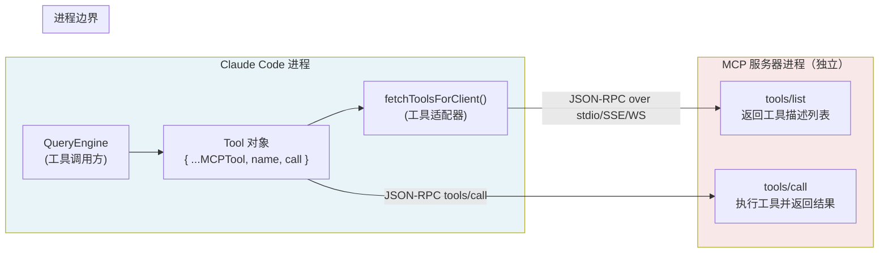
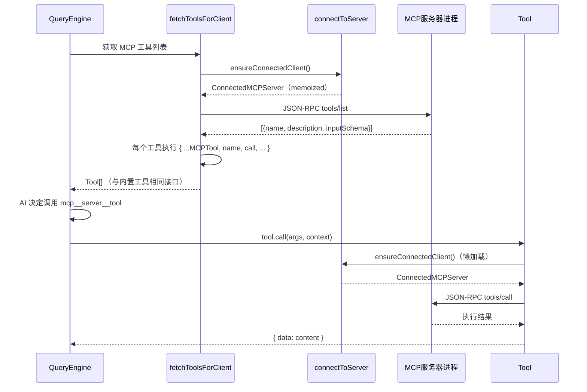

# 第 17 章：MCP 工具协议——把第三方工具变成一等公民

> "最好的 API 是让调用方感觉不到它存在的 API。"
> （原文："The best API is the one that the caller cannot tell is there."）

在 Claude Code 中，一个外部 Python 进程可以注册任意数量的工具，AI 调用它们与调用内置 `BashTool`、`FileReadTool` 的方式完全相同——相同的权限检查、相同的进度上报、相同的结果格式。这个"第三方工具一等公民化"不是偶然的——它来自一个精心设计的**协议化工具扩展（Protocol-based Tool Extension）**模式。

核心机制是：外部服务用标准的 JSON-RPC 描述自己的工具能力，Claude Code 在运行时把每个工具描述展开成一个本地 `Tool` 对象，与内置工具共享同一套调用框架。这个模式让工具库的边界从"代码库的边界"扩展到了"任何实现了 MCP 协议的进程的边界"。

识别这个模式，你就能在自己的 Agent 系统中设计一套不需要重启主进程、不需要代码注入的工具扩展机制——这是 AI 工具生态的基础设施层。

---

## 问题：扩展工具库的两种选择

当一个 Agent 系统需要接入第三方工具（数据库查询、API 调用、外部脚本），工程师面对两个根本不同的选择。

**第一种：代码注入（Plugin）**——第三方工具以某种形式的代码加载到主进程，共享内存、直接调用内部 API。好处是延迟低、数据传递无需序列化；代价是安全边界消失，一个有 bug 的插件可以崩溃整个主进程，也可以读取主进程的任意内存（包括 API 密钥）。

**第二种：协议通信（MCP）**——第三方工具运行在独立进程中，通过标准协议（在 MCP 中是 JSON-RPC over stdio/SSE/WebSocket）与主进程通信。进程崩溃不影响主进程；双方只共享协议约定的数据格式，不共享内存。代价是每次调用有序列化开销，且无法访问主进程的内部状态。

Claude Code 选择了第二种方式，实现了 Model Context Protocol（MCP，模型上下文协议）。MCP 是一个开放协议规范，定义了工具能力描述（`tools/list` 请求）和工具调用（`tools/call` 请求）的标准消息格式。

**图 17-1：MCP 工具扩展的进程架构**



图 17-1 展示了最关键的设计决策：两个进程之间只有一条 JSON-RPC 通道。Claude Code 进程内的 `Tool` 对象是一个"幻影工具"——它的 `call()` 方法实际上向 MCP 服务器发送 JSON-RPC 请求，等待结果后包装成标准格式返回。这个幻影设计让调用方（QueryEngine）感觉不到进程边界的存在。

---

## 源码实例 1：工具注册链路——`fetchToolsForClient`

MCP 工具的"一等公民化"发生在 `fetchToolsForClient` 函数中（`src/services/mcp/client.ts:1743`）。这个函数的职责是：连接 MCP 服务器 → 获取工具列表 → 把每个工具包装成本地 `Tool` 对象。

我们先来看最关键的包装步骤。`MCPTool.ts:27` 定义了一个名为 `MCPTool` 的"模板对象"：

```typescript
// src/tools/MCPTool/MCPTool.ts:27
export const MCPTool = buildTool({
  isMcp: true,
  // 在 mcpClient.ts 中覆盖为真实工具名 + 参数（Overridden in mcpClient.ts with the real MCP tool name + args）
  name: 'mcp',
  // 在 mcpClient.ts 中覆盖（Overridden in mcpClient.ts）
  async description() { return DESCRIPTION },
  // 在 mcpClient.ts 中覆盖（Overridden in mcpClient.ts）
  async call() { return { data: '' } },
  async checkPermissions() {
    return { behavior: 'passthrough', message: 'MCPTool requires permission.' }
  },
  renderToolUseMessage,
  renderToolUseProgressMessage,
  renderToolResultMessage,
  // ...
})
```

**源码参考：** `src/tools/MCPTool/MCPTool.ts:27-75`

`MCPTool` 是一个占位符——`name` 是 `'mcp'`，`call()` 返回空字符串，`description()` 返回通用描述。注释三次出现 "Overridden in mcpClient.ts"，明确告知读者：**这个对象只提供基础设施（UI 渲染、权限接口），具体的工具身份由 `client.ts` 在运行时覆盖**。

`renderToolUseMessage`、`renderToolUseProgressMessage`、`renderToolResultMessage` 是 UI 渲染方法，这是 MCP 工具唯一不需要覆盖的部分——所有 MCP 工具共享同一套渲染逻辑，只有内容（`name`、`call` 的结果）不同。

现在来看覆盖发生的地方，`fetchToolsForClient` 中的工具转换代码：

```typescript
// src/services/mcp/client.ts:1770
return toolsToProcess.map((tool): Tool => {
  const fullyQualifiedName = buildMcpToolName(client.name, tool.name)
  return {
    ...MCPTool,                                          // 继承所有基础设施方法
    name: skipPrefix ? tool.name : fullyQualifiedName,  // 覆盖工具名（如 mcp__my-server__query）
    mcpInfo: { serverName: client.name, toolName: tool.name }, // 溯源信息
    isMcp: true,
    searchHint: tool._meta?.['anthropic/searchHint'] ?? undefined,
    async description() { return tool.description ?? '' },  // 覆盖描述
    inputJSONSchema: tool.inputSchema as Tool['inputJSONSchema'], // 覆盖输入schema
    async checkPermissions() {
      return { behavior: 'passthrough', message: 'MCPTool requires permission.' }
    },
    // ... call() 方法的覆盖在后续几行，包含完整的调用逻辑
  }
})
```

**源码参考：** `src/services/mcp/client.ts:1770-1825`

`{ ...MCPTool, ...覆盖字段 }` 这个展开操作是整个适配机制的核心。它的含义是：**从 `MCPTool` 模板借用所有基础设施方法，用 MCP 服务器提供的元数据覆盖身份字段（name、description、inputJSONSchema）和执行方法（call）**。

值得单独说明的是 `inputJSONSchema`：内置工具（如 `BashTool`）使用 Zod Schema 做输入验证（详见第 14 章），而 MCP 工具使用 `inputJSONSchema`（标准 JSON Schema）。原因很直接——MCP 服务器由外部开发者实现，它们无法使用 Zod，它们按 JSON Schema 标准描述工具的参数格式。适配器直接将 MCP 服务器的 `tool.inputSchema` 转型为 `Tool['inputJSONSchema']`，不做 Zod 转换。

`mcpInfo: { serverName, toolName }` 是一个溯源字段——权限系统通过它知道这个工具来自哪个 MCP 服务器，可以按服务器名称设置权限规则（如"允许 my-server 下的所有工具访问文件系统"）。

`fetchToolsForClient` 使用 `memoizeWithLRU` 缓存工具列表（`client.ts:1743`），避免对同一连接重复执行 `tools/list` 请求。与之配合的是 `connectToServer`（`client.ts:595`），同样使用 `memoize`——相同的服务器名 + 配置，整个进程生命周期内只建立一次连接。

**图 17-2：工具注册与调用的完整序列**



图 17-2 展示了 MCP 工具从注册到调用的完整路径。`connectToServer` 的 memoize 保证了两个时间点（注册时、调用时）使用的是同一个 `ConnectedMCPServer` 对象，不会重复建立 TCP/stdio 连接。

---

## 源码实例 2：工具调用链路——容错重试机制

注册链路展示了"如何让 MCP 工具看起来像本地工具"，调用链路则展示了"如何让 MCP 工具的调用和本地工具一样可靠"。

MCP 工具的 `call()` 实现中有一个不显眼但重要的设计：

```typescript
// src/services/mcp/client.ts:1859
const MAX_SESSION_RETRIES = 1
for (let attempt = 0; ; attempt++) {
  try {
    const connectedClient = await ensureConnectedClient(client)
    const mcpResult = await callMCPToolWithUrlElicitationRetry({
      client: connectedClient,
      tool: tool.name,
      args,
      // ...
    })
    // 成功时记录进度并返回
    return { data: mcpResult.content, ... }
  } catch (error) {
    // 会话过期 — 连接缓存已被清除，用新客户端重试
    // (Session expired — the connection cache has been cleared, so retry with a fresh client.)
    if (error instanceof McpSessionExpiredError && attempt < MAX_SESSION_RETRIES) {
      logMCPDebug(client.name, `Retrying tool '${tool.name}' after session recovery`)
      continue
    }
    // 其他错误：记录进度失败，包装并抛出
    // ...
    throw error
  }
}
```

**源码参考：** `src/services/mcp/client.ts:1859-1920`

`MAX_SESSION_RETRIES = 1`——重试次数被硬编码为 1 次，而非可配置的多次。为什么是 1 而不是 3？注释揭示了原因：会话过期（`McpSessionExpiredError`）是一个特殊的可恢复错误——MCP SDK 在捕获到这个错误后会自动清除连接缓存，下一次 `ensureConnectedClient()` 调用会建立全新的连接。**一次重试的语义是"用全新连接重试一次"，而不是"一直重试直到成功"**。如果第二次尝试仍然失败，说明服务器本身有问题，继续重试只会增加延迟。这是"快速失败"原则的具体体现。

`ensureConnectedClient`（`client.ts:1688`）在这里扮演懒加载角色：

```typescript
// src/services/mcp/client.ts:1688
export async function ensureConnectedClient(
  client: ConnectedMCPServer,
): Promise<ConnectedMCPServer> {
  // SDK MCP 服务器在进程内运行，通过 setupSdkMcpClients 单独处理
  // (SDK MCP servers run in-process and are handled separately via setupSdkMcpClients)
  if (client.config.type === 'sdk') {
    return client
  }
  const connectedClient = await connectToServer(client.name, client.config)
  if (connectedClient.type !== 'connected') {
    throw new TelemetrySafeError_I_VERIFIED_THIS_IS_NOT_CODE_OR_FILEPATHS(...)
  }
  return connectedClient
}
```

**源码参考：** `src/services/mcp/client.ts:1688-1705`

`ensureConnectedClient` 的名字很精确——它"确保连接存在"，而不是"创建连接"。由于 `connectToServer` 是 memoized 的（`client.ts:595`），重复调用 `ensureConnectedClient` 不会重复建立 TCP 连接，只是验证已有连接是否仍然有效。这是懒加载连接的标准模式：工具对象在注册时持有的是"连接引用"而不是"连接本身"，连接在首次调用时才真正建立并缓存。

`isMcpSessionExpiredError`（`client.ts:193`）的实现展示了一个细节：

```typescript
// src/services/mcp/client.ts:193
export function isMcpSessionExpiredError(error: Error): boolean {
  const httpStatus = 'code' in error ? (error as Error & { code?: number }).code : undefined
  if (httpStatus !== 404) { return false }
  // MCP SDK 把响应体嵌入错误消息
  // MCP 服务器返回: {"error":{"code":-32001,"message":"Session not found"},...}
  // 用 JSON-RPC 错误码区分真正的 MCP 会话超时和普通 404
  return (
    error.message.includes('"code":-32001') ||
    error.message.includes('"code": -32001')
  )
}
```

**源码参考：** `src/services/mcp/client.ts:193-206`

HTTP 404 本身不足以判断会话是否过期（普通的"工具不存在"错误也是 404）。这里额外检查 JSON-RPC 错误码 `-32001`——这是 MCP 协议规范中定义的"Session not found"错误码。**协议化扩展的错误分类比代码注入更精确**：MCP 的错误有标准的结构，可以按错误码区分处理，而代码插件的错误只是普通的 JavaScript 异常，需要基于 `instanceof` 或消息字符串做不稳定的分类。

`getMcpServerConnectionBatchSize()`（`client.ts:552`）控制启动时并发连接的 MCP 服务器数量：

```typescript
// src/services/mcp/client.ts:552
export function getMcpServerConnectionBatchSize(): number {
  return parseInt(process.env.MCP_SERVER_CONNECTION_BATCH_SIZE || '', 10) || 3
}
```

**源码参考：** `src/services/mcp/client.ts:552-554`

默认值 3 表示启动时最多并发连接 3 个 MCP 服务器，其余排队等待。这是一个保护主进程的流量控制——如果用户配置了 20 个 MCP 服务器，同时建立 20 个连接可能超过文件描述符限制或造成端口竞争（推断）。环境变量 `MCP_SERVER_CONNECTION_BATCH_SIZE` 允许用户调整这个默认值。

---

## 模式剖析：协议化工具扩展的三个关键组成

两处源码实例让我们看清了这个模式的骨架。**协议化工具扩展（Protocol-based Tool Extension）**由三个关键组成部分构成，缺一不可：

**一、能力描述协议（Capability Description Protocol）**——外部服务通过标准请求（`tools/list`）描述自己提供哪些工具、每个工具的参数格式是什么。这是"自我声明"步骤，让主进程无需提前知道外部服务的存在。MCP 使用 JSON Schema 格式的 `inputSchema` 描述参数，与语言无关，Python/Go/Node.js 的 MCP 服务器都能描述相同的工具。

**二、运行时适配器（Runtime Adapter）**——主进程在收到工具描述后，立即将其适配为本地工具对象格式（`{ ...MCPTool, name, call, inputJSONSchema, ... }`）。适配器不改变工具的功能语义，只是把外部协议格式转换为内部接口格式。适配后，QueryEngine 调用 MCP 工具的代码路径与调用内置工具完全相同。

**三、透明代理调用（Transparent Proxy Call）**——当 AI 决定调用某个 MCP 工具时，`tool.call()` 向 MCP 服务器发送 JSON-RPC 请求，等待响应，将响应包装为标准 `ToolResult` 格式。整个过程对 QueryEngine 透明——它看到的只是一个 `Tool` 对象和 `{ data: string }` 的返回值。进程边界、序列化/反序列化、重试逻辑都封装在适配器内部。

这三个组成部分的关系体现了"关注点分离（Separation of Concerns）"：外部服务只需关心自己的功能实现，不需要了解 Claude Code 的内部架构；Claude Code 只需了解 MCP 协议，不需要了解每个外部服务的实现语言和部署方式；两者通过协议解耦，可以独立演化。

**模式提炼：协议化工具扩展（Protocol-based Tool Extension）**

**协议化工具扩展（Protocol-based Tool Extension）

**解决的问题**：Agent 需要调用第三方工具的能力，但代码注入会消除安全边界、引入进程间耦合。

**核心做法**：外部服务通过标准协议（JSON-RPC `tools/list`）自我描述工具能力，运行时适配器将描述展开为本地工具对象（`{ ...MCPTool, ...overrides }`），调用时透明地将请求转发给外部进程。

**前置条件**：有标准的工具能力描述协议；主进程有统一的工具接口（Tool 对象）；工具调用可以接受进程间通信的延迟。

**源码证据**：`src/services/mcp/client.ts:1770`（展开适配）、`src/tools/MCPTool/MCPTool.ts:27`（模板对象）

---

## 模式提炼：懒加载容错连接（Lazy Fault-Tolerant Connection）**

**懒加载容错连接（Lazy Fault-Tolerant Connection）**

**解决的问题**：外部进程（MCP 服务器）的可用性不能在主进程启动时保证，早期连接失败会阻塞主进程初始化。

**核心做法**：`ensureConnectedClient` 在每次工具调用时懒加载连接（`memoize` 保证同一服务器只建立一次）；会话过期时执行 1 次重试（`MAX_SESSION_RETRIES = 1`，快速失败原则）。

**前置条件**：调用方可以接受首次调用的连接建立延迟；连接本身是幂等的（重建连接后功能不变）。

**源码证据**：`src/services/mcp/client.ts:1688`（ensureConnectedClient）、`src/services/mcp/client.ts:1859`（MAX_SESSION_RETRIES = 1）

---

## 适用范围

| 场景 | 适用 | 理由 | 替代方案 |
|------|------|------|---------|
| 第三方工具需要进程隔离 | ✓ | MCP 服务器崩溃不影响主进程，进程边界是天然的安全屏障 | 代码插件（共享进程，但无隔离）|
| 工具用 Python/Go 等非 JS 语言实现 | ✓ | JSON-RPC 与语言无关，任何语言都能实现 MCP 服务器 | N/A（代码插件要求相同语言）|
| 需要热更新工具（不重启主进程）| ✓ | 重启 MCP 服务器进程 + 断开重连即可刷新工具列表，主进程无感知 | 热重载插件（复杂度更高）|
| 工具需要访问主进程内存状态 | ✗ | MCP 进程隔离意味着无法直接访问主进程的 AppState、文件缓存等 | 内置工具（buildTool，详见第 14 章）|
| 极低延迟要求（<5ms 的工具调用）| ✗（谨慎）| 进程间 JSON-RPC 通信至少有 1-5ms 序列化+传输开销（推断）| 内置工具或 SDK MCP（进程内，无网络开销）|
| 工具需要保密（不能暴露工具逻辑）| ✓ | 外部服务器可以在自己的进程中保护实现细节，主进程只看到 JSON Schema 描述 | N/A |

---

## 权衡与局限

**协议化扩展的核心代价是"协议开销"**。每次 MCP 工具调用都需要：JSON 序列化请求参数 → 进程间传输 → JSON 反序列化 → 执行 → JSON 序列化结果 → 进程间传输 → JSON 反序列化。对于执行时间本身就很短（<10ms）的工具，协议开销可能比执行时间还长（推断）。这是为什么 `getMcpServerConnectionBatchSize()` 默认只有 3（`client.ts:552`）——批量连接控制降低了启动时的并发压力，但也意味着多个 MCP 服务器需要串行等待连接建立。

**工具发现的延迟**是另一个实际问题。`fetchToolsForClient` 在服务器连接建立后才能获取工具列表——如果 MCP 服务器启动慢，Claude Code 的工具列表初始化就会延迟，影响 AI 能看到的工具集合。`memoizeWithLRU` 缓存（`client.ts:1743`）缓解了这个问题（同一连接只查询一次），但无法消除首次查询的延迟。

**会话状态的脆弱性**是长期运行场景的挑战。MCP 使用 HTTP/SSE 连接时，服务器重启或网络中断会导致会话失效（HTTP 404 + JSON-RPC -32001 错误）。`MAX_SESSION_RETRIES = 1` 的设计处理了大多数瞬时故障，但不能处理服务器持续不可用的情况。这是进程隔离的代价——主进程感知不到外部进程的状态变化，需要在调用时才发现故障。

**协议化 vs 插件化的选型矩阵**：

| 维度 | 协议化（MCP）| 插件化（代码注入）|
|------|------------|-----------------|
| 安全边界 | ✅ 进程隔离 | ❌ 共享进程 |
| 调用延迟 | ⚠️ 有序列化开销 | ✅ 函数调用级 |
| 语言支持 | ✅ 任意语言 | ❌ 相同运行时 |
| 状态访问 | ❌ 只能访问协议数据 | ✅ 完全访问主进程状态 |
| 热更新 | ✅ 重启外部进程即可 | ⚠️ 通常需要重启 |
| 故障影响 | ✅ 外部进程崩溃不影响主进程 | ❌ 插件崩溃可能崩溃主进程 |

---

## 与已知模式的对话

MCP 适配器的结构让我们联想到两个经典模式，但它的定位与两者都不完全相同。

**与 GoF 代理模式（Proxy Pattern）**：两者都为远程资源提供本地接口包装。GoF 代理模式通常是透明的——调用方无法区分代理和真实对象，接口完全相同。**MCP 适配器不完全透明**：`isMcp: true` 字段（`client.ts:1773`）、`mcpInfo: { serverName, toolName }` 字段都是"不透明"的标记，让权限系统和调试工具能够识别"这是一个 MCP 工具"。完全透明会降低可调试性——在 Agent 系统中，知道工具来源（哪个 MCP 服务器）对权限管理至关重要。

**与 EIP 服务激活器（Service Activator）**：企业集成模式（Enterprise Integration Patterns）中的服务激活器将消息总线上的消息路由到特定服务方法。MCP 适配器的调用路径更接近这个模式——AI 产生工具调用意图 → 路由到 MCP 适配器 → 适配器将请求发给外部服务 → 收集结果返回。但服务激活器通常是单向的（fire-and-forget），而 MCP `call()` 是请求-响应（request-response）的同步模式，这使得重试和错误处理更直接。

| 模式 | 透明性 | 通信方向 | 错误处理 | 主要关注点 |
|------|--------|---------|---------|----------|
| GoF 代理模式 | 完全透明 | 请求-响应 | 代理决定 | 访问控制、缓存 |
| EIP 服务激活器 | 部分透明 | 单向消息 | 消息重试 | 消息路由、系统解耦 |
| **MCP 协议化适配** | **刻意不透明** | **请求-响应** | **1次重试+快速失败** | **进程隔离+工具一等公民化** |

与两个已知模式不同的是，MCP 适配器的独特贡献是**刻意的不透明性**——`isMcp`、`mcpInfo` 字段的存在不是缺陷，而是有意保留的"元数据层"，让系统的其他部分（权限、调试、可观测性）能够区分本地工具和远程工具。这是在"对调用方透明"和"对运维层不透明"之间做出的刻意取舍。

---

## 模式提炼

**模板对象展开适配（Template Object Spread Adaptation）**

**问题**：需要把外部服务的能力描述适配为本地接口，但 class 继承会产生类型复杂度，且每个工具实例不需要原型链。

**解决方案**：定义一个含所有基础设施方法的"模板对象"（MCPTool），在运行时用外部数据展开覆盖身份字段：`{ ...MCPTool, name, description, call, inputJSONSchema }`。

**前置条件**：语言支持对象展开（`...spread`）；基础设施方法（UI 渲染）与身份字段（name、call）可以清晰分离。

**源码锚点**：`src/tools/MCPTool/MCPTool.ts:27`（模板定义）、`src/services/mcp/client.ts:1770`（展开覆盖）

---

## 你能做什么

- **用进程隔离（MCP 或任何 JSON-RPC 协议）替代代码注入实现第三方工具扩展**。进程边界是最便宜的安全边界——一个有漏洞的外部工具只能在自己的进程内造成破坏，无法读取主进程的 API 密钥或修改主进程的内存状态。

- **为外部工具调用实现懒加载连接**（`ensureConnectedClient` 风格）：工具对象持有"连接引用"而不是"连接本身"，在首次调用时建立实际连接，用 `memoize` 保证同一目标只连接一次。避免在系统启动时要求所有外部服务可用。

- **用 `{ ...baseTemplate, ...overrides }` 对象展开而非 class 继承适配外部工具**。`MCPTool` 模板对象的设计展示了这种模式的价值：基础设施方法（UI 渲染、日志）只定义一次，在运行时展开覆盖身份字段。避免多级继承链带来的调试困难。

- **为可恢复错误实现 1 次重试，对不可恢复错误立即失败**。区分"会话过期（重建连接后可恢复）"和"工具不存在（不可恢复）"——前者值得重试一次，后者应该立即失败并给出清晰错误信息。`MAX_SESSION_RETRIES = 1` 而不是 3 或 5，是快速失败原则的体现。

- **保留工具来源的溯源字段**（`mcpInfo: { serverName, toolName }`）。当系统中同时存在内置工具和 MCP 工具时，权限系统需要知道"这个工具调用来自哪个外部服务"才能做粒度化授权。完全透明的代理会丢失这个信息。

- **用 JSON Schema 而非内部 Schema 框架（Zod）处理外部服务的输入验证**。`inputJSONSchema` 而非 `inputSchema` 的区分不是代码风格差异，是协议边界的体现——外部服务用你无法控制的格式描述参数，用 JSON Schema 是协议化扩展的天然选择。

- **深入第 37-39 章的插件系统**，对比协议化扩展（MCP）与代码插件的具体实现差异——两种扩展机制在 Claude Code 中并存，了解它们各自的适用边界，才能在自己的系统中做有依据的选型。

---

MCP 协议将工具扩展的边界推到了任意实现了 JSON-RPC 的进程，但工具本身也可以是纯声明性的——下一章（第 18 章）将展示另一种工具扩展机制：只需在目录下放一个 Markdown 文件，Skill 系统就能在运行时把它变成 AI 可调用的能力。
