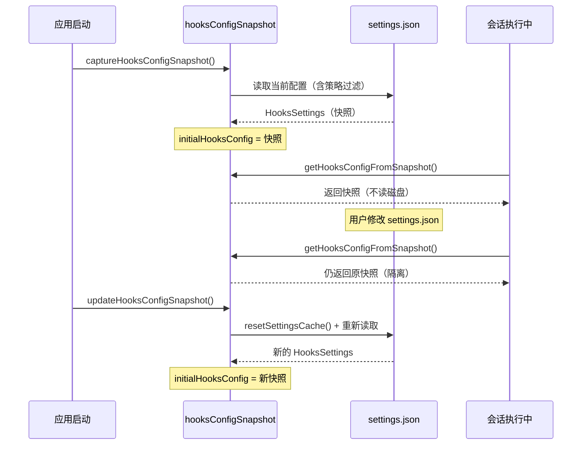

# 第 23 章：配置快照隔离——会话内行为一致性保证

> "配置文件变了，不代表当前的任务需要改变。"

---

如果用户在 Claude Code 会话中途通过 `/hooks` 命令修改了钩子配置文件，当前正在运行的任务会不会立刻"换一套规则"？直觉上你可能希望是的——配置改了就该生效。但在实践中，这会让系统行为变得不可预测：同一次任务的前半段和后半段使用不同的 hook 配置，调试起来极为困难。

Claude Code 的解决方案是在会话启动时"拍一张快照"——把当前的 Hook 配置冻结在一个模块级变量中，整个会话期间只读这个快照。配置文件可以在外部随意修改，但快照不会自动刷新，除非调用方显式请求更新。

这就是**配置快照隔离**（Config Snapshot Isolation）模式：把配置的"读取时机"和"使用时机"解耦——一次读取，整个会话期间稳定复用。读完本章，你将理解这个 133 行模块如何用一个模块级变量、四个函数，实现长运行服务的配置一致性保证，以及为什么在更新快照前必须先重置缓存。

---

## 问题：长运行会话中的配置漂移

想象一个会话正在执行一个多步骤的代码重构任务，中途触发了数十次工具调用。在第 15 次工具调用后，用户在另一个终端修改了 `settings.json`，添加了一条新的 PreToolUse hook。

如果系统每次都实时读取配置文件，第 16 次工具调用就会带着新的 hook——而第 1-15 次用的是旧配置。这个"半路换规则"的场景会导致：审计日志中同一个会话有两种不同的行为记录；任务的重现性被破坏（同样的操作序列，下次从头运行结果可能不同）；调试工具调用失败时，你不知道用的是哪个版本的配置。

**配置一致性**要求：会话内的所有操作使用同一套配置规则，这套规则在会话启动时确定，不随外部变更漂移。

`hooksConfigSnapshot.ts` 用最简洁的方式实现了这个要求——一个模块级变量（`src/utils/hooks/hooksConfigSnapshot.ts:8`）：

```typescript
// src/utils/hooks/hooksConfigSnapshot.ts:8
let initialHooksConfig: HooksSettings | null = null
```

**源码参考：** `src/utils/hooks/hooksConfigSnapshot.ts:8`

这个 `let` 变量（而非 `const`）是关键设计选择：它可以被重新赋值（更新快照），也可以被重置为 `null`（测试清理）。`null` 是"快照尚未创建"的标志，与"快照为空配置"（`{}`）语义不同——前者触发懒加载，后者表示"明确配置了没有任何 hook"。

**图 23-1：快照创建时机与作用范围**



这张图揭示了快照的关键特性：**外部配置文件的修改不会自动传播到快照**。只有两种方式能改变快照：`captureHooksConfigSnapshot`（启动时初始化）和 `updateHooksConfigSnapshot`（显式请求刷新）。

---

## 源码实例 1：captureHooksConfigSnapshot 与 getHooksFromAllowedSources

`captureHooksConfigSnapshot` 是创建快照的入口（`src/utils/hooks/hooksConfigSnapshot.ts:95`），它的实现只有两行：

```typescript
// src/utils/hooks/hooksConfigSnapshot.ts:95-98（含注释）
/**
 * Capture a snapshot of the current hooks configuration
 * This should be called once during application startup
 * Respects the allowManagedHooksOnly setting
 */
export function captureHooksConfigSnapshot(): void {
  initialHooksConfig = getHooksFromAllowedSources()
}
```

**源码参考：** `src/utils/hooks/hooksConfigSnapshot.ts:95`

注释中的 "called once during application startup"（在应用启动时调用一次）是核心语义约束——不是技术上不能多次调用，而是**语义上应该只调用一次**。多次调用会静默覆盖快照，让"快照"的隔离语义失效。注意这里没有任何幂等性保护（如"如果快照已存在则不覆盖"），设计者把"只调用一次"的约束留给了调用方遵守。

真正的复杂性在 `getHooksFromAllowedSources`（第 18 行）——这是快照内容的构建逻辑：

```typescript
// src/utils/hooks/hooksConfigSnapshot.ts:18-58（简化）
function getHooksFromAllowedSources(): HooksSettings {
  const policySettings = settingsModule.getSettingsForSource('policySettings')

  // 策略级别：管理员禁用所有 hooks → 返回空
  if (policySettings?.disableAllHooks === true) {
    return {}
  }

  // 策略级别：仅允许托管 hooks → 只返回管理员配置的 hooks
  if (policySettings?.allowManagedHooksOnly === true) {
    return policySettings.hooks ?? {}
  }

  // 插件专属模式：屏蔽用户/项目/本地的 hooks 配置
  if (isRestrictedToPluginOnly('hooks')) {
    return policySettings?.hooks ?? {}
  }

  const mergedSettings = settingsModule.getSettings_DEPRECATED()

  // 非策略级别的 disableAllHooks：用户配置可以禁用自己的 hooks，
  // 但无法禁用管理员的托管 hooks
  if (mergedSettings.disableAllHooks === true) {
    return policySettings?.hooks ?? {}
  }

  // 默认：返回所有来源的合并 hooks
  return mergedSettings.hooks ?? {}
}
```

**源码参考：** `src/utils/hooks/hooksConfigSnapshot.ts:18`

这段代码体现了一个**分层策略**：配置来源有优先级，策略级别（`policySettings`，通常是企业管理员配置）优先于用户/项目/本地配置。重要的非对称设计在倒数第二个分支：

> "非策略级别的 `disableAllHooks`：用户配置可以禁用自己的 hooks，但无法禁用管理员的托管 hooks"

这意味着用户在自己的 `settings.json` 里写 `"disableAllHooks": true`，只会禁用自己的 hooks，管理员通过 `policySettings` 注入的 hooks 仍然继续运行。**权限边界在快照创建时就被评估和固化**，而不是在每次查询时动态计算——这也是快照隔离的另一个好处：安全策略的评估成本只发生一次。

`getHooksConfigFromSnapshot`（第 119 行）提供了访问快照的统一接口，内置懒加载保护：

```typescript
// src/utils/hooks/hooksConfigSnapshot.ts:119-127
export function getHooksConfigFromSnapshot(): HooksSettings | null {
  if (initialHooksConfig === null) {
    captureHooksConfigSnapshot()  // 懒加载：快照不存在时自动创建
  }
  return initialHooksConfig
}
```

**源码参考：** `src/utils/hooks/hooksConfigSnapshot.ts:119`

懒加载是防御性编程：如果调用方忘记在启动时调用 `captureHooksConfigSnapshot`，第一次 `get` 调用会自动创建快照，系统不会崩溃。但懒加载有一个语义代价：快照创建的时机变成了"第一次访问时"而非"启动时"——如果第一次访问发生在配置变更之后，快照的内容可能不是启动时的状态。正确用法仍然是主动 capture，懒加载只是容错。

---

## 源码实例 2：updateHooksConfigSnapshot——缓存失效的精确时机

`updateHooksConfigSnapshot` 是用户通过 `/hooks` 命令修改配置后刷新快照的入口（`src/utils/hooks/hooksConfigSnapshot.ts:104`）：

```typescript
// src/utils/hooks/hooksConfigSnapshot.ts:104-118（含注释）
/**
 * Update the hooks configuration snapshot
 * This should be called when hooks are modified through the settings
 * Respects the allowManagedHooksOnly setting
 */
export function updateHooksConfigSnapshot(): void {
  // Reset the session cache to ensure we read fresh settings from disk.
  // Without this, the snapshot could use stale cached settings when the user
  // edits settings.json externally and then runs /hooks - the session cache
  // may not have been invalidated yet (e.g., if the file watcher's stability
  // threshold hasn't elapsed).
  resetSettingsCache()
  initialHooksConfig = getHooksFromAllowedSources()
}
```

**源码参考：** `src/utils/hooks/hooksConfigSnapshot.ts:104`

注释中解释了 `resetSettingsCache()` 必须在 `getHooksFromAllowedSources()` 之前调用的原因："文件监听的稳定性阈值可能还没过"——这是一个关于文件监听器工作机制的微妙知识：

文件系统监听器（watcher）通常不会在文件写入的瞬间立刻通知变更，而是等待文件写入趋于稳定（"stability threshold"）才触发通知，防止频繁的写入事件被重复触发。这意味着用户刚保存 `settings.json` 就立刻调用 `/hooks`，文件监听器可能还没来得及通知 settings 缓存失效，`getSettings_DEPRECATED()` 仍然返回旧的缓存值。

`resetSettingsCache()` 是一个**强制缓存失效**的手术刀：不等文件监听器，直接清除缓存，让下一次 `getSettings_DEPRECATED()` 调用去磁盘重新读取。调用顺序是固定的：**先失效缓存，再读配置**——反过来（先读再失效）读到的是过期值，失效了也没用。

`resetHooksConfigSnapshot`（第 130 行）是测试工具函数：

```typescript
// src/utils/hooks/hooksConfigSnapshot.ts:130-133
export function resetHooksConfigSnapshot(): void {
  initialHooksConfig = null
  resetSdkInitState()  // 也重置 SDK 初始化状态，防止测试污染
}
```

**源码参考：** `src/utils/hooks/hooksConfigSnapshot.ts:130`

注释中明确标注了两个 side effect：重置快照（显而易见），以及重置 SDK 初始化状态（不那么显而易见）。为什么 SDK 状态需要随快照一起重置？因为 SDK 初始化时会依赖快照中的配置来做初始化决策，如果快照被清空而 SDK 状态没有重置，下一次初始化会使用"快照为空时的初始化结果"，与"快照有内容时的初始化结果"不一致，导致测试之间互相污染。**这种多 side effect 的 reset 函数，每个 side effect 都值得在注释中说明**。

---

## 模式剖析：配置快照隔离的三个核心约束

**配置快照隔离**模式建立在三个相互支撑的约束上：

**1. 模块级单例快照（Module-Level Singleton Snapshot）**：`initialHooksConfig` 是模块级变量，整个进程只有一份。这让所有调用 `getHooksConfigFromSnapshot()` 的地方自动共享同一个快照——不需要传递配置对象，不需要依赖注入。代价是测试隔离需要显式调用 `resetHooksConfigSnapshot()`，否则一个测试创建的快照会污染下一个测试。

**2. 写入-读取分离（Write-Read Separation）**：快照只有两个写入点（`captureHooksConfigSnapshot` 和 `updateHooksConfigSnapshot`），一个读取点（`getHooksConfigFromSnapshot`）。写入点都是显式调用，没有自动触发（如"配置文件变更时自动刷新快照"的监听器）。**显式优于隐式**：调用方必须主动选择"刷新快照"，而不是被动接受自动刷新。

**3. 安全策略早绑定（Security Policy Early Binding）**：`getHooksFromAllowedSources` 在快照创建时评估所有访问控制层（policySettings、allowManagedHooksOnly、pluginOnly、disableAllHooks）。后续访问快照时，这些策略已经被固化在快照内容中，不需要重复计算。这让权限评估只发生一次，也意味着权限变更（如管理员修改 policySettings）要等到下次 `capture` 或 `update` 才生效——这是有意为之的设计，避免权限在会话中途突然改变。

---

## 适用范围

| 场景 | 适用性 | 理由 | 替代方案 |
|------|--------|------|---------|
| 长运行会话需要配置一致性 | ✓ | 快照隔离防止配置在会话中途漂移 | 实时读取（但导致会话内行为不一致）|
| 配置包含安全策略需要一次性评估 | ✓ | capture 时评估，后续访问无安全计算开销 | 每次查询时评估（但性能差，且权限可能中途变化）|
| 需要立刻应用外部配置变更 | ✗ | 快照隔离意味着变更需要显式 update 才生效 | 实时配置读取（但失去一致性保证）|
| 配置变更极其频繁（秒级）| ✗（谨慎）| updateHooksConfigSnapshot 触发 resetSettingsCache（磁盘 IO），频繁调用有成本 | 增量更新 + 增量快照 |

---

## 权衡与局限

**权衡 1：显式更新 vs 自动更新**

快照不会因文件变更自动刷新，必须显式调用 `updateHooksConfigSnapshot`。这在一致性和及时性之间选择了一致性：用户修改 `settings.json` 后，当前会话的 hook 行为不会立刻改变，需要通过 `/hooks` 命令触发更新，或重启会话。对于"我刚添加了一个 hook，为什么没生效"的新用户，这可能是令人困惑的行为。代价是可见性：调用方（`/hooks` 命令的实现）必须了解"修改后需要调用 update"，这个隐性约定没有类型系统强制。

**权衡 2：resetSettingsCache 的范围过广**

`updateHooksConfigSnapshot` 调用的 `resetSettingsCache()` 清除的是**全部** settings 缓存，而不仅仅是 hooks 相关的部分。这意味着即使只改了一条 hook，下次任何设置项的访问都会重新读磁盘。在配置变更不频繁的正常使用场景下，这个代价可以忽略不计，但如果有高频的配置切换需求（如自动化测试中的每秒切换），累积的磁盘 IO 可能成为瓶颈（推断）。

**权衡 3：懒加载的语义不精确性**

`getHooksConfigFromSnapshot` 的懒加载逻辑在快照为 `null` 时会自动调用 `captureHooksConfigSnapshot`。但"快照为 null"有两种含义：①系统启动后从未 capture（预期的懒加载触发），②`resetHooksConfigSnapshot` 被调用后快照被清空（测试场景）。在生产代码中，②不应该触发懒加载——但懒加载逻辑无法区分这两种情况。如果生产代码意外调用了 `resetHooksConfigSnapshot`（如某个 edge case 路径），懒加载会静默创建一个新快照，掩盖真正的问题（推断）。

---

## 与已知模式的对话

**与数据库事务快照隔离（Snapshot Isolation）**：数据库领域的 Snapshot Isolation 是最直接的类比。在 PostgreSQL 等支持 MVCC 的数据库中，一个事务开始时会看到数据库的一个一致性快照，事务期间其他事务的提交不影响当前事务所看到的数据。Claude Code 的配置快照是"服务级别的 Snapshot Isolation"——以"会话"为粒度，而非"事务"为粒度，对配置文件的变更做同样的隔离。差异在于：数据库快照通常由系统自动维护（通过版本链），Claude Code 的配置快照需要应用代码显式管理。

**与 GoF 代理模式（Proxy Pattern）**：`getHooksConfigFromSnapshot` 是访问 hooks 配置的统一代理，调用方不直接访问 `initialHooksConfig` 变量，而是通过这个代理函数。代理模式通常用于透明地控制访问（如懒加载、权限检查、日志）——这里的代理也做了懒加载。差异在于：代理模式的代理对象通常"透明地"转发请求，调用方无法区分直接访问和通过代理访问；而 `getHooksConfigFromSnapshot` 是刻意不透明的——调用方知道自己得到的是快照，而非实时值。这使本模式更接近**外观（Facade）**而非代理。

**与不可变配置（Immutable Configuration）**：某些系统在启动时加载不可变配置（如 Go 的结构体值传递、Erlang 的不可变数据）。本模式与之相似，但有关键差异：不可变配置**根本无法更改**，而快照是**可以被新快照替换**的。`updateHooksConfigSnapshot` 允许在会话运行时切换到新快照，这比纯不可变配置更灵活，但也引入了"当前快照是哪一个版本"的状态管理问题。

---

## 模式提炼

### 配置快照隔离（Config Snapshot Isolation）

**解决的问题**：长运行服务中，配置文件在服务运行时被修改，导致同一个请求/会话的前后行为不一致，影响调试和重现性。

**核心做法**：服务启动时调用 `captureHooksConfigSnapshot` 冻结配置到模块级变量，服务期间只通过 `getHooksConfigFromSnapshot` 读取快照；显式调用 `updateHooksConfigSnapshot`（含 `resetSettingsCache`）才能刷新快照。

**前置条件**：服务有明确的"启动"时刻可以 capture；配置变更频率低于服务会话频率；配置一致性比实时性更重要。

**源码证据**：`src/utils/hooks/hooksConfigSnapshot.ts:8`（`let initialHooksConfig` 模块级快照变量）；`src/utils/hooks/hooksConfigSnapshot.ts:104`（`updateHooksConfigSnapshot`，含 `resetSettingsCache` 的注释说明）

---

### 安全策略早绑定（Security Policy Early Binding）

**解决的问题**：每次访问配置都需要重新评估安全策略（policySettings 优先级、managed-only 模式、disableAllHooks 层级），计算重复且可能在访问中途被修改。

**核心做法**：`getHooksFromAllowedSources` 在 capture/update 时一次性评估所有安全策略层，将"符合策略的钩子集合"固化在快照中，后续访问直接返回已过滤的结果，不重复评估。

**前置条件**：安全策略的变更频率远低于配置访问频率；策略变更生效"延迟到下次 capture"的语义可被接受。

**源码证据**：`src/utils/hooks/hooksConfigSnapshot.ts:18`（`getHooksFromAllowedSources` 的多层策略评估逻辑）；`src/utils/hooks/hooksConfigSnapshot.ts:95`（`captureHooksConfigSnapshot` 调用时固化策略结果）

---

## 你能做什么

- **在服务启动入口显式调用 capture 函数**，而非依赖懒加载。懒加载是容错机制，不应是正常路径。把"什么时候创建快照"记录在调用点注释中，让后来者知道这是设计决策而非忘记处理。

- **在更新快照前主动失效相关缓存**（`resetSettingsCache` → `capture`），不依赖文件监听器的自动失效。文件监听器的"稳定阈值"延迟会让用户刚保存配置就触发更新时读到旧值——主动失效比被动等待更可靠。

- **为 `reset` 函数列出所有 side effect 的注释**。当一个 reset 操作会影响多个状态（如快照 + SDK 状态），不写清楚会让维护者以为只有一个 side effect，遗漏其他的清理。

- **区分"快照为空"和"快照从未创建"**：用 `null` 表示"未初始化"，用 `{}`（空对象）表示"明确配置了不启用任何 hook"。让懒加载只在前者触发，不要把两种语义都映射到同一个值。

- **在安全敏感的配置系统中，将策略评估绑定到 capture 时刻**，而非查询时刻。快照固化已过滤的结果，后续访问无需重复计算，权限变更也不会在会话中途悄悄生效。

---

hooksConfigSnapshot 管理的是全局钩子配置的快照。而声明在 Frontmatter（YAML 文件头）中的钩子，有自己独立的注册路径——这是第 24 章的主题（详见第 24 章）。
