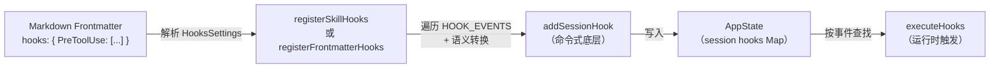

# 第 24 章：声明式钩子注册——从 CLAUDE.md 到执行器的绑定链路

> "让用户描述'发生什么时做什么'，而非'如何注册处理器'。"

---

用户不需要写一行 JavaScript，只需要在 Skill 的 Markdown frontmatter 中声明 `hooks: { PreToolUse: [...] }`，Claude Code 就会在工具调用前触发这个 hook。一个声明，整个执行链路自动建立——事件匹配、执行器调度、会话作用域管理。

这是**声明式钩子注册**（Declarative Hook Registration）模式：把 hook 的绑定关系从代码降级为数据，用一个 YAML 格式的配置结构描述"在什么事件、匹配什么条件时、执行什么命令"，由框架负责将配置解释为底层的命令式注册调用。

与命令式注册（直接调用 `addSessionHook`）相比，声明式注册的门槛更低——配置就是全部接口，不需要了解 API；但能力范围也更窄——无法表达条件逻辑或访问运行时状态。本章通过两个注册函数的源码，揭示声明式和命令式之间的桥接机制，以及一个关键的语义转换：当钩子在 Agent 上下文中运行时，`Stop` 事件需要自动转换为 `SubagentStop`。

---

## 问题：命令式注册的门槛与声明式注册的局限

想象一个 Skill 开发者想在自己的 Skill 激活时，自动注册一个"预工具调用检查器"。命令式方式要求她理解 `addSessionHook` 的签名、`HookEvent` 类型、`matcher` 规则、session 作用域管理——这些都是框架内部概念。

声明式方式让她只需要在 `skill.md` 的 frontmatter 中写：

```yaml
---
hooks:
  PreToolUse:
    - matcher: "BashTool"
      hooks:
        - type: command
          command: "echo 'About to run bash'"
---
```

框架读取这段 frontmatter，翻译为底层的 `addSessionHook` 调用。声明与执行解耦——配置是数据，执行是框架的事。

但声明式注册不是免费的简化。我们来看两种注册方式的工程权衡：

**图 24-1：声明式 vs 命令式钩子注册对比**

| 维度 | 声明式（frontmatter）| 命令式（addSessionHook）|
|------|---------------------|----------------------|
| 配置位置 | Markdown frontmatter | TypeScript 代码 |
| 门槛 | 低（YAML 数据结构）| 高（需要了解 API）|
| 能力范围 | 静态配置（事件+matcher+命令）| 动态逻辑（条件、闭包、回调）|
| Once 支持 | Skill 版本支持 `once: true` | 手动调用 removeSessionHook |
| 语义转换 | 框架自动处理（Stop→SubagentStop）| 调用方负责选正确事件 |
| 适用场景 | 简单触发逻辑、Skill/Agent 配套钩子 | 复杂条件、需要访问运行时上下文 |

两种方式不是竞争关系，而是互补：声明式是命令式的**用户友好封装**——框架内部仍然调用 `addSessionHook`，声明式只是在上层加了一个"配置解析→命令式调用"的翻译层。

---

## 源码实例 1：registerSkillHooks——once:true 的自清理钩子

`registerSkillHooks` 是 Skill 级别的声明式注册函数，定义在 `src/utils/hooks/registerSkillHooks.ts:22`：

```typescript
// src/utils/hooks/registerSkillHooks.ts:22-55（简化）
export function registerSkillHooks(
  setAppState: (updater: (prev: AppState) => AppState) => void,
  sessionId: string,
  hooks: HooksSettings,
  skillName: string,
  skillRoot?: string,
): void {
  let registeredCount = 0

  for (const eventName of HOOK_EVENTS) {  // 遍历所有 27 个事件
    const matchers = hooks[eventName]
    if (!matchers) continue

    for (const matcher of matchers) {
      for (const hook of matcher.hooks) {
        // once:true 的 hook：首次成功后自动移除（一次性钩子）
        const onHookSuccess = hook.once
          ? () => {
              logForDebugging(
                `Removing one-shot hook for event ${eventName} in skill '${skillName}'`,
              )
              removeSessionHook(setAppState, sessionId, eventName, hook)
            }
          : undefined

        addSessionHook(
          setAppState, sessionId, eventName,
          matcher.matcher || '', hook,
          onHookSuccess,
          skillRoot,
        )
        registeredCount++
      }
    }
  }
}
```

**源码参考：** `src/utils/hooks/registerSkillHooks.ts:22`

三层嵌套循环（第 30 行）的结构值得细看：最外层遍历 `HOOK_EVENTS`（27 个事件枚举），中间层遍历每个事件的 matchers（可以有多个匹配条件），最内层遍历每个 matcher 下的 hooks（可以有多个执行器）。这个三层结构直接映射了 `HooksSettings` 的数据结构——`eventName → matchers[] → hooks[]`——翻译逻辑简单，没有复杂的转换，数据和行为一一对应。

**遍历 `HOOK_EVENTS` 枚举**（而非直接遍历 `Object.keys(hooks)`）是一个关键设计选择：即使 frontmatter 中没有声明某个事件，`if (!matchers) continue` 会跳过它；但如果 frontmatter 中声明了一个不在 `HOOK_EVENTS` 中的事件名（如拼写错误的 `'PreToolsUse'`），`hooks[eventName]` 会返回 `undefined`，同样被跳过。这两种方式都实现了同样的结果，但遍历枚举额外保证了**注册的事件名一定是合法的**——不可能注册一个不存在的事件。

`once: true` 的自清理机制（第 37 行）是 `registerSkillHooks` 独有的设计：一次性钩子在首次成功执行后，通过 `onHookSuccess` 回调调用 `removeSessionHook` 注销自己。这个"自清理"模式让钩子的生命周期由钩子自己管理，而不是依赖外部调用方在某个时机调用 deregister——**钩子注册和注销的逻辑放在同一个地方**，降低了遗忘调用 deregister 导致重复触发的风险。

`skillRoot` 参数传给了 `addSessionHook`，最终会作为 `CLAUDE_PLUGIN_ROOT` 环境变量传给执行器。这让 Skill 中的 hook 命令可以使用相对路径引用同一目录下的脚本：`./scripts/check.sh` 会相对于 skillRoot 解析，而不是相对于用户的工作目录。

---

## 源码实例 2：registerFrontmatterHooks——Stop→SubagentStop 的语义转换

`registerFrontmatterHooks` 是更通用的声明式注册函数，同时支持 Skill 和 Agent 两种来源（`src/utils/hooks/registerFrontmatterHooks.ts:18`）：

```typescript
// src/utils/hooks/registerFrontmatterHooks.ts:18-60（简化）
export function registerFrontmatterHooks(
  setAppState: (updater: (prev: AppState) => AppState) => void,
  sessionId: string,
  hooks: HooksSettings,
  sourceName: string,
  isAgent: boolean = false,  // 默认为 false（Skill 上下文）
): void {
  if (!hooks || Object.keys(hooks).length === 0) return

  let hookCount = 0

  for (const event of HOOK_EVENTS) {
    const matchers = hooks[event]
    if (!matchers || matchers.length === 0) continue

    // 对 Agent，将 Stop 事件转换为 SubagentStop
    let targetEvent: HookEvent = event
    if (isAgent && event === 'Stop') {
      targetEvent = 'SubagentStop'
      logForDebugging(
        `Converting Stop hook to SubagentStop for ${sourceName} (subagents trigger SubagentStop)`,
      )
    }

    for (const matcherConfig of matchers) {
      const matcher = matcherConfig.matcher ?? ''
      for (const hook of matcherConfig.hooks ?? []) {
        addSessionHook(setAppState, sessionId, targetEvent, matcher, hook)
        hookCount++
      }
    }
  }
}
```

**源码参考：** `src/utils/hooks/registerFrontmatterHooks.ts:18`

`Stop→SubagentStop` 的语义转换（第 37-43 行）是这个函数最精妙的设计。为什么需要这个转换？

当一个子 Agent 完成时，系统触发的是 `SubagentStop` 事件，而不是 `Stop`。`Stop` 是顶层会话（主 Agent）结束时触发的事件。两者的区别在语义上清晰，但从 Agent frontmatter 的作者视角来看，很容易写错：作者想监听"这个 Agent 完成时"，自然会想到 `Stop`，但实际上应该用 `SubagentStop`。

源码注释（第 43 行）直接说明了这个人体工程学决策：

> "Converting Stop hook to SubagentStop for [source] (subagents trigger SubagentStop)"
> （为 [来源] 将 Stop hook 转换为 SubagentStop，因为子 Agent 触发 SubagentStop）

**这是"让错误的直觉变成正确的结果"**——框架承担了事件名的翻译责任，让配置者不需要了解 `Stop` 和 `SubagentStop` 的内部区别。这种在框架层做语义补偿的设计，可以降低用户犯错的频率，但代价是隐藏了一个重要的事件语义区分，可能让高级用户困惑"为什么我写的 Stop hook 变成了 SubagentStop"。

与 `registerSkillHooks` 的关键差异：`registerFrontmatterHooks` 不支持 `once: true`——没有 `onHookSuccess` 回调，也没有 `skillRoot` 参数。这反映了两个函数的设计目标不同：`registerSkillHooks` 是为 Skill 场景量身定制（需要精细控制 once 和路径），`registerFrontmatterHooks` 是更通用的翻译层，不引入额外的 Skill 专属语义。

**图 24-2：声明式注册的翻译链路**



这张图展示了完整的链路：用户在 frontmatter 写 YAML 配置，框架解析为 `HooksSettings` 数据结构，注册函数遍历并翻译为 `addSessionHook` 调用（含必要的语义转换），最终写入 `AppState` 的 session hooks Map，运行时由 `executeHooks` 查找并触发。

---

## 模式剖析：声明式注册的三层结构

**声明式钩子注册**模式由三个相互依赖的层次构成：

**1. 数据契约层（Data Contract）**：`HooksSettings` 类型定义了声明式配置的"语言"——`eventName → matchers[] → hooks[]`。这个结构是用户（写 frontmatter）和框架（注册函数）之间的契约。任何新的 hook 类型或事件，都需要先在 `HooksSettings` 中定义，才能通过声明式注册使用。

**2. 翻译层（Translation）**：`registerSkillHooks` 和 `registerFrontmatterHooks` 是声明式到命令式的翻译器。翻译逻辑包括：遍历事件枚举（确保合法性）、处理 `once: true`（自清理语义）、转换 `Stop→SubagentStop`（Agent 语义补偿）。翻译层的职责边界是：理解声明式配置的语义，调用正确的底层命令式 API。

**3. 命令式底层（Imperative Foundation）**：`addSessionHook` 是真正干活的函数，把 hook 写入 `AppState` 的 session hooks Map。声明式注册不绕过这一层，而是通过它实现——**声明式是命令式的封装，不是替代**。

这个三层结构让两种注册方式可以共存：Skill 配置使用声明式，框架内部复杂逻辑使用命令式，两者最终都落到同一个 `addSessionHook` 底层。

---

## 适用范围

| 场景 | 适用性 | 理由 | 替代方案 |
|------|--------|------|---------|
| Skill/Agent 配套简单触发钩子 | ✓ | frontmatter 表达力足够，无需写代码 | 命令式注册（门槛高）|
| 一次性钩子（once: true）| ✓（Skill 版本）| 内建 onHookSuccess 自清理，无需手动 deregister | 命令式注册 + 手动 removeSessionHook |
| 触发逻辑依赖运行时状态 | ✗ | frontmatter 是静态数据，无法访问 JS 闭包 | 命令式注册（闭包捕获上下文）|
| 条件注册（A 发生后才注册 B）| ✗ | frontmatter 没有条件分支能力 | 命令式注册 + 条件判断 |
| 需要精确区分 Stop 和 SubagentStop | ✗（谨慎）| isAgent=true 时 Stop 被自动转换，无法绕过 | 直接使用命令式注册指定精确事件 |

---

## 权衡与局限

**权衡 1：声明式的表达力天花板**

`HooksSettings` 能表达的只有：事件名、matcher 条件（字符串匹配）、执行器配置（command/type）。无法表达：`A 事件触发后，根据 A 的输出决定是否注册 B`，或`第 N 次触发时更换命令`。这个表达力边界是刻意的——复杂逻辑应该在命令行脚本或 AI 调用中处理，而不是在 hook 配置格式中增加图灵完备的条件语言。

**权衡 2：registerSkillHooks 和 registerFrontmatterHooks 的功能分裂**

两个函数都遍历 `HOOK_EVENTS`，都调用 `addSessionHook`，但 `once: true` 支持、`skillRoot` 参数、Stop→SubagentStop 转换分别在不同函数中。随着 Skill 和 Agent 系统的演进，两个函数可能进一步分化。当前的分裂是历史演进的结果（推断），未来若需要统一，需要仔细处理各自的独有逻辑。

**权衡 3：Stop→SubagentStop 的隐式转换对调试的影响**

当 Agent 开发者看到日志 "Converting Stop hook to SubagentStop" 时，如果他们不了解这个机制，可能会困惑"我明明写了 Stop，为什么系统说在转换？"。隐式转换是方便用户的代价是透明度降低——调试 Agent hook 未触发时，需要额外知道这个转换规则。更透明的替代方案是文档中警告"Agent 中的 Stop 等价于 SubagentStop"，但不做隐式转换。

---

## 与已知模式的对话

**与 Spring @EventListener 注解**：Spring 的 `@EventListener` 允许开发者在方法上声明"监听某类事件"，框架负责注册和分发。与本模式相似：声明式绑定，框架负责执行。差异在于：Spring 注解是编译期处理（由注解处理器生成代码），本模式是运行时解析 frontmatter（读取 YAML 文件，动态调用 `addSessionHook`）。编译期处理有类型安全保证，运行时解析更灵活但更晚发现错误。

**与 Kubernetes Manifest（声明式基础设施）**：K8s 的 Manifest YAML 描述"期望状态"（desired state），Kubernetes 控制器负责实现这个状态。本模式的 frontmatter hooks 声明"期望注册的钩子"，框架负责将声明转为实际注册。差异在于：K8s 有持续的 reconciliation loop（持续调谐，保证实际状态趋近期望状态）；Claude Code 的钩子注册是一次性的（会话启动时注册，结束时清理），不需要持续调谐。

**与 GoF 解释器模式（Interpreter Pattern）**：解释器模式为语言（如 SQL、正则表达式）定义语法和解释器，解释器将表达式翻译为操作。`HooksSettings` 是一种微型 DSL（领域特定语言），`registerSkillHooks` 和 `registerFrontmatterHooks` 是这个 DSL 的解释器——遍历 AST（这里是 JSON/YAML 数据结构），生成命令式调用。差异在于：本模式的 DSL 极其简单（无分支、无循环）；标准解释器模式处理的通常是图灵完备的语言。

---

## 模式提炼

### 声明式钩子注册（Declarative Hook Registration）

**解决的问题**：命令式注册要求用户理解框架 API，门槛高；但 hook 的大多数使用场景只需要"在某事件、某条件下执行某命令"，不需要代码级灵活性。

**核心做法**：定义数据契约（`HooksSettings` 结构），翻译函数遍历完整事件枚举并调用底层命令式 API；翻译层承担语义补偿（Stop→SubagentStop），调用方只需写 YAML 配置。

**前置条件**：有成熟的命令式底层（`addSessionHook`）作为基础；声明式能力范围能覆盖主要使用场景；边缘案例可以通过命令式兜底。

**源码证据**：`src/utils/hooks/registerSkillHooks.ts:30`（`for (const eventName of HOOK_EVENTS)` 遍历枚举确保合法性）；`src/utils/hooks/registerFrontmatterHooks.ts:37`（`isAgent && event === 'Stop'` 语义转换）

---

### 自清理一次性钩子（Self-Cleaning One-Shot Hook）

**解决的问题**：一次性钩子（只触发一次的 hook）需要在触发后注销自己，如果由调用方负责 deregister，容易遗忘或在错误的时机执行。

**核心做法**：在注册时创建 `onHookSuccess` 回调，回调中调用 `removeSessionHook` 注销当前钩子；注册和注销的逻辑放在同一个地方（注册代码旁），不依赖外部调用方。

**前置条件**：底层 hook 执行器在成功时能回调通知（`onHookSuccess`）；有 `removeSessionHook` 等精确注销接口。

**源码证据**：`src/utils/hooks/registerSkillHooks.ts:37`（`hook.once ? () => { removeSessionHook(...) } : undefined`，`onHookSuccess` 自清理回调）

---

## 你能做什么

- **将声明式注册实现为命令式注册的薄翻译层**，两者共用同一个底层 API（`addSessionHook`）。声明式不是独立的实现，而是命令式的用户友好封装——这样新增的底层能力会自动被声明式继承。

- **遍历完整的事件枚举注册钩子**（而非 `Object.keys(userConfig)`），确保注册的事件名一定合法。用户配置中的拼写错误会静默跳过，而不是注册一个永远不会触发的钩子。

- **在 Agent 上下文中自动做 Stop→SubagentStop 的语义转换**，让 Agent 配置者用直觉上正确的事件名，框架负责翻译为运行时正确的事件。这类语义补偿减少了用户犯错，但需要在日志中记录转换发生（便于调试）。

- **为 once: true 的钩子实现 onHookSuccess 自清理回调**，把注册和注销的逻辑放在同一个地方。这比"外部调用方记得 deregister"更可靠，也让代码的意图更清晰。

- **为声明式和命令式注册提供统一的 sessionId 作用域**：声明式注册的钩子绑定到 sessionId（或 agentId），会话结束时统一清理。让生命周期管理跟着作用域走，不需要单独追踪每个钩子的清理。

---

声明式钩子注册是 Hooks 系统的用户界面层。Hooks 系统全景的另一端——权限决策如何拦截工具调用、规则引擎如何评估——将在接下来的第 33 章和第 34 章展开（详见第 33 章）。
