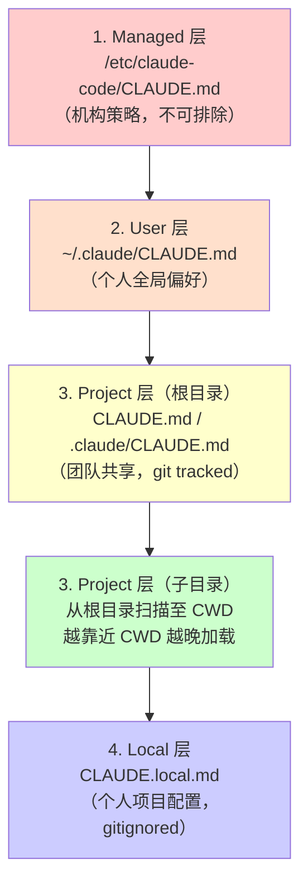
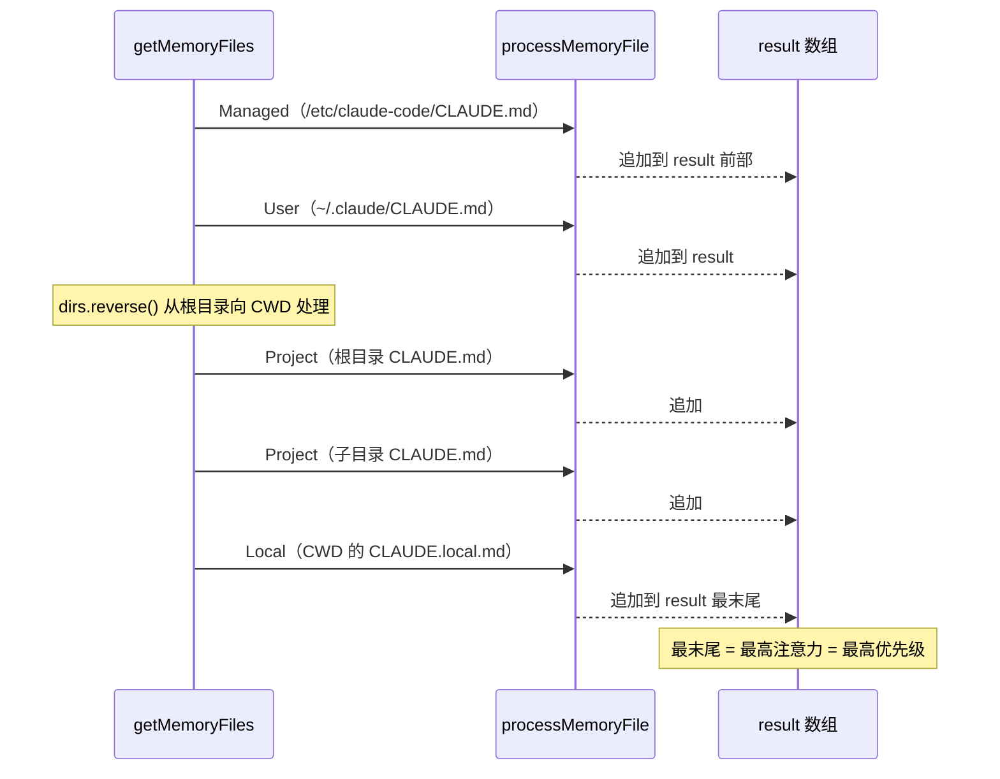
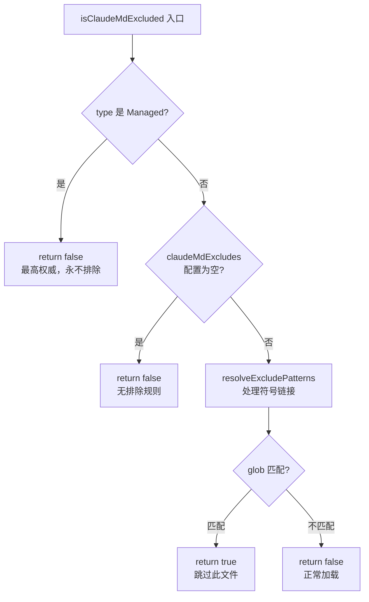
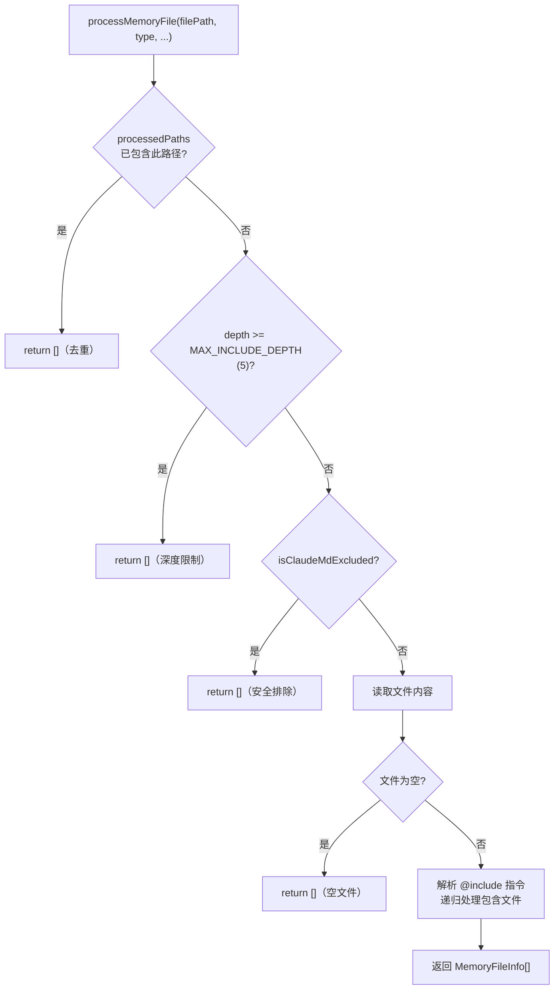
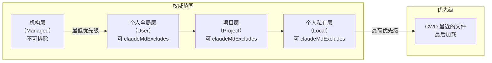

# 第 20 章：CLAUDE.md 注入——层级化指令的加载与优先级

> "配置越接近现场，越了解当前上下文，也应该有越高的发言权。"

---

团队协作场景下，AI 指令的管理会遭遇一个经典的权威分层问题：公司的安全合规规则应该对所有人生效，但个人的工作偏好不该影响同事，而项目特定的上下文只应在该项目里有效。如果只有一个配置文件，这三种权威无法同时存在。

Claude Code 用一个简洁的机制解决了这个问题：按 `Managed → User → Project → Local` 四层加载 CLAUDE.md 文件，越靠近工作目录的文件越晚加载，模型越"关注"它。这就是**层级化配置扫描**（Hierarchical Config Scan）——用目录层级表达权威范围，用加载顺序传递优先级。

读完这章，我们将理解这一模式的完整实现：从 4 层结构的权威分离设计，到 `memoize` 缓存优化，再到安全排除机制——以及这一模式在任何需要多层级配置权威的工具中的复用价值。

---

## 问题：多层级权威，单一配置文件无法胜任

在单人使用场景里，一个 `CLAUDE.md` 文件足够了——你写什么规则，AI 就遵守什么规则。但当 Claude Code 进入团队协作场景时，问题变得复杂：

**管理员**希望在整个组织范围内强制执行安全规则，不允许个人覆盖；**个人用户**有自己的全局偏好（比如偏好某种代码格式），对所有项目有效；**项目团队**需要把项目上下文（架构约定、测试策略、禁用的第三方库）写入 CLAUDE.md 并提交到 git，让所有协作者共享；**某个子目录**可能有更细粒度的特殊要求（比如 `src/payment/` 目录需要特别强调 PCI 合规）。

这四种权威无法塞进同一个文件。塞进去的结果是：全局规则被项目规则覆盖，或者项目规则被个人偏好污染。

`src/utils/claudemd.ts` 文件开头的注释精确定义了这个问题的解决方案：

```typescript
// src/utils/claudemd.ts:1-16
/**
 * 文件按以下顺序加载：
 *
 * 1. Managed memory（如 /etc/claude-code/CLAUDE.md）——所有用户的全局指令
 * 2. User memory（~/.claude/CLAUDE.md）——跨项目的个人私有全局指令
 * 3. Project memory（项目根目录下的 CLAUDE.md、.claude/CLAUDE.md 和 .claude/rules/*.md）——签入代码库的项目指令
 * 4. Local memory（项目根目录下的 CLAUDE.local.md）——项目专属的私有指令
 *
 * 文件按优先级倒序加载，即越靠后加载的文件优先级越高，
 * 模型对它们的关注度也越高。
 *
 * 文件发现规则：
 * - User memory 从用户主目录加载
 * - Project 和 Local 文件从当前目录向上遍历直至根目录发现
 * - 离当前目录越近的文件优先级越高（越晚加载）
 * - 每个目录下都会检查 CLAUDE.md、.claude/CLAUDE.md 以及 .claude/rules/ 下所有 .md 文件（Project memory）
 */
```

**源码参考：** `src/utils/claudemd.ts:1`

这段注释有两个关键信息。第一，四层分工明确：
- **Managed**（`/etc/claude-code/CLAUDE.md`）：机构级策略，适用于所有用户。这层不受任何 `claudeMdExcludes` 配置影响——你无法排除管理员的规则。
- **User**（`~/.claude/CLAUDE.md`）：用户个人全局偏好，跨项目有效，但不提交到 git，不影响他人。
- **Project**（`CLAUDE.md`、`.claude/CLAUDE.md`、`.claude/rules/*.md`）：项目级规则，提交到 git，团队共享。
- **Local**（`CLAUDE.local.md`）：项目级私人配置，在 `.gitignore` 中排除，不影响其他协作者。

第二，优先级的传递机制：**"files are loaded in reverse order of priority, i.e. the latest files are highest priority"**。越晚加载的文件，模型越"关注"它。这意味着靠近工作目录的文件拥有更高的优先级——而不是用覆盖（override），而是用追加顺序（append order）实现优先级差异。

**图 20-1：CLAUDE.md 4 层扫描结构**



越靠近 CWD 的文件在图中越靠下，加载顺序越晚，优先级越高。这种"距离决定优先级"的设计是本章核心模式的直觉基础。

---

## 源码实例 1：getMemoryFiles 的扫描逻辑

`getMemoryFiles` 是整个 CLAUDE.md 加载系统的入口函数。它的完整实现在 `src/utils/claudemd.ts:790`：

```typescript
// src/utils/claudemd.ts:790
export const getMemoryFiles = memoize(
  async (forceIncludeExternal: boolean = false): Promise<MemoryFileInfo[]> => {
    // ...
    const result: MemoryFileInfo[] = []
    
    // 1. Managed 层（始终加载，不受 settingSource 门控）
    const managedClaudeMd = getMemoryPath('Managed')
    result.push(...(await processMemoryFile(managedClaudeMd, 'Managed', ...)))
    
    // 2. User 层（受 userSettings 门控）
    if (isSettingSourceEnabled('userSettings')) {
      const userClaudeMd = getMemoryPath('User')
      result.push(...(await processMemoryFile(userClaudeMd, 'User', ...)))
    }
    
    // 3 & 4. Project + Local 层：从 CWD 向上遍历，然后逆序处理
    const dirs: string[] = []
    let currentDir = getOriginalCwd()
    while (currentDir !== parse(currentDir).root) {  // (line 854)
      dirs.push(currentDir)
      currentDir = dirname(currentDir)
    }
    for (const dir of dirs.reverse()) {  // (line 878) 逆序 = 根→CWD
      const projectPath = join(dir, 'CLAUDE.md')       // (line 888)
      result.push(...(await processMemoryFile(projectPath, 'Project', ...)))
      const dotClaudePath = join(dir, '.claude', 'CLAUDE.md')  // (line 899)
      result.push(...(await processMemoryFile(dotClaudePath, 'Project', ...)))
      // .claude/rules/*.md 文件同样检查
      const localPath = join(dir, 'CLAUDE.local.md')
      result.push(...(await processMemoryFile(localPath, 'Local', ...)))
    }
    // ...
  }
)
```

**源码参考：** `src/utils/claudemd.ts:790-910`

这段代码有三个值得深入的设计点。

**设计点 1：memoize 缓存——会话级单次扫描**

函数被 `memoize` 包裹，这意味着整个会话生命周期内，文件系统只扫描一次。为什么？每次 API 调用都要构建系统提示（详见第 19 章），如果每次都重新扫描文件系统，可能涉及十几个目录的文件查找，累积 IO 成本不可忽略。`memoize` 把这个成本压缩到会话的第一次调用，后续命中缓存，耗时接近零。

代价是：如果用户在会话中修改了 CLAUDE.md，新内容不会生效，直到重启 Claude Code。这个 trade-off 是有意为之的——对于 AI 指令来说，稳定性比实时更新更重要。

**设计点 2：`dirs.reverse()` 的语义——反转实现优先级**

目录遍历的构建方向是"从 CWD 向上"（`while (currentDir !== parse(currentDir).root)`），但处理方向是"从根向下"（`dirs.reverse()`）。这个反转是实现"就近优先"的关键。

为什么要反转？因为 `result` 数组是 append-only 的——后加入的内容追加在末尾，模型在处理时"更关注"末尾的内容。`dirs.reverse()` 确保靠近 CWD 的目录最后处理，其 CLAUDE.md 内容最后追加，从而获得最高优先级。

| 不反转（错误）| 反转后（正确）|
|-------------|-------------|
| 处理顺序：CWD → ... → root | 处理顺序：root → ... → CWD |
| CWD 的 CLAUDE.md 最先加载 = 最低优先 | CWD 的 CLAUDE.md 最后加载 = 最高优先 |
| "就近优先"失效 | "就近优先"生效 |

**图 20-2：getMemoryFiles 加载顺序与优先级流向**



每一层追加到 `result` 末尾，最靠近 CWD 的文件（Local 层）最后追加，在系统提示中获得最高的模型注意力。这是「顺序即优先级」语义的直观展示。

**设计点 3：三种 Project 文件路径的完整覆盖**

每个目录层级会检查三种 Project 类型路径：
- `CLAUDE.md`（传统放法）
- `.claude/CLAUDE.md`（隐藏目录，不干扰项目文件）
- `.claude/rules/*.md`（模块化规则文件，每个关注点一个文件）

以及一种 Local 类型路径：
- `CLAUDE.local.md`（个人私有，`.gitignore` 排除）

这种多路径设计让项目有灵活性：既可以用单一 `CLAUDE.md`，也可以用 `.claude/rules/` 把不同关注点拆分到不同文件，而不需要改变任何扫描逻辑。

---

## 源码实例 2：isClaudeMdExcluded 与 processMemoryFile

`getMemoryFiles` 负责扫描哪些目录，而 `processMemoryFile` 负责加载单个文件。两者之间有一个安全检查：`isClaudeMdExcluded`。

`isClaudeMdExcluded` 定义在 `src/utils/claudemd.ts:547`：

```typescript
// src/utils/claudemd.ts:547-580
function isClaudeMdExcluded(filePath: string, type: MemoryType): boolean {
  // Managed、AutoMem、TeamMem 类型永不排除
  if (type !== 'User' && type !== 'Project' && type !== 'Local') {
    return false
  }

  const patterns = getInitialSettings().claudeMdExcludes
  if (!patterns || patterns.length === 0) {
    return false
  }

  // 构建包含 realpath 解析版本的扩展模式列表
  // 处理 macOS 上的 /tmp -> /private/tmp 符号链接问题
  const expandedPatterns = resolveExcludePatterns(patterns).filter(
    p => p.length > 0,
  )
  // ... glob 匹配逻辑 ...
}
```

**源码参考：** `src/utils/claudemd.ts:547`

这个函数有一个不对称的设计：**Managed 类型永远不能被排除**（第一个 if 分支直接返回 false）。这不是疏漏，而是架构保证——如果管理员的策略可以被用户的 `claudeMdExcludes` 配置排除，那机构级安全规则就失去了约束力。`isClaudeMdExcluded` 把"哪些类型的权威可以被用户覆盖"编码在了函数内部。

函数还处理了一个 macOS 特有的路径问题：`/tmp` 在 macOS 上是 `/private/tmp` 的符号链接。如果用户在 `claudeMdExcludes` 里写了 `/tmp/project/CLAUDE.md`，但实际路径是 `/private/tmp/project/CLAUDE.md`，普通字符串匹配会失败。`resolveExcludePatterns` 把模式和路径都解析到 realpath，保证两侧都是规范路径。

`isClaudeMdExcluded` 被 `processMemoryFile` 在第 635 行调用：

```typescript
// src/utils/claudemd.ts:618-638（简化）
export async function processMemoryFile(
  filePath: string,
  type: MemoryType,
  processedPaths: Set<string>,
  includeExternal: boolean,
  depth: number = 0,
): Promise<MemoryFileInfo[]> {
  // 去重：避免同一文件被多条扫描路径加载两次
  const normalizedPath = normalizePathForComparison(filePath)
  if (processedPaths.has(normalizedPath) || depth >= MAX_INCLUDE_DEPTH) {
    return []
  }
  
  // 安全检查：排除被 claudeMdExcludes 配置屏蔽的路径
  if (isClaudeMdExcluded(filePath, type)) {
    return []
  }
  // ... 继续读取文件、解析 @include 指令 ...
}
```

**源码参考：** `src/utils/claudemd.ts:618-638`

`processMemoryFile` 是整个加载过程的叶节点，负责读取一个具体的文件并递归处理其中的 `@include` 指令。`MAX_INCLUDE_DEPTH = 5` 限制了递归深度，防止循环引用或过深的包含链把加载过程变成死循环。

它同样负责 `processedPaths` 的去重：同一个规范路径只处理一次。这个去重在 git worktree 场景下很重要——从 worktree 根目录向上扫描时，可能经过真实仓库根目录，导致同一个 CLAUDE.md 被两条路径各发现一次。去重确保了内容不会重复注入系统提示。

**图 20-3：isClaudeMdExcluded 安全判断流程**



Managed 类型的早返回（`return false`）是架构层面的安全保证：机构级策略必须对所有用户强制生效，不允许通过 `claudeMdExcludes` 配置绕过。

**图 20-4：processMemoryFile 的决策流程**



注意四条 `return []` 路径：去重、深度限制、安全排除、空文件。每一条都是"静默失败"（不抛异常，返回空数组），让调用方 `getMemoryFiles` 可以用 `result.push(...(await processMemoryFile(...)))` 的扁平模式组装结果，而不需要处理 null 或异常。

---

## 模式剖析：层级化配置扫描（Hierarchical Config Scan）

这个模式有三个组成部件，各自解决一个具体问题：

**组件 1：固定权威层级（解决"谁的规则更权威"）**

四层按从低到高的信任顺序排列：Managed（机构策略）→ User（个人全局）→ Project（团队共享）→ Local（个人私有）。`isClaudeMdExcluded` 通过硬编码"Managed 类型不可排除"，在代码层面保证了最高权威不可被绕过。

**组件 2：append 追加 + 逆序处理（解决"如何用顺序表达优先级"）**

内容合并采用 append 而非 override——所有 CLAUDE.md 的内容都追加到 `result` 数组，最终拼接成一个大的系统提示块。优先级通过追加顺序体现：`dirs.reverse()` 把"从 CWD 向上收集"的目录顺序反转，让 CWD 最近的文件最后追加，获得最高的注意力权重。

这个设计避免了"谁覆盖谁"的判断复杂度——所有内容都保留，顺序决定优先级，不需要实现合并逻辑。

**组件 3：memoize 缓存（解决"高频调用的 IO 成本"）**

系统提示在每次 API 请求前构建（详见第 19 章），CLAUDE.md 扫描是其中的 IO 操作。`memoize` 把会话内的第一次扫描结果缓存，后续复用，把可能的十几次文件系统读取压缩到一次。

---

## 适用范围

| 场景 | 适用性 | 理由 | 替代方案 |
|------|--------|------|---------|
| 多层级权威（机构/用户/项目/子目录）| ✓ | 层级结构天然表达权威范围 | 单一配置文件（无法分层）|
| 配置需要就近覆盖（离现场越近越专业）| ✓ | dirs.reverse() 实现就近优先 | 环境变量（不可版本控制）|
| 配置随代码版本控制 | ✓ | Project 层文件（CLAUDE.md）提交到 git | 数据库存储（不跟代码走）|
| 部分用户需要个人私有覆盖 | ✓ | Local 层（CLAUDE.local.md）gitignored，不共享 | 无（单一共享配置文件覆盖不了这个需求）|
| 配置高频读取（每次请求都要）| ✓（配合 memoize）| 会话级缓存消除重复 IO | 按请求读取（成本高）|
| 需要在会话中实时更新配置 | ✗ | memoize 缓存在会话内不失效 | 不用缓存（但每次 IO 有成本）|
| 配置项之间有复杂合并语义（如深度 merge）| ✗（谨慎）| 当前实现是 append，不支持键值级合并 | 专用配置合并库 + 结构化 YAML |

---

## 权衡与局限

**权衡 1：append 而非 override——简单却有代价**

所有 CLAUDE.md 的内容被追加成一个大块，不是键值合并。这意味着如果 Managed 层写了"永远不要删除文件"，而 Project 层写了"在 tmp 目录可以删除文件"，两条指令都会出现在系统提示里，由 AI 自行解读。AI 通常会遵守后出现的（更高优先级的）指令，但这不是代码层面的强制保证——而是提示词语义的软约束。

真正需要"硬覆盖"语义的场景（比如 Managed 层必须禁止某类操作），应在 Managed 层使用明确的禁止性语言，而不依赖优先级顺序。

**权衡 2：memoize 缓存 vs 实时性**

`getMemoryFiles` 的 memoize 是无参缓存（`memoize(async () => {...})`，不接受 key），这意味着即使 `forceIncludeExternal` 参数不同，也命中同一个缓存（因为 memoize 默认用第一个参数作 key，而函数有个可选 boolean 参数）。这在通常使用中没有问题，但在需要动态切换 `forceIncludeExternal` 的场景下可能产生意外。

**权衡 3：`@include` 的深度限制**

`MAX_INCLUDE_DEPTH = 5` 防止了循环包含引起的无限递归，但同时也限制了文件包含的层次深度。如果项目的 CLAUDE.md 包含了公共规则文件，公共规则文件又包含了更底层的原子规则文件，超过 5 层的包含链会被静默截断——没有报错，只是不加载更深层的文件。

**图 20-5：层级优先级与权威范围的对应关系**



**权衡 4：Managed 类型不可排除的语义代价**

Managed 层的不可排除性保证了机构策略的权威，但也意味着在某些开发环境中（比如测试机器上安装了某个系统级 CLAUDE.md），开发者无法临时屏蔽不需要的指令。目前没有 per-session 的 Managed 层覆盖机制——这是设计上偏向安全性而非灵活性的选择。

---

## 与已知模式的对话

**与 Git 配置（system/global/local 三层）**：最为相似。Git 配置的 system（`/etc/gitconfig`）→ global（`~/.gitconfig`）→ local（`.git/config`）三层，与 Managed → User → Project 几乎一一对应：更靠近用户的配置层级越高，可以覆盖更宽泛的配置。两者的核心思想都是"权威与距离成正比"——距离工作现场越近的配置，越了解当前上下文，优先级越高。

主要差异：Git 使用 **override 语义**（下层的同名配置项覆盖上层），而 Claude Code 使用 **append 语义**（所有层级的内容追加在一起）。这个差异源于配置性质的不同：git 配置是结构化的键值对，支持明确的键名覆盖；CLAUDE.md 是自然语言指令，没有"键名"可以覆盖，只能通过追加顺序和模型的注意力机制传递优先级。

**与 Maven/npm 配置继承（就近原则）**：Maven 的 `pom.xml` 支持父 POM 继承，子项目的配置覆盖父项目；npm 的 `.npmrc` 同样按目录层级查找，就近优先。相同点是"距离当前项目越近，优先级越高"；差异在于 Maven 和 npm 面对的是结构化配置，支持键级覆盖，而 Claude Code 面对的是无结构的自然语言，只能用顺序传递优先级。

**结论**：层级化配置扫描是"Git 配置三层模型"的自然语言版本——保留了"权威分层 + 就近优先"的核心结构，用 append+顺序替换了 override+键名，以适配自然语言指令的无结构特性。

---

## 模式提炼

### 层级化配置扫描（Hierarchical Config Scan）

**解决的问题**：不同层级的用户需要对 AI 指令有不同粒度的控制权，高层级权威（机构策略）必须能覆盖低层级用户，同时允许靠近工作目录的上下文有更高的局部权威。

**核心做法**：按 Managed → User → Project → Local 固定层级扫描配置文件；收集目录路径后反转顺序（`dirs.reverse()`），确保靠近 CWD 的文件最晚追加，获得最高注意力权重。Managed 类型硬编码不可排除，保护最高权威不被绕过。

**前置条件**：配置有明确的权威层级（谁的规则更权威）；优先级可通过"追加顺序 + 模型注意力"传递（不需要键级 override）；配置频率允许会话级缓存（不需要实时更新）。

**源码证据**：`src/utils/claudemd.ts:1`（4层结构注释），`src/utils/claudemd.ts:878`（`dirs.reverse()`，就近优先实现），`src/utils/claudemd.ts:547`（`isClaudeMdExcluded`，Managed 层不可排除）

---

## 你能做什么

- **为工具的配置设计 4 层结构**：系统级（不可覆盖）→ 用户级（个人全局）→ 项目级（团队共享）→ 局部级（个人私有），层间权威范围明确不重叠。

- **用目录层级而非用户角色决定优先级**——距离工作目录越近的配置，越了解当前上下文，应该获得更高优先级。"就近原则"比"角色检查"更简单、更可预期。

- **收集后反转，用追加顺序传递优先级**。先向上收集所有父目录路径，然后反转顺序处理，确保最靠近 CWD 的配置最后追加到结果集——利用模型或框架的"末尾注意力偏好"隐式传递优先级。

- **用 memoize 缓存高频但低变化的文件扫描结果**。如果配置文件的修改频率远低于读取频率（如会话粒度），会话级缓存可以把十几次 IO 压缩到一次。明确文档化"会话内更新不生效"的缓存语义。

- **把"最高权威不可排除"编码在函数内部**，而不是依赖调用方的自律。`isClaudeMdExcluded` 的 Managed 类型早返回是一个自证明的安全约束——读代码的人能立刻理解"这一类型不可以被排除"，不需要依赖文档。

- **用静默失败（返回空数组）而非抛异常处理"文件不存在"**。层级化扫描的语义是"有就读，无则跳过"——对应目录下没有 CLAUDE.md 是正常状态，不是错误。返回空数组让调用方用 `push(...result)` 扁平组装，保持调用代码简洁。

- **如果你在构建支持@include 的配置系统**，设置递归深度上限（如 `MAX_INCLUDE_DEPTH = 5`）并静默截断，而不是抛出循环引用错误——用户的 @include 配置可能意外形成环，截断比崩溃更友好。

---

CLAUDE.md 文件的加载和注入只是第一步——这些内容如何在系统提示中与工具声明、对话历史、记忆条目组合在一起？这个组装逻辑详见第 19 章的 `fetchSystemPromptParts()` 分析。三层记忆架构（本地、跨会话、团队共享）中，CLAUDE.md 属于"本地记忆"层，更宽泛的记忆管理策略详见第 19 章。
