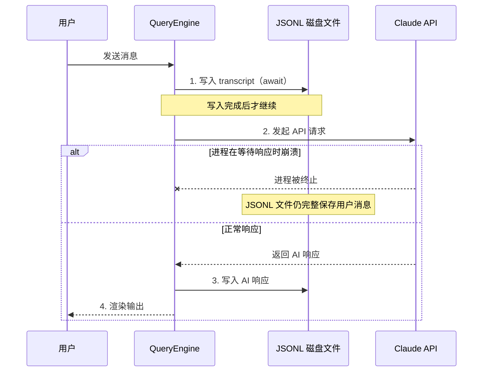
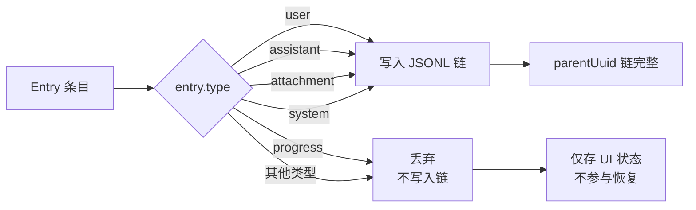
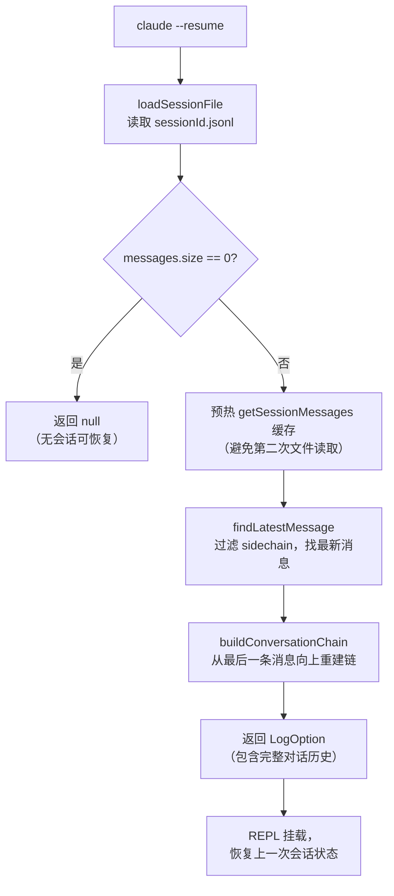
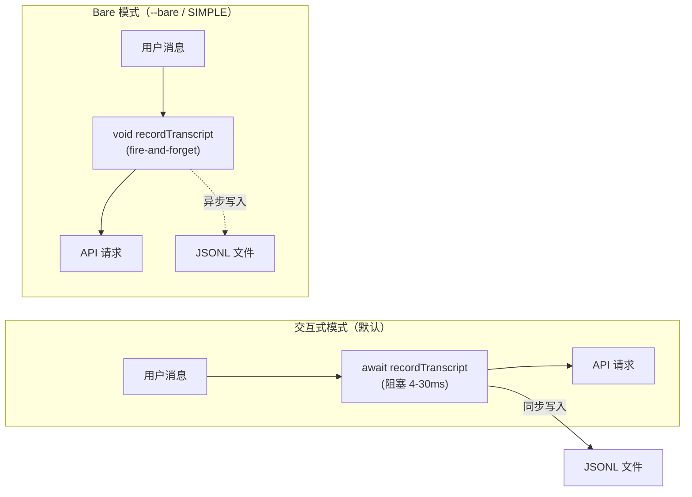
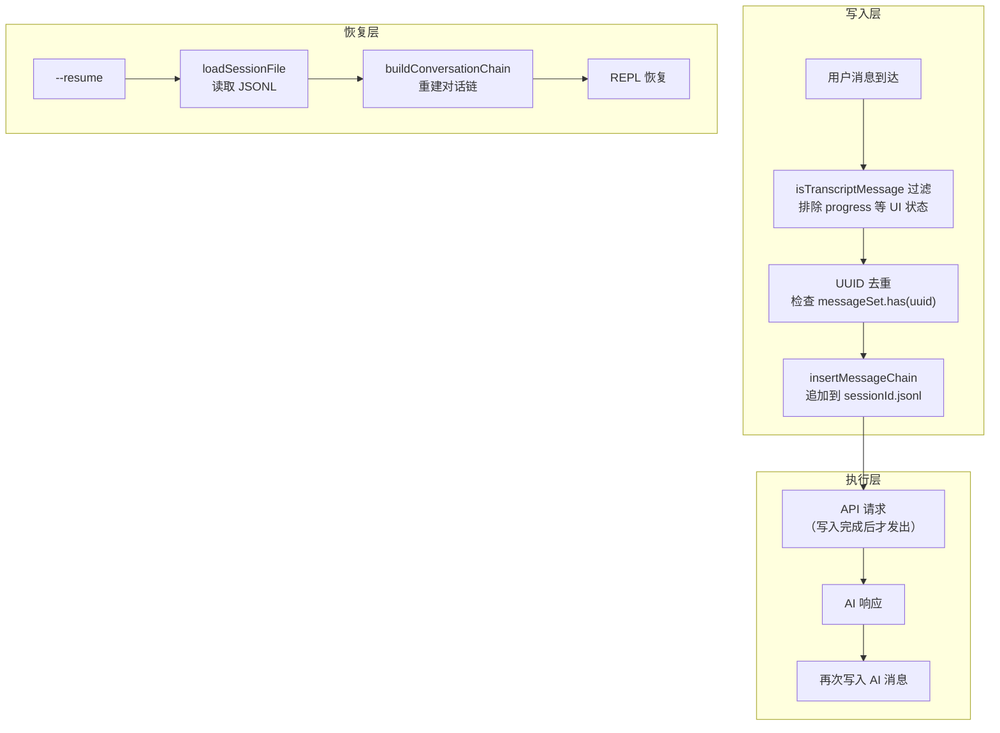

# 第 21 章：会话持久化——转录、快照与断点续写

> "先记下来，再去执行。这不是习惯，是协议。"

---

Agent 系统面临一个它无法控制的敌人：进程随时可能被终止。用户按下 Stop、系统发出 SIGKILL、网络断开——AI 的 API 调用可能在飞行中被拦截，而在此之前，用户刚刚发出的消息可能还没有被任何地方记录。

当进程重启后，如何判断"上一轮对话到底发生了什么"？如果什么都没写入磁盘，答案是：什么都不知道。

Claude Code 用一个看似简单、实则充满工程考量的模式回答了这个问题：**在发出 API 请求之前，先把用户的消息写入磁盘**。这就是"写入先于执行"（Write-Before-Execute）模式——先有记录，后有操作，任何崩溃点都能找到足够的信息恢复。

读完这章，我们将理解这一持久化模式的完整实现：从消息如何在 API 调用前落盘，到进程重启后如何从 JSONL 文件中重建会话链——以及每一个设计决策背后的工程权衡。

---

## 问题：进程崩溃是设计约束，不是边界条件

一个长时间运行的 Agent 系统必须把"进程会崩溃"当作一等公民对待，而不是一个需要单独处理的异常情况。

想象最坏的时序：用户在 Claude Code 中输入了一段详细的需求，按下回车，此时 `QueryEngine` 开始把用户消息发往 Claude API。但在 API 响应返回之前——也许只差几毫秒——用户点击了 Stop 按钮。进程被终止。消息在哪里？如果没有持久化机制，这条消息永远消失了。

更有趣的是：即使进程没有崩溃，Claude Code 也必须支持 `--resume` 命令行标志——让用户在新会话中从上一次的对话断点继续。这要求会话历史必须是可靠的、可重建的。

这两个需求共同指向同一个设计决策：**写入时机必须早于执行时机**。

**图 21-1：写入先于执行的时序**



注意时序的关键点：写入磁盘（步骤 1）发生在 API 请求（步骤 2）之前。即使进程在等待响应时崩溃，磁盘上已经有了用户的消息，`--resume` 就能从这里重建会话。

**这个问题为什么难以简单解决？**

直觉上的做法是在 AI 响应返回后再写入，把整个对话轮次一起保存。但这样做在"进程崩溃"场景下完全失效——如果 API 调用没有完成，就没有响应，也就没有东西可以写入。更糟糕的是，下一次启动时系统甚至不知道用户发过这条消息，`--resume` 会告诉用户"没有找到会话"。

另一种想法是用内存缓冲区，等到一定数量再批量写入。这降低了 IO 频率，但在崩溃时丢失的数据量更多。

Claude Code 选择了最简单也最可靠的方案：**每次用户消息到来，立即同步写入，再发 API 请求**。

---

## 源码实例 1：recordTranscript 的写入策略

`QueryEngine.ts` 中的核心写入逻辑位于第 434 行附近。在进入查询主循环之前，有一段明确注释了设计意图的代码：

在进入 `for await` 查询循环之前，系统首先对用户消息发起持久化：

```typescript
// src/QueryEngine.ts:436-462
// 在进入查询循环前，将用户的消息持久化到 transcript。
// 下面的 for-await 只在 ask() 产出 assistant/user/compact_boundary 消息时
// 调用 recordTranscript——而这要等到 API 响应才会发生。如果在那之前进程被杀死
//（比如用户在发送后几秒内点击 Stop），transcript 里只剩下 queue-operation 条目；
// getLastSessionLog 会过滤掉这些，返回 null，--resume 会报告"未找到会话"。
// 现在提前写入，使得 transcript 从用户消息被接受的时间点就具备可恢复性，
// 即使后续 API 响应永远没有到达。
//
// --bare / SIMPLE 模式：fire-and-forget（fire-and-forget）。脚本调用不会在
// kill-mid-request 后执行 --resume。await 大约是 SSD 上 4ms，磁盘竞争时 30ms——
// 这是模块求值之后，单一最大的可控关键路径成本。
// Transcript 仍然会写入（供事后调试），只是不阻塞。
if (persistSession && messagesFromUserInput.length > 0) {
  const transcriptPromise = recordTranscript(messages)
  if (isBareMode()) {
    void transcriptPromise
  } else {
    await transcriptPromise
    if (
      isEnvTruthy(process.env.CLAUDE_CODE_EAGER_FLUSH) ||
      isEnvTruthy(process.env.CLAUDE_CODE_IS_COWORK)
    ) {
      await flushSessionStorage()
    }
  }
}
```

**源码参考：** `src/QueryEngine.ts:436-462`

这段注释是整个 `sessionStorage.ts` 设计意图的最浓缩表达，值得逐句解读。

首先是"提前写入"的理由。注释精确描述了不提前写入时的失败路径：`getLastSessionLog` 会过滤掉 `queue-operation` 条目（这些是内部状态跟踪，不属于对话内容），最终返回 `null`，`--resume` 以失败告终。这不是一个偶发 bug，而是设计上的必然——如果只在 API 响应后写入，"响应没有到达"的场景根本没有可写的东西。

其次是两种写入模式的分叉。`isBareMode()` 决定了关键路径上的性能开销：

| 模式 | 写入方式 | 阻塞调用者 | 使用场景 |
|------|---------|-----------|---------|
| 交互式（默认）| `await transcriptPromise` | ✓ | 用户通过终端交互 |
| Bare 模式（`--bare`）| `void transcriptPromise` | ✗ | 脚本调用、自动化流水线 |

**核心权衡**：`await` 写入在 SSD 上的开销约为 4ms，在磁盘竞争时最高 30ms。注释称其为"模块求值之后，单一最大的可控关键路径成本"——这意味着这是已知的、可量化的性能代价，不是意外。Claude Code 选择在交互式场景中承受这个代价，换取"崩溃后必然可以恢复"的可靠性保证。

为什么 Bare 模式使用 fire-and-forget？注释解释得很直接："脚本调用不会在 kill-mid-request 后执行 --resume。"——在自动化场景中，进程崩溃后通常会重新运行整个流程，而不是尝试从断点续写，因此同步等待 4-30ms 的 IO 没有必要。但 transcript 仍然会异步写入，保留事后调试的能力。

另一个细节是 `CLAUDE_CODE_EAGER_FLUSH` 和 `CLAUDE_CODE_IS_COWORK` 环境变量触发的额外 `flushSessionStorage()` 调用（第 460 行）。这是针对协作模式（cowork）的优化——在团队共享会话场景中，需要确保数据尽快刷新到底层存储，而不是留在内存缓冲区。

现在我们来看 `recordTranscript` 本身是如何工作的。

`recordTranscript` 定义在 `src/utils/sessionStorage.ts:1408`，其核心机制是**增量写入 + UUID 去重**：

```typescript
// src/utils/sessionStorage.ts:1408-1443（简化）
export async function recordTranscript(
  messages: Message[],
  teamInfo?: TeamInfo,
  startingParentUuidHint?: UUID,
  allMessages?: readonly Message[],
): Promise<UUID | null> {
  const cleanedMessages = cleanMessagesForLogging(messages, allMessages)
  const sessionId = getSessionId() as UUID
  const messageSet = await getSessionMessages(sessionId)
  const newMessages: typeof cleanedMessages = []
  let startingParentUuid: UUID | undefined = startingParentUuidHint
  let seenNewMessage = false
  for (const m of cleanedMessages) {
    if (messageSet.has(m.uuid as UUID)) {
      // 只追踪形成前缀的已见消息。压缩后 messagesToKeep 出现在
      // 新 CB/summary 之后，所以这里跳过它们。
      if (!seenNewMessage && isChainParticipant(m)) {
        startingParentUuid = m.uuid as UUID
      }
    } else {
      newMessages.push(m)
      seenNewMessage = true
    }
  }
  if (newMessages.length > 0) {
    await getProject().insertMessageChain(
      newMessages, false, undefined, startingParentUuid, teamInfo,
    )
  }
  // ...
}
```

**源码参考：** `src/utils/sessionStorage.ts:1408-1443`

`recordTranscript` 不是简单地把所有消息追加到文件。它先通过 `getSessionMessages` 获取当前会话已记录的 UUID 集合，然后逐条比对，只把 `messageSet` 中没有的新消息写入。这个去重机制解决了一个实际问题：`recordTranscript` 会被多处调用（包括压缩后的 `useLogMessages`），同一条消息可能被传入多次。基于 UUID 的去重确保了幂等性——无论调用多少次，每条消息只会在 JSONL 文件中出现一次。

`startingParentUuid` 的维护则保证了消息链的连续性。在压缩（compact）场景下，旧消息在新的 compact boundary 之后重新出现，去重逻辑需要正确地追踪链的头部，而不是在中间制造分叉。这个细节在 `isChainParticipant()` 的配合下完成，`progress` 类型消息被排除在链参与者之外——这是另一个踩过坑的设计（见 Bug #14373 和 #23537）。

---

## 源码实例 2：getLastSessionLog 与断点续写路径

写入是"写入先于执行"的前半段，读取是后半段。当用户执行 `claude --resume` 时，系统需要从磁盘重建上一次的会话状态。入口函数是 `getLastSessionLog`。

我们先理解文件格式。转录文件（transcript）的路径由 `getTranscriptPath()` 决定：

```typescript
// src/utils/sessionStorage.ts:202-205
export function getTranscriptPath(): string {
  const projectDir = getSessionProjectDir() ?? getProjectDir(getOriginalCwd())
  return join(projectDir, `${getSessionId()}.jsonl`)
}
```

**源码参考：** `src/utils/sessionStorage.ts:202`

文件是 **JSONL 格式**（每行一个 JSON 对象），文件名为 `${sessionId}.jsonl`，存放在项目目录下。JSONL 格式支持 append-only 写入——每次写入只需在文件末尾追加一行，不需要读取或重写已有内容。这对高频、小批量的持久化场景非常合适。

注意到 `MAX_TRANSCRIPT_READ_BYTES = 50 * 1024 * 1024`（50MB）的限制（`src/utils/sessionStorage.ts:229`）：注释指出 "session JSONL can grow to multiple GB (inc-3930)"（会话 JSONL 文件可能增长到数 GB）。这告诉我们对于活跃使用的长期会话，transcript 文件可以增长到几 GB，读取时必须有大小限制以防 OOM。

现在来看 `getLastSessionLog` 的实现：

```typescript
// src/utils/sessionStorage.ts:3872-3932（简化）
export async function getLastSessionLog(
  sessionId: UUID,
): Promise<LogOption | null> {
  // 单次读取：一次性加载所有会话数据，而不是读两次文件
  const { messages, summaries, ... } = await loadSessionFile(sessionId)
  if (messages.size === 0) return null
  
  // 预热 getSessionMessages 缓存，避免 recordTranscript 在 --resume 时
  // 进行第二次完整文件加载。-170~227ms（大会话实测）
  // 守卫：只在缓存为空时预热。会话中途的调用者不能用过时的磁盘快照
  // 覆盖活跃缓存——那会丢失未刷新的 UUID 并破坏去重
  if (!getSessionMessages.cache.has(sessionId)) {
    getSessionMessages.cache.set(
      sessionId,
      Promise.resolve(new Set(messages.keys())),
    )
  }

  // 找到最新的非 sidechain 消息
  const lastMessage = findLatestMessage(messages.values(), m => !m.isSidechain)
  if (!lastMessage) return null

  // 从最后一条消息向上重建对话链
  const transcript = buildConversationChain(messages, lastMessage)
  // ...
  return { /* LogOption */ }
}
```

**源码参考：** `src/utils/sessionStorage.ts:3872-3932`

这个函数有三个值得注意的设计点。

**第一：单次读取**。注释明确写道"一次性加载所有会话数据，而不是读两次文件"。早期实现可能读取了文件两次——一次获取消息，一次获取元数据——这在大文件上产生了可观的 IO 开销。合并为单次读取是一个直接的性能优化。

**第二：缓存预热**。这是一个精巧的优化。`--resume` 触发 `getLastSessionLog` 时，会把消息 UUID 集合预先注入 `getSessionMessages.cache`。这样，接下来在 REPL 挂载后立即发生的 `recordTranscript` 调用——用于追踪恢复后的第一条消息——就可以直接命中缓存，避免再次从磁盘读取整个 JSONL 文件。实测节省了 170-227ms（大会话场景）。

但守卫条件（`if (!getSessionMessages.cache.has(sessionId))`）同样关键：如果某个调用者（比如 `IssueFeedback`）在会话进行中调用了 `getLastSessionLog`，不能用磁盘上的旧快照覆盖内存中的活跃缓存。那会丢失"已分配但尚未刷新到磁盘的 UUID"，导致去重逻辑误判，进而在 transcript 中产生重复条目。

**第三：消息类型过滤**。`isTranscriptMessage` 函数（`src/utils/sessionStorage.ts:139`）是这里的守门人：

```typescript
// src/utils/sessionStorage.ts:139-145
// 重要：这是定义"什么是 transcript 消息"的唯一真相来源。
//
// Progress 消息不是 transcript 消息。它们是短暂的 UI 状态，
// 不得持久化到 JSONL 或参与 parentUuid 链。包含它们导致了链分叉，
// 在恢复时让真实的对话消息成为孤儿（见 #14373、#23537）。
export function isTranscriptMessage(entry: Entry): entry is TranscriptMessage {
  return (
    entry.type === 'user' ||
    entry.type === 'assistant' ||
    entry.type === 'attachment' ||
    entry.type === 'system'
  )
}
```

**源码参考：** `src/utils/sessionStorage.ts:139-145`

`progress` 类型的消息——渲染进度条、工具调用状态等——被明确排除在 transcript 之外。注释引用了两个 bug 编号 (#14373、#23537)，说明这个排除规则来自真实踩坑：历史上曾有过把 progress 消息写入 JSONL 的做法，结果在 `--resume` 时这些 UI 状态消息破坏了 `parentUuid` 链，导致真实的对话消息找不到自己的父节点，变成孤儿节点，无法被正确恢复。

**图 21-2：消息类型过滤——isTranscriptMessage 的守门逻辑**



`progress` 类型是进度条、工具调用状态等短暂 UI 状态，历史上曾被错误写入链中，导致恢复时出现孤儿节点（Bug #14373、#23537）。`isTranscriptMessage` 是这道类型守卫的单一实现点。

**图 21-3：断点续写的重建流程**



断点续写的恢复路径从 JSONL 文件的顺序读取开始，经过 UUID 去重过滤，找到最近一次非 sidechain 消息，然后沿着 `parentUuid` 链向上重建完整的对话历史。整个过程完全依赖磁盘上的 JSONL 文件——没有外部状态服务，没有数据库，只有一个 append-only 的平铺文本文件。

---

**图 21-4：写入先于执行在系统中的两种模式**



两种模式的分叉点：交互式模式下 `await` 保证写入成功再发 API 请求；Bare 模式下 `void` 让写入异步进行，不阻塞关键路径，但文件仍然会被写入（用于事后调试）。

---

## 模式剖析：写入先于执行（Write-Before-Execute）

这个模式有三个关键组成部分，缺一不可：

**组成 1：写入先于操作**。写入操作必须在"操作意图"层面而非"操作结果"层面触发。Claude Code 在用户消息被接受的那一刻写入，不等待 AI 响应。这区别于"事后日志"——事后日志在崩溃时没有东西可写。

**组成 2：去重保证幂等性**。持久化层必须处理"同一条消息被传入多次"的情况。Claude Code 用 UUID 集合实现了 O(1) 的去重检查。没有去重，多次 `recordTranscript` 调用会产生重复条目，`--resume` 时对话历史会失真。

**组成 3：类型过滤防止链污染**。不是所有消息都应该持久化。UI 状态消息（`progress`）是短暂的渲染辅助，一旦进入 `parentUuid` 链，就会在恢复时制造分叉和孤儿节点。类型守卫（`isTranscriptMessage`）是持久化层的质量门禁。

**图 21-5：写入先于执行的三层结构**



注意三层的独立性：写入层的质量（去重、过滤）决定了恢复层能否成功。如果写入层有缺陷，恢复层的错误发生在离 bug 最远的地方，最难调试。Claude Code 选择在写入层加重约束（同步 await、UUID 去重、类型过滤），正是为了让恢复层的逻辑保持简单。

---

## 适用范围

| 场景 | 适用性 | 理由 | 替代方案 |
|------|--------|------|---------|
| 长时间运行的 Agent（可能被中断）| ✓ | 进程随时可能崩溃，需要断点恢复 | 无持久化（但无法恢复）|
| 用户操作需要审计记录 | ✓ | 写入先于执行保证"发送即记录" | 事后写入（但崩溃时丢数据）|
| 支持 `--resume` 类断点续写功能 | ✓ | 恢复路径完全依赖提前写入的 transcript | 重新执行（成本高，且不总是可行）|
| 支持团队协作（多人共享会话）| ✓（配合 eager flush）| `CLAUDE_CODE_IS_COWORK` 触发额外 `flushSessionStorage` 确保及时同步 | 实时数据库（成本高，引入外部依赖）|
| 短时间（<100ms）无状态任务 | ✗ | 写入开销（4-30ms/次）得不偿失 | 内存状态 + 最终一次性写入 |
| 高频写入（每秒 >100 次操作）| ✗（谨慎）| 磁盘 IO 成为瓶颈，需要批量写入或写缓冲 | WAL + 批量刷新 |
| 脚本/自动化流水线（不需要 --resume）| ⚠️（fire-and-forget）| Bare 模式下写入异步进行，不阻塞关键路径，但保留事后调试能力 | 不写入（适合完全无状态场景）|

---

## 权衡与局限

**已知代价 1：写入延迟进入关键路径**。每次用户消息发出，交互式模式下的 `await recordTranscript` 增加了 4ms（SSD）到 30ms（磁盘竞争）的不可避免延迟。对于大多数 AI 应用场景，这个延迟几乎不可感知——Claude API 的网络往返时间通常在数百毫秒量级。但注释特意量化了这个开销并称其为"关键路径上的最大可控成本"，说明这是一个被意识到并主动接受的 trade-off，而非疏忽。

**已知代价 2：memoize 缓存导致会话内更新不可见**。`getSessionMessages` 使用了 `memoize` 缓存（`src/utils/sessionStorage.ts:3845`），这意味着在同一会话内，对 transcript 文件的修改（如通过外部工具直接编辑 JSONL）不会反映到内存缓存中。这通常不是问题——正常使用场景下 transcript 只由 `recordTranscript` 写入——但如果需要在会话中途强制刷新，必须调用 `clearSessionMessagesCache()`（`src/utils/sessionStorage.ts:3854`）。

**已知代价 3：JSONL 文件顺序读取的线性复杂度**。`loadSessionFile` 需要读取整个 JSONL 文件来重建消息 UUID 集合（用于去重）。对于活跃的长期会话，这个文件可能增长到几 GB，读取时间显著增加。`MAX_TRANSCRIPT_READ_BYTES = 50 * 1024 * 1024`（50MB）限制了单次读取上限，但这也意味着超过 50MB 的历史会话可能无法被完整读取。

**潜在失败风险**：`recordTranscript` 的 `await` 意味着如果磁盘写入本身失败（磁盘满、权限错误），会抛出异常并中断整个消息处理流程——用户会看到错误，而不是静默丢失数据。这是"失败关闭"（fail-closed）语义，符合 Agent 系统对可靠性的要求（详见第 19 章对权限系统失败关闭设计的分析）。

---

## 与已知模式的对话

**与 WAL（Write-Ahead Log，预写日志）**：WAL 是数据库系统中的经典持久化模式——在执行任何数据修改之前，先把修改意图写入日志文件。Claude Code 的写入先于执行与 WAL 在结构上几乎完全一致：先写日志（transcript），再执行操作（API 调用），崩溃后从日志恢复。

核心差异在于恢复语义：**WAL 支持事务回滚**（undo log），重播日志可以把系统还原到一致状态；Claude Code 的 transcript 是单向的，只记录"已发生的消息"，不支持回滚。这个差异来自问题域的不同——数据库需要原子性，Agent 对话需要可恢复性，两者的恢复目标不同。

**与 Event Sourcing（事件溯源）**：Event Sourcing 把所有状态变化记录为不可变事件序列，"当前状态"永远通过重播事件计算得出。Claude Code 的 JSONL transcript 确实类似事件日志——每条消息是一个事件，`buildConversationChain` 通过遍历 JSONL 重建"当前会话状态"。

但 Claude Code 没有采用完整的 Event Sourcing 模式。它在恢复时不是从头重播所有事件，而是定位"最后一条非 sidechain 消息"并向上重建链——这更接近**检查点恢复**（checkpoint restore），读取 O(1) 个起始点，而非 O(n) 个事件的全量重播。这个选择在文件增长到 GB 级时显出优势：`getLastSessionLog` 的恢复时间是 O(文件大小)，而不是 O(所有历史消息数)。

**结论**：写入先于执行是 WAL 思想在"AI 对话持久化"场景的特化——保留了"先写后执行、崩溃可恢复"的核心结构，剪裁掉了数据库场景的事务复杂度，加入了对话场景特有的链完整性保证（UUID 去重、progress 过滤）。

---

## 模式提炼

### 写入先于执行（Write-Before-Execute）

**解决的问题**：Agent 进程随时可能被 SIGKILL、网络中断、用户取消等外部事件终止，任何执行中的操作都可能永久丢失，导致断点续写失败。

**核心做法**：在发出任何外部调用（AI API、工具执行）之前，先将操作意图同步写入 JSONL 持久化文件。写入成功才发出请求；崩溃后从 JSONL 文件重建状态链。

**前置条件**：持久化写入比外部调用快（磁盘 IO << 网络 IO）；消息有唯一标识符（UUID）支持去重；消息类型有明确区分，避免 UI 状态污染对话链。

**源码证据**：`src/QueryEngine.ts:436`（设计意图注释），`src/QueryEngine.ts:451`（写入调用早于 API 请求），`src/utils/sessionStorage.ts:1408`（`recordTranscript` 的去重实现）

---

### 缓存预热降载（Cache Prime on Load）

**解决的问题**：恢复路径（`--resume`）需要读取大型 JSONL 文件；接下来的第一次写入（`recordTranscript`）又需要同样的数据。两次读取带来不必要的 IO 重复。

**核心做法**：在 `getLastSessionLog` 读取文件时，顺手把消息 UUID 集合注入 `getSessionMessages` 的 memoize 缓存。写入时命中缓存，避免第二次文件读取。

**前置条件**：缓存尚未被活跃写入路径填充（守卫条件防止覆盖活跃缓存）；消息 UUID 集合在 load 时已完整可用。

**源码证据**：`src/utils/sessionStorage.ts:3887`（缓存预热逻辑），`src/utils/sessionStorage.ts:3892`（守卫条件）

---

## 你能做什么

- **在每次 AI API 调用前，先写入用户消息**。不要等待响应再写——"先写后执行"是断点续写可靠性的根本前提，而不是可选的优化。

- **区分交互式（await）和脚本式（fire-and-forget）的写入模式**。用户面对终端时，同步等待 4-30ms 换取崩溃可恢复性是合理的代价；脚本化场景中，异步写入 + 不等待可以避免不必要的关键路径开销。

- **用 JSONL 格式（每行一个 JSON）实现 append-only 写入**。JSONL 不需要读取或重写已有内容，天然支持增量追加，在崩溃中间态不会产生半写文件损坏。

- **为持久化层实现基于 UUID 的去重**。写入函数可能被多处调用，幂等性不是自然具备的——必须在写入路径上检查"是否已写过"，而不是依赖调用方的自律。

- **在恢复时预热写入去重缓存**。如果恢复路径和写入去重使用同一份数据（消息 UUID 集合），在恢复时就把数据注入缓存，避免接下来的第一次写入再次读取整个文件。这是一个低成本、高收益的预热优化。

- **明确区分"应该持久化的消息"和"短暂 UI 状态"**。用类型守卫（如 `isTranscriptMessage`）在写入入口统一过滤，不要依赖各个调用方的手动过滤——类型守卫是"持久化层的单一真相来源"，一处修改覆盖所有路径。

- **如果你在设计支持多人协作的 Agent 系统**，考虑在写入后增加强制 flush 步骤（类似 `CLAUDE_CODE_IS_COWORK` 的 `flushSessionStorage`），确保其他参与者能及时看到最新消息，而不是等待缓冲区自然刷新。

---

会话持久化的下一层是**上下文折叠**（AutoCompact）：当 transcript 增长到接近上下文窗口上限时，Claude Code 如何在保持语义连续性的同时压缩历史？这个触发机制建立在本章介绍的 `sessionStorage` 之上，详见第 22 章。记忆系统的三层架构（本地记忆、跨会话提取、团队共享）则构成了更高层的持久化语义，详见第 23 章。
