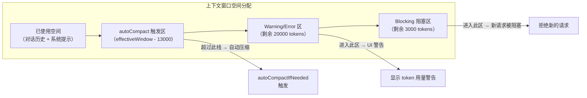
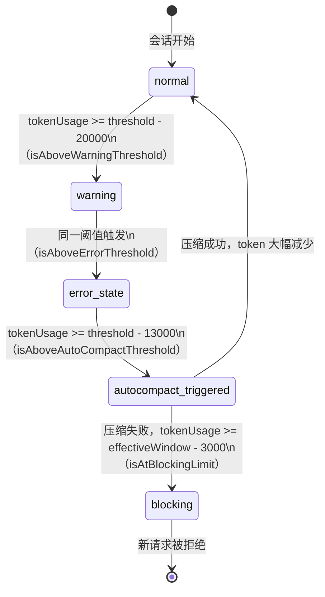
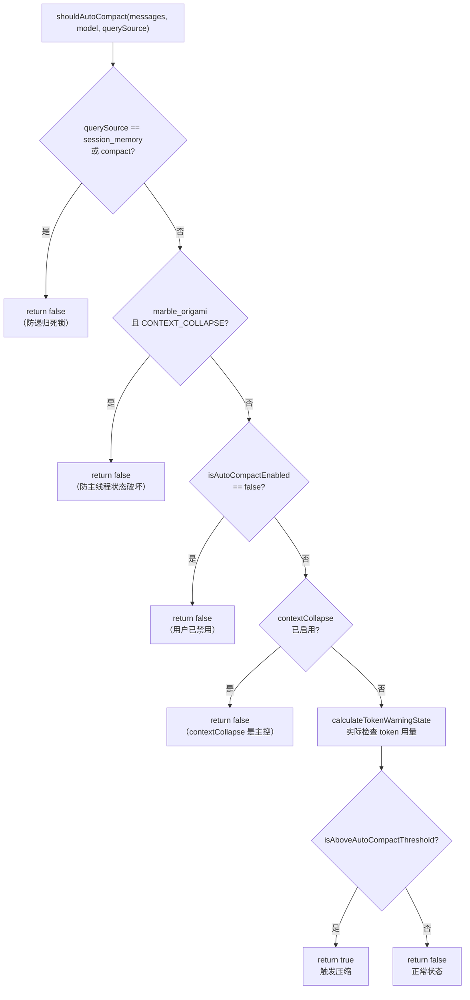
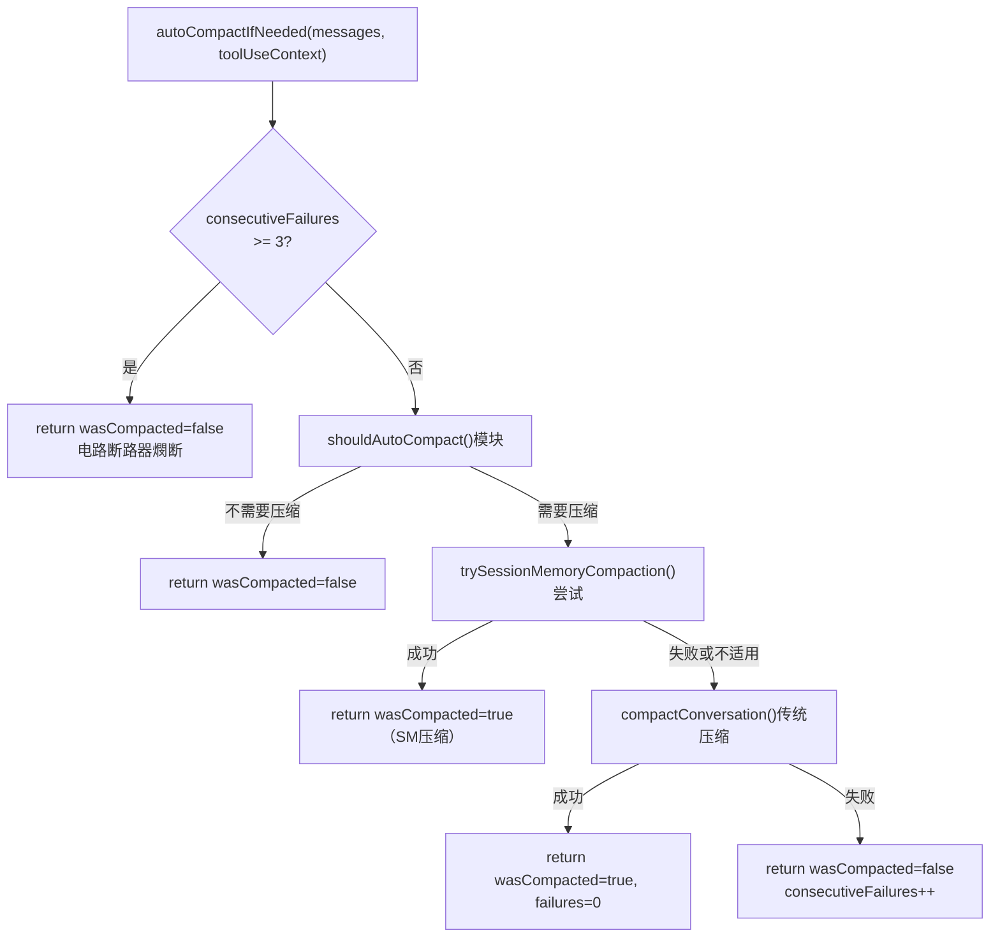
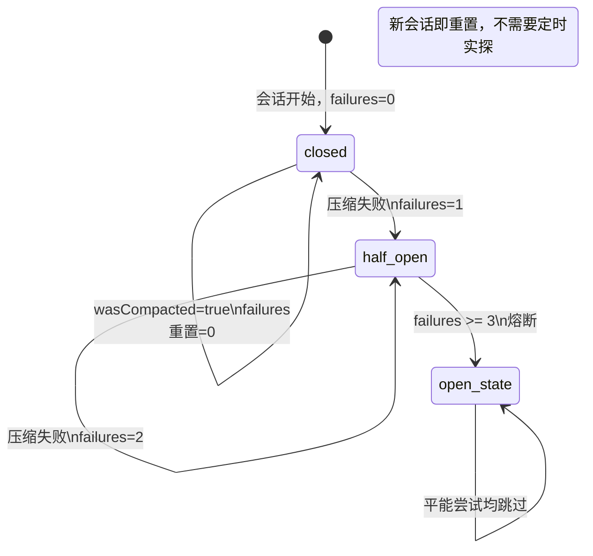

# 第 22 章：AutoCompact 与上下文折叠——窗口压缩的触发机制

> "一个会自己压缩的系统，比一个等待崩溃的系统更有价值。"

---

长对话 Agent 最终会遭遇一个不可回避的物理限制：上下文窗口的容量上限。当用户和 AI 聊了几十轮、工具调用返回了大量结果，总 token 数就会逼近模型能接受的最大值。此时，系统有三种选择：直接截断（破坏上下文连续性）、等待 API 报错（用户体验差）、或在溢出之前主动压缩（保留关键信息）。

Claude Code 选择了第三种，并把触发点定在了一个精确的数字：**剩余 13,000 tokens 时自动压缩**。这就是**自适应上下文压缩**（Adaptive Context Compression）模式——不等溢出，提前在安全缓冲区内完成压缩，用语义摘要替换对话历史，为下一轮工具调用保留足够空间。

读完这章，我们将理解这一模式的完整实现：从精确的阈值计算，到四阶段渐进式监控，再到防止递归死锁的多重 guard，以及生产数据驱动的电路断路器设计。

---

## 问题：上下文窗口是有限资源，触发点需要精确

一个 Agent 对话的 token 消耗有多快？每轮对话约 1,000-5,000 tokens，工具调用的返回结果动辄 10,000 tokens 以上。对于一个 200,000 tokens 上下文窗口的模型，一个中等复杂的代码任务很容易在 20-30 轮内就耗尽 60% 的空间。

问题不在于"会不会溢出"，而在于"在什么时候压缩"。

太早压缩浪费了有效上下文（可以继续对话的空间被白白清空）。太晚压缩则面临两个风险：一是压缩操作本身需要一次 AI 调用，这次调用的结果也需要写入上下文，如果剩余空间不足以容纳压缩结果，就会陷入死锁；二是用户的下一轮工具调用返回了大量数据，而此时剩余 token 空间不足，导致 API 报错。

**13,000 tokens 的缓冲区**回答了"何时压缩"的问题。`src/services/compact/autoCompact.ts:62` 定义了这个数字：

```typescript
// src/services/compact/autoCompact.ts:62-65
export const AUTOCOMPACT_BUFFER_TOKENS = 13_000
export const WARNING_THRESHOLD_BUFFER_TOKENS = 20_000
export const ERROR_THRESHOLD_BUFFER_TOKENS = 20_000
export const MANUAL_COMPACT_BUFFER_TOKENS = 3_000
```

**源码参考：** `src/services/compact/autoCompact.ts:62`

四个常量定义了上下文监控的四个层次：
- `AUTOCOMPACT_BUFFER_TOKENS = 13_000`：自动压缩触发点——剩余 13,000 tokens 时触发
- `WARNING_THRESHOLD_BUFFER_TOKENS = 20_000`：预警界——剩余 20,000 tokens 时显示 UI 警告
- `ERROR_THRESHOLD_BUFFER_TOKENS = 20_000`：告警界——同为 20,000（当前两者阈值一致）
- `MANUAL_COMPACT_BUFFER_TOKENS = 3_000`：阻塞界——剩余 3,000 tokens 时阻止新请求

为什么是 13,000？这是"给工具调用结果预留的安全空间"。工具调用（如读取一个大文件、搜索结果）动辄返回数千 tokens，需要保留足够空间容纳结果，否则工具调用本身就会触发 API 的 `prompt_too_long` 错误。

**图 22-1：上下文窗口容量分区示意**



注意 autoCompact 触发点（13,000 buffer）早于 Blocking 阻塞点（3,000 buffer）——这是设计上的安全裕度：系统先尝试压缩，如果压缩失败了（网络错误、AI 错误），还有 10,000 tokens 的缓冲区可以继续尝试，而不会立即进入阻塞状态。

---

## 源码实例 1：calculateTokenWarningState 的四阶段监控

`calculateTokenWarningState` 是 Claude Code UI 层显示"token 用量进度条"的数据来源，也是触发 autoCompact 的判断核心。它的返回值结构非常紧凑：

阈值计算从 `getAutoCompactThreshold` 开始，它在 `src/services/compact/autoCompact.ts:72` 定义：

```typescript
// src/services/compact/autoCompact.ts:72-89
export function getAutoCompactThreshold(model: string): number {
  const effectiveContextWindow = getEffectiveContextWindowSize(model)

  const autocompactThreshold =
    effectiveContextWindow - AUTOCOMPACT_BUFFER_TOKENS

  // 环境变量覆盖，方便测试 autocompact
  const envPercent = process.env.CLAUDE_AUTOCOMPACT_PCT_OVERRIDE
  if (envPercent) {
    const parsed = parseFloat(envPercent)
    if (!isNaN(parsed) && parsed > 0 && parsed <= 100) {
      const percentageThreshold = Math.floor(
        effectiveContextWindow * (parsed / 100),
      )
      return Math.min(percentageThreshold, autocompactThreshold)
    }
  }

  return autocompactThreshold
}
```

**源码参考：** `src/services/compact/autoCompact.ts:72`

注意 `getEffectiveContextWindowSize`（第 33 行）的计算：它用模型的上下文窗口减去 `reservedTokensForSummary`（压缩结果需要的输出空间）。这意味着 autoCompact 的触发阈值是"真实可用空间 - 13,000"，而不是"总上下文 - 13,000"——对于压缩本身的输出空间已提前预留。

`CLAUDE_AUTOCOMPACT_PCT_OVERRIDE` 环境变量支持按百分比覆盖阈值。这是一个测试钩子——开发者可以设置 `CLAUDE_AUTOCOMPACT_PCT_OVERRIDE=50` 把触发点设为有效窗口的 50%，方便测试压缩流程，而不需要等到真实的 13,000 tokens 剩余。

`calculateTokenWarningState` 本身的逻辑（第 93 行）把这个阈值转化为五个 boolean 状态：

```typescript
// src/services/compact/autoCompact.ts:93-145（简化）
export function calculateTokenWarningState(
  tokenUsage: number,
  model: string,
): {
  percentLeft: number
  isAboveWarningThreshold: boolean    // 剩余 < 20000：UI 预警
  isAboveErrorThreshold: boolean      // 剩余 < 20000：UI 告警（当前同 warning）
  isAboveAutoCompactThreshold: boolean // 剩余 < 13000：触发自动压缩
  isAtBlockingLimit: boolean          // 剩余 < 3000：阻塞新请求
} {
  const autoCompactThreshold = getAutoCompactThreshold(model)
  // 如果 autoCompact 启用，参考点是 autoCompactThreshold；否则用 effectiveWindow
  const threshold = isAutoCompactEnabled()
    ? autoCompactThreshold
    : getEffectiveContextWindowSize(model)

  const percentLeft = Math.max(
    0,
    Math.round(((threshold - tokenUsage) / threshold) * 100),
  )

  const warningThreshold = threshold - WARNING_THRESHOLD_BUFFER_TOKENS
  const errorThreshold = threshold - ERROR_THRESHOLD_BUFFER_TOKENS
  
  const isAboveAutoCompactThreshold =
    isAutoCompactEnabled() && tokenUsage >= autoCompactThreshold
  
  const defaultBlockingLimit = actualContextWindow - MANUAL_COMPACT_BUFFER_TOKENS
  const isAtBlockingLimit = tokenUsage >= blockingLimit

  return { percentLeft, isAboveWarningThreshold, isAboveErrorThreshold,
           isAboveAutoCompactThreshold, isAtBlockingLimit }
}
```

**源码参考：** `src/services/compact/autoCompact.ts:93`

这里有一个设计细节值得注意：`WARNING_THRESHOLD_BUFFER_TOKENS` 和 `ERROR_THRESHOLD_BUFFER_TOKENS` 当前值相同（都是 20,000）。这看起来像是占位符——两个常量分别命名但值相同，说明设计者预留了在未来对两个阈值进行差异化配置的接口，但目前还没有触发差异化的必要（推断）。如果将来要区分"进度条变黄"和"进度条变红"的不同阈值，只需修改 `ERROR_THRESHOLD_BUFFER_TOKENS` 的值，所有相关逻辑自动生效。

`isAboveAutoCompactThreshold` 只在 `isAutoCompactEnabled()` 为 true 时才可能为 true——即使 token 超过阈值，如果 autoCompact 被禁用（通过 `DISABLE_AUTO_COMPACT` 环境变量或 settings 配置），这个 flag 也不会触发。

**图 22-2：四阶段 token 监控的触发界面**



状态机展示了正常路径（压缩成功后回到 normal）和降级路径（压缩失败后滑向 blocking）。13,000 buffer 的设计保证了从"触发压缩"到"进入阻塞"有足够的空间进行失败重试。

---

## 源码实例 2：shouldAutoCompact 的多重 guard

`calculateTokenWarningState` 告诉我们"是否应该压缩"，但实际的决策函数是 `shouldAutoCompact`。这个函数最有趣的部分不是阈值计算，而是它的**五个提前返回路径**。

```typescript
// src/services/compact/autoCompact.ts:160-240（简化，含所有关键注释）
export async function shouldAutoCompact(
  messages: Message[],
  model: string,
  querySource?: QuerySource,
  snipTokensFreed = 0,
): Promise<boolean> {
  
  // 递归防护：session_memory 和 compact 是 forked agents，会形成死锁
  if (querySource === 'session_memory' || querySource === 'compact') {
    return false
  }
  
  // marble_origami 是 ctx-agent——如果它的上下文爆炸并触发 autoCompact，
  // runPostCompactCleanup 会调用 resetContextCollapse()，
  // 这会破坏主线程的已提交日志（跨 fork 共享的模块级状态）
  if (feature('CONTEXT_COLLAPSE')) {
    if (querySource === 'marble_origami') {
      return false
    }
  }

  if (!isAutoCompactEnabled()) {
    return false
  }

  // 响应式模式：不主动压缩，让 API 的 prompt-too-long 触发响应式压缩
  if (feature('REACTIVE_COMPACT')) {
    if (getFeatureValue_CACHED_MAY_BE_STALE('tengu_cobalt_raccoon', false)) {
      return false
    }
  }

  // Context Collapse 模式：autoCompact 在 ~93% 处触发，
  // 但 contextCollapse 在 90% 开始、95% 阻塞。两者会竞争，
  // autoCompact 通常赢，但这会破坏 contextCollapse 正在保存的细粒度上下文。
  if (feature('CONTEXT_COLLAPSE')) {
    const { isContextCollapseEnabled } = require('../contextCollapse/index.js')
    if (isContextCollapseEnabled()) {
      return false
    }
  }

  // 通过所有 guard 后，实际检查 token 使用量
  const { isAboveAutoCompactThreshold } = calculateTokenWarningState(
    tokenCountWithEstimation(messages) - snipTokensFreed,
    model,
  )
  return isAboveAutoCompactThreshold
}
```

**源码参考：** `src/services/compact/autoCompact.ts:160-240`

每一个 guard 都对应一个真实的设计约束。

**Guard 1：session_memory / compact 递归防护**

压缩操作 (`querySource === 'compact'`) 本身需要调用 AI 来生成摘要。如果这次 AI 调用也触发了 autoCompact，就会出现"压缩触发压缩"的无限递归——压缩进程永远不会结束。通过检查 `querySource`，可以识别出"当前请求本身就是压缩操作"，直接返回 false，斩断递归链。

**Guard 2：marble_origami（ctx-agent）防护**

这是一个更微妙的情况。注释解释了危险在哪里：`marble_origami` 是 Context Collapse 功能的代号，它是一个专门处理上下文压缩的 forked agent。如果 marble_origami 自己的上下文超限并触发了 autoCompact，autoCompact 会调用 `runPostCompactCleanup`，后者会调用 `resetContextCollapse()`——而 `contextCollapse` 的状态是模块级变量，被主线程和所有 fork 共享。在 fork 里重置主线程的状态，会导致主线程的已提交压缩日志被清空。

**Guard 3：isAutoCompactEnabled()**

用户可以通过 `DISABLE_AUTO_COMPACT` 环境变量或 settings.json 中的 `autoCompactEnabled: false` 关闭自动压缩，保留手动 `/compact` 命令。这个 guard 确保用户的配置选择被尊重。

**Guard 4：contextCollapse 冲突防护**

注释精确描述了冲突场景：autoCompact 在有效窗口的约 93% 时触发（effectiveWindow - 13000），而 contextCollapse 在 90% 时开始保存细粒度上下文、在 95% 时阻塞新 fork 。两者的触发区间重叠——如果同时激活，autoCompact 通常会抢先执行，但这会清空 contextCollapse 正在精心保存的状态。禁用 autoCompact 让 contextCollapse 作为主要的上下文管理者。

**电路断路器**

通过所有 guard 后，`autoCompactIfNeeded`（第 241 行）还有最后一道防线：

```typescript
// src/services/compact/autoCompact.ts:67-70（BQ 注释 + 常量定义）
// BQ 2026-03-10: 1,279 sessions had 50+ consecutive failures (up to 3,272)
// in a single session, wasting ~250K API calls/day globally.
const MAX_CONSECUTIVE_AUTOCOMPACT_FAILURES = 3

if (
  tracking?.consecutiveFailures !== undefined &&
  tracking.consecutiveFailures >= MAX_CONSECUTIVE_AUTOCOMPACT_FAILURES
) {
  return { wasCompacted: false }
}
```

**源码参考：** `src/services/compact/autoCompact.ts:67`（BQ 注释），`src/services/compact/autoCompact.ts:260`（circuit breaker check）

这段注释引用了一个真实的生产数据（BQ = BigQuery 分析）：1,279 个会话中出现了 50 次以上的连续压缩失败，最高的一个会话连续失败了 3,272 次，每天浪费约 250,000 次 API 调用。这不是理论上的担忧，而是从监控数据中发现并修复的真实 bug。

`MAX_CONSECUTIVE_AUTOCOMPACT_FAILURES = 3` 是一个电路断路器（Circuit Breaker）：如果压缩连续失败超过 3 次，就认为当前会话的上下文已经"不可挽救地超限"（例如单个工具结果就超过了 13,000 tokens），停止重试。后续的 API 请求会因为 `prompt_too_long` 错误而直接失败，用户看到明确的错误信息，而不是系统在后台无限循环。

**图 22-3：shouldAutoCompact 的多重 guard 决策树**



每个 `return false` 都有独立的注释说明原因——这不是"为了安全加了很多 if"，而是每一条路径对应一个已经踩过的坑或真实的生产数据。

---

## 模式剖析：自适应上下文压缩（Adaptive Context Compression） 和递归防护电路断路器（Recursive Guard + Circuit Breaker）

这两个模式联合工作：Adaptive Context Compression 负责在正确的时机触发压缩；Recursive Guard + Circuit Breaker 负责确保这个触发本身不会制造新的问题。

---

**图 22-4：autoCompactIfNeeded 的两条压缩路径**



注意两条压缩路径的设计意图：`trySessionMemoryCompaction` 是实验性功能，优先尝试；失败或不适用时回退到 `compactConversation` 传统压缩路径。成功后重置 `consecutiveFailures = 0`，确保德阶段性恢复后不与当前失败计数叠加。

**图 22-5：电路断路器状态转换**



和传统 Circuit Breaker 模式的1个不同：当前实现没有「半开」状态的自动恢复探测，因为会话级别的超限问题在新会话开始时天然重置。

---

## 适用范围

| 场景 | 适用性 | 理由 | 替代方案 |
|------|--------|------|---------|
| 长对话 Agent（多轮可能超过上下文窗口）| ✓ | autoCompact 自动处理，用户无感知 | 手动 `/compact`（用户容易忘记）|
| 多工具调用（工具结果较长）| ✓ | 13,000 buffer 专为工具结果预留 | 截断工具结果（丢失信息）|
| 需要精确控制触发时机 | ✓（配合环境变量）| `CLAUDE_AUTOCOMPACT_PCT_OVERRIDE` 支持按百分比覆盖 | 硬编码阈值（不可测试）|
| 短对话（<50% 上下文使用）| ✗ | autoCompact 不触发，增加的只有复杂度 | 直接请求 |
| 需要完整保留对话历史 | ✗（谨慎）| 压缩是有损的，语义摘要 ≠ 原文 | 外部记忆存储（详见第 23 章）|
| 与其他上下文管理系统并用 | ✗（互斥）| contextCollapse 等系统启用时，autoCompact 被禁用以避免竞争 | 选择其中一种机制 |
| 高频失败场景（如工具结果超大）| ✗（自动降级）| 3 次失败后电路断路器熔断，后续不再重试 | 缩减工具输出或增大上下文窗口 |

---

## 权衡与局限

**权衡 1：13,000 tokens 缓冲区的选择代价**

13,000 tokens 是"给工具调用结果预留的空间"，但这个数字并非来自形式化的分析，而是基于实践经验的经验值。不同工具的返回结果大小差异极大：一个简单的文件读取可能只有 100 tokens，而一次 web 搜索结果可能有 5,000-10,000 tokens。13,000 覆盖了"几乎所有工具调用都不会超限"的保守估计。

代价是：压缩在 token 还足够使用时就触发了，用户可能感觉"还没讲多少，就被压缩了"。`MANUAL_COMPACT_BUFFER_TOKENS = 3_000` 的阻塞点意味着如果不触发 autoCompact，最多只能在剩余 3,000 tokens 时继续请求——相比 13,000 的触发点，有 10,000 tokens 的"提前量"。

**权衡 2：WARNING 和 ERROR 阈值相同的问题**

`WARNING_THRESHOLD_BUFFER_TOKENS = 20_000` 和 `ERROR_THRESHOLD_BUFFER_TOKENS = 20_000` 当前值相同，导致 UI 层的"警告"和"错误"状态实际上同时出现——不存在"先警告后出错"的渐进过程。这可能是未来的优化方向（推断），但目前这个设计意味着用户看到的两种颜色的提示实际上表达了相同的语义。

**权衡 3：电路断路器的激进截止**

3 次失败后熔断是从 BQ 数据反推的结果——真实数据显示第 3 次失败后继续重试几乎没有成功案例（因为问题通常是单个工具结果超大，不可恢复）。但这也意味着偶发的网络错误（第 1、2 次 API 调用因为网络超时失败，第 3 次本来可以成功）可能会被误判为"不可恢复的超限"，导致电路断路器过早熔断。`consecutiveFailures` 在压缩成功时会重置为 0（`autoCompactIfNeeded` 第 326 行），这减轻了误判的风险，但无法完全消除。

**权衡 4：有损压缩的不可逆性**

压缩是有损操作——AI 生成的语义摘要保留了主要信息，但会丢失细节（如具体的代码行、精确的错误消息）。一旦触发压缩，原始对话历史就不再可用（除非用 `--resume` 从磁盘恢复，详见第 21 章）。这是"节省 token 与保留信息"之间的根本 trade-off，无法完全规避。

---

## 与已知模式的对话

**与 GC（垃圾回收）**：两者都是自动的、后台的资源管理机制——开发者不需要手动触发。差异在于语义：GC 回收的是"不可达对象"（binary decision，要么回收要么不回收），autoCompact 压缩的是"历史对话"（lossy operation，有损压缩，保留语义摘要）。GC 不改变剩余对象的语义，autoCompact 会改变 AI 后续能看到的信息范围。

**与滑动窗口缓冲区**：相同点是"维护固定大小的缓冲区，超出时清理旧数据"。差异在于清理策略：滑动窗口直接丢弃最旧的数据（无损于剩余数据，但旧数据消失无法恢复）；autoCompact 在丢弃旧数据前先生成语义摘要——代价是一次额外的 AI 调用，收益是 AI 保留了"压缩前发生了什么"的语义知识。

**与电路断路器（Circuit Breaker，POSA 模式）**：`MAX_CONSECUTIVE_AUTOCOMPACT_FAILURES = 3` 是经典电路断路器模式的直接应用——在连续失败后停止重试，等待系统恢复。差异在于"恢复"机制：传统电路断路器有"半开"状态（定期探测是否可以重试），Claude Code 的电路断路器没有自动恢复（因为上下文超限是会话级的，新会话自然重置）。

**结论**：Adaptive Context Compression 是"GC 思想"（自动资源管理）和"滑动窗口"（缓冲区管理）在 AI 对话场景的融合，加上了"摘要而非丢弃"的语义保留，以及基于真实生产数据（BQ 分析）标定的电路断路器。

---

## 模式提炼

### 自适应上下文压缩（Adaptive Context Compression）

**解决的问题**：长对话 Agent 的上下文窗口会溢出，等到 API 报错再压缩为时已晚，需要在安全缓冲区内提前触发有损但语义完整的压缩。

**核心做法**：监控 token 使用量，在 `effectiveContextWindow - AUTOCOMPACT_BUFFER_TOKENS (13,000)` 时触发摘要压缩，用 AI 生成的语义摘要替换对话历史，为下一轮工具调用保留空间。

**前置条件**：有可靠的 token 计数方式；压缩 AI 能生成高质量摘要；上下文窗口 > 13,000（几乎所有模型都满足）。

**源码证据**：`src/services/compact/autoCompact.ts:62`（`AUTOCOMPACT_BUFFER_TOKENS = 13_000`），`src/services/compact/autoCompact.ts:72`（`getAutoCompactThreshold`，动态计算有效阈值）

---

### 递归防护电路断路器（Recursive Guard + Circuit Breaker）

**解决的问题**：① 压缩操作本身是 AI 调用，若不防护会引发"压缩触发压缩"的递归死锁；② 上下文不可恢复超限时无效重试会浪费大量 API 配额（BQ 数据：每天浪费约 250,000 次 API 调用）。

**核心做法**：在 token 检查前对特定 `querySource` 早返回 false（防递归）；在 `autoCompactIfNeeded` 层跟踪 `consecutiveFailures`，超过 `MAX_CONSECUTIVE_AUTOCOMPACT_FAILURES (3)` 后熔断，压缩成功则重置计数器。

**前置条件**：调用上下文有可区分的 `querySource` 字段；有可持久化的失败计数跟踪（`AutoCompactTrackingState`）。

**源码证据**：`src/services/compact/autoCompact.ts:171`（`querySource === 'compact'` 递归防护），`src/services/compact/autoCompact.ts:70`（`MAX_CONSECUTIVE_AUTOCOMPACT_FAILURES = 3`，BQ 数据支持）

---

## 你能做什么

- **设置显式的 token 缓冲区常量**（如 `AUTOCOMPACT_BUFFER_TOKENS = 13_000`），而非"接近上限时"。具体数字让 code review 和监控都更精确——"13,000 tokens 留给工具调用结果"比"接近上限"更容易理解和验证。

- **实现四阶段阈值（warning → error → autoCompact → blocking）**，让用户对上下文用量有渐进式的反馈，而非突然中断。四个常量的命名约定（`*_BUFFER_TOKENS`）和返回值中的 `isAbove*` boolean 组合，是这种设计的参考模板。

- **为所有自动触发操作添加 `querySource` 递归防护**。如果一个操作 A 会触发 AI 调用，AI 调用的上下文里又可能触发 A，必须在 A 的入口检查调用来源，防止无限递归。

- **用 BigQuery 或等效监控工具验证电路断路器的参数**。`MAX_CONSECUTIVE_AUTOCOMPACT_FAILURES = 3` 不是拍脑袋的数字，是从"1,279 个会话，最多 3,272 次连续失败"的真实数据中得出的。在确定自己系统的断路器参数前，先收集连续失败分布数据。

- **支持环境变量覆盖压缩阈值**（如 `CLAUDE_AUTOCOMPACT_PCT_OVERRIDE`），方便测试而不需要等待真实的上下文溢出场景。测试钩子和生产行为分离，通过环境变量而非代码分支实现。

- **如果与其他上下文管理系统并用，设计互斥守卫**。autoCompact 与 contextCollapse 的冲突（两者触发区间重叠）需要用 `if (isContextCollapseEnabled()) return false` 解决。任何时候两套资源管理机制并存，都需要明确的主从关系。

- **压缩成功后重置失败计数器**。电路断路器计数是会话级的，压缩成功意味着系统恢复正常，应该立即重置 `consecutiveFailures = 0`，避免偶发失败累积污染后续的判断。

---

AutoCompact 处理的是当前会话内的 token 压缩——"这次对话太长了，压缩一下"。而跨会话的历史保留（之前的对话是如何持久化到磁盘的）是第 21 章的主题。三层记忆架构中的"跨会话提取"（extractMemories）则是一个更高层的系统，负责从历史会话中提炼长期记忆，详见第 23 章。
