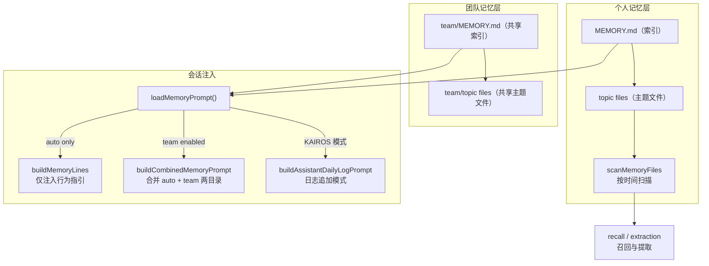
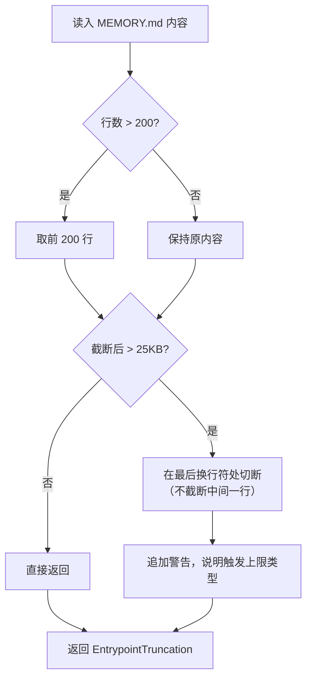
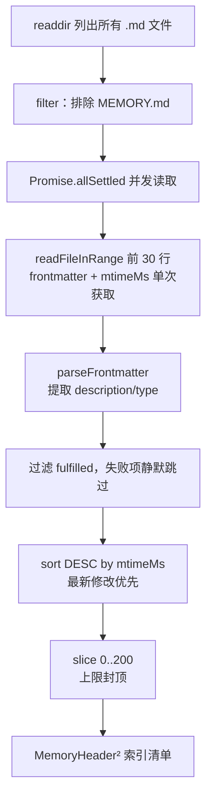
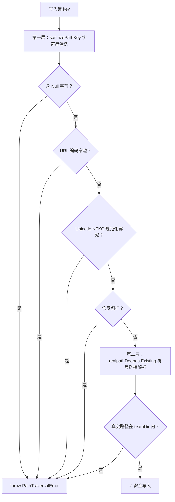
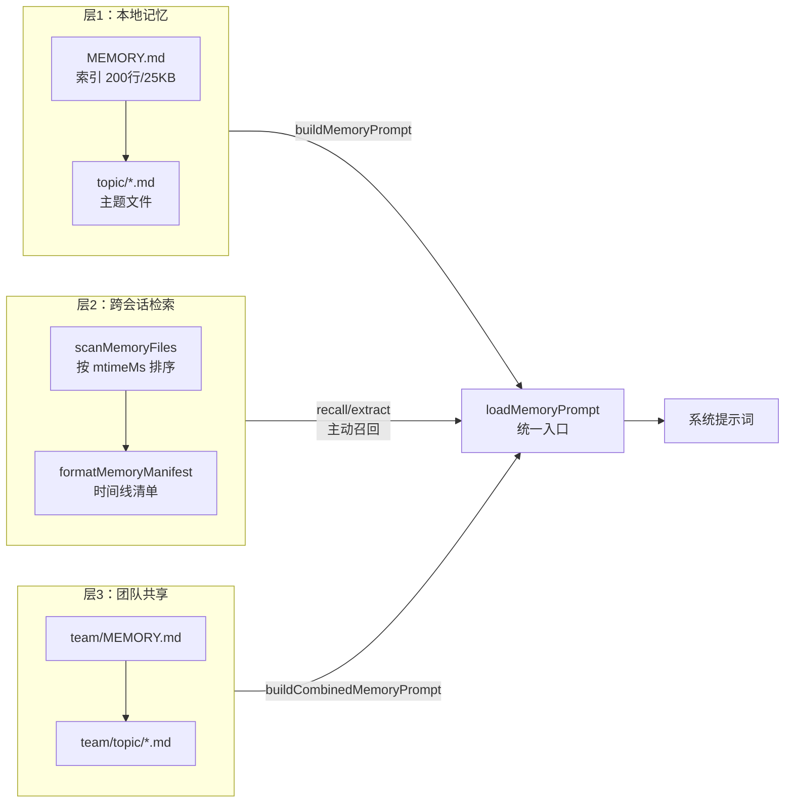

# 第 23 章：记忆系统——本地、跨会话与团队记忆的三层架构

> "记忆的价值不在于存储了多少，而在于边界划得多清晰。"

---

同一份信息，对不同人、不同时间有不同的有效范围：你今天遇到的用户偏好，明天还应该记得；但你私人的工作习惯，不该被团队所有成员共享。当 AI Agent 需要跨越时间和用户边界管理记忆时，一个不加区分的全局存储会同时带来两种风险——个人信息意外泄漏给团队，或是团队知识无法让所有人受益。

Claude Code 的记忆系统用三层架构解决了这个问题：**个人跨会话记忆**（每个用户独享，跨会话持久）、**内容提取扫描**（按时间维度检索历史记忆文件）、**团队共享记忆**（按项目隔离的共享目录）。每层有独立的读写时机、不同的共享范围，层间通过明确的"提炼"操作升级记忆层级。

这一分层设计在代码库中至少出现三处差异化实例——本地记忆的截断保护机制、跨会话记忆的时间维度单遍扫描、团队记忆的多层路径防御机制——足以抽象为一个可复用的**分层记忆架构**（Layered Memory Architecture）模式。读完本章，你将理解为什么范围边界而非内容类型应该成为记忆系统的第一分层维度，以及如何用文件系统路径拓扑替代复杂的权限表实现访问控制。

---

## 问题：记忆的三种时间维度不能混用

当 Agent 被要求"记住用户的偏好"时，到底应该把这条信息存到哪里？

这个问题比看起来复杂。一个用户可能同时在两个项目中使用 Claude Code，两个项目的团队成员不同。如果所有记忆存在一个全局文件里：
- 项目 A 的团队偏好会污染项目 B
- 个人私密记录（如"这个用户不喜欢 verbose 输出"）会被其他团队成员看到
- 长期积累的记忆文件会撑爆每次会话的系统提示词

Agent 记忆有三种根本不同的有效范围：**单用户、跨会话**（只有这个用户需要知道，且跨对话持久）、**团队共享**（同一个项目的所有团队成员共同维护）、以及**当前会话内**（不需要持久化，任务完成即丢弃）。混用这三种范围会同时带来隐私泄漏和信息过载。

源码中最能体现这一设计意图的是 `isTeamMemoryEnabled()` 的实现。团队记忆启用的前提条件是自动记忆（auto memory）已启用（`src/memdir/teamMemPaths.ts:73`）：

```typescript
// src/memdir/teamMemPaths.ts:73-78
export function isTeamMemoryEnabled(): boolean {
  if (!isAutoMemoryEnabled()) {
    return false
  }
  return getFeatureValue_CACHED_MAY_BE_STALE('tengu_herring_clock', false)
}
```

**源码参考：** `src/memdir/teamMemPaths.ts:73`

这个函数的逻辑揭示了一个架构约束：**团队记忆是个人记忆的子集，不能独立存在**。原因是团队记忆目录（`team/`）位于个人记忆目录下，两者共享同一个根路径。如果个人记忆被禁用，团队记忆所需的父目录都不存在，强制分开会引入不一致性。

**图 23-1：三层记忆架构的范围与数据流**



这张图展示了三层记忆在运行时的协作方式：`loadMemoryPrompt()` 是统一入口，根据启用状态选择注入策略；`scanMemoryFiles` 则独立于注入路径，专门服务于"检索过往记忆"的召回场景。

---

## 源码实例 1：本地记忆——buildMemoryPrompt 的注入与截断

个人记忆的核心数据结构是一个文件系统目录。`MEMORY.md` 是**索引文件**，存储指向各主题文件的一行指针；具体的记忆内容分散在各主题文件（如 `user_role.md`、`feedback_testing.md`）中。这种设计使索引保持简短，避免一次性把所有记忆细节全部注入系统提示词。

`buildMemoryPrompt` 是将这个目录"翻译"成 AI 可理解的提示词的核心函数。我们来看它的关键路径：

```typescript
// src/memdir/memdir.ts:272-315（简化）
export function buildMemoryPrompt(params: {
  displayName: string
  memoryDir: string
  extraGuidelines?: string[]
}): string {
  const { displayName, memoryDir, extraGuidelines } = params
  const fs = getFsImplementation()
  const entrypoint = memoryDir + ENTRYPOINT_NAME  // MEMORY.md

  // 目录创建是调用方的职责（loadMemoryPrompt / loadAgentMemoryPrompt）。
  // Builder 只读，不创建目录。

  // 同步读取 MEMORY.md（提示词构建是同步的）
  let entrypointContent = ''
  try {
    entrypointContent = fs.readFileSync(entrypoint, { encoding: 'utf-8' })
  } catch {
    // 文件不存在时跳过
  }

  const lines = buildMemoryLines(displayName, memoryDir, extraGuidelines)

  if (entrypointContent.trim()) {
    const t = truncateEntrypointContent(entrypointContent)
    // ...记录 analytics 指标
    lines.push(`## ${ENTRYPOINT_NAME}`, '', t.content)
  } else {
    lines.push(
      `## ${ENTRYPOINT_NAME}`,
      '',
      `Your ${ENTRYPOINT_NAME} is currently empty. When you save new memories, they will appear here.`,
    )
  }

  return lines.join('\n')
}
```

**源码参考：** `src/memdir/memdir.ts:272`

注意三个设计细节：

**第一，同步读取**。`fs.readFileSync` 在提示词构建路径上是刻意的选择，因为系统提示词的组装是同步的（`buildMemoryPrompt` 不返回 Promise）。这避免了并发读取引入的竞争状态，代价是如果 MEMORY.md 极大，读取会阻塞主线程——这也是下面截断保护存在的理由。

**第二，只读不创建**。注释中明确说明"目录创建是调用方的职责"。`ensureMemoryDirExists`（`src/memdir/memdir.ts:129`）是单独的幂等函数，由 `loadMemoryPrompt` 在调用 builder 之前执行。这种分离使 builder 函数可复用且无副作用。

**第三，截断保护**。`truncateEntrypointContent` 为 MEMORY.md 设置了两个独立的上限：

```typescript
// src/memdir/memdir.ts:57-100（简化）
export const MAX_ENTRYPOINT_LINES = 200
export const MAX_ENTRYPOINT_BYTES = 25_000

export function truncateEntrypointContent(raw: string): EntrypointTruncation {
  const wasLineTruncated = lineCount > MAX_ENTRYPOINT_LINES
  // 检查原始字节数——长行是字节上限要防护的失效场景，
  // 所以在行截断后再算字节数会低估警告的必要性
  const wasByteTruncated = byteCount > MAX_ENTRYPOINT_BYTES

  // 先行截断（自然边界），再字节截断（切在最后一个换行符处）
  let truncated = wasLineTruncated
    ? contentLines.slice(0, MAX_ENTRYPOINT_LINES).join('\n')
    : trimmed

  if (truncated.length > MAX_ENTRYPOINT_BYTES) {
    const cutAt = truncated.lastIndexOf('\n', MAX_ENTRYPOINT_BYTES)
    truncated = truncated.slice(0, cutAt > 0 ? cutAt : MAX_ENTRYPOINT_BYTES)
  }
  // 追加警告，说明触发了哪个上限...
}
```

**源码参考：** `src/memdir/memdir.ts:57`

为什么需要两个上限？代码注释揭示了设计动机："长行是字节上限要防护的失效场景"（`long lines are the failure mode the byte cap targets`）。如果只有行数上限（200 行），但每行有 1,000 个字符，200 行依然可以超过 200KB，触爆系统提示词的 token 预算。两个上限分别防护"行数过多"和"单行过长"两种极端情况。

截断后附加的警告信息同样被精心设计：它会告知 AI 触发了哪个上限（行数还是字节数），并建议"保持每条索引在一行 ~200 字符以内，细节移入主题文件"——这实际上是在提示词中内嵌了架构规范，让 AI 自行维护索引格式。

**图 23-2：截断保护的双上限机制**



注意截断时切在最后一个换行符（`lastIndexOf('\n', MAX_ENTRYPOINT_BYTES)`），而不是直接用字节数做硬切——这避免了在 UTF-8 多字节字符中间切断，也保证了返回的内容始终是完整的行。

---

## 源码实例 2：跨会话记忆——scanMemoryFiles 的时间维度检索

跨会话记忆要解决的问题不同于本地记忆的「注入什么」：**当 Agent 需要从历史记忆文件中召回相关内容时，如何高效地扫描目录、建立时间维度的索引，同时避免冗余 I/O？**

`scanMemoryFiles` 是跨会话记忆层的核心原语。它不做内容判断，只做结构提取——从所有主题文件的 frontmatter 中读取元数据，返回按修改时间排序的索引清单：

```typescript
// src/memdir/memoryScan.ts:35-78（简化）
export async function scanMemoryFiles(
  memoryDir: string,
  signal: AbortSignal,
): Promise<MemoryHeader[]> {
  try {
    const entries = await readdir(memoryDir, { recursive: true })
    const mdFiles = entries.filter(
      f => f.endsWith('.md') && basename(f) !== 'MEMORY.md',
      // 排除索引文件自身——只扫描主题文件
    )

    const headerResults = await Promise.allSettled(
      mdFiles.map(async (relativePath): Promise<MemoryHeader> => {
        const filePath = join(memoryDir, relativePath)
        const { content, mtimeMs } = await readFileInRange(
          filePath,
          0,
          FRONTMATTER_MAX_LINES,  // 只读前 30 行——frontmatter 之外的内容无需读取
          undefined,
          signal,
        )
        const { frontmatter } = parseFrontmatter(content, filePath)
        return {
          filename: relativePath,
          filePath,
          mtimeMs,              // 来自 readFileInRange 内部的 stat 调用
          description: frontmatter.description || null,
          type: parseMemoryType(frontmatter.type),
        }
      }),
    )

    return headerResults
      .filter((r): r is PromiseFulfilledResult<MemoryHeader> => r.status === 'fulfilled')
      .map(r => r.value)
      .sort((a, b) => b.mtimeMs - a.mtimeMs)   // 最新优先
      .slice(0, MAX_MEMORY_FILES)               // 上限 200
  } catch {
    return []  // 目录不存在时静默返回空列表
  }
}
```

**源码参考：** `src/memdir/memoryScan.ts:35`

注意三个设计决策：

**第一，时间作为第一排序维度**。主题文件按 `mtimeMs`（修改时间）降序排列，最近修改的文件排在前面。这意味着「最近更新的记忆最先被 Agent 看到」——对于跨会话场景，时间新鲜度比内容相关度更易于无状态计算，无需嵌入式向量检索。`mtimeMs` 由 `readFileInRange` 内部的 `stat` 调用返回，**单次 I/O 同时获取内容和时间戳**，避免了「先 stat 再 read」的两轮系统调用。

**第二，单遍扫描（Single-Pass）设计**。源码注释明确说明设计意图（`src/memdir/memoryScan.ts:27`）：「单遍：readFileInRange 内部统计并返回 mtimeMs，所以我们先读后排序，而非先 stat 排序再读。对于常见情况（N ≤ 200）这将系统调用减半；对于大 N 我们多读了几个小文件，但仍然避免了对最终保留的 200 个文件的双重 stat」。上限常量 `MAX_MEMORY_FILES = 200` 与 MEMORY.md 的行数上限（200 行）对称，共同保证了注入规模的可预期性。

**第三，只读 frontmatter 前 30 行**。`FRONTMATTER_MAX_LINES = 30` 使扫描对大型主题文件依然高效——每个文件只读 frontmatter 部分（`description`、`type` 字段），不读正文。这使 `scanMemoryFiles` 可以并发扫描数百个文件而不产生大量内存压力。

扫描结果通过 `formatMemoryManifest` 格式化为可注入提示词的文本清单：

```typescript
// src/memdir/memoryScan.ts:84-93
export function formatMemoryManifest(memories: MemoryHeader[]): string {
  return memories
    .map(m => {
      const tag = m.type ? `[${m.type}] ` : ''
      const ts = new Date(m.mtimeMs).toISOString()
      return m.description
        ? `- ${tag}${m.filename} (${ts}): ${m.description}`
        : `- ${tag}${m.filename} (${ts})`
    })
    .join('\n')
}
```

**源码参考：** `src/memdir/memoryScan.ts:84`

`formatMemoryManifest` 的输出格式（`[type] filename (timestamp): description`）是在提示词中内嵌时间线索的关键。Agent 拿到这份清单后，可以通过时间戳判断哪些记忆「足够新鲜」值得深入阅读，而不需要将所有主题文件内容全部注入。**目录扫描 + 格式化清单**是跨会话层与本地记忆层的核心差异：前者服务于「找到相关记忆文件」的召回场景，后者服务于「把记忆内容注入提示词」的注入场景。

**图 23-3：scanMemoryFiles 单遍扫描流程**



`readFileInRange` 在读取内容的同时返回 `mtimeMs`——排序所需的时间戳与内容读取合并为单次系统调用，这是「单遍」设计的核心：不需要先 `stat` 再 `read` 两轮 I/O。

---

## 源码实例 3：团队记忆——路径隔离与安全防御

团队记忆要解决一个根本问题：如何让同一个项目的所有 Claude Code 用户共享一套记忆，同时确保不同项目的团队互相隔离，并防止恶意路径逃逸到记忆目录外？

`getTeamMemPath()` 的实现是路径隔离策略的核心：

```typescript
// src/memdir/teamMemPaths.ts:84-88
export function getTeamMemPath(): string {
  return (join(getAutoMemPath(), 'team') + sep).normalize('NFC')
}
```

**源码参考：** `src/memdir/teamMemPaths.ts:84`

这个看起来简单的函数背后有几层设计：
- **以 `getAutoMemPath()` 为根**：auto memory 的路径已经包含了"当前项目的唯一哈希"，不同项目的 auto memory 目录不同，因此团队记忆目录自然也被项目隔离
- **尾部追加路径分隔符 `sep`**：确保后续的 `startsWith(teamDir)` 检查不会被前缀攻击绕过（`/team-evil` 不会匹配 `/team/`）
- **`normalize('NFC')`**：统一 Unicode 规范形式，防止同一路径因不同 Unicode 规范化方式产生多个字符串表示

团队记忆写入时还需要一道更严格的安全验证。`sanitizePathKey()` 在 `validateTeamMemKey` 中被调用，拦截所有已知的路径注入向量：

```typescript
// src/memdir/teamMemPaths.ts:22-62（简化）
function sanitizePathKey(key: string): string {
  // Null 字节可以截断 C 语言系统调用中的路径
  if (key.includes('\0')) {
    throw new PathTraversalError(`Null byte in path key: "${key}"`)
  }
  // URL 编码穿越（%2e%2e%2f = ../）
  let decoded: string
  try {
    decoded = decodeURIComponent(key)
  } catch {
    decoded = key
  }
  if (decoded !== key && (decoded.includes('..') || decoded.includes('/'))) {
    throw new PathTraversalError(`URL-encoded traversal in path key: "${key}"`)
  }
  // Unicode 规范化攻击：全角字符 ．．／（U+FF0E U+FF0F）在 NFKC 下规范化为 ../
  const normalized = key.normalize('NFKC')
  if (normalized !== key && (normalized.includes('..') || ...)) {
    throw new PathTraversalError(`Unicode-normalized traversal in path key: "${key}"`)
  }
  // 拒绝反斜杠（Windows 路径分隔符作为穿越向量）
  if (key.includes('\\')) {
    throw new PathTraversalError(`Backslash in path key: "${key}"`)
  }
  return key
}
```

**源码参考：** `src/memdir/teamMemPaths.ts:22`

这段代码显示了一个设计意图：安全验证不是单一的，而是**防御纵深**（Defense in Depth）。`sanitizePathKey` 拦截的是字符串层面的攻击向量；`validateTeamMemWritePath` 还会在此之后通过 `realpathDeepestExisting` 解析符号链接，防止攻击者预置一个指向 `~/.ssh/authorized_keys` 的软链接。字符串检查和文件系统级检查是两道相互补充的防线。

**图 23-4：团队记忆写入路径的多层防御机制**



两层防御针对不同攻击面：第一层拦截字符串形式的编码混淆攻击（URL 编码、Unicode 变体、特殊字节）；第二层拦截看起来合法但实际指向目录外的符号链接。字符串层无法检测真实链接目标，文件系统层无法检测编码混淆——两层缺一不可。

`PathTraversalError`（`src/memdir/teamMemPaths.ts:10`）是专用错误类型，继承自 `Error` 但有独立的 `name` 属性，让调用方可以精确捕获路径穿越错误，而不是用宽泛的 `catch(e)` 吞掉所有异常。

当团队记忆启用时，`buildCombinedMemoryPrompt`（`src/memdir/teamMemPrompts.ts:22`）会将两个目录合并成一份提示词：

```typescript
// src/memdir/teamMemPrompts.ts:22-30（简化）
export function buildCombinedMemoryPrompt(
  extraGuidelines?: string[],
  skipIndex = false,
): string {
  const autoDir = getAutoMemPath()
  const teamDir = getTeamMemPath()

  const lines = [
    '# Memory',
    '',
    // "两个目录都已存在——直接用 Write 工具写入（无需 mkdir 或检查是否存在）"
    `You have a persistent, file-based memory system with two directories: ` +
    `a private directory at \`${autoDir}\` and a shared team directory at \`${teamDir}\`. ${DIRS_EXIST_GUIDANCE}`,
    '',
    // ...两层记忆的范围说明、类型分类、写入指引...
  ]

  return lines.join('\n')
}
```

**源码参考：** `src/memdir/teamMemPrompts.ts:22`

合并提示词中的关键设计是**通过文字明确范围语义**：提示词中用 `private` 和 `team` 两个词清晰区分存储位置，并在各类型的记忆条目中内嵌 `scope` 指引——让 AI 在保存记忆时自行判断应该写入哪个目录，而不是通过代码逻辑强制分配。这种"在文本层面定义范围"的方式依赖 AI 的理解能力，但换来了极高的灵活性：新增记忆类型时不需要修改任何分发逻辑。

---

## 模式剖析：分层记忆架构的四个组成部分

从上述三个实例中，可以提炼出**分层记忆架构**模式的四个核心组成部分：

**1. 范围隔离（Scope Isolation）**：每层记忆有独立的文件系统路径，层与层之间不共享目录。个人记忆（`autoDir`）和团队记忆（`teamDir`）是独立的目录树，且后者依赖前者的路径前缀——这保证了项目级别的隔离天然成立。

**2. 幂等初始化（Idempotent Initialization）**：`ensureMemoryDirExists`（`src/memdir/memdir.ts:129`）在每次会话开始时调用，但不会因目录已存在而失败（吞掉 `EEXIST`）。系统无需维护"目录是否已创建"的状态，任何时刻都可以安全地重复调用，简化了初始化逻辑。

**3. 双上限截断（Dual-Cap Truncation）**：索引文件（MEMORY.md）同时受行数（200 行）和字节数（25,000 字节）两个上限约束。两个上限防护不同的极端情况，且截断策略尊重行边界（切在换行符处），避免截断损坏结构化内容。

**4. 多层路径防御（Multi-Layer Path Defense）**：团队记忆的写入路径经过字符串层清洗（`sanitizePathKey`）+ 文件系统层符号链接解析（`realpathDeepestExisting`）的双重验证。每一层防御都只针对自己能可靠检测的攻击向量，两层互补而非重复。

**图 23-5：分层记忆三层协作全景**



三层的协作入口是 `loadMemoryPrompt()`：它根据启用状态决定走哪条路径——仅 auto memory 时只注入层1，team memory 启用时合并层1+层3，KAIROS 模式下改用日志追加路径。层2（`scanMemoryFiles`）独立于注入路径，专门服务于「查找历史记忆」的主动召回场景，不在每次会话启动时自动触发。

---

## 适用范围

| 场景 | 适用性 | 理由 | 替代方案 |
|------|--------|------|---------|
| 单用户、多会话 Agent | ✓ | 跨会话积累个人偏好，且有截断保护防止溢出 | 每次重置（无记忆开销，但无学习积累） |
| 团队共享 AI 项目知识 | ✓ | 团队记忆层按项目隔离，个人隐私保留在独立目录 | 共享 CLAUDE.md（静态，无法自动更新） |
| 需要实时语义检索历史 | ✗ | `scanMemoryFiles` 是按时间排序的文件扫描，不是语义检索 | 向量数据库（支持相似度搜索） |
| 高频写入（每秒多次） | ✗ | 同步文件读取不适合高并发写入场景 | Redis / 内存缓存 |
| 短任务、无需持久记忆 | ✗ | 文件 I/O 增加延迟，MEMORY.md 注入额外消耗 token | 无记忆模式（禁用 auto memory） |
| 跨项目共享团队知识 | ✗ | 团队记忆目录以 `getAutoMemPath()`（含项目哈希）为根，天然跨项目隔离 | 全局共享文件（需手动管理） |

---

## 权衡与局限

**权衡 1：同步读取与性能**

`buildMemoryPrompt` 用 `readFileSync` 同步读取 MEMORY.md（`src/memdir/memdir.ts:289`）。在提示词构建是同步路径的前提下，这是一个合理的选择——但如果 MEMORY.md 体积异常大（如用户绕过了截断机制直接写入大量内容），读取会阻塞主线程。双上限截断只保护**运行时注入**，不保护**磁盘文件的写入大小**——用户仍然可以手动写入超大的 MEMORY.md，只是超过上限的部分会在下次会话时被截断注入。

**权衡 2：团队记忆的"最终一致性"**

团队记忆依赖文件系统共享（`team/` 目录），多个用户同时写入时没有分布式锁。源码中的 `validateTeamMemWritePath` 和 `validateTeamMemKey` 只保护路径安全，不保证并发写入的一致性（推断）。这意味着在高并发的团队协作场景下，可能出现最后写入者覆盖先前写入的情况。当前实现假设团队成员写入记忆的频率相对低，冲突概率可接受。

**权衡 3：文本范围约定 vs. 强制执行**

团队记忆和个人记忆的分类（哪些信息存私有、哪些存共享）完全依赖提示词中的文字说明，而非代码强制。如果 AI 产生幻觉，把应该存私有的敏感信息写入了 `team/` 目录，系统不会阻止。这是"在提示词层面定义语义"策略的固有局限——灵活性和可靠性之间的取舍。

**权衡 4：`sanitizePathKey` 的防御纵深代价**

多层安全检查（字符串清洗 + 符号链接解析）在每次写入时都会触发。对于"写入记忆"这种低频操作，额外的检查开销可以忽略不计（< 1ms）。但如果系统演进为高频写入场景，需要重新评估是否可以缓存中间的路径验证结果。

---

## 与已知模式的对话

**与分级存储（L1/L2/L3 缓存）**：分级存储按速度分层（L1 最快 / L3 最慢），每层只是速度不同，语义相同——任何数据都可以从 L1 提升到 L3。分层记忆架构按**共享范围**分层（个人 / 团队），而非速度——一条记忆被存储在哪层反映的是"谁有权读它"，而不是"访问它有多快"。层间的"提炼"操作也是单向的（从临时信息升级为持久记忆），而非缓存的双向提升/驱逐。

**与 RBAC（基于角色的访问控制）**：RBAC 通过用户角色控制对资源的读写权限，是运行时的动态控制。分层记忆架构通过**目录路径**区分范围，是静态的拓扑控制——`team/` 目录内的所有文件天然是团队共享的，无需查询权限表。这使访问控制更简单，但也更粗粒度（无法在团队记忆目录内再细分"只有某人可写"的权限）。

**与事件溯源（Event Sourcing，EIP 模式）**：KAIROS 模式下（`buildAssistantDailyLogPrompt`），Claude Code 使用 append-only 的每日日志文件，由夜间流程（/dream skill）提炼成 MEMORY.md 索引——这与事件溯源的"日志即真相"思想高度吻合。差异在于：标准事件溯源从不修改历史事件，当前状态总是从事件流重放；Claude Code 的提炼操作会将日志"折叠"成摘要索引，是有损的、不可逆的聚合，而非完整重放。非 KAIROS 模式下，系统直接维护 MEMORY.md 索引，更接近传统的可变状态存储。两种模式共存，通过构建时特性开关（`feature('KAIROS')`）切换。

---

## 模式提炼

### 分层记忆架构（Layered Memory Architecture）

**解决的问题**：Agent 需要在不同共享范围上管理持久记忆，混用会导致个人信息泄漏或信息过载。

**核心做法**：按共享范围划分独立目录（个人 / 团队），团队目录作为个人目录的子目录（继承项目隔离），通过双上限截断保护注入安全，通过多层路径验证防止越权访问。

**前置条件**：有明确的共享范围语义（谁能读写哪层）；记忆写入频率较低（同步读取模型可接受）；层间边界可以通过文件系统路径表达。

**源码证据**：`src/memdir/teamMemPaths.ts:84`（`getTeamMemPath`，团队目录以个人目录为根，继承项目隔离）；`src/memdir/memdir.ts:272`（`buildMemoryPrompt`，同步读取 + 截断注入到提示词）

---

### 幂等目录初始化（Idempotent Directory Bootstrap）

**解决的问题**：系统启动时需要确保记忆目录存在，但不应因"目录已存在"而报错或需要维护额外状态。

**核心做法**：`ensureMemoryDirExists` 调用 `fs.mkdir`（支持 recursive），捕获所有返回错误，只在 debug 日志中记录真实错误（权限不足等），不向上层抛出异常。目录存在是期望状态，目录不存在才是需要处理的情况，而非相反。

**前置条件**：底层 `mkdir` 实现能区分 EEXIST（目录已存在，正常）和其他错误（权限等，需记录）。

**源码证据**：`src/memdir/memdir.ts:129`（`ensureMemoryDirExists`，吞掉 EEXIST，记录真实错误到 debug 日志）

---

## 你能做什么

- **按共享范围而非内容类型划分记忆层级**。不要用"重要 vs 不重要"区分存储层，而是用"谁有权看"来决定存到哪层。记忆的价值在于共享范围边界清晰，而非存储层次。

- **为记忆索引文件设置双上限（行数 + 字节数）**。行数上限防止"条目过多"，字节数上限防止"单条过长"——两种极端都可能导致上下文溢出，需要分别防护。截断时切在行边界（`lastIndexOf('\n', limit)`），避免损坏结构化内容。

- **将目录创建（`ensureDir`）与内容读取（`builder`）分离**。Builder 函数只读，不创建目录；调用方在调用 Builder 之前先调用 `ensureDir`。这使 Builder 无副作用、可复用，目录初始化责任链清晰。

- **用路径结构而非权限表实现共享范围控制**。`team/` 子目录天然表达"团队共享"语义，无需查询权限表。简单拓扑控制在低频写入场景下足够，且易于理解和审计。

- **为路径写入实现多层防御纵深**：字符串层清洗（拒绝 `null` 字节、URL 编码穿越、Unicode 规范化攻击、反斜杠）+ 文件系统层符号链接解析（`realpath` 验证真实路径在目录内）。两层各拦截不同向量，互不重复。

- **为安全边界使用专用错误类型**（如 `PathTraversalError`）。继承自 `Error` 但有独立 `name`，让调用方可以精确区分"路径越权"和"IO 错误"，分别处理而不是用宽泛的 catch 吞掉。

- **在提示词中内嵌记忆格式规范**。截断警告信息（"保持每条索引在一行 ~200 字符以内"）内嵌在提示词内容中，让 AI 自行维护格式约束，而不需要额外的验证逻辑。

---

本章的记忆系统关注的是"如何把信息持久化到文件系统，跨会话注入到提示词"。下一章我们将目光移向会话内的另一套机制——Agent 的 Hooks 系统：27 个生命周期事件如何让外部代码在精确的时间点介入 Agent 的执行流程，详见第 24 章。
