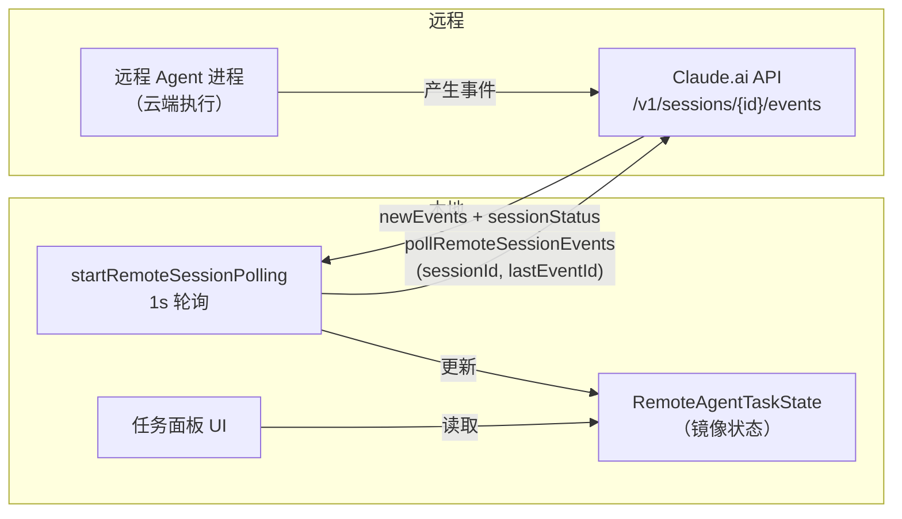

# 第 27 章：RemoteAgentTask——远程任务的通信架构

> "不透明的远端不需要透明的协议，只需要足够可靠的探针。"

---

本地运行的 Agent 任务（第 26 章的 LocalAgentTask）和远程运行的 Agent 任务从 UI 角度看起来完全一样——都显示在任务面板里，都有进度更新，都在完成时通知用户。但底层实现截然不同：本地任务通过 React 状态直接驱动，远程任务需要定期向云端服务器"探针"——用轮询同步一份本地镜像状态。

Claude Code 支持五种远程任务类型（`remote-agent`、`ultraplan`、`ultrareview`、`autofix-pr`、`background-pr`），每种类型有不同的完成判断逻辑，但都通过同一套**远程任务代理**（Remote Task Proxy）机制管理：本地维护 `RemoteAgentTaskState` 镜像状态，每秒轮询一次远程事件，通过可插拔的完成检查器判断任务结束。

本章揭示这套机制的三个关键设计：`pollStartedAt`（防止恢复时误判超时）、`STABLE_IDLE_POLLS`（防止瞬时 idle 触发假完成）、以及可插拔的 `RemoteTaskCompletionChecker`（让五种任务类型共享同一个轮询框架）。

---

## 问题：远程任务状态同步的三个挑战

把一个 AI 任务托管在云端服务器上，带来了三个本地任务没有的挑战：

**不透明性**：远程服务器的内部状态对本地完全不可见。本地只能通过 API 查询"截止现在发生了什么"，而无法直接访问远程进程的消息历史、工具调用栈或 token 计数。

**网络不可靠性**：任何一次 API 调用都可能因为网络超时而失败。如果用轮询，失败了重试即可；如果用长连接（WebSocket/SSE），断开后需要重新建立连接并恢复状态，复杂度高得多。

**超时语义的歧义**：任务在远端创建后，本地 UI 可能关闭然后重新打开（`--resume`）。如果超时是从任务创建时开始计算，一个 30 分钟前创建的任务在恢复后会立刻超时——即使它还在正常运行。

`RemoteAgentTaskState` 的字段设计直接回答了这三个挑战。状态定义在 `src/tasks/RemoteAgentTask/RemoteAgentTask.tsx:22`：

```typescript
// src/tasks/RemoteAgentTask/RemoteAgentTask.tsx:22-57（简化）
export type RemoteAgentTaskState = TaskStateBase & {
  type: 'remote_agent'
  remoteTaskType: RemoteTaskType       // 5种类型之一
  sessionId: string                    // 远程会话 ID，API 调用的唯一标识
  command: string
  title: string
  todoList: TodoList                   // 从远端解析的任务清单
  log: SDKMessage[]                    // 累积的远端事件日志
  isLongRunning?: boolean              // 不在第一次 result 后就标记完成
  // 本地轮询器开始监控此任务的时间（在 spawn 或 restore 时）
  // 超时从这里计算，防止恢复后立即误判超时
  pollStartedAt: number
  ultraplanPhase?: UltraplanPhase      // 扫描器推导的 pill 状态
  reviewProgress?: { ... }            // 从远程心跳中解析的审查进度
}
```

**源码参考：** `src/tasks/RemoteAgentTask/RemoteAgentTask.tsx:22`

`sessionId` 是远程通信的关键：所有的 API 调用（查询事件、归档会话）都以 `sessionId` 为标识。本地的 `taskId` 和远程的 `sessionId` 是两个不同的标识符——前者在本地 AppState 中唯一，后者是云端服务器上的会话 ID。

`pollStartedAt`（第 41 行）的注释直接说明了设计动机：

> "Review timeout clocks from here so a restore doesn't immediately time out a task spawned >30min ago"
> （超时从这里计算，这样恢复一个 30 分钟前创建的任务时不会立即超时）

这解决了超时语义的歧义：超时不是从"任务在远端创建"开始计算，而是从"本地开始轮询"开始计算。重新打开 UI 并恢复任务时，`pollStartedAt` 被重置为 `Date.now()`，超时窗口从头开始。

**图 27-1：RemoteAgentTask 通信架构**



本地从不直接与远程 Agent 进程通信，只通过 API 拉取事件。`lastEventId` 是增量游标——每次轮询只拉取上次拉取之后的新事件，不重复传输已知的历史。

---

## 源码实例 1：五种远程任务类型与可插拔完成检查器

五种远程任务类型以字符串字面量联合定义（`src/tasks/RemoteAgentTask/RemoteAgentTask.tsx:60`）：

```typescript
// src/tasks/RemoteAgentTask/RemoteAgentTask.tsx:60-63
const REMOTE_TASK_TYPES = [
  'remote-agent', 'ultraplan', 'ultrareview', 'autofix-pr', 'background-pr'
] as const
export type RemoteTaskType = (typeof REMOTE_TASK_TYPES)[number]
```

**源码参考：** `src/tasks/RemoteAgentTask/RemoteAgentTask.tsx:60`

五种类型的完成条件各不相同：`remote-agent` 在远程会话归档时完成；`ultraplan` 在 ExitPlanMode 扫描器检测到计划就绪时完成；`autofix-pr` 在 PR 状态 API 返回特定结果时完成。统一的轮询框架如何支持这些差异化的完成逻辑？

答案是**可插拔的完成检查器**（`RemoteTaskCompletionChecker`，第 73 行）：

```typescript
// src/tasks/RemoteAgentTask/RemoteAgentTask.tsx:73-84
/**
 * 每次轮询时对匹配 remoteTaskType 的任务调用。
 * 返回非 null 字符串表示任务完成（字符串成为通知文本），
 * 返回 null 表示继续轮询。
 * 调用外部 API 的检查器应自我限速。
 */
export type RemoteTaskCompletionChecker = (
  remoteTaskMetadata: RemoteTaskMetadata | undefined
) => Promise<string | null>

const completionCheckers = new Map<RemoteTaskType, RemoteTaskCompletionChecker>()

export function registerCompletionChecker(
  remoteTaskType: RemoteTaskType,
  checker: RemoteTaskCompletionChecker
): void {
  completionCheckers.set(remoteTaskType, checker)
}
```

**源码参考：** `src/tasks/RemoteAgentTask/RemoteAgentTask.tsx:73`

`RemoteTaskCompletionChecker` 的类型签名极简：输入是任务元数据（如 PR 号、仓库信息），输出是 `string | null`——非 null 的字符串既是"完成信号"也是"通知文本"，null 表示"还没好，继续轮询"。这个设计让完成逻辑与轮询框架完全解耦。

注释中有一句关键的工程建议："Checkers that hit external APIs should self-throttle"（调用外部 API 的检查器应自我限速）。这是因为检查器在每次 1 秒轮询时都会被调用——对于 `autofix-pr` 这类需要调用 GitHub API 的检查器，每秒调用一次显然会超出 API 速率限制。**框架把限速责任交给了检查器自己**，而不是在框架层实现一个"降频调用检查器"的机制——这保持了框架的简单，但也要求检查器实现者了解这个约定。

`isLongRunning` 字段处理了一类特殊情况：`ultraplan` 和长时间监控任务（`autofix-pr`）在每个 CCR（Contextual Checkpoint Result）轮次完成时都会产生一个 `result` 类型的事件，但这不代表任务真正结束——任务还会继续下一轮。轮询代码通过 `isLongRunning` 跳过这些中间 `result` 事件，只有检查器返回非 null 或会话被归档时才真正完成。

---

## 源码实例 2：startRemoteSessionPolling——稳定 idle 检测与游标分页

轮询的核心逻辑在 `startRemoteSessionPolling` 函数（`src/tasks/RemoteAgentTask/RemoteAgentTask.tsx:538`）中，包含几个精心设计的机制：

```typescript
// src/tasks/RemoteAgentTask/RemoteAgentTask.tsx:540-560（关键常量）
const POLL_INTERVAL_MS = 1000           // 1 秒轮询间隔
const REMOTE_REVIEW_TIMEOUT_MS = 30 * 60 * 1000  // 30 分钟超时
// 远程会话在工具轮次之间会短暂变为 'idle'。高速运行（100+ 轮次）时
// 1s 轮询可能在瞬时 idle 时采样到——需要稳定的 idle 才认为任务真正停止
const STABLE_IDLE_POLLS = 5            // 需要 5 次连续 idle 且日志不增长
let consecutiveIdlePolls = 0
let lastEventId: string | null = null  // 增量游标
```

**源码参考：** `src/tasks/RemoteAgentTask/RemoteAgentTask.tsx:540`

`STABLE_IDLE_POLLS = 5` 是针对"瞬时 idle"问题的防抖机制。注释说明了问题背景：远程 Agent 在每两个工具调用之间会短暂进入 `idle` 状态——如果不做防抖，1 秒的轮询可能刚好在这个瞬时 idle 窗口采样到，误判任务已完成。要求连续 5 次 idle 且日志没有增长，才认为任务真正停止。

`pollRemoteSessionEvents` 函数（`src/utils/teleport.tsx:633`）实现了增量分页拉取：

```typescript
// src/utils/teleport.tsx:633-695（简化）
export async function pollRemoteSessionEvents(
  sessionId: string,
  afterId: string | null = null,
): Promise<PollRemoteSessionResponse> {
  const eventsUrl = `${BASE_API_URL}/v1/sessions/${sessionId}/events`
  // 安全阀：防止游标卡住后无限分页；稳定状态下通常 0-1 页
  const MAX_EVENT_PAGES = 50
  let cursor = afterId

  for (let page = 0; page < MAX_EVENT_PAGES; page++) {
    const response = await axios.get(eventsUrl, {
      headers: { ...oauthHeaders, 'anthropic-beta': 'ccr-byoc-2025-07-29' },
      params: cursor ? { after_id: cursor } : undefined,
      timeout: 30000   // 30 秒请求超时
    })
    // ... 处理事件数据，累积到 sdkMessages ...
    cursor = eventsData.last_id
    if (!eventsData.has_more) break  // 没有更多页，退出
  }
  // 返回新事件和会话状态
}
```

**源码参考：** `src/utils/teleport.tsx:633`

游标分页（`after_id` / `last_id`）确保每次轮询只拉取增量事件。`afterId = null` 表示第一次拉取（从头开始）；之后每次都用上一次的 `last_id` 作为游标，只拉取新事件。这避免了全量重传，对于长时间运行产生大量事件的任务（如 `ultraplan`）尤其重要。

`MAX_EVENT_PAGES = 50` 是一个安全上限。注释说明正常情况下只有 0-1 页，这个上限是"防止游标异常卡住后无限循环"的保险机制。`has_more = false` 是正常退出条件，50 页是异常保险。

轮询返回的 `sessionStatus` 字段是完成检测的第一道门：

```typescript
// src/tasks/RemoteAgentTask/RemoteAgentTask.tsx:575-585
if (response.sessionStatus === 'archived') {
  // 会话被归档 → 任务完成
  updateTaskState<RemoteAgentTaskState>(taskId, ..., t => ({
    ...t, status: 'completed', endTime: Date.now()
  }))
  enqueueRemoteNotification(taskId, task.title, 'completed', ...)
  return
}
// 会话未归档 → 调用完成检查器
const checker = completionCheckers.get(task.remoteTaskType)
if (checker) {
  const result = await checker(task.remoteTaskMetadata)
  if (result !== null) {
    // 检查器返回非 null → 任务完成，字符串是通知文本
    updateTaskState<RemoteAgentTaskState>(taskId, ..., t => ({
      ...t, status: 'completed', endTime: Date.now()
    }))
    enqueueRemoteNotification(taskId, result, 'completed', ...)
  }
}
```

**源码参考：** `src/tasks/RemoteAgentTask/RemoteAgentTask.tsx:575`

完成检测有两条路：**会话归档**（所有任务类型共享）和**检查器判断**（类型专属）。`sessionStatus === 'archived'` 是远端主动标记任务结束；`checker` 是本地代码主动判断任务结束（如 PR 被 merge）。两者都使用了幂等的 `updateTaskState`（条件：`t.status === 'running'` 才更新），防止双重完成通知。

---

## 模式剖析：远程任务代理的三层设计

**远程任务代理**模式由三个层次构成：

**1. 本地镜像状态层**：`RemoteAgentTaskState` 持有远程任务的本地副本——`log`（事件日志）、`todoList`（任务清单）、`ultraplanPhase`（阶段）。这个镜像让 UI 可以在网络请求之间正常渲染，不需要每次 UI 刷新都等待 API 响应。

**2. 增量同步层**：轮询使用游标（`lastEventId`）实现增量拉取，每次只传输新事件。`STABLE_IDLE_POLLS` 防抖避免瞬时状态抖动，`pollStartedAt` 让超时语义与本地监控时机绑定而非任务创建时机。

**3. 可插拔完成判断层**：`RemoteTaskCompletionChecker` 把完成逻辑从轮询框架中分离，每种任务类型注册自己的检查器。框架只负责"轮询并调用检查器"，检查器负责"判断是否完成"。这让新增任务类型只需注册一个检查器，而不需要修改轮询框架。

---

## 适用范围

| 场景 | 适用性 | 理由 | 替代方案 |
|------|--------|------|---------|
| 长时间运行的云端 AI 任务（>5分钟）| ✓ | 轮询容忍网络中断，任务可从断点恢复 | WebSocket（断线后重连复杂）|
| 多种任务类型共享同一 UI 框架 | ✓ | RemoteTaskType + 可插拔检查器支持5种类型 | 每种类型独立实现（难维护）|
| 需要实时流式输出（亚秒更新）| ✗（谨慎）| 1s 轮询间隔意味着最大 1s 延迟 | SSE（服务器推送，延迟更低）|
| 延迟敏感的交互（<100ms 响应需求）| ✗ | 轮询间隔 1s，不满足实时要求 | 直接 WebSocket 连接 |
| 无状态 API（每次请求独立）| ✗ | 需要 sessionId 和游标 lastEventId 保持状态 | 无状态 REST 调用 |

---

## 权衡与局限

**权衡 1：轮询 vs SSE/WebSocket**

`POLL_INTERVAL_MS = 1000` 选择了 1 秒轮询而非服务器推送（SSE）或长连接（WebSocket）。

| 方式 | 延迟 | 容错性 | 实现复杂度 |
|------|------|--------|----------|
| 轮询（当前）| 0-1s | 高（断网重试即可）| 低 |
| SSE | 实时 | 中（需要重连逻辑）| 中 |
| WebSocket | 实时 | 低（需要状态恢复）| 高 |

对于"长时间运行的云端任务"这个使用场景，1 秒延迟是可以接受的——用户不需要知道远程 Agent 刚刚执行了某个工具调用的精确时刻，只需要在任务完成时及时得到通知。容错性优先于实时性。

**权衡 2：自我限速的责任分配**

注释要求"调用外部 API 的检查器应自我限速"，但框架不强制执行。一个忘记限速的检查器会在每次 1 秒轮询时调用外部 API，可能触发速率限制并影响其他用户（如果使用共享 API 配额）。这种"约定优于强制"的设计降低了框架复杂度，但增加了检查器实现者的认知负担。

**权衡 3：STABLE_IDLE_POLLS 的误判风险**

5 次连续 idle（5 秒）才认为任务完成，这在网络缓慢或远端处理繁忙时可能导致完成检测延迟 5 秒以上。但如果阈值设得太低（如 1 次），在高速运行的 ultraplan 场景（100+ 轮次）中会频繁误判完成。5 是一个经验值，在误判风险和完成延迟之间的折中（推断）。

---

## 与已知模式的对话

**与 GoF 代理模式（Proxy Pattern）**：代理模式在本地维护一个对象，透明地转发操作到远程对象。`RemoteAgentTaskState` 是远程 Agent 任务的本地代理——UI 与本地镜像状态交互，轮询负责保持镜像与远端同步。差异在于：经典代理通常是同步的（调用本地代理等价于同步调用远端），本模式是异步的（本地状态与远端有最多 1 秒的延迟）。

**与 EIP 竞争消费者（Competing Consumers）**：EIP 的竞争消费者模式中，多个消费者从同一消息队列拉取消息。`pollRemoteSessionEvents` 的游标机制类似于从有序队列增量消费：`afterId` 游标标记消费位置，每次拉取之后的新事件，不会重复消费。差异在于：竞争消费者通常有多个消费者，本模式是单一消费者（本地轮询器），游标用于断点恢复而非竞争。

**与断路器模式（Circuit Breaker，POSA 模式）**：断路器在服务不可用时快速失败，防止级联故障。本模式没有显式的断路器，但 `STABLE_IDLE_POLLS` 有类似的防抖语义——它防止"一次网络波动导致瞬时 idle"被误判为"服务失败"。`MAX_EVENT_PAGES = 50` 则是另一种防护——防止游标异常时的无限循环，是一个简单的超限保险。

---

## 模式提炼

### 远程任务代理（Remote Task Proxy）

**解决的问题**：远程进程的状态对本地不透明，网络不可靠，本地 UI 需要实时呈现远程任务状态但无法直接访问远程进程。

**核心做法**：本地维护 `RemoteAgentTaskState` 镜像状态，1 秒轮询 `pollRemoteSessionEvents`（游标增量拉取）；`pollStartedAt` 让超时从本地监控时机计算；可插拔的 `RemoteTaskCompletionChecker` 让不同任务类型有不同的完成判断。

**前置条件**：远程任务有唯一 `sessionId`；事件 API 支持游标分页；完成延迟（最多 1 秒）可接受。

**源码证据**：`src/tasks/RemoteAgentTask/RemoteAgentTask.tsx:41`（`pollStartedAt`，防止恢复误判超时）；`src/utils/teleport.tsx:633`（`pollRemoteSessionEvents`，游标增量分页拉取）

---

### 稳定抖动防护（Stable Jitter Guard）

**解决的问题**：远程系统在工具调用间隙会短暂进入 idle 状态，轮询可能在这个瞬时窗口采样，误判任务已停止。

**核心做法**：维护 `consecutiveIdlePolls` 计数器，要求连续 N 次（`STABLE_IDLE_POLLS = 5`）idle 且日志无增长，才认为任务真正停止；单次 idle 重置计数器。

**前置条件**：任务状态有短暂抖动（如 idle/running 之间快速切换）；可以容忍 N 个轮询周期（N 秒）的完成检测延迟。

**源码证据**：`src/tasks/RemoteAgentTask/RemoteAgentTask.tsx:543`（`STABLE_IDLE_POLLS = 5`，注释说明"100+ rapid turns 时 1s poll WILL catch a transient idle"）

---

## 你能做什么

- **用 `pollStartedAt` 而非任务创建时间计算超时**。当 UI 关闭后重新打开并恢复任务时，超时窗口应从"本地开始监控"时重置，而不是继承任务创建时的原始时间。

- **设计可插拔的完成检查器**（`CompletionChecker`），让每种任务类型注册自己的完成逻辑。轮询框架只负责"按时调用检查器"，检查器负责"判断是否完成"——两个关注点彻底分离。

- **为轮询检查器添加自我限速约定**，并在文档/注释中明确说明。外部 API 调用在每次轮询时都会触发，检查器实现者必须了解这个约定才能避免速率限制。

- **实现稳定 idle 防抖机制**（连续 N 次 idle 才认为停止），避免远程系统工具调用间隙的瞬时 idle 被误判为任务完成。N 的大小取决于轮询间隔和系统的 idle 抖动频率。

- **用游标（cursor/afterId）实现增量事件拉取**，而非每次全量拉取。游标让轮询只传输新事件，对长时间运行产生大量事件的任务尤为重要。同时设置安全上限（`MAX_PAGES`）防止游标异常时的无限分页。

- **保留本地镜像状态（log、todoList）而非每次从远端重拉**。镜像让 UI 在轮询间隔之间能正常渲染，也让网络中断时 UI 不会完全空白。

---

远程任务代理解决了"本地如何感知远端"的问题。DreamTask 则是另一个方向——它不是追踪已在运行的任务，而是在用户不在时主动发起后台自主执行，这是第 28 章的主题（详见第 28 章）。
