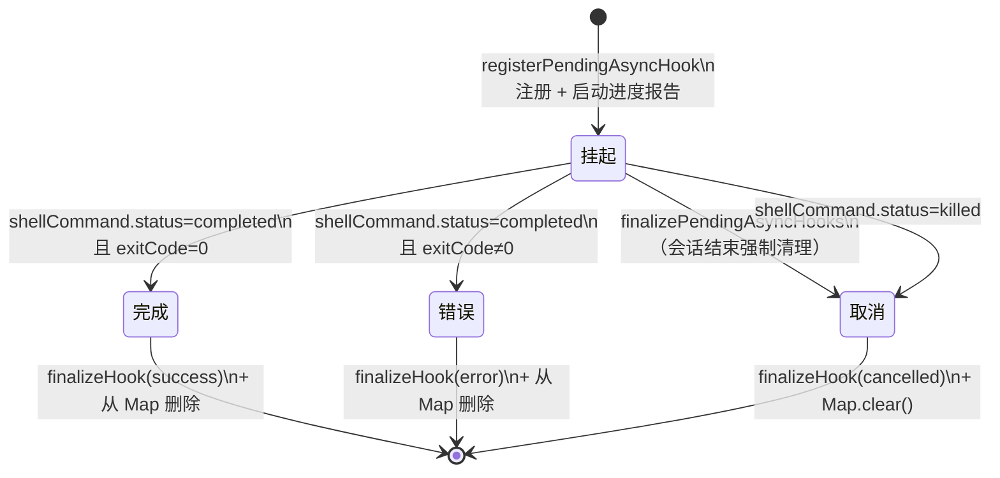

# 第 26 章：AsyncHookRegistry——异步钩子的注册、超时与并发控制

> "fire-and-forget 不是'发送后不管'，而是'发送后委托管理'。"

---

当一个钩子以异步方式启动——在后台运行 shell 命令、等待外部服务响应——有三件事没有人自动负责：这个钩子是否已经完成？如果超时了谁来清理？如果用户在结果回来之前关闭了会话，进程怎么处理这些半途而废的任务？

回答这三个问题的，是一个 300 多行的专用模块——`AsyncHookRegistry`。它的核心是一个**模块级全局注册表**（module-level global Map），追踪所有处于"挂起"状态的异步钩子。每个钩子被注册时携带超时配置、进程引用和完成回调；批量轮询函数负责定期检查哪些已完成；会话结束时，强制清理函数确保不遗漏任何挂起任务。

这是**异步钩子注册表**（Async Hook Registry）模式：把"谁负责生命周期管理"从调用方移到全局注册表，让每个 fire-and-forget 任务都有明确的超时上限、完成检测和会话结束清理。读完本章，你将理解为什么异步任务的生命周期管理需要专门的注册表，而不是散落在各处的 `setTimeout` 调用。

---

## 问题：fire-and-forget 任务的三个生命周期空白

当调用方启动一个异步 hook 并立即返回时，谁来追踪这个 hook 是否完成？在 `AsyncHookRegistry` 存在之前，可能的方案是：在每个启动点单独设置 `setTimeout`，在每个调用方自行轮询结果。这会导致三个问题：

**超时遗漏**：任何一处忘记设置超时，都会产生一个永远不会被清理的挂起任务。**重复交付**：多个调用方同时轮询同一个 hook 的结果，会导致结果被处理多次。**会话结束泄漏**：用户关闭会话时，后台运行的 hook 进程可能继续运行，但它们的结果永远不会被消费。

这三个问题的共同根源是：**任务生命周期管理被分散在调用方**，没有单一的权威追踪点。

`src/utils/hooks/AsyncHookRegistry.ts:28` 用一行代码定义了解决方案的核心：

```typescript
// src/utils/hooks/AsyncHookRegistry.ts:28
// 全局注册表状态
const pendingHooks = new Map<string, PendingAsyncHook>()
```

**源码参考：** `src/utils/hooks/AsyncHookRegistry.ts:28`

这是一个**模块级**（module-level）的常量——不是类的实例变量，不是函数内的局部变量，而是模块加载时就存在、整个进程生命周期内共享的全局注册表。`Map<string, PendingAsyncHook>` 以 `processId`（进程 ID）为键，以完整的 `PendingAsyncHook` 记录为值。

`PendingAsyncHook` 的类型定义（第 12 行）揭示了注册表需要追踪的完整状态：

```typescript
// src/utils/hooks/AsyncHookRegistry.ts:12-27
export type PendingAsyncHook = {
  processId: string           // 唯一标识，也是 Map 的键
  hookId: string              // UI 展示用的 hook 唯一 ID
  hookName: string            // hook 的显示名称
  hookEvent: HookEvent | 'StatusLine' | 'FileSuggestion'
  toolName?: string           // 关联的工具名（如 BashTool）
  pluginId?: string           // 来源插件 ID
  startTime: number           // 注册时间戳，用于计算已等待时长
  timeout: number             // 期望的超时时间（毫秒）
  command: string             // 执行的命令字符串（用于日志/展示）
  responseAttachmentSent: boolean  // 防止重复交付的标志
  shellCommand?: ShellCommand // 持有 shell 进程引用（可用于 kill）
  stopProgressInterval: () => void // 停止进度报告的清理函数
}
```

**源码参考：** `src/utils/hooks/AsyncHookRegistry.ts:12`

`responseAttachmentSent` 字段是防止重复交付的核心机制：一旦某个 hook 的结果被处理，这个标志就被设为 `true`，后续的轮询调用会跳过它。`shellCommand` 字段持有进程引用，让注册表在需要时能主动 kill 还在运行的进程（而不是只能等待）。

**图 26-1：异步钩子三态生命周期**



这张状态图揭示了一个重要设计决策：**"取消"是一个一等公民结果**，与成功和错误并列。当会话结束时，还在运行的 hook 不会被静默丢弃，而是显式地以 `'cancelled'` 结果完成，让调用方能区分"hook 正常完成"和"hook 被会话关闭中断"。

---

## 源码实例 1：registerPendingAsyncHook——注册与进度追踪

`registerPendingAsyncHook` 是新异步钩子进入注册表的唯一入口（`src/utils/hooks/AsyncHookRegistry.ts:30`）：

```typescript
// src/utils/hooks/AsyncHookRegistry.ts:30-84（简化）
export function registerPendingAsyncHook({
  processId,
  hookId,
  asyncResponse,
  hookName,
  hookEvent,
  command,
  shellCommand,
  toolName,
  pluginId,
}: { ... }): void {
  const timeout = asyncResponse.asyncTimeout || 15000  // 默认 15 秒
  logForDebugging(
    `Hooks: Registering async hook ${processId} (${hookName}) with timeout ${timeout}ms`,
  )
  // 启动进度报告——定期读取 shellCommand 的 stdout/stderr 并推送 UI 更新
  const stopProgressInterval = startHookProgressInterval({
    hookId,
    hookName,
    hookEvent,
    getOutput: async () => {
      const taskOutput = pendingHooks.get(processId)?.shellCommand?.taskOutput
      if (!taskOutput) return { stdout: '', stderr: '', output: '' }
      const stdout = await taskOutput.getStdout()
      const stderr = taskOutput.getStderr()
      return { stdout, stderr, output: stdout + stderr }
    },
  })
  pendingHooks.set(processId, {
    processId, hookId, hookName, hookEvent, toolName, pluginId, command,
    startTime: Date.now(),
    timeout,
    responseAttachmentSent: false,
    shellCommand,
    stopProgressInterval,
  })
}
```

**源码参考：** `src/utils/hooks/AsyncHookRegistry.ts:30`

注意超时值的处理（第 51 行）：`asyncResponse.asyncTimeout || 15000`。这是从钩子的异步响应对象中读取钩子**自己声明的期望超时**，若未声明则默认 15 秒。这里的设计是：**超时值是元数据，实际的超时执行在 shell 命令层**。`shellCommand` 在被传入注册表之前，已经绑定了一个 `AbortSignal`（在 `executeInBackground` 调用层设置）。注册表存储的 `timeout` 字段主要用于记录和展示，而不是在这里启动一个独立的 `setTimeout`。

这个区分很重要：注册表**不是超时执行器**，它是**超时状态的记录者**。超时后 shell 命令会被 abort signal 终止，注册表在下次轮询时发现 `shellCommand.status === 'killed'`，随后清理这条记录。

`startHookProgressInterval` 开启了一个定时器，定期从 `shellCommand.taskOutput` 读取已输出的 stdout/stderr，并推送到 UI 层作为进度更新。注意这里的 `getOutput` 回调是通过 `pendingHooks.get(processId)` 访问的——它在每次调用时重新从 Map 查找，而不是闭包捕获 `shellCommand` 引用。这样即使注册表中的条目被更新（如 `shellCommand` 被替换），进度回调始终访问最新状态。

`finalizeHook`（第 91 行）是结束一个 hook 的统一出口，处理成功/错误/取消三种 outcome：

```typescript
// src/utils/hooks/AsyncHookRegistry.ts:91-110（简化）
async function finalizeHook(
  hook: PendingAsyncHook,
  exitCode: number,
  outcome: 'success' | 'error' | 'cancelled',
): Promise<void> {
  hook.stopProgressInterval()  // 停止进度报告
  const stdout = taskOutput ? await taskOutput.getStdout() : ''
  const stderr = taskOutput?.getStderr() ?? ''
  hook.shellCommand?.cleanup()  // 释放 shell 进程资源
  emitHookResponse({            // 通知 UI 层：hook 已完成
    hookId: hook.hookId,
    hookName: hook.hookName,
    hookEvent: hook.hookEvent,
    output: stdout + stderr,
    stdout, stderr, exitCode, outcome,
  })
}
```

**源码参考：** `src/utils/hooks/AsyncHookRegistry.ts:91`

`finalizeHook` 做的三件事——停止进度报告、清理进程资源、发送完成通知——顺序是固定的：必须先停止进度报告（否则 cleanup 后再读输出会出错），再清理资源，最后通知。这是资源清理的标准顺序，但值得注意的是它被封装在一个函数里，而不是散落在每个 outcome 处理分支中。

---

## 源码实例 2：checkForAsyncHookResponses——批量轮询与 Promise.allSettled 隔离

`checkForAsyncHookResponses` 是注册表的心跳函数——每次调用，它扫描所有挂起的 hook，返回已完成的结果（`src/utils/hooks/AsyncHookRegistry.ts:113`）：

```typescript
// src/utils/hooks/AsyncHookRegistry.ts:138-155（简化）
// 快照：处理前先复制 Map 内容，避免处理中修改 Map
const hooks = Array.from(pendingHooks.values())

const settled = await Promise.allSettled(
  hooks.map(async hook => {
    const stdout = await hook.shellCommand?.taskOutput.getStdout() ?? ''
    const stderr = hook.shellCommand?.taskOutput.getStderr() ?? ''

    if (hook.shellCommand?.status === 'killed') {
      hook.stopProgressInterval()
      hook.shellCommand.cleanup()
      return { type: 'remove', processId: hook.processId }
    }

    if (hook.shellCommand?.status !== 'completed') {
      return { type: 'skip' }  // 还在运行，本次跳过
    }

    if (hook.responseAttachmentSent || !stdout.trim()) {
      return { type: 'remove', processId: hook.processId }
    }

    // ... 解析 stdout 中的 JSON 响应 ...
    hook.responseAttachmentSent = true
    await finalizeHook(hook, exitCode, exitCode === 0 ? 'success' : 'error')
    return { type: 'response', processId: hook.processId, payload: {...} }
  }),
)
```

**源码参考：** `src/utils/hooks/AsyncHookRegistry.ts:138`

`Promise.allSettled`（而非 `Promise.all`）是这里的关键选择。`Promise.all` 在任意一个 Promise 拒绝时立即失败，后续的副作用（`responseAttachmentSent = true`、`finalizeHook` 调用）可能被中断。`Promise.allSettled` 等待所有 Promise 都完成（无论成功或失败），然后统一处理结果。

源码注释中明确说明了这个选择的理由：

> "allSettled — 隔离失败，防止一个抛出错误的回调孤立已应用的副作用（responseAttachmentSent、finalizeHook）"

这体现了一个工程原则：**当多个并行操作各自有副作用时，用 `allSettled` 而非 `all`**。一个 hook 的处理失败不应影响其他已经成功标记 `responseAttachmentSent` 的 hook——否则这些 hook 的状态会变成"标记了已发送但结果未被消费"的不一致状态。

处理完所有 hook 后，Map 的变更批量进行（统一 `pendingHooks.delete`），而不是在每个 hook 处理时立即修改——这是"快照处理"模式：先复制状态读取，完成后批量写入，避免在迭代中修改被迭代的集合。

`finalizePendingAsyncHooks`（第 281 行）是会话结束时的强制清理：

```typescript
// src/utils/hooks/AsyncHookRegistry.ts:281-302
export async function finalizePendingAsyncHooks(): Promise<void> {
  const hooks = Array.from(pendingHooks.values())
  await Promise.all(
    hooks.map(async hook => {
      if (hook.shellCommand?.status === 'completed') {
        // 已完成的：正常 finalize
        const result = await hook.shellCommand.result
        await finalizeHook(hook, result.code, result.code === 0 ? 'success' : 'error')
      } else {
        // 还在运行的：先 kill，再标记 cancelled
        if (hook.shellCommand && hook.shellCommand.status !== 'killed') {
          hook.shellCommand.kill()
        }
        await finalizeHook(hook, 1, 'cancelled')
      }
    }),
  )
  pendingHooks.clear()  // 清空注册表
}
```

**源码参考：** `src/utils/hooks/AsyncHookRegistry.ts:281`

`finalizePendingAsyncHooks` 与 `checkForAsyncHookResponses` 有一个关键区别：后者只**报告**已完成的 hook，不强制终止运行中的 hook；前者则**无论 hook 当前状态如何**，都会强制结束它——运行中的 kill，已完成的正常 finalize，然后清空整个注册表。

这个设计保证了：**无论会话以何种方式结束（正常退出、错误崩溃、用户 Ctrl+C），只要调用 `finalizePendingAsyncHooks`，注册表就会处于干净状态**，不遗留任何孤儿进程或未清理的定时器。

---

## 模式剖析：异步钩子注册表的三个组成部分

**1. 全局权威追踪点（Global Authoritative Registry）**：模块级 `pendingHooks` Map 是整个系统中所有挂起异步钩子的唯一真相来源。没有任何调用方需要自己追踪"我启动了哪些 hook"——这个职责完全委托给了注册表。代价是：这是一个全局单例，测试时需要在每个测试后调用 `clearAllAsyncHooks()` 重置状态。

**2. 轮询检测完成（Poll-based Completion Detection）**：注册表使用轮询（`checkForAsyncHookResponses` 被周期性调用）而非推送（hook 完成时主动通知）来检测完成状态。推送模型会更及时，但需要 hook 进程主动向注册表报告——对于 shell 命令这类外部进程，推送需要额外的通信机制（如管道或 IPC），而轮询只需检查进程状态，实现简单。

**3. 会话结束强制清理（Session-End Force Finalize）**：`finalizePendingAsyncHooks` 提供了一个"强制关门"机制：无论有多少 hook 还在运行，调用这个函数后注册表保证是干净的。这是一个**最终一致性保证**：系统不保证每个 hook 都能正常完成，但保证每个 hook 的生命周期最终都会被关闭（要么成功/错误，要么取消）。

---

## 适用范围

| 场景 | 适用性 | 理由 | 替代方案 |
|------|--------|------|---------|
| fire-and-forget 任务需要超时保证 | ✓ | 注册表统一存储超时配置，确保每个任务有上限 | 每处单独设 setTimeout（容易漏）|
| 会话结束需要等待/清理后台任务 | ✓ | finalizePendingAsyncHooks 确保会话结束时全部清理 | 进程退出信号（但不等待，可能中断处理中的任务）|
| 需要防止重复交付异步结果 | ✓ | responseAttachmentSent 标志防止多次处理 | 调用方自行去重（散落，难维护）|
| 高频短任务（每秒 >100 个）| ✗（谨慎）| 每次 checkForAsyncHookResponses 遍历全部 Map 条目，高频时有开销（推断）| 专用队列 + 事件通知 |
| 需要跨进程共享异步任务状态 | ✗ | 注册表是进程内单例，不跨进程 | 分布式任务队列（Redis/Kafka）|

---

## 权衡与局限

**权衡 1：模块级全局状态 vs 可测试性**

`pendingHooks` 是模块级全局 Map，而非可依赖注入的实例变量。这让注册表在整个进程生命周期内是同一个对象——不需要传递注册表实例，任何模块都能直接 import 并使用。代价是：**测试隔离依赖测试框架来重置模块状态**，`clearAllAsyncHooks()` 就是为此设计的测试工具函数（注释中明确标注"Test utility function"）。如果两个测试并发运行且共享模块状态，可能互相干扰。

**权衡 2：轮询 vs 推送的延迟差异**

`checkForAsyncHookResponses` 是轮询模型——调用方定期调用，检查是否有新完成的 hook。如果轮询间隔是 1 秒，那么一个在轮询间隔内完成的 hook，要等到下次轮询才会被处理，引入最多 1 秒的额外延迟。对于异步 hook 的典型使用场景（后台写入、通知发送），这个延迟是可接受的。但如果 hook 的结果需要被用于下一个同步操作（如 SessionStart hook 的结果影响后续工具可用性），延迟就会成为问题——这也解释了为什么 `checkForAsyncHookResponses` 对 `SessionStart` 特殊处理：发现 SessionStart 完成时立即 `invalidateSessionEnvCache()`，而不是等下一个处理周期。

**权衡 3：Promise.allSettled 的性能 vs 一致性权衡**

`Promise.allSettled` 等待所有 hook 检查完成后才返回，这意味着一个慢 hook（如读取大量 stdout）会拖慢整个批次的轮询周期。相比之下，`Promise.race` 或"谁先好谁先返回"的策略会更快，但会牺牲结果的一致性。当前选择倾向一致性：同一次轮询的所有 hook 要么都处理，要么用 allSettled 独立隔离失败。

**权衡 4：shellCommand 持有在注册表中的生命周期风险**

`PendingAsyncHook.shellCommand` 持有对 shell 进程对象的引用。在 hook 被从 Map 删除之前，这个引用阻止了 `ShellCommand` 被垃圾回收（即使进程已经结束）。`cleanup()` 调用（在 `finalizeHook` 中）负责释放进程资源，但如果 `finalizeHook` 在某些异常路径下未被调用，就会产生资源泄漏（推断：这也是 `clearAllAsyncHooks` 要显式调用 `stopProgressInterval` 的原因——至少释放定时器）。

---

## 与已知模式的对话

**与 Promise Registry（Promise 注册表）**：本模式与"用 Map 追踪所有 pending Promise"的 Promise Registry 模式几乎完全一致，差异在于两点：第一，本模式追踪的不是 Promise 本身，而是 shell 进程的状态（通过 `shellCommand.status` 轮询而非 Promise resolve/reject）；第二，本模式有 `finalizePendingAsyncHooks` 提供会话结束的强制清理，而标准 Promise Registry 通常依赖 Promise 的自然完成。

**与 GoF 备忘录模式（Memento Pattern）**：备忘录模式持有对象在某个时刻的内部状态，允许后续恢复（undo）。`PendingAsyncHook` 也是持有钩子的状态快照（startTime、timeout、command 等），但目的完全不同——不是为了恢复，而是为了**追踪和清理**。备忘录是"为了回退"，本模式是"为了善后"。

**与 Actor 模型的 Supervisor**：Actor 模型中，Supervisor 负责监控子 Actor 的生命周期，在子 Actor 失败时决定重启、停止或上报。`AsyncHookRegistry` 有类似的监护关系：注册表知道每个挂起 hook 的状态，在会话结束时"决定"要么等待完成，要么强制取消。差异在于：AsyncHookRegistry 没有"重启"策略——hook 被取消就是取消，没有重试机制。

---

## 模式提炼

### 异步钩子注册表（Async Hook Registry）

**解决的问题**：fire-and-forget 的异步任务缺乏统一的生命周期管理——超时、取消、会话结束清理没有中央负责方，导致孤儿进程和资源泄漏。

**核心做法**：用模块级全局 Map 注册所有挂起任务，以 `processId` 为键存储任务状态（超时配置、进程引用、完成标志）；轮询函数批量检查完成状态；会话结束时强制 finalize 全部挂起任务。

**前置条件**：任务有唯一标识（processId）；任务状态可通过轮询检测（status polling）；系统有明确的会话/生命周期结束点可以触发强制清理。

**源码证据**：`src/utils/hooks/AsyncHookRegistry.ts:28`（`pendingHooks` 全局 Map）；`src/utils/hooks/AsyncHookRegistry.ts:281`（`finalizePendingAsyncHooks`，会话结束强制清理）

---

### 快照-批量-提交模式（Snapshot-Process-Commit）

**解决的问题**：在迭代集合时修改集合本身会导致迭代行为不确定（跳过条目或重复处理）；并发处理时，早期副作用（如标记 `responseAttachmentSent`）不应因后续失败而被回滚。

**核心做法**：先 `Array.from(map.values())` 拷贝快照，用 `Promise.allSettled` 并行处理（独立失败不相互影响），最后批量提交 `map.delete` 变更——三步分离：读取、处理、写入。

**前置条件**：处理过程中可能修改被迭代的集合；多个条目的处理有副作用，需要相互隔离。

**源码证据**：`src/utils/hooks/AsyncHookRegistry.ts:138`（`const hooks = Array.from(pendingHooks.values())` 快照）；`src/utils/hooks/AsyncHookRegistry.ts:153`（`Promise.allSettled`，注释"isolate failures so one throwing callback doesn't orphan already-applied side effects"）

---

## 你能做什么

- **用模块级全局 Map 追踪所有 fire-and-forget 异步任务**，而非让每个调用方自己保留引用。集中注册让超时管理、去重、会话清理都有单一入口。

- **在注册记录中存储 `startTime` 和 `timeout` 字段**，即使超时的实际执行在外层（如 AbortSignal）。注册表持有这些元数据，让监控面板能计算"任务已等待多久"，而不需要查询外部状态。

- **定义三态结果（success/error/cancelled）**，把"被会话关闭中断"显式区别于"任务失败"。调用方（如审计系统）可以用 `outcome === 'cancelled'` 判断这是正常的会话退出，而非异常。

- **用 `Promise.allSettled` 而非 `Promise.all` 批量处理异步任务集合**，当每个任务有独立副作用（如标记已发送、释放资源）时，用 `allSettled` 保证一个任务的失败不影响其他任务的副作用正确执行。

- **在 finalizePending 函数中做完整清理**：正常完成的任务 finalize（emitResponse），还在运行的任务 kill 后标 cancelled，最后 `map.clear()`。这个函数是"任何退出路径下都安全"的设计，保证调用后注册表一定干净。

- **提供测试清理工具函数**（如 `clearAllAsyncHooks`），在模块注释中明确标注"Test utility"。全局状态的测试隔离责任应该由工具函数承担，而不是让测试直接访问内部 Map。

---

异步钩子的注册与生命周期管理由 `AsyncHookRegistry` 负责，而钩子配置如何在进程启动时被加载并以快照形式注入到执行上下文中，是第 27 章 `hooksConfigSnapshot` 的主题（详见第 27 章）。
