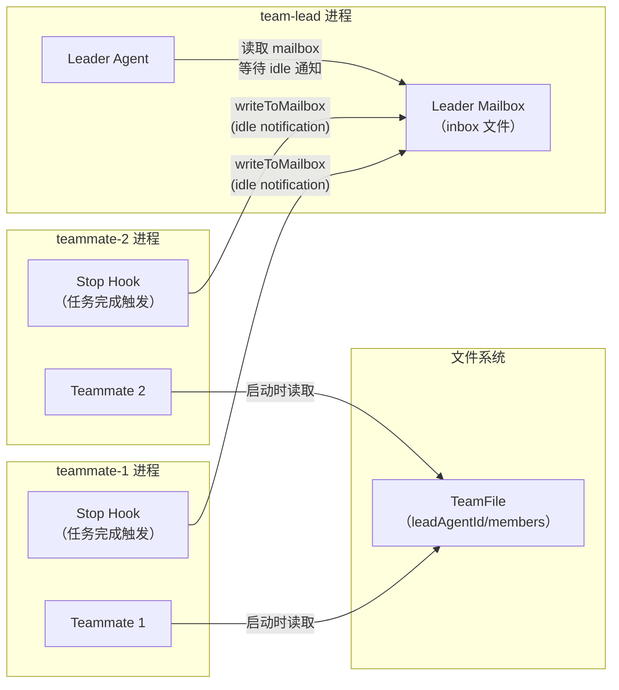

# 第 29 章：Teammate 生命周期——Swarm 架构总览

> "协调不需要中央调度器——每个 Agent 在完成时主动举手，Leader 才分配下一个任务。"

---

当 Claude Code 以 Swarm 模式运行时，多个 Agent 实例同时工作——每个 Agent（Teammate）是一个独立的进程，有自己的会话历史、工具权限和运行状态。Leader 怎么知道哪个 Teammate 已经完成当前任务、可以接受新任务？

直觉上可能想到轮询：Leader 定期检查每个 Teammate 的状态。但轮询需要中央调度器持续运行，效率低，而且在网络分区或进程重启时容易产生状态不一致。

Claude Code 选择了事件驱动的去中心化方式：每个 Teammate 在启动时注册一个 `Stop` 事件钩子，当任务完成时**主动通过 mailbox 向 Leader 发送"我空闲了"的通知**。Leader 不需要轮询——它等待通知，通知到来时才行动。这就是**领导者-队友事件驱动协调**（Leader-Teammate Event-Driven Coordination）模式。

读完本章，你将理解 Swarm 架构的三个核心机制：Teammate 启动时的"加入团队"协议（`initializeTeammateHooks`）、团队级权限的统一应用、以及 mailbox 文件系统通信如何实现跨进程消息传递。

---

## 问题：独立进程的 Agent 如何协调

在同一进程内的多线程协作可以共享内存——一个线程改了状态，其他线程立刻可见。但 Claude Code 的 Swarm 模型中，每个 Teammate 是独立进程，有独立的内存空间。进程之间不能直接共享 AppState，不能直接调用对方的函数。

多进程 Agent 协作面临的核心问题：
- **状态不可见**：Leader 不知道 Teammate 当前在做什么
- **完成通知缺失**：Teammate 完成任务后没有机制通知 Leader
- **权限配置分散**：每个 Teammate 有自己的工具权限，团队级别的权限规则需要重复配置

Claude Code 通过两个基础设施解决这些问题：**Team File**（团队元数据的持久化存储）和 **Mailbox**（跨进程消息通信的文件系统实现）。

`TeamFile` 类型定义在 `src/utils/swarm/teamHelpers.ts:64`，是整个团队的"名册"：

```typescript
// src/utils/swarm/teamHelpers.ts:64-88（简化）
export type TeamFile = {
  name: string
  createdAt: number
  leadAgentId: string          // Leader 的 Agent ID
  leadSessionId?: string       // Leader 当前会话 UUID（用于发现）
  teamAllowedPaths?: TeamAllowedPath[]  // 团队共享权限路径
  members: Array<{
    agentId: string
    name: string
    agentType?: string
    tmuxPaneId: string         // 在 tmux 中的位置
    isActive?: boolean         // false=空闲, undefined/true=活跃
    mode?: PermissionMode      // 当前权限模式
    subscriptions: string[]    // 订阅的主题
    // ... 其他字段
  }>
}
```

**源码参考：** `src/utils/swarm/teamHelpers.ts:64`

`TeamFile` 是磁盘上的 JSON 文件（`readTeamFile` 直接读取）。它存在的意义是让每个 Teammate 在启动时能找到 Leader——通过 `leadAgentId` 字段定位 Leader，然后向 Leader 的 mailbox 发送消息。`isActive` 字段记录成员状态：`false` 表示空闲，`undefined/true` 表示活跃——这让 Leader 不需要实时轮询，只需查看 TeamFile 就能了解团队概况。

`constants.ts` 定义了 Swarm 系统的核心常量：

```typescript
// src/utils/swarm/constants.ts（全部）
export const TEAM_LEAD_NAME = 'team-lead'      // Leader 的固定角色名
export const SWARM_SESSION_NAME = 'claude-swarm'
export const SWARM_VIEW_WINDOW_NAME = 'swarm-view'
export const TMUX_COMMAND = 'tmux'
export const HIDDEN_SESSION_NAME = 'claude-hidden'

export const TEAMMATE_COMMAND_ENV_VAR = 'CLAUDE_CODE_TEAMMATE_COMMAND'
  // 覆盖 Teammate 的启动命令（默认为当前 Claude 二进制）
export const TEAMMATE_COLOR_ENV_VAR = 'CLAUDE_CODE_AGENT_COLOR'
  // 分配给 Teammate 的颜色（用于着色输出和 pane 识别）
export const PLAN_MODE_REQUIRED_ENV_VAR = 'CLAUDE_CODE_PLAN_MODE_REQUIRED'
  // 要求 Teammate 在写代码前必须进入 plan 模式
```

**源码参考：** `src/utils/swarm/constants.ts:1`

`TEAM_LEAD_NAME = 'team-lead'` 是一个固定角色名——Leader 不用动态分配名称，所有 Teammate 都知道找 `team-lead` 就是找 Leader。这简化了发现机制：不需要服务发现，也不需要在运行时传递 Leader 地址。

**图 29-1：Leader-Teammate Swarm 架构**



---

## 源码实例 1：initializeTeammateHooks——Teammate 的启动协议

`initializeTeammateHooks` 是每个 Teammate 启动时调用的初始化函数（`src/utils/swarm/teammateInit.ts:28`）。它做三件事：读取团队文件、应用团队权限、注册 Stop 钩子。

```typescript
// src/utils/swarm/teammateInit.ts:28-46（简化）
export function initializeTeammateHooks(
  setAppState: (updater: (prev: AppState) => AppState) => void,
  sessionId: string,
  teamInfo: { teamName: string; agentId: string; agentName: string },
): void {
  const { teamName, agentId, agentName } = teamInfo

  // 第一步：读取团队文件（获取 Leader ID 和团队权限）
  const teamFile = readTeamFile(teamName)
  if (!teamFile) {
    logForDebugging(`[TeammateInit] Team file not found for team: ${teamName}`)
    return  // 找不到团队文件时静默退出（不抛出）
  }

  const leadAgentId = teamFile.leadAgentId
  // ...（第二步：应用团队权限）
  // ...（第三步：注册 Stop 钩子）
}
```

**源码参考：** `src/utils/swarm/teammateInit.ts:28`

`readTeamFile` 失败时静默退出（返回 null 而非抛出），这是一个防御性设计：如果团队文件不存在（比如 Swarm 启动过程中某个 Teammate 先于 Leader 初始化），整个会话不应该崩溃。Teammate 的核心功能（执行任务）不依赖于 Swarm 协调——没有团队文件时，它仍然是一个正常的 Claude Code 实例，只是没有 Swarm 协调能力。

第三步：注册 Stop 钩子。关键逻辑在第 88-129 行，包含一个重要的 Leader 跳过检查：

```typescript
// src/utils/swarm/teammateInit.ts:82-129（简化）
// 不为 Leader 注册 hook（Leader 不需要向自己发 idle notification）
if (agentId === leadAgentId) {
  logForDebugging(
    '[TeammateInit] This agent is the team leader - skipping idle notification hook',
  )
  return
}

// 为 Teammate 注册 Stop hook，任务完成时通知 Leader
addFunctionHook(
  setAppState, sessionId, 'Stop',
  '',  // 空 matcher：应用于所有 Stop 事件
  async (messages, _signal) => {
    // 将 Teammate 标记为空闲（fire and forget）
    void setMemberActive(teamName, agentName, false)

    // 向 Leader 发送 idle notification（必须 await，确保写完再退出）
    const notification = createIdleNotification(agentName, {
      idleReason: 'available',
      summary: getLastPeerDmSummary(messages),  // 从最后一轮消息提取摘要
    })
    await writeToMailbox(leadAgentName, {
      from: agentName,
      text: jsonStringify(notification),
      timestamp: new Date().toISOString(),
      color: getTeammateColor(),
    })
    return true  // 不阻塞 Stop 事件
  },
  'Failed to send idle notification to team leader',
  { timeout: 10000 },  // 10 秒超时（进程关闭时不能无限等待）
)
```

**源码参考：** `src/utils/swarm/teammateInit.ts:88`

Leader 跳过检查（第 88 行）是一个防止自发消息的设计：Leader 实例也会调用 `initializeTeammateHooks`，但它不需要向自己的 mailbox 发 idle notification。用 `agentId === leadAgentId` 做身份检查，是因为 Leader 在 TeamFile 中的 `leadAgentId` 是唯一的，任何 Teammate 的 `agentId` 都不可能与之相等。

Stop 钩子中有两个操作：`setMemberActive` 是 fire-and-forget（不等待），`writeToMailbox` 是 await（必须等待）。为什么差别对待？`setMemberActive` 只是更新 TeamFile 中的状态，即使失败 Leader 也会通过 mailbox 知道 Teammate 空闲了；`writeToMailbox` 是核心通信机制，如果不等写完就退出，Leader 可能收不到通知，任务分配就会中断。`return true` 表示"不阻塞 Stop 事件"——写完 mailbox 后，Stop 正常触发，会话正常结束。

---

## 源码实例 2：团队级权限的统一应用

`initializeTeammateHooks` 的第二步是把 TeamFile 中的 `teamAllowedPaths` 应用到当前 Teammate 的权限上下文（`src/utils/swarm/teammateInit.ts:47`）：

```typescript
// src/utils/swarm/teammateInit.ts:47-72（简化）
if (teamFile.teamAllowedPaths && teamFile.teamAllowedPaths.length > 0) {
  for (const allowedPath of teamFile.teamAllowedPaths) {
    // 绝对路径（以 / 开头）→ `//path/**` 模式
    // 相对路径 → `path/**` 模式
    const ruleContent = allowedPath.path.startsWith('/')
      ? `/${allowedPath.path}/**`
      : `${allowedPath.path}/**`

    setAppState(prev => ({
      ...prev,
      toolPermissionContext: applyPermissionUpdate(
        prev.toolPermissionContext,
        {
          type: 'addRules',
          rules: [{ toolName: allowedPath.toolName, ruleContent }],
          behavior: 'allow',
          destination: 'session',  // 会话级别，不持久化
        },
      ),
    }))
  }
}
```

**源码参考：** `src/utils/swarm/teammateInit.ts:47`

`teamAllowedPaths` 是 Leader 在分配任务时设置的"这个任务允许所有 Teammate 修改的目录"。例如，Leader 说"所有 Teammate 都可以编辑 `/src/components/` 下的文件"，这条规则就写入 TeamFile，所有 Teammate 启动时自动应用。

路径规则的转换逻辑（绝对路径 vs 相对路径的不同前缀）反映了权限系统的 glob 匹配规范：绝对路径需要加前缀 `/` 使其变成 `//path/**`（双斜杠区分 glob 根与相对路径）；相对路径直接追加 `/**` 通配符。

`destination: 'session'` 是重要的语义：这些权限是会话级别的，不持久化到全局设置中。Teammate 完成任务退出后，这些临时权限就消失了。这保证了团队权限不会"污染"个人的全局配置。

`TeamAllowedPath` 类型（`src/utils/swarm/teamHelpers.ts:57`）包含 `addedBy`（谁添加了这条规则）和 `addedAt`（何时添加），提供了权限变更的完整审计跟踪——不只是"允许什么"，还记录了"谁在什么时候决定允许的"。

---

## 模式剖析：事件驱动协调的三个核心约束

**领导者-队友事件驱动协调**模式依赖三个约束：

**1. 去中心化通知（Decentralized Notification）**：Teammate 主动通知 Leader，而非 Leader 轮询。这让 Leader 可以事件驱动地工作——有通知才行动，而不是每秒轮询 N 个 Teammate 的状态，避免了 O(N) 的轮询开销。

**2. 持久化通信通道（Persistent Communication Channel）**：Mailbox 是文件系统实现的消息通道。Teammate 进程退出后，写入的 mailbox 文件仍然存在，Leader 重启后仍能读取到这条消息。这提供了进程崩溃后的自动恢复能力——Teammate 的 idle notification 不会因为 Leader 暂时不可用而丢失。

**3. 身份驱动路由（Identity-Based Routing）**：所有通信以名称（`agentName`/`leadAgentName`）而非地址（IP/端口）路由。Leader 的 mailbox 路径由 `leadAgentName` 推算，不需要显式配置 Leader 地址。这让 Swarm 拓扑可以在 TeamFile 中集中管理，而不是散落在各 Teammate 的配置中。

---

## 适用范围

| 场景 | 适用性 | 理由 | 替代方案 |
|------|--------|------|---------|
| 多个独立进程 Agent 协作 | ✓ | mailbox 文件系统通信不依赖共享内存 | 共享内存（单进程内可行，跨进程不适用）|
| Leader 需要知道 Teammate 何时空闲 | ✓ | Stop hook + idle notification 精确单次通知 | 轮询 Teammate 状态（效率低，实现复杂）|
| 团队成员有共享权限规则 | ✓ | teamAllowedPaths 统一应用到所有 Teammate | 每个 Teammate 单独配置（重复且不一致）|
| 需要强一致性的任务分配（事务）| ✗ | mailbox 是 fire-and-forget，无两阶段提交 | 中央调度器 + 数据库 |
| 超大规模 Swarm（>20 个 Teammates）| ✗（谨慎）| TeamFile 和 mailbox 没有水平扩展设计（推断）| 消息队列（Kafka/Redis）|

---

## 权衡与局限

**权衡 1：文件系统 mailbox 的顺序性**

`writeToMailbox` 把消息追加到 JSON 文件中，读取时按文件内容顺序返回。文件系统不保证并发写入的严格顺序——如果两个 Teammate 同时发送 idle notification，消息顺序取决于操作系统的文件写入调度。对于 Swarm 协调，消息顺序通常不影响正确性（Leader 只关心"谁空闲了"，不关心谁先空闲），但如果有顺序依赖的业务逻辑，文件系统 mailbox 不能保证。

**权衡 2：Stop hook 的 10 秒超时**

`addFunctionHook` 注册的 Stop hook 有 10 秒超时（`timeout: 10000`）。会话关闭时，进程需要等这 10 秒内 `writeToMailbox` 完成。如果 mailbox 写入失败（如磁盘满了），超时后进程也会继续退出——Leader 不会收到 idle notification，但 Teammate 不会永久阻塞。这是"可靠性 vs 完成时间"的取舍：10 秒足够大多数文件写入，但不保证 100% 传达率。

**权衡 3：TeamFile 的单点依赖**

所有 Teammate 启动时都读取同一个 TeamFile。如果 TeamFile 损坏或丢失，所有 Teammate 的 Swarm 功能都会退化（`readTeamFile` 返回 null，`initializeTeammateHooks` 提前返回）。虽然 Teammate 仍然能正常执行任务，但 Leader 不会收到任何完成通知，任务协调中断。TeamFile 没有备份机制（推断），单点故障会导致 Swarm 协调失效。

---

## 与已知模式的对话

**与 Actor 模型（Erlang/Akka）**：Actor 模型中，每个 Actor 有独立邮箱，通过消息传递通信，不共享内存。Claude Code 的 Leader-Teammate 架构与此高度吻合——每个进程是独立 Actor，通过 mailbox 文件传递消息。差异在于：Erlang Actor 是轻量级协程，本模式的 Teammate 是完整进程（包含独立的 Claude 二进制实例）；Erlang 有内置的 Supervisor 自动重启失败 Actor，本模式的故障恢复依赖 TeamFile 中的 `isActive` 字段，没有自动重启。

**与 EIP 消息通道（Message Channel）**：EIP 消息通道解耦消息发送者和接收者——发送者不需要知道接收者在哪里。mailbox 文件系统通道有同样的解耦效果：Teammate 只知道 `leadAgentName`，不需要知道 Leader 进程的 PID 或网络地址。差异在于：EIP 消息通道通常是内存队列或 MQ（Kafka/RabbitMQ），有严格的顺序和持久性保证；mailbox 是简单的文件追加，在并发场景下顺序不保证。

**与 Pub-Sub 模式**：Pub-Sub 中，Publisher 发布事件到频道，所有 Subscriber 都收到通知。本模式是点对点的（Teammate → 特定 Leader），不是广播——每个 idle notification 只发给 `leadAgentName`，不会广播给所有 Teammate。`subscriptions` 字段（TeamFile members 中）暗示系统有一定的 Pub-Sub 能力，但核心的 idle notification 机制是点对点的。

---

## 模式提炼

### 领导者-队友事件驱动协调（Leader-Teammate Event-Driven Coordination）

**解决的问题**：多个独立 Agent 进程需要协调任务分配，不共享内存，Leader 需要知道哪个 Teammate 何时空闲。

**核心做法**：Teammate 启动时注册 Stop 事件钩子；任务完成时通过 `writeToMailbox` 向 Leader 发送 idle notification；Leader 读取 mailbox 响应通知，分配下一个任务。

**前置条件**：有持久化消息存储（文件系统 mailbox）；有团队元数据（TeamFile）记录 Leader 身份；各 Agent 有唯一名称用于路由。

**源码证据**：`src/utils/swarm/teammateInit.ts:94`（`addFunctionHook(..., 'Stop', ...)` 注册 idle 通知）；`src/utils/swarm/teammateInit.ts:109`（`await writeToMailbox(leadAgentName, {...})` 跨进程发送消息）

---

### 启动时团队权限注入（Startup Team Permission Injection）

**解决的问题**：团队中所有 Teammate 共享一套路径权限规则，如果分别配置则重复且不一致；如果让 Leader 运行时推送则延迟高。

**核心做法**：团队权限存储在 TeamFile 的 `teamAllowedPaths` 中；每个 Teammate 启动时读取并调用 `applyPermissionUpdate` 一次性注入，`destination: 'session'` 确保不污染全局设置。

**前置条件**：有中央化的团队元数据存储（TeamFile）；权限系统支持运行时注入（`applyPermissionUpdate`）；会话级权限不持久化（任务结束后清理）。

**源码证据**：`src/utils/swarm/teammateInit.ts:51`（路径规则格式转换）；`src/utils/swarm/teammateInit.ts:57`（`applyPermissionUpdate` 注入，`destination: 'session'`）

---

## 你能做什么

- **用 Stop 事件钩子而非中央轮询实现 Teammate 空闲通知**，让协调逻辑去中心化。Leader 不需要知道每个 Teammate 的状态，只需等待 mailbox 中的通知。

- **通过 TeamFile 集中管理团队元数据**（成员列表/Leader ID/共享权限），而非在每个 Teammate 中硬编码。TeamFile 是团队拓扑的唯一真相来源。

- **在 Leader 初始化中跳过 Stop hook 注册**，防止 Leader 向自己发 idle notification。身份检查（`agentId === leadAgentId`）是实现这个跳过的最简方式。

- **为跨进程写入设置合理超时**（10 秒），既给文件写入足够时间，又防止进程关闭时无限等待。区分"fire-and-forget"（更新状态标志）和"必须等待"（发送核心通知）的操作。

- **用文件系统 mailbox 实现跨进程通信**，获得自然的持久化——进程重启后消息不丢失。对于不需要强顺序保证且消息量有限的协调场景，文件系统是最简单的跨进程通信方案。

---

Teammate 的初始化协议建立了角色关系。但初始化之后，当 Teammate 遇到需要权限决策的操作时，它怎么向 Leader "请示"？这是 `leaderPermissionBridge` 的职责——第 30 章将深入这个跨进程权限协商机制（详见第 30 章）。
