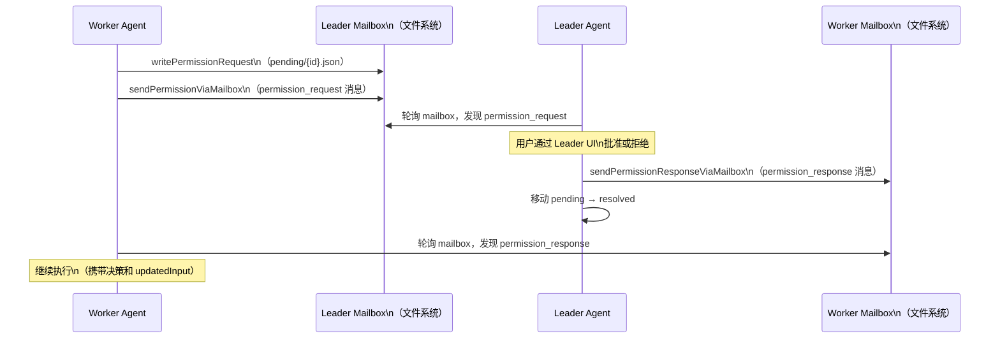
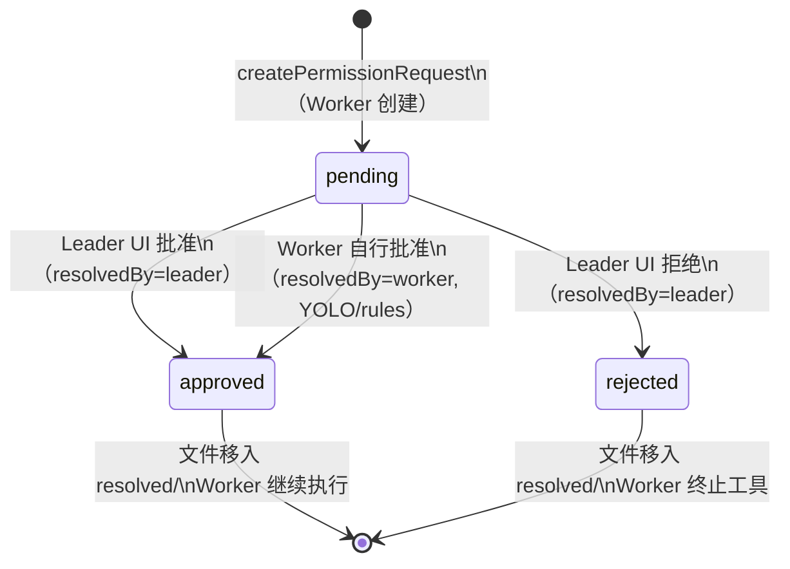

# 第 32 章：permissionSync——多智能体间的权限同步协议

> "当多个 Agent 同时举手请求权限，用户只看到一个窗口——这是协议设计的成果，不是偶然。"

---

三个并发的 Teammate 同时遇到需要用户确认的操作：一个要运行 bash 脚本，一个要编辑配置文件，一个要写入数据库。如果每个 Teammate 直接弹出对话框，用户会面对三个同时出现的权限确认窗口——这不是用户体验问题，而是系统正确性问题：用户无法在三个并发对话框中做出有意义的权限决策。

`permissionSync.ts` 用文件系统邮箱协议解决了这个问题：所有权限请求都通过 Leader 的邮箱路由，Leader 的 UI 是唯一的用户交互入口。文件头注释完整描述了这个 6 步流程：

1. Worker 遇到权限提示
2. Worker 把请求写入 Leader 的邮箱
3. Leader 轮询邮箱发现权限请求
4. 用户通过 Leader UI 批准或拒绝
5. Leader 把响应写入 Worker 的邮箱
6. Worker 轮询邮箱获取响应并继续执行

这是**邮箱权限协商**（Mailbox-Based Permission Negotiation）模式：用文件系统持久化消息替代内存队列，用邮箱路由替代共享锁，让多 Agent 的权限请求自然序列化在 Leader 的单一入口。

---

## 问题：多写一读的并发权限请求

分布式权限同步面临的核心挑战是"多写一读"：多个 Worker 可能同时写入权限请求，但 Leader UI 是单一的用户交互界面。如果多个请求同时出现在 Leader UI，用户要在多个并发状态下做出权限决策，极易出错。

更深的问题是进程间通信：Teammate 可能是独立进程（tmux 后端）或同进程子线程（in-process 后端）。进程隔离意味着不能共享内存，需要进程外的消息通道；同进程也需要线程安全的传递机制。文件系统是唯一可以跨越这两种场景的通信基础设施。

权限请求的存储结构（`src/utils/swarm/permissionSync.ts:112`）用三层目录组织状态：

```typescript
// src/utils/swarm/permissionSync.ts:112-132（简化）
export function getPermissionDir(teamName: string): string {
  return join(getTeamDir(teamName), 'permissions')
}
// 挂起的请求：~/.claude/teams/{team}/permissions/pending/{id}.json
function getPendingDir(teamName: string): string {
  return join(getPermissionDir(teamName), 'pending')
}
// 已解决的请求：~/.claude/teams/{team}/permissions/resolved/{id}.json
function getResolvedDir(teamName: string): string {
  return join(getPermissionDir(teamName), 'resolved')
}
```

**源码参考：** `src/utils/swarm/permissionSync.ts:112`

`pending/` 目录是"待办"，`resolved/` 目录是"已完成"——这是文件系统级别的状态机：请求文件从 `pending/` 移动到 `resolved/`，代表权限决策完成。文件的存在即是状态，不需要数据库或额外的状态追踪。

**图 32-1：权限协商 6 步流程**



流程图中有一个细节：Worker 同时写入两个地方——`pending/` 目录和 Leader 的 mailbox。这两者职责不同：文件目录是持久化存储（进程重启后可恢复），mailbox 消息是触发 Leader 轮询的信号。两份写入提供了冗余，但代价是 Worker 必须确保两次写入都成功。

---

## 源码实例 1：SwarmPermissionRequestSchema——消息即合约

`SwarmPermissionRequestSchema` 用 Zod 定义了跨进程消息的完整格式（`src/utils/swarm/permissionSync.ts:47`）：

```typescript
// src/utils/swarm/permissionSync.ts:47-97（简化）
export const SwarmPermissionRequestSchema = lazySchema(() =>
  z.object({
    /** 请求的唯一标识符 */
    id: z.string(),
    /** Worker 的 CLAUDE_CODE_AGENT_ID */
    workerId: z.string(),
    /** Worker 的 CLAUDE_CODE_AGENT_NAME */
    workerName: z.string(),
    /** Worker 的颜色（用于 UI 中的 badge 颜色）*/
    workerColor: z.string().optional(),
    /** 团队名称（用于路由）*/
    teamName: z.string(),
    /** 需要权限的工具名（如 "Bash", "Edit"）*/
    toolName: z.string(),
    toolUseId: z.string(),
    description: z.string(),
    input: z.record(z.string(), z.unknown()),
    permissionSuggestions: z.array(z.unknown()),
    /** 请求状态：待处理/已批准/已拒绝 */
    status: z.enum(['pending', 'approved', 'rejected']),
    /** 谁解决了这个请求：Worker 自己还是 Leader */
    resolvedBy: z.enum(['worker', 'leader']).optional(),
    resolvedAt: z.number().optional(),
    feedback: z.string().optional(),
    /** 解析者修改的工具输入（如 Leader 调整了命令参数）*/
    updatedInput: z.record(z.string(), z.unknown()).optional(),
    /** 应用的"始终允许"规则 */
    permissionUpdates: z.array(z.unknown()).optional(),
    createdAt: z.number(),
  }),
)
```

**源码参考：** `src/utils/swarm/permissionSync.ts:47`

每个字段的设计都有工程动机：

**`resolvedBy: z.enum(['worker', 'leader'])`** 区分了两种解析路径。Worker 有时可以自己解析权限请求（例如在 YOLO 模式下或基于已有的"始终允许"规则）——这时 `resolvedBy = 'worker'`，不需要打扰 Leader UI。只有 Worker 无法自行决策时才发给 Leader（`resolvedBy = 'leader'`）。这个字段让审计日志能够追踪"谁批准了这次权限请求"，区分自动批准和用户手动批准。

**`updatedInput`** 是双向沟通的关键字段。Leader（用户）批准一个权限请求时，可以修改工具的输入参数——例如，Worker 要删除 `/src/` 目录下所有 `.tmp` 文件，用户批准但把路径改为只删除 `/src/temp/` 下的文件。`updatedInput` 把这个修改传回给 Worker，Worker 用修改后的输入执行工具，而不是原始输入。这让用户不只是"批准/拒绝"，还能细粒度地调整 Agent 行为。

**`permissionSuggestions`** 是 Worker 附带的"建议权限规则"。Worker 知道它为什么需要这个权限，可以建议一条"始终允许 Bash 工具在 `/src/` 目录下运行"的规则。Leader UI 可以展示这个建议，用户一键批准+添加规则，避免下次再弹框。

`writePermissionRequest` 用文件锁保护并发写入（`src/utils/swarm/permissionSync.ts:215`）：

```typescript
// src/utils/swarm/permissionSync.ts:215-248（简化）
export async function writePermissionRequest(
  request: SwarmPermissionRequest,
): Promise<SwarmPermissionRequest> {
  await ensurePermissionDirsAsync(request.teamName)

  const pendingPath = getPendingRequestPath(request.teamName, request.id)
  const lockFilePath = join(getPendingDir(request.teamName), '.lock')
  // 创建目录级锁文件用于原子写入
  await writeFile(lockFilePath, '', 'utf-8')

  let release: (() => Promise<void>) | undefined
  try {
    release = await lockfile.lock(lockFilePath)  // 获取锁
    await writeFile(pendingPath, jsonStringify(request, null, 2), 'utf-8')
    return request
  } finally {
    if (release) await release()  // 始终释放锁
  }
}
```

**源码参考：** `src/utils/swarm/permissionSync.ts:215`

`lockfile.lock()` 是文件系统级别的互斥锁——多个进程同时尝试锁定同一个文件时，只有一个会成功，其他等待。这防止了两个 Worker 同时写入 `pending/` 目录时的文件名冲突（虽然每个请求都有唯一的 `id`，写入不同文件不会冲突，但锁保护的是目录状态的原子性，确保读取时看到的目录内容是一致的）。`try/finally` 保证锁一定被释放，即使 `writeFile` 抛出异常。

---

## 源码实例 2：writeToMailbox——持久化消息传递

写入文件目录后，Worker 还需要通过 mailbox 通知 Leader（`src/utils/swarm/permissionSync.ts:700`）：

```typescript
// src/utils/swarm/permissionSync.ts:685-720（简化）
export async function sendPermissionViaMailbox(
  request: SwarmPermissionRequest,
  leaderName: string,
): Promise<boolean> {
  try {
    const message = createPermissionRequestMessage({
      request_id: request.id,
      agent_id: request.workerName,
      tool_name: request.toolName,
      tool_use_id: request.toolUseId,
      description: request.description,
      input: request.input,
      permission_suggestions: request.permissionSuggestions,
    })

    // 发送到 Leader 的 mailbox（根据接收方路由到进程内或基于文件的 mailbox）
    await writeToMailbox(
      leaderName,
      {
        from: request.workerName,
        text: jsonStringify(message),
        timestamp: new Date().toISOString(),
        color: request.workerColor,
      },
      request.teamName,
    )
    return true
  } catch (error) {
    logError(error)
    return false
  }
}
```

**源码参考：** `src/utils/swarm/permissionSync.ts:700`

注释中的关键句子："根据接收方路由到进程内或基于文件的 mailbox"。`writeToMailbox` 函数内部会检查接收方是 in-process Teammate 还是独立进程 Teammate：
- **in-process Teammate**：直接通过 `leaderPermissionBridge`（第 30 章）调用 Leader 的 React 状态更新
- **独立进程 Teammate**：写入文件系统的 mailbox inbox 文件

这个路由逻辑让 `permissionSync.ts` 的代码对两种后端透明——同样调用 `writeToMailbox`，消息自动选择正确的传递路径。

Leader 的响应通过同样的 mailbox 机制发回（`src/utils/swarm/permissionSync.ts:762`）：

```typescript
// src/utils/swarm/permissionSync.ts:762-800（简化）
export async function sendPermissionResponseViaMailbox(
  workerName: string,
  resolution: PermissionResolution,
  requestId: string,
  teamName?: string,
): Promise<boolean> {
  try {
    const message = createPermissionResponseMessage({
      request_id: requestId,
      subtype: resolution.decision === 'approved' ? 'success' : 'error',
      error: resolution.feedback,
      updated_input: resolution.updatedInput,       // 可能被 Leader 修改
      permission_updates: resolution.permissionUpdates,  // 新的始终允许规则
    })

    await writeToMailbox(
      workerName,
      { from: senderName, text: jsonStringify(message), timestamp: ... },
      team,
    )
    return true
  } catch (error) {
    logError(error)
    return false
  }
}
```

**源码参考：** `src/utils/swarm/permissionSync.ts:762`

响应消息携带了完整的决策信息：`subtype`（批准或拒绝）、`feedback`（拒绝原因）、`updated_input`（修改后的输入）、`permission_updates`（新的始终允许规则）。Worker 收到响应后，用这些数据重建权限决策结果，然后继续或终止工具执行。

**图 32-2：SwarmPermissionRequest 状态机**



---

## 模式剖析：邮箱权限协商的三个设计约束

**邮箱权限协商**模式依赖三个约束：

**1. 持久化消息通道（Persistent Message Channel）**：权限请求写入文件系统（`pending/` 目录 + mailbox inbox 文件），不是内存队列。进程崩溃后消息不丢失——Leader 重启后仍能读取到 pending 请求，Worker 重启后仍能读取到已解析的响应。持久化是分布式系统在进程重启场景下的可靠性保证。

**2. 消息即合约（Message as Contract）**：`SwarmPermissionRequestSchema` 是 Zod 模式——它不只是数据结构，也是消息的验证合约。任何读取权限请求的代码都通过 Schema 反序列化，类型错误在反序列化时立即暴露，而不是在使用时引发 runtime 错误。`lazySchema` 包装避免了循环依赖导致的 Schema 初始化问题。

**3. 状态转移单向性（Unidirectional State Transition）**：请求状态只能从 `pending` 转为 `approved` 或 `rejected`，文件只能从 `pending/` 移到 `resolved/`。没有"撤回批准"或"重新审核"的状态——一旦决策完成，文件进入 `resolved/` 就是最终状态。这简化了并发处理：Leader 只需处理 `pending/` 中的文件，Worker 只需等待 mailbox 中的响应消息。

---

## 适用范围

| 场景 | 适用性 | 理由 | 替代方案 |
|------|--------|------|---------|
| 多 Agent 并发发起权限请求 | ✓ | mailbox 自然序列化，避免 UI 并发弹框 | 共享内存队列（跨进程不可用）|
| 需要进程崩溃后恢复请求 | ✓ | 文件系统持久化，进程重启后消息仍在 | 内存队列（崩溃丢失）|
| 用户需要精细调整工具输入 | ✓ | `updatedInput` 字段支持 Leader 修改 Worker 的输入 | 只允许批准/拒绝（失去细粒度控制）|
| 高频权限请求（>10/秒）| ✗（谨慎）| 每次请求涉及多次文件 IO（lockfile + write + mailbox）| 内存通道（但失去持久化）|
| 跨机器的多 Agent 协作 | ✗ | 依赖本地文件系统，不支持网络分布 | 分布式消息队列（Kafka/Redis）|

---

## 权衡与局限

**权衡 1：双重写入的一致性风险**

Worker 同时写入 `pending/` 目录和 Leader mailbox，两次写入是独立的——如果第一次写入成功但第二次失败，`pending/` 中存在一个 Leader 永远不会收到通知的请求（除非 Leader 定期扫描 `pending/` 目录）。这是"最终一致性"而非"严格一致性"：可能存在短暂的状态不一致，但在进程重启时 Leader 可以通过扫描 `pending/` 目录恢复未处理的请求（推断：系统应该有此恢复机制）。

**权衡 2：lockfile 的重试机制**

`lockfile.lock()` 在锁被持有时会轮询重试，重试有最大次数和间隔。在高并发场景（多个 Worker 同时写入）下，排队的 Worker 需要等待锁释放。这个等待时间累加在权限请求的总延迟中——用户可能感觉到"权限弹框出现得有点慢"。锁竞争越激烈，延迟越高，但当前 Swarm 的规模（通常 <10 个 Teammate）使这个延迟可以忽略不计。

**权衡 3：Worker 的轮询等待**

Worker 在发送请求后必须轮询 mailbox 等待响应。轮询间隔决定了从"用户点击批准"到"Worker 继续执行"的延迟。轮询间隔太短增加文件 IO 开销，太长增加响应延迟。当前实现的轮询策略（推断：在 Worker 的工具权限等待循环中）未在此文件中明确定义，实际延迟取决于调用方的轮询实现。

---

## 与已知模式的对话

**与 EIP 消息通道（Message Channel）**：EIP 消息通道通过持久化通道（消息队列）解耦发送方和接收方，发送方和接收方不需要同时在线。`permissionSync` 用文件系统 mailbox 实现了同样的解耦——Worker 写入请求后可以继续等待，不需要与 Leader 直接连接。差异在于：EIP 消息通道通常是消息中间件（RabbitMQ/Kafka），有严格的顺序和持久性保证；文件系统 mailbox 是轻量级实现，顺序性和持久性由文件系统提供，在网络分区场景下无法工作。

**与 GoF 命令模式（Command Pattern）**：命令模式把操作封装为对象，支持排队、记录和撤销。`SwarmPermissionRequest` 就是"等待批准的命令对象"——它封装了工具调用的完整信息（`toolName`、`input`、`description`），可以排队等待 Leader 批准，批准后执行，批准记录存入 `resolved/` 目录。差异在于：标准命令模式通常支持 `undo()`，`permissionSync` 的权限决策是不可撤销的（已批准的命令被 Worker 立即执行）。

**与乐观锁（Optimistic Locking）**：乐观锁假设并发冲突很少，在提交时检查是否有冲突，有冲突则重试。`permissionSync` 不使用乐观锁，而是悲观锁（`lockfile`）：假设写入时可能有并发，提前加锁避免冲突。这是因为权限请求的写入场景天然适合悲观锁——权限请求不高频（用户批准/拒绝需要人工操作），但文件写入的原子性要求严格，冲突的代价（写入损坏的文件）高于加锁的代价。

---

## 模式提炼

### 邮箱权限协商（Mailbox-Based Permission Negotiation）

**解决的问题**：多 Agent 并发发起权限请求，Leader UI 是单入口，需要序列化处理；跨进程通信需要持久化保证（进程崩溃后请求不丢失）。

**核心做法**：Worker 把权限请求写入 `pending/` 目录（lockfile 保护）并发送 mailbox 消息；Leader 轮询发现请求，用户决策后通过 Worker mailbox 发送响应（含 `updatedInput` 和 `permissionUpdates`）；请求文件移入 `resolved/` 目录标记完成。

**前置条件**：共享文件系统（同机器）；有 mailbox 基础设施（第 29 章）；权限请求频率低（文件 IO 开销可接受）。

**源码证据**：`src/utils/swarm/permissionSync.ts:1`（6 步流程注释）；`src/utils/swarm/permissionSync.ts:47`（`SwarmPermissionRequestSchema`，消息格式合约）；`src/utils/swarm/permissionSync.ts:229`（`lockfile.lock()`，并发写入保护）

---

### 消息即合约（Message as Contract）

**解决的问题**：跨进程消息是无类型的字节流，发送方和接收方可能对消息格式有不同理解，运行时解析错误难以诊断。

**核心做法**：用 Zod Schema（`SwarmPermissionRequestSchema`）定义消息格式，所有读取权限请求的代码通过 Schema 验证，格式错误在反序列化时立即以类型化错误暴露；`lazySchema` 包装处理循环依赖。

**前置条件**：有类型验证框架（Zod）；消息格式相对稳定（不需要频繁版本升级）；发送方和接收方共享 Schema 定义。

**源码证据**：`src/utils/swarm/permissionSync.ts:47`（`SwarmPermissionRequestSchema = lazySchema(() => z.object({...}))`，字段含义用注释逐一说明）

---

## 你能做什么

- **用文件系统目录实现跨进程消息状态机**：`pending/` 目录是"待处理"，`resolved/` 目录是"已完成"，文件的存在代表状态，移动文件代表状态转移。这比数据库或内存队列更简单，在单机场景下有自然的持久化。

- **用 Zod Schema 定义跨进程消息协议**，让消息格式成为编译期可检查的合约。每个字段添加注释说明语义（如 `resolvedBy` 的 `worker` vs `leader` 含义），让代码即是文档。

- **在消息中包含 `updatedInput` 字段**，让接收方（用户/Leader）不只能批准/拒绝，还能修改原始请求的参数。这将单向批准变成双向协商，给用户更细粒度的控制权。

- **用 `lockfile` 保护多进程并发文件写入**，而非假设文件操作是原子性的。`try/finally` 确保锁始终被释放，即使写入过程中出现异常。

- **区分"持久化存储"（目录文件）和"实时通知"（mailbox 消息）两个通道**：前者保证进程崩溃后可恢复，后者触发接收方轮询。两个通道共同工作才能实现可靠的跨进程协调。

---

permissionSync 解决了多 Agent 之间权限请求的传递协议。而当 Leader 收到这些请求后，如何在拦截→规则匹配→用户确认三个层次中决定是批准还是拒绝，这是第 33 章权限系统全景的主题（详见第 33 章）。
