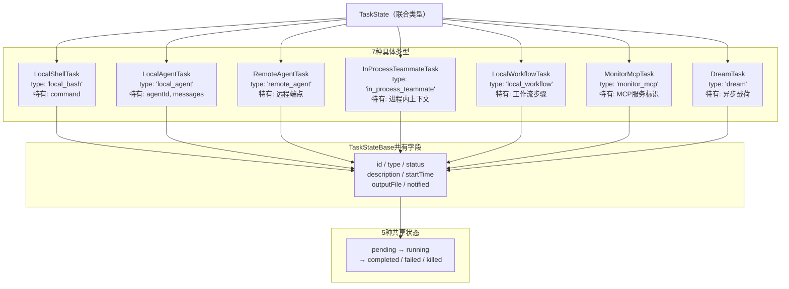
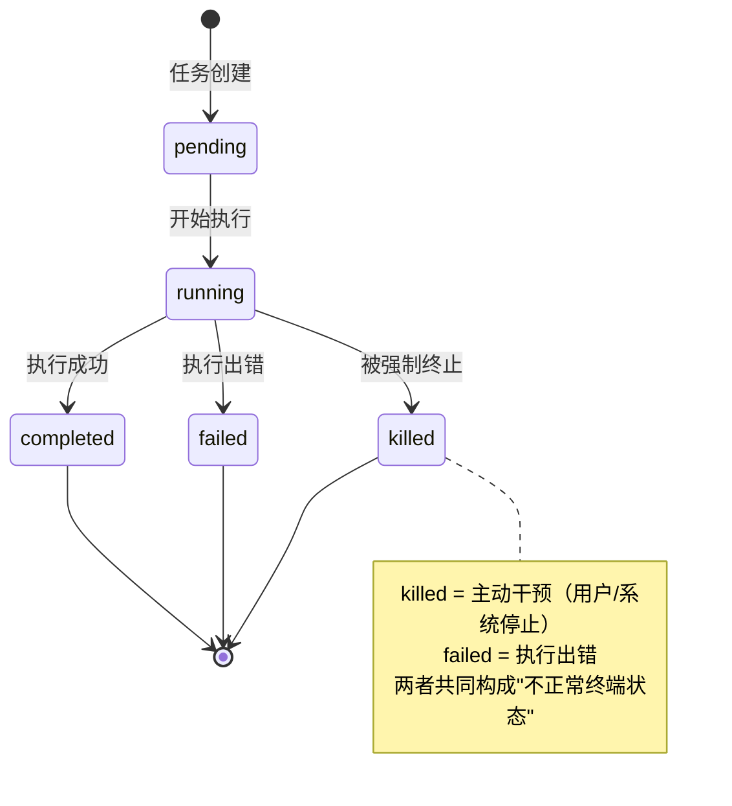
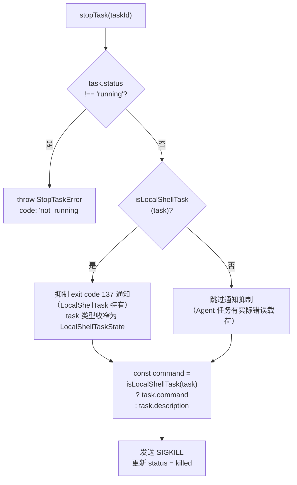

# 第 29 章：7 种任务类型的状态机——Task 系统设计

> "联合类型不是一种技巧，而是一种承诺——你的类型系统将和你的业务逻辑同步演化。"

当一个 AI Agent 同时运行 Bash 脚本、派生子 Agent、监控 MCP 服务，这 7 种完全不同的任务需要被同一个 `AppState.tasks` 字典管理——既能用同一个 `task.status` 查询运行状态，又能在 Bash 任务上访问 `command` 字段、在 Agent 任务上访问 `agentId` 字段，且两者不能混用。

这是一个**辨别联合类型状态机（Discriminated Union State Machine）**的教科书案例——用公共辨别字段（`type` 字面量）让 TypeScript 自动收窄联合类型，让编译器代替运行时做字段访问安全检查。

Claude Code 用 46 行的 `types.ts` 管理这 7 种任务类型的完整类型宇宙，再用独立的 `guards.ts` 文件将类型守卫函数从 React 依赖中解耦。读完本章，我们将能复用这套模式——用联合类型替代类继承，在多态状态管理中获得编译期穷举保证。

---

## 问题：当 7 种"外形不同但生命周期相似"的任务需要统一管理

Claude Code 的后台任务系统面对一个典型的多态状态管理难题：7 种任务类型（Bash 进程、本地 Agent、远程 Agent、进程内队友、工作流、MCP 监控、Dream 异步任务）都有相同的生命周期状态（`pending → running → completed/failed/killed`），但它们的特有字段完全不同。

`AppState` 中存储的 `tasks` 是一个字典，UI 组件需要遍历所有任务显示状态栏。当 `TaskListV2.tsx` 渲染任务列表时，它需要知道：这个任务是否在后台运行？如果是 Bash 任务，要显示命令行；如果是 Agent 任务，要显示进度百分比。这个场景要求**统一遍历**和**差异化渲染**同时成立。

面对这种需求，工程师通常有两条路。第一条：用 class 继承——定义 `TaskBase` 基类，每种任务继承它并添加特有字段。这条路的问题是"基类膨胀"——随着任务类型增加，`TaskBase` 不断堆积各种可能为 `undefined` 的字段，直到变成一个什么都有但什么都不安全的"字段垃圾桶"。第二条：用**辨别联合类型（Discriminated Union Type）**——每种任务类型有唯一的 `type` 字面量字段，TypeScript 通过 `if/switch` 分支自动收窄到具体类型。

Claude Code 选择了第二条路，并将整个类型宇宙压缩到一个 46 行文件里。

**图 29-1：7种任务类型与共享状态机**



图 29-1 展示了这套架构的核心张力：7 种差异极大的任务类型，通过 `TaskStateBase` 共享生命周期字段，通过联合类型保持各自的特有字段边界清晰。

---

## 源码实例 1：46 行的类型宪法——`types.ts` + `Task.ts`

理解 Task 系统的起点是两个文件：`src/tasks/types.ts`（类型联合汇总，46 行）和 `src/Task.ts`（基础类型定义）。它们的关系是"类型积木"——`Task.ts` 定义基础砖块，`types.ts` 把 7 种砖块拼成完整的类型大厦。

先来看 `Task.ts` 定义的三块基础砖：

```typescript
// src/Task.ts:6
export type TaskType =
  | 'local_bash'
  | 'local_agent'
  | 'remote_agent'
  | 'in_process_teammate'
  | 'local_workflow'
  | 'monitor_mcp'
  | 'dream'
```

**源码参考：** `src/Task.ts:6-13`

`TaskType` 是 7 个字符串字面量的联合，而不是 enum。为什么选字面量联合而不是 enum？字面量联合无需 `import` 就能直接使用字符串值比较（如 `task.type === 'local_bash'`），序列化到 JSON 后依然可读，而 TypeScript enum 在编译后是数值或字符串的对象，需要显式导入。**字面量联合让类型系统的边界在序列化/反序列化的边界处保持透明**——这对需要持久化会话状态的 CLI 工具尤为重要。

第二块砖是 `TaskStatus`，5 种状态编码了任务的完整生命周期：

```typescript
// src/Task.ts:15
export type TaskStatus =
  | 'pending'
  | 'running'
  | 'completed'
  | 'failed'
  | 'killed'
```

**源码参考：** `src/Task.ts:15-20`

**图 29-2：TaskStatus 五状态机——任务生命周期流转**



**图 29-2：TaskStatus 五状态机。** `pending → running` 是唯一的前向转移；`completed/failed/killed` 是三个终端状态，均无法再流转。`isTerminalTaskStatus()` 将这三种状态统一处理，防止向已死亡的任务注入消息。

注意 `killed`（被强制终止）和 `failed`（执行失败）是不同的终端状态——这个区分有实际工程意义：`killed` 表示主动干预（用户或系统停止），`failed` 表示执行出错。`Task.ts:27` 的 `isTerminalTaskStatus()` 函数将这三种终端状态统一处理：

```typescript
/**
 * 当任务处于终端状态（不会再继续流转）时返回 true。
 * 用于防止向已死亡的 Teammate 注入消息、从 AppState 中驱逐已完成的任务
 * 以及孤儿清理路径。
 */
// src/Task.ts:27
export function isTerminalTaskStatus(status: TaskStatus): boolean {
  return status === 'completed' || status === 'failed' || status === 'killed'
}
```

**源码参考：** `src/Task.ts:27-29`

注释揭示了三个使用场景："防止向已死亡的 Teammate 注入消息"、"从 AppState 中驱逐已完成的任务"、"孤儿清理路径"——这是生产代码中对"终端状态"语义的精确定义，不是随意的 helper 函数。

第三块砖是所有任务类型共享的基础字段规范：

```typescript
// src/Task.ts:45
export type TaskStateBase = {
  id: string
  type: TaskType
  status: TaskStatus
  description: string
  toolUseId?: string
  startTime: number
  endTime?: number
  totalPausedMs?: number
  outputFile: string
  outputOffset: number
  notified: boolean
}
```

**源码参考：** `src/Task.ts:45-57`

**图 29-3：TaskStateBase 交叉类型组合——扁平结构 vs 继承链**

```mermaid
graph LR
    subgraph 交叉类型（TypeScript 选择）
        BASE2["TaskStateBase
{id, type, status, ...}"]
        SPECIFIC2["{ type: 'local_bash'
command: string }"]
        RESULT2["LocalShellTaskState
（扁平展开）"]
        BASE2 -->|"&amp;"| RESULT2
        SPECIFIC2 -->|"&amp;"| RESULT2
    end
    subgraph 继承链（OOP 方案）
        BASE1["TaskBase
{id, type, status, ...}"]
        CHILD1["LocalShellTask
extends TaskBase
{command: string}"]
        BASE1 -->|extends| CHILD1
    end
    RESULT2 -->|"支持 {...prevTask, status: 'x'}
不可变更新"| OK["✓ 适合 React 状态管理"]
    CHILD1 -->|"需考虑 prototype chain
运行时 instanceof"| WARN["⚠ 序列化后失效"]
```

**图 29-3：交叉类型 `&` 产生的扁平结构（左）vs 继承链（右）。** 扁平结构支持 `{ ...prevTask, status: 'completed' }` 不可变更新，无需考虑原型链；继承链在序列化/反序列化后 `instanceof` 检查失效。

`TaskStateBase` 不是 OOP 意义上的"父类"，而是一个**类型交叉操作（&）的公共因子**。它通过 `&`（交叉类型）而非 `extends`（继承）被各具体任务类型复用，这使得具体类型定义更扁平——无需继承链，每个 `XxxTaskState` 都是独立展开的类型，更便于 `{ ...prevTask, status: 'completed' }` 这样的不可变更新操作。

现在来看类型宇宙的"汇总点"，`tasks/types.ts` 的全文：

```typescript
// src/tasks/types.ts:12
export type TaskState =
  | LocalShellTaskState
  | LocalAgentTaskState
  | RemoteAgentTaskState
  | InProcessTeammateTaskState
  | LocalWorkflowTaskState
  | MonitorMcpTaskState
  | DreamTaskState
```

**源码参考：** `src/tasks/types.ts:12-19`

这 7 行就是整个 Task 系统的"辨别联合"。每个成员类型（如 `LocalShellTaskState`）内部都有 `type: 'local_bash'` 这样的字面量字段——这就是"辨别字段（discriminant）"，让 TypeScript 在看到 `if (task.type === 'local_bash')` 后，自动将 `task` 收窄为 `LocalShellTaskState`，从而允许访问 `task.command`。

`types.ts` 还定义了一个组合守卫函数，展示了联合类型的实际使用模式：

```typescript
// src/tasks/types.ts:37
export function isBackgroundTask(task: TaskState): task is BackgroundTaskState {
  if (task.status !== 'running' && task.status !== 'pending') {
    return false
  }
  // 前台任务（isBackgrounded === false）还不是"后台任务"
  // (Foreground tasks (isBackgrounded === false) are not yet "background tasks")
  if ('isBackgrounded' in task && task.isBackgrounded === false) {
    return false
  }
  return true
}
```

**源码参考：** `src/tasks/types.ts:37-46`

`isBackgroundTask` 的参数类型是 `TaskState`（联合类型），返回 `task is BackgroundTaskState`（类型谓词）。这意味着这个函数不需要知道具体是哪种任务——它只关心"共有字段"（`status`）和"鸭子类型"（`'isBackgrounded' in task`）。**联合类型允许我们在不知道具体类型的情况下，安全地对公共接口进行操作**。

**表 29-1：7 种任务类型对比**

| 类型字面量 | 对应类型 | 典型特有字段 | 使用场景 | 详细分析 |
|-----------|---------|------------|---------|---------|
| `local_bash` | `LocalShellTaskState` | `command: string`, `shellCommand` | 后台 Bash 进程 | 第 30 章 |
| `local_agent` | `LocalAgentTaskState` | `agentId`, `messages`, `retain` | 本地子 Agent 执行 | 第 30 章 |
| `remote_agent` | `RemoteAgentTaskState` | 远程端点标识 | 远程 Agent 执行 | 第 31 章 |
| `in_process_teammate` | `InProcessTeammateTaskState` | 进程内上下文 | Swarm 进程内队友 | 第 29 章 |
| `local_workflow` | `LocalWorkflowTaskState` | 工作流步骤状态 | 多步工作流编排 | — |
| `monitor_mcp` | `MonitorMcpTaskState` | MCP 服务标识 | MCP 服务监控 | — |
| `dream` | `DreamTaskState` | 异步载荷 | 后台异步任务 | 第 32 章 |

---

## 源码实例 2：`stopTask.ts`——类型守卫在生产中的三步舞

光有类型定义不够，我们来看这套类型系统在真实操作中如何被使用。`src/tasks/stopTask.ts` 是一个典型的"类型守卫消费者"——它需要安全地停止一个运行中的任务，并根据任务类型决定后续行为。

在读 `stopTask.ts` 之前，先注意一个"类型卫生"设计。`LocalShellTask` 的类型守卫函数 `isLocalShellTask` 并不定义在 `LocalShellTask.tsx` 里，而是在一个独立的 `guards.ts` 文件：

```typescript
// src/tasks/LocalShellTask/guards.ts:1-3
// LocalShellTask 状态的纯类型 + 类型守卫。
// 从 LocalShellTask.tsx 中提取，使非 React 消费者（stopTask.ts 通过
// print.ts）不必将 React/ink 引入模块依赖图。
```

**源码参考：** `src/tasks/LocalShellTask/guards.ts:1-3`

注释道出了设计原因：`LocalShellTask.tsx` 是一个 React 组件，引入了 Ink/React 依赖。而 `stopTask.ts` 是纯逻辑，不应该引入 React。如果 `isLocalShellTask` 定义在 `.tsx` 文件中，每个需要判断类型的纯逻辑文件都会被迫引入 React，污染模块依赖图。**把类型守卫函数提取到无依赖的 `guards.ts`，是一个保持模块边界清洁的主动设计决策**，而不是偶然的代码组织。

`isLocalShellTask` 的实现本身展示了类型守卫的标准写法：

```typescript
// src/tasks/LocalShellTask/guards.ts:34
export function isLocalShellTask(task: unknown): task is LocalShellTaskState {
  return (
    typeof task === 'object' &&
    task !== null &&
    'type' in task &&
    task.type === 'local_bash'
  )
}
```

**源码参考：** `src/tasks/LocalShellTask/guards.ts:34-39`

参数类型是 `unknown`（而非 `TaskState`），返回 `task is LocalShellTaskState`。这两处选择都值得细说：用 `unknown` 而非 `TaskState` 使得该函数可以在任何上下文使用，不局限于已经确认是 `TaskState` 的情况；用类型谓词（`task is LocalShellTaskState`）而非 `boolean` 使得 TypeScript 能够在调用点自动完成类型收窄。

现在来看 `stopTask.ts` 如何用这套工具实现**三步类型安全流程**：

```typescript
// src/tasks/stopTask.ts:50
if (task.status !== 'running') {
  throw new StopTaskError(
    `Task ${taskId} is not running (status: ${task.status})`,
    'not_running',
  )
}
```

**源码参考：** `src/tasks/stopTask.ts:50-55`

第一步：**状态守卫（Status Guard）**。在做任何操作之前，先确认任务处于可以被停止的状态（`'running'`）。注意异常类型 `StopTaskError`（`stopTask.ts:10`）携带了结构化的 `code` 字段（`'not_found' | 'not_running' | 'unsupported_type'`），让调用方能精确区分失败原因并做差异化处理。

```typescript
// src/tasks/stopTask.ts:70
if (isLocalShellTask(task)) {
  let suppressed = false
  setAppState(prev => {
    // 抑制 Bash 任务的 "exit code 137" 通知（噪音）
    // (suppress the "exit code 137" notification for bash tasks)
    const prevTask = prev.tasks[taskId]
    if (!prevTask || prevTask.notified) { return prev }
    suppressed = true
    return { ...prev, tasks: { ...prev.tasks,
      [taskId]: { ...prevTask, notified: true }
    }}
  })
}
```

**源码参考：** `src/tasks/stopTask.ts:70-85`

第二步：**类型守卫（Type Guard）**。`isLocalShellTask(task)` 之后，TypeScript 将 `task` 的类型从 `TaskStateBase` 自动收窄为 `LocalShellTaskState`。这个分支块内的后续代码知道这是一个 Bash 任务，所以抑制"exit code 137"通知——这是 Bash 任务特有的行为（Agent 任务不做这个抑制，因为它们有实际的错误载荷需要上报）。

```typescript
// src/tasks/stopTask.ts:97
const command = isLocalShellTask(task) ? task.command : task.description
```

**源码参考：** `src/tasks/stopTask.ts:97`

**图 29-4：stopTask.ts 三步类型安全流程**



**图 29-4：三步类型安全流程。** 第一步状态守卫（`status !== 'running'`）→ 第二步类型守卫（`isLocalShellTask`）→ 第三步类型收窄后字段访问（`task.command`）。每步都有明确的快速失败路径，不依赖运行时 duck typing。

第三步：**类型收窄后的字段访问**。三元表达式在 `isLocalShellTask(task)` 为 true 的分支里访问 `task.command`（`LocalShellTaskState` 特有字段），在 false 分支里回退到 `task.description`（`TaskStateBase` 共有字段）。**没有 `isLocalShellTask` 检查就直接访问 `task.command`，TypeScript 会拒绝编译**——这就是辨别联合类型状态机保证类型安全的机制。

`LocalAgentTask` 提供了第二个类型守卫实例，与 `isLocalShellTask` 相同结构但检查不同的辨别字段（`src/tasks/LocalAgentTask/LocalAgentTask.tsx:149`）：

```typescript
// src/tasks/LocalAgentTask/LocalAgentTask.tsx:149
export function isLocalAgentTask(task: unknown): task is LocalAgentTaskState {
  return typeof task === 'object' && task !== null
    && 'type' in task && task.type === 'local_agent';
}
```

**源码参考：** `src/tasks/LocalAgentTask/LocalAgentTask.tsx:149-151`

与 `isLocalShellTask` 的关键区别在于：`isLocalAgentTask` 定义在 `.tsx` 文件中（未提取到独立 `guards.ts`），因为 `LocalAgentTask.tsx` 的消费者本身就已经引入了 React。这说明"是否提取到 `guards.ts`"不是风格偏好，而是**由消费者的依赖约束决定的工程判断**

**图 29-5：守卫函数模块分离——依赖约束决定提取策略**

```mermaid
graph TD
    subgraph 需要解耦（LocalShellTask）
        GST["guards.ts
（纯类型，无框架依赖）
isLocalShellTask()"]
        STT["stopTask.ts
（纯逻辑）"] -->|import| GST
        PRN["print.ts
（纯逻辑）"] -->|import| GST
        LST["LocalShellTask.tsx
（React 组件）"] -->|import| GST
    end
    subgraph 不需要解耦（LocalAgentTask）
        LAT["LocalAgentTask.tsx
（React 组件）
含 isLocalAgentTask()"]
        QE["QueryEngine.tsx
（已有 React）"] -->|import| LAT
        UI["AgentTaskList.tsx
（已有 React）"] -->|import| LAT
    end
    note1["纯逻辑消费者 ← 需要解耦
守卫函数提取到 guards.ts"]
    note2["React 消费者 ← 无需解耦
守卫函数留在 .tsx 内"]
```

**图 29-5：依赖约束决定提取策略。** 左侧：`isLocalShellTask` 被纯逻辑文件（`stopTask.ts`）消费，必须提取到无依赖的 `guards.ts`。右侧：`isLocalAgentTask` 的消费者都已经引入了 React，无需额外解耦。——`stopTask.ts` 需要被纯逻辑文件引用，所以必须解耦；`LocalAgentTask.tsx` 的消费者大多是 React 组件，没有解耦压力。

---

## 模式剖析：辨别联合类型状态机的四个关键组成

现在我们看到了模式在 `types.ts`（类型定义）和 `stopTask.ts`（类型使用）两处的实例，可以提炼它的骨架。**辨别联合类型状态机（Discriminated Union State Machine）**由四个关键组成部分构成：

**一、辨别字段（Discriminant Field）**——公共的 `type` 字段，使用字符串字面量类型（`'local_bash'`、`'local_agent'`...）。这个字段是整个模式的"锁孔"，TypeScript 通过它识别具体成员类型。设计要点：`type` 字段必须是字面量类型（`string` 类型不行，`string` 无法辨别），且每个联合成员的字面量值互不相同。

**二、基础类型交叉（Base Type Intersection）**——`TaskStateBase` 通过 `&` 运算符与每个具体类型合并（如 `type LocalShellTaskState = TaskStateBase & { type: 'local_bash', command: string, ... }`）。这使得"共有字段修改"不需要继承链，直接 `{ ...prevTask, status: 'completed' }` 的展开操作就能安全更新任意任务类型。

**三、类型守卫函数（Type Guard Function）**——`task is XxxTaskState` 形式的类型谓词，将运行时检查和编译时收窄绑定在同一个函数里。消费者调用一次函数，同时获得两个效果：运行时确认类型正确、编译时解锁特有字段访问。

**四、联合汇总文件（Union Aggregation File）**——`tasks/types.ts` 作为单一入口，将所有具体类型的联合 `export` 出去。这使得 UI 组件只需要 `import { TaskState }` 一个类型，不需要知道所有 7 种具体类型的存在。

这四个部分的关系是：辨别字段定义"能识别谁"，基础交叉定义"共有什么"，守卫函数定义"如何安全访问"，联合汇总文件定义"对外暴露什么"。任何一部分缺失，整个模式就退化为不安全的字段访问。

---

## 适用范围

| 场景 | 适用 | 理由 | 替代方案 |
|------|------|------|---------|
| 多种实体共享状态机（pending/running/completed）| ✓ | 联合类型自然表达多态，TypeScript 穷举检查保证不遗漏 | class 继承（穷举检查弱，基类容易膨胀）|
| 需要遍历所有类型、差异化渲染（如 UI 任务列表）| ✓ | `switch(task.type)` 配合 `default: never` 可获得编译时穷举保证 | `instanceof` 检查（序列化/反序列化后失效）|
| 状态数量固定、变化可控（7 种类型，少量扩展）| ✓ | 新增类型只需扩展联合，TSC 会自动标出所有未覆盖的 `switch` 分支 | 动态注册表（Map + Constructor）|
| 需要热插拔任务类型（运行时插件注册）| ✗ | 联合类型是编译时静态的，无法运行时动态扩展 | 策略模式（Strategy）+ 运行时 Map 注册 |
| 任务类型超过 20 种，或特有字段极多（50+）| ✗（谨慎）| 联合类型增多会降低 TypeScript LSP 推断速度（推断），调试变复杂 | 按功能域拆分多个独立联合，或改用 class 继承 |
| 实体间有复杂行为多态（不同类型执行逻辑差异大）| ✗ | 辨别联合管理的是"数据多态"（字段访问），不擅长管理"行为多态" | GoF 策略模式或命令模式管理执行逻辑差异 |

---

## 权衡与局限

**联合类型的最大维护陷阱**：`TaskType`（`src/Task.ts:6`）和 `TaskState`（`src/tasks/types.ts:12`）是两处独立的定义，新增一种任务类型需要**同步修改两处**——先在 `Task.ts` 扩展 `TaskType` 字面量联合，再在 `types.ts` 扩展 `TaskState` 联合。TypeScript 编译器不会自动发现"你扩展了 `TaskType` 但忘记更新 `types.ts`"——因为两者通过字面量字符串而非类型引用关联，编译器看到的是两个独立的联合。这是这个模式最容易产生 bug 的位置。

**性能影响**：联合类型数量增加会影响 TypeScript 语言服务（Language Service）的类型推断速度（推断）。7 种类型时这个影响可忽略，但如果 Task 系统将来扩展到 20+ 种类型，可以考虑将 `TaskState` 拆分为多个功能域的子联合，避免所有消费者都引入完整联合。

**与 enum 的对比**：为什么用字面量联合而不是 TypeScript enum？三个原因：一，字面量联合的值（如 `'local_bash'`）直接写进 JSON 持久化数据，无需任何转换函数；二，enum 在编译后是对象，需要 import，字面量联合是纯类型，tree-shaking 更友好；三，字面量联合在 type narrowing 中比 enum 有更好的类型推断支持（推断）。

**类继承 vs. 交叉类型**：`TaskStateBase` 用 `&` 而不是 `extends`，这使得具体任务状态是"扁平结构"而非"继承链"。好处是 `{ ...prevTask, status: 'completed' }` 这样的不可变更新操作不需要考虑 prototype chain；代价是 IDE 的"查看继承关系"功能不再适用——需要用全局搜索 `& TaskStateBase` 来找到所有实现。

---

## 与已知模式的对话

识别辨别联合类型状态机的最好方法，是找到它和"最相似的假朋友"之间的分界线。

**与 GoF 状态模式（State Pattern）**：两者都解决多态状态管理问题，但角度完全相反。GoF 状态模式的核心是"**行为多态**"——不同状态下，同一个方法调用触发不同行为（`context.handle()` 在 `StateA` 和 `StateB` 下执行不同逻辑）。辨别联合类型状态机的核心是"**数据多态**"——不同类型下，可以安全访问不同的字段集合（`LocalShellTask` 有 `command`，`LocalAgentTask` 有 `agentId`）。`TaskState` 管理的是"你是什么"（字段访问权限），不是"你能做什么"（行为执行）——行为多态由各 `tasks/XxxTask/` 目录下的执行逻辑负责（详见第 30 章）。

**与函数式代数数据类型（Algebraic Data Type, ADT）**：TypeScript 的辨别联合是 Haskell/Rust 中"和类型（Sum Type）"的不完整实现。Rust 的 `enum` 和 Haskell 的 `data` 类型提供了完整的 ADT 语义（包括模式匹配编译时穷举），TypeScript 通过 `switch(task.type) + default: never` 近似实现穷举检查，但没有原生模式匹配语法。如果你熟悉 Rust enum，`TaskState` 就是 TypeScript 版的 `enum Task { LocalBash { command: String }, LocalAgent { agentId: String }, ... }`。

| 模式 | 多态类型 | 核心关注 | 扩展方式 | TypeScript 支持 |
|------|---------|---------|---------|----------------|
| GoF 状态模式 | 行为多态 | 状态下的方法调用 | 新增 State 类 | class + interface |
| GoF 策略模式 | 行为多态 | 算法/执行逻辑替换 | 新增 Strategy 类 | class + interface |
| **辨别联合状态机** | **数据多态** | **字段访问安全** | 扩展联合 + 守卫函数 | discriminated union + 类型谓词 |
| 函数式 ADT | 数据多态 | 模式匹配穷举 | 扩展 enum/data | 原生支持（Rust/Haskell）|

---

## 模式提炼

### 辨别联合类型状态机（Discriminated Union State Machine）

**解决的问题**：系统有多种"外形不同但生命周期相似"的实体，需要统一管理又保证类型安全，class 继承会导致基类膨胀。

**核心做法**：用公共辨别字段（`type` 字符串字面量）+ 联合类型，让 TypeScript 在 `if/switch` 分支中自动收窄到具体类型，守卫函数将运行时检查和编译时收窄绑定在一起。

**前置条件**：语言支持字面量类型和类型谓词（TypeScript、Rust enum、Kotlin sealed class 等）；实体类型集合在编译时已知（不需要运行时动态注册）。

**源码证据**：`src/tasks/types.ts:12`（TaskState 联合）、`src/Task.ts:6`（TaskType 字面量）、`src/tasks/LocalShellTask/guards.ts:34`（类型守卫）

---

### 守卫函数模块分离（Guard Function Module Isolation）

**解决的问题**：类型守卫函数被多个消费者使用，但某些消费者（如纯逻辑文件）不能引入特定依赖（如 React/Ink），直接在原模块中定义守卫会污染依赖图。

**核心做法**：将类型守卫函数提取到独立的 `guards.ts` 文件，只引入纯类型依赖，无框架/UI 依赖。

**前置条件**：存在跨依赖边界的类型守卫消费者（纯逻辑文件需要使用 UI 模块定义的类型守卫）。

**源码证据**：`src/tasks/LocalShellTask/guards.ts:1-3`（注释说明提取原因）

---

### 状态前置条件守卫（Status Precondition Guard）

**解决的问题**：对有状态实体的操作有前置状态要求，状态不满足时需要快速失败并说明具体原因，而非抛出模糊异常。

**核心做法**：操作函数入口处先做状态检查，抛出携带结构化 `code` 字段的自定义异常（`StopTaskError.code: 'not_found' | 'not_running' | 'unsupported_type'`）。

**前置条件**：有明确的"操作前置状态"语义；调用方需要区分不同失败原因。

**源码证据**：`src/tasks/stopTask.ts:50`（状态守卫）、`src/tasks/stopTask.ts:10`（StopTaskError 结构化错误）

---

## 你能做什么

- **用字面量联合（而非 enum）定义系统中的实体类型**。`type EntityType = 'bash' | 'agent' | 'workflow'` 而不是 `enum EntityType { Bash, Agent, Workflow }`。字面量联合的值直接可读、可序列化、无需 import，对 CLI 工具和需要持久化状态的系统尤为适合。

- **用交叉类型（&）而非继承（extends）组合基础字段**。`type LocalShellTaskState = TaskStateBase & { type: 'local_bash', command: string }` 的扁平结构支持 `{ ...prevTask, status: 'completed' }` 不可变更新，比继承链更适合 React/函数式状态管理。

- **将类型守卫函数提取到独立的 `guards.ts` 文件**，只有在消费者本身已经有框架依赖时，才将守卫函数保留在组件文件中。纯逻辑消费者（如 `stopTask.ts`）需要无依赖的守卫函数——提前设计这个边界，比事后解耦省力。

- **为操作函数设计结构化错误类型**（`StopTaskError.code: 'not_found' | 'not_running' | 'unsupported_type'`），让调用方能精确区分失败原因。字面量联合同样适用于错误码——比数字错误码更可读，比字符串错误码更类型安全。

- **用 `switch(task.type) + default: never` 实现穷举检查**。当新增任务类型时，所有遗忘处理的 `switch` 语句会在编译时报错，让编译器代替人工审查找到遗漏点。这是辨别联合类型状态机最重要的使用技巧。

- **维护 `TaskType`（基础字面量联合）和 `TaskState`（完整联合汇总）的同步性**。在本项目中，扩展任务类型需要同步修改 `src/Task.ts:6` 和 `src/tasks/types.ts:12` 两处——用注释或 TODO 标记这个维护约定，或在 CI 中加入检查脚本，避免两处不同步的 bug。

---

第 30 章，深入 `LocalAgentTask` 和 `LocalShellTask`**，看每种任务类型如何在本章建立的类型骨架上构建具体的执行逻辑——类型定义是"结构合同"，执行逻辑是"行为合同"，两者共同构成一个完整的任务类型。
