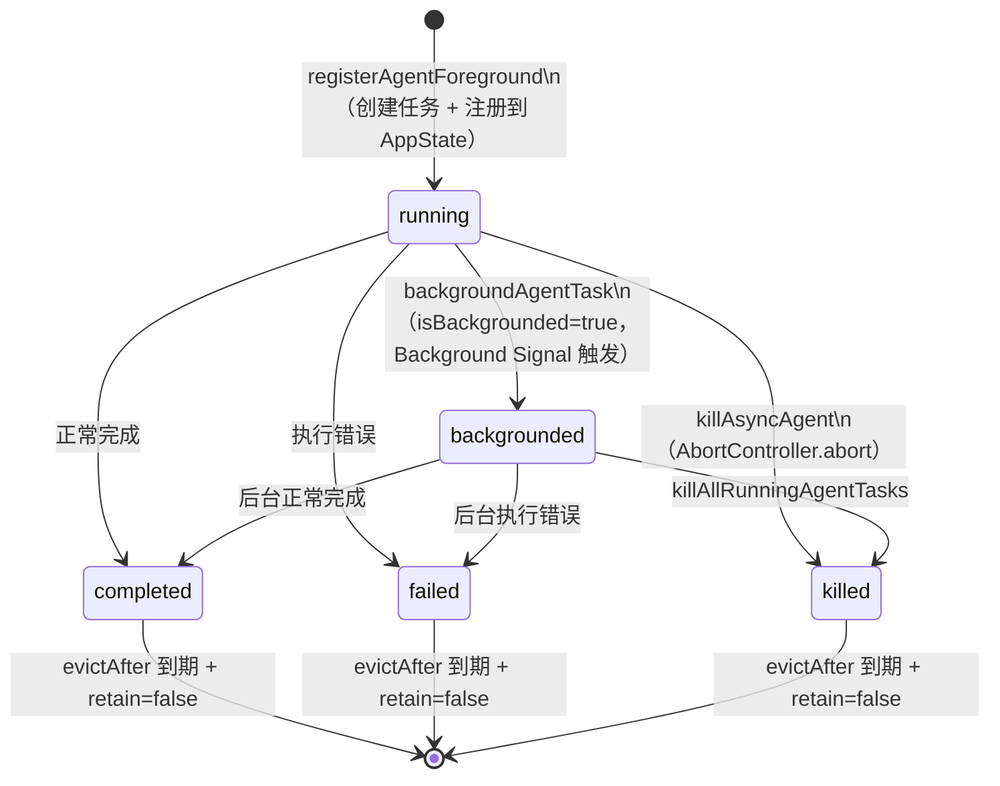

# 第 30 章：LocalAgentTask——子 Agent 的进程模型与 I/O 协议

> "每个 Agent 是一个独立的宇宙——有自己的历史、自己的边界，也有自己的终点。"

---

当用户把一个复杂任务交给 Claude Code 时，系统可能会启动多个子 Agent 并行工作。每个子 Agent 不是一次简单的函数调用——它是一个有完整生命周期的实体：从创建到运行，可能切换到后台，最终完成或失败。用户在主交互界面继续工作时，后台的子 Agent 还在默默执行，完成后通过状态栏的 pill 通知用户。

这一切由 `LocalAgentTask` 管理——一个包含 20+ 字段的状态容器，以及围绕它的一套生命周期函数。核心设计模式是**子进程 Agent 隔离**（Sub-process Agent Isolation）：每个 Agent 有独立的消息历史、独立的 AbortController、独立的后台信号机制——互相不干扰，父 Agent 通过 `taskId` 而非直接引用追踪子 Agent。

读完本章，你将理解：为什么 `retain` 和 `isBackgrounded` 是两个不同的字段、后台信号如何用 Promise 实现、以及为什么 `evictAfter` 时间戳比"任务完成就立即回收"更合理。

---

## 问题：子 Agent 不是函数调用，是有生命周期的实体

一次简单的 AI 调用（如 `queryModel`）可以用 Promise 表达：发起请求，等待结果，处理输出。但一个子 Agent 的生命周期要复杂得多：

- 创建时需要初始化独立的消息历史和 AbortController
- 运行时可能产生流式输出，需要实时推送到 UI
- 用户可能在任务完成前决定"把它放到后台"
- 后台任务完成后，需要在不影响当前操作的情况下通知用户
- 任务完成后，消息历史不应立即回收，因为用户可能还在查看

这些需求催生了 `LocalAgentTaskState` 的 20+ 个字段。状态定义在 `src/tasks/LocalAgentTask/LocalAgentTask.tsx:116`：

```typescript
// src/tasks/LocalAgentTask/LocalAgentTask.tsx:116-147（简化）
export type LocalAgentTaskState = TaskStateBase & {
  type: 'local_agent'
  agentId: string
  prompt: string
  selectedAgent?: AgentDefinition
  agentType: string
  model?: string
  abortController?: AbortController  // 独立的取消控制器
  messages?: Message[]               // 独立的消息历史
  retrieved: boolean
  lastReportedToolCount: number
  lastReportedTokenCount: number
  isBackgrounded: boolean            // 是否已从前台移至后台
  pendingMessages: string[]          // 会话中途队列的消息
  // UI 正在持有此任务：阻止回收、启用流式追加、触发磁盘 bootstrap
  retain: boolean
  // 一次性的磁盘加载标志：retain 周期内只执行一次
  diskLoaded: boolean
  // 面板可见性截止时间。undefined=运行中或被 retain；
  // 时间戳=超过此时间后可被 GC 回收
  evictAfter?: number
}
```

**源码参考：** `src/tasks/LocalAgentTask/LocalAgentTask.tsx:116`

`LocalAgentTaskState` 继承自 `TaskStateBase`，后者包含了所有任务类型共享的基础字段：`id`、`type`、`status`（pending/running/completed/failed/killed）、`description`、`startTime`、`endTime`、`outputFile`（任务输出文件路径）等。`LocalAgentTaskState` 在此基础上扩展了子 Agent 特有的字段。

**图 30-1：LocalAgentTask 生命周期状态图**



注意 `backgrounded` 不是一个最终状态，而是一个中间状态——后台运行的任务仍会迁移到 completed/failed/killed。`evictAfter` 是真正的回收门控，确保任务进入终态后不被立刻从内存清除。

---

## 源码实例 1：LocalAgentTaskState 字段的工程语义

`registerAgentForeground` 是创建前台 Agent 任务的主入口，它展示了各字段的初始值和设计意图（`src/tasks/LocalAgentTask/LocalAgentTask.tsx:526`）：

```typescript
// src/tasks/LocalAgentTask/LocalAgentTask.tsx:553-580（简化）
const taskState: LocalAgentTaskState = {
  ...createTaskStateBase(agentId, 'local_agent', description, toolUseId),
  type: 'local_agent',
  status: 'running',
  agentId,
  prompt,
  selectedAgent,
  agentType: selectedAgent.agentType ?? 'general-purpose',
  abortController,           // 独立创建的 AbortController
  unregisterCleanup,         // 进程退出时的清理函数
  retrieved: false,
  lastReportedToolCount: 0,
  lastReportedTokenCount: 0,
  isBackgrounded: false,     // 初始为前台运行
  pendingMessages: [],       // 初始消息队列为空
  retain: false,             // 初始未被 UI 持有
  diskLoaded: false          // 初始磁盘未加载
}
```

**源码参考：** `src/tasks/LocalAgentTask/LocalAgentTask.tsx:553`

三组字段反映了三个不同的工程关注点：

**独立执行隔离**：`abortController` 是为每个任务独立创建的，不与父会话或其他子任务共享。这意味着取消一个子 Agent 不会影响父 Agent 或兄弟 Agent——每个任务有自己的取消边界。`messages` 字段也是独立的，记录该子 Agent 的完整对话历史，与主会话的消息历史完全分离。

**UI 可见性控制**（第 141 行）：`retain` 和 `isBackgrounded` 是两个容易混淆但语义完全不同的字段：

```
retain = "UI 正在持有这个任务"（正在查看 → 阻止回收）
isBackgrounded = "任务不在前台 UI 焦点中"（已后台 → 仍在运行）
```

注释原文说明了 `retain` 的三个作用：
> "UI is holding this task: blocks eviction, enables stream-append, triggers disk bootstrap"
> （UI 正在持有此任务：阻止回收、启用流式追加、触发磁盘 bootstrap）

`retain = true` 意味着：① 任务即使已完成也不设置 `evictAfter`（不启动 GC 倒计时）；② 新产生的消息可以通过流式追加（stream-append）进入 UI，不需要全量刷新；③ 若 `diskLoaded = false`，触发从磁盘读取任务历史的 bootstrap 操作。

**延迟回收（GC 延迟）**：`evictAfter` 是一个时间戳（毫秒），含义是"在这个时间点之后，任务可以被 GC 回收"。任务进入终态时（完成/失败/杀死），会设置 `evictAfter = Date.now() + 某个延迟`，而不是立即标记为可回收。这给 UI 足够的时间显示"任务已完成"的状态，让用户能看到结果通知，然后再清理。当用户重新选中该任务（触发 `retain = true`）时，`evictAfter` 会被清除。

`diskLoaded`（第 141 行）是一次性的延迟加载标志——当用户在 UI 中打开一个历史 Agent 任务时，消息历史需要从磁盘（JSONL 文件）加载。`diskLoaded = false` 表示尚未加载，`retain` 变为 `true` 时触发一次性加载，加载完成后设置 `diskLoaded = true`，防止重复读取。

`isPanelAgentTask`（第 159 行）展示了一个简单的 UI 路由逻辑：

```typescript
// src/tasks/LocalAgentTask/LocalAgentTask.tsx:159-164
export function isPanelAgentTask(t: unknown): t is LocalAgentTaskState {
  return isLocalAgentTask(t) && t.agentType !== 'main-session';
}
```

**源码参考：** `src/tasks/LocalAgentTask/LocalAgentTask.tsx:159`

注释说明这是"所有 pill/panel 过滤器必须一致的唯一断言"——panel 和状态栏 pill 两种 UI 展示方式用同一个谓词区分，保证了显示逻辑的一致性。`agentType === 'main-session'` 的任务是主会话本身，不需要在面板中展示；其他所有子 Agent 任务（`general-purpose`、`task` 等）都通过面板管理。

---

## 源码实例 2：backgroundAgentTask——后台信号机制

`backgroundAgentTask` 不是"暂停任务"，而是把任务从前台 UI 焦点移除，同时通知任务循环"可以转入后台模式了"（`src/tasks/LocalAgentTask/LocalAgentTask.tsx:620`）：

```typescript
// src/tasks/LocalAgentTask/LocalAgentTask.tsx:620-650（简化）
export function backgroundAgentTask(
  taskId: string,
  getAppState: () => AppState,
  setAppState: SetAppState
): boolean {
  const task = getAppState().tasks[taskId]
  if (!isLocalAgentTask(task) || task.isBackgrounded) {
    return false  // 已经后台化或不存在，幂等
  }

  // 更新状态：标记为已后台化
  setAppState(prev => ({
    ...prev,
    tasks: { ...prev.tasks, [taskId]: { ...prev.tasks[taskId], isBackgrounded: true } }
  }))

  // 解析后台信号 Promise，通知 Agent 循环
  const resolver = backgroundSignalResolvers.get(taskId)
  if (resolver) {
    resolver()
    backgroundSignalResolvers.delete(taskId)
  }
  return true
}
```

**源码参考：** `src/tasks/LocalAgentTask/LocalAgentTask.tsx:620`

后台化操作分两步：**状态更新**（`setAppState`，让 UI 知道任务不在前台了）和**信号发送**（`resolver()`，让 Agent 循环知道可以切换行为）。这两步是解耦的——状态更新是异步的（React 状态更新批处理），而信号发送是同步的（立即 resolve Promise）。

背后的机制是 `backgroundSignalResolvers` Map（第 519 行）。在 `registerAgentForeground` 中，每个任务都会创建一个 `backgroundSignal: Promise<void>`，其 resolve 函数被存储在 `backgroundSignalResolvers` Map 中：

```typescript
// src/tasks/LocalAgentTask/LocalAgentTask.tsx:574-578
const backgroundSignal = new Promise<void>(resolve => {
  resolveBackgroundSignal = resolve
})
backgroundSignalResolvers.set(agentId, resolveBackgroundSignal!)
```

**源码参考：** `src/tasks/LocalAgentTask/LocalAgentTask.tsx:574`

`backgroundSignal` Promise 被传递给 Agent 执行循环，循环可以执行 `await Promise.race([agentCompletion, backgroundSignal])`——要么 Agent 正常完成，要么用户触发后台化信号。当 `backgroundAgentTask` 被调用时，`resolver()` 立即 resolve 这个 Promise，Agent 循环检测到信号，切换到后台行为模式（如不再主动向 UI 推送输出，只在状态栏 pill 中更新进度）。

`killAllRunningAgentTasks`（第 309 行）是批量终止的实现：

```typescript
// src/tasks/LocalAgentTask/LocalAgentTask.tsx:309-315
export function killAllRunningAgentTasks(
  tasks: Record<string, TaskState>,
  setAppState: SetAppState
): void {
  for (const [taskId, task] of Object.entries(tasks)) {
    if (task.type === 'local_agent' && task.status === 'running') {
      killAsyncAgent(taskId, setAppState)
    }
  }
}
```

**源码参考：** `src/tasks/LocalAgentTask/LocalAgentTask.tsx:309`

这是 ESC 键取消协调器模式下所有子 Agent 的操作——遍历所有任务，对 `type === 'local_agent' && status === 'running'` 的任务调用 `killAsyncAgent`（触发 `abortController.abort()`）。过滤条件精确：只杀运行中的本地 Agent，不影响 Shell 任务、已完成的任务、或后台任务（注意：`isBackgrounded = true` 的任务 `status` 仍然是 `'running'`，所以后台任务也会被杀死）。

**图 30-2：后台信号机制的数据流**

```mermaid
sequenceDiagram
    participant UI as 用户界面
    participant Task as LocalAgentTask
    participant Loop as Agent 执行循环

    UI->>Task: registerAgentForeground()
    Task->>Task: new Promise(resolve => resolvers.set(agentId, resolve))
    Task-->>Loop: backgroundSignal (Promise)
    Loop->>Loop: await Promise.race([completion, backgroundSignal])
    Note over Loop: 运行中...
    UI->>Task: backgroundAgentTask(taskId)
    Task->>Task: setAppState(isBackgrounded=true)
    Task->>Task: resolvers.get(taskId)()  // resolve
    Task-->>Loop: backgroundSignal resolved
    Loop->>Loop: 切换为后台模式
    Loop->>Task: 完成时 updateTaskState(status=completed)
```

## 进程间通信协议——父子 Agent 的 I/O 边界设计

至此我们已经理解了子 Agent 的生命周期和后台信号机制。但还有一个关键问题没有回答：**父 Agent 如何把任务交给子 Agent？子 Agent 完成后如何把结果送回给父 Agent？** 这是多 Agent 系统的通信协议问题——如果没有清晰的 I/O 边界设计，父子之间就无法可靠地交换信息。

`LocalAgentTask` 用两条单向通道解决这个问题：一条从父到子（输入通道），一条从子到父（输出通道）。两条通道的数据格式、传输机制和消费方式各不相同。

### 父→子输入通道：初始 prompt + pendingMessages 队列

子 Agent 的输入分两个阶段：**创建时的初始 prompt** 和**运行中的后续消息队列**。

初始 prompt 在 `registerAsyncAgent`（或 `registerAgentForeground`）时作为字段写入 `LocalAgentTaskState`（`src/tasks/LocalAgentTask/LocalAgentTask.tsx:491`）：

```typescript
// src/tasks/LocalAgentTask/LocalAgentTask.tsx:488-502（简化）
const taskState: LocalAgentTaskState = {
  ...createTaskStateBase(agentId, 'local_agent', description, toolUseId),
  agentId,
  prompt,           // ← 初始任务描述，子 Agent 执行循环的第一个用户消息
  selectedAgent,
  isBackgrounded: true,
  pendingMessages: [],  // ← 初始为空，运行中可追加
  ...
}
```

**源码参考：** `src/tasks/LocalAgentTask/LocalAgentTask.tsx:491`

运行中的后续消息通过 `queuePendingMessage` 追加（`src/tasks/LocalAgentTask/LocalAgentTask.tsx:162`）：

```typescript
// src/tasks/LocalAgentTask/LocalAgentTask.tsx:162-166
export function queuePendingMessage(
  taskId: string,
  msg: string,
  setAppState: (f: (prev: AppState) => AppState) => void
): void {
  updateTaskState<LocalAgentTaskState>(taskId, setAppState, task => ({
    ...task,
    pendingMessages: [...task.pendingMessages, msg]
  }));
}
```

**源码参考：** `src/tasks/LocalAgentTask/LocalAgentTask.tsx:162`

子 Agent 执行循环调用 `drainPendingMessages` 批量消费（`src/tasks/LocalAgentTask/LocalAgentTask.tsx:181`）：

```typescript
// src/tasks/LocalAgentTask/LocalAgentTask.tsx:181-191
export function drainPendingMessages(
  taskId: string,
  getAppState: () => AppState,
  setAppState: (f: (prev: AppState) => AppState) => void
): string[] {
  const task = getAppState().tasks[taskId];
  if (!isLocalAgentTask(task) || task.pendingMessages.length === 0) {
    return [];    // 无新消息，幂等返回
  }
  const drained = task.pendingMessages;
  updateTaskState<LocalAgentTaskState>(taskId, setAppState, t => ({
    ...t,
    pendingMessages: []    // 清空队列（原子性：读取 + 清空 in one update）
  }));
  return drained;
}
```

**源码参考：** `src/tasks/LocalAgentTask/LocalAgentTask.tsx:181`

注释中明确了 `queuePendingMessage` 和 `appendMessageToLocalAgent` 的语义区别（第 171-173 行）：

> "queuePendingMessage and resumeAgentBackground route the prompt to the agent's API input but don't touch the display."

即：`queuePendingMessage` 把消息路由到 Agent 的 **API 输入**（作为后续用户轮次）；`appendMessageToLocalAgent` 把消息追加到 **显示 transcript**（让 UI 立即展示）。两者操作的是同一个任务的不同面，互不干扰。

### 子→父输出通道：XML 结构化通知消息

子 Agent 完成时，通过 `enqueueAgentNotification` 把结果编码为一条 **XML 结构化消息**，注入父 Agent 的命令队列（`src/tasks/LocalAgentTask/LocalAgentTask.tsx:197`）：

```typescript
// src/tasks/LocalAgentTask/LocalAgentTask.tsx:252-262（message 组装）
const message = `<${TASK_NOTIFICATION_TAG}>
<${TASK_ID_TAG}>${taskId}</${TASK_ID_TAG}>${toolUseIdLine}
<${OUTPUT_FILE_TAG}>${outputPath}</${OUTPUT_FILE_TAG}>
<${STATUS_TAG}>${status}</${STATUS_TAG}>
<${SUMMARY_TAG}>${summary}</${SUMMARY_TAG}>${resultSection}${usageSection}${worktreeSection}
</${TASK_NOTIFICATION_TAG}>`;
enqueuePendingNotification({
  value: message,
  mode: 'task-notification'
});
```

**源码参考：** `src/tasks/LocalAgentTask/LocalAgentTask.tsx:252`

XML 标签名定义在 `src/constants/xml.ts`：

| 常量名 | XML 标签 | 含义 |
|--------|---------|------|
| `TASK_NOTIFICATION_TAG` | `task-notification` | 通知消息根节点 |
| `TASK_ID_TAG` | `task-id` | 子 Agent 的任务 ID |
| `TOOL_USE_ID_TAG` | `tool-use-id` | 对应父 Agent 发起的工具调用 ID |
| `OUTPUT_FILE_TAG` | `output-file` | 任务 transcript 文件路径（JSONL） |
| `STATUS_TAG` | `status` | `completed` / `failed` / `killed` |
| `SUMMARY_TAG` | `summary` | 人类可读的完成摘要 |
| `<result>` | `result` | 子 Agent 的最终输出文本 |
| `<usage>` | `usage` | token 数、工具调用数、耗时 |
| `<worktree>` | `worktree` | 可选的 git worktree 路径/分支 |

一条完整的成功通知消息格式如下：

```xml
<task-notification>
  <task-id>agent-abc123</task-id>
  <tool-use-id>toolu_01xyz</tool-use-id>
  <output-file>/home/user/.claude/projects/.../agent-abc123.jsonl</output-file>
  <status>completed</status>
  <summary>Agent "修复单元测试" completed</summary>
  <result>所有 12 个测试用例已修复，根因是类型断言不匹配。</result>
  <usage>
    <total_tokens>8432</total_tokens>
    <tool_uses>7</tool_uses>
    <duration_ms>23450</duration_ms>
  </usage>
</task-notification>
```

这条 XML 消息被 `enqueuePendingNotification` 以 `mode: 'task-notification'` 写入共享命令队列（`commandQueue`，见 `src/utils/messageQueueManager.ts:142`）。父 Agent 的主循环订阅该队列（通过 React 的 `useSyncExternalStore`），收到通知后解析 XML，把子 Agent 的完成结果作为一条工具响应（tool result）注入父 Agent 的对话历史——从父 Agent 的模型视角看，一个子任务工具调用终于有了返回值。

**防止重复通知**是这个通道的关键设计细节。`enqueueAgentNotification` 用原子性的 `notified` 标志检查是否已发送过（第 220-231 行）：

```typescript
// src/tasks/LocalAgentTask/LocalAgentTask.tsx:220-231
let shouldEnqueue = false;
updateTaskState<LocalAgentTaskState>(taskId, setAppState, task => {
  if (task.notified) {
    return task;       // 已通知过，幂等跳过
  }
  shouldEnqueue = true;
  return { ...task, notified: true };
});
if (!shouldEnqueue) return;
```

**源码参考：** `src/tasks/LocalAgentTask/LocalAgentTask.tsx:220`

这个原子检查解决了并发问题：任务完成时可能同时有「正常完成」路径和「TaskStopTool 强制停止」路径都试图发送通知，`notified` 标志确保只有第一个成功的路径发送消息，后续调用静默忽略。

### 双向通道的完整数据流图

**图 30-3：父子 Agent I/O 通道的完整数据流**

```
                     ┌─────────────────────────────┐
                     │         父 Agent 循环         │
                     │  (parent model + tool loop)  │
                     └──────┬──────────────▲─────────┘
                            │              │
          ①初始prompt       │              │ ④XML通知消息
          写入taskState     │              │ 从commandQueue消费
                            │              │
                     ┌──────▼──────────────┴─────────┐
                     │     LocalAgentTaskState        │
                     │  prompt: string                │
                     │  pendingMessages: string[]     │←── ③ queuePendingMessage()
                     │  notified: boolean             │
                     │  messages: Message[]           │
                     └──────┬──────────────▲─────────┘
                            │              │
          ②drainPending     │              │ ⑤enqueueAgentNotification()
          Messages()        │              │ → enqueuePendingNotification()
                            │              │   → commandQueue (mode:'task-notification')
                     ┌──────▼──────────────┴─────────┐
                     │         子 Agent 循环          │
                     │  (child model + tool loop)    │
                     └─────────────────────────────┘
```

**①②** 是初始输入通道：父 Agent 创建任务时把 `prompt` 写入状态，子 Agent 循环启动后读取并作为第一个用户消息传给模型。**③** 是运行时追加输入通道（可选）：父 Agent 可在子 Agent 运行中通过 `queuePendingMessage` 向其追加消息，子 Agent 通过 `drainPendingMessages` 定期消费。**④⑤** 是输出通道：子 Agent 完成（无论成功/失败/停止）时用 `enqueueAgentNotification` 把 XML 通知注入 `commandQueue`，父 Agent 的 React 订阅接收后解析，更新对话历史。

**为什么用 XML 而不是 JSON？**（推断）父 Agent 的上下文是自然语言 + 结构化文本的混合体。XML 标签可以直接嵌入模型的对话流，模型能理解 `<task-notification>` 的语义，而 JSON 需要额外的解析层。这与 Claude Code 整体使用 XML 标签作为模型-工具通信协议的风格一致。

---

## 模式剖析：子进程 Agent 隔离的四个维度

**子进程 Agent 隔离**模式在四个维度上保证了 Agent 间的独立性：

**1. 执行隔离**：每个 `LocalAgentTaskState` 有独立的 `abortController` 和 `messages`。取消一个 Agent 不影响其他 Agent；一个 Agent 的消息历史不会泄漏给兄弟 Agent。

**2. ID 关联而非引用关联**：父 Agent 通过 `taskId`（字符串 ID）追踪子 Agent，而非持有直接引用。状态统一存储在 `AppState.tasks` Map 中，任何组件都可以通过 ID 查询任务状态，不需要在组件树中传递任务引用。

**3. 可见性与执行的解耦**：`isBackgrounded` 控制 UI 可见性，`status` 控制执行状态——两个正交维度。后台任务（`isBackgrounded = true, status = 'running'`）既不在前台 UI，又仍在运行；完成的前台任务（`isBackgrounded = false, status = 'completed'`）在前台 UI 但已停止执行。

**4. 延迟回收（Deferred GC）**：`evictAfter` 时间戳确保任务状态在终态后仍然短暂保留，让 UI 有时间展示完成通知，让用户有时间查看结果。这比"完成就立刻删除"更符合用户体验，比"永不删除"更符合内存管理。

---

## 适用范围

| 场景 | 适用性 | 理由 | 替代方案 |
|------|--------|------|---------|
| 需要并行执行多个独立 AI 任务 | ✓ | 每个 LocalAgentTask 有独立状态，互不干扰 | 串行执行（低延迟但总耗时长）|
| 需要将长时间任务后台化 | ✓ | isBackgrounded + backgroundSignal 支持前后台切换 | 阻塞等待（体验差）|
| 任务可能需要从历史恢复 | ✓ | diskLoaded + retain 支持延迟加载 transcript | 无持久化（崩溃后历史丢失）|
| 简单的单次 AI 查询（无生命周期）| ✗ | 20+ 字段的状态容器开销不合算 | 直接调用 queryModel()，用 Promise 处理 |
| 需要任务间共享消息历史 | ✗ | LocalAgentTask 设计为隔离，共享需要额外机制 | 通过父 Agent 转发消息 |

---

## 权衡与局限

**权衡 1：状态字段数量 vs 封装复杂性**

`LocalAgentTaskState` 有 20+ 个字段，每个字段对应一个具体的工程需求——但这也意味着每次创建任务都需要初始化所有字段，每次修改任务状态都需要展开（spread）整个对象（React 的不可变状态更新）。字段越多，spread 的成本越高，代码的认知负担也越重。替代方案是将字段分组为嵌套对象（如 `uiState: { retain, isBackgrounded, evictAfter }`），但这会增加更新的语法复杂度，当前设计选择了扁平化。

**权衡 2：backgroundSignal 的一次性语义**

`backgroundSignalResolvers` Map 存储的 resolve 函数在调用后被立即删除（`resolvers.delete(taskId)`）。这意味着后台信号只能触发一次——任务一旦后台化，就无法用同样的机制"重新前台化"（恢复前台）。重新前台化需要单独的机制（`retain = true` 重新触发）。背后的设计假设是：后台化是单向的，一个 Agent 任务不会在前台/后台之间反复切换。

**权衡 3：evictAfter 的延迟回收 vs 内存压力**

`evictAfter` 延迟了 GC，在短时间内让已完成的任务状态保留在内存中。对于长时间运行的会话（数十个子 Agent 并发完成），这可能在 GC 窗口期内积累大量已完成任务的消息历史（可能每个任务数 MB 的 messages 数组）。`evictAfter` 的延迟时长（推断：几十秒到几分钟）决定了这个内存压力的持续时间。

**权衡 4：`isBackgrounded` 和 `status` 的双维度复杂性**

两个字段描述任务的"当前状态"，但从不同角度：`status` 是执行状态，`isBackgrounded` 是 UI 可见性状态。任何需要判断"任务是否仍在运行"的代码都需要同时考虑两个字段——`status === 'running'` 涵盖了前台运行和后台运行。`killAllRunningAgentTasks` 用 `status === 'running'` 过滤，会同时杀死前台和后台任务，这是预期行为，但也可能让开发者不注意时杀掉本想保留的后台任务。

---

## 与已知模式的对话

**与 Actor 模型（Erlang/Akka）**：Actor 模型中，每个 Actor 是独立的并发单元，有独立的消息队列，通过消息传递通信。`LocalAgentTask` 的设计几乎完全遵循 Actor 模型的原则——独立状态、独立执行、通过 ID 而非引用关联。关键差异在于通信机制：Actor 模型通过异步消息队列，`LocalAgentTask` 通过 `AppState`（React 状态树，同步更新）。`pendingMessages` 字段提供了有限的消息队列语义，但不是完整的 Actor 邮箱。

**与进程监督树（Supervisor Tree，Erlang OTP）**：监督树中，父进程负责监控和重启子进程。`LocalAgentTask` 的 `killAllRunningAgentTasks` 和 `unregisterCleanup` 机制实现了"父 Agent 可以终止子 Agent"的监督能力，但没有重启语义——失败的子 Agent 会进入 `status = 'failed'`，不会自动重启，等待用户决定是否重新执行。

**与 Promise/Future 模式**：最简单的子 Agent 设计是返回一个 Promise（await 它完成）。`backgroundSignal` 就是这种 Promise 思路的扩展——把"完成信号"和"后台化信号"组合成 `Promise.race`，让 Agent 循环既能等待自然完成，也能响应用户的后台化操作。这是 Promise 模式在"可中断异步操作"场景下的自然演进。

---

## 模式提炼

### 子进程 Agent 隔离（Sub-process Agent Isolation）

**解决的问题**：多个并发 AI Agent 需要独立的消息历史、独立的取消控制，以及独立的 UI 可见性管理，不能共享状态。

**核心做法**：为每个 Agent 创建独立的 `LocalAgentTaskState` 容器（包含独立的 `messages`、`abortController`、`isBackgrounded`），通过 `taskId`（字符串 ID）而非直接引用关联，统一存储在 `AppState.tasks` Map 中。

**前置条件**：有集中式的状态管理（如 AppState）能容纳所有任务；任务有唯一 ID；有 `registerTask/updateTaskState` 框架支撑。

**源码证据**：`src/tasks/LocalAgentTask/LocalAgentTask.tsx:116`（`LocalAgentTaskState` 定义，独立的 messages 和 abortController）；`src/tasks/LocalAgentTask/LocalAgentTask.tsx:553`（`registerAgentForeground` 中独立创建 abortController）

---

### Promise 信号（Promise Signal）

**解决的问题**：需要让异步操作循环能响应外部的"切换模式"请求（如前台→后台），而不是轮询状态变量。

**核心做法**：创建一个 Promise，将其 resolve 函数存储在 Map 中；异步操作循环 `await Promise.race([completion, signal])`；外部触发时调用 `resolver()`，立即 resolve 信号 Promise，循环响应。

**前置条件**：异步操作循环可以 `await` 信号；信号触发后循环有对应的行为分支（切换后台模式）。

**源码证据**：`src/tasks/LocalAgentTask/LocalAgentTask.tsx:574`（`backgroundSignal = new Promise`）；`src/tasks/LocalAgentTask/LocalAgentTask.tsx:643`（`resolver()` 在 `backgroundAgentTask` 中触发信号）

---

## 你能做什么

- **为每个并发 Agent 创建独立的 `AbortController` 和消息历史**，不共享。取消一个不影响其他，消息历史也不会互相污染。

- **区分 UI 可见性（`isBackgrounded`）和执行状态（`status`）**：任务"不在前台显示"和"任务已停止"是两回事，用两个正交字段分别控制，让代码意图更清晰。

- **用 `Promise.race([completion, signal])` 实现可中断的异步循环**。为每个可被外部信号打断的长时间任务创建一个信号 Promise，外部触发时 resolve 它，循环立即响应，而不是每次迭代都检查状态变量。

- **用 `evictAfter` 时间戳实现延迟 GC**，而非立即回收终态任务。给 UI 足够的窗口展示完成状态、给用户足够的时间查看结果，然后再回收。

- **通过 ID 而非引用追踪子任务**，把所有任务状态统一存储在中央 Map 中。任何组件都可以按 ID 查询，不需要在组件树中传递任务引用，也不需要维护引用的生命周期。

- **为 UI 持有（retain）和可见性（isBackgrounded）分别建模**：`retain = true` 意味着"我在看，请保留消息历史和阻止 GC"；`isBackgrounded = true` 意味着"任务在后台，不要占据前台 UI"。两者独立，可以有 `retain=true, isBackgrounded=true` 的状态（用户打开了已后台的任务的历史视图）。

---

LocalAgentTask 管理的是本机内进程的子 Agent。当子 Agent 需要在远程机器上运行时，交互协议变得更复杂——这是第 31 章 RemoteAgentTask 的主题（详见第 31 章）。
