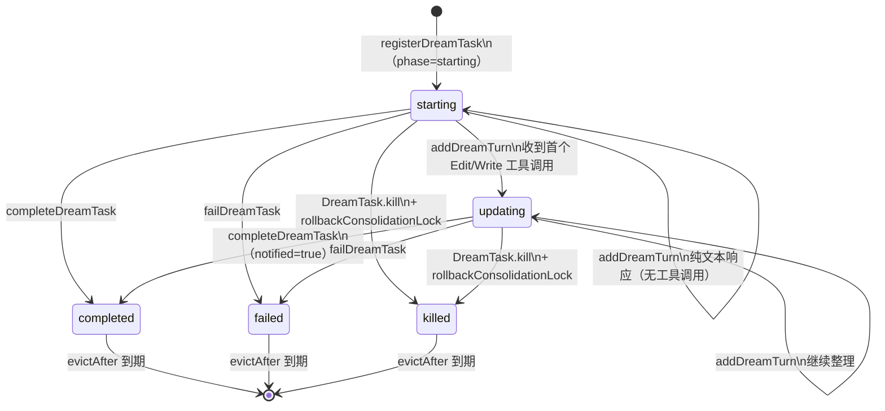

# 第 32 章：DreamTask——后台自主执行的设计意图

> "让看不见的工作变得可见，但不干扰它的运行。"

---

当 Claude Code 在会话结束后触发一次"记忆整理"——回顾历史会话、提炼关键信息、写入记忆文件——这件事在默认情况下对用户完全不可见。它在后台安静地运行，用户无法知道进度，出错也不会收到任何反馈。

`DreamTask` 解决的不是"如何执行整理"，而是"如何让这个整理过程可见"。文件头注释直接说明了设计意图：

> "Makes the otherwise-invisible forked agent visible in the footer pill and Shift+Down dialog. The dream agent itself is unchanged — this is pure UI surfacing via the existing task registry."
> （让本来不可见的派生 Agent 在状态栏 pill 和 Shift+Down 对话框中可见。Dream Agent 本身未被修改——这是通过现有任务注册表实现的纯 UI 呈现。）

这就是**后台任务透明化**（Background Task Transparency）模式：不修改后台任务的逻辑，只在任务框架层创建一个"观察者对象"来代理其状态，让现有 UI 基础设施自动接管显示。读完本章，你将理解为什么 `filesTouched` 字段被标注为"不完整"、为什么 kill 时需要回滚锁的 mtime，以及"空操作短路"如何避免无效的 React 重渲染。

---

## 问题：自主后台任务的可见性真空

用户触发的任务（打开文件、运行命令）天然有"触发点"——用户知道自己做了什么，等着结果就行。Agent 自主触发的后台任务（如记忆整理）没有这个触发点：用户没有主动请求，也没有界面反馈。

这产生了三个问题：
- **无进度**：用户不知道整理还在运行还是已经卡住了
- **无失败通知**：任务崩溃了没有任何提示，用户以为它没运行
- **无审计**：用户想知道"整理时改了哪些文件"，没有任何记录

一个直觉上的解决方案是修改后台 Agent，让它主动推送状态。但这侵入了后台逻辑，增加了耦合，也让后台 Agent 的测试变得复杂。`DreamTask` 选择了另一条路：**利用现有的 TaskState 框架，创建一个纯 UI 层的代理对象**——后台 Agent 照常运行，DreamTask 只在 AppState 中注册一个 `type: 'dream'` 的状态节点，现有的任务 UI（状态栏 pill、Shift+Down 对话框）自动把它显示出来。

`DreamTaskState` 的类型定义在 `src/tasks/DreamTask/DreamTask.ts:25`：

```typescript
// src/tasks/DreamTask/DreamTask.ts:25-41
export type DreamTaskState = TaskStateBase & {
  type: 'dream'
  phase: DreamPhase         // 'starting' | 'updating'（首次 Edit/Write 后翻转）
  sessionsReviewing: number  // 本次整理审查的会话数量
  /**
   * 通过 Edit/Write 工具调用观察到的路径。这是记忆 Agent 实际修改内容的
   * 不完整反映——它遗漏了通过 bash 间接执行的写操作，只捕获我们模式匹配的
   * 工具调用。当作"至少触碰了这些文件"，而不是"只触碰了这些文件"。
   */
  filesTouched: string[]
  /** 助手文本响应，工具调用折叠为计数。Prompt 不包含在内。 */
  turns: DreamTurn[]
  abortController?: AbortController
  /** 存储以供 kill 时回退 lock mtime（与 fork 失败同一路径）。 */
  priorMtime: number
}
```

**源码参考：** `src/tasks/DreamTask/DreamTask.ts:25`

注释中 `filesTouched` 的说明是这个设计最诚实的部分——它明确标注了自己是"不完整的"（INCOMPLETE），并解释了为什么不完整：后台 Agent 可能通过 bash 命令间接写入文件，这类写操作不会产生可模式匹配的工具调用事件，因此无法被 DreamTask 捕获。**对不完整的信息诚实标注**，让下游的 UI 消费者知道这个字段的边界，而不是错误地把它当作完整的修改记录。

**图 32-1：DreamTask 生命周期**



两个 phase 的语义值得注意：`starting` 表示整理刚开始、还在读取历史（没有写操作）；`updating` 表示整理已经进入写入阶段（收到了第一个 Edit/Write 工具调用）。UI 层用这个 phase 区分显示文字（"正在读取历史会话"vs"正在更新记忆文件"），让用户看到更有意义的进度描述。

---

## 源码实例 1：registerDreamTask 与状态初始化

`registerDreamTask` 创建初始状态并注入到 AppState（`src/tasks/DreamTask/DreamTask.ts:52`）：

```typescript
// src/tasks/DreamTask/DreamTask.ts:52-73
export function registerDreamTask(
  setAppState: SetAppState,
  opts: {
    sessionsReviewing: number
    priorMtime: number        // 整理锁的当前 mtime，kill 时用于回滚
    abortController: AbortController
  },
): string {
  const id = generateTaskId('dream')
  const task: DreamTaskState = {
    ...createTaskStateBase(id, 'dream', 'dreaming'),
    type: 'dream',
    status: 'running',
    phase: 'starting',         // 初始阶段：等待第一个写操作
    sessionsReviewing: opts.sessionsReviewing,
    filesTouched: [],          // 初始为空：还没有写操作
    turns: [],
    abortController: opts.abortController,
    priorMtime: opts.priorMtime,  // 存储以备 kill 时回滚
  }
  registerTask(task, setAppState)
  return id
}
```

**源码参考：** `src/tasks/DreamTask/DreamTask.ts:52`

`priorMtime` 是这里最关键的字段——它存储了记忆整理锁文件（`consolidationLock`）在整理开始之前的 mtime（修改时间戳）。为什么需要这个值？

记忆整理系统使用文件锁来防止并发整理：整理开始时更新锁文件的 mtime，完成时再次更新。如果整理被中断（用户强制 kill），锁文件的 mtime 会停留在"整理进行中"的状态，导致下次启动时认为整理仍在运行而跳过。`priorMtime` 记录了整理开始之前的原始 mtime，kill 时用它把锁文件恢复到整理之前的状态，让下一次会话可以重新尝试整理。

`createTaskStateBase` 提供的 `description: 'dreaming'` 是 UI 中显示的任务名称——这个简短的词描述了整理任务的自主性，而不是一个技术性的函数名。

---

## 源码实例 2：addDreamTurn 的增量更新与空操作短路

`addDreamTurn` 是 DreamTask 的心跳函数——每当后台 Agent 产生一个助手消息或工具调用，都会调用它更新状态（`src/tasks/DreamTask/DreamTask.ts:76`）：

```typescript
// src/tasks/DreamTask/DreamTask.ts:76-102
export function addDreamTurn(
  taskId: string,
  turn: DreamTurn,
  touchedPaths: string[],
  setAppState: SetAppState,
): void {
  updateTaskState<DreamTaskState>(taskId, setAppState, task => {
    const seen = new Set(task.filesTouched)
    // 去重：只保留尚未记录的新路径
    const newTouched = touchedPaths.filter(p => !seen.has(p) && seen.add(p))

    // 空操作短路：turn 为空且无新 touched 路径时直接返回原 task
    // 避免对纯 no-op 触发重渲染
    if (
      turn.text === '' &&
      turn.toolUseCount === 0 &&
      newTouched.length === 0
    ) {
      return task  // 返回相同引用 → React 跳过重渲染
    }

    return {
      ...task,
      // 首次收到 Edit/Write 工具调用时翻转 phase
      phase: newTouched.length > 0 ? 'updating' : task.phase,
      filesTouched: newTouched.length > 0
        ? [...task.filesTouched, ...newTouched]
        : task.filesTouched,
      // 滚动窗口：保留最近 MAX_TURNS=30 轮
      turns: task.turns.slice(-(MAX_TURNS - 1)).concat(turn),
    }
  })
}
```

**源码参考：** `src/tasks/DreamTask/DreamTask.ts:76`

三个设计细节：

**空操作短路**（第 85 行）：当 turn 完全为空（text 为空字符串，toolUseCount 为 0）且没有新的 touched 路径时，函数直接返回原来的 `task` 对象（同一引用），而不是返回一个展开的新对象（`{ ...task }`）。在 React 状态管理中，返回同一引用等于"状态未变化"——React 会跳过重渲染。这个优化避免了后台 Agent 每产生一个空响应都触发一次 UI 更新的浪费。

**去重累积**（`seen` Set）：`filesTouched` 是已触碰路径的累积列表，但同一个路径可能被 Agent 多次编辑。用 `Set` 过滤重复路径，确保列表里每个路径只出现一次，避免 UI 展示"同一文件被触碰了 5 次"的冗余信息。

**滚动窗口**（第 101 行）：`task.turns.slice(-(MAX_TURNS - 1)).concat(turn)` 是经典的滚动窗口实现——保留最近的 `MAX_TURNS=30` 个 turn，超出的旧 turn 被丢弃。对于一个可能运行数十轮的整理 Agent，保留全量历史既无必要（UI 只显示最近几轮）又占用内存，30 轮是展示意义和内存开销之间的折中。

`completeDreamTask` 在终态时设置 `notified: true` 而非等待通知系统（`src/tasks/DreamTask/DreamTask.ts:106`）：

```typescript
// src/tasks/DreamTask/DreamTask.ts:106-119（含注释）
export function completeDreamTask(taskId: string, setAppState: SetAppState): void {
  // notified: true 立即设置——dream 没有面向模型的通知路径
  // （它是纯 UI），而 eviction 需要 terminal + notified。
  // 内联的 appendSystemMessage 完成备注就是用户可见的界面。
  updateTaskState<DreamTaskState>(taskId, setAppState, task => ({
    ...task,
    status: 'completed',
    endTime: Date.now(),
    notified: true,            // 立即设为 true，跳过通知队列
    abortController: undefined,
  }))
}
```

**源码参考：** `src/tasks/DreamTask/DreamTask.ts:106`

`notified: true` 的即时设置是一个绕过通知流程的设计。通常，任务完成后系统会等待"通知已发送"才允许 GC 回收任务状态。DreamTask 没有独立的通知路径——它是"纯 UI"任务，完成时通过 `appendSystemMessage` 在对话中追加一条系统消息，而不走通知队列。直接设置 `notified: true` 告诉 GC 框架：不需要等通知，任务已经完成了它的工作。

`DreamTask.kill` 实现了状态回滚语义（`src/tasks/DreamTask/DreamTask.ts:132`）：

```typescript
// src/tasks/DreamTask/DreamTask.ts:132-157（简化）
async kill(taskId, setAppState) {
  let priorMtime: number | undefined
  updateTaskState<DreamTaskState>(taskId, setAppState, task => {
    if (task.status !== 'running') return task  // 已终态，幂等
    task.abortController?.abort()               // 取消 Agent 执行
    priorMtime = task.priorMtime                // 提取存储的原始 mtime
    return { ...task, status: 'killed', endTime: Date.now(), notified: true, abortController: undefined }
  })
  // 回滚 consolidation lock，让下次会话可以重试
  // （updateTaskState 为 no-op 时，priorMtime 仍为 undefined，跳过）
  if (priorMtime !== undefined) {
    await rollbackConsolidationLock(priorMtime)
  }
}
```

**源码参考：** `src/tasks/DreamTask/DreamTask.ts:132`

`kill` 操作的特殊之处在于：除了中止 Agent 执行（`abortController.abort()`），还需要回滚文件锁的 mtime。注释说明这和"fork 失败时的 catch 路径"相同——系统中的错误恢复路径（整理启动但 fork 失败）和用户强制终止路径（整理运行中被 kill）使用了同一个恢复机制，这是代码复用的好例子。`priorMtime !== undefined` 的检查保证了幂等性：如果任务在 kill 时已经处于终态（`updateTaskState` 返回原对象，priorMtime 未被赋值），就不会重复回滚锁。
---

## 源码实例 3：自主触发机制——三道门禁与权限边界

DreamTask 的 UI 层是被动透明化，但它的**触发机制**是主动自主的。`src/services/autoDream/autoDream.ts` 的文件头注释清晰描述了这个三重门禁：

```
// Gate order (cheapest first):
//   1. Time: hours since lastConsolidatedAt >= minHours (one stat)
//   2. Sessions: transcript count with mtime > lastConsolidatedAt >= minSessions
//   3. Lock: no other process mid-consolidation
```
（来源：`src/services/autoDream/autoDream.ts:4-8`）

默认阈值由 `DEFAULTS` 常量定义：`minHours: 24`（至少间隔 24 小时）、`minSessions: 5`（至少积累 5 个新会话）。这两个阈值可通过 GrowthBook Feature Flag `tengu_onyx_plover` 动态覆盖——运行时而非编译期。三道门禁按"代价最低优先"排序：时间检查只需读一个文件 mtime，会话计数需要目录扫描，锁检查需要原子文件操作。这是**资源递进门禁**（Progressive Resource Gate）模式：把最廉价的守卫排在最前面，让大多数"不满足条件"的判断在第一步就被过滤掉。

**权限边界**：Dream Agent 启动时被注入 `createAutoMemCanUseTool(memoryRoot)`（`src/services/autoDream/autoDream.ts:227`），这个函数定义了其工具权限策略：

- **Read/Grep/Glob**：不受限制（只读）
- **Bash**：只允许通过 `BashTool.isReadOnly()` 检验的命令
- **Edit/Write**：仅允许路径在 `memoryRoot`（自动记忆目录）内的写操作

```typescript
// src/services/extractMemories/extractMemories.ts:167-171
/**
 * Creates a canUseTool function that allows Read/Grep/Glob (unrestricted),
 * read-only Bash commands, and Edit/Write only for paths within the
 * auto-memory directory. Shared by extractMemories and autoDream.
 */
export function createAutoMemCanUseTool(memoryDir: string): CanUseToolFn
```

这是**硬编码写入隔离**（Write Scope Isolation）模式：自主 Agent 在路径层面被约束，即使其提示词被劫持或产生幻觉，也无法将修改写出到 `memoryRoot` 之外的文件。这是自主性（autonomy）与安全性（safety）之间的工程妥协——Dream Agent 的行为自由度被路径白名单硬约束，不通过 PermissionMode 协商，而是通过 `canUseTool` 过滤器静默拒绝越界操作。


---

## 模式剖析：后台任务透明化的四个原则

**后台任务透明化**模式体现了四个相互支撑的原则：

**1. 非侵入式观察**：DreamTask 不修改后台 Agent 的任何逻辑——它只在 Agent 产生特定事件时（工具调用、消息完成）被回调，把这些事件转化为 DreamTaskState 的更新。后台 Agent 可以独立测试，不依赖 DreamTask 的存在。

**2. 不完整性的显式声明**：`filesTouched` 的注释明确说明"这是不完整的反映"，并解释了为什么（bash 间接写入无法捕获）。这种设计哲学是：**展示不完整但有用的信息，比不展示任何信息更好；但必须标注不完整性，让使用者知道边界**。

**3. 最小渲染开销**：`addDreamTurn` 的空操作短路确保了只有真正有新信息时才触发 UI 更新。滚动窗口（MAX_TURNS=30）控制了状态大小。DreamTask 是后台任务，不应该消耗过多前台资源。

**4. 完整的生命周期关闭**：kill 时的 `rollbackConsolidationLock` 确保系统状态在任务中止后是一致的——不会留下"孤儿锁"阻止下次整理。每个状态转变（完成/失败/kill）都立即设置 `notified: true`，确保 GC 可以回收状态，不会内存泄漏。

---

## 适用范围

| 场景 | 适用性 | 理由 | 替代方案 |
|------|--------|------|---------|
| Agent 自主触发的后台操作需要 UI 可见 | ✓ | 不修改后台逻辑，只加 UI 代理层 | 直接修改后台 Agent（侵入性高）|
| 后台操作可能失败需要用户感知 | ✓ | failDreamTask 推送通知，用户能看到失败状态 | 静默失败（用户无感，难以诊断）|
| 后台操作输出需要完整审计 | ✗ | MAX_TURNS=30 会丢弃旧轮次，filesTouched 不完整 | 完整 transcript 记录（高存储成本）|
| 需要用户交互的后台任务 | ✗ | Dream 设计为完全自主，无交互接口 | 前台任务或带问答能力的任务类型 |
| 高频后台任务（每秒多次）| ✗（谨慎）| 每次 addDreamTurn 触发状态更新，虽有短路保护但高频调用仍有开销 | 批量聚合后更新 |

---

## 权衡与局限

**权衡 1：filesTouched 不完整性 vs 零记录**

只捕获 Edit/Write 工具调用的文件路径，遗漏了 bash 间接写入——这是实现复杂度和信息完整性的取舍。完整捕获所有文件写操作需要文件系统监控（类似 inotify/kqueue），在每次 addDreamTurn 时维护，成本高且跨平台复杂。当前实现选择了"捕获已知的工具调用路径"这一低成本方案，用注释标注了不完整性，让使用者自己判断是否够用。

**权衡 2：MAX_TURNS=30 的信息丢失**

整理 Agent 可能运行超过 30 轮（记忆整理任务有 4 个阶段：orient/gather/consolidate/prune，每个阶段可能有多轮对话）。MAX_TURNS=30 意味着用户在 Shift+Down 对话框里看到的历史只是最近 30 轮，之前的轮次已被丢弃。这对于"我想知道整理具体做了什么"的高级用户是信息损失，但对于"我只想知道整理是否正常完成"的普通用户是够用的。

**权衡 3：notified: true 的立即设置**

`completeDreamTask` 立即设置 `notified: true` 绕过了通知系统，这意味着如果 `appendSystemMessage` 在 completeDreamTask 之前失败，任务会被标记为"已通知完成"但用户实际上没有收到通知。当前实现假设 `appendSystemMessage` 足够可靠，不需要事务性保证。如果这个假设不成立，需要重新设计通知语义（推断）。

---

## 与已知模式的对话

**与 GoF 观察者模式（Observer Pattern）**：观察者模式中，观察者被动接收被观察对象的状态变化通知。DreamTask 也接收后台 Agent 的事件（`addDreamTurn` 被回调），但它不只是被动接收——它主动管理自己的生命周期（`completeDreamTask`、`kill` 时的锁回滚）。经典观察者是无状态的（只转发通知），DreamTask 是有状态的（维护 `phase`、`filesTouched`、`turns`），更接近**聚合代理**而非纯观察者。

**与 Sidecar 模式（POSA/微服务）**：Sidecar 是运行在主容器旁边的辅助容器，透明地增强主服务的能力（日志收集、监控、流量管理）而不修改主服务。DreamTask 是"应用状态层的 Sidecar"——它在 AppState 中为 Dream Agent 创建一个辅助状态对象，增加了 UI 可见性而不修改 Agent 本身。差异在于：网络层 Sidecar 通过网络代理流量，DreamTask 通过回调函数注入状态更新，是同进程内的"逻辑 Sidecar"。

**与命令溯源（Event Sourcing）中的快照（Snapshot）**：Event Sourcing 用快照压缩事件历史，避免重放全量事件。DreamTask 的 `turns` 滚动窗口与此类似——旧的 turn 被丢弃（"快照"只保留最近 30 个），新的 turn 增量追加。差异在于：Event Sourcing 的快照是为了重放（恢复状态），DreamTask 的滚动窗口是为了显示（UI 展示）——两者的目的不同，但机制相似。

---

## 模式提炼

### 后台任务透明化（Background Task Transparency）

**解决的问题**：Agent 自主触发的后台操作对用户完全不可见——无进度、无失败通知、无审计记录，出错时难以诊断。

**核心做法**：在 AppState 中注册一个代理状态对象（`DreamTaskState`），不修改后台 Agent，通过回调（`addDreamTurn`）把 Agent 的事件转化为代理对象的状态更新，现有 UI 框架自动接管显示；kill 时执行必要的状态回滚（`rollbackConsolidationLock`）。

**前置条件**：有统一的 TaskState 框架（多种类型共享 UI）；后台 Agent 有事件回调接口（`onMessage` 等）可以注入状态更新；后台操作有可回滚的"开始状态"（如 `priorMtime`）。

**源码证据**：`src/tasks/DreamTask/DreamTask.ts:1`（注释："The dream agent itself is unchanged — this is pure UI surfacing"）；`src/tasks/DreamTask/DreamTask.ts:154`（`rollbackConsolidationLock(priorMtime)` kill 时状态回滚）

---

### 空操作短路（No-Op Short Circuit）

**解决的问题**：高频的状态更新函数（如每轮 AI 响应都调用的 `addDreamTurn`）可能在内容未变时也触发昂贵的 UI 重渲染。

**核心做法**：在 `updateTaskState` 回调中检查是否所有字段都未变化，若是则直接返回原对象（同一引用），React 的浅比较检测到引用不变，跳过重渲染。

**前置条件**：状态更新框架支持"返回原对象=无变化"的语义（如 React 的 `setState`）；高频调用中确实存在大量空调用的情况。

**源码证据**：`src/tasks/DreamTask/DreamTask.ts:85`（`if (turn.text === '' && turn.toolUseCount === 0 && newTouched.length === 0) return task`，返回原对象跳过渲染）

---

## 你能做什么

- **用代理任务对象透明化后台 AI 操作**：不修改后台逻辑，只创建一个代理状态对象，通过回调注入事件。现有 UI 框架自动接管显示，后台 Agent 和 UI 层各自独立测试。

- **对不完整的信息诚实标注**：如果某个字段只捕获了部分信息（如"只捕获 Edit/Write，遗漏 bash 写入"），在注释中明确说明"INCOMPLETE，当作最小下界而非完整清单"。这比静默地展示不完整数据更有工程诚意。

- **在 `addXxxTurn` 中实现空操作短路**：当所有字段都未变化时，直接返回原对象引用而非 `{ ...task }`。这个一行检查能显著减少高频更新场景下的无效重渲染。

- **为后台状态实现滚动窗口（MAX_TURNS=N）**：长时间运行的后台任务不需要保留全量历史，UI 只展示最近 N 轮，超出的丢弃。N 的选择取决于"展示有意义"和"内存占用可接受"的平衡点。

- **在 kill 时回滚关键锁状态**：如果任务持有某种"进行中"标记（如文件锁 mtime），kill 时必须把它恢复到任务开始前的状态，让下次运行可以重试。把 `priorMtime` 这类"回滚材料"存入任务状态，确保 kill 函数有回滚所需的全部信息。

---

DreamTask 代表了 Agent 自主性的一个维度：系统自己决定什么时候做记忆整理。Swarm 多智能体协作则代表了另一个维度：多个 Agent 如何协调分工。第 33 章将从 Teammate 生命周期开始，展开 Swarm 架构的全景（详见第 33 章）。
