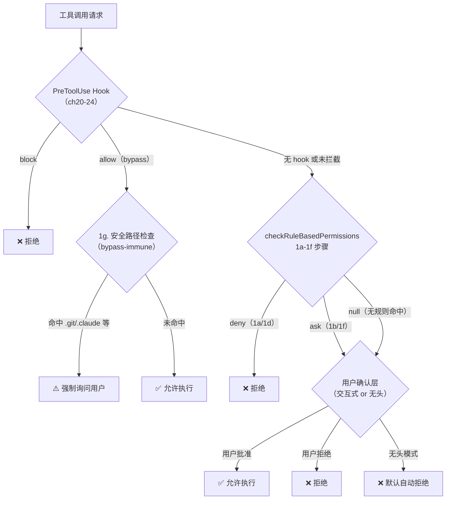

# 第 33 章：权限系统全景——拦截→规则→确认的三层防线

> "安全不是一扇门，而是三道门——每道门都以默认关闭为原则。"

---

Claude Code 执行一次工具调用前，至少要通过三道独立的安全检查：Hook 拦截层（PreToolUse 事件可以在第一时间阻止）、规则匹配层（`checkRuleBasedPermissions` 对比用户配置的允许/拒绝规则）、用户确认层（规则无法决策时弹出确认对话框）。

这不是"三道冗余的门"——每层有不同的检查维度，失守时有不同的降级策略。最关键的设计原则是：**任何一层无法做出决策时，不默认允许，而是向上委托**——直到用户手动确认，或在无人值守场景下自动拒绝。

这就是**分层安全防线**（Layered Security Fence）模式：责任分离 + 默认保守 + 层层委托，确保在没有明确规则命中时，系统选择最安全的行为而非最方便的行为。

读完本章，你将理解 `checkRuleBasedPermissions` 的 1a～1g 七步检查逻辑、`null` 返回值为何是"请求上层裁决"而非"允许通过"，以及为什么安全路径（`.git/`、`.claude/`）是 Hook 无法绕过的。

---

## 问题：单层权限检查的单点故障

最简单的权限系统是一个开关：检查一个规则列表，命中则允许，否则拒绝。这个设计的致命缺陷是单点故障——如果规则配置错误（如 glob 模式写错了），整个安全机制就失效了。

更深的问题是：权限决策的来源不只一种。用户可以配置静态规则（"始终允许 BashTool"）、工具可以有自己的动态检查逻辑（"BashTool 检查特定子命令是否危险"）、外部 Hook 可以在运行时拦截、某些路径（`.git/`、`.claude/` 配置目录）有内置的安全保护。把所有这些来源压缩进一个函数，会产生一个无法维护的巨型判断树。

三层防线把这些检查来源按照"拦截优先→规则次之→人工兜底"的顺序分开。注释在 `src/utils/permissions/permissions.ts:395` 中描述了最底层的兜底语义：

> "Runs PermissionRequest hooks for headless/async agents that cannot show permission prompts. This gives hooks an opportunity to allow or deny tool use before the fallback auto-deny kicks in."
> （为无法显示权限提示的无头/异步 Agent 运行 PermissionRequest 钩子。这给钩子一个机会来允许或拒绝工具使用，在默认自动拒绝启动之前。）

**默认自动拒绝**是系统的最终安全网——没有规则命中、没有用户确认机会时，系统选择拒绝而非允许。

**图 33-1：三层安全防线协同流程**



---

## 源码实例 1：checkRuleBasedPermissions 的七步分段检查

`checkRuleBasedPermissions` 是规则匹配层的核心（`src/utils/permissions/permissions.ts:1071`），返回类型是 `PermissionAskDecision | PermissionDenyDecision | null`：

```typescript
// src/utils/permissions/permissions.ts:1071-1157（简化）
export async function checkRuleBasedPermissions(
  tool: Tool,
  input: { [key: string]: unknown },
  context: ToolUseContext,
): Promise<PermissionAskDecision | PermissionDenyDecision | null> {
  const appState = context.getAppState()

  // 1a. 整个工具被规则拒绝
  const denyRule = getDenyRuleForTool(appState.toolPermissionContext, tool)
  if (denyRule) {
    return { behavior: 'deny', decisionReason: { type: 'rule', rule: denyRule }, message: `...` }
  }

  // 1b. 整个工具有"询问"规则
  const askRule = getAskRuleForTool(appState.toolPermissionContext, tool)
  if (askRule) {
    // 特殊情况：沙箱自动允许 Bash 跳过 ask 规则
    if (!canSandboxAutoAllow) {
      return { behavior: 'ask', decisionReason: { type: 'rule', rule: askRule }, message: `...` }
    }
    // 否则继续向下，让 tool.checkPermissions 处理命令级规则
  }

  // 1c. 工具特定权限检查（如 BashTool 的子命令规则）
  let toolPermissionResult: PermissionResult = { behavior: 'passthrough', ... }
  try {
    const parsedInput = tool.inputSchema.parse(input)
    toolPermissionResult = await tool.checkPermissions(parsedInput, context)
  } catch (e) { /* 非 AbortError 时记录但不抛出 */ }

  // 1d. 工具实现层拒绝（如 BashTool 子命令 deny）
  if (toolPermissionResult?.behavior === 'deny') {
    return toolPermissionResult
  }

  // 1f. 工具实现层返回内容级 ask 规则
  if (toolPermissionResult?.behavior === 'ask' &&
      toolPermissionResult.decisionReason?.type === 'rule' &&
      toolPermissionResult.decisionReason.rule.ruleBehavior === 'ask') {
    return toolPermissionResult
  }

  // 1g. 安全检查（.git/.claude/.vscode/shell 配置）——bypass 免疫
  // 即使 PreToolUse hook 返回了 allow，这些也必须提示
  if (toolPermissionResult?.behavior === 'ask' &&
      toolPermissionResult.decisionReason?.type === 'safetyCheck') {
    return toolPermissionResult
  }

  return null  // 无规则反对
}
```

**源码参考：** `src/utils/permissions/permissions.ts:1071`

七个步骤的排列顺序体现了明确的优先级：**工具级规则（1a/1b）优先于内容级规则（1f/1g）**。为什么？工具级规则是用户明确配置的（"不允许 BashTool"或"始终询问 EditTool"），比工具自己的内置检查更权威。如果用户明确禁止了 BashTool，就没有必要再让 BashTool 去检查子命令了——跳过 `checkPermissions` 节省了计算开销，也避免了两层规则之间的优先级歧义。

**1g 步骤（安全路径，bypass 免疫）**是整个系统中最特殊的设计。注释说：

> "bypass-immune — they must prompt even when a PreToolUse hook returned allow"

这意味着：即使用户配置了 PreToolUse hook 并返回了 `allow` 信号，对 `.git/`、`.claude/`、`.vscode/` 目录、shell 配置文件等路径的操作**仍然必须弹出确认对话框**。这是内置的"不可覆盖的安全保护"——防止 hook 配置错误（或恶意 hook）绕过对核心配置文件的保护。安全检查的类型标记（`type: 'safetyCheck'`）让调用方可以区分"这是普通的 ask"和"这是安全检查，必须保留"。

`createPermissionRequestMessage` 负责生成所有层次向用户展示的权限请求消息（`src/utils/permissions/permissions.ts:137`）：

```typescript
// src/utils/permissions/permissions.ts:137-180（简化）
export function createPermissionRequestMessage(
  toolName: string,
  decisionReason?: PermissionDecisionReason,
): string {
  if (decisionReason) {
    switch (decisionReason.type) {
      case 'hook':
        return `Hook '${decisionReason.hookName}' requires approval for this ${toolName} command`
      case 'rule':
        return `Permission rule '${ruleString}' from ${sourceString} requires approval...`
      case 'subcommandResults':
        // 子命令级别的消息...
    }
  }
  return `Claude wants to use ${toolName}. Do you approve?`  // 默认消息
}
```

**源码参考：** `src/utils/permissions/permissions.ts:137`

这个函数的存在是"一致性设计"的体现——所有层次（Hook 触发、规则触发、工具实现触发）都通过同一个函数生成用户看到的权限请求消息，确保消息格式统一。更重要的是，消息中会标注**是什么原因触发了权限请求**（hook 名称、规则字符串、规则来源），让用户能够理解为什么系统在询问，而不是看到一个无上下文的"是否允许？"。

---

## 源码实例 2：null 语义与默认保守兜底

`checkRuleBasedPermissions` 返回 `null` 的语义至关重要：**null 不是"允许"，而是"规则层无法决策，请上层裁决"**。

`getAllowRules` 和 `getDenyRules` 是规则集的来源（`src/utils/permissions/permissions.ts:116` 和 `:213`）：

```typescript
// src/utils/permissions/permissions.ts:116-135（简化）
export function getAllowRules(context: ToolPermissionContext): PermissionRule[] {
  return PERMISSION_RULE_SOURCES.flatMap(source =>
    (context.alwaysAllowRules[source] || []).map(ruleString => ({
      source,
      ruleBehavior: 'allow',
      ruleValue: permissionRuleValueFromString(ruleString),
    })),
  )
}
```

**源码参考：** `src/utils/permissions/permissions.ts:116`

`PERMISSION_RULE_SOURCES` 枚举了所有规则来源（用户全局设置、项目设置、本地设置、策略设置等）。规则层的"无法决策"有两种情况：一是用户没有配置任何相关规则（空规则列表），二是配置了规则但没有命中（glob 不匹配当前操作）。两种情况都返回 `null`，调用方统一处理为"询问用户"。

调用方的处理逻辑如下（来自 `hasPermissionsToUseToolInner`）：

```
// 简化的调用方逻辑
const ruleDecision = await checkRuleBasedPermissions(tool, input, context)
if (ruleDecision?.behavior === 'deny') {
  return ruleDecision  // 规则明确拒绝
}
if (ruleDecision?.behavior === 'ask' || ruleDecision === null) {
  // 规则要求询问，或无规则命中 → 进入用户确认层
  return await askUserForPermission(...)
}
// 注意：没有"ruleDecision === null → 允许"的路径
```

**null 的保守语义**让系统在面对"未知情况"时自动选择最安全的行为。如果改为"null = 允许"，那么任何新增的工具类型（在规则集中没有对应规则的）就会自动获得权限——这是一个典型的"开放型默认"（Fail Open）设计，安全漏洞的温床。

在无人值守（headless）模式下，用户确认层不可用——`runPermissionRequestHooksForHeadlessAgent` 给 Hook 最后一次机会决策，如果 Hook 也没有决策，系统**自动拒绝**（参见第 395 行的 fallback auto-deny 注释）。这是"关闭型默认"（Fail Closed）——无法确认时选择最保守的行为。

`getAllowRules` 和 `getDenyRules` 的对称设计体现了规则系统的架构哲学：**允许规则是白名单，拒绝规则是黑名单，两者来自同一组来源，但优先级不同**——拒绝规则在 `checkRuleBasedPermissions` 的步骤 1a 中首先检查，允许规则在后续步骤中才生效。拒绝优先于允许，这也是保守原则的体现。

---

## 模式剖析：分层安全防线的四个核心约束

**分层安全防线**模式建立在四个约束上：

**1. 层次职责分离（Layer Responsibility Separation）**：每层只负责自己的检查维度——Hook 层处理外部注册的拦截逻辑，规则层处理用户配置的 glob 规则，用户确认层处理需要人工判断的情况。没有任何一层同时承担另一层的职责。

**2. null 向上委托（Null-as-Delegation）**：`null` 是规则层的"我不知道"信号，明确触发向上委托而非默认允许。这比"两态（allow/deny）"更安全——它强制调用方考虑"规则无法覆盖所有情况"的边界情况。

**3. 安全路径免疫（Safety Path Immunity）**：对 `.git/`、`.claude/` 等关键目录的安全检查不受 Hook bypass 影响——即使所有拦截层都返回允许，安全检查依然会触发用户确认。这是系统中不可覆盖的安全保底。

**4. 默认关闭（Default Closed）**：在无法获得用户确认的场景（headless 模式），系统自动拒绝而非自动允许。任何一层的"不确定"都向保守方向倾斜。

---

## 适用范围

| 场景 | 适用性 | 理由 | 替代方案 |
|------|--------|------|---------|
| Agent 操作有高安全风险（删除文件/执行代码）| ✓ | 多层防线确保无单点故障，默认保守 | 单层规则（配置错误=全失败）|
| 用户需要自定义安全规则（glob 白名单）| ✓ | 规则层支持灵活的 glob 配置 | 硬编码规则（不灵活）|
| 新增工具类型（规则集未覆盖）| ✓ | null 返回触发用户确认，而非默认允许 | 默认允许未知工具（安全漏洞）|
| 完全自动化无人值守 CI/CD | ✗（谨慎）| 用户确认层需要人工；headless 模式下未知操作自动拒绝 | bypassPermissions（但全部绕过，高风险）|

---

## 权衡与局限

**权衡 1：检查链长度与延迟**

每次工具调用都要经过最多 7 步检查（1a～1g），每步可能包含 glob 匹配计算（`getDenyRuleForTool`）或异步 IO（`tool.checkPermissions`）。对于高频工具调用（如读文件、搜索代码），检查链的累积延迟不可忽视。缓解措施是规则匹配在内存中完成（无网络 IO），但工具的 `checkPermissions` 可能涉及实际的文件系统操作（检查路径是否在 `.git/` 内）。

**权衡 2：规则优先级的推断难度**

用户配置多条规则时（如同时有"允许 BashTool"和"询问 BashTool rm 命令"），哪条优先？1a（工具级拒绝）先于 1b（工具级询问），1b 先于 1f（内容级询问），但 1b 有特殊的沙箱绕过逻辑。这些优先级规则是代码层面的约定，没有简单的"规则优先级表"可以查阅，用户难以预测复杂规则组合的实际行为。

**权衡 3：1g 安全路径的覆盖范围**

安全路径检查（1g 步骤）覆盖了 `.git/`、`.claude/`、`.vscode/`、shell 配置文件等固定列表。如果用户的系统有其他需要同等保护的关键目录（如密钥存储目录），系统没有提供"用户自定义安全路径"的机制（推断）——安全路径列表是代码内置的，不是可配置的。

---

## 与已知模式的对话

**与 GoF 责任链（Chain of Responsibility）**：责任链是最接近的 GoF 模式——请求沿链传递，每个节点决定"处理"或"传递给下一个"。`checkRuleBasedPermissions` 的 1a→1b→1c→1d→1f→1g 正是责任链：每步要么返回一个决策（处理），要么继续向下（传递）。差异在于：标准责任链通常有且仅有一个处理者接管，而本模式的多个步骤可以都"检查"，但最终只有第一个命中的步骤决定结果；最后的 `return null` 是"链上没有任何节点处理"的情况，向调用方委托而非由链内部兜底。

**与 POSA 拦截器（Interceptor Pattern）**：POSA 拦截器在操作执行前后插入处理逻辑（AOP 的通用抽象）。PreToolUse Hook 是最直接的拦截器实现——在工具调用前触发，可以阻止执行。差异在于：POSA Interceptor 通常是无状态的切面，本模式的规则层是有状态的（依赖 `ToolPermissionContext` 中的规则集），且有明确的层次顺序（拦截层 → 规则层 → 确认层），不是平等的 AOP 切面列表。

**与失败关闭（Fail-Closed）原则**：安全系统中的"失败关闭"（Fail Closed/Fail Secure）是指系统在故障或不确定状态下默认选择拒绝访问。本模式的 `null → 用户确认` 和 `headless → 自动拒绝` 都是 Fail-Closed 的应用——不确定时不放行，强制走最保守的路径。

---

## 模式提炼

### 分层安全防线（Layered Security Fence）

**解决的问题**：Agent 操作安全检查需要覆盖多种来源（外部 Hook/工具规则/内置安全路径/用户确认），单一函数难以维护且存在单点故障风险。

**核心做法**：三层依次检查（Hook 拦截 → `checkRuleBasedPermissions` 1a-1g → 用户确认），每层返回 `null` 表示"无法决策，请上层处理"；1g 安全路径检查对 Hook bypass 免疫；headless 模式下 null 自动降级为拒绝。

**前置条件**：有明确的检查顺序语义（拦截层 > 规则层 > 用户确认）；规则层能精确返回 null（而非猜测一个默认值）；系统有可识别的"无法确认"状态（headless 模式）。

**源码证据**：`src/utils/permissions/permissions.ts:1071`（`checkRuleBasedPermissions`，七步分段检查注释 1a-1g）；`src/utils/permissions/permissions.ts:395`（`fallback auto-deny kicks in`，默认拒绝兜底）

---

### 安全路径免疫（Safety Path Immunity）

**解决的问题**：用户可能配置 Hook 返回"始终允许"以提高效率，但某些关键路径（版本控制目录、工具配置目录）不应该被这种批量允许覆盖。

**核心做法**：安全路径检查结果用独特的 `type: 'safetyCheck'` 标记（区别于普通的 `type: 'rule'`），调用方识别这个标记后即使 Hook 返回了 bypass，仍然强制弹出确认。

**前置条件**：有可区分"安全检查"和"普通规则检查"的类型标记；调用方能检查这个标记并跳过 bypass 逻辑。

**源码证据**：`src/utils/permissions/permissions.ts:1145`（1g 步骤注释："bypass-immune — they must prompt even when a PreToolUse hook returned allow"）

---

## 你能做什么

- **让每层权限检查只负责自己的维度**，无法决策时返回 `null` 而非默认允许。`null` 是"我不知道"的诚实表达，强制调用方处理边界情况。

- **用明确的步骤注释（1a/1b/1c）标注检查函数内的每个检查点**，让代码成为自文档——维护者不需要通读整个函数才能理解检查优先级。

- **将权限请求消息生成抽为独立函数**（`createPermissionRequestMessage`），确保所有层次使用一致的用户提示格式，且消息中包含触发原因（规则字符串、hook 名称）。

- **为关键路径实现 bypass 免疫保护**：对系统关键目录（版本控制、工具配置、密钥存储）的操作用独特的类型标记标注，让这类检查不受上层 bypass 信号影响。

- **在 headless 模式下实现 Fail-Closed 兜底**：当系统无法弹出确认对话框时，默认选择拒绝而非允许。不确定时的保守行为比便利性更重要。

---

规则匹配层（1a-1f）的核心是 `PermissionRule` glob 匹配引擎——它如何解析 `BashTool:rm**` 这样的规则字符串、多条规则同时命中时如何决定优先级，是第 34 章的主题（详见第 34 章）。
