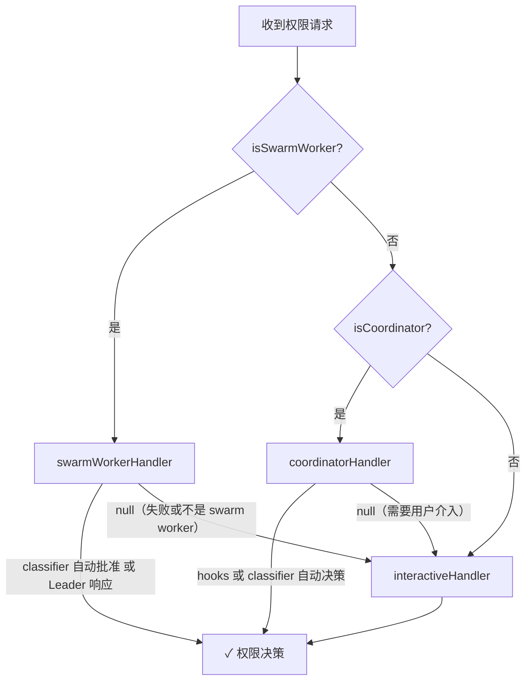
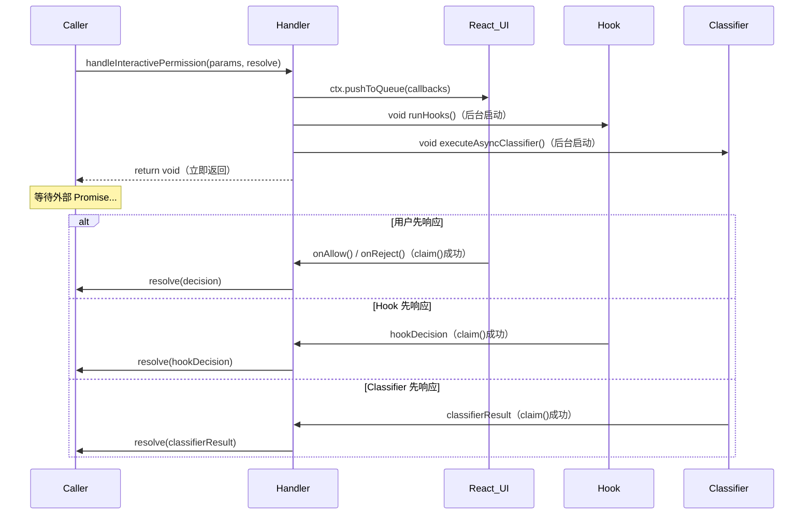
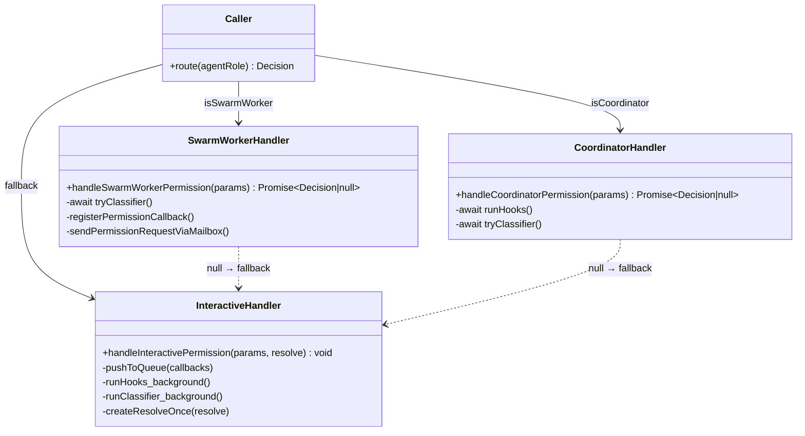

# 第 35 章：权限处理器三态——interactive/coordinator/swarmWorker 的策略差异

> "同样的问题，在不同的上下文中，需要完全不同的解法——这不是代码重复，而是场景感知。"

---

Claude Code 的每一次工具调用都面临同一个问题：「这个工具调用应该被允许吗？」但这个问题的**答案获取方式**，在三种不同的运行场景下截然不同。在主 Agent（interactive）中，系统弹出对话框让用户点击确认，同时在后台悄悄跑 hooks 和分类器——谁先有答案，谁先赢；在 Coordinator 中，系统先**顺序等待** hooks 和分类器自动决策，只有都没有答案时才落回到对话框；在 Swarm Worker 中，系统将请求通过邮箱转发给 Leader，等待 Leader 代为决策，邮箱提交失败则退回本地处理。

三种场景，三种处理器，相同的操作语义。这是**上下文策略分叉**（Context-Aware Strategy Fork）模式：**将同一操作在不同运行上下文下的不同实现封装为独立的 handler 函数，调用方根据运行时角色路由到对应 handler，每个 handler 独立演化互不干扰**。读完这章，你将理解为什么这三种策略需要独立的函数而非一个充满 if/else 的统一函数，以及如何在自己的系统中设计上下文感知的策略分叉。

---

## 问题：同一个"应该允许吗"，三种不同的解法

权限检查在权限系统中是一个高频操作——每次工具调用都会触发它。问题不难定义：给定一个工具调用请求，系统应该允许、拒绝，还是询问用户？真正困难的是：**答案获取方式因运行上下文而异**。我们来看这三种上下文为什么需要完全不同的处理策略。

主 Agent 运行在用户面前，有终端 UI，有人在看屏幕——弹对话框是合理的，用户能即时响应。Coordinator 是后台编排者，自动化程度更高——它更偏好先让 hooks 和分类器自动决策，减少打扰用户的次数，只有自动化无法处理时才落回对话框。Swarm Worker 是无头的后台进程，没有自己的对话框渲染能力——它只能把问题转发给有决策权的 Leader。

如果用一个函数处理这三种情况，函数体会变成嵌套的 if/else 丛林：每次修改其中一个角色的策略，都需要打开这个函数，小心翼翼地找到对应分支，同时担心影响其他分支。策略越复杂，这个函数越难维护。我们来看 Claude Code 如何用三个独立文件解决这个问题。

Claude Code 的做法是三个独立的 handler 函数，每个文件只关注自己的角色逻辑。**图35-1** 展示了三种处理器的全景对比：

**图 35-1：三种权限处理器策略对比**

| 处理器 | 文件 | 触发条件 | 核心机制 | 返回类型 |
|--------|------|---------|---------|---------|
| interactiveHandler | interactiveHandler.ts（536行）| 主 Agent（交互模式）| 设置 UI 回调队列，多路竞速 | `void`（非 Promise）|
| coordinatorHandler | coordinatorHandler.ts（65行）| Coordinator 角色 | 顺序等待 hooks + 分类器，返回 null 退出 | `Promise<Decision\|null>` |
| swarmWorkerHandler | swarmWorkerHandler.ts（159行）| Swarm Worker 角色 | 邮箱转发给 Leader，失败则返回 null | `Promise<Decision\|null>` |

三者的分叉逻辑在调用方根据 Agent 角色路由，每个 handler 对外的契约只有两种结果：「已处理（返回决策）」或「未处理（返回 null，调用方继续找下一个处理器）」。

**图 35-2：权限处理器路由流程**



注意图中的两条 `null` 回退路径：swarmWorkerHandler 和 coordinatorHandler 都可能返回 null，调用方收到 null 后继续往下走，最终落入 interactiveHandler——这是整个链路的兜底。**interactiveHandler 是唯一不返回 null 的处理器**，它保证了链路最终一定有决策。

---

## 源码实例1 — interactiveHandler：设置回调，而非等待结果

interactiveHandler 是三个处理器中最复杂的，也是设计最"反直觉"的一个。我们先看 interactiveHandler。`src/hooks/toolPermission/handlers/interactiveHandler.ts` 第 53-55 行有一段注释，直接揭示了第一个核心设计决策：

```typescript
/**
 * This function does NOT return a Promise -- it sets up callbacks that
 * eventually call `resolve()` to resolve the outer promise owned by
 * the caller.
 */
function handleInteractivePermission(
  params: InteractivePermissionParams,
  resolve: (decision: PermissionDecision) => void,
): void {
```

**源码参考：** `src/hooks/toolPermission/handlers/interactiveHandler.ts:53`

这个函数返回 `void`，不是 `Promise<PermissionDecision>`。为什么不像 coordinatorHandler 和 swarmWorkerHandler 那样返回 Promise？这是我们需要理解的第一个关键设计决策。

原因在于 UI 渲染的本质。Claude Code 用 Ink（React for CLI）渲染终端 UI，React 状态更新是异步的——你无法在一个同步调用里「等待用户点击了按钮」。「显示对话框并等待用户输入」这件事不能用 `await dialog.show()` 实现，因为 dialog 的渲染和用户交互本身就活在 React 的事件循环里，不在调用栈上。解决方案是把 Promise 的 `resolve` 作为参数传入，handler 负责设置好所有回调，这些回调最终会调用 `resolve()` 来兑现外部的 Promise。这样 handler 本身立即返回，只是「部署好钩子」——真正的等待在外部 Promise 中发生。

`handleInteractivePermission` 的核心动作是调用 `ctx.pushToQueue()`，把一个包含所有回调的确认项推入 UI 队列。这里有两个细节值得关注：

第一个是 `createResolveOnce`（第 70 行）。handler 设置了**五条**竞速路径：本地 UI 回调（`onAllow`/`onReject`）、bridge 远程响应（CCR，即 claude.ai Web UI）、channel 响应（Telegram、iMessage 等）、hooks 异步结果、bash 分类器结果。这五条路径任何一条先到，都会试图调用 `resolve()`。`createResolveOnce` 保证只有第一个成功的 `claim()` 才能执行，后续的竞速者都安静退出，不会重复 resolve 同一个 Promise。

第二个是 `clearClassifierIndicator()`（第 86-90 行）：

```typescript
function clearClassifierIndicator(): void {
  if (feature('BASH_CLASSIFIER')) {
    ctx.updateQueueItem({ classifierCheckInProgress: false })
  }
}
```

**源码参考：** `src/hooks/toolPermission/handlers/interactiveHandler.ts:86`

这是 UI 反馈机制——当分类器在后台运行时，对话框顶部显示「分类器检查中」的指示器（`classifierCheckInProgress: true`）。一旦用户开始与对话框交互（键盘操作、tab 键等），这个指示器就被清除，因为自动批准已经不可能了。不过有一个 200ms 的防误触窗口：

```typescript
onUserInteraction() {
  // 防误触：忽略对话框出现后 200ms 内的操作
  const GRACE_PERIOD_MS = 200
  if (Date.now() - permissionPromptStartTimeMs < GRACE_PERIOD_MS) {
    return
  }
  userInteracted = true
  clearClassifierChecking(ctx.toolUseID)
  clearClassifierIndicator()
},
```

**源码参考：** `src/hooks/toolPermission/handlers/interactiveHandler.ts:108`

这个 200ms 的设计防止了「用户打字时刚好按到了 Enter 键，误触了还没看清的对话框」的场景——对话框刚出现的瞬间，任何键盘操作都被视为可能的误触而忽略。

与 coordinatorHandler 和 swarmWorkerHandler 最大的不同在于：interactiveHandler 对 hooks 和分类器用的是「发射后不理」的后台模式（`void (async () => { ... })()`），不阻塞对话框的立即显示。如果自动化更快，用户甚至看不到对话框；如果用户更快，自动化结果被丢弃。

**图 35-3：interactiveHandler 的多路竞速时序**



---

## 源码实例2 — coordinatorHandler：顺序等待，优先自动化

接下来我们看 coordinatorHandler。它只有 65 行，是三者中最精简的。但它的精简背后是一个清晰的设计决策：**Coordinator 优先自动化，减少打扰用户**。

`src/hooks/toolPermission/handlers/coordinatorHandler.ts` 的注释（第 17-24 行）直接说明了策略差异：

```typescript
/**
 * Handles the coordinator worker permission flow.
 *
 * For coordinator workers, automated checks (hooks and classifier) are
 * awaited sequentially before falling through to the interactive dialog.
 *
 * Returns a PermissionDecision if the automated checks resolved the
 * permission, or null if the caller should fall through to the
 * interactive dialog.
 */
async function handleCoordinatorPermission(
  params: CoordinatorPermissionParams,
): Promise<PermissionDecision | null> {
```

**源码参考：** `src/hooks/toolPermission/handlers/coordinatorHandler.ts:17`

「awaited sequentially」——顺序等待——是与 interactiveHandler 的根本区别。coordinator 不展示 UI，它先等 hooks，再等分类器，两者都没有决策才返回 null（让调用方走 interactive）：

```typescript
// 1. 先等待 hooks（快速，本地执行）
const hookResult = await ctx.runHooks(permissionMode, suggestions, updatedInput)
if (hookResult) return hookResult

// 2. 再等待分类器（慢速，需要 LLM 推断，仅限 bash 工具）
const classifierResult = feature('BASH_CLASSIFIER')
  ? await ctx.tryClassifier?.(params.pendingClassifierCheck, updatedInput)
  : null
if (classifierResult) {
  return classifierResult
}

// 3. 自动化检查都没有决策——退回 interactive
return null
```

**源码参考：** `src/hooks/toolPermission/handlers/coordinatorHandler.ts:32`

错误处理也体现了「优先自动化，失败则退回」的哲学：如果 hooks 或分类器抛出异常，coordinator 记录错误日志并返回 null，让用户通过 interactive 对话框手动决策，而不是让异常冒泡中断整个工具调用流程。注释写道：「If automated checks fail unexpectedly, fall through to show the dialog so the user can decide manually」（如果自动化检查意外失败，退回到对话框让用户手动决策）。

与 interactiveHandler 相比，coordinator 对 hooks 和分类器的处理是**阻塞式**的（`await`），而不是后台并发的（`void async`）。这个差异反映了两种运行模式对「延迟」的不同容忍度：在 interactive 模式下，用户在等待，不能让自动化阻塞 UI 出现；在 coordinator 模式下，没有用户在实时等待，顺序等待自动化检查的开销是可接受的，而且这样能减少对话框的出现频率，降低人工干预成本。

---

## 源码实例3 — swarmWorkerHandler：邮箱转发，优雅降级

最后我们看 swarmWorkerHandler，它是三个处理器中逻辑最「分层」的一个。注释直接说明了 null 的两种含义：

```typescript
/**
 * Returns a PermissionDecision if the classifier auto-approves,
 * or a Promise that resolves when the leader responds.
 * Returns null if swarms are not enabled or this is not a swarm worker,
 * so the caller can fall through to interactive handling.
 */
async function handleSwarmWorkerPermission(
  params: SwarmWorkerPermissionParams,
): Promise<PermissionDecision | null> {
  if (!isAgentSwarmsEnabled() || !isSwarmWorker()) {
    return null  // 环境不满足，直接让路
  }
```

**源码参考：** `src/hooks/toolPermission/handlers/swarmWorkerHandler.ts:29`

第一层快速失败：如果当前进程不是 Swarm Worker（或 Swarm 功能未启用），立即返回 null，连分类器都不跑。通过前提检查后，先尝试分类器自动批准——与 coordinatorHandler 一样，这里也是 `await`，不是后台并发：

```typescript
const classifierResult = feature('BASH_CLASSIFIER')
  ? await ctx.tryClassifier?.(params.pendingClassifierCheck, updatedInput)
  : null
if (classifierResult) {
  return classifierResult  // 分类器批准了，不需要打扰 Leader
}
```

**源码参考：** `src/hooks/toolPermission/handlers/swarmWorkerHandler.ts:52`

如果分类器没有自动批准，则通过邮箱转发给 Leader。这里有一个关键的注释——「先注册回调，再发送请求」：

```typescript
// 先注册回调，再发送请求
// ——防止 Leader 响应比回调注册更快的竞态条件
registerPermissionCallback({
  requestId: request.id,
  toolUseId: ctx.toolUseID,
  async onAllow(allowedInput, permissionUpdates, feedback, contentBlocks) {
    if (!claim()) return
    clearPendingRequest()
    resolveOnce(await ctx.handleUserAllow(...))
  },
  onReject(feedback, contentBlocks) {
    if (!claim()) return
    clearPendingRequest()
    resolveOnce(ctx.cancelAndAbort(feedback))
  },
})

// 回调注册完成后，再发送请求
void sendPermissionRequestViaMailbox(request)
```

**源码参考：** `src/hooks/toolPermission/handlers/swarmWorkerHandler.ts:79`

「Register callback BEFORE sending the request to avoid race condition where leader responds before callback is registered」（先注册回调再发送请求，避免 Leader 在回调注册前就响应的竞态）——这是分布式系统中的基本订阅模式：**先订阅，再发布，确保不遗漏消息**。如果先发送请求再注册回调，Leader 可能在毫秒级内就响应了，而 Worker 的回调还没注册上，导致响应丢失。

等待 Leader 期间，handler 在 UI 状态中设置 `pendingWorkerRequest`，让界面显示「等待 Leader 批准」的视觉指示器。如果 abort signal 触发（会话中断），handler 用 `cancelAndAbort` 结束等待，不会让 Promise 永远挂起。

邮箱提交本身失败时，handler 返回 null 而非抛出异常：

```typescript
} catch (error) {
  // 邮箱提交失败时，日志记录后回退到本地处理
  logError(toError(error))
  return null  // null = 告诉调用方继续找下一个处理器
}
```

**源码参考：** `src/hooks/toolPermission/handlers/swarmWorkerHandler.ts:150`

这个「失败返回 null 而非抛出异常」的设计是 swarmWorkerHandler 和 coordinatorHandler 共同遵循的契约：**null 是「我没法处理，你来」的信号，不是「出错了，系统崩了」的信号**。

---

## 模式剖析

三个处理器背后的上下文策略分叉模式有四个关键组成部分：

**第一：统一的入口契约（null 作为"让路"信号）**

coordinatorHandler 和 swarmWorkerHandler 的返回类型是 `Promise<PermissionDecision | null>`，null 表示「当前 handler 无法处理，调用方应继续查找下一个」。这个设计让处理器链可以优雅地降级：swarmWorker → coordinator（根据角色，实际可能跳过） → interactive，每一层都是可选的，interactiveHandler 是唯一的兜底。

**第二：上下文决定策略，而非策略决定上下文**

处理器的选择在调用方根据 Agent 角色（`isSwarmWorker()`、coordinator 标志等谓词）进行路由，而不是在处理器内部检测全局状态。每个处理器只需要关注「我这种角色应该怎么做」，不需要感知其他角色的存在。

**第三：自动化检查的时序差异**

| 处理器 | hooks/classifier 时序 | 原因 |
|--------|--------------------|------|
| interactive | 后台并发，竞速用户 | 用户在等待，不能让自动化阻塞 UI 出现 |
| coordinator | 顺序等待，先于 UI | 自动化程度高，优先减少用户干预 |
| swarmWorker | 等待 classifier，再转发 | 避免不必要的邮箱往返，但不阻塞 UI |

**第四：interactiveHandler 的非 Promise 设计**

`void` 返回类型是三态中最特殊的设计。它揭示了一个架构约束：**React/Ink 的 UI 更新是异步的，无法被同步调用栈等待**。通过把 `resolve` 回调作为参数传入，handler 把「何时决策」的控制权交给了外部 Promise，自己只负责「如何部署触发条件」——这是回调注入（Callback Injection）模式与非阻塞 UI 框架配合的标准做法。



**图 35-4：三种处理器的类结构与调用关系**

---

## 适用范围

| 场景 | 适用性 | 理由 | 替代方案 |
|------|--------|------|---------|
| 同一功能在不同运行上下文需要不同行为 | ✓ | 策略分叉封装上下文差异，各处理器独立演化 | 在单一函数内写 if (isSwarmWorker) 分支（难维护）|
| 需要优雅降级（首选失败时自动 fallback）| ✓ | null 返回约定让处理器链天然支持降级 | 抛出异常并在调用方捕获（耦合度高）|
| 各角色的策略差异复杂且会独立演进 | ✓ | 独立文件让每个策略可以独立测试和修改 | 策略对象注入（适合更正式的场景）|
| 角色数量少且稳定（3-5 个）| ✓ | 少量角色下独立文件清晰可控 | 策略注册表（适合动态扩展的场景）|
| 存在明显的 fallback 链（A失败→B→C）| ✓ | null 约定自然建立了处理器链 | 责任链模式（更正式，适合更长的链）|
| 上下文判断逻辑非常复杂（多维度组合）| ✗（谨慎）| 三个独立文件难以测试完整的上下文矩阵 | 统一函数 + context 参数 + 查表（更可测试）|
| 需要在运行时动态注册新处理器 | ✗ | 处理器是静态路由的，不支持运行时扩展 | 策略注册表 + 工厂模式 |

---

## 权衡与局限

**权衡 1：文件分散 vs. 逻辑内聚**

三个 handler 文件规模差异悬殊：coordinatorHandler（65 行）和 swarmWorkerHandler（159 行）非常精简，但 interactiveHandler（536 行）包含大量复杂逻辑——bridge 回调、channel 回调（Telegram/iMessage）、分类器竞速、checkmark 动画计时器。这种规模不对称意味着「分三个文件」对 interactiveHandler 的价值远大于其他两个。coordinatorHandler 几乎只是一个薄封装，它的主要作用是把「顺序等待 hooks + 分类器」这个逻辑从调用方中分离出来，让调用方只需要 `if (!coordinatorResult) { fallback to interactive }` 而不需要理解顺序等待的细节。

**权衡 2：null 约定的隐式性**

`null` 作为「让路」信号是一个隐式约定，不是类型系统强制的契约。调用方必须知道「收到 null 要继续找下一个处理器」，这是编写时约定而非编译时约定。与之对比，如果使用 `Either<Decision, NoHandler>` 或显式的 `{ handled: false }` 结构，类型系统可以强制调用方处理「未处理」的情况。当前的 null 约定在三个处理器的小范围内尚可接受，但如果处理器数量增加，这个约定的维护成本会上升。

**权衡 3：coordinator 和 interactive 的 hooks 重叠**

coordinatorHandler 先等待 hooks 完成，如果 hooks 没有决策（返回 null），调用方将继续走 interactiveHandler，而 interactiveHandler 又会在后台再次运行 hooks。coordinatorHandler 第 60 行的注释写道：「Hooks already ran, classifier already consumed」（hooks 已经运行，分类器已经消耗）——这个注释提示调用方在走 interactive 时应该用 `awaitAutomatedChecksBeforeDialog: true` 跳过 hooks 重复执行。这是一个调用方层面的协调约定，而非在处理器内部自动避免重复，需要调用方理解两个处理器的执行关系。

---

## 与已知模式的对话

**与 GoF 策略模式（Strategy Pattern）**：策略模式是最直接的参照——定义算法族，分别封装，使它们可以互换。本模式与策略模式最大的区别在于**策略的选择时机**：GoF 策略模式通常在构造时选定策略对象（`new Context(new ConcreteStrategyA())`），而本模式在每次调用时根据运行时 Agent 角色动态路由。另一个区别是**策略对象 vs. 独立函数**：GoF 策略模式通常用类/对象封装策略，本模式用普通函数——在简单场景下，函数比对象更轻量，没有构造器和 `this` 的心智负担。

**与责任链模式（Chain of Responsibility）**：责任链模式与本模式的 null-fallback 设计非常相似——每个处理器检查自己是否能处理，不能则传递给下一个。区别在于**链的固定性**：经典责任链通常是动态链表，处理器在运行时连接；本模式的链是静态的（swarmWorker → coordinator → interactive），在代码中固定写死。对于只有三种角色且角色稳定的场景，静态链比动态链更清晰、更易于调试——读代码时你不需要追踪「链表里现在挂了哪些处理器」。

---

## 模式提炼

### 上下文策略分叉（Context-Aware Strategy Fork）

**解决的问题**：同一操作（权限检查）在不同 Agent 上下文（main/coordinator/swarmWorker）需要完全不同的实现，若写在同一函数内，每次修改一个角色的策略都需要打开整个函数并小心不影响其他分支。

**核心做法**：三个独立的 handler 函数，调用方根据 Agent 角色路由到对应 handler。coordinatorHandler 和 swarmWorkerHandler 返回 `Promise<Decision | null>`，null 表示「无法处理，调用方继续」；interactiveHandler 返回 `void`（通过传入的 `resolve` 回调最终兑现外部 Promise），是整个链路的兜底，不返回 null。

**前置条件**：能明确区分 Agent 角色（`isSwarmWorker()`、coordinator 标志等谓词）；各角色的处理策略复杂度足以支撑独立文件（避免过度拆分）；存在明确的 fallback 顺序（谁先尝试，谁是兜底）。

**源码锚点**：`src/hooks/toolPermission/handlers/interactiveHandler.ts:53`（非 Promise 设计注释）；`src/hooks/toolPermission/handlers/swarmWorkerHandler.ts:38`（fallthrough 注释）；`src/hooks/toolPermission/handlers/coordinatorHandler.ts:17`（顺序等待注释）

---

## 你能做什么

- **将「同一功能、不同上下文」的分叉逻辑提取到独立的 handler 函数**，而非在单一函数内用 if/else 区分角色。独立文件让每个策略可以单独测试、单独演化，不会因为修改一个角色影响其他角色的行为。

- **用 null 作为「我无法处理」的信号，而非抛出异常**。当处理器无法处理当前请求时，返回 null 让调用方继续找下一个处理器，而非抛异常中断流程。null 作为「让路」信号，配合调用方的 fallback 链，自然建立了优雅降级的能力。

- **为非 Promise 的 UI 回调函数写明确注释**（"does NOT return a Promise"），防止调用方误用 `await`。当函数通过设置回调而非返回值来「兑现结果」时，这个反直觉的签名需要注释帮助维护者理解意图。

- **先注册回调，再发送分布式请求**，避免「响应比回调注册更快」的竞态条件。这在任何需要订阅异步响应的分布式场景中都是基本原则：订阅先于发布，无论网络有多快。

- **当分布式 handler 失败时返回 null 而非抛出异常**，让本地 fallback 能安全接管。网络分区、邮箱超时、进程崩溃是分布式系统的常态，优雅降级到本地处理比让整个工具调用崩溃更重要。

- **区分「自动化检查并发于 UI」与「自动化检查先于 UI」的场景**：主 Agent 并发自动化与 UI（不让自动化阻塞用户看到对话框），Coordinator 顺序等待自动化（优先自动化，减少人工干预）。根据系统的自动化程度和用户等待容忍度，选择合适的时序策略。

- **为处理器链建立明确的角色谓词**（`isSwarmWorker()`、`isCoordinator()` 等），让路由逻辑可读可测。不要把角色判断逻辑埋在处理器内部，而是在调用方的路由层集中处理——这样添加新角色只需要修改路由层，不需要触碰已有的处理器。

---

第 35 章揭示了权限处理器三态背后的上下文策略分叉模式——三个独立的处理器各司其职，通过 null 约定建立了优雅的降级链。但当用户多次拒绝同一个工具请求时，系统如何追踪这些拒绝历史？TrustDialog 如何根据历史记录调整对话框的展示策略——这是权限 UI 交互层的下一个话题，第 36 章将展开这个机制（详见第 36 章）。
