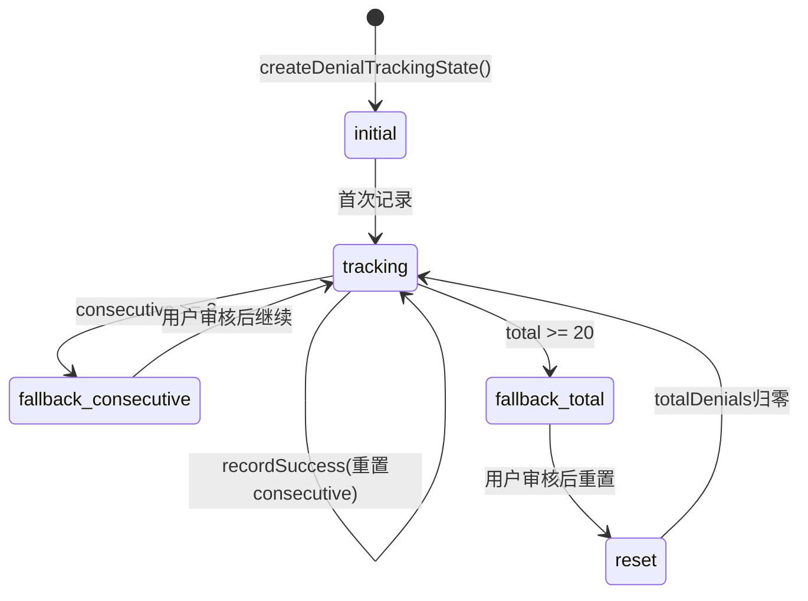
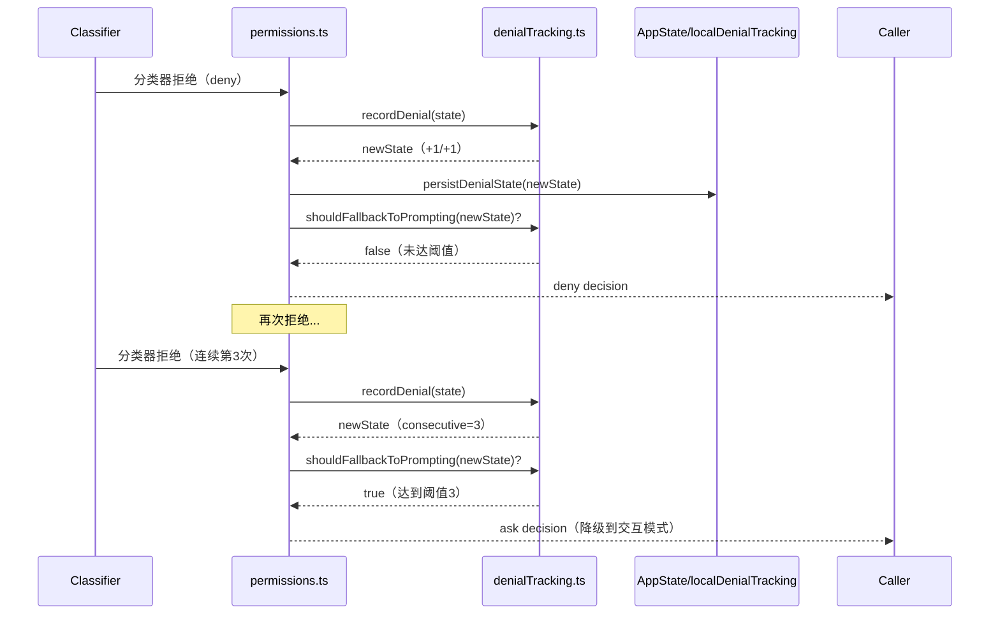
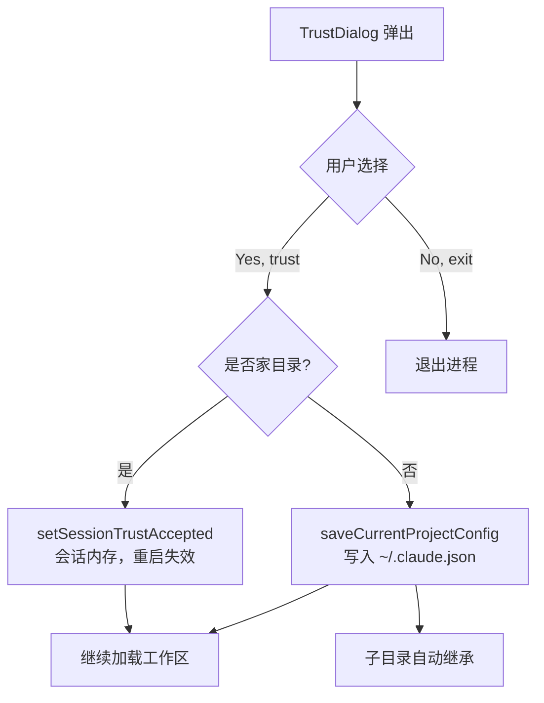
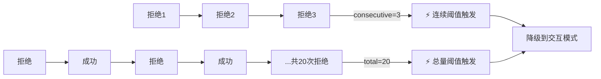

# 第 36 章：信任对话与拒绝追踪——用户决策的持久化与安全审计

> "第三次拒绝不是错误，是信号。系统需要在这个时刻停下来，把决策权还给人。"

---

AI 分类器在自动模式下工作良好——大多数时候。但分类器也会犯错：它可能连续拒绝用户明确想要执行的合理操作，把 Agent 陷入「拒绝循环」。在没有断路机制的情况下，这意味着 Agent 彻底无法继续工作，用户只能茫然地看着任务卡死。

Claude Code 用 45 行代码解决了这个问题。`denialTracking.ts` 实现了一个双阈值断路器：**连续拒绝达到 3 次，或会话内总拒绝达到 20 次，系统自动从自动模式降级到「弹出对话框，让用户亲自决定」**。这是**拒绝追踪电路断路器**（Denial-Tracking Circuit Breaker）模式：用两个阈值（短期集中失败 + 长期累积失败）检测分类器的「异常状态」，在阈值触发时保守降级而非强行继续。读完这章，你将理解为什么需要两个而非一个阈值，为什么 `recordSuccess` 不重置总拒绝次数，以及如何在自己的 AI 系统中实现这种降级保护。

---

## 问题：分类器的拒绝循环与两个失败维度

自动模式下的权限分类器是一把双刃剑。它让 Agent 能独立完成工作，减少对用户的打扰；但分类器的判断不总是对的，特别是面对非典型的工具调用序列时，它可能产生「保守偏差」——宁可多拒绝，不愿多放行。

拒绝失败有两种维度，对应两种不同的问题：

**维度1：连续失败（consecutiveDenials）**——分类器在短时间内连续拒绝多个操作，很可能说明它对当前工作上下文判断失准。比如用户在调试会话中连续执行多个文件操作，分类器把这些判断为「可疑的批量文件修改」并逐一拒绝。这种连续失败需要快速响应——3 次连续拒绝就足够触发降级，因为在当前上下文中分类器已经在犯系统性错误。

**维度2：总量累积（totalDenials）**——分类器在整个会话中断断续续地拒绝，每次间隔一段时间。单次拒绝不触发降级，但如果一个会话内总共被拒绝了 20 次，说明用户在这个会话里反复遇到分类器过度保守的问题，需要人工审视。

`denialTracking.ts` 第 12 行直接写明了两个阈值：

```typescript
export const DENIAL_LIMITS = {
  maxConsecutive: 3,
  maxTotal: 20,
} as const
```

**源码参考：** `src/utils/permissions/denialTracking.ts:12`

`as const` 让 TypeScript 将 `DENIAL_LIMITS.maxConsecutive` 推断为字面量类型 `3` 而非宽泛的 `number`，调用方的比较 `>= 3` 在类型层面精确对应常量。这个细节让代码在重构时更安全——如果阈值变化，所有类型推断自动更新。

**图 36-1：拒绝追踪状态机**



两条通向 fallback 的路径对应两种降级触发方式。注意 `fallback_consecutive` 之后只是暂停等待用户决策，`consecutiveDenials` 会在用户允许操作后通过 `recordSuccess` 归零；而 `fallback_total` 触发后，`totalDenials` 本身会被重置为 0（见 `handleDenialLimitExceeded` 中的重置逻辑），这是一个「让用户重新开始计数」的设计。

---

## 源码实例1 — denialTracking.ts：最小化状态机

`denialTracking.ts` 是全书中最精简的完整功能模块之一——45 行，5 个导出函数，零依赖。这个文件的价值不在于复杂，而在于每个设计决策都值得细看。

我们从类型定义开始：

```typescript
export type DenialTrackingState = {
  consecutiveDenials: number
  totalDenials: number
}
```

**源码参考：** `src/utils/permissions/denialTracking.ts:7`

两个字段，没有第三个。为什么不记录最后一次拒绝的时间戳、具体原因、或拒绝的工具名称？因为 `denialTracking.ts` 的职责是**量化异常程度**，不是**记录异常细节**。具体的拒绝原因由调用方（`permissions.ts` 中的分析器）在降级时提取并展示给用户——这种职责分离让 `DenialTrackingState` 保持最简，易于序列化、测试和复用。

`recordDenial` 和 `recordSuccess` 都用不可变更新——返回新对象，不修改原对象：

```typescript
export function recordDenial(state: DenialTrackingState): DenialTrackingState {
  return {
    ...state,
    consecutiveDenials: state.consecutiveDenials + 1,
    totalDenials: state.totalDenials + 1,
  }
}
```

**源码参考：** `src/utils/permissions/denialTracking.ts:24`

扩展运算符 `...state` 先复制原状态，再覆盖需要更新的字段。这个模式保证了函数的纯净性：相同输入永远得到相同输出，没有副作用，可以安全地在测试中多次调用，也可以在多个调用方之间共享同一个 state 对象的引用而不用担心意外修改。

`recordSuccess` 是这个模块里最有意思的函数：

```typescript
export function recordSuccess(state: DenialTrackingState): DenialTrackingState {
  if (state.consecutiveDenials === 0) return state // 状态未变，返回原引用
  return {
    ...state,
    consecutiveDenials: 0,
    // totalDenials 故意不重置
  }
}
```

**源码参考：** `src/utils/permissions/denialTracking.ts:32`

**`totalDenials` 故意不在 `recordSuccess` 中重置**。为什么？`consecutiveDenials` 追踪的是「最近的连续失败」，一次成功意味着连续失败的链断了，理应归零。但 `totalDenials` 追踪的是「会话内的累积历史」——一次成功不能抹去过去 10 次拒绝的事实。这是一个安全审计的设计决策：**成功可以打破连续，但不能擦除历史**。

注意 `state.consecutiveDenials === 0` 时直接返回 `state` 原引用——这不只是优化，在调用方（`permissions.ts` 的 `persistDenialState`）里，这个 `Object.is` 引用相等可以让 React store 跳过 listener 循环（源码注释明确说明了这一点）。

最后，`shouldFallbackToPrompting` 用 OR 条件组合两个阈值：

```typescript
export function shouldFallbackToPrompting(state: DenialTrackingState): boolean {
  return (
    state.consecutiveDenials >= DENIAL_LIMITS.maxConsecutive ||
    state.totalDenials >= DENIAL_LIMITS.maxTotal
  )
}
```

**源码参考：** `src/utils/permissions/denialTracking.ts:40`

OR 而非 AND——任一阈值达到就触发降级，不需要同时达到。这是保守降级的设计：宁可多降级一次让用户确认，不能在分类器明显异常时还继续自动执行。

---

## 源码实例2 — permissions.ts：状态机与持久化分离

`denialTracking.ts` 只管状态转换逻辑，不管状态保存在哪里。状态持久化是调用方 `permissions.ts` 的职责，这个分离让我们来看一下具体是怎么做的。

`persistDenialState` 函数（`src/utils/permissions/permissions.ts:959`）处理两种持久化路径：

```typescript
function persistDenialState(
  context: ToolUseContext,
  newState: DenialTrackingState,
): void {
  if (context.localDenialTracking) {
    // 子 Agent：就地修改本地副本（setAppState 是 no-op）
    Object.assign(context.localDenialTracking, newState)
  } else {
    // 主 Agent：通过 setAppState 写入全局 AppState
    context.setAppState(prev => {
      // recordSuccess 返回相同引用时，Object.is 检查让 store 跳过 listener
      if (prev.denialTracking === newState) return prev
      return { ...prev, denialTracking: newState }
    })
  }
}
```

**源码参考：** `src/utils/permissions/permissions.ts:965`

两条路径对应两种运行模式：**主 Agent** 把状态写入 `AppState`（全局共享，通过 React store 触发 UI 更新）；**子 Agent**（如 Swarm Worker）使用 `localDenialTracking`，因为子 Agent 的 `setAppState` 是 no-op（不影响父 Agent 的状态），所以用 `Object.assign` 就地修改本地副本。

注释写道：「For async subagents with localDenialTracking, mutate the local state in place (since setAppState is a no-op)」——这是一个架构约束驱动的设计决策：不是因为喜欢就地修改，而是因为子 Agent 的状态隔离架构决定了必须就地修改。

当分类器拒绝操作后，`permissions.ts` 调用 `handleDenialLimitExceeded`（第 985 行）检查是否需要降级：

```typescript
const newDenialState = recordDenial(denialState)
persistDenialState(context, newDenialState)

const denialLimitResult = handleDenialLimitExceeded(
  newDenialState,
  appState,
  classifierResult.reason,  // 分类器给出的拒绝原因
  assistantMessage,
  tool,
  result,
  context,
)
if (denialLimitResult) {
  return denialLimitResult  // 返回降级后的 'ask' 决策
}
```

**源码参考：** `src/utils/permissions/permissions.ts:879`

`handleDenialLimitExceeded` 内部有一个重要的行为差异——**headless 模式下抛出异常，而非显示对话框**：

```typescript
if (isHeadless) {
  throw new AbortError(
    'Agent aborted: too many classifier denials in headless mode',
  )
}
```

**源码参考：** `src/utils/permissions/permissions.ts:1024`

Headless 模式（如 CI 环境、API 集成）没有终端 UI，无法弹出对话框——如果在这种模式下分类器触发了降级，继续执行毫无意义，直接中止整个 Agent。而在 CLI 模式下，降级会返回一个 `behavior: 'ask'` 的 `PermissionDecision`，把控制权交还给 interactiveHandler 显示确认对话框（详见第 35 章）。

另一个值得注意的细节：当 `totalDenials` 达到上限触发降级后，`handleDenialLimitExceeded` 会把 `totalDenials` 重置为 0：

```typescript
if (hitTotalLimit) {
  persistDenialState(context, {
    ...denialState,
    totalDenials: 0,
    consecutiveDenials: 0,
  })
}
```

这是一个「用户审核后重新开始」的设计——用户看到「20 次拒绝，请审核」的提示并决策后，计数器重置，允许后续的分类器拒绝重新累积。如果不重置，一旦触发总量限制，之后的每一次分类器拒绝都会立刻再次触发降级，让分类器完全失效。

**图 36-2：permissions.ts 中拒绝追踪的调用时序**



---

## 源码实例3 — TrustDialog：三种决策的持久化策略

`denialTracking.ts` 追踪的是分类器的拒绝次数——这是**自动化决策**的异常检测。但权限系统中还有另一类决策：**用户的主动选择**。当用户面对权限确认对话框时，他们可以选择「本次允许」、「永久允许」，或「拒绝」——这三种决策需要不同的持久化策略。

`TrustDialog` 是其中最典型的案例。它在 Claude Code 首次进入一个项目目录时弹出，询问用户是否信任这个目录。我们来看它如何根据目录类型选择不同的持久化路径：

```typescript
function onChange(value: 'enable_all' | 'exit') {
  if (value === 'exit') {
    gracefulShutdownSync(1)
    return
  }

  const isHomeDir = homedir() === getCwd()

  if (isHomeDir) {
    // 家目录：只存入会话内存，不写配置文件
    // 安全意图：不能永久信任家目录（风险过高）
    setSessionTrustAccepted(true)
  } else {
    // 普通项目目录：写入配置文件，下次不再询问
    saveCurrentProjectConfig(current => ({
      ...current,
      hasTrustDialogAccepted: true,
    }))
  }

  onDone()
}
```

**源码参考：** `src/components/TrustDialog/TrustDialog.tsx:175`（家目录时调用 setSessionTrustAccepted，否则调用 saveCurrentProjectConfig）

两条持久化路径对应两种安全策略：**家目录**是用户的 `~` 目录，包含 SSH 密钥、`.bashrc`、所有个人文件——信任家目录意味着 Claude Code 有权访问和执行这里的所有内容，风险极高。所以即使用户点击了「信任」，这个决策也只存入 `STATE.sessionTrustAccepted`（内存变量），进程重启后归零，用户每次打开会话都需要重新确认。对于普通的项目目录，信任决策通过 `saveCurrentProjectConfig` 写入 `~/.claude.json`（或等效的全局配置文件）的 `projects[path].hasTrustDialogAccepted: true` 字段——下次进入同一目录时，`checkHasTrustDialogAccepted()` 读取这个字段直接跳过对话框。

`checkHasTrustDialogAccepted()` 在 `src/utils/config.ts:697` 实现了三层检查：

```typescript
function computeTrustDialogAccepted(): boolean {
  // 第一层：检查会话内存（家目录的临时信任）
  if (getSessionTrustAccepted()) return true

  // 第二层：检查 git 根目录的配置（saveCurrentProjectConfig 写入的位置）
  const projectConfig = config.projects?.[getProjectPathForConfig()]
  if (projectConfig?.hasTrustDialogAccepted) return true

  // 第三层：向上遍历父目录，检查是否有父目录的信任授权
  let currentPath = normalizePathForConfigKey(getCwd())
  while (true) {
    const pathConfig = config.projects?.[currentPath]
    if (pathConfig?.hasTrustDialogAccepted) return true
    const parentPath = normalizePathForConfigKey(resolve(currentPath, '..'))
    if (parentPath === currentPath) break // 到达根目录，停止
    currentPath = parentPath
  }
  return false
}
```

**源码参考：** `src/utils/config.ts:706`（computeTrustDialogAccepted，三层信任检查）

第三层「向上遍历父目录」是一个实用设计：如果用户信任了 `/home/user/projects`，那么 `/home/user/projects/myapp` 自动继承这个信任，不需要每个子目录单独确认。这是「工作区级信任」的语义——信任父目录的那一刻，子目录也被包含在内。

这三种决策的持久化策略可以归纳为：

| 决策类型 | 存储位置 | 实现机制 | 特点 |
|---------|---------|---------|------|
| 本次信任（家目录）| 内存（STATE.sessionTrustAccepted）| setSessionTrustAccepted(true) | 进程重启后消失 |
| 永久信任（普通目录）| 配置文件（~/.claude.json）| saveCurrentProjectConfig | 跨会话持久化，向下继承 |
| 拒绝 / 退出 | 不存储 | gracefulShutdownSync(1) | 无状态，下次重新询问 |

**图 36-4：TrustDialog 的决策持久化路径**



注意 `checkHasTrustDialogAccepted()` 中的优化——函数注释写道：「Trust only transitions false→true during a session (never the reverse), so once true we can latch it. false is not cached — it gets re-checked on every call」（信任状态只能从 false 变 true，所以 true 可以缓存；false 不缓存，每次重新检查）。这让函数在信任已确认后的大量重复调用中接近 O(1)，不需要每次都读取配置文件。

---

## 模式剖析

拒绝追踪电路断路器有四个关键设计要素：

**第一：双阈值检测，OR 触发**

单一阈值无法覆盖两种失败模式。`consecutiveDenials` 检测「短期系统性失败」（分类器在当前上下文判断失准），`totalDenials` 检测「长期慢性失败」（分类器整体上对当前用户的操作模式过度保守）。OR 触发保证任一模式的失败都能被检测到。

**第二：不可变状态机 + 外部持久化**

状态机函数（`recordDenial`、`recordSuccess`、`shouldFallbackToPrompting`）全部是纯函数，不依赖任何外部状态。持久化（写入 AppState 或 `localDenialTracking`）完全由调用方控制。这种分离让状态机可以被单元测试，让持久化策略可以随架构变化而演化（子 Agent 的持久化策略就与主 Agent 不同）。

**第三：成功只重置连续计数，不重置历史**

这个非对称设计是电路断路器中的「半开状态」等价物：一次成功意味着连续失败链断裂，允许后续的分类器决策重新评估；但历史失败记录保留，为长期慢性失败检测提供证据。

**第四：headless 模式下的异常降级**

降级不总是「显示对话框」——在无 UI 的环境中，降级必须是「中止 Agent」。这让调用方（`handleDenialLimitExceeded`）能根据运行模式选择不同的降级策略，而电路断路器本身不需要感知这些差异。

**图 36-3：双阈值 vs 单阈值的失败检测覆盖**



---

## 适用范围

| 场景 | 适用性 | 理由 | 替代方案 |
|------|--------|------|---------|
| AI 自动化决策可能进入错误循环 | ✓ | 追踪拒绝次数，达到阈值触发人工介入 | 无限重试（可能死循环）|
| 需要区分「偶发失败」和「持续失败」 | ✓ | 双阈值分别检测短期连续和长期累积 | 单一计数器（无法区分失败模式）|
| 需要在失败后自动恢复 | ✓ | recordSuccess 重置 consecutiveDenials，成功后连续计数归零 | 手动重置（需要用户主动操作）|
| 需要跨进程持久化拒绝记录 | ✗ | 当前实现在内存/AppState 中，进程重启后状态归零 | 持久化到磁盘配置文件（需额外实现）|
| 需要完整审计每次拒绝的细节 | ✗（谨慎）| denialTracking 只记录次数，不记录原因/工具/时间戳 | 完整事件日志系统（analytics 层已有部分实现）|
| 需要动态调整阈值（按用户/按工具）| ✗ | DENIAL_LIMITS 是全局常量，不支持细粒度配置 | 将 limits 从常量改为参数，调用方按上下文传入 |

---

## 权衡与局限

**权衡 1：硬编码阈值（3/20）vs 可配置性**

`DENIAL_LIMITS = { maxConsecutive: 3, maxTotal: 20 }` 是硬编码常量，用户无法配置。3 次连续拒绝是一个相对激进的阈值——在某些场景下（如批量文件操作），合理的连续拒绝可能超过 3 次。硬编码的好处是简单可预期，用户不需要调整参数；代价是无法针对不同使用场景优化。如果未来需要细粒度控制，需要把 `DENIAL_LIMITS` 改为参数，并在所有调用方传入上下文相关的阈值。

**权衡 2：总量阈值的长时运行问题**

`totalDenials` 在触发总量降级之前会持续累积。对于长时间运行的 Agent（如跑几小时的代码生成任务），如果分类器有低频率的误判（比如每隔 1 小时误判一次），20 次误判在 20 小时后会触发总量降级，打断一个运行良好的工作流。当前的重置机制（触发总量降级后清零）在一定程度上缓解了这个问题，但不能从根本上解决「阈值对长时运行 Agent 过于严格」的问题——需要基于时间衰减的计数器（指数衰减或时间窗口）才能真正解决。

**权衡 3：状态不随进程重启持久化**

进程重启后，`denialTracking` 状态从零开始，过去会话的分类器问题历史消失。这对于短时任务影响不大，但对于分布式场景（Worker 重启、断点续传）可能导致保护失效——重启后的 Agent 又需要重新积累 3 次连续拒绝才能触发降级。

---

## 与已知模式的对话

**与熔断器模式（Circuit Breaker）**：这是最直接的参照。经典熔断器有三个状态：关闭（正常）、开路（失败，拒绝所有请求）、半开（试探恢复）。本模式的对应关系：「正常」= 分类器自动决策，「开路」= 降级到交互模式让用户决定。主要差异在于**没有明确的「半开」状态**——本模式在用户确认操作后，通过 `recordSuccess` 将 `consecutiveDenials` 归零，相当于直接回到「关闭」状态，没有试探期。这对于人机交互场景是合理的：用户的主动确认本身就是「系统正常工作」的强信号，不需要额外的试探期。

**与 GoF 状态模式（State Pattern）**：状态模式让对象根据内部状态改变行为。本模式的差异在于**用纯函数而非对象封装状态**——`DenialTrackingState` 是 Plain Object，状态转换是外部函数（`recordDenial`、`recordSuccess`），不是对象方法。函数式状态机比对象状态机更容易序列化、测试和并发使用，代价是状态机的「行为」（转换逻辑）和「身份」（state 对象）是分离的，没有 OOP 的封装感。

---

## 模式提炼

### 拒绝追踪电路断路器（Denial-Tracking Circuit Breaker）

**解决的问题**：AI 自动化决策器（分类器）可能进入「拒绝循环」，连续拒绝合理请求导致 Agent 无法工作；单一失败计数无法区分「短期集中失败」和「长期慢性失败」两种异常模式。

**核心做法**：追踪 `consecutiveDenials`（连续拒绝次数）和 `totalDenials`（累积拒绝次数），任一达到阈值（3/20）时返回 `shouldFallbackToPrompting = true`，调用方降级到人工确认模式；`recordSuccess` 只重置 `consecutiveDenials`，不重置 `totalDenials`，保留历史记录。

**前置条件**：有明确的「拒绝」和「成功」事件（可在每次决策后调用 `recordDenial`/`recordSuccess`）；有人工介入或 fallback 路径（用于阈值触发后的降级）；状态可以持久化到内存或更持久的存储。

**源码锚点**：`src/utils/permissions/denialTracking.ts:12`（DENIAL_LIMITS 常量）；`src/utils/permissions/denialTracking.ts:32`（recordSuccess 不重置 totalDenials 的不对称设计）；`src/utils/permissions/denialTracking.ts:40`（OR 触发 shouldFallbackToPrompting）

---

## 你能做什么

- **为 AI 自动决策实现双阈值断路器**（连续失败 + 总量失败），分别检测短期系统性失败和长期慢性失败。单一阈值只能检测其中一种失败模式，双阈值用 OR 组合才能覆盖两种场景。

- **让 `recordSuccess` 只重置连续计数，不重置历史计数**。成功打破了连续失败的链，但不能抹去历史失败的记录。一次成功不等于过去的所有问题都消失了，历史计数是长期健康状态的证据。

- **用不可变更新实现状态机**（返回新对象而非修改原对象），让状态转换函数保持纯净。纯函数比有副作用的方法更容易测试：每个测试都从已知状态开始，不需要 setup/teardown，也不需要担心测试间的状态污染。

- **将状态机（转换逻辑）与持久化（存储策略）分离**。不同的运行环境需要不同的存储位置（主 Agent 用 AppState，子 Agent 用 localDenialTracking，CI 环境可能需要磁盘持久化）。状态机只关心「状态如何变化」，持久化策略由调用方决定。

- **在阈值常量中使用 `as const`**，让 TypeScript 推断出精确的字面量类型而非宽泛的 `number`。这让比较操作在类型层面准确，也让重构时的影响分析更精确。

- **在无 UI 环境中，降级策略应该是「中止 Agent」而非「等待用户」**。Headless 模式没有对话框，等待用户输入会永远阻塞。电路断路器触发时，根据运行环境选择不同的降级路径是必须的设计。

---

第 36 章揭示了分类器拒绝循环问题的解法——45 行代码实现双阈值断路器，在分类器异常时保守降级而非强行继续。权限系统的设计至此基本完整：规则解析（第 34 章）→ 处理器三态（第 35 章）→ 拒绝追踪（第 36 章）。接下来进入第十篇「Marketplace 与 Plugins」，第 37 章将揭示插件系统的注册与发现机制（详见第 37 章）。
