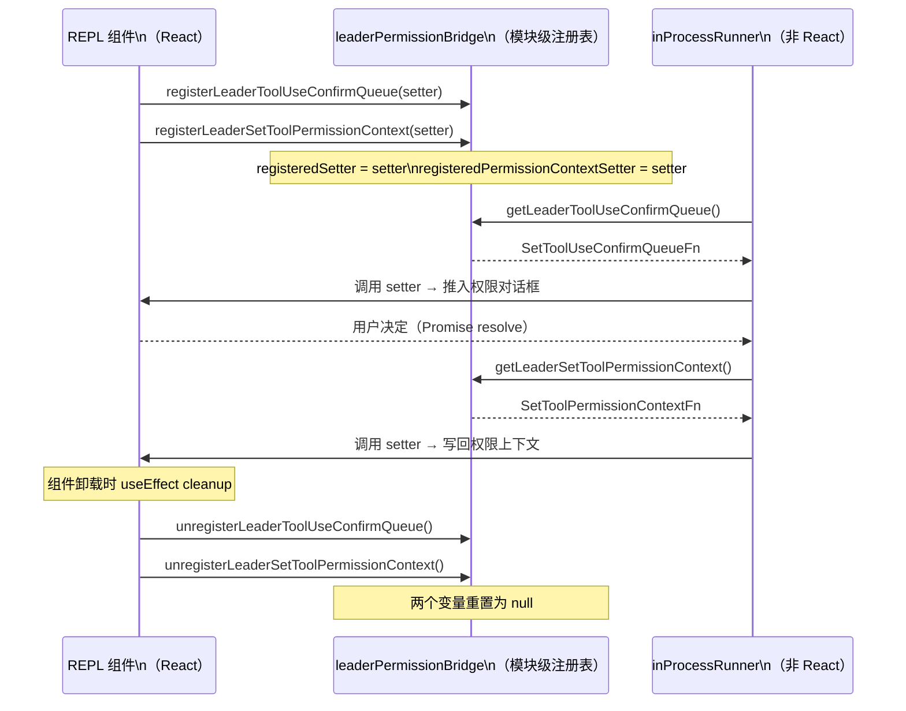

# 第 34 章：leaderPermissionBridge——跨进程权限协商模式

> "两个层次之间的依赖，只需要一个注册点和两个 null 变量。"

---

当进程内 Teammate（与 Leader 共享同一进程的子 Agent）需要向用户请求权限时，它面临一个架构难题：权限确认对话框是 React 组件，需要操作 React 的状态（`setToolUseConfirmQueue`）；但 Teammate 的权限检查代码运行在 `inProcessRunner.ts`——一个工具函数，不该直接引用 React 组件，否则会产生层次违反和循环依赖。

`leaderPermissionBridge.ts` 用 54 行代码解决了这个问题：两个模块级 `null` 变量充当"注册点"，REPL 组件挂载时主动调用 `register*` 注入 React 的状态 setter 函数，非 React 代码通过 `get*` 获取并调用。这是**模块级服务定位器**（Module-Level Service Locator）模式的最小实现。

两个注册点职责分离：一个负责弹出权限确认对话框（`ToolUseConfirmQueue`），另一个负责把用户授予的权限写回 Leader 的上下文（`ToolPermissionContext`）。六个函数，两个 null 变量，解决了 React 与非 React 代码之间的跨层依赖问题。

---

## 问题：非 React 代码如何操作 React 状态

进程内 Teammate（in-process teammate）是与 Leader 运行在同一 Node.js 进程中的子 Agent。它的优势是通信零延迟（不需要 IPC 或 mailbox），劣势是它的工具权限检查发生在 `inProcessRunner.ts`——一个与 React 无关的工具函数。

当 Teammate 要执行一个需要用户确认的操作（如写入特定目录），系统需要：
1. 向 Leader 的 UI 推送一个权限确认对话框
2. 暂停 Teammate 的执行，等待用户决定
3. 用户点击"允许"后，把这个权限更新写回 Leader 的权限上下文

步骤 1 和步骤 3 都需要操作 React 状态——`setToolUseConfirmQueue` 和 `setToolPermissionContext`。但直接让 `inProcessRunner.ts` `import` 这些 React state，会破坏代码分层（工具函数不该知道 React 细节），也会引入循环依赖（React 组件依赖工具函数，工具函数又依赖 React 组件）。

文件头注释直接说明了解决方案：

> "Module-level bridge that allows the REPL to register its setToolUseConfirmQueue and setToolPermissionContext functions for in-process teammates to use."
> （模块级桥接，允许 REPL 注册其 setToolUseConfirmQueue 和 setToolPermissionContext 函数，供进程内 Teammate 使用。）

**图 34-1：leaderPermissionBridge 注册时序**



---

## 源码实例 1：模块级变量 + register/get/unregister

`leaderPermissionBridge.ts` 的全部内容是两个模块级变量和六个函数（`src/utils/swarm/leaderPermissionBridge.ts:25`）：

```typescript
// src/utils/swarm/leaderPermissionBridge.ts:15-40
export type SetToolUseConfirmQueueFn = (
  updater: (prev: ToolUseConfirm[]) => ToolUseConfirm[],
) => void

export type SetToolPermissionContextFn = (
  context: ToolPermissionContext,
  options?: { preserveMode?: boolean },
) => void

let registeredSetter: SetToolUseConfirmQueueFn | null = null
let registeredPermissionContextSetter: SetToolPermissionContextFn | null = null

export function registerLeaderToolUseConfirmQueue(
  setter: SetToolUseConfirmQueueFn,
): void {
  registeredSetter = setter
}

export function getLeaderToolUseConfirmQueue(): SetToolUseConfirmQueueFn | null {
  return registeredSetter  // 未注册时返回 null，不抛出
}

export function unregisterLeaderToolUseConfirmQueue(): void {
  registeredSetter = null
}
```

**源码参考：** `src/utils/swarm/leaderPermissionBridge.ts:25`

两个 `let` 变量初始值为 `null`——不是 `undefined`，而是显式的 `null`。这个选择有类型语义意义：`null` 表示"曾经有、现在没有"（或"明确未设置"），与 `undefined`（"从未被赋值"）在 TypeScript 中语义不同。调用方通过检查 `!== null` 判断是否已注册，而不需要处理 `undefined` 的特殊情况。

`get*` 函数返回 `null` 而非抛出异常。这是**优雅降级**设计：如果 Teammate 在 REPL 初始化之前调用 `getLeaderToolUseConfirmQueue()`（理论上不应该发生，但这是防御性编程），返回 `null` 而不是让进程崩溃。调用方（`inProcessRunner.ts`）检查返回值决定后续行为：

```typescript
// src/utils/swarm/inProcessRunner.ts:195-200（简化）
const setToolUseConfirmQueue = getLeaderToolUseConfirmQueue()
if (setToolUseConfirmQueue) {
  // 正常路径：弹出权限对话框，等待用户决定
  return new Promise<PermissionDecision>(resolve => {
    setToolUseConfirmQueue(queue => [...queue, { ...permissionItem }])
    // ...等待 onAllow/onAbort 回调
  })
}
// null 降级路径：无 bridge，默认行为（ask/reject）
```

**源码参考：** `src/utils/swarm/inProcessRunner.ts:195`

在正常路径（`setToolUseConfirmQueue` 非 null）中，Teammate 调用 `setToolUseConfirmQueue` 把一个 `ToolUseConfirm` 对象推入 Leader 的权限确认队列。这个队列是 React `useState` 的一部分——`setToolUseConfirmQueue` 就是 React 的 state setter。调用它触发 React 重渲染，Leader 的 UI 弹出权限确认对话框。Teammate 的执行在 `new Promise()` 中暂停，直到用户点击"允许"（触发 `onAllow` 回调）或"拒绝"（触发 `onAbort`）。

REPL 组件使用 `useEffect` 在挂载时注册、卸载时清理（`src/screens/REPL.tsx:1178`）：

```typescript
// src/screens/REPL.tsx:1178-1181
useEffect(() => {
  registerLeaderToolUseConfirmQueue(setToolUseConfirmQueue)
  return () => unregisterLeaderToolUseConfirmQueue()  // 卸载时清理
}, [setToolUseConfirmQueue])
```

**源码参考：** `src/screens/REPL.tsx:1178`

`useEffect` 的返回函数（cleanup function）在 REPL 组件卸载时自动调用，把模块变量重置为 `null`。这是 React 生命周期与模块级变量的完美配合——React 负责"何时注册/注销"（挂载/卸载），模块负责"存储什么"（null 变量），非 React 代码负责"何时读取"（运行时 `get*`）。

---

## 源码实例 2：SetToolPermissionContextFn 与 preserveMode

第二个注册点（`src/utils/swarm/leaderPermissionBridge.ts:43`）处理权限状态的反向同步：

```typescript
// src/utils/swarm/leaderPermissionBridge.ts:43-54
export function registerLeaderSetToolPermissionContext(
  setter: SetToolPermissionContextFn,
): void {
  registeredPermissionContextSetter = setter
}

export function getLeaderSetToolPermissionContext(): SetToolPermissionContextFn | null {
  return registeredPermissionContextSetter
}

export function unregisterLeaderSetToolPermissionContext(): void {
  registeredPermissionContextSetter = null
}
```

**源码参考：** `src/utils/swarm/leaderPermissionBridge.ts:43`

`SetToolPermissionContextFn` 类型（第 16 行）带有一个可选的 `options?: { preserveMode?: boolean }` 参数。这个 `preserveMode` 选项的设计意图在 `inProcessRunner.ts` 的调用处有详细注释：

```typescript
// src/utils/swarm/inProcessRunner.ts:267-275（简化）
const setToolPermissionContext = getLeaderSetToolPermissionContext()
if (setToolPermissionContext) {
  const updatedContext = applyPermissionUpdates(
    currentAppState.toolPermissionContext,
    permissionUpdates,
  )
  // preserveMode: true — 防止 Worker 的 'acceptEdits' 上下文
  // 泄漏回 Leader，Leader 的权限模式不应被 Worker 覆盖
  setToolPermissionContext(updatedContext, { preserveMode: true })
}
```

**源码参考：** `src/utils/swarm/inProcessRunner.ts:267`

`preserveMode: true` 解决了一个微妙的状态污染问题：当 Teammate（Worker）在执行任务时，它的权限上下文可能进入 `acceptEdits` 模式（自动接受编辑操作）。如果把这个经过 Worker 转换的上下文直接写回 Leader，Leader 的权限模式就会被 Worker 的状态覆盖——用户在 Leader 界面看到的权限状态变成了 Worker 的操作状态，而不是 Leader 自己的状态。

`preserveMode: true` 告诉 `setToolPermissionContext` 实现：更新权限规则（`permissionUpdates`），但保留当前的 Leader 权限模式，不让 Worker 的模式泄漏。这是"只更新我需要更新的部分"的精确写入语义，与粗粒度的全量覆盖相比，避免了状态污染。

两个注册点的职责分离（Confirm Queue vs Permission Context）体现了**单一职责原则**在模块级变量上的应用：如果把两个 setter 塞进单一的全局对象（如 `window.leaderBridge = { queueSetter, contextSetter }`），任何一个 setter 的更新都会触发整个对象替换，增加误用风险。两个独立的模块级变量让每个注册点完全独立，互不影响。

---

## 模式剖析：模块级服务定位器的三个特征

**模块级服务定位器**模式有三个与类级别服务定位器（GoF Service Locator）不同的特征：

**1. 无类、无实例**：服务定位器的"存储"是模块级 `let` 变量，不是类的实例变量。每个模块只有一个作用域，模块变量天然是单例，无需额外实现单例模式。这比"用 `class` 实现 + `getInstance()` + 双重检查锁定"简洁得多。

**2. 生命周期与 React 挂钩**：`register/unregister` 通过 `useEffect` 绑定到 React 组件的挂载/卸载生命周期。React 的 cleanup function 保证了"REPL 卸载时 bridge 一定被清理"，不依赖调用方手动管理。

**3. 类型安全的函数引用**：注册的不是对象实例，而是类型精确的函数引用（`SetToolUseConfirmQueueFn`、`SetToolPermissionContextFn`）。TypeScript 类型系统在编译时验证：注入的函数签名与期望的签名一致——这比 `any` 类型的全局对象安全得多。

---

## 适用范围

| 场景 | 适用性 | 理由 | 替代方案 |
|------|--------|------|---------|
| 非 React 代码需要操作 React 状态 | ✓ | bridge 解耦 React 和非 React，消除循环依赖 | 直接 import React state（但层次违反）|
| 依赖需要在运行时注入（非构建时）| ✓ | register/get/unregister 支持动态生命周期 | 构造函数注入（但不适合 React hook 场景）|
| 需要强类型的函数引用传递 | ✓ | TypeScript 类型别名保证接口契约 | `any` 类型全局变量（不安全）|
| 多实例并发使用（同时多个 REPL）| ✗ | 模块变量全局单例，并发访问会互相覆盖（推断）| 实例级依赖注入容器 |
| 需要版本化或可重放的依赖历史 | ✗ | null 变量不记录历史，无法回放 | 事件日志 + 重放机制 |

---

## 权衡与局限

**权衡 1：全局单例的测试隔离**

模块级变量是全局状态。测试代码如果调用了 `register*` 但测试结束时没有调用 `unregister*`，会把测试中注入的 mock setter 留给后续测试——导致测试间互相污染。正确的测试用法是在 `afterEach` 中调用 `unregister*`，或使用 mock 框架自动恢复模块状态（如 Jest 的 `jest.resetModules()`）。

**权衡 2：null 返回的调用方负担**

`get*` 返回 `null` 而非抛出异常，这把处理"未注册"情况的责任转移给了每一个调用方。`inProcessRunner.ts` 里有 `if (setToolUseConfirmQueue)` 检查——这是正确的防御性代码，但如果某个调用方忘记检查，直接调用 `getLeaderToolUseConfirmQueue()!(...)` 会在 REPL 未初始化时运行时崩溃。显式 `null` 类型迫使 TypeScript 编译器警告"必须处理 null"，但 `!` 操作符可以绕过这个保护。

**权衡 3：注册时机的隐性约定**

`register` 必须在 `get` 之前调用。这个顺序约定没有代码强制——如果某个路径在 REPL `useEffect` 运行之前就调用了 `getLeaderToolUseConfirmQueue()`，会得到 `null` 并走降级路径。当前的 React 渲染模型保证了 `useEffect` 在组件挂载后立即运行，在 `inProcessRunner` 需要权限之前（需要用户操作触发），注册一定已完成。但这是运行时的时序保证，不是编译期的静态保证。

---

## 与已知模式的对话

**与 GoF 服务定位器（Service Locator）**：GoF 服务定位器是一个中央注册表，调用方通过名称查找依赖（如 `ServiceLocator.getInstance("database")`）。`leaderPermissionBridge` 是模块级服务定位器的最小实现：没有名称查找（只有两个固定的 slot），没有类，只有两对 `register/get` 函数。本质一致，实现更轻量。差异在于：GoF 服务定位器通常是单例类，用静态方法操作；本模式用模块作用域替代类作用域，更符合函数式风格。

**与 IoC 容器（Inversion of Control Container）**：IoC 容器在启动时注入所有依赖，之后不变。`leaderPermissionBridge` 是运行时注入——REPL 组件每次挂载都重新注册，卸载时清理。这种动态注入适合 React 组件这类有生命周期的依赖提供方，但 IoC 容器不适合（IoC 通常是"一次注入，永久使用"）。

**与 Event Emitter（Node.js EventEmitter）**：EventEmitter 也能解耦发送方和接收方——注册事件监听器，触发时调用。差异在于：EventEmitter 是多对多（多个监听器），`leaderPermissionBridge` 是一对一（只有最后一次 register 的 setter 有效）；EventEmitter 是异步通知，`leaderPermissionBridge` 是同步调用函数引用。对于"我只需要当前活跃的 REPL 的 setter"这个需求，单 slot 变量比 EventEmitter 更精确。

---

## 模式提炼

### 模块级服务定位器（Module-Level Service Locator）

**解决的问题**：非 React 代码需要操作 React 状态 setter，但直接引用会导致循环依赖或层次违反；需要一个解耦机制在两层之间传递函数引用。

**核心做法**：模块级 `null` 变量作为 slot，React 侧通过 `useEffect` 调用 `register*` 注入 state setter，非 React 侧调用 `get*` 运行时获取；`unregister*` 在 React cleanup 中恢复 null。

**前置条件**：双方有明确的生命周期（register 早于 get 调用）；只需要单实例（模块级单例足够）；调用方能处理 `get*` 返回 null 的情况。

**源码证据**：`src/utils/swarm/leaderPermissionBridge.ts:25`（`let registeredSetter: ... | null = null` 模块级 null slot）；`src/screens/REPL.tsx:1178`（`useEffect` 生命周期绑定注册/清理）

---

### 精确写入（Precise Write）

**解决的问题**：跨层状态同步时，调用方只想更新状态的特定部分（权限规则），不想覆盖其他部分（权限模式），避免状态污染。

**核心做法**：函数类型定义中包含 `options?: { preserveMode?: boolean }` 等控制参数，让调用方精确声明"我想更新什么，我想保留什么"；实现方根据选项只修改声明的部分。

**前置条件**：状态对象有多个正交的子状态（权限规则 vs 权限模式）；不同调用方对不同子状态有不同的更新意图。

**源码证据**：`src/utils/swarm/leaderPermissionBridge.ts:16`（`SetToolPermissionContextFn` 类型含 `preserveMode` 选项）；`src/utils/swarm/inProcessRunner.ts:267`（调用时传 `{ preserveMode: true }` 防止 Worker 模式污染 Leader）

---

## 你能做什么

- **用模块级 null 变量实现轻量级服务定位器**，避免类单例的样板代码（`getInstance()`、构造函数、锁）。对于需要跨层传递函数引用的场景，两行 `let` 变量 + 三对 `register/get/unregister` 就够了。

- **让 `get*` 返回 null 而非抛出异常**，把处理"未注册"的责任交给调用方。TypeScript 的 nullable 类型（`T | null`）迫使调用方在编译期处理 null 情况，比运行时异常更安全。

- **用 `useEffect` cleanup 绑定 unregister 逻辑**，而不是手动管理。React 的 cleanup function 在组件卸载时自动调用，保证模块变量在 React 组件销毁后总是被重置。

- **为跨层函数传递定义 TypeScript 类型别名**（如 `SetToolUseConfirmQueueFn`）。类型别名让调用方和注册方都知道期望的函数签名，类型错配在编译期暴露而非运行时。

- **分离不同职责的注册点**（ConfirmQueue vs PermissionContext），而非共用一个 `options` 对象。每个注册点独立，更新一个不影响另一个，测试时可以单独 mock 某一个。

- **在函数类型中设计精确写入选项**（如 `preserveMode`），让调用方声明"我不想覆盖的部分"，避免跨层状态同步时的意外污染。

---

`leaderPermissionBridge` 解决的是进程内 Teammate 与 Leader 之间的权限协商。当多个 Teammate 同时对同一个权限做决策时——不同 Teammate 的权限决策如何合并？这是 `permissionSync` 的职责，也是第 36 章的主题（详见第 36 章）。第 35 章将先介绍三种 Teammate 后端的选型逻辑（详见第 35 章）。
