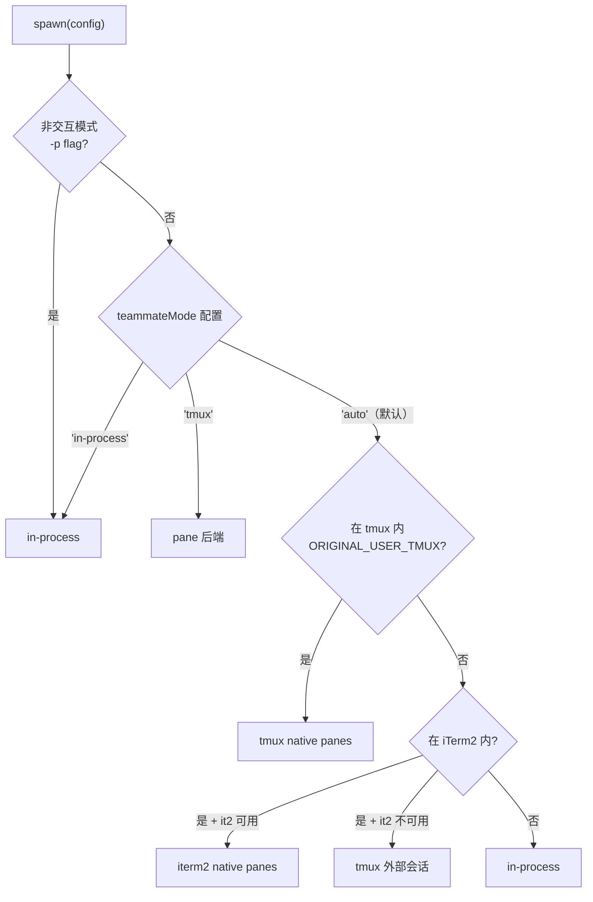

# 第 35 章：三种 Teammate 后端——`in-process/tmux/auto` 的选型逻辑

> "运行环境决定执行策略——同一行 spawn 代码，在 tmux 里打开新面板，在 CI 里运行进程内线程。"

---

Claude Code 的 Swarm 模式面临一个环境适应性问题：在用户的 tmux 会话中，Teammate 应该运行在可见的终端面板里，方便用户实时查看进度；在 CI/CD 环境或 `-p` 非交互模式中，根本没有终端可以打开面板，Teammate 必须在同一进程内运行。

这两种需求截然不同，但调用方的代码不应该感知差异——一个 `spawn(config)` 调用，根据当前运行环境自动选择最合适的后端。

这就是**可插拔运行后端**（Pluggable Runtime Backend）模式的实现：`TeammateExecutor` 统一接口下，三种后端（in-process、tmux、iterm2）各司其职，`auto` 检测逻辑在启动时一次性评估环境，缓存结果供后续所有 `spawn` 调用复用。

本章揭示后端选择的完整优先级链、`isInsideTmuxSync` 为何只检查环境变量而不执行命令、以及 TmuxBackend 如何用 Promise 链实现并发保护——不用 mutex，只用 4 行代码。

---

## 问题：不同环境需要不同的执行模型

Teammate 执行模型的选择影响多个维度：

**进程隔离**：tmux/iterm2 后端在独立进程中运行 Teammate，一个 Teammate 崩溃不影响 Leader；in-process 后端在同一进程运行，崩溃会传播。

**启动延迟**：创建一个 tmux pane 需要执行 shell 命令、等待 shell 初始化（`PANE_SHELL_INIT_DELAY_MS = 200` 毫秒），加上 Claude 二进制的启动时间（数百毫秒到秒级）；in-process 只是在同一进程内启动一个 Agent 循环，延迟接近零。

**可视化**：tmux/iterm2 后端能在独立面板中展示 Teammate 的实时输出，适合交互式使用；in-process 的输出通过 AppState 回传，只能在 Leader 的 UI 中以聚合形式展示。

没有一种后端能在所有维度都最优——这是典型的"可插拔后端"场景。

**图 35-1：三种 Teammate 后端对比**

| 维度 | in-process | tmux/iterm2 | auto 检测 |
|------|-----------|------------|----------|
| 进程隔离 | ✗（共享进程）| ✓（独立进程）| 随环境决定 |
| 启动延迟 | <1ms | 数百ms-秒级 | 随后端决定 |
| 可视化面板 | ✗ | ✓（独立 pane）| 随环境决定 |
| 资源共享 | ✓（API/MCP 连接）| ✗（各自独立）| 随后端决定 |
| 适用环境 | CI/CD、非交互模式 | 交互终端（tmux/iTerm2）| 自动 |
| 依赖外部工具 | ✗ | ✓（tmux 或 it2）| — |

---

## 源码实例 1：环境检测——只用环境变量，不执行命令

环境检测的核心在 `detection.ts`。最关键的设计决策是 `isInsideTmuxSync`（`src/utils/swarm/backends/detection.ts:36`）：

```typescript
// src/utils/swarm/backends/detection.ts:6-36（简化）
/**
 * 在模块加载时捕获，因为 Shell.ts 后续可能覆盖 TMUX 环境变量。
 */
const ORIGINAL_USER_TMUX = process.env.TMUX

/**
 * 检查是否在 tmux 会话内（同步版本）。
 *
 * 重要：我们只检查 TMUX 环境变量，不执行 `tmux display-message` 作为后备，
 * 因为该命令在系统上任意一个 tmux 服务器运行时都会成功——
 * 而不仅仅是当前进程在 tmux 内部时。
 */
export function isInsideTmuxSync(): boolean {
  return !!ORIGINAL_USER_TMUX
}
```

**源码参考：** `src/utils/swarm/backends/detection.ts:36`

注释中的解释揭示了一个常见的检测陷阱：`tmux display-message` 命令在系统上只要有**任意** tmux 服务器在运行就会成功——即使当前进程根本不在 tmux 内部。如果依赖这个命令做检测，在用户后台运行了其他 tmux 会话的情况下会得到假阳性，错误地选择 TmuxBackend。

正确方式是检查 `TMUX` 环境变量——tmux 只在进程真正运行于 tmux 会话内时才设置这个变量。这是"只用环境变量，不执行外部命令"的检测策略。

更微妙的是：`ORIGINAL_USER_TMUX` 在**模块加载时**（`process.env.TMUX`）而非函数调用时捕获。注释解释原因：`Shell.ts` 在初始化 Claude 自己的 tmux socket 时可能覆盖 `TMUX` 环境变量——如果此时再检查 `process.env.TMUX`，可能读到 Claude 自己的 socket 值而非用户原始的 tmux 会话标识。模块加载时捕获，保留了用户启动 Claude 时的环境快照。

`registry.ts` 的 `detectAndGetBackend` 实现了完整的后端选择优先级链：

```typescript
// src/utils/swarm/backends/registry.ts（简化优先级逻辑）
export async function detectAndGetBackend(): Promise<BackendDetectionResult> {
  if (cachedDetectionResult) return cachedDetectionResult  // 缓存命中直接返回

  const insideTmux = await isInsideTmux()
  const inITerm2 = isInITerm2()

  // 优先级 1：在 tmux 内 → 始终用 tmux
  if (insideTmux) { return { backend: TmuxBackend, isNative: true, ... } }

  // 优先级 2：在 iTerm2 内 + it2 可用 → 用 iterm2 native panes
  if (inITerm2 && !preferTmux) {
    if (await isIt2CliAvailable()) { return { backend: ITermBackend, isNative: true, ... } }
  }

  // 优先级 3：tmux 可用 → 用 tmux 外部会话
  if (await isTmuxAvailable()) { return { backend: TmuxBackend, isNative: false, ... } }

  // 没有可用后端 → 抛出含平台安装说明的错误
  throw new Error(getTmuxInstallInstructions())
}
```

**源码参考：** `src/utils/swarm/backends/registry.ts`

优先级顺序揭示了两个设计意图：**tmux 在用户 tmux 会话内优先于 iTerm2**（即使在 iTerm2 中打开了 tmux），因为已存在的 tmux 上下文比 iTerm2 分割面板更可预测；**结果缓存**（`cachedDetectionResult`）确保检测只运行一次——多次 `spawn` 不会重复执行环境探测命令。

`isInProcessEnabled` 是 `auto` 模式的决策函数：

```typescript
// src/utils/swarm/backends/registry.ts（isInProcessEnabled 核心逻辑）
export function isInProcessEnabled(): boolean {
  // 非交互模式（-p 模式）：强制 in-process
  if (getIsNonInteractiveSession()) return true

  const mode = getTeammateMode()  // 'in-process' | 'tmux' | 'auto'

  if (mode === 'in-process') return true
  if (mode === 'tmux') return false

  // auto 模式：在 tmux 或 iTerm2 内 → pane 后端；否则 → in-process
  const insideTmux = isInsideTmuxSync()   // 同步，用模块加载时的快照
  const inITerm2 = isInITerm2()
  return !insideTmux && !inITerm2
}
```

**源码参考：** `src/utils/swarm/backends/registry.ts`

`auto` 模式的判断逻辑是：有可视化面板（tmux 或 iTerm2）就用 pane 后端，没有就用 in-process。非交互模式（`-p` 标志）强制 in-process，因为没有终端就没有面板可以打开。

---

## 源码实例 2：InProcessBackend 与 TmuxBackend 的实现差异

`InProcessBackend` 的注释（`src/utils/swarm/backends/InProcessBackend.ts:28`）清晰地说明了进程内 Teammate 的资源共享特性：

```typescript
// src/utils/swarm/backends/InProcessBackend.ts:28-54（简化）
/**
 * 与基于 pane 的后端（tmux/iTerm2）不同，in-process teammates 通过
 * AsyncLocalStorage 在同一 Node.js 进程中以隔离上下文运行。它们：
 * - 与 Leader 共享资源（API 客户端、MCP 连接）
 * - 通过基于文件的 mailbox 通信（与 pane-based teammates 相同）
 * - 通过 AbortController 终止（而非 kill-pane）
 *
 * 重要：spawn() 前必须调用 setContext() 提供 ToolUseContext。
 */
export class InProcessBackend implements TeammateExecutor {
  readonly type = 'in-process' as const
  private context: ToolUseContext | null = null

  /**
   * 设置 ToolUseContext。
   * spawn() 调用前必须通过 setContext() 设置，由 TeammateTool 在 spawn 前调用。
   */
  setContext(context: ToolUseContext): void {
    this.context = context
  }

  async isAvailable(): Promise<boolean> {
    return true  // 无外部依赖，始终可用
  }

  async spawn(config: TeammateSpawnConfig): Promise<TeammateSpawnResult> {
    if (!this.context) {
      return { success: false, error: 'InProcessBackend not initialized. Call setContext() before spawn().' }
    }
    // ...调用 spawnInProcessTeammate，启动 Agent 执行循环
  }
}
```

**源码参考：** `src/utils/swarm/backends/InProcessBackend.ts:38`

`setContext` 在构造函数之外单独调用（而不是构造函数注入）的原因是：`ToolUseContext`（包含 `getAppState`、`setAppState` 等函数）在 `InProcessBackend` 实例化时可能还不可用——它需要等到具体的工具调用上下文（`TeammateTool.run`）时才存在。这是**延迟注入**模式：对象先创建，依赖后注入，在实际使用（`spawn`）前完成初始化。

`TmuxBackend` 的并发保护机制（`src/utils/swarm/backends/TmuxBackend.ts:28`）是本章最精妙的设计：

```typescript
// src/utils/swarm/backends/TmuxBackend.ts:28-50（简化）
// 防止并行 spawn teammates 时竞态条件的锁机制
let paneCreationLock: Promise<void> = Promise.resolve()

/**
 * 获取 pane 创建锁，确保顺序执行。
 * 返回必须在完成时调用的释放函数。
 */
function acquirePaneCreationLock(): Promise<() => void> {
  let release: () => void
  const newLock = new Promise<void>(resolve => {
    release = resolve  // 把 resolve 赋给外部变量
  })

  const previousLock = paneCreationLock
  paneCreationLock = newLock  // 替换为新锁

  // 等上一个锁完成后返回 release 函数
  return previousLock.then(() => release!)
}
```

**源码参考：** `src/utils/swarm/backends/TmuxBackend.ts:28`

这个 4 行函数实现了**Promise 链锁**（Promise Chain Lock）——一种不需要 mutex 或信号量的轻量级串行化机制。原理是用 Promise 链代替锁：

1. 模块初始化时，`paneCreationLock` 是一个已 resolve 的 Promise
2. 第一个调用者进来：`previousLock = Promise.resolve()`，创建新的 `newLock`，替换全局锁，`previousLock.then()` 立即触发，返回 `release` 函数
3. 第二个调用者（在第一个未完成时）进来：`previousLock = newLock`（第一个调用者的锁，尚未 resolve），创建新的 `newLock` 替换全局锁，`previousLock.then()` 等待第一个调用者调用 `release()`

每个 spawn 调用都"排队"在前一个的 `then` 中——天然串行化，无需显式队列，无需 mutex，只需 4 行 Promise 代码。

为什么 TmuxBackend 需要串行化？注释说"tmux 命令不是原子性的"——如果两个 `spawn` 同时创建 pane，可能在同一个 window 中竞争布局，导致 pane 位置错误或命令执行顺序混乱。串行化保证每次 pane 创建都在前一个完成后进行，加上 `PANE_SHELL_INIT_DELAY_MS = 200` 的等待，确保 shell 初始化（rc 文件加载、提示符渲染）完成后再继续。

**图 35-2：auto 模式后端选择流程**



---

## 模式剖析：可插拔运行后端的三个约束

**可插拔运行后端**模式的核心是三个约束的组合：

**1. 统一接口抽象（Unified Interface Abstraction）**：`TeammateExecutor` 接口定义了所有后端必须实现的契约（`spawn`、`isAvailable` 等）。调用方只与接口交互，不知道底层是 in-process 还是 tmux。`getTeammateExecutor()` 是接口的唯一入口——它根据 `preferInProcess` 和 `isInProcessEnabled()` 选择并返回正确的后端实例。

**2. 启动时一次性检测（One-Time Startup Detection）**：`detectAndGetBackend` 的检测结果缓存在 `cachedDetectionResult` 中，整个进程生命周期只执行一次。这有两个好处：避免重复执行 `isTmuxAvailable()`（需要 exec 外部命令）；保证同一个会话内所有 spawn 使用同一个后端，避免同一会话中后端切换导致的一致性问题。

**3. 降级策略（Graceful Degradation）**：检测失败不是硬错误而是降级——`inProcessFallbackActive` 标志记录"pane 后端不可用，已降级为 in-process"。降级后所有后续 spawn 都走 in-process，而不是每次都重新尝试检测 pane 后端。这让系统在 tmux 安装损坏等边缘情况下仍能运行。

---

## 适用范围

| 场景 | 适用性 | 理由 | 替代方案 |
|------|--------|------|---------|
| 需要跨环境自适应（交互/非交互）| ✓ | auto 模式根据环境自动选择 | 配置文件手动指定（但用户体验差）|
| 并发 spawn 多个 Teammate | ✓ | TmuxBackend paneCreationLock 防竞态 | 串行 spawn（但慢，限制并发）|
| CI/CD 无终端环境 | ✓ | auto 检测非交互后选 in-process | 强制 tmux（CI 中无法工作）|
| 需要完全进程隔离 | ✓ | tmux/iterm2 独立进程天然隔离 | in-process（崩溃传播）|
| 超低延迟任务分派（<10ms）| ✓ | in-process 无进程启动开销 | tmux（数百ms pane 创建延迟）|
| 后端运行时动态切换 | ✗（谨慎）| 检测结果缓存后不响应环境变化 | 重启进程重新检测 |

---

## 权衡与局限

**权衡 1：in-process 的资源共享 vs 崩溃传播**

In-process Teammate 与 Leader 共享 API 客户端和 MCP 连接（注释"Share resources with the leader"），这减少了资源开销；但如果 Teammate 陷入无限循环或内存溢出，会影响整个 Leader 进程。tmux/iterm2 后端的独立进程天然隔离崩溃，代价是每个 Teammate 需要独立的 API 连接初始化（有延迟和资源开销）。

**权衡 2：`PANE_SHELL_INIT_DELAY_MS = 200` 的经验值**

200 毫秒是等待 pane shell 初始化的时间。注释说"enough for most shell configurations including slow ones like starship/oh-my-zsh"——但极慢的 shell 配置（如加载了大量插件的 zsh）可能需要更长时间。这个值太小会导致 Teammate 在 shell 就绪前就开始执行命令（可能找不到 PATH 中的工具）；太大会增加 spawn 延迟。200ms 是基于经验的折中，没有自适应检测机制（推断）。

**权衡 3：缓存检测结果不响应环境变化**

`cachedDetectionResult` 在进程启动后固定不变。如果用户在 Claude 运行期间开启了 tmux（或 it2 CLI 被卸载），检测结果不会更新。这是"稳定性 vs 实时性"的取舍——一个会话内后端一致是更重要的属性，实时环境变化通常不需要响应。`resetBackendDetection()` 函数（测试工具）可以重置缓存，但正常使用路径中没有这个调用。

---

## 与已知模式的对话

**与 GoF 策略模式（Strategy Pattern）**：策略模式定义可替换的算法族，调用方通过统一接口使用，在运行时切换算法。`TeammateExecutor` 接口（`spawn`、`isAvailable`）就是策略接口，`InProcessBackend`/`TmuxBackend`/`ITermBackend` 是具体策略。差异在于：GoF 策略通常由调用方或配置文件选择策略，本模式的策略选择是**自动检测**——由环境变量（`TMUX`、`TERM_PROGRAM`）和工具可用性（`isTmuxAvailable`、`isIt2CliAvailable`）自动决定。

**与 GoF 抽象工厂（Abstract Factory）**：抽象工厂创建一系列相关产品（`createWindow()`、`createButton()` 等），具体工厂实现不同系列。`detectAndGetBackend` 返回的 `BackendDetectionResult` 包含选定的 `backend` 实例，调用方用统一的 `PaneBackend` 接口操作它——这与抽象工厂有共同之处。差异在于：抽象工厂通常有多个产品方法，本模式只有一个 `TeammateExecutor` 接口。

**与 POSA 半同步/半异步（Half-Sync/Half-Async）**：POSA Half-Sync/Half-Async 模式用队列隔离同步和异步层。`paneCreationLock` 的 Promise 链实现了类似的串行化功能——多个并发的 spawn 请求通过 Promise 链变成串行执行。差异在于：POSA 的 Half-Sync/Half-Async 通常有显式的消息队列，本模式用纯 Promise 链隐式实现，更轻量。

---

## 模式提炼

### 可插拔运行后端（Pluggable Runtime Backend）

**解决的问题**：不同运行环境（交互终端 vs CI/CD）需要不同的 Teammate 执行模型，但调用方代码不应感知差异。

**核心做法**：定义 `TeammateExecutor` 统一接口；`auto` 检测在启动时运行一次，按环境变量/工具可用性决定后端，缓存结果；`getTeammateExecutor()` 作为唯一入口封装选择逻辑。

**前置条件**：后端选择条件可在启动时确定；不需要运行时后端切换；有明确的降级策略（pane 不可用 → in-process）。

**源码证据**：`src/utils/swarm/backends/detection.ts:36`（`isInsideTmuxSync` 只检查环境变量不执行命令）；`src/utils/swarm/backends/registry.ts`（`cachedDetectionResult`，一次检测缓存全程使用）

---

### Promise 链锁（Promise Chain Lock）

**解决的问题**：并发 spawn 多个 Teammate 时，非原子性的 pane 创建命令（tmux）会导致竞态条件，但不需要 mutex 等重量级同步原语。

**核心做法**：维护一个模块级 `paneCreationLock` Promise；每次 acquire 时用新 Promise 替换，新 Promise 的 resolve 作为 release 函数返回；下一个 acquire 等在旧锁的 `.then()` 上，自然形成串行队列。

**前置条件**：操作是异步的（可以 `await` 锁）；需要串行化而非并发；调用方会调用 release。

**源码证据**：`src/utils/swarm/backends/TmuxBackend.ts:28`（`let paneCreationLock = Promise.resolve()`）；`src/utils/swarm/backends/TmuxBackend.ts:40`（`acquirePaneCreationLock`，前一个锁的 `.then()` 触发串行）

---

## 你能做什么

- **只检查环境变量来检测运行环境**，不执行外部命令。`tmux display-message` 等命令在系统有其他 tmux 会话时会误报——环境变量（`TMUX`）才真正代表当前进程的上下文。

- **在模块加载时捕获环境变量快照**，而不是在函数调用时读取 `process.env`。其他代码（如 Shell.ts）可能修改 `process.env`，提前捕获保留原始状态。

- **缓存后端检测结果**，避免每次 spawn 都重复检测。环境在进程生命周期内通常不变，一次检测足够。用 `cachedResult !== null` 而不是 `cachedResult !== undefined` 作为检查条件，区分"已检测到空结果"和"从未检测"。

- **用 Promise 链实现轻量级串行化锁**：维护全局 `lock = Promise.resolve()`，每次 acquire 创建新 Promise 替换全局锁，把 resolve 作为 release 返回，在前一个锁的 `.then()` 中执行。这比 mutex 更简洁，在 async/await 代码中更自然。

- **为 InProcessBackend 提供两阶段初始化**（构造 + `setContext`），而非在构造时注入所有依赖。运行时上下文（如 `ToolUseContext`）通常在首次使用时才可用，不是在对象创建时。

---

三种后端定义了 Teammate 的运行形态。当多个 Teammate 并发执行时，它们对同一权限的决策如何同步，确保 Leader 界面的状态始终一致？这是 `permissionSync` 的职责，也是第 36 章的主题（详见第 36 章）。
