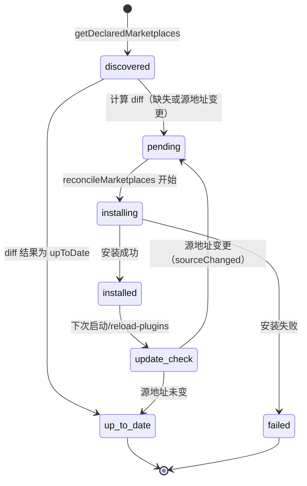
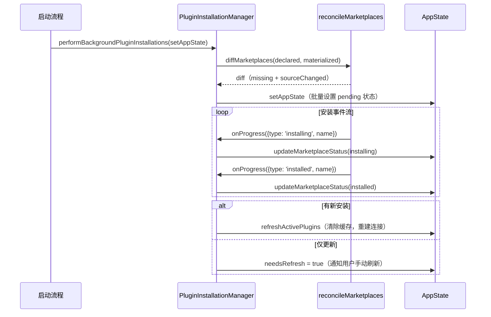
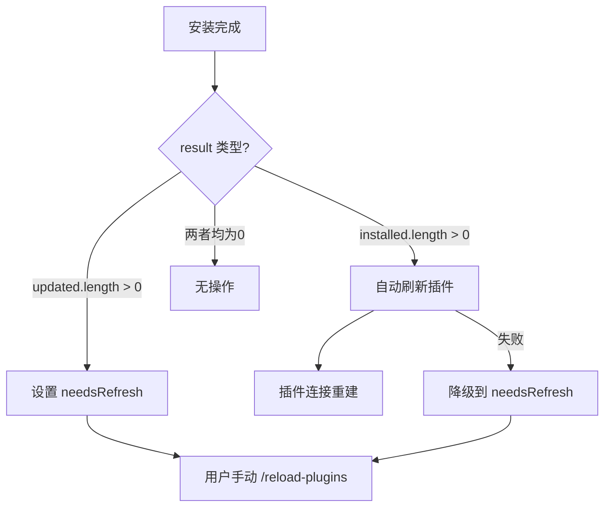
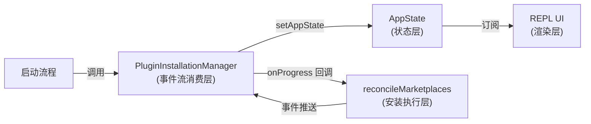

# 第 37 章：Plugin 生命周期——发现、安装、更新与卸载

> "安装不是一个结果，是一个过程。系统需要在这个过程的每一步都告诉 UI 发生了什么。"

---

用户运行 Claude Code 时，插件安装可能需要几秒甚至更长时间——克隆仓库、验证来源、注册到配置文件。如果系统简单地阻塞等待安装完成再渲染 UI，用户会看到一个无响应的终端，不知道在发生什么。更复杂的是，不同的插件可能处于不同的安装阶段：A 正在安装，B 刚完成，C 刚失败。

Claude Code 用事件驱动模型解决了这个问题：**安装器产生事件流（installing/installed/failed），UI 消费这个流并实时更新状态，两者完全解耦**。这是**后台安装事件驱动 UI 更新**（Background Install Event-Driven UI）模式：把后台操作的进度表达为事件序列，UI 通过 AppState 订阅这个序列，安装器不需要知道 UI 的实现细节。读完这章，你将理解 `PluginInstallationManager.ts` 的 184 行代码如何实现了安装过程与 UI 渲染的完全解耦，以及如何在自己的系统中设计类似的后台操作透明化机制。

---

## 问题：后台安装如何与 UI 保持同步

插件安装是一个多步骤的后台操作：计算哪些插件需要安装（diff）→ 初始化等待状态（pending）→ 开始下载（installing）→ 完成（installed）或失败（failed）。每一步都需要 UI 感知——用户需要看到进度指示器、知道哪个插件在安装、哪个安装失败了。

**图 37-1：插件生命周期全景——从发现到卸载**



生命周期有五个关键阶段：**发现**（从配置文件读取声明的 marketplace）→ **等待**（diff 计算后初始化 pending 状态）→ **安装**（实际克隆/下载）→ **已安装**（可用）→ **更新检查**（下次启动时 diff 比较源地址）。每个状态转换都对应 `PluginInstallationManager.ts` 中的一个具体操作。

**版本检查机制**：Claude Code 的「版本检查」不是比较语义版本号（如 `v1.2.3`），而是比较**源地址**（source URL 或 git 仓库路径）。`reconciler.ts` 中的 `diffMarketplaces` 函数对比声明的源地址（来自用户配置）和已安装的源地址（来自 `known_marketplaces.json`）。如果两者不相等（`!isEqual(normalizedIntent, state.source)`），该 marketplace 被标记为 `sourceChanged`，需要重新克隆。这个设计的含义是：更换了 marketplace 的 git 仓库地址或分支，就等于「版本更新」——系统不追踪 commit hash 或语义版本，只追踪「从哪里获取这个插件」。

最简单的做法是让安装器直接操作 UI 组件，但这会造成强耦合：安装器需要知道 UI 组件的 props 结构，UI 重构时安装器代码也需要跟着改。更好的做法是通过共享状态（AppState）解耦——安装器更新状态，UI 订阅状态变化自动渲染。

`PluginInstallationManager.ts` 只暴露两个函数：`updateMarketplaceStatus`（内部工具函数，更新单个 marketplace 的状态）和 `performBackgroundPluginInstallations`（入口函数，驱动整个安装流程）。两个函数都只依赖 `setAppState` 回调——安装器不持有任何 UI 引用，只通过这个回调把状态变化推入 React store。

**图 37-1：安装状态流转与 AppState 更新时序**



注意 `reconcileMarketplaces` 接收一个 `onProgress` 回调而非直接调用 `setAppState`——这让安装实现（`reconciler.js`）和状态管理（`PluginInstallationManager.ts`）保持独立：reconciler 不知道状态存在哪里，manager 不知道安装的实现细节。

---

## 源码实例1 — updateMarketplaceStatus：AppState 更新工厂

`updateMarketplaceStatus` 是整个模块中最清晰的一个工具函数。我们来看它如何处理「找到特定 marketplace，只更新它的状态」这个需求：

```typescript
function updateMarketplaceStatus(
  setAppState: SetAppState,
  name: string,
  status: 'pending' | 'installing' | 'installed' | 'failed',
  error?: string,
): void {
  setAppState(prevState => ({
    ...prevState,
    plugins: {
      ...prevState.plugins,
      installationStatus: {
        ...prevState.plugins.installationStatus,
        // 仅修改匹配 name 的 marketplace，其他保持不变
        marketplaces: prevState.plugins.installationStatus.marketplaces.map(
          m => (m.name === name ? { ...m, status, error } : m),
        ),
      },
    },
  }))
}
```

**源码参考：** `src/services/plugins/PluginInstallationManager.ts:30`

这里有三个嵌套的 `...spread` 更新。为什么需要三层？AppState 的 `plugins` 字段包含多个子字段（不仅是 `installationStatus`），`installationStatus` 本身也包含 `plugins` 和 `marketplaces` 两个列表。**每一层 spread 确保只修改目标字段，不影响同级的其他字段**——如果不写 `...prevState.plugins`，AppState 中 `plugins` 下的其他字段（如 `needsRefresh`）会被覆盖为 `undefined`。

`.map()` 加条件更新（`m.name === name ? { ...m, status, error } : m`）是不可变更新的标准做法：生成新数组，只有匹配的项被替换，其他项返回原引用，React 的 Object.is 检查可以跳过未变化项的重渲染。

`error?: string` 是可选参数——`status: 'failed'` 时传入错误信息，其他状态时不传（`error` 为 `undefined`）。`{ ...m, status, error }` 会把 `error: undefined` 写入对象，这比 `status: 'failed'` 时漏写 error 字段更安全——调用方不需要记住「只有 failed 时才传 error」，统一的结构让消费方代码更简洁。

这个函数体现了一个通用模式：**AppState 更新工厂**——接收 `setAppState` 回调和更新参数，内部负责不可变地定位和修改目标字段，外部不暴露 AppState 的内部结构。每次需要更新不同的 AppState 字段时，封装成独立的工厂函数，而不是让每个调用方都写三层 spread。

---

## 源码实例2 — performBackgroundPluginInstallations：事件流消费

`performBackgroundPluginInstallations` 是整个安装流程的入口。我们来看它如何把安装过程的每个阶段映射到 AppState 更新：

```typescript
export async function performBackgroundPluginInstallations(
  setAppState: SetAppState,
): Promise<void> {
  try {
    // 第一步：计算 diff（声明的 vs 已安装的）
    const declared = getDeclaredMarketplaces()
    const materialized = await loadKnownMarketplacesConfig().catch(() => ({}))
    const diff = diffMarketplaces(declared, materialized)

    const pendingNames = [
      ...diff.missing,                        // 需要全新安装
      ...diff.sourceChanged.map(c => c.name), // 源地址变化，需要重新安装
    ]

    // 第二步：批量初始化 pending 状态（显示所有等待安装的进度圈）
    setAppState(prev => ({
      ...prev,
      plugins: {
        ...prev.plugins,
        installationStatus: {
          marketplaces: pendingNames.map(name => ({
            name,
            status: 'pending' as const,
          })),
          plugins: [],
        },
      },
    }))

    if (pendingNames.length === 0) return  // 无需安装，早退出
```

**源码参考：** `src/services/plugins/PluginInstallationManager.ts:60`

diff 计算分两步：`loadKnownMarketplacesConfig()` 读取当前已安装状态（`.catch(() => ({}))` 确保读取失败时退化为空对象，不中断安装流程），`diffMarketplaces` 对比声明的和已安装的，返回需要安装的 `missing` 和需要更新的 `sourceChanged`。

注意 `pending` 状态在实际安装开始之前就被写入 AppState——这让用户在安装还未开始时就能看到「正在准备安装这些插件」的提示，而不是等待 reconcileMarketplaces 开始运行后才有反馈。

第三步是事件流消费——核心的 switch 分发：

```typescript
    const result = await reconcileMarketplaces({
      onProgress: event => {
        switch (event.type) {
          case 'installing':
            updateMarketplaceStatus(setAppState, event.name, 'installing')
            break
          case 'installed':
            updateMarketplaceStatus(setAppState, event.name, 'installed')
            break
          case 'failed':
            updateMarketplaceStatus(
              setAppState,
              event.name,
              'failed',
              event.error,
            )
            break
        }
      },
    })
```

**源码参考：** `src/services/plugins/PluginInstallationManager.ts:101`

`reconcileMarketplaces` 是一个异步操作，它在安装过程中通过 `onProgress` 回调推送事件，最终 resolve 为 `result`（含 `installed`、`updated`、`failed`、`upToDate` 四个列表）。switch 语句把三种事件类型映射到 AppState 更新：每个 marketplace 的状态从 `pending` 变为 `installing`，再变为 `installed` 或 `failed`，每次变化都通过 `setAppState` 触发 React 重渲染，UI 实时反映安装进度。

第四步是安装完成后的行为差异：

```typescript
    if (result.installed.length > 0) {
      // 新安装的 marketplace：自动刷新插件，修复「插件找不到」错误
      // 注释写道：fixes "plugin-not-found" errors from the initial cache-only load
      clearMarketplacesCache()
      try {
        await refreshActivePlugins(setAppState)
      } catch (refreshError) {
        // 自动刷新失败时降级：设置 needsRefresh，等用户手动 /reload-plugins
        clearPluginCache('...')
        setAppState(prev => {
          if (prev.plugins.needsRefresh) return prev  // 幂等检查
          return { ...prev, plugins: { ...prev.plugins, needsRefresh: true } }
        })
      }
    } else if (result.updated.length > 0) {
      // 只有更新时：通知用户手动刷新（不自动刷新）
      clearMarketplacesCache()
      clearPluginCache('...')
      setAppState(prev => {
        if (prev.plugins.needsRefresh) return prev
        return { ...prev, plugins: { ...prev.plugins, needsRefresh: true } }
      })
    }
```

**源码参考：** `src/services/plugins/PluginInstallationManager.ts:135`

注释解释了新安装和更新的处理差异：新安装的 marketplace 需要立即自动刷新，因为用户启动时可能已经遭遇了「插件找不到」的错误（初始加载用的是空缓存）；而更新只是改善体验，不紧急，选择通知用户手动决定何时刷新（`/reload-plugins` 命令），避免自动刷新打断正在进行的工作。

`if (prev.plugins.needsRefresh) return prev` 是幂等保护——如果已经是 `true`，返回同一个对象引用，React store 的 Object.is 检查跳过 listener，避免无意义的重渲染。这个模式在 `performBackgroundPluginInstallations` 中出现了两次，是写 AppState 更新时的常见防守性设计。

**图 37-2：安装完成后的两种处理路径**



---

## 模式剖析

后台安装事件驱动 UI 更新模式的四个核心要素：

**第一：事件流而非轮询**

安装器通过 `onProgress` 回调推送事件，消费方（manager）立即响应，不需要定时轮询安装器的状态。这让状态更新的延迟等于「事件产生到 switch 处理」的时间，而非轮询间隔。

**第二：状态在 AppState 中集中管理**

安装进度不存在安装器里，而是在 AppState 的 `plugins.installationStatus.marketplaces` 中。React 的响应式系统负责把状态变化传播到所有订阅了 AppState 的组件——安装器不需要知道哪些组件在监听状态，组件也不需要知道安装器的实现细节。

**第三：批量初始化先于实际操作**

在 `reconcileMarketplaces` 开始之前，所有 pending marketplace 的状态就已经被写入 AppState。这让 UI 在安装的最早时刻就有内容可渲染，而不是等到第一个 `installing` 事件才「突然」显示进度。

**第四：不可变更新 + 幂等保护**

所有 `setAppState` 调用都用 spread 语法做不可变更新，避免直接修改 AppState。关键路径上的状态更新加了幂等保护（`if (prev.xxx) return prev`），防止重复渲染。

**图 37-3：PluginInstallationManager 在插件系统中的位置**



---

## 适用范围

| 场景 | 适用性 | 理由 | 替代方案 |
|------|--------|------|---------|
| 后台异步操作需要实时反映进度到 UI | ✓ | 事件流 + AppState 更新自然解耦 | 轮询（浪费 CPU，延迟高）|
| 多个并发操作各自有独立进度 | ✓ | switch 处理不同名称的事件，AppState 独立跟踪每个状态 | 全局进度条（无法区分）|
| 操作进度可以表达为离散事件序列 | ✓ | installing/installed/failed 覆盖了所有阶段 | 百分比进度（需要准确的预估总量）|
| UI 框架支持细粒度状态订阅 | ✓ | React 的 Object.is 检查让未变化的字段不触发重渲染 | 全量状态替换（触发不必要重渲染）|
| 需要在操作完成后根据结果做不同处理 | ✓ | reconcileMarketplaces 返回 result，可在完成后 diff 处理 | 回调链（难以处理多种结果类型）|
| 安装操作耗时不确定（几秒到几分钟）| ✓ | 事件流让 UI 任何时刻都有最新状态 | 超时轮询（需要预设超时时间）|
| 需要跨进程边界通信安装进度 | ✗（谨慎）| 当前实现假设安装器和 UI 在同一进程内 | WebSocket/IPC + 序列化事件（需额外基础设施）|

---

## 权衡与局限

**权衡 1：事件只推进不回退**

`installationStatus.marketplaces` 的状态只会从 `pending` → `installing` → `installed/failed` 单向流转，不会回退。如果安装器因为某种原因重新尝试安装同一个 marketplace，状态可能从 `failed` 重新变为 `installing`，UI 会有短暂的"闪回"。当前实现假设每个 marketplace 只会经历一次完整的安装流程，这个假设在重试场景下可能被打破。

**权衡 2：AnAppState 是单一全局状态**

安装进度存在全局 AppState 中，这意味着同时进行的多次安装操作会共享同一个状态树。`updateMarketplaceStatus` 用 `map()` 遍历整个 `marketplaces` 数组来定位目标，时间复杂度 O(n)。当前 marketplace 数量较少（用户通常只有几个 marketplace），这不是性能问题。如果 marketplace 数量增长到几百个，可能需要改用 Map 结构做 O(1) 查找。

**权衡 3：自动刷新 vs 用户主动刷新的边界**

新安装触发自动刷新，更新只通知用户手动刷新——这个区分是基于「新安装影响功能可用性，更新只影响功能版本」的判断。但这个边界在实践中可能模糊：某些插件更新可能引入破坏性变更，自动刷新会导致正在使用的功能突然变化。当前策略偏向保守（更新不自动刷新），牺牲了及时性，换取了稳定性。

---

## 与已知模式的对话

**与观察者模式（Observer Pattern）**：经典观察者模式中，Subject 维护一个 Observer 列表，状态变化时逐一通知。本模式的区别在于**没有显式的订阅列表**——安装器通过 `setAppState` 更新共享状态，React 的响应式系统自动把变化传播到所有订阅了相关状态的组件。安装器不需要知道谁在「观察」安装进度，它只是更新状态。这是**隐式观察者**——共享状态替代了显式的 Observer 列表。

**与 Flux/Redux 的 Action-Reducer**：Redux 模式中，UI 派发 Action，Reducer 处理 Action 生成新状态，UI 订阅状态变化。本模式类似，但「Reducer」（AppState 更新逻辑）内嵌在 `performBackgroundPluginInstallations` 和 `updateMarketplaceStatus` 中，没有独立的 Reducer 文件。这是 Flux 思想的轻量实践：保留「事件驱动状态更新」的核心，去掉了 Action 类型注册、Reducer 切片等仪式感的部分。

---

## 模式提炼

### 后台安装事件驱动 UI 更新（Background Install Event-Driven UI）

**解决的问题**：后台安装操作需要实时反映进度到 UI，但安装器不应该直接操作 UI 组件，UI 也不应该轮询安装状态。

**核心做法**：安装器接收 `onProgress` 回调，安装过程中推送离散事件（installing/installed/failed）；消费方在 switch 中处理每个事件，调用 `setAppState` 更新 AppState；React 的响应式系统自动把状态变化传播到 UI。安装开始前批量初始化 pending 状态，让 UI 在第一个事件到达前就有内容渲染。

**前置条件**：安装操作可以表达为离散事件序列（不仅是「开始/结束」二态）；存在共享状态层（AppState 或等价的响应式存储）供安装器和 UI 共享；UI 框架支持细粒度状态订阅（避免全量重渲染）。

**源码锚点**：`src/services/plugins/PluginInstallationManager.ts:60`（performBackgroundPluginInstallations 的 diff-pending-event 三步流程）；`src/services/plugins/PluginInstallationManager.ts:104`（switch 事件分发）；`src/services/plugins/PluginInstallationManager.ts:30`（updateMarketplaceStatus 不可变更新工厂）

---

## 你能做什么

- **把后台操作的进度表达为离散事件序列**（pending/installing/installed/failed），而非只有「开始」和「结束」两个状态。离散事件让 UI 能实时反映进度，不需要等待操作完成才更新界面。

- **在实际操作开始之前批量初始化等待状态**。用户在操作的最早时刻就能看到「正在准备」的提示，而不是等到第一个进度事件才「突然」显示进度条。

- **封装 AppState 更新为工厂函数**（如 `updateMarketplaceStatus`），把不可变更新的嵌套 spread 逻辑集中在一处。调用方不需要知道 AppState 的内部结构，只需要调用工厂函数并传入目标标识和新值。

- **在 `setAppState` 回调中加幂等保护**（`if (prev.xxx) return prev`），当状态已经是目标值时返回原引用，让 React store 跳过不必要的 listener 循环。特别是对于可能被多个路径触发的状态更新（如 `needsRefresh = true`），幂等保护避免了重复渲染。

- **区分「立即影响功能可用性」的操作（自动刷新）和「只影响功能版本」的操作（通知用户手动刷新）**。自动刷新提高及时性，手动刷新保障稳定性——根据操作对用户当前工作的影响程度选择策略。

- **用 `onProgress` 回调而非直接传入状态管理接口**让安装执行层（reconciler）与状态管理层（manager）解耦。reconciler 不需要知道状态存在哪里，manager 不需要知道安装的实现细节，两者可以独立演化。

---

第 37 章揭示了插件安装的事件驱动架构——安装器通过事件流推送进度，manager 消费事件更新 AppState，UI 响应式渲染。安装完成后，插件是如何被发现并注册到 Marketplace 的？Marketplace 协议和插件包的结构——这是第 38 章的主题（详见第 38 章）。
