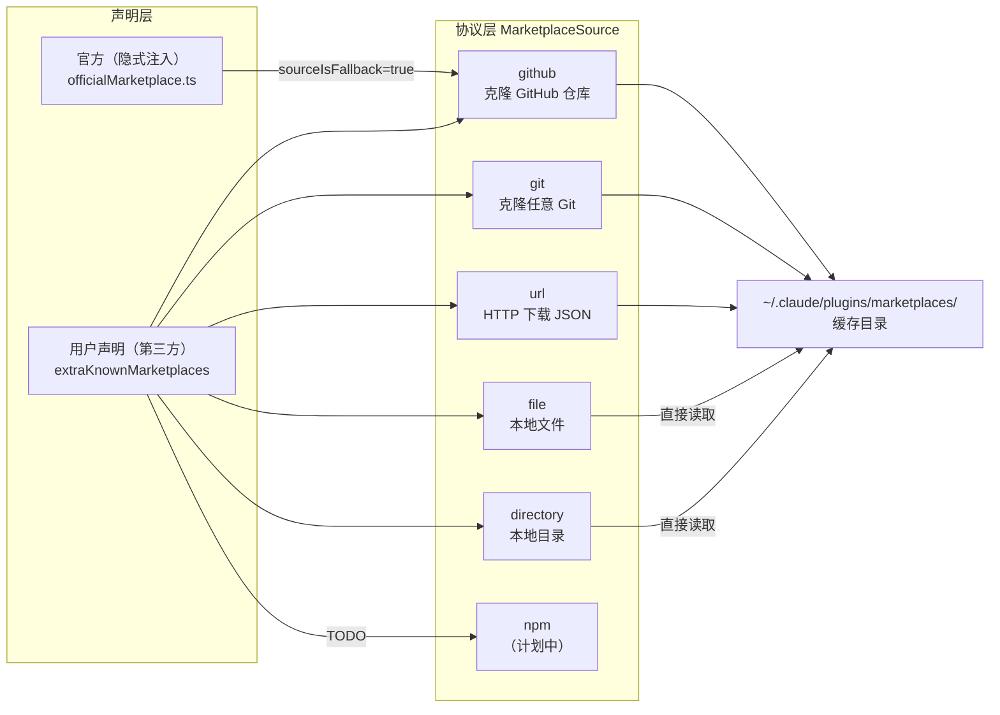
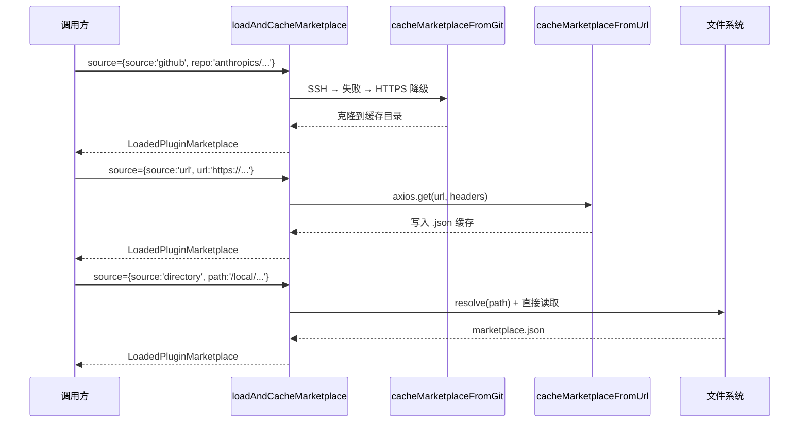
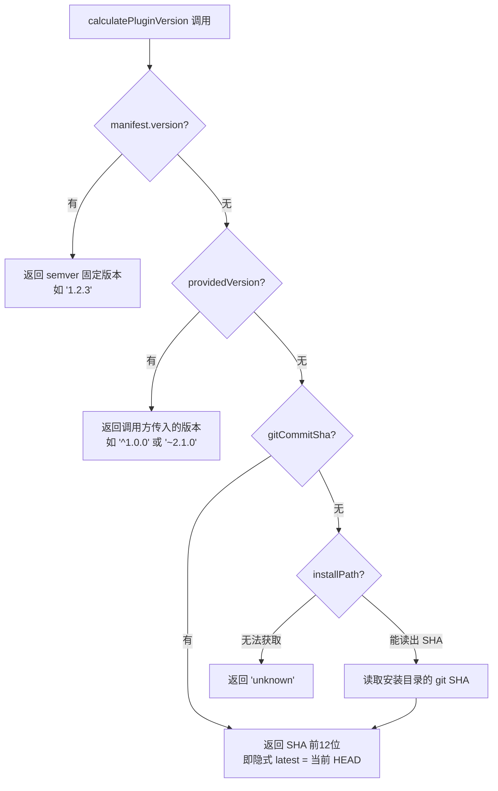
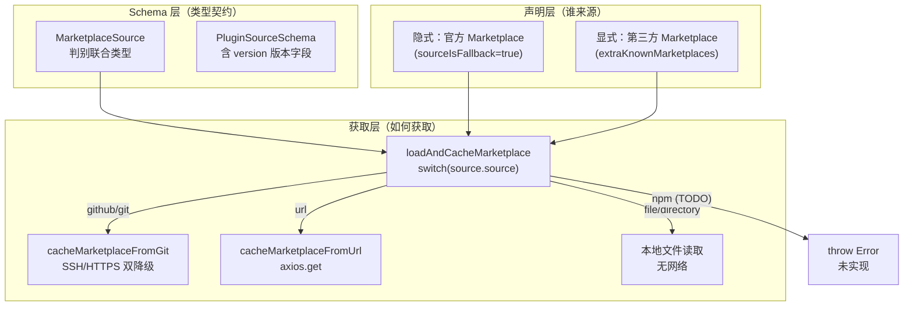
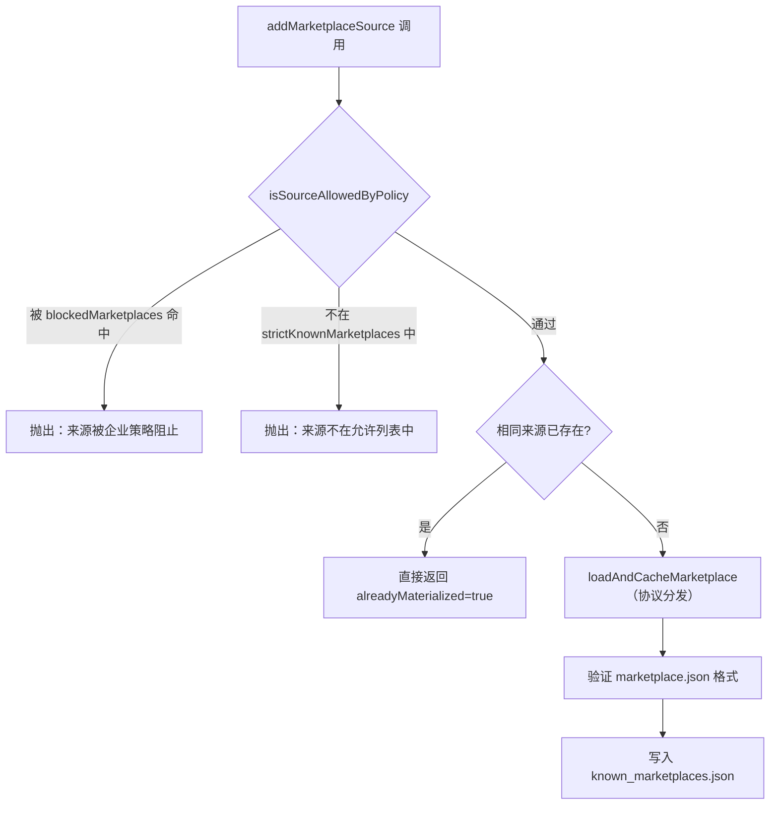

# 第 38 章：Marketplace 协议——官方注册表与第三方源

> "只有官方 Marketplace 可以被隐式声明——它是我们内置的唯一来源。其他 Marketplace 没有默认来源可以注入。"
> （原文："Only the official marketplace can be implicitly declared — it's the one built-in source we know. Other marketplaces have no default source to inject."）

---

用户从 GitHub 仓库、企业内部 Git 服务器、URL 甚至本地目录添加插件商店——Claude Code 的 Marketplace 系统支持这所有来源。但每种来源的获取协议完全不同：GitHub 仓库需要 SSH 或 HTTPS 克隆，URL 来源需要 HTTP 请求，本地目录只需要文件系统读取。如果为每种来源写独立的处理逻辑，代码会在三处散开，添加新来源类型时需要修改多个文件。

Claude Code 用「双源插件注册表（Dual-Source Plugin Registry）」模式解决了这个问题：用 TypeScript 的 discriminated union 把所有来源协议统一为一个 `MarketplaceSource` 类型，用 switch 语句把协议差异封装在 `loadAndCacheMarketplace` 函数内部；官方 Marketplace 作为内置默认值被隐式声明，用户声明的第三方 Marketplace 通过相同的接口处理。读完这章，你将理解 `marketplaceManager.ts` 如何把协议多样性封装在单一函数后面，以及 `PluginSourceSchema` 中的版本字段如何支持 semver 范围解析。

---

## 节 38.1：问题——多协议来源如何统一抽象

Claude Code 的插件系统需要支持多种来源类型：

- **GitHub**：克隆 `owner/repo` 仓库（Smart SSH/HTTPS 自动选择）
- **Git**：克隆任意 Git 仓库 URL（支持 Azure DevOps、AWS CodeCommit 等）
- **URL**：直接 HTTP 下载 `marketplace.json` 清单文件
- **本地文件/目录**：读取本地文件系统中的 `marketplace.json`
- **npm**（计划中）：从 npm 包获取 Marketplace
- **Settings**（内联）：从 `settings.json` 直接内嵌 Marketplace 清单

如果不做抽象，添加一个新来源类型（比如 Bitbucket 或 Gitea）需要修改：注册逻辑、缓存路径生成、进度回调、错误处理四处代码。更复杂的是，官方 Marketplace 需要「自动注入」——用户不需要显式配置就能用官方插件，但自动注入不应该覆盖管理员通过企业内网镜像配置的自定义来源。

这两个需求（协议多样性 + 官方隐式声明）正是「双源插件注册表」模式要解决的问题。

**图 38-1：Marketplace 来源协议矩阵**



官方 Marketplace 只是 `github` 来源类型的一个特殊实例——`{source: 'github', repo: 'anthropics/claude-plugins-official'}`。两层分离（声明层 vs 协议层）是这个系统最关键的设计决策。

---

## 节 38.2：源码实例1——MarketplaceSource 判别联合类型 + loadAndCacheMarketplace

`schemas.ts` 用 TypeScript 的 discriminated union 把所有来源协议统一为一个类型：

```typescript
export const MarketplaceSourceSchema = lazySchema(() =>
  z.discriminatedUnion('source', [
    z.object({
      source: z.literal('url'),
      url: z.string().url().describe('marketplace.json 文件的直接 URL'),
      headers: z.record(z.string(), z.string()).optional()
        .describe('自定义 HTTP 请求头（如用于认证）'),
    }),
    z.object({
      source: z.literal('github'),
      repo: z.string().describe('GitHub 仓库（owner/repo 格式）'),
      ref: z.string().optional()
        .describe('Git 分支或标签（如 "main", "v1.0.0"）'),
      sparsePaths: z.array(z.string()).optional()
        .describe('Sparse checkout 的目录列表（用于 monorepo）'),
    }),
    z.object({
      source: z.literal('git'),
      url: z.string().describe('完整的 Git 仓库 URL'),
      ...// ref、path、sparsePaths 同 github
    }),
    z.object({
      source: z.literal('npm'),
      package: NpmPackageNameSchema().describe('包含 marketplace.json 的 npm 包'),
    }),
    // file、directory、hostPattern、pathPattern、settings...
  ])
)
```

**源码参考：** `src/utils/plugins/schemas.ts:906`

`z.discriminatedUnion('source', [...])` 是关键：Zod 用 `source` 字段作为判别符，根据 `source` 的值选择对应的 schema 进行验证。这让 TypeScript 可以在 switch 分支中精确收窄类型——当 `source.source === 'github'` 时，TypeScript 知道 `source.repo` 存在；当 `source.source === 'url'` 时，TypeScript 知道 `source.url` 存在。

这个设计的含义是：**所有来源协议的差异被封装在类型系统中，调用方（`loadAndCacheMarketplace`）可以用 switch 安全地处理每种情况，TypeScript 编译器保证不遗漏分支**。相比 `if (source.type === 'github')` 系列，discriminated union + switch 在添加新来源类型时会产生编译错误（「缺少 case 分支」），而非静默跳过。

现在来看协议分发的核心函数：

```typescript
async function loadAndCacheMarketplace(
  source: MarketplaceSource,
  onProgress?: MarketplaceProgressCallback,
): Promise<LoadedPluginMarketplace> {
  const cacheDir = getMarketplacesCacheDir()
  const tempName = getCachePathForSource(source)

  switch (source.source) {
    case 'url': {
      // 直接 HTTP 下载 marketplace.json
      const temporaryCachePath = join(cacheDir, `${tempName}.json`)
      await cacheMarketplaceFromUrl(
        source.url, temporaryCachePath, source.headers, onProgress,
      )
      marketplacePath = temporaryCachePath
      break
    }

    case 'github': {
      // Smart SSH/HTTPS 选择：先检测 SSH 配置，再决定连接方式
      const sshConfigured = await isGitHubSshLikelyConfigured()
      // sshConfigured ? 先 SSH 后 HTTPS 降级 : 先 HTTPS 后 SSH 降级
      await cacheMarketplaceFromGit(/* ... */)
      marketplacePath = join(temporaryCachePath, source.path || '.claude-plugin/marketplace.json')
      break
    }

    case 'git': {
      await cacheMarketplaceFromGit(source.url, ...)
      break
    }

    case 'npm': {
      // 尚未实现 npm 包支持
      throw new Error('NPM marketplace sources not yet implemented')
    }

    case 'file':
    case 'directory':
      // 本地路径直接读取，无网络操作
      marketplacePath = resolve(source.path)
      break
  }
}
```

**源码参考：** `src/utils/plugins/marketplaceManager.ts:1433`（函数定义）；`src/utils/plugins/marketplaceManager.ts:1451`（switch 入口）；`src/utils/plugins/marketplaceManager.ts:1618`（npm TODO）

这个 switch 语句揭示了系统的三个层次：**网络克隆**（github/git）、**HTTP 获取**（url）、**本地访问**（file/directory）。每个 case 的实现完全不同，但所有 case 通过同一个函数签名（`source: MarketplaceSource, onProgress?`）对外提供统一接口。调用方不需要知道下面用的是 SSH 还是 HTTPS，是克隆还是下载。

`getCachePathForSource` 同样体现了这个分离：

```typescript
function getCachePathForSource(source: MarketplaceSource): string {
  const tempName =
    source.source === 'github'
      ? source.repo.replace('/', '-')           // 'anthropics/claude-plugins-official' → 'anthropics-claude-plugins-official'
      : source.source === 'npm'
        ? source.package.replace('@', '').replace('/', '-')
        : source.source === 'file'
          ? basename(source.path).replace('.json', '')
          : source.source === 'directory'
            ? basename(source.path)
            : 'temp_' + Date.now()
  return tempName
}
```

**源码参考：** `src/utils/plugins/marketplaceManager.ts:1354`

每种来源类型有不同的缓存命名策略：GitHub 仓库用 `owner-repo` 格式，确保不同仓库不冲突；本地路径用文件名，避免路径中的目录分隔符；其他情况用时间戳避免碰撞。**缓存命名是「协议多样性」的又一个缩影：同样的「给这个来源生成缓存路径」操作，根据来源类型有完全不同的实现**。

**图 38-2：不同来源类型的获取流程对比**



三种来源，三种完全不同的获取路径，但调用方看到的是同一个函数。

---

## 节 38.3：源码实例2——官方 Marketplace 隐式声明 + 版本解析

「官方 vs 第三方」的核心差异不在于协议，而在于**谁来声明它**。`officialMarketplace.ts` 把官方 Marketplace 的来源固化为常量：

```typescript
/**
 * 官方 Anthropic 插件 Marketplace 的来源配置。
 * 在启动时自动安装时使用。
 * （原文："Source configuration for the official Anthropic plugins marketplace.
 * Used when auto-installing the marketplace on startup."）
 */
export const OFFICIAL_MARKETPLACE_SOURCE = {
  source: 'github',
  repo: 'anthropics/claude-plugins-official',
} as const satisfies MarketplaceSource

export const OFFICIAL_MARKETPLACE_NAME = 'claude-plugins-official'
```

**源码参考：** `src/utils/plugins/officialMarketplace.ts:15`

官方 Marketplace 就是一个 `github` 来源——和用户添加第三方 GitHub 仓库完全相同的协议。「官方」不是特殊的来源类型，而是一个被内置声明的 `github` 实例。这个设计意味着：官方 Marketplace 和第三方 Marketplace 走完全相同的获取、缓存、验证流程，没有任何特殊路径。

`getDeclaredMarketplaces` 函数实现了隐式注入的逻辑：

```typescript
export function getDeclaredMarketplaces(): Record<string, DeclaredMarketplace> {
  const implicit: Record<string, DeclaredMarketplace> = {}

  // 只有官方 Marketplace 可以被隐式声明——它是我们内置的唯一来源。
  // 其他 Marketplace 没有默认来源可以注入。
  const enabledPlugins = { ...getAddDirEnabledPlugins(), ...(getInitialSettings().enabledPlugins ?? {}) }
  for (const [pluginId, value] of Object.entries(enabledPlugins)) {
    if (value && parsePluginIdentifier(pluginId).marketplace === OFFICIAL_MARKETPLACE_NAME) {
      implicit[OFFICIAL_MARKETPLACE_NAME] = {
        source: OFFICIAL_MARKETPLACE_SOURCE,
        sourceIsFallback: true,    // 关键：这是 fallback，不强制覆盖
      }
      break
    }
  }

  // 优先级：隐式 < --add-dir < merged settings
  // extraKnownMarketplaces 中对 claude-plugins-official 的显式配置会胜出
  return {
    ...implicit,
    ...getAddDirExtraMarketplaces(),
    ...(getInitialSettings().extraKnownMarketplaces ?? {}),
  }
}
```

**源码参考：** `src/utils/plugins/marketplaceManager.ts:161`

`sourceIsFallback: true` 是这里最关键的字段。`DeclaredMarketplace` 类型的注释解释了它的用意：

> 「当设置时，diffMarketplaces 将已物化的条目视为 upToDate，无论来源形状如何——永不报告 sourceChanged。用于官方 Marketplace 的隐式声明：我们希望"如果缺失则从 GitHub 克隆"，而非"如果已存在则替换为 GitHub"。若没有此字段，用内部镜像来源注册了官方 Marketplace 的 seed dir 会被 GitHub 重新克隆所覆盖。」

**源码参考：** `src/utils/plugins/marketplaceManager.ts:143`（`DeclaredMarketplace` 类型注释）

这个字段解决了一个微妙的企业场景：企业可能把官方 Marketplace 托管在内部 GitHub Enterprise 上（通过 `extraKnownMarketplaces` 覆盖配置），`sourceIsFallback: true` 确保了内部镜像的配置不会被官方 GitHub 来源「踩掉」。隐式注入只在「用户启用了官方插件但还没有配置来源」时生效，一旦有显式配置，隐式注入就让步。

**版本解析：npm/pip 来源的 semver 支持**

`PluginSourceSchema` 为 npm 和 pip 来源定义了版本字段：

```typescript
z.object({
  source: z.literal('npm'),
  package: NpmPackageNameSchema().or(z.string()),
  version: z
    .string()
    .optional()
    .describe('具体版本号或版本范围（如 ^1.0.0, ~2.1.0）'),
  registry: z.string().url().optional()
    .describe('自定义 npm registry URL（默认使用系统默认，通常是 npmjs.org）'),
})
```

**源码参考：** `src/utils/plugins/schemas.ts:1069`（PluginSourceSchema 中的 npm 对象定义）；`src/utils/plugins/schemas.ts:1075`（version 字段）

`version: '^1.0.0'` 这样的 semver 范围字段表明系统设计上预留了「安装特定版本」的能力——当 npm 来源实现完成后，插件作者可以指定依赖版本范围，系统解析 semver 并安装匹配的版本。目前 `case 'npm': // TODO: Implement npm package support` 抛出异常（`marketplaceManager.ts:1618`），但模式已通过 schema 定义完整预埋。

**这揭示了「Schema 先行」设计**：版本字段在 schema 中被精确定义（包含 semver 语义的 `.describe()` 文档），即使对应的获取逻辑尚未实现。schema 是 API 契约，实现可以滞后，但契约要先建立。

**版本解析的四级优先链**

版本字段支持 semver 范围（`^1.0.0`）、固定版本（`1.2.3`）和隐式 latest（字段缺省）三种语义。`pluginVersioning.ts` 的 `calculatePluginVersion` 函数揭示了插件版本在安装时如何确定——这是与 `version` 字段直接对应的执行层逻辑：

**图 38-3：版本解析的四级优先链**



`version` 字段缺省（隐式 latest）在 git/github 来源下退化到第 3 级——Git commit SHA 作为版本标识，语义是「当前 HEAD = 最新版本」，每次重新安装会获得最新提交。这比 npm 的 `'latest'` 标签更精确：npm latest 是注册表上的浮动标签，git SHA 是不可变的提交快照。

```typescript
/**
 * 版本来源（按优先级排列）：
 * 1. plugin.json 的 version 字段（最高优先）
 * 2. 由调用方传入的 providedVersion（来自 marketplace entry）
 * 3. 安装路径下的 Git commit SHA
 * 4. 'unknown' 兜底
 * （原文：Version sources (in order of priority):...）
 */
export async function calculatePluginVersion(
  pluginId: string,
  source: PluginSource,
  manifest?: PluginManifest,
  installPath?: string,
  providedVersion?: string,
  gitCommitSha?: string,
): Promise<string> {
  // 1. plugin.json 中的显式版本字段（semver，如 '1.2.3'）
  if (manifest?.version) { return manifest.version }

  // 2. 调用方传入的版本（来自 marketplace entry 的 version 字段）
  if (providedVersion) { return providedVersion }

  // 3. 安装路径中的 Git commit SHA（git/github 来源用 SHA 作为版本标识）
  if (gitCommitSha) { return gitCommitSha.substring(0, 12) }
  if (installPath) {
    const sha = await getGitCommitSha(installPath)
    if (sha) { return sha.substring(0, 12) }
  }

  // 4. 兜底：无法确定版本时返回 'unknown'
  return 'unknown'
}
```

**源码参考：** `src/utils/plugins/pluginVersioning.ts:36`

三种 `version` 语义的对应关系：**semver 范围**（`^1.0.0`, `~2.1.0`）由调用方传入 `providedVersion`，系统在安装时将其交给 npm/pip 等包管理器解析出具体版本；**固定版本**（`1.2.3`）同样通过 `providedVersion` 传递，直接安装指定版本；**隐式 latest**（version 字段缺省）意味着 `providedVersion === undefined`，git/github 来源退回到第 3 步——用 Git commit SHA 作为版本标识（「当前 HEAD = latest」），本地来源退回到时间戳或 `'unknown'`。

**为什么不用 `'latest'` 字符串而是依赖 version 字段缺省？** 因为不同来源类型的「latest」语义不同：git/github 来源的 latest 是「当前仓库 HEAD」（具体到 commit SHA），npm 的 latest 是「npm registry 上的最新稳定版」。用字段缺省让每种来源按自己的协议解析 latest，而非在函数中堆砌 `if source.source === 'npm' && version === 'latest'` 的分支。

---

## 节 38.4：模式剖析——双源插件注册表的结构

「双源插件注册表」模式由三个关键组件构成：

**组件一：协议判别类型（MarketplaceSource）**

`MarketplaceSource` 是一个 discriminated union，把所有来源协议统一在一个类型下。**判别字段 `source` 是类型系统的钥匙**：Zod 在 runtime 验证时用它确定解析逻辑，TypeScript 在 switch 分支中用它收窄类型，IDE 用它提供精准的类型提示。添加新来源类型只需要在 union 中加一个 case，不需要修改现有的逻辑分支。

**组件二：协议分发函数（loadAndCacheMarketplace）**

`loadAndCacheMarketplace` 是唯一一个「知道所有来源协议细节」的函数。它的 switch 语句是系统中「协议多样性」唯一的聚集点——**从这个函数的外部看，所有 Marketplace 来源都是等价的；从这个函数的内部看，每种来源协议有完全不同的实现**。这是策略模式（Strategy Pattern）的内联版本：没有独立的 Strategy 类，但 switch 语句实现了相同的「按类型分发执行」语义。

**组件三：隐式声明 + sourceIsFallback**

官方 Marketplace 通过 `getDeclaredMarketplaces` 自动注入，但 `sourceIsFallback: true` 确保了「注入但不强制」——企业覆盖配置的优先级更高。这是「默认值友好（Default-Friendly）」设计：用内置默认值降低用户的配置负担，同时让企业用户可以无障碍地覆盖默认值。

**图 38-4：双源插件注册表的整体结构**



---

## 节 38.5：适用范围

在来源添加之前，`addMarketplaceSource` 还有一道策略门禁——企业管理员可以通过 `strictKnownMarketplaces`（白名单）或 `blockedMarketplaces`（黑名单）限制允许添加的来源：

**图 38-5：来源策略检查流程**



策略检查在网络/文件系统操作之前执行——「先检查权限，再发起请求」，避免下载了被禁止的内容后才报错。`isSourceAllowedByPolicy` 先检查黑名单（`isSourceInBlocklist`），再检查白名单（`getStrictKnownMarketplaces`）——黑名单优先级高于白名单（`src/utils/plugins/marketplaceHelpers.ts:480`）。

| 场景 | 适用性 | 理由 | 替代方案 |
|------|--------|------|---------|
| 需要支持多种协议来源（GitHub/URL/本地）| ✓ | discriminated union + switch 封装协议差异 | 每种来源独立处理逻辑（散乱难维护）|
| 有一个内置默认来源需要自动注入 | ✓ | sourceIsFallback 实现「注入不强制」语义 | 要求用户显式配置（增加门槛）|
| 企业场景需要覆盖内置默认值 | ✓ | 声明层优先级（implicit < 显式配置）| 硬编码来源（无法覆盖）|
| 来源协议未来需要扩展 | ✓ | 添加 union case，TypeScript 检查遗漏分支 | if/else 链（TypeScript 无法检查完整性）|
| 所有来源都需要相同的缓存逻辑 | ✓ | loadAndCacheMarketplace 统一入口 | 各来源独立缓存（逻辑重复）|
| 来源之间需要完全不同的处理逻辑 | ✗（谨慎）| switch 可以，但过多 case 会让函数过重 | 策略对象（每种来源有独立类）|
| 版本管理需要实时 semver 解析 | ✗（待实现）| npm 来源版本字段已设计但未实现 | 外部版本解析器 |

---

## 节 38.6：权衡与局限

**权衡1：switch 函数膨胀**

`loadAndCacheMarketplace` 是整个文件的核心，但它的 switch 语句随着来源类型增加而变长——当前 `github` 分支就有 120+ 行（SSH 选择 + HTTPS 降级 + 错误处理）。函数的内聚性（「把所有协议分发逻辑集中在一处」）和可读性（「200 行的 switch 函数很难快速浏览」）之间存在张力。Claude Code 选择了内聚性优先——单一分发点，代价是函数变长。

**权衡2：npm 来源已设计但未实现**

`schemas.ts` 中 npm 来源的完整 schema 定义（含 version 字段）和 `loadAndCacheMarketplace` 中的 `// TODO: Implement npm package support` 形成了有趣的对比：**类型契约已经确立，实现被推迟**。好处是：任何依赖 `MarketplaceSource` 类型的代码（策略检查、序列化、UI）都可以正确处理 npm 来源的存在，不会因为 npm 未实现而报错；代价是：用户配置了 npm 来源后会在运行时得到一个 `throw new Error` 而不是 TypeScript 编译错误。这是「渐进式实现」的代价。

**权衡3：sourceIsFallback 的隐式语义**

`sourceIsFallback: true` 的逻辑依赖 `diffMarketplaces` 在 reconcile 阶段对它的特殊处理——这是一个「隐式约定」：类型中没有方法阻止新代码忽视 `sourceIsFallback` 标志。如果未来有人在不了解这个约定的情况下添加新的 reconcile 逻辑，可能意外地让官方 Marketplace 的 `sourceIsFallback` 失效，导致企业镜像配置被覆盖。更明确的做法是用独立函数（如 `reconcileWithFallback`）显式处理这个语义，而非在类型字段中隐式传递。

---

## 节 38.7：与已知模式的对话

**与策略模式（Strategy Pattern）**：GoF 的策略模式把算法族封装在独立的 Strategy 类中，Context 持有 Strategy 引用并在运行时选择。`loadAndCacheMarketplace` 是内联版的策略模式：没有独立的 Strategy 类，但 switch 语句实现了相同的「按类型分发执行」语义。两者的权衡是：**内联 switch 减少了文件数量和接口设计的认知负担，但在策略实现增多时会让函数膨胀；独立 Strategy 类便于测试和独立演化，但需要更多抽象层次**。Claude Code 选择了内联方式，适合来源类型数量有限（6-7 种）且协议细节需要共享（如共用 `getCachePathForSource`）的场景。

**与插件注册表（Plugin Registry / Service Locator）**：Martin Fowler 的 Service Locator 模式通过注册表动态查找服务实现。`getDeclaredMarketplaces` + `loadKnownMarketplacesConfig` 组合构成了一个两阶段的插件注册表：第一阶段「声明」（来源记录在 `known_marketplaces.json`），第二阶段「解析」（reconciler 对比声明和实际状态，触发克隆或更新）。**与标准 Service Locator 不同的是，这个注册表是持久化的（磁盘文件）而非内存的，且有「隐式默认值」机制**——官方 Marketplace 无需用户显式注册即可被发现。

---

## 模式提炼

### 双源插件注册表（Dual-Source Plugin Registry）

**解决的问题**：插件系统需要同时支持内置官方来源（自动可用，无需配置）和用户声明的第三方来源（灵活添加），且两类来源可以使用不同的传输协议（GitHub/URL/本地等），企业用户还需要能覆盖内置默认值。

**核心做法**：用 discriminated union（`MarketplaceSource`）统一所有协议的类型表达；用单一分发函数（`loadAndCacheMarketplace`）内联 switch 隔离协议细节；官方来源通过 `sourceIsFallback: true` 隐式声明，允许企业显式配置覆盖；所有来源走相同的缓存和验证流程，无「官方特殊路径」。

**前置条件**：来源类型是有限的稳定枚举（不超过十种）；不同来源的「类型 shape」差异显著（不能统一为相同字段集）；有一个内置默认来源需要对用户透明地自动注入。

**源码证据**：`src/utils/plugins/schemas.ts:906`（`MarketplaceSourceSchema` 判别联合类型定义）；`src/utils/plugins/marketplaceManager.ts:1451`（`loadAndCacheMarketplace` switch 分发）；`src/utils/plugins/officialMarketplace.ts:15`（官方来源固化为常量）；`src/utils/plugins/marketplaceManager.ts:143`（`sourceIsFallback` 字段注释说明企业覆盖语义）

---

## 你能做什么

- **用 discriminated union 统一多协议来源**，用 `source` 字段作为判别符。TypeScript 的类型收窄确保 switch 分支不遗漏——添加新 case 时，缺少对应分支会产生编译错误，而非运行时静默跳过。

- **把协议多样性封装在单一分发函数内**。调用方只知道「传入 `MarketplaceSource`，得到加载的 Marketplace」；只有分发函数知道 SSH 克隆还是 HTTP 下载的细节。这让调用方代码在新增来源类型时无需修改。

- **用 `sourceIsFallback: true` 实现「注入不强制」的默认值**。当你想为用户提供开箱即用的默认配置，同时又不想阻止企业用户覆盖时，这个字段模式比「硬编码 if-else 判断是否是官方来源」更优雅——它把「允许覆盖」的语义表达在数据层，而不是散落在多处条件判断中。

- **Schema 先行，实现可以滞后**。npm 来源的完整 schema（含 version 字段）先于实现存在——这让所有依赖类型系统的代码（验证、序列化、UI 渲染）都能正确处理 npm 来源，而不必等到实现完成。在设计接口时，先把 API 契约（类型）定义清楚，再逐步填充实现，是分阶段交付复杂功能的有效策略。

- **为版本字段使用标准 semver 语义描述**（`^1.0.0`, `~2.1.0`），即使当前不做 semver 解析。精确的 `.describe()` 文档是 schema 的第一手文档——未来的实现者和用户都从这里了解版本字段的语义。

- **用声明层（什么 + 哪里）与获取层（如何拿到）分离**，避免「声明逻辑」和「获取逻辑」混在一起。`getDeclaredMarketplaces` 只关心「应该存在哪些 Marketplace 及其来源配置」；`loadAndCacheMarketplace` 只关心「如何根据来源类型获取数据」；reconciler 负责对比两者并触发操作。三层各司其职，修改时影响范围清晰。

---

第 38 章揭示了 Marketplace 协议的多源设计——discriminated union 统一协议类型，单一分发函数隔离协议细节，官方来源通过 `sourceIsFallback` 实现透明注入。Marketplace 被加载后，其中的插件包遵循什么样的目录约定和 `package.json` 契约？这是第 39 章的主题（详见第 39 章）。
