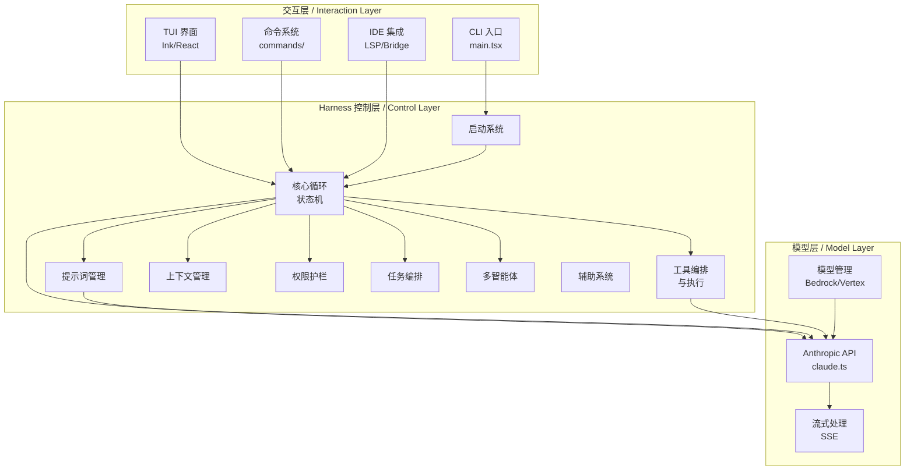
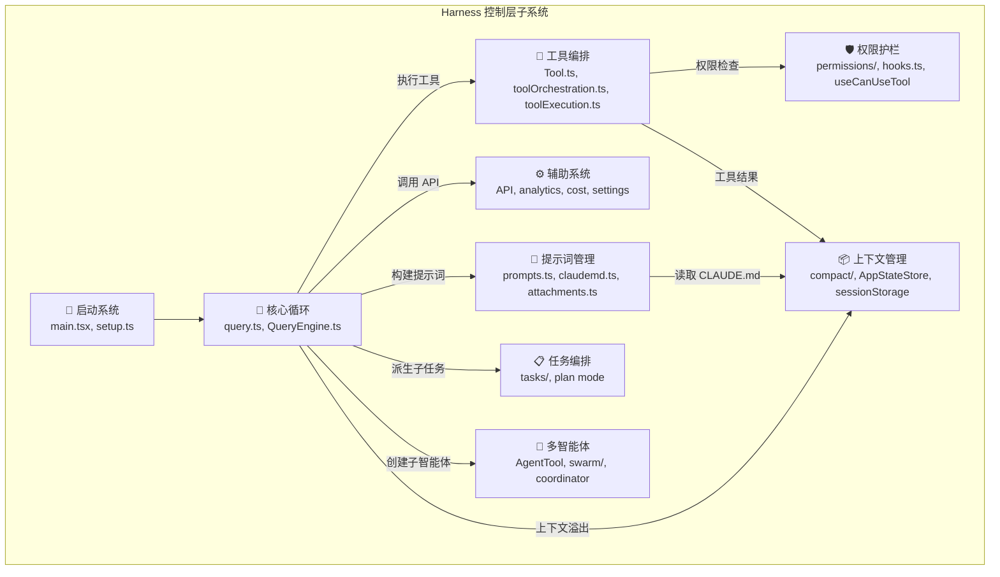
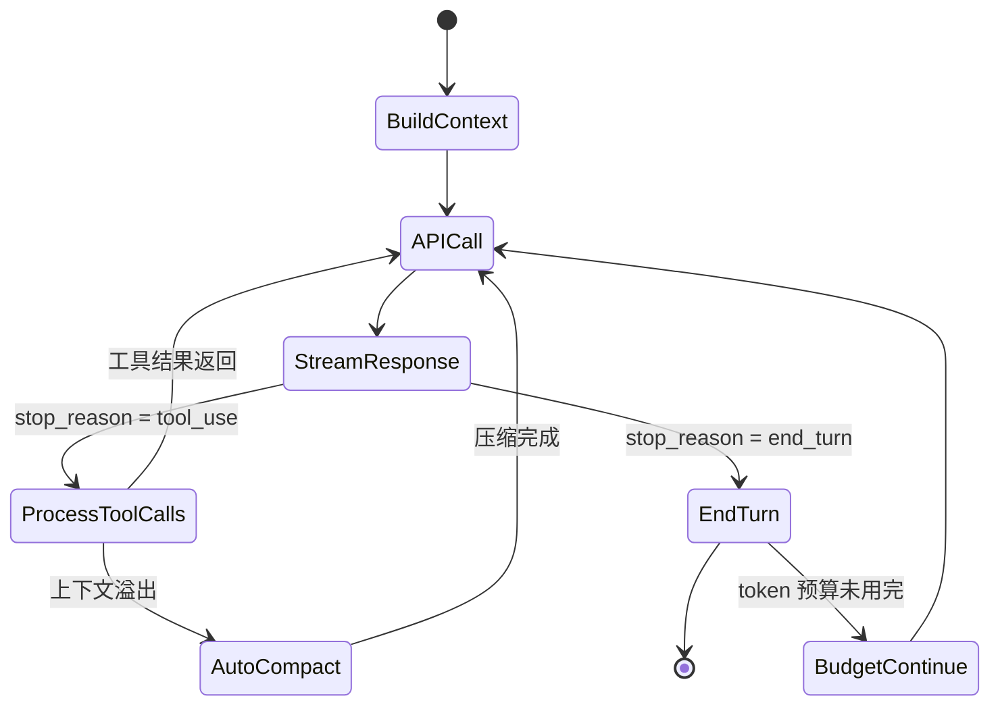
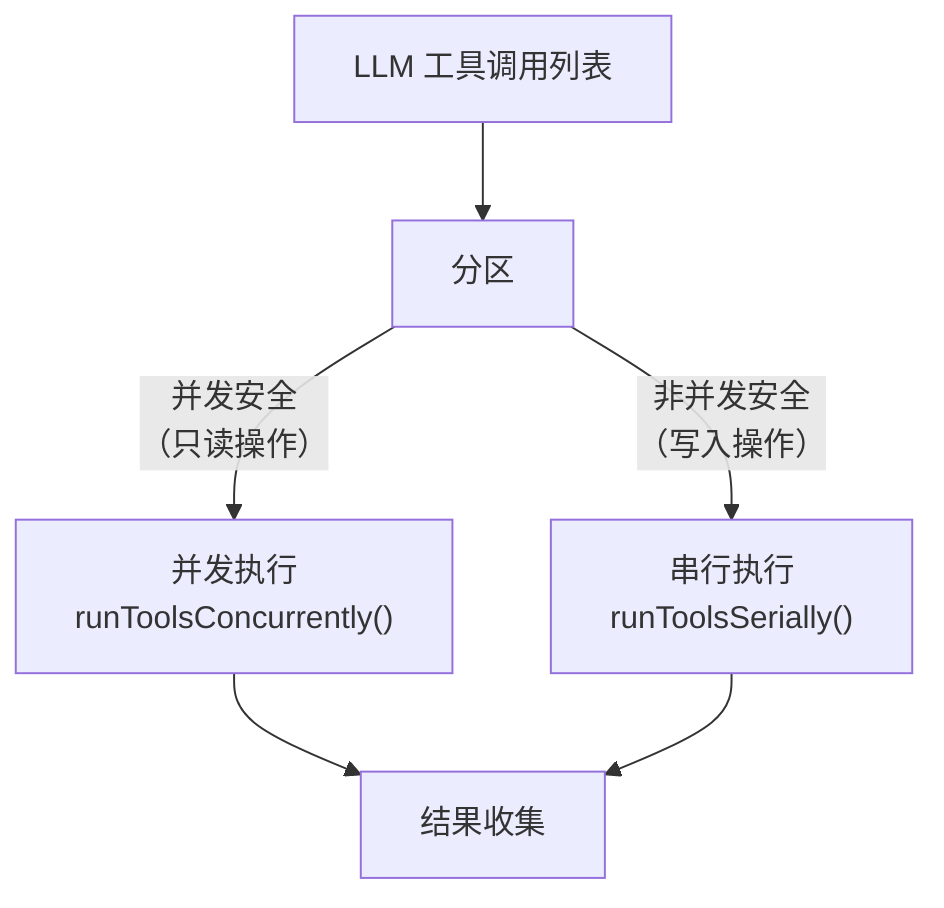
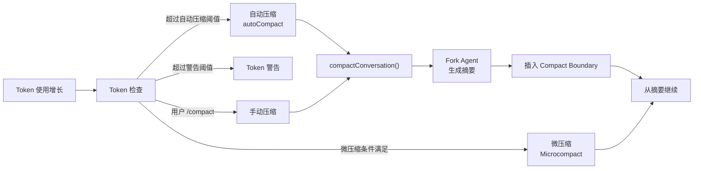
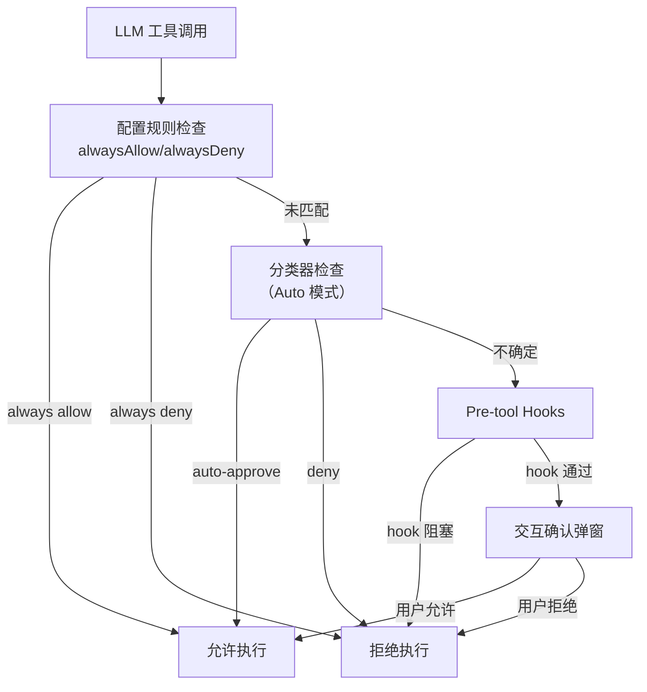
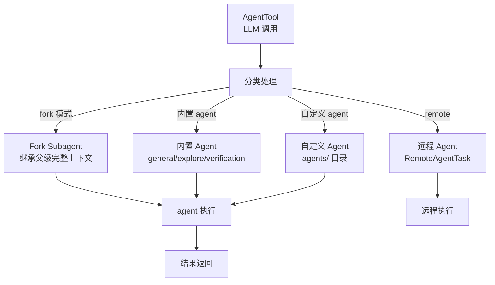
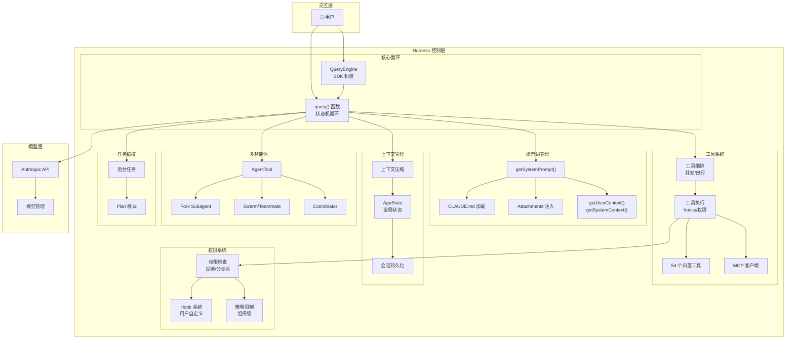
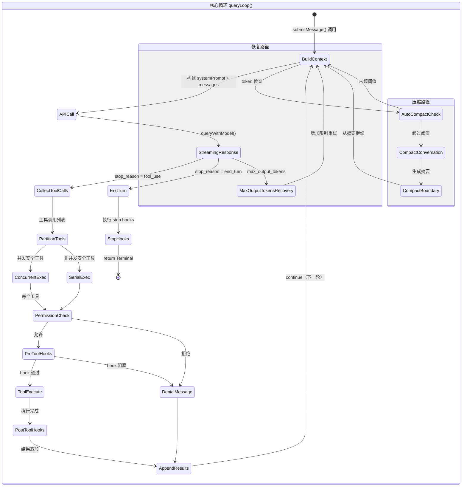

# Claude Code 技术架构分析：AI 编程智能体的分层架构拆解

> 分析日期：2026-04-12
> 项目语言：TypeScript (Bun runtime)
> 软件类型：AI 智能体应用（CLI 工具形态）
> 源码规模：~2000 文件，~514K 行代码（src/ 目录）

---

# 第 1 章：项目概览

Claude Code 是 Anthropic 推出的 AI 编程智能体 CLI 工具，以交互式终端应用的形式运行。用户通过命令行或 IDE 集成与其交互，智能体理解用户意图后，自主调用文件读写、命令执行、代码搜索等工具完成任务。整个系统的设计核心是 **harness（安全带）** 模式——在用户输入和大语言模型 API 之间构建一个精密的控制层，负责上下文管理、工具编排、权限控制和多轮对话循环。

技术栈方面，项目基于 **TypeScript** 编写，运行在 **Bun** runtime 上（使用 `bun:bundle` 进行编译期特性开关和死代码消除），UI 层采用 **Ink**（React for CLI）框架渲染终端界面，CLI 解析使用 **Commander.js**。项目使用 `feature()` 函数进行特性开关控制，支持 Ant（内部版本）和 External（公开版本）两个构建目标。

**核心设计理念**：
1. **提示词缓存优先**：系统在多处设计中优先考虑 Anthropic API 的提示词缓存命中（如 fork subagent 共享父级 system prompt 字节）
2. **流式优先**：从 API 调用到工具执行，整个管道基于 async generator 实现流式处理
3. **权限分层**：从配置规则到分类器到交互弹窗，多层权限检查确保安全
4. **上下文压缩**：自动/微压缩/快照等多级上下文管理策略，应对 token 窗口限制



上图展示了系统的三层架构：交互层负责用户界面和输入解析，harness 控制层是系统的核心，管理着从用户输入到模型调用的完整生命周期，模型层封装了与 Anthropic API 的通信细节。

---

# 第 2 章：软件类型与分层模型

## 2.1 类型判定

根据软件类型决策树，Claude Code 命中**类型 2：AI 智能体应用**，依据如下：

| 信号类别 | 具体表现 |
|---------|---------|
| 依赖关键词 | `@anthropic-ai/sdk`, `@modelcontextprotocol/sdk` |
| 目录模式 | `tools/`, `commands/`, `agents/`, `skills/`, `memdir/` |
| 入口特征 | Agent 定义、Tool 注册、Command 解析、REPL 循环 |
| 架构模式 | 感知→思考→行动 循环 |

同时命中**类型 6：CLI 工具**（Commander.js 依赖、`cmd/commands/` 目录模式），以及**类型 10：插件式平台**（MCP 插件、skill 系统、plugin 加载机制）。

**主类型取 AI 智能体应用**，因为系统的核心复杂度在于 LLM 交互循环、上下文管理和工具编排，而非 CLI 解析或插件加载。

## 2.2 三层架构

用户在问题中已给出了三层划分，这一划分与源码高度吻合：

| 层 | 职责 | 核心模块 |
|---|------|---------|
| **交互层** | 用户输入处理、TUI 渲染、命令解析 | `main.tsx`, `screens/REPL.tsx`, `commands/`, `components/` |
| **Harness 控制层** | 查询生命周期、提示词构建、工具执行、权限检查、上下文压缩 | `query.ts`, `QueryEngine.ts`, `Tool.ts`, `services/`, `utils/` |
| **模型层** | API 通信、流式处理、模型选择、重试机制 | `services/api/claude.ts`, `utils/model/` |

---

# 第 3 章：交互层——CLI 入口与 TUI 界面

## 3.1 CLI 入口：main.tsx

`src/main.tsx:1-4683` 是整个应用的入口文件，承担三大职责：

### 3.1.1 启动序列（并行优化）

```typescript
// src/main.tsx:1-14 — 并行启动三个子任务
profileCheckpoint('main_tsx_entry');       // 性能剖析标记
startMdmRawRead();                          // macOS MDM 配置读取（spawn plutil/reg query）
startKeychainPrefetch();                    // Keychain 预读取（OAuth + API key）
```

这三个副作用在所有 import 求值之前执行，利用 import 求值期间的等待时间并行完成 I/O 操作。这是 Bun 的特性——顶层副作用在模块 import 阶段就开始执行。

### 3.1.2 Commander.js 命令解析

`src/main.tsx` 中定义了完整的 CLI 命令树，使用 `@commander-js/extra-typings`：

- 主命令 `claude` 支持的 flag 包括 `--print`（headless 模式）、`--resume`、`--model`、`--allowedTools`、`--max-turns` 等
- 子命令包括 `mcp`, `config`, `memory`, `vim`, `voice` 等 103 个命令目录
- 通过 `feature('KAIROS')` 等特性开关条件导入模块

### 3.1.3 模式分支

入口文件根据运行模式分叉：

| 模式 | 入口 | 用途 |
|------|------|------|
| **交互模式** | `launchRepl()` → `REPL.tsx` | 正常终端交互 |
| **Headless 模式** | `-p/--print` flag → `cli/print.ts` | SDK/脚本调用 |
| **SDK 模式** | `entrypoints/sdk/` | 程序化 API 调用 |
| **Assistant 模式** | `feature('KAIROS')` → `assistant/index.js` | Ant 内部智能助手 |

### 五问清单

| # | 问题 | 回答 |
|---|------|------|
| 1 | 解决什么问题？ | 作为应用入口，协调启动序列、命令解析和模式分叉 |
| 2 | 核心数据结构？ | `CommanderCommand`（CLI 命令树）、全局状态初始化参数 |
| 3 | 控制流？ | 启动副作用 → import 求值 → 命令解析 → 模式分叉 → REPL/headless |
| 4 | 依赖了哪些其他子系统？ | 启动系统（setup）、状态管理（bootstrap/state）、权限（permissionSetup）、MCP 客户端 |
| 5 | 精巧设计？ | 并行启动序列（MDM/Keychain/import 三路并行）、特性开关条件导入实现死代码消除 |

## 3.2 TUI 界面：REPL.tsx

`src/screens/REPL.tsx:1-5005` 是最大的交互组件，基于 Ink（React for CLI）构建。

### 核心功能

1. **消息列表渲染**：虚拟化滚动消息列表，支持搜索、选择、导出
2. **输入处理**：`PromptInput` 组件处理用户输入，支持图片粘贴、@提及、斜杠命令
3. **工具权限弹窗**：`PermissionRequest` 组件在工具执行前请求用户确认
4. **后台任务管理**：显示后台 agent 任务状态和进度
5. **远程会话**：`useRemoteSession`, `useDirectConnect`, `useSSHSession` hooks
6. **Speculation（推测执行）**：在用户输入之前预先执行可能的操作

### 五问清单

| # | 问题 | 回答 |
|---|------|------|
| 1 | 解决什么问题？ | 提供终端中的交互式聊天界面 |
| 2 | 核心数据结构？ | `AppState`（全局状态）、`Message[]`（消息列表）、`ToolUseConfirm`（权限请求队列） |
| 3 | 控制流？ | 用户输入 → `processUserInput()` → `query()` → 流式渲染 → 工具弹窗 → 继续循环 |
| 4 | 依赖了哪些其他子系统？ | 核心循环（query）、权限系统（useCanUseTool）、上下文管理、工具编排、消息渲染 |
| 5 | 精巧设计？ | 5000 行单组件，集成了推测执行、远程会话、worktree 切换等复杂交互 |

## 3.3 命令系统

`src/commands.ts:1-754` 定义了命令注册和路由机制，`src/commands/` 下有 103 个命令目录。

每个命令目录包含一个命令实现，注册为 slash command（如 `/help`, `/compact`, `/model`）。命令通过 `getCommands()` 聚合，在 REPL 和 headless 模式中均可用。

---

# 第 4 章：Harness 控制层——子系统架构

Harness 控制层是 Claude Code 的核心，包含 9 个子系统。以下是各子系统的详细分析。



---

# 第 5 章：启动系统

> **一句话定位**：从进程入口到 REPL 就绪的全流程编排。

## 5.1 启动流程

```
main.tsx 入口
  ├── profileCheckpoint('main_tsx_entry')         // 性能标记
  ├── startMdmRawRead()                            // MDM 配置（并行）
  ├── startKeychainPrefetch()                      // Keychain 预读（并行）
  ├── import 求值（~135ms）                          // 加载所有模块
  ├── runMigrations()                              // 数据迁移
  ├── init() → initializeTelemetryAfterTrust()     // 遥测初始化
  ├── setup()                                      // 会话初始化
  │   ├── Node.js 版本检查（≥18）
  │   ├── switchSession()                          // 设置 session ID
  │   ├── startUdsMessaging()                      // UDS 消息服务器
  │   ├── setCwd() / setProjectRoot()              // 设置工作目录
  │   ├── initializeFileChangedWatcher()           // 文件变更监听
  │   ├── captureHooksConfigSnapshot()             // Hook 配置快照
  │   ├── initSessionMemory()                      // 会话记忆初始化
  │   └── worktree 设置（可选）
  ├── CLI 命令解析（Commander.js）
  ├── 模式分叉
  │   ├── 交互模式 → launchRepl()
  │   └── headless → runHeadless()
  └── startDeferredPrefetches()（首次渲染后）
      ├── initUser()                               // 用户信息预取
      ├── getUserContext()                          // 上下文预取
      ├── prefetchAwsCredentialsIfSafe()            // AWS 凭证预取
      ├── countFilesRoundedRg()                     // 文件计数
      ├── refreshModelCapabilities()                // 模型能力刷新
      └── skillChangeDetector.initialize()          // Skill 变更检测
```

## 5.2 数据迁移系统

`src/main.tsx` 中的 `runMigrations()` 管理同步迁移集，当前版本为 `CURRENT_MIGRATION_VERSION = 11`。迁移内容包括模型名称升级（Sonnet→Opus）、权限模式迁移、自动更新设置迁移等。每次迁移都是幂等的，通过全局配置中的 `migrationVersion` 字段追踪。

## 5.3 setup() 函数

`src/setup.ts:1-477` 负责会话级别的初始化：

1. **环境检测**：Node.js 版本、Git 根目录、项目根目录
2. **消息服务**：启动 UDS（Unix Domain Socket）消息服务器（macOS/Linux）
3. **Hook 初始化**：捕获 hooks 配置快照，启动文件变更监听
4. **会话记忆**：初始化 session memory 系统
5. **Worktree**：可选的 git worktree 创建（通过 tmux 会话）

## 五问清单

| # | 问题 | 回答 |
|---|------|------|
| 1 | 解决什么问题？ | 将进程从冷启动带到 REPL 可交互状态 |
| 2 | 核心数据结构？ | 全局配置（`GlobalConfig`）、session state（`bootstrap/state.ts`）、迁移版本号 |
| 3 | 控制流？ | 并行 I/O → import → 迁移 → init → setup → CLI 解析 → REPL/headless → deferred prefetches |
| 4 | 依赖了哪些其他子系统？ | 全局状态、权限初始化、MCP 客户端、遥测、Hook 系统 |
| 5 | 精巧设计？ | 三路并行启动（MDM + Keychain + import 求值重叠）；deferred prefetches 延迟到首次渲染后，避免阻塞 event loop |

---

# 第 6 章：核心循环系统（状态机）

> **一句话定位**：驱动"用户输入 → API 调用 → 工具执行 → 继续或停止"的无限循环。

这是整个 harness 控制层最核心的子系统，实现为 async generator。

## 6.1 query() 主循环

`src/query.ts:219` 定义了 `query()` 函数：

```typescript
export async function* query(
  params: QueryParams,
): AsyncGenerator<StreamEvent | RequestStartEvent | Message | ..., Terminal>
```

它内部调用 `queryLoop()`，后者是一个 `while(true)` 无限循环：

```typescript
async function* queryLoop(params, consumedCommandUuids) {
  let state: State = { messages, toolUseContext, ... };
  while (true) {
    // 1. 析构状态
    // 2. 构建消息（compact boundary 之后的部分）
    // 3. 发送 API 请求
    // 4. 处理流式响应
    // 5. 执行工具调用
    // 6. 检查停止条件
    // 7. continue（更新 state 后进入下一轮迭代）
  }
}
```

### 状态机转换



### State 结构

```typescript
// src/query.ts:205-217
type State = {
  messages: Message[]                        // 对话消息列表
  toolUseContext: ToolUseContext              // 工具执行上下文
  autoCompactTracking: AutoCompactTrackingState | undefined
  maxOutputTokensRecoveryCount: number       // max_output_tokens 恢复计数
  hasAttemptedReactiveCompact: boolean       // 是否已尝试响应式压缩
  maxOutputTokensOverride: number | undefined
  pendingToolUseSummary: Promise<...> | undefined
  stopHookActive: boolean | undefined
  turnCount: number                          // 当前轮次
  transition: Continue | undefined           // 上一次 continue 的原因
}
```

## 6.2 QueryEngine（SDK 封装）

`src/QueryEngine.ts:184` 定义了 `QueryEngine` 类，封装 `query()` 为面向 SDK 消费者的接口：

```typescript
export class QueryEngine {
  private config: QueryEngineConfig
  private mutableMessages: Message[]
  private abortController: AbortController
  private permissionDenials: SDKPermissionDenial[]

  async *submitMessage(prompt, options?): AsyncGenerator<SDKMessage>
}
```

**关键设计**：`QueryEngine` 在 `submitMessage()` 中构建 `ProcessUserInputContext`，调用 `processUserInput()` 处理用户输入，然后将结果传递给 `query()` 生成器。每个 `SDKMessage` 都是标准化后的消息类型，供 SDK 消费者（如 Claude Desktop）处理。

### query() vs QueryEngine 的关系

| 维度 | `query()` | `QueryEngine` |
|------|-----------|---------------|
| 调用者 | REPL / QueryEngine | SDK / headless |
| 状态管理 | 通过 `State` type 显式传递 | 内部维护 `mutableMessages` |
| 权限处理 | 依赖调用者提供的 `canUseTool` | 包装 `canUseTool` 追踪拒绝记录 |
| 消息持久化 | 由调用者负责 | 自动调用 `recordTranscript()` |

## 6.3 Continue（循环继续）场景

`queryLoop` 在以下场景通过 `continue` 进入下一轮迭代：

1. **max_output_tokens 恢复**：API 返回 `max_output_tokens` 错误时，增加输出 token 限制重试
2. **响应式压缩（Reactive Compact）**：上下文超过阈值时自动压缩
3. **微压缩（Microcompact）**：增量式压缩最新消息
4. **预算续行（Budget Continue）**：token 预算未用完时继续

## 五问清单

| # | 问题 | 回答 |
|---|------|------|
| 1 | 解决什么问题？ | 驱动 LLM 交互的核心循环，处理"输入→API→工具→继续"的完整生命周期 |
| 2 | 核心数据结构？ | `State`（跨迭代状态）、`QueryParams`（不可变参数）、`Message[]`（消息列表） |
| 3 | 控制流？ | while(true) 循环 → 构建上下文 → API 调用 → 流式处理 → 工具执行 → continue/return |
| 4 | 依赖了哪些其他子系统？ | 提示词管理、工具编排、上下文管理（压缩）、权限系统、Hook 系统 |
| 5 | 精巧设计？ | 使用 async generator 实现流式输出；State 模式通过解构赋值在循环顶部统一读取；continue 场景通过单一 state 赋值原子更新 |

---

# 第 7 章：提示词管理系统

> **一句话定位**：动态构建发送给 LLM 的 system prompt，包括工具描述、上下文注入和 skill 懒加载。

## 7.1 系统提示词构建

`src/constants/prompts.ts:1-914` 中的 `getSystemPrompt()` 是提示词构建的核心入口：

```
getSystemPrompt(tools, model, additionalWorkingDirectories, mcpClients)
  ├── enhanceSystemPromptWithEnvDetails()     // 环境信息
  ├── 工具描述列表（从 tools[] 动态生成）
  ├── systemPromptSection()                   // 分段式提示词
  │   ├── 身份与行为规范
  │   ├── 工具使用指南
  │   ├── 代码编辑策略
  │   ├── Git 工作流
  │   ├── 输出格式说明
  │   └── 安全与权限
  ├── MCP 服务器指令
  ├── skill 工具命令
  ├── 输出样式配置
  └── 加密风险指令（CYBER_RISK_INSTRUCTION）
```

### 提示词分段系统

`src/constants/systemPromptSections.ts` 实现了模块化的提示词组装：

- `systemPromptSection()` — 缓存友好的静态段落
- `DANGEROUS_uncachedSystemPromptSection()` — 每次调用都重新生成的动态段落
- `resolveSystemPromptSections()` — 按模型和配置解析最终段落列表

## 7.2 用户上下文和系统上下文

`src/context.ts:1-189`：

- `getUserContext()` — 返回键值对形式的用户上下文（OS、Shell、日期、git 信息等）
- `getSystemContext()` — 返回系统级上下文（git status 快照、branch 信息、近期 log）

`src/utils/queryContext.ts` 的 `fetchSystemPromptParts()` 并行获取三部分：

```typescript
const [defaultSystemPrompt, userContext, systemContext] = await Promise.all([
  getSystemPrompt(tools, model, dirs, mcpClients),  // 系统提示词
  getUserContext(),                                    // 用户上下文
  getSystemContext(),                                  // 系统上下文
])
```

## 7.3 CLAUDE.md 文件加载

`src/utils/claudemd.ts` 实现了分层的 CLAUDE.md 文件发现和加载：

```
优先级（从低到高）：
1. Managed memory (/etc/claude-code/CLAUDE.md)     — 管理员级全局指令
2. User memory (~/.claude/CLAUDE.md)                — 用户私有全局指令
3. Project memory (CLAUDE.md, .claude/CLAUDE.md)    — 项目级指令
4. .claude/rules/*.md                               — 项目规则文件
5. Local memory (CLAUDE.local.md)                   — 本地私有指令

发现策略：从 cwd 向上遍历到根目录，越靠近 cwd 的优先级越高
```

支持 `@include` 指令：`@path`, `@./relative/path`, `@~/home/path`，可以引用外部文件。

## 7.4 动态上下文注入

`src/utils/attachments.ts` 负责在每轮对话中动态注入上下文：

| 注入类型 | 触发条件 | 内容 |
|---------|---------|------|
| CLAUDE.md 文件 | 文件变更检测触发或首轮加载 | 项目指令内容 |
| Skill 文件 | 用户提到 skill 相关关键词 | SKILL.md 内容 |
| MCP 指令 | MCP 服务器变更 | 服务器描述和工具说明 |
| Agent 列表 | 可用 agent 变更 | 内置和自定义 agent 定义 |
| 延迟工具（Deferred tools） | 工具池变更 | 未加载的工具描述 |
| 记忆文件 | 会话记忆系统 | Session memory 内容 |

## 五问清单

| # | 问题 | 回答 |
|---|------|------|
| 1 | 解决什么问题？ | 根据当前工具集、项目状态和用户配置动态构建发送给 LLM 的完整上下文 |
| 2 | 核心数据结构？ | `SystemPrompt`（string 数组）、`userContext`（键值对）、`systemContext`（键值对）、`MemoryFileInfo[]` |
| 3 | 控制流？ | getSystemPrompt → systemPromptSection → 上下文获取 → CLAUDE.md 加载 → attachments 注入 → API 缓存断点标记 |
| 4 | 依赖了哪些其他子系统？ | 工具系统（工具描述）、MCP 客户端（服务器信息）、上下文管理（CLAUDE.md）、设置系统 |
| 5 | 精巧设计？ | 分段式提示词组装（systemPromptSection）区分缓存/非缓存段落；CLAUDE.md 的 @include 实现文件级指令复用；attachments 的条件注入避免不必要的 token 消耗 |

---

# 第 8 章：工具编排与执行系统

> **一句话定位**：将 LLM 的工具调用请求转化为实际操作，管理并发和权限。

## 8.1 Tool 接口体系

`src/Tool.ts:1-792` 定义了工具的核心类型：

```typescript
// 工具定义接口
export type Tool<I extends Record<string, unknown> = Record<string, unknown>, T = unknown> = {
  name: string
  aliases?: string[]
  description: string | ((...) => Promise<string>)
  inputSchema: ToolInputJSONSchema
  isEnabled(opts): boolean
  isAllowed(opts): { allowed: boolean }
  isConcurrencySafe(opts): boolean   // 是否可并发执行
  maxResultSizeChars?: number        // 结果大小限制
  async *execute(input, context): AsyncGenerator<ToolResult<T>>
}

// 工厂函数
export function buildTool<D extends AnyToolDef>(def: D): BuiltTool<D>
```

### ToolUseContext（工具执行上下文）

`src/Tool.ts:158` 定义了 `ToolUseContext`，这是贯穿整个工具执行生命周期的上下文对象，包含：

| 字段 | 用途 |
|------|------|
| `options.tools` | 可用工具列表 |
| `options.commands` | 可用 slash 命令 |
| `options.mcpClients` | MCP 客户端连接 |
| `abortController` | 取消控制器 |
| `readFileState` | 文件读取缓存 |
| `messages` | 当前消息列表 |
| `getAppState/setAppState` | 状态访问 |
| `requestPrompt` | 交互式提示请求 |

## 8.2 工具注册

`src/tools.ts:1-389` 的 `getTools()` / `assembleToolPool()` 聚合所有内置工具：

| 工具 | 路径 | 功能 |
|------|------|------|
| `BashTool` | `tools/BashTool/` | Shell 命令执行 |
| `FileReadTool` | `tools/FileReadTool/` | 文件读取 |
| `FileWriteTool` | `tools/FileWriteTool/` | 文件写入 |
| `FileEditTool` | `tools/FileEditTool/` | 精确文件编辑 |
| `GlobTool` | `tools/GlobTool/` | 文件搜索 |
| `GrepTool` | `tools/GrepTool/` | 内容搜索 |
| `AgentTool` | `tools/AgentTool/` | 子智能体调用 |
| `MCPTool` | `tools/MCPTool/` | MCP 工具调用 |
| `WebFetchTool` | `tools/WebFetchTool/` | 网页获取 |
| `WebSearchTool` | `tools/WebSearchTool/` | 网页搜索 |
| `TodoWriteTool` | `tools/TodoWriteTool/` | 任务管理 |
| `SkillTool` | `tools/SkillTool/` | Skill 执行 |

共计 54 个工具注册（19 个始终启用 + 35 个条件启用），部分通过 `feature()` 门控（如 `REPLTool`, `SleepTool`, `CronTool`）。

## 8.3 工具编排

`src/services/tools/toolOrchestration.ts:1-188` 的 `runTools()` 实现了工具编排策略：



关键逻辑：通过 `isConcurrencySafe()` 将工具调用分为只读（可并发）和写入（串行）两组，默认并发上限为 10。

## 8.4 单工具执行

`src/services/tools/toolExecution.ts:1-1745` 的 `runToolUse()` 处理单个工具的完整执行流程：

```
runToolUse(tool, input, context)
  ├── 权限检查（canUseTool）
  │   ├── 允许 → 继续
  │   └── 拒绝 → 返回错误消息
  ├── Pre-tool hooks
  │   ├── 阻塞 → 返回 hook 消息
  │   └── 通过 → 继续
  ├── tool.execute(input, context)
  │   └── yield 进度消息 / 返回结果
  ├── Post-tool hooks
  └── 返回 ToolResult
```

## 8.5 流式工具执行器

`src/services/tools/StreamingToolExecutor.ts` 在流式模式下，工具在 API 仍在流式输出时就开始并发执行：

- `addTool()` — 添加工具到执行队列
- 工具状态机：`queued → executing → completed → yielded`
- 并发安全工具立即开始执行，非并发安全工具排队等待
- `discard()` — 在 streaming fallback 时丢弃所有待执行工具

## 8.6 MCP 集成

`src/services/mcp/` 目录（~12310 行）实现了完整的 MCP（Model Context Protocol）集成：

| 组件 | 功能 |
|------|------|
| `client.ts` | MCP 客户端，管理服务器连接和工具发现 |
| `config.ts` | MCP 配置解析（从 settings 和 .mcp.json） |
| `auth.ts` | OAuth 认证流程 |
| `officialRegistry.ts` | 官方 MCP 服务器注册表 |
| `channelPermissions.ts` | MCP 通道权限管理 |

支持的传输协议：SSE、Stdio、Streamable HTTP、WebSocket。

## 五问清单

| # | 问题 | 回答 |
|---|------|------|
| 1 | 解决什么问题？ | 将 LLM 的结构化工具调用请求转化为实际 I/O 操作，管理并发和权限 |
| 2 | 核心数据结构？ | `Tool` 接口、`ToolUseContext`、`ToolResult<T>`、`StreamingToolExecutor.TrackedTool` |
| 3 | 控制流？ | 工具调用列表 → 分区 → 并发/串行执行 → 权限检查 → hooks → execute → 结果收集 |
| 4 | 依赖了哪些其他子系统？ | 权限系统、Hook 系统、上下文管理、MCP 客户端 |
| 5 | 精巧设计？ | 只读/写入分区实现安全并发；StreamingToolExecutor 在流式接收时就开始执行工具，减少延迟 |

---

# 第 9 章：上下文管理系统

> **一句话定位**：管理对话历史和 token 预算，在上下文溢出时进行压缩。

## 9.1 状态管理

### 全局状态：bootstrap/state.ts

`src/bootstrap/state.ts` 是全局单例状态模块，包含约 100 个状态管理函数：

| 状态类别 | 示例函数 |
|---------|---------|
| 会话 | `getSessionId()`, `switchSession()`, `getSessionStartDate()` |
| 模型 | `getMainLoopModel()`, `setMainLoopModelOverride()` |
| 目录 | `getCwd()`, `getOriginalCwd()`, `getProjectRoot()` |
| 遥测 | `getMeter()`, `getSessionCounter()`, `getStatsStore()` |
| Hook | `getRegisteredHooks()`, `setRegisteredHooks()` |
| Token | `getCurrentTurnTokenBudget()`, `getTurnOutputTokens()` |

### UI 状态：AppState

`src/state/AppStateStore.ts:1-569` 定义了 `AppState` 类型，通过 React Context + `createStore()` 管理：

```typescript
export type AppState = {
  messages: Message[]                    // 当前消息列表
  toolPermissionContext: ToolPermissionContext  // 权限上下文
  isFocused: boolean                     // 终端是否聚焦
  fastMode: boolean                      // 快速模式
  fileHistory: FileHistoryState          // 文件编辑历史
  attribution: AttributionState          // 提交归属状态
  // ... 更多字段
}
```

`src/state/store.ts` 实现了简单的 `createStore<T>()`：基于 `setState(updater)` + `subscribe(listener)` 模式，与 React 的 `useSyncExternalStore` 配合使用。

## 9.2 会话持久化

`src/utils/sessionStorage.ts` 负责：

- **Transcript 记录**：`recordTranscript(messages)` — 将消息写入 JSONL 格式的 transcript 文件
- **会话搜索**：`searchSessionsByCustomTitle()` — 按标题搜索历史会话
- **会话恢复**：`loadTranscriptFromFile()` — 从 transcript 文件恢复会话
- **会话标题缓存**：`cacheSessionTitle()`

`src/history.ts:1-464` 管理命令历史（上下/下箭头浏览）。

## 9.3 上下文压缩（Compaction）

上下文压缩是 Claude Code 应对 token 窗口限制的核心机制，有多个层级：



### 自动压缩

`src/services/compact/autoCompact.ts:1-351`：

- 阈值 = 上下文窗口大小 - 13,000（`AUTOCOMPACT_BUFFER_TOKENS`）
- 当 token 使用超过阈值时触发
- 连续失败 3 次后停止重试（电路断路器模式）
- 支持警告和错误两个额外阈值级别

### 压缩执行

`src/services/compact/compact.ts:1-1705` 的 `compactConversation()`：

1. 收集需要压缩的消息
2. 通过 `runForkedAgent()` 启动一个子智能体生成摘要
3. 创建 `compact_boundary` 消息，标记压缩边界
4. 后续 API 调用只发送 boundary 之后的消息 + 摘要

### 微压缩（Microcompact）

在每轮迭代中增量压缩最新的工具结果，减少 token 占用。

## 五问清单

| # | 问题 | 回答 |
|---|------|------|
| 1 | 解决什么问题？ | 管理 token 预算，在上下文溢出时压缩对话历史以继续工作 |
| 2 | 核心数据结构？ | `AppState`（UI 状态）、`Message[]`（消息列表）、`CompactBoundary`（压缩边界标记） |
| 3 | 控制流？ | token 计数 → 阈值检查 → 触发压缩 → fork agent 摘要 → boundary 标记 → 从摘要继续 |
| 4 | 依赖了哪些其他子系统？ | 核心循环（触发点）、多智能体（fork agent）、提示词管理（摘要 prompt）、会话持久化 |
| 5 | 精巧设计？ | 三级压缩策略（自动/微压缩/快照）；电路断路器防止无限重试；通过 fork agent 共享缓存前缀降低压缩成本 |

---

# 第 10 章：权限护栏系统

> **一句话定位**：多层权限检查确保 LLM 不会执行未授权的危险操作。

## 10.1 权限模式

`src/utils/permissions/PermissionMode.ts` 定义了权限模式：

| 模式 | 行为 |
|------|------|
| `default` | 工具执行前询问用户 |
| `auto` | 自动分类器决定允许/拒绝 |
| `bypass` | 跳过所有权限检查 |
| `plan` | Plan 模式下的特殊权限 |

## 10.2 权限检查流程



## 10.3 Hook 系统

`src/utils/hooks.ts:1-5022` 是最大的工具文件之一，实现了用户自定义 Hook：

| Hook 类型 | 触发时机 |
|----------|---------|
| `PreToolUse` | 工具执行前 |
| `PostToolUse` | 工具执行后 |
| `Stop` | LLM 停止生成时 |
| `SessionStart` | 会话开始时 |
| `SessionEnd` | 会话结束时 |
| `UserPromptSubmit` | 用户提交提示词时 |
| `Notification` | 通知事件 |
| `PreCompact` / `PostCompact` | 压缩前后 |

Hook 可以返回：
- **阻塞结果**：阻止工具执行，返回自定义错误消息
- **通过结果**：允许继续
- **修改结果**：修改工具输入

## 10.4 危险模式检测

`src/utils/permissions/dangerousPatterns.ts` 定义了 Bash 命令中的危险模式（如 `rm -rf /`, `curl | sh` 等），在 Auto 模式下额外检查这些模式。

## 10.5 策略限制

`src/services/policyLimits/index.ts` 从 API 获取组织级别的策略限制，可以禁用特定功能。采用 fail-open 策略——API 调用失败时不施加限制。

## 五问清单

| # | 问题 | 回答 |
|---|------|------|
| 1 | 解决什么问题？ | 确保 LLM 不会执行用户未授权的危险操作 |
| 2 | 核心数据结构？ | `ToolPermissionContext`（权限上下文）、`PermissionMode`、`PermissionRule[]`、`HookResult` |
| 3 | 控制流？ | 配置规则 → 分类器 → pre-tool hooks → 交互确认 → 执行/拒绝 |
| 4 | 依赖了哪些其他子系统？ | 设置系统（权限规则配置）、Hook 系统、分析系统（分类器）、TUI（弹窗） |
| 5 | 精巧设计？ | 多层防御（规则→分类器→hooks→交互）；Auto 模式的分类器实现免确认自动化；危险模式白名单额外检查 |

---

# 第 11 章：任务编排系统

> **一句话定位**：管理后台任务的生命周期，支持 Plan 模式。

## 11.1 任务类型

`src/tasks/` 目录下的任务类型：

| 任务类型 | 路径 | 功能 |
|---------|------|------|
| `LocalAgentTask` | `tasks/LocalAgentTask/` | 本地后台 agent 任务 |
| `InProcessTeammateTask` | `tasks/InProcessTeammateTask/` | 进程内 teammate 任务 |
| `RemoteAgentTask` | `tasks/RemoteAgentTask/` | 远程 agent 任务 |
| `LocalShellTask` | `tasks/LocalShellTask/` | 本地 Shell 任务 |
| `LocalWorkflowTask` | `tasks/LocalWorkflowTask/` | 工作流任务 |
| `DreamTask` | `tasks/DreamTask/` | Dream 任务（推断） |
| `MonitorMcpTask` | `tasks/MonitorMcpTask/` | MCP 监控任务 |

## 11.2 Plan 模式

`EnterPlanModeTool` / `ExitPlanModeV2Tool` 实现 Plan 模式：

- 进入 Plan 模式后，LLM 只做规划不执行
- 计划存储在 `src/utils/plans.ts` 管理的计划文件中
- 退出 Plan 模式后按计划执行

## 11.3 任务工具

| 工具 | 功能 |
|------|------|
| `TaskCreateTool` | 创建后台任务 |
| `TaskGetTool` | 获取任务状态 |
| `TaskListTool` | 列出所有任务 |
| `TaskOutputTool` | 获取任务输出 |
| `TaskStopTool` | 停止任务 |
| `TaskUpdateTool` | 更新任务状态 |

## 五问清单

| # | 问题 | 回答 |
|---|------|------|
| 1 | 解决什么问题？ | 管理长时间运行的后台任务和计划执行 |
| 2 | 核心数据结构？ | `TaskState`（任务状态）、`Task`（任务定义）、`Plan`（计划结构） |
| 3 | 控制流？ | 创建任务 → 注册到 LocalAgentTask → 后台执行 → 进度更新 → 完成/失败通知 |
| 4 | 依赖了哪些其他子系统？ | 多智能体（agent 执行）、核心循环（任务调度）、权限系统（任务权限） |
| 5 | 精巧设计？ | 本地/远程/进程内多种任务类型适配不同场景；Plan 模式实现"先想后做"的工作流 |

---

# 第 12 章：多智能体系统

> **一句话定位**：支持子智能体派生、teammate 协作和 coordinator 编排的多智能体架构。

## 12.1 Agent 工具

`src/tools/AgentTool/AgentTool.tsx:1-1397` 是多智能体系统的入口：



### 内置 Agent 类型

| Agent | 功能 |
|-------|------|
| `general-purpose` | 通用任务处理 |
| `explore` | 代码库探索 |
| `verification` | 验证执行结果 |

### Fork Subagent

`src/tools/AgentTool/forkSubagent.ts` 实现了一种轻量级子智能体：

- 继承父级的**完整对话历史**和 **system prompt**
- 省略 `subagent_type` 时自动触发（当 `feature('FORK_SUBAGENT')` 启用）
- 通过 `CacheSafeParams` 共享父级的 API 缓存前缀，避免重复 token 计费
- 防止递归 fork（检测 `FORK_BOILERPLATE_TAG`）

### 缓存安全参数

`src/utils/forkedAgent.ts:1-689` 的 `CacheSafeParams` 确保子智能体与父级共享 API 缓存：

```typescript
export type CacheSafeParams = {
  systemPrompt: SystemPrompt           // 必须与父级一致
  userContext: { [k: string]: string }  // 影响缓存
  systemContext: { [k: string]: string }
  toolUseContext: ToolUseContext         // 包含工具定义
  forkContextMessages: Message[]        // 父级上下文消息
}
```

## 12.2 Swarm/Teammate 系统

`src/utils/swarm/` 实现了多智能体协作：

| 组件 | 功能 |
|------|------|
| `inProcessRunner.ts` | 进程内 teammate 运行器 |
| `spawnInProcess.ts` | 进程内 teammate 创建 |
| `leaderPermissionBridge.ts` | Leader-Worker 权限桥接 |
| `permissionSync.ts` | 权限状态同步 |
| `teamHelpers.ts` | Team 管理辅助函数 |
| `teammateInit.ts` | Teammate 初始化 |
| `teammateModel.ts` | Teammate 模型选择 |
| `reconnection.ts` | 断线重连 |

## 12.3 Coordinator 模式

`src/coordinator/coordinatorMode.ts` 通过环境变量 `CLAUDE_CODE_COORDINATOR_MODE` 启用：

- Coordinator 作为编排者，管理多个 Worker Agent
- Worker Agent 使用受限的工具集
- 通过 `SendMessageTool` 进行 Agent 间通信
- 权限通过 `handleCoordinatorPermission` 处理

## 五问清单

| # | 问题 | 回答 |
|---|------|------|
| 1 | 解决什么问题？ | 支持任务分解为多个并行/串行子智能体，提高复杂任务处理效率 |
| 2 | 核心数据结构？ | `AgentDefinition`、`CacheSafeParams`、`FORK_AGENT`、`WorkerAgent` 配置 |
| 3 | 控制流？ | AgentTool 调用 → 类型分类 → fork/builtin/remote → 执行 → 结果返回/通知 |
| 4 | 依赖了哪些其他子系统？ | 核心循环（query 复用）、提示词管理（agent prompt）、权限系统（bubble 权限）、任务编排 |
| 5 | 精巧设计？ | Fork subagent 通过 `CacheSafeParams` 实现零成本上下文共享；Coordinator 模式实现了中心化的多智能体编排 |

---

# 第 13 章：辅助系统

## 13.1 API 层

`src/services/api/claude.ts:1-3419` 是与 Anthropic API 通信的核心模块：

| 函数 | 功能 |
|------|------|
| `queryWithModel()` | 流式 API 调用入口 |
| `queryHaiku()` | Haiku 模型专用查询 |
| `queryModelWithStreaming()` | 通用流式查询 |
| `queryModelWithoutStreaming()` | 非流式查询 |
| `buildSystemPromptBlocks()` | 构建 system prompt 块 |
| `updateUsage()` / `accumulateUsage()` | 使用量追踪 |

API 层支持多种提供商：第一方 Anthropic API、AWS Bedrock、Google Vertex。

## 13.2 分析系统

`src/services/analytics/` 集成了 GrowthBook 特性开关和遥测：

- `growthbook.ts` — GrowthBook SDK 封装，特性开关评估
- `index.ts` — 事件日志记录
- `sink.ts` — 分析事件分发

## 13.3 费用追踪

`src/cost-tracker.ts:1-323` 追踪每次 API 调用的费用和 token 使用量：

- `getTotalCost()` — 累计费用
- `getModelUsage()` — 按模型分类的使用量
- `getTotalAPIDuration()` — API 总耗时

## 13.4 设置系统

`src/utils/settings/` 实现了多来源设置管理：

| 来源 | 优先级 | 说明 |
|------|--------|------|
| `policySettings` | 最高 | 管理员策略（不可覆盖） |
| `managedSettings` | 高 | 远程管理设置 |
| `projectSettings` | 中 | 项目级 `.claude/settings.json` |
| `userSettings` | 低 | 用户级 `~/.claude/settings.json` |
| `flagSettings` | 最低 | CLI flag 指定的设置 |

## 13.5 模型管理

`src/utils/model/` 处理模型选择和配置：

- `model.ts` — `getDefaultMainLoopModel()`, `parseUserSpecifiedModel()`
- `modelStrings.ts` — 模型名称映射（如 sonnet-4 → claude-sonnet-4-20250514）
- `providers.ts` — API 提供商检测（first-party/Bedrock/Vertex）
- `modelCapabilities.ts` — 模型能力缓存

## 13.6 成本追踪与预算

系统在多个层级追踪成本和 token：

1. **请求级**：每次 API 调用的 `usage` 字段
2. **消息级**：`updateUsage()` 累积每条消息的使用量
3. **会话级**：`totalUsage` 在 `QueryEngine` 中追踪
4. **任务级**：`taskBudget` 限制单个任务的总 token 数

---

# 第 14 章：跨层关系与数据流

## 14.1 完整数据流图

```mermaid
graph TD
    subgraph "交互层"
        INPUT["用户输入"] --> PUI["processUserInput()"]
    end

    subgraph "Harness 控制层"
        PUI -->|"消息 + shouldQuery"| QL["queryLoop()"]
        QL -->|"构建 prompt"| SPP["fetchSystemPromptParts()"]
        SPP -->|"systemPrompt<br/>userContext<br/>systemContext"| API_PREP["prepare API request"]
        API_PREP -->|"streaming request"| STREAM["API 流式响应"]

        STREAM -->|"tool_use blocks"| TOOL_ORD["runTools()"]
        STREAM -->|"end_turn"| STOP["停止处理"]
        STREAM -->|"max_output_tokens"| RECOVER["恢复循环"]

        TOOL_ORD -->|"并发安全"| CONC["并发执行"]
        TOOL_ORD -->|"串行"| SER["串行执行"]

        CONC --> PERM_CHECK{"权限检查"}
        SER --> PERM_CHECK
        PERM_CHECK -->|"允许"| HOOK_PRE["Pre-tool hooks"]
        PERM_CHECK -->|"拒绝"| DENY_MSG["拒绝消息"]
        HOOK_PRE --> EXEC["tool.execute()"]
        EXEC --> HOOK_POST["Post-tool hooks"]
        HOOK_POST --> TOOL_RESULT["工具结果"]

        TOOL_RESULT -->|"追加消息"| QL
        DENY_MSG -->|"追加消息"| QL

        QL -->|"上下文溢出"| COMPACT["compactConversation()"]
        COMPACT --> FORK_AGENT["Fork Agent 生成摘要"]
        FORK_AGENT --> BOUNDARY["compact_boundary"]
        BOUNDARY --> QL
    end

    subgraph "模型层"
        STREAM <-->|"SSE/HTTP"| ANTHROPIC["Anthropic API"]
        FORK_AGENT <-->|"SSE/HTTP"| ANTHROPIC
    end

    STOP -->|"yield SDKMessage"| OUTPUT["输出给调用者"]
```



## 14.2 关键数据流描述

### 用户输入到 API 调用

1. 用户在 REPL 中输入文本 → `processUserInput()` 解析（支持斜杠命令、图片、@提及）
2. 生成 `UserMessage` + 可选的 `AttachmentMessage`（CLAUDE.md、记忆文件等）
3. `fetchSystemPromptParts()` 并行构建三部分：system prompt、user context、system context
4. `prependUserContext()` 和 `appendSystemContext()` 将上下文注入消息流
5. 调用 `queryWithModel()` 发起流式 API 请求

### 工具执行循环

1. API 返回 `tool_use` content blocks
2. `StreamingToolExecutor` 在流式接收时就开始并发执行只读工具
3. 每个工具执行前经过权限检查和 pre-tool hooks
4. 工具结果作为 `tool_result` 消息追加到消息列表
5. 所有工具结果收集完毕后，重新发送给 API（下一轮迭代）

### 上下文压缩

1. 每轮迭代后检查 token 使用量
2. 超过自动压缩阈值时，通过 `compactConversation()` 压缩
3. 压缩通过 fork agent 实现：启动一个子智能体，传入需要压缩的消息，生成摘要
4. 创建 `compact_boundary` 消息，后续 API 调用只发送 boundary 之后的消息 + 摘要

---

# 第 15 章：关键设计理念

## 15.1 提示词缓存优先（Prompt Cache First）

Claude Code 在多处设计中优先考虑 Anthropic API 的提示词缓存命中率：

1. **Fork Subagent 的 `CacheSafeParams`**：子智能体共享父级的 system prompt 字节、user context、system context 和工具定义，确保 API 请求的缓存前缀完全一致
2. **`splitSysPromptPrefix()`**：将 system prompt 分为不变前缀和可变后缀，前缀可被缓存
3. **`addCacheBreakpoints()`**：在 system prompt 和消息中精确放置缓存断点标记
4. **`shouldUseGlobalCacheScope()`**：某些场景使用全局缓存 scope 延长缓存寿命

**权衡**：缓存友好设计增加了代码复杂度（如 `CacheSafeParams` 的维护），但显著降低了 API 调用成本和延迟。

## 15.2 流式优先（Streaming First）

从 API 到 UI，整个管道基于 async generator 实现流式处理：

- `query()` 是 `async function*`，通过 `yield` 逐步输出消息
- `StreamingToolExecutor` 在 API 仍在流式输出时就开始执行工具
- REPL 通过 `useLogMessages` hook 实时渲染流式消息
- 工具进度通过 `ToolCallProgress` 回调实时报告

**权衡**：async generator 增加了错误处理复杂度（需要仔细管理 generator 的 return/throw），但提供了实时反馈体验。

## 15.3 特性开关驱动的死代码消除（Feature-Flag DCE）

Claude Code 使用 Bun 的 `feature()` 函数实现编译期特性开关：

```typescript
const assistantModule = feature('KAIROS')
  ? require('./assistant/index.js')
  : null;
```

当 `feature()` 返回 `false` 时，条件分支中的代码会被编译器完全移除。这允许在单一代码库中维护 Ant（内部）和 External（公开）两个版本。

## 15.4 分层防御（Defense in Depth）

权限系统采用四层防御：

1. **配置规则**：alwaysAllow/alwaysDeny 规则从文件加载
2. **分类器**：Auto 模式下的机器学习分类器自动判断
3. **用户 Hook**：用户自定义 shell 命令进行额外检查
4. **交互确认**：弹窗让用户最终决定

每一层都可以独立允许或拒绝，确保即使某一层失效也不会造成安全问题。

## 15.5 单文件巨组件（Mega-File Pattern）

项目中多个核心文件超过 1000 行：

| 文件 | 行数 | 职责 |
|------|------|------|
| `main.tsx` | 4683 | 入口 + 命令解析 |
| `screens/REPL.tsx` | 5005 | 主 UI 组件 |
| `utils/hooks.ts` | 5022 | Hook 系统 |
| `services/api/claude.ts` | 3419 | API 客户端 |
| `query.ts` | 1729 | 核心循环 |
| `services/compact/compact.ts` | 1705 | 上下文压缩 |
| `services/tools/toolExecution.ts` | 1745 | 工具执行 |

这是一种刻意的架构选择：将强内聚的逻辑放在同一个文件中，通过函数和类型组织代码，而不是通过文件系统。好处是减少了跨文件跳转的认知负担，坏处是单文件过长影响可读性。

## 15.6 全局状态 vs React 状态的双轨制

项目使用两种状态管理模式：

1. **全局状态**（`bootstrap/state.ts`）：模块级单例，通过 getter/setter 函数访问，不依赖 React
2. **React 状态**（`AppState`）：通过 `createStore()` + React Context 管理，驱动 UI 渲染

这种双轨设计是因为系统需要在 React 上下文之外（如 SDK 模式、headless 模式）访问状态。

---

# 第 16 章：架构总览图

## 16.1 Harness 控制层子系统关系图



## 16.2 核心循环状态机详细图



---

# 附录

## A. 源码规模统计

| 目录 | 文件数 | 代码行数 | 说明 |
|------|--------|---------|------|
| `src/utils/` | 312 | 91,112 | 工具函数（最大目录） |
| `src/components/` | 113 | 24,266 | React/Ink UI 组件 |
| `src/hooks/` | 83 | 16,476 | React hooks |
| `src/ink/` | 44 | 13,307 | Ink 框架适配 |
| `src/tools/` | 54 | ~15,000 | 内置工具 |
| `src/services/` | ~50 | ~35,000 | 服务层 |
| `src/commands/` | 103 | ~20,000 | 斜杠命令 |
| `src/bridge/` | 32 | 12,616 | Bridge 通信 |
| **总计** | **~2000** | **~514,678** | |

## B. 核心 Model 路径

| 组件 | 路径 | 行数 |
|------|------|------|
| 入口 | `src/main.tsx` | 4,683 |
| 核心循环 | `src/query.ts` | 1,729 |
| SDK 封装 | `src/QueryEngine.ts` | 1,295 |
| 工具接口 | `src/Tool.ts` | 792 |
| 工具注册 | `src/tools.ts` | 389 |
| API 客户端 | `src/services/api/claude.ts` | 3,419 |
| UI 主组件 | `src/screens/REPL.tsx` | 5,005 |
| Hook 系统 | `src/utils/hooks.ts` | 5,022 |
| 压缩 | `src/services/compact/compact.ts` | 1,705 |
| 全局状态 | `src/bootstrap/state.ts` | ~1,700 |

## C. 特性开关列表（推断）

| Feature Flag | 功能 |
|--------------|------|
| `KAIROS` | Assistant 模式（Ant 内部） |
| `COORDINATOR_MODE` | Coordinator 多智能体编排 |
| `FORK_SUBAGENT` | Fork 子智能体 |
| `TRANSCRIPT_CLASSIFIER` | Auto 模式分类器 |
| `VOICE_MODE` | 语音模式 |
| `PROACTIVE` | 主动建议 |
| `HISTORY_SNIP` | 历史快照压缩 |
| `CONTEXT_COLLAPSE` | 上下文折叠 |
| `REACTIVE_COMPACT` | 响应式压缩 |
| `BG_SESSIONS` | 后台会话 |
| `UDS_INBOX` | UDS 消息接收 |
| `TOKEN_BUDGET` | Token 预算管理 |
| `AGENT_TRIGGERS` | Agent 触发器（Cron） |
| `MONITOR_TOOL` | 监控工具 |
| `EXPERIMENTAL_SKILL_SEARCH` | Skill 搜索 |
| `CACHED_MICROCOMPACT` | 缓存式微压缩 |

---

> 本报告基于 Claude Code v2.1.88 从编译产物和 source map 重建的源码分析。重建版本约包含原始源码的 60-70%，部分模块为 stub 实现。未在源码中直接观察到的事实标注为"（推断）"。
