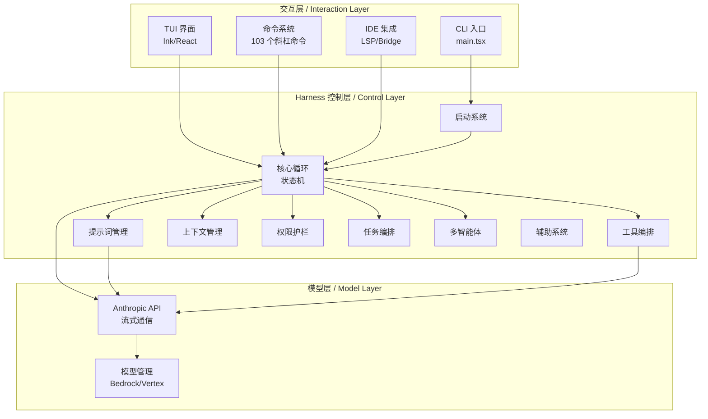
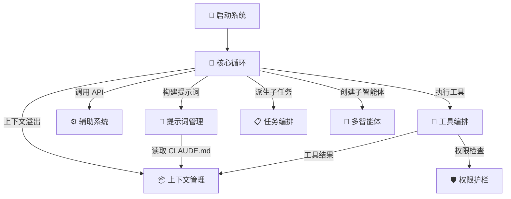
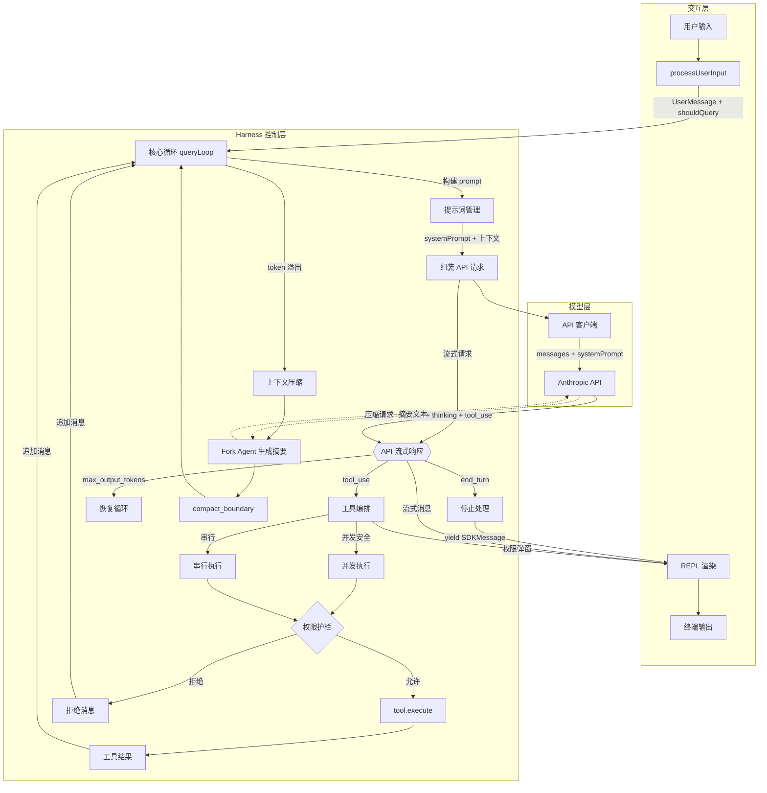
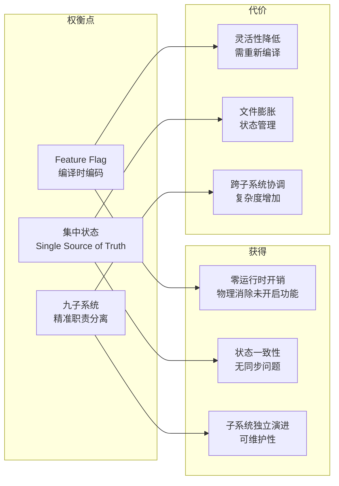

# 第 1 章:当模型遇见 Harness

> "模型是引擎，Harness 是车身。引擎决定动力，车身决定你能开到哪里。"

51 万行 TypeScript 代码、2000 个源文件、54 个工具注册——这些数字属于 Claude Code v2.1.88，Anthropic 的 AI 编程助手 CLI。但调用 Claude API 完成一次对话，只需要不到 10 行代码。多出来的 51 万行在做什么？它们构成了一个精密的 **Harness（马具）** 控制层——围绕 LLM 搭建的运行框架，决定模型能稳定、安全、高效地完成多复杂的任务。读完本章，你将看到这张 Harness 架构的全景地图，并理解后续每一章在全局架构中的位置。

## 问题——51 万行代码在解决什么问题

裸调 Claude API 只需要几行代码：发送一段文本，收到一段回复。但当你想让 AI 编程助手改完一个文件后记住改动内容、在执行危险命令前先征求许可、在上下文窗口快要爆满时自动压缩历史消息、在主任务之外并行派发子任务——你需要的就不再是一个 API 封装，而是一整套控制架构。

Claude Code 的代码不是功能堆砌，而是围绕一个单一目标构建的精密系统：**让模型稳定、安全、高效地完成任务**。源码的第一行就揭示了这种工程意识的渗透深度。

启动序列的第一条语句不是解析参数，不是渲染界面，而是一个性能打点。紧随其后的三行代码分别触发 MDM（移动设备管理，Mobile Device Management）子进程读取和 macOS Keychain 预获取，它们的共同特征是：**副作用与后续模块加载并行执行**。源码注释明确写道："这些副作用必须在所有其他导入之前运行。"这三条并行任务在后续约 135 毫秒的模块加载期间同步完成，将冷启动延迟压到最低。

这种对启动顺序的精密控制，就是 Harness 工程的缩影。模型负责理解代码、生成方案；Harness 负责确保模型运行在一个可靠的环境里。没有 Harness，模型是裸露的引擎；有了 Harness，模型是可驾驶的整车。

这 51 万行代码的分布揭示了一个关键事实：**绝大部分代码既不在用户界面，也不在 API 通信，而在两者之间的 Harness 控制层。**

| 架构层 | 代码量 | 核心职责 |
|--------|--------|---------|
| **交互层** | ~60,000 行 | CLI 入口、Ink（React for CLI）TUI 组件、103 个斜杠命令 |
| **Harness 控制层** | ~400,000 行 | 9 个子系统：启动、核心循环、提示词、工具编排、上下文、权限、任务、多智能体、辅助 |
| **模型层** | ~35,000 行 | Anthropic API 流式通信、Bedrock/Vertex 多提供商支持 |

交互层管"用户看到什么"，模型层管"如何与 API 说话"，**Harness 控制层管"所有智能决策"**。工具是否允许执行、上下文何时压缩、子智能体如何派生、权限如何分层——这些决策全部由 Harness 做出，模型只负责"建议"，Harness 负责"审批"。

**这些代码的存在不是为了增强模型能力，而是为了管理模型能力的边界。** 模型能生成 Bash 命令，但 Harness 决定是否允许执行；模型能读取任何文件，但 Harness 决定是否需要用户确认；模型能处理无限长的上下文（理论上），但 Harness 决定何时压缩、如何压缩、压缩后保留什么。

这就是 Harness 工程的核心问题：**什么应该由模型管理，什么必须由 Harness 控制。**

## 黄金法则——Harness 的本质是回答一个问题

Claude Code 的全部代码归根结底都在回答一个永恒问题：

**什么应该由模型管理，什么必须由 Harness 控制？**

这个问题没有唯一答案，但 Claude Code 的 `buildTool` 工厂函数给出了一种工程作答方式。`buildTool` 定义了工具的统一接口——每个工具都必须回答 Harness 的控制问题：是否并发安全？是否只读？是否具有破坏性？

`TOOL_DEFAULTS` 的默认值策略编码了 Claude Code 对这个问题的立场：

- `isConcurrencySafe` 默认 `false`——假设工具不安全，除非开发者显式声明
- `isReadOnly` 默认 `false`——假设工具会写入，除非显式标记

这套默认值策略体现了 **fail-closed（失败关闭）** 原则：当信息不完整时，系统选择更安全的方向。**一个工具如果开发者忘了标记并发安全性，它会被当作不安全来处理——这可能导致性能损失（不能并行），但绝不会导致安全问题（不会并发执行危险操作）。**

**原则 1.1：默认关闭** — 当无法确定操作是否安全时，选择拒绝而非放行。过度保护可能影响性能，但不会造成安全事故。

这个原则在模型管理和 Harness 控制之间划出了一条清晰的界线：模型决定**做什么**（调用哪个工具、传什么参数），Harness 决定**能做什么**（是否允许执行、是否需要确认、是否可以并行）。两者的交互构成了 Harness 工程的核心张力。

## 适用场景——谁需要 Harness 工程

如果你正在构建一个让 AI 执行操作的软件系统——无论它叫 Agent、Copilot、还是 AI 助手——你都在做 Harness 工程。区别只在于你是否意识到。

Claude Code 的工具注册表列出了系统暴露给模型的全部工具，涵盖了五类通用 Agent 需求：

| 需求类别 | 工具示例 | 通用 Agent 中的对应 |
|---------|---------|-------------------|
| 文件操作 | FileReadTool、FileEditTool、FileWriteTool | 读取/修改知识库、配置文件 |
| 命令执行 | BashTool | 调用外部 API、执行系统命令 |
| 搜索 | GlobTool、GrepTool、WebSearchTool | 信息检索、代码搜索 |
| 任务管理 | AgentTool、TaskCreateTool、TaskListTool | 子任务派发、多智能体协调 |
| 用户交互 | AskUserQuestionTool、ConfigTool | 向用户确认、调整配置 |

这份工具清单揭示了 Harness 工程的通用性——Claude Code 注册的工具类型，与任何 AI Agent 系统需要的工具类型高度重叠。**工具的具体实现不同，但工具的类别和 Harness 管理工具的方式是可以迁移的。**

那么，谁需要关注 Harness 工程？

| 读者类型 | 场景 | 从本书获得什么 |
|---------|------|--------------|
| Agent 框架开发者 | 构建通用的 Agent 运行框架 | 工具编排、权限控制、上下文管理的工程模式 |
| AI 应用工程师 | 在产品中集成 AI 能力 | 安全护栏、错误处理、性能优化的实践参考 |
| 架构师 | 设计大型 AI 系统的分层结构 | 三层 + 九子系统架构模型和设计权衡分析方法 |

## 工作原理——三层架构与九个子系统

Claude Code 的代码可以清晰地映射为三层架构。**交互层**处理用户输入和输出渲染，**模型层**封装与 Anthropic API 的通信，中间的 **Harness 控制层**承担所有"智能"决策。而 Harness 控制层内部，又由 9 个职责明确的子系统构成。

**图 1-1：Claude Code 三层架构总图**

上图展示了三层之间的依赖方向：交互层调用 Harness 控制层，Harness 控制层调用模型层。**反向不存在直接依赖**——模型层不知道工具是什么，交互层不知道 API 怎么调用。

### Harness 控制层的九个子系统

Harness 控制层是 51 万行代码的真正归宿。它内部的 9 个子系统各司其职，通过 `QueryEngineConfig` 的 30+ 个配置字段精确划定子系统间的接口。

**图 1-2：Harness 控制层九子系统关系图**

以下是每个子系统的一句话定位、源码位置和对应的后续章节：

**1. 启动系统**（详见第 2 章）

从进程入口到 REPL 就绪的全流程编排。前三行并行触发性能打点、MDM 子进程、Keychain 预获取，将冷启动延迟压到最低。Feature Flag 控制哪些代码被编译加载——每个 flag 都是对"模型在某件事上还不够好"的断言。

**2. 核心循环系统**（详见第 3 章）

驱动"用户输入 → API 调用 → 工具执行 → 继续或停止"的无限循环。`query()` 是一个 async generator，通过 `while(true)` 循环管理跨迭代的状态：消息列表、工具上下文、压缩追踪、输出 token 恢复计数。`QueryEngine` 类封装此循环为面向 SDK 消费者的接口。

**3. 提示词管理系统**（详见第 5 章）

动态构建发送给 LLM 的 system prompt。`getSystemPrompt()` 组装分段式提示词（身份、工具描述、安全指令、输出格式），`getSystemContext()` 注入 Git 状态快照，CLAUDE.md 加载器从 4 个优先级层级发现和注入项目指令。提示词分段区分缓存/非缓存段落，服务于 Prompt Cache 最大化命中。

**4. 工具编排与执行系统**（详见第 7 章）

将 LLM 的工具调用请求转化为实际操作。`runTools()` 按 `isConcurrencySafe()` 将工具调用分为只读（可并发）和写入（串行）两组，默认并发上限 10。`runToolUse()` 处理单个工具的完整流程：权限检查 → pre-tool hooks → execute → post-tool hooks。MCP（Model Context Protocol）集成允许动态加载外部工具。

**5. 上下文管理系统**（详见第 11 章）

管理对话历史和 token 预算，在上下文溢出时压缩。三级压缩策略：自动压缩（上下文超过阈值时触发）、微压缩（增量压缩最新工具结果）、快照压缩（通过 fork agent 生成摘要）。AppState 通过 React Context + `createStore()` 管理 UI 状态，集中状态模块管理 100+ 个全局状态函数。

**6. 权限护栏系统**（详见第 9 章）

四层防御确保 LLM 不会执行未授权的危险操作。第一层：配置规则（alwaysAllow/alwaysDeny）；第二层：AI 分类器自动判断（Auto 模式）；第三层：用户自定义 Hook（5022 行代码，6 个触发点）；第四层：交互确认弹窗。组织级策略限制从 API 获取，采用 fail-open 策略。

**7. 任务编排系统**（详见第 8 章）

管理后台任务生命周期和 Plan 模式。支持 7 种任务类型（LocalAgentTask、InProcessTeammateTask、RemoteAgentTask 等），每种适配不同执行场景。Plan 模式通过工具权限编码"先思考后行动"的约束。

**8. 多智能体系统**（详见第 13 章）

支持子智能体派生、Swarm/Teammate 协作和 Coordinator 编排三种模式。Fork Subagent 通过 `CacheSafeParams` 共享父级 API 缓存前缀，实现零成本上下文共享。Coordinator 模式通过环境变量启用中心化编排。

**9. 辅助系统**

API 客户端封装流式/非流式请求和多提供商支持。费用追踪每次调用的成本。设置管理从 5 个优先级来源加载配置（策略 > 远程管理 > 项目 > 用户 > CLI flag）。模型管理处理模型名称映射和提供商检测。

### 一次用户请求的完整旅程

上面我们看到了 9 个子系统各自做什么，但还没看到它们如何**协作**。让我们追踪一次用户输入从进系统到出结果的完整旅程，看三层 × 九子系统如何串成一条管道。

**图 1-3：用户请求的完整数据流**

**阶段一：输入解析**（交互层 → Harness 控制层）

用户在终端输入文本，`processUserInput()` 解析内容——识别斜杠命令、图片粘贴、@提及，生成 `UserMessage`。如果是斜杠命令（如 `/compact`），直接在 Harness 内处理并返回结果，不调用 API。如果需要模型参与（`shouldQuery = true`），消息被推入核心循环。

**阶段二：提示词构建**（Harness 控制层 · 提示词管理子系统）

核心循环调用 `fetchSystemPromptParts()` 并行构建三部分：system prompt（工具描述、安全指令、输出格式）、user context（用户环境信息）、system context（Git 状态快照）。CLAUDE.md 文件从 4 个优先级层级动态注入。所有部分组装后加上 API 缓存断点标记，然后发送给模型层。

**阶段三：模型调用与响应**（Harness 控制层 ↔ 模型层）

API 客户端将消息列表（messages）和系统提示词（systemPrompt）发送给 Anthropic API。响应以 SSE（Server-Sent Events）流的形式返回，包含三类内容块：**text**（模型生成的文本）、**thinking**（内部推理过程）、**tool_use**（工具调用指令）。Harness 控制层在流式接收的同时就开始处理——不等全部响应到达。上下文压缩时的 Fork Agent 也会向同一 API 发起独立请求来生成摘要。

**阶段四：工具执行**（Harness 控制层 · 工具编排 + 权限护栏）

如果 API 返回 `tool_use` 内容块，工具编排子系统接管。工具调用被分为并发安全（只读）和非并发安全（写入）两组。每个工具执行前经过权限护栏的四层检查。执行结果作为 `tool_result` 消息追加到对话历史，然后**回到阶段二**重新构建提示词并发起下一轮 API 调用。

这就是核心循环 `while(true)` 的本质——一个不断在提示词构建、API 调用、工具执行之间循环的状态机，直到模型返回 `end_turn` 或触发终止条件。

**阶段五：上下文保护**（Harness 控制层 · 上下文管理子系统）

如果某轮迭代后 token 使用量超过自动压缩阈值，上下文管理子系统启动压缩：通过 fork agent 生成对话摘要，插入 `compact_boundary` 标记。后续 API 调用只发送边界之后的消息 + 摘要，释放 token 空间。

**阶段六：输出交付**（Harness 控制层 → 交互层）

输出不是只在最后才回到交互层，而是在整个循环中持续流回：API 流式响应的每个文本块实时送达 REPL 渲染；工具执行前的权限弹窗由交互层的用户确认组件处理；最终 `end_turn` 后，核心循环 yield 完整的 SDKMessage 给交互层渲染为终端输出。**交互层是信息的终点，也是用户控制的起点——权限弹窗的回复会流回 Harness 继续执行。**

---

**这 9 个子系统不是理论模型，而是源码中可验证的物理边界。** 核心循环是它们的交汇点——上面的数据流图展示了每次 `query()` 迭代中，核心循环如何同时与提示词管理、工具编排、上下文管理、权限护栏四个子系统协作。

## 权衡——三层架构的设计选择

架构不是对错问题，是权衡问题。Claude Code 的每个架构决策都隐含着一个"选 A 不选 B"的理由。理解这些权衡，比记住结构的名字更重要。

**权衡一：Feature Flag vs 配置文件**

Claude Code 使用编译时 Feature Flag（`feature('KAIROS')`）而非运行时配置文件来控制模块加载。这意味着未开启的功能在编译时就被消除——零运行时开销、零包体积占用。但代价是灵活性：修改功能开关需要重新编译，而不是编辑一个 YAML 文件。

这个权衡的取舍方向很明确：**对于 AI Agent 运行时，不可预测的条件分支本身就是风险源。** 模型可能意外触达未完全测试的功能路径，Feature Flag 的编译时消除确保了这些路径在运行时物理上不存在。

**权衡二：集中状态 vs 分散状态**

`bootstrap/state.ts` 集中管理了 100+ 个全局状态函数——`getOriginalCwd()`、`setIsRemoteMode()`、`setMainLoopModelOverride()` 等。这个文件有 1762 行，是一个典型的"上帝模块"。

集中状态的好处是**单一来源（Single Source of Truth）**：任何模块需要获取工作目录、远程模式标志、模型覆盖设置，都从同一个文件获取，不会出现两个模块各自维护一份不同步的状态。代价是文件膨胀——1762 行的状态管理文件增加了理解和修改的认知负担。

**权衡三：九子系统 vs 更粗粒度划分**

9 个子系统带来精准的职责分离——提示词管理与上下文管理分开，权限护栏与 Hook 系统分开，任务编排与多智能体分开。但代价是跨子系统协调的复杂度：核心循环在每次迭代中同时与 4-5 个子系统交互。如果采用更粗粒度的划分（例如只分"工具层"、"上下文层"、"安全层"三层），协调更简单但职责边界模糊。

Claude Code 的选择：**精准分离优先，因为可维护性比协调简洁性更重要。** 当系统演进时，每个子系统可以独立修改而不影响其他子系统——这种解耦在 51 万行代码的项目中是生存必需的。

**图 1-4：架构决策权衡矩阵**

**核心权衡总结**：

| 决策维度 | 选择 A（Claude Code） | 选择 B | 核心权衡 |
|---------|---------------------|--------|---------|
| 功能开关 | Feature Flag（编译时） | 配置文件（运行时） | 安全性 > 灵活性 |
| 状态管理 | 集中（bootstrap/state.ts） | 分散（各模块自管） | 一致性 > 模块内聚 |
| 子系统粒度 | 9 个精准子系统 | 3 个粗粒度模块 | 可维护性 > 协调简洁性 |

**原则 1.2：权衡显式化** — 架构决策必须回答"选了什么、放弃了什么、为什么这样选"。没有权衡的架构决策要么是平庸的，要么是没有被认真思考过的。

## 踩坑指南——从源码中看到的工程陷阱

在学习 Harness 工程的最佳实践之前，先知道最常见的错误是什么。Claude Code 的源码揭示了三个反复出现的工程陷阱。

**陷阱一：交互层和 Harness 层混淆**

裸调 API 没有"架构"的概念，你随时可以调用，随时可以停止。但真实的 Agent 系统需要把"用户看到什么"（交互层）和"系统做什么决策"（Harness 控制层）分开。Claude Code 的交互层是 REPL.tsx——一个纯渲染组件，不含任何业务逻辑。如果你把权限检查写在 UI 组件里，换一个界面（比如 Web UI）就要重写全部权限逻辑。**交互层只管渲染，Harness 只管决策，两者通过 AppState 接口通信。**

**陷阱二：工具默认不安全**

`TOOL_DEFAULTS` 揭示了一个人性化的工程洞察：**开发者会忘记标记工具的安全性**。`isConcurrencySafe` 默认 `false` 的设计，意味着"忘记标记"的后果是工具不能并行——性能损失，但安全。如果把默认值设为 `true`，"忘记标记"的后果就是危险工具被并发执行——性能提升，但可能删除文件、覆盖数据。**默认值的工程含义不是"正常情况"，而是"忘记时的情况"。**

**陷阱三：上下文无上限增长**

LLM 的上下文窗口看似很大，但 Agent 系统的对话历史会持续增长。一个调试会话可能产生数万 token 的工具调用记录和返回结果。如果不主动管理上下文窗口，系统要么因为超出窗口限制而崩溃，要么因为上下文过长导致模型注意力分散而输出质量下降。Claude Code 并存了 5 种压缩策略（详见第 11 章），这本身就是对"上下文增长是 Agent 系统的头号敌人"这个认知的工程作答。

## 实证——三层架构在源码中的验证

三层 + Harness 层九子系统架构不是理论模型，可以从源码的目录结构、import 关系和类型定义中验证。让我们从交互层到模型层，逐一检查物理边界是否真实存在。

**交互层的证据**

`main.tsx` 中的 Commander 注册入口（`src/main.tsx:968`）是交互层的分叉点——用户输入在这里被解析为命令或对话，然后分发给 Harness 控制层。5005 行的 REPL.tsx（`src/screens/REPL.tsx:1`）是 TUI 主组件，它的职责是**渲染消息和捕获输入**——不含任何工具执行、权限检查或 API 调用逻辑。103 个命令目录（`src/commands/`）各自实现一个斜杠命令，全部是"解析输入、路由到 Harness"的模式。**交互层不包含任何业务逻辑。**

**Harness 控制层的证据**

`QueryEngineConfig` 类型（`src/QueryEngine.ts:130`）是 Harness 控制层的总接口。这个类型定义了 30+ 个字段，其中 `tools: Tools` 连接工具编排子系统，`mcpClients` 连接 MCP 外部服务，`canUseTool` 连接权限护栏子系统，`initialMessages` 连接上下文管理子系统，`abortController` 连接生命周期管理。**Config 类型就是子系统之间的契约——它规定了核心循环可以向其他子系统传递什么、期望从它们获得什么。**

9 个子系统的源码边界：

**1. 启动系统** — `main.tsx` 的前三条语句（`src/main.tsx:12`）是性能打点、MDM 子进程、Keychain 预获取，注释明确标注"这些副作用必须在所有其他导入之前运行"。`feature('COORDINATOR_MODE')` 和 `feature('KAIROS')`（`src/main.tsx:76`）在编译时决定哪些模块被加载——启动系统和后续所有子系统的代码路径都受这些 flag 控制。

**2. 核心循环** — `QueryEngine` 类（`src/QueryEngine.ts:184`）封装会话生命周期，`query()` 函数（`src/query.ts:219`）是 `async function*` 生成器，实现 `while(true)` 循环。`QueryEngineConfig` 的 30+ 字段精确定义了核心循环与其他子系统的全部交互接口——不多不少。

**3. 提示词管理** — `getSystemPrompt()`（`src/constants/prompts.ts`）组装分段式系统提示词，`getSystemContext()` 和 `getUserContext()`（`src/context.ts`）分别构建系统上下文和用户上下文。CLAUDE.md 加载器（`src/utils/claudemd.ts`）从 4 个优先级层级发现和注入项目指令。提示词的分段结构区分缓存与非缓存段落，服务于 Prompt Cache 命中。

**4. 工具编排与执行** — `tools.ts` 的注册列表（`src/tools.ts:195`）包含 54 个工具（19 个始终启用 + 35 个条件启用），全部通过 `buildTool` 工厂（`src/Tool.ts:783`）创建，遵循统一的 `Tool` 接口。`runTools()`（`src/services/tools/toolOrchestration.ts:150`）按 `isConcurrencySafe()` 分区为并发/串行两组。`runToolUse()`（`src/services/tools/toolExecution.ts:337`）处理单个工具的权限检查 → hooks → execute → 结果收集完整流程。

**5. 上下文管理** — `AppState` 类型（`src/state/AppStateStore.ts`）通过 `createStore()` 管理 UI 状态。压缩模块（`src/services/compact/compact.ts`）实现 `compactConversation()`，通过 fork agent 生成对话摘要。全局状态模块（`src/bootstrap/state.ts`，1762 行）集中管理 100+ 个状态函数——工作目录、远程模式、模型覆盖等全部从单一来源获取。

**6. 权限护栏** — 权限目录（`src/utils/permissions/`）包含 24 个文件、9409 行代码，实现四层防御。Hook 系统（`src/utils/hooks.ts`，5022 行）在 6 个触发点（PreToolUse、PostToolUse、Stop、SessionStart、SessionEnd、Notification）提供外部扩展能力。

**7. 任务编排** — `src/tasks/` 目录包含 7 种任务类型（LocalAgentTask、InProcessTeammateTask、RemoteAgentTask、DreamTask、LocalShellTask、LocalWorkflowTask、MonitorMcpTask），每种有独立实现目录。Plan 模式通过 EnterPlanModeTool / ExitPlanModeTool 的工具权限切换实现"先规划后执行"。

**8. 多智能体** — `AgentTool`（`src/tools/AgentTool/AgentTool.tsx:196`）通过 `buildTool` 注册，是主循环派发子任务的入口。Swarm 系统（`src/utils/swarm/`，14 个文件）实现进程内 teammate 创建、权限同步、leader-worker 桥接。Coordinator 模式（`src/coordinator/coordinatorMode.ts`）通过环境变量 `CLAUDE_CODE_COORDINATOR_MODE` 启用中心化编排。

**9. 辅助系统** — API 客户端（`src/services/api/claude.ts`，3419 行）封装流式/非流式请求和多提供商支持。费用追踪（`src/cost-tracker.ts`）追踪每次调用的成本。设置管理从 5 个优先级来源加载配置（策略 > 远程管理 > 项目 > 用户 > CLI flag）。模型管理（`src/utils/model/`）处理模型名称映射和提供商检测。

**模型层的证据**

`src/services/api/claude.ts` 是唯一的 API 通信入口，3419 行代码封装了流式/非流式请求、Bedrock/Vertex 多提供商支持、token 使用量追踪。**这个文件不知道工具是什么、权限怎么检查、上下文怎么压缩。** 它的输入是消息列表和系统提示词，输出是流式响应块。模型管理（`src/utils/model/`）处理模型名称映射和提供商检测，同样不包含任何 Harness 逻辑。

**三层之间的依赖方向是单向的**：交互层 → Harness 控制层 → 模型层。反向不存在直接依赖。这个单向依赖可以在 `main.tsx` 的 import 链中验证——入口文件引入 `QueryEngine`（Harness），`QueryEngine` 引入 `claude.ts`（模型层），但 `claude.ts` 的 import 列表中既没有 `QueryEngine` 也没有任何交互层组件。

**原则 1.3：架构的物理性** — 好的架构分层有源码级的物理证据——import 链、类型定义、目录结构。如果分层只存在于架构图上而无法从代码结构中验证，那它就是理论而非工程。

## 本章主成分：Harness 架构

**本质**：围绕"什么由模型管理，什么由 Harness 控制"这个核心问题组织的三层控制架构。交互层管输入输出，Harness 控制层管所有智能决策（9 个子系统），模型层管 API 通信。

**关键机制**：
- Feature Flag 编码模型能力假设，编译时物理消除未开启功能（启动系统）
- `buildTool` 统一工具接口，fail-closed 默认值确保安全（工具编排子系统）
- `QueryEngine` 管理会话生命周期，`QueryEngineConfig` 的 30+ 字段定义子系统间契约（核心循环子系统）
- 四层权限防御从配置到分类器到 Hook 到交互确认（权限护栏子系统）

**适用边界**：
- ✓ 适合：需要稳定、安全、可扩展的 Agent 系统
- ✓ 适合：需要多工具编排和多智能体协调的复杂 AI 应用
- ✗ 不适合：一次性脚本或简单的 API 封装
- ✗ 不适合：不需要工具执行的纯对话系统

**与其他模式的关系**：
- Harness 架构是中间层结构模式，对应 ReAct、Plan-and-Execute 等推理模式
- 九子系统各自独立，但通过核心循环的 `QueryEngineConfig` 接口协作

**后续章节导航**：
- 启动系统的并行初始化与 Feature Flag 机制 → 详见第 2 章
- 核心循环 QueryEngine 的会话状态机 → 详见第 3 章
- 单轮执行从提示词构建到流式工具执行的完整流水线 → 详见第 4 章
- 提示词管理子系统的分段缓存与 Prompt Cache 命中策略 → 详见第 5 章
- Skills 懒加载与上下文窗口的自管理 → 详见第 6 章
- 工具编排子系统的接口统一、并发安全策略与 MCP 扩展机制 → 详见第 7 章
- 任务编排子系统的 Plan Mode 如何通过工具权限编码"先规划后执行"约束 → 详见第 8 章
- 权限护栏子系统的渐进谱系与 AI 分类器的递归安全设计 → 详见第 9 章
- Hook 系统如何让 Harness 行为可配置而不改代码 → 详见第 10 章
- 上下文管理子系统的 5 种压缩策略各编码了什么模型能力假设 → 详见第 11 章
- 上下文重置与缓存命中如何兼顾、MEMORY.md 的分层设计 → 详见第 12 章
- 多智能体子系统的 GAN 式生成/验证协作与验证器提示词设计 → 详见第 13 章
- 后台任务并行执行与 Coordinator 多智能体协调 → 详见第 14 章
- Feature Flag 驱动的 Harness 自我精简机制 → 详见第 15 章
- 可复用的 Harness 工程决策框架，回答"什么由模型管理，什么由 Harness 控制" → 详见第 16 章

## 你能做什么

- **用三层 + 九子系统架构模型审视你的 AI 应用**。画出你的应用三层图——交互层在哪里？Harness 控制层有哪些子系统？模型层如何封装？如果某层或某个子系统找不到明确的代码边界，说明那里的架构可能需要重构。
- **检查你的工具定义是否有 fail-closed 默认值策略**。如果工具的默认行为是"允许一切"，一次遗漏标记就可能导致安全事故。
- **识别"模型管理"和"Harness 控制"的边界**。在你的系统中，列出所有模型可以触发的操作，标注每个操作的 Harness 控制点（权限检查、并发限制、超时控制）。
- **用 Feature Flag 的思路评估你应用中硬编码的"模型能力假设"**。你是否在代码中假设"模型一定能正确处理长文本"或"模型一定不会生成危险命令"？这些假设应该被显式编码，而不是隐式存在（详见第 15 章）。
- **画出启动序列的时间线**。标注哪些初始化可以并行、哪些有依赖关系。Claude Code 在 135 毫秒内完成三项并行初始化——你的应用有多少启动时间可以利用？（详见第 2 章）
- **对照 `QueryEngineConfig` 的 30+ 字段，检查你的 Agent 系统是否有同样完整的配置契约**。缺失的字段往往意味着缺失的工程考量。
- **检查你的上下文管理是否有压缩策略**。如果对话历史无限增长，你需要的不是一个更大的上下文窗口，而是一套压缩策略（详见第 11 章）。
- **阅读后续章节前，带着"这个子系统解决了什么权衡"的问题意识**。每章不仅告诉你 Claude Code 做了什么，还会告诉你为什么这样做——权衡才是真正可迁移的工程智慧。

---

**下一章导读**：本章看到了三层 + 九子系统架构的全景，但没有深入任何子系统。第 2 章将进入第一个子系统——启动系统。我们会看到 Claude Code 的前三行代码如何通过并行初始化在 135 毫秒内完成所有准备工作，以及 Feature Flag 如何编码"模型能力假设"——每个 flag 都是对"模型在某件事上还不够好"的断言。这些 flag 的存在本身，就是 Harness 工程最诚实的自白。
