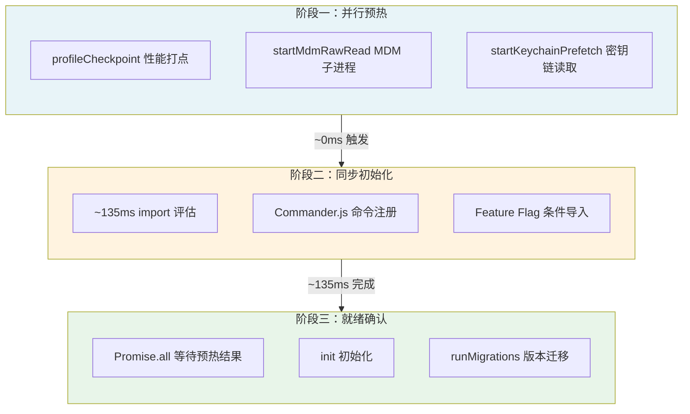
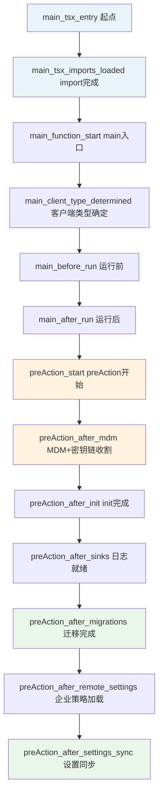

# 第 2 章：点火序列

> "启动不是成本，是投资。每一毫秒都在为后续的稳定运行买单。"

你打开终端输入 `claude`，不到一秒就进入交互模式。这一秒内发生了什么？三条并行子进程的启动、~135 毫秒的模块加载、19 次性能打点、11 个版本迁移、Feature Flag 对模块图的裁剪——比大多数应用整个启动过程做的事情更多。而这一切都在回答同一个工程问题：**不要让模型等 I/O。** 读完本章，你将理解 Harness 如何在模型调用之前完成所有基础设施准备，以及 Feature Flag 如何编码"模型能力假设"。

## 问题——从进程启动到模型就绪，发生了什么

第 1 章的六层架构全景展示了启动层的位置，但没有展开。现在让我们进入第一层内部，看看从进程启动到模型就绪，这 ~200 毫秒内发生了什么。

Claude Code 的启动过程分三个阶段。源码注释精确说明了第一阶段的核心设计：

> "这些副作用必须在所有其他导入之前运行：
> 1. profileCheckpoint 在重型模块评估开始前标记入口点；
> 2. startMdmRawRead 触发 MDM 子进程使其与后续约 135ms 的导入并行运行；
> 3. startKeychainPrefetch 触发两次 macOS 密钥链读取的并行执行，否则它们会以同步方式在 applySafeConfigEnvironmentVariables 中顺序执行（每次 macOS 启动约 65ms）。"

这三行注释浓缩了启动层的全部设计哲学：**在模块评估期间并行预热一切可能阻塞后续流程的 I/O。**

**图 2-1：启动序列三阶段**

阶段一几乎零成本——三条子进程启动语句只触发 I/O，不等结果。阶段二是主要耗时——~135 毫秒的 JavaScript 模块评估。阶段三在 preAction 钩子中执行，用 `Promise.all` 收割阶段一种下的并行结果。因为子进程在 ~135 毫秒的 import 期间已经完成，`Promise.all` 几乎是免费的。

这三个阶段的时间分配揭示了一个关键洞察：**启动时间不是线性累加的。** 阶段一的三个 I/O 操作与阶段二的模块评估并行执行，总启动时间约等于阶段二的时间，而非三者之和。这就是并行预热的威力——用零额外等待时间消除了 ~65 毫秒的顺序 I/O 成本。

## 黄金法则——并行预热一切可能阻塞模型的 I/O

启动序列的核心原则可以用一句话概括：

**不要让模型等 I/O。所有可能阻塞后续流程的 I/O 操作，都必须在模块评估期间并行启动。**

这个原则的源码证据藏在 `keychainPrefetch.ts` 的注释中。这段注释是一份精算报告：密钥链的两次读取——"Claude Code-credentials"（OAuth 令牌）约 32 毫秒、"Claude Code"（遗留 API 密钥）约 33 毫秒——如果顺序执行，总计约 65 毫秒。而如果提前触发，让子进程在 ~135 毫秒的 import 评估期间并行运行，收割时"几乎免费"。

**原则 2.1：预热先于等待** — 如果一个 I/O 操作的结果在后续一定会被使用，不要等到需要时才启动。提前触发，并行收割。

这个原则的适用条件很明确：操作之间没有依赖关系。MDM 配置读取不依赖密钥链读取，密钥链读取不依赖 import 评估。三者天然可以并行。但有一个微妙的约束——**并行操作的 import 链必须保持最小化**。注释明确警告：密钥链预获取故意不引入 `macOsKeychainStorage` 模块，因为后者会拉入 `execa → human-signals → cross-spawn` 的依赖链，带来约 58 毫秒的同步模块初始化开销。用更轻量的 `macOsKeychainHelpers` 替代，保持了 import 链的纯净。

这就是并行预热的另一面：**并行是免费的，但并行操作的模块依赖是有成本的。** 每多引入一个模块，就增加了 import 评估的时间——这个时间是同步的、不可避免的。

## 适用场景——哪些应用需要精心设计启动序列

Claude Code 不仅在启动时做了并行预热，还为此建立了一套专门的性能监控工具——`startupProfiler`。

`startupProfiler` 的采样策略编码了一种工程态度：启动性能值得持续监控。内部用户（Anthropic 员工）100% 上报启动耗时，外部用户 0.1% 采样。这种差异化采样说明 Anthropic 把启动性能当作产品特性来管理，而非开发时的临时调试工具。

源码中 19 个 `profileCheckpoint` 调用构成了一条完整的时间线，覆盖从入口到就绪的每个关键节点。这不是事后添加的——`profileCheckpoint('main_tsx_entry')` 是 `main.tsx` 的第一条可执行语句，在所有 import 之前。

那么，谁需要这种启动设计？

- **AI 助手和 Agent 应用**——模型首次响应的延迟直接影响用户体验，用户不会等待一个"正在初始化"的提示
- **CLI 工具**——命令行工具的启动速度感知尤为强烈，超过 500 毫秒用户就会觉得"慢"
- **需要认证的客户端应用**——密钥链/OAuth 令牌的获取是典型的启动时 I/O 阻塞点

如果你的应用没有"用户等待首次响应"的压力，精心设计启动序列的收益可能不大——后台批处理任务或服务端长驻进程更关注吞吐量而非冷启动时间。

## 工作原理——Feature Flag 如何编码模型能力假设

启动层最精巧的设计不是并行预热——那只是经典的性能优化。真正独特的是 **Feature Flag 对模块图的编译时裁剪**。

每个 `feature('FLAG_NAME')` 调用都是一条隐含断言：**"模型在 X 方面还不够好，需要 Harness 脚手架。"** Flag 的存在是 Harness 对模型能力的诚实评估；Flag 的移除（当模型能力增强后）是 Harness 自我精简的信号。

`feature` 函数来自 `bun:bundle`，这是 Bun 运行时的编译时特性。当 Flag 为 `false` 时，`require()` 调用根本不会出现在编译产物中——不仅是条件跳过，而是物理消除（Dead Code Elimination, DCE）。

Claude Code 的关键 Feature Flag 清单揭示了 Anthropic 对模型能力边界的评估：

| Feature Flag | 功能 | 编码的能力假设 |
|-------------|------|--------------|
| `KAIROS` | 助手模式——自主管理完整工作流 | 模型还不能自主管理端到端的工作流，需要人类引导 |
| `COORDINATOR_MODE` | 多智能体协调模式 | 单个智能体不足以处理复杂任务，需要协调层 |
| `TRANSCRIPT_CLASSIFIER` | 自动权限分类 | 模型还不能可靠判断自身行为是否安全 |
| `HISTORY_SNIP` | 历史消息裁剪 | 模型在长上下文下的注意力会退化 |
| `OVERFLOW_TEST_TOOL` | 上下文溢出测试工具 | 模型可能生成超出上下文窗口的输出 |
| `WEB_BROWSER_TOOL` | 内置浏览器工具 | 模型需要浏览实时网页但无法直接访问 |
| `AGENT_TRIGGERS` | 定时触发器（Cron） | Agent 需要在无用户输入时主动执行任务 |
| `WORKFLOW_SCRIPTS` | 预置工作流脚本 | 模型还不能自行发现最优工作流 |

这张表是 Harness 工程最诚实的自白。每个 Flag 的名字无关紧要，真正有意义的是 Flag 背后的假设：**"如果没有这个脚手架，模型会在这个场景下失败。"**

**原则 2.2：Feature Flag 编码能力假设** — 每个 Feature Flag 都是对"模型在某方面还不够好"的显式断言。Flag 的存在是脚手架，Flag 的移除是里程碑。

Feature Flag 在启动层的运作方式是条件导入。以 `KAIROS` 为例：如果 Flag 为 `true`，`require('./assistant/index.js')` 加载整个助手模块；如果为 `false`，变量被赋值为 `null`，助手模块的代码根本不会进入 JavaScript 引擎。这种设计的一个直接后果是：**Flag 关闭时，对应功能不存在运行时开销，也不存在被意外触达的风险。**

同样的模式贯穿整个工具编排系统。`src/tools.ts` 中的工具注册使用条件导入：`OVERFLOW_TEST_TOOL`、`CONTEXT_COLLAPSE`、`TERMINAL_PANEL`、`WEB_BROWSER_TOOL` 等——每个工具的注册都受 Feature Flag 控制。模型的工具列表会根据 Flag 状态动态变化，模型甚至不知道自己"少了"哪些工具。

这与第 1 章的六层架构有什么关系？Feature Flag 是启动层的核心机制——它决定了六层架构中哪些层会被实例化、哪些工具会被注册、哪些模块会被加载。**启动层是六层架构的开关板，Feature Flag 是开关。**

## 权衡——启动序列的设计选择

启动序列不是"越快越好"——它是一组精心校准的权衡。

**权衡一：最小 import 链 vs 开发便利性**

密钥链预获取模块故意不引入 `macOsKeychainStorage`，而是用更轻量的 `macOsKeychainHelpers`。注释明确计算了代价差异：`macOsKeychainStorage` 会拉入 `execa → human-signals → cross-spawn` 的依赖链，约 58 毫秒的同步初始化开销。**为了节省 58 毫秒，开发者放弃了直接调用完整 API 的便利性，转而使用一个功能子集的轻量替代。**

这个权衡的取舍方向：在启动路径上，每毫秒都是昂贵的。开发便利性在运行时路径上可以追求，但启动路径必须极致精简。

**权衡二：同步迁移 vs 异步迁移**

`runMigrations()` 函数区分了关键迁移和非关键迁移。关键迁移（如默认模型重置、权限配置迁移）同步执行——确保后续代码看到的配置状态是一致的。非关键迁移（如 changelog 格式迁移）用 `fire-and-forget` 异步执行，失败时静默忽略并等待下次启动重试。

| 迁移类型 | 执行方式 | 失败处理 | 理由 |
|---------|---------|---------|------|
| 关键迁移（11 个） | 同步 | 阻塞启动 | 后续代码依赖迁移后的配置状态 |
| 非关键迁移 | 异步 | 静默忽略 | 不影响启动后的功能正确性 |

**权衡三：失败开放 vs 失败关闭**

企业策略加载（`loadRemoteManagedSettings` 和 `loadPolicyLimits`）使用 `void` 前缀——即 `fire-and-forget`。这意味着如果企业策略服务不可用，系统会在没有策略限制的情况下继续启动。

这与第 1 章工具默认值的 fail-closed 策略形成了有趣的对比。工具编排系统选择"失败关闭"——宁可拒绝也不误放行；启动层选择"失败开放"——宁可没有策略也不阻塞启动。**两种选择都是正确的，因为代价不同：工具编排系统误放行的代价是安全事故，启动层阻塞的代价是用户无法使用产品。**

**原则 2.3：权衡的代价决定方向** — 选择 fail-closed 还是 fail-open，不取决于组件的重要性，而取决于失败的代价。安全场景拒绝优于放行；可用性场景启动优于等待。

## 踩坑指南——启动序列中的工程陷阱

Claude Code 的源码注释本身就是最佳实践的教科书。从这些注释中可以提炼出三个常见的启动工程陷阱。

**陷阱一：在 import 链中引入重模块**

`keychainPrefetch.ts` 的注释精确计算了引入 `macOsKeychainStorage` 的代价：`execa → human-signals → cross-spawn`，约 58 毫秒的同步模块初始化。在启动路径上，58 毫秒不是"微小优化"，而是总启动时间 135 毫秒的 43%。**一个看似无害的 import 就能吞噬近一半的启动预算。**

更危险的是，这种膨胀通常是渐进的：今天引入一个工具函数，明天引入一个格式化库，后天引入一个 HTTP 客户端——每次都是"只多一个"，累计后启动时间翻倍。防御方法是建立启动路径的 import 审查机制。

**陷阱二：同步 I/O 阻塞事件循环**

MDM 配置读取如果改用同步方式（`execSync` 而非 `execFile`），会阻塞整个事件循环约 65 毫秒——在这期间什么都不能做。Claude Code 的做法是启动异步子进程，然后在需要结果时收割。**同步 I/O 在启动路径上不是"简单"，而是"懒惰"。**

**陷阱三：迁移逻辑阻塞启动**

`runMigrations()` 同步执行 11 个关键迁移。如果每个迁移涉及文件 I/O 或配置写入，累计时间可能成为新的启动瓶颈。Claude Code 的防御策略是严格区分关键和非关键迁移，非关键的一律异步。如果你的应用有类似的迁移需求，这个区分应该在第一天就建立——等到迁移数量膨胀后再拆分，改造成本远高于一开始就做好。

## 实证——从 profileCheckpoint 追踪启动时间线

19 个 `profileCheckpoint` 调用构成了一条完整的启动时间线。让我们追踪这条时间线，验证三阶段模型的准确性。

**图 2-2：profileCheckpoint 启动时间线**

从这条时间线可以验证三个关键观察：

**第一，import 评估是启动的主要耗时。** 从 `main_tsx_entry`（`src/main.tsx:12`）到 `main_tsx_imports_loaded`（`src/main.tsx:209`）之间的 ~135 毫秒，是整个启动过程中最长的单一段落。这 135 毫秒内，JavaScript 引擎评估了 `main.tsx` 的所有顶层 import——包括 React、Ink、Commander、lodash 等大型库。

**第二，并行预热在 preAction 中收割几乎免费。** `preAction_start`（`src/main.tsx:908`）到 `preAction_after_mdm`（`src/main.tsx:915`）之间的时间极短——因为 MDM 子进程和密钥链读取在 ~135 毫秒前就已经启动，此时早已完成。`Promise.all` 的等待时间约等于零。

**第三，迁移和企业策略加载是 preAction 中最重的操作。** `preAction_after_migrations`（`src/main.tsx:951`）和 `preAction_after_settings_sync`（`src/main.tsx:966`）之间的操作包括迁移执行、企业策略加载和设置同步。企业策略使用 `void`（fire-and-forget），所以实际的阻塞时间主要来自 11 个同步迁移。

这条时间线验证了第 1 章提出的六层架构模型——启动层确实是独立的、可验证的物理边界。从 `main_tsx_entry` 到 `preAction_after_settings_sync`，每个检查点都有明确的职责，每个阶段之间的过渡都有源码级的标记。

## 本章主成分：并行预热

**本质**：在模型首次调用之前，并行预热一切可能阻塞的 I/O 操作，用编译时 Feature Flag 裁剪模块图。

**关键机制**：
- import 阶段启动副作用子进程，preAction 阶段用 `Promise.all` 收割
- Feature Flag 编码模型能力假设，编译时物理消除未开启模块
- 启动路径 import 链严格最小化，避免同步模块初始化膨胀

**适用边界**：
- ✓ 适合：需要快速首次响应的 AI 应用和 CLI 工具
- ✓ 适合：需要在启动时获取认证凭据的客户端应用
- ✗ 不适合：后台批处理任务（更关注吞吐量）
- ✗ 不适合：服务端长驻进程（冷启动频率低）

**与其他模式的关系**：
- 启动层是六层架构的第一层（详见第 1 章）
- Feature Flag 与压缩策略共享"模型能力假设"的设计哲学（详见第 11 章、第 15 章）
- 启动层的 fail-open 策略与工具编排系统的 fail-closed 策略形成对比（详见第 7 章、第 9 章）

## 你能做什么

- **审视你的 AI 应用启动流程，找出所有同步 I/O 点**。逐个评估：哪些可以改为异步预热？哪些可以在模块加载期间提前触发？
- **将可以并行的 I/O 操作移到应用加载阶段**。用 `Promise.all` 在首次需要时收割结果。Claude Code 节省了 ~65 毫秒——你的应用可能节省更多。
- **为你的启动流程添加 profileCheckpoint 式的时间标记**。在每个关键节点打点，用数据而非直觉驱动优化。
- **列出你应用中硬编码的"模型能力假设"**。哪些假设应该变成 Feature Flag？哪些 Flag 应该在模型能力增强后移除？
- **检查你的 import 链中是否有隐含的重模块依赖**。一个 `import` 可能拉入整个依赖树。在启动路径上，每个 import 都应该被审查。
- **评估你的迁移策略是否区分了关键和非关键操作**。关键迁移同步执行，非关键迁移异步 fire-and-forget——这个区分应该在第一天建立。
- **对比你的启动时间和 Claude Code 的 ~200 毫秒目标**。如果你需要 2 秒才能首次响应用户，差距可能不在模型调用，而在启动流程。

---

**下一章导读**：启动层在 ~200 毫秒内完成了所有准备工作，但"准备就绪"只是开始。第 3 章将进入第二层——核心循环层。我们会看到 `QueryEngine` 如何管理一个会话的完整生命周期：何时继续循环、何时压缩上下文、何时终止对话。这个状态机的设计决定了 Harness 能让模型连续工作多长时间而不"失控"。
