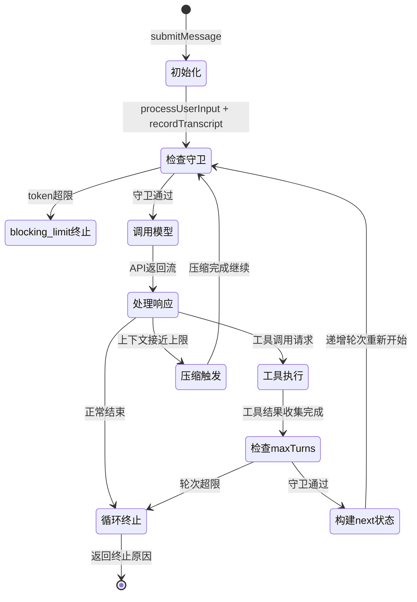
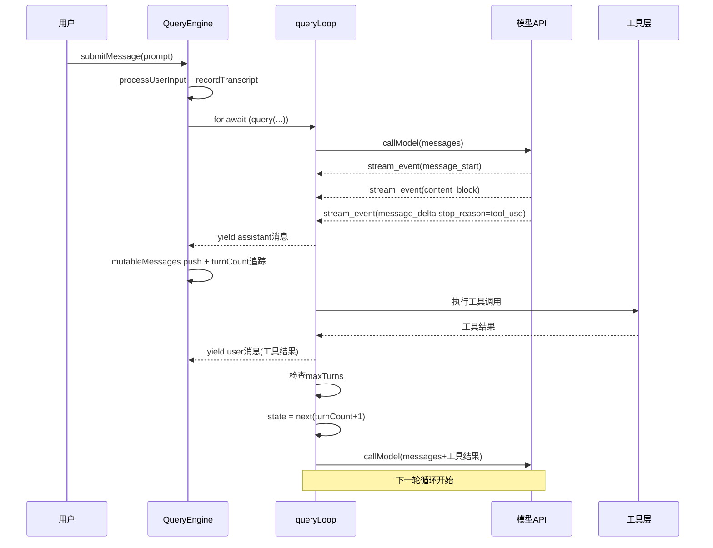

# 第 3 章：永不停歇的循环

> "循环不是重复，是收敛。每一轮都在向目标靠近一步——或者向终止条件靠近一步。"

每个用户消息都触发一个状态机。它可能循环一轮，也可能循环数十轮——每轮完成一次"调用模型→执行工具→收集结果"的完整迭代，然后重新开始。驱动这个状态机的不是用户指令，而是 Harness 对"模型在什么条件下会失控"的工程预判。读完本章，你将理解 `QueryEngine` 如何管理一个会话的完整生命周期，以及三层守卫如何决定循环何时继续、何时压缩、何时终止。

## 问题——用户消息之后发生了什么

大多数开发者假设 AI 对话是"发一条收一条"——发送用户消息，收到助手回复，交互结束。Claude Code 的实际行为颠覆了这个假设。

一个用户消息"帮我重构这个函数"可能触发以下序列：读取文件→分析代码→提出方案→等待用户确认→修改文件→运行测试→修复测试错误→再次运行测试→确认通过。这不是一次 API 调用，而是 8 次或更多次。每次调用的结果都影响下一次调用的输入，消息历史在循环中持续积累。

`QueryEngine` 是这个序列的载体。它是一个有状态的会话级对象——构造一次，跨越整个会话的所有轮次持久存在。`mutableMessages` 字段积累了会话中所有消息，每次 `submitMessage` 调用向其追加新的消息并启动新一轮循环。

这与无状态管道模型的区别是根本性的：

| | 管道模型 | 状态机模型（QueryEngine） |
|---|---------|------------------------|
| 状态 | 每次调用独立，无跨调用状态 | mutableMessages 跨轮次积累 |
| 控制流 | 线性：输入→处理→输出 | 循环：工具调用触发下一轮 |
| 终止 | 调用完成即结束 | 由三层守卫决定何时终止 |
| 失败处理 | 调用失败即错误 | 可以重试、压缩、优雅降级 |

**原则 3.1：会话即状态** — Agent 对话不是无状态的管道，而是有状态的状态机。消息历史、轮次计数、压缩边界——这些状态决定了模型在每一轮能"看到"什么、能"做"什么。

## 黄金法则——Harness 循环的三层守卫

无限制的循环是 Agent 最危险的失败模式。模型可以永远"再试一次"——每次工具调用失败都触发下一次尝试，每次尝试都消耗更多 token 和费用，最终耗尽预算或上下文窗口。

`QueryEngine` 用三层守卫防止这种失控：

**第一层：轮次上限（maxTurns）**

maxTurns 是最直接的硬终止条件。每完成一轮工具调用循环，`turnCount` 递增 1。当 `nextTurnCount > maxTurns` 时，循环向调用方 yield 一条 `max_turns_reached` 消息，然后立即返回，终止原因为 `'max_turns'`。

关键细节在于这个检查的位置——它在工具结果收集完成、下一轮循环开始之前执行。这意味着最后一轮的工具结果会被处理，但不会触发新的 API 调用。用户看到的是完整的工具执行结果，而非被截断的中间状态。

**第二层：费用上限（maxBudgetUsd）**

maxBudgetUsd 将 token 消耗转换为费用约束，适用于企业客户和 SDK 调用场景。与 maxTurns 不同，这个守卫在每轮 API 响应后检查累计费用，而非在轮次边界。它编码了一个业务判断：**宁可让任务未完成，也不要超出预算限制。**

**第三层：上下文阻塞（blocking_limit）**

blocking_limit 是三层守卫中最复杂的一层。当上下文窗口中的 token 数接近模型最大值时，继续循环会导致 API 返回 `invalid_request` 错误——这是无法恢复的失败。blocking_limit 检查在每轮循环开始时执行，在 API 调用之前。如果触发，立即返回，原因为 `'blocking_limit'`。

复杂之处在于这个检查有 5 个跳过条件：压缩刚完成时跳过（避免使用过时的 token 计数）、`compact` 和 `session_memory` 来源的查询跳过（这些查询本身在执行压缩，阻塞它们会造成死锁）、reactive compact 开启时跳过（由另一个机制接管），以及 context collapse 开启且自动压缩允许时跳过。这 5 个条件共同防止了守卫在不该触发时误触发。

**三层守卫对比**：

| 守卫 | 触发时机 | 编码的假设 | 适用场景 |
|------|---------|-----------|---------|
| maxTurns | 轮次边界 | 模型可能陷入无效循环 | SDK 调用、批处理任务 |
| maxBudgetUsd | API 响应后 | 费用必须有上限 | 企业客户、受控环境 |
| blocking_limit | 轮次开始前 | 超出上下文窗口无法恢复 | 所有会话 |

**原则 3.2：多层守卫，各司其职** — 不要用单一的超时或错误处理替代多层终止守卫。每层守卫针对不同的失控场景，缺少任何一层都会留下失控漏洞。

## 适用场景——谁需要会话级状态机

如果你的 Agent 只做一轮 API 调用——发送消息，接收回复，结束——你不需要 QueryEngine 这样的循环管理。但任何需要"调用工具→看结果→决定下一步"的 Agent 都面临循环管理的问题。

`ask` 函数是 `QueryEngine` 面向外部的接口，它的参数列表是 Anthropic 对"哪些维度需要可配置"的完整回答：`maxTurns`（轮次上限）、`maxBudgetUsd`（费用上限）、`taskBudget`（任务预算）、`tools`（可用工具集）、`canUseTool`（动态权限检查）、`abortController`（外部中断）、`thinkingConfig`（思考模式）、`customSystemPrompt`（自定义系统提示）……超过 25 个参数。

这张参数列表回答了"什么需要由 Harness 控制"：循环的边界条件、工具的权限控制、状态的持久化方式、中断的触发机制。**模型控制循环内的决策（调用哪个工具、如何使用工具结果），Harness 控制循环本身的边界。**

谁需要这种设计？

- 代码编辑 Agent——需要多轮工具调用（读文件、分析、修改、验证）
- 研究 Agent——需要迭代搜索和综合（搜索→读取→提炼→再搜索）
- 任务执行 Agent——需要分解→执行→验证的循环

如果你的 Agent 超过 3 轮才能完成任务，你就需要认真设计循环的守卫机制——而不只是让它"一直跑直到完成"。

## 工作原理——queryLoop 的完整生命周期

`queryLoop` 是 Claude Code 的心脏。它的结构出奇简洁：一个 `while (true)` 无限循环，一个 `State` 对象携带跨迭代状态，每轮迭代结束时用 `state = next` 更新状态并继续。

**图 3-1：QueryEngine 循环状态机**

循环的每次迭代经过以下步骤：

**步骤一：解构当前状态**

每次 `while (true)` 循环开始时，首先解构 `state` 对象，取出 `messages`、`toolUseContext`、`turnCount`、`autoCompactTracking` 等字段。这个设计让每轮迭代都从一个干净的状态快照开始——没有散乱的可变变量，只有 `state` 对象。

**步骤二：检查终止条件**

解构之后，循环依次检查：自动压缩条件（如果上下文窗口已接近上限，触发压缩后 continue 到下一轮）、blocking_limit（如果确实超限且无法压缩，终止）。

**步骤三：调用模型 API**

通过 `deps.callModel` 发起流式 API 调用，返回一个异步生成器。循环用 `for await` 消费每条流式消息：`message_start`（重置当前消息的 token 计数）、`content_block_start/delta/stop`（收集内容块）、`message_delta`（捕获 stop_reason 和最终 token 用量）、`message_stop`（标记消息结束）。

**步骤四：执行工具调用**

如果助手消息的 stop_reason 是 `tool_use`，循环收集所有工具调用，并发执行只读安全的工具，串行执行其他工具（详见第 7 章）。工具结果作为 user 消息追加到消息列表。

**步骤五：构建 next 状态，继续循环**

工具结果收集完成后，检查 maxTurns。如果未超限，构建新的 `State` 对象 `next`：更新消息列表（包含本轮的 assistant 消息和工具结果）、递增 `turnCount`、重置 `hasAttemptedReactiveCompact` 等临时状态。然后 `state = next`，`while (true)` 进入下一轮。

`taskBudgetRemaining` 是一个特殊的循环局部变量——它不在 `State` 对象中，而是独立声明在循环外。注释解释了原因：State 对象有 7 个 continue 点，如果把 taskBudgetRemaining 加入 State，就需要在 7 处同时更新，极易遗漏。循环局部变量只需在一处维护，以代码复杂度换取正确性。

**图 3-2：一轮循环的消息流**

## 权衡——循环设计中的工程选择

`queryLoop` 的每个设计决策都在可靠性和复杂度之间做权衡。三个关键权衡尤其值得关注。

**权衡一：transcript 即时写入 vs 延迟写入**

用户消息在进入 query 循环之前就写入 transcript（磁盘持久化）。注释解释了为什么：如果进程在 API 响应之前被杀死（比如用户点击停止），`for await` 循环还没有 yield 任何 assistant 消息，transcript 里只有队列操作记录——`--resume` 时无法找到对话，恢复失败。

提前写入确保了"用户消息已被接受"这个事实在任何情况下都不会丢失，即使从未收到 API 响应。

代价是 ~4ms（SSD）到 ~30ms（磁盘竞争时）的额外延迟。在 `--bare` 模式下，这个写入改为 fire-and-forget——脚本调用不需要 resume，不值得为此阻塞。**同一个操作，交互模式下是安全优先，脚本模式下是性能优先。**

**权衡二：7 个 continue 点 vs 中央化状态更新**

queryLoop 有 7 个 continue 点——每个都代表一种"本轮循环结束，重新开始"的场景（压缩完成、工具结果收集完成、各类错误恢复等）。每个 continue 点都必须正确设置 `state = next`，否则状态就会损坏。

为什么不把这 7 个 continue 点合并为一个中央化的状态更新？因为每种场景更新的字段不同——压缩完成后需要更新 `autoCompactTracking`，工具执行完成后需要更新消息列表和 toolUseContext，错误恢复后需要更新 `maxOutputTokensRecoveryCount`。强行中央化会引入大量条件分支，反而更难维护。

这个权衡的结果是：复杂度被分散到 7 处，但每处的逻辑是局部的、内聚的。`taskBudgetRemaining` 不加入 State 的决定，正是为了避免让这 7 处更新更加复杂。

**权衡三：blocking_limit 的 5 个跳过条件 vs 简单硬终止**

blocking_limit 检查如果是简单的"token 超限就终止"，代码会非常简洁。但 5 个跳过条件是必要的：

| 跳过条件 | 不跳过会发生什么 |
|---------|----------------|
| 压缩刚完成 | 使用过时 token 计数，误触发 blocking_limit |
| compact/session_memory 查询 | 死锁：压缩 Agent 无法运行，上下文无法减少 |
| reactive compact 开启 | 抢占合法的压缩路径，无法恢复 |
| context collapse 开启且自动压缩允许 | 同上，两种压缩机制互相干扰 |

**原则 3.3：守卫的豁免比守卫本身更重要** — 错误的终止比不终止危害更大。终止守卫必须精确——知道"什么时候不该终止"和知道"什么时候该终止"同样重要。

## 踩坑指南——循环设计中的陷阱

Claude Code 源码注释揭示了几个真实踩过的坑，值得在设计自己的循环时警惕。

**陷阱一：只在正常路径检查 maxTurns**

abort 路径（用户中断工具执行）也需要检查 maxTurns。在工具执行被中断时，代码依然检查 `nextTurnCountOnAbort > maxTurns`，如果超限同样 yield `max_turns_reached`。注释明确写道："Check maxTurns before returning when aborted"。

如果只在正常路径检查，用户可以通过频繁中断来绕过轮次限制——每次中断重新开始，但轮次计数不清零。

**陷阱二：延迟写入 transcript**

上文已提到：延迟写入导致进程被杀后无法 resume。这不是假设场景——用户在编辑器中点击"停止"或网络超时都会触发。transcript 的写入时机决定了 resume 功能的可靠性上限。

**陷阱三：在多个 continue 点各自维护状态**

如果你有多个循环出口（多个 continue/break），每个出口都需要更新的状态字段越多，出错的概率越高。Claude Code 的解决方案是将所有跨迭代状态收入 `State` 对象，每个 continue 点显式构建完整的 `State`。这让状态更新变得可见、可检查，而不是散落在循环体各处的可变变量。

## 实证——从源码追踪一轮完整循环

让我们追踪一个用户消息从进入 `QueryEngine` 到触发下一轮循环的完整路径，验证状态机模型的准确性。

`submitMessage` 的入口（`src/QueryEngine.ts:209`）首先调用 `processUserInput` 处理用户输入，然后将 `messagesFromUserInput` push 到 `mutableMessages`（`src/QueryEngine.ts:430`）。关键步骤随即发生：在进入 `query` 循环的 `for await` 之前，将消息写入 transcript（`src/QueryEngine.ts:438-449`）——注释用三段话解释了这个"提前写入"的必要性：进程被杀、队列操作记录、`--resume` 失败。

`for await` 循环（`src/QueryEngine.ts:675`）消费 `query()` 生成器的每条消息。当消息类型为 `assistant` 时，push 到 `mutableMessages`，同时追踪 `stop_reason`（`src/QueryEngine.ts:762-769`）。当类型为 `user`（工具结果）时，同样 push 到 `mutableMessages`（`src/QueryEngine.ts:783-786`）。stream_event 消息负责携带实时 token 用量——`message_start` 重置计数，`message_delta` 更新用量并捕获 stop_reason（`src/QueryEngine.ts:791-807`）。

在 `queryLoop` 的循环尾部（`src/query.ts:1679-1729`），工具结果收集完成后，计算 `nextTurnCount = turnCount + 1`，检查 `maxTurns`，然后构建 `next` State 对象，将本轮所有消息（`messagesForQuery + assistantMessages + toolResults`）合并为下一轮的输入，`state = next`，`while (true)` 进入新一轮。

这条路径验证了三件事：mutableMessages 在 `QueryEngine` 层积累所有消息（包括工具结果），queryLoop 在每轮结束时通过 `state = next` 传递状态，终止检查发生在"下一轮是否应该开始"的决策点，而非循环入口。

## 本章主成分：会话级状态机

**本质**：一个由三层守卫（maxTurns/maxBudgetUsd/blocking_limit）保护的 `while(true)` 状态机，每轮迭代完成一次"API 调用→工具执行→结果收集"，通过 `state = next` 传递跨迭代状态。

**关键机制**：
- `mutableMessages` 在 `QueryEngine` 层跨轮次积累，提供完整的消息历史
- `turnCount` 随每轮工具调用递增，是轮次守卫的计数基础
- transcript 在 query 循环前写入，确保进程被杀后 resume 可用
- `State` 对象集中管理 7 个 continue 点的跨迭代状态

**适用边界**：
- ✓ 适合：需要多轮工具调用的 Agent 系统
- ✓ 适合：需要 resume 恢复能力的长会话
- ✗ 不适合：单轮问答，无需循环管理开销
- ✗ 不适合：无状态 API 封装

**与其他模式的关系**：
- 启动层为 QueryEngine 准备运行环境（详见第 2 章）
- 单轮执行的完整流水线是每次迭代的内部细节（详见第 4 章）
- 压缩策略是循环的内存管理机制，与 blocking_limit 守卫协作（详见第 11 章）

## 你能做什么

- **审视你的 Agent 循环是否有至少三层终止守卫**。轮次上限、费用上限、上下文阻塞——缺少任何一层都会留下失控漏洞。
- **在所有路径检查终止条件**，包括 abort、超时、错误恢复路径。"正常路径有守卫"不等于"所有路径有守卫"。
- **在循环关键点前持久化状态**。用户消息被接受这个事实，应该在 API 调用之前写入磁盘——不要等 API 响应。
- **用 State 对象模式替代散乱的状态变量**。如果你的循环有多个 continue/break 点，用一个显式的状态对象让每个出口的状态更新变得可见。
- **为 blocking_limit 设计跳过条件**，而不是简单的硬终止。在执行压缩期间触发 blocking_limit 会造成死锁——守卫必须知道何时不该触发。
- **区分交互模式和脚本模式的 I/O 策略**。transcript 写入在交互模式下阻塞（安全优先），在脚本模式下 fire-and-forget（性能优先）。根据你的使用场景做同样的区分。
- **用 `turnCount` 追踪调试信息**。当 Agent 行为异常时，"它循环了多少轮"是最有价值的第一诊断信息。

---

**下一章导读**：本章看到了循环的全貌，但每次迭代内部发生了什么？第 4 章将进入单轮执行的流水线——从提示词的分段构建，到流式 API 调用，到工具并发执行，到上下文窗口保护。这条流水线的每个节点都有独立的设计决策，共同决定了一轮调用的延迟、质量和安全性。
