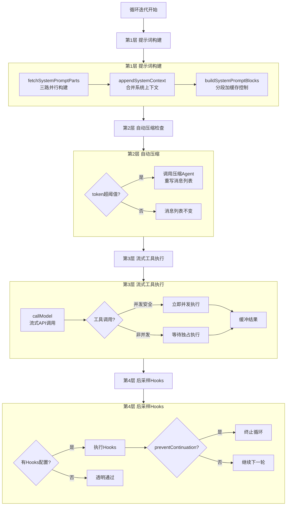
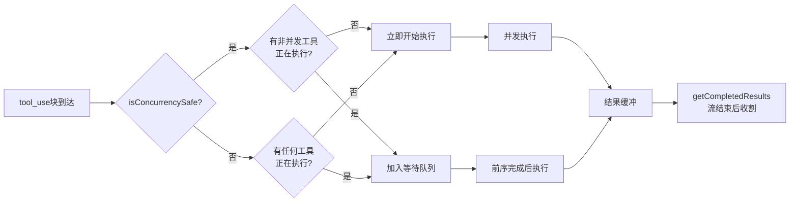

# 第 4 章：单轮执行的艺术

> "控制不是枷锁，是信任。每一道关卡都在说：'我相信你能完成任务，但我要确保你不会跑偏。'"

一次 API 调用在 Harness 眼里不是"发出去、等回来"。在消息离开进程之前，Harness 完成了提示词的分段缓存组装；在流式响应到达时，Harness 实时调度工具的并发执行；在流结束之后，Harness 触发后采样 Hooks 决定是否允许循环继续。四道关卡，每一道都编码了 Anthropic 对"模型什么时候会失控"的具体预判。读完本章，你将理解这四道关卡如何组成一条串行控制流水线，以及每道关卡的介入条件和权衡逻辑。

## 问题——一次 API 调用经历了什么

大多数 Agent 框架把 API 调用抽象为一个黑盒：构建消息列表，调用 API，处理返回结果。Claude Code 拒绝这个抽象。

在 `query.ts` 的循环体中，从消息列表准备好到 API 调用返回，中间经过了密度极高的控制逻辑。这些逻辑可以归纳为 4 层串行控制：

| 层次 | 触发时机 | 核心操作 | 失败时行为 |
|------|---------|---------|-----------|
| 第 1 层：提示词构建 | API 调用前 | 三路并行组装→分段→加缓存控制 | 拒绝调用 |
| 第 2 层：自动压缩检查 | API 调用前 | 检查 token 上限→按需压缩消息列表 | 替换消息列表后继续 |
| 第 3 层：流式工具分区执行 | API 响应流中 | 并发/独占分区→实时执行工具→缓冲结果 | 丢弃旧执行器重试 |
| 第 4 层：后采样 Hooks | 流结束后 | 触发外部 Hooks→判断是否允许循环继续 | 强制终止循环 |

每一层都有明确的输入和输出，层与层之间严格串行——前层未通过，后层不执行。这条流水线在每次工具调用循环的每一轮中都会完整执行一遍。

**原则 4.1：控制流水线** — 对每次 API 调用施加的控制**必须**是分层的、串行的、可审计的。每层**必须**有明确的职责边界，层间**禁止**跨层直接通信，只通过输出状态传递控制权。

## 黄金法则——最小介入，精确控制

4 层控制听起来很重，实际上每一层的介入条件都经过精心设计——只在必要时才触发。

**第 1 层介入条件**：永远触发，但代价极低。提示词的三个组成部分（defaultSystemPrompt、userContext、systemContext）在每次 API 调用前并行构建，结果被合并并追加到系统提示词末尾。分段缓存控制只在模型支持时附加——`getPromptCachingEnabled` 检查全局禁用标志、模型级禁用标志，任一为真则跳过缓存。

**第 2 层介入条件**：只在上下文窗口接近上限时触发。如果 token 计数低于自动压缩阈值，这一层是透明的——消息列表原封不动进入第 3 层。只有当计数超过阈值时，自动压缩才介入，调用压缩 Agent 重写消息列表（详见第 11 章）。

**第 3 层介入条件**：只在助手消息包含工具调用（`stop_reason = tool_use`）时触发。纯文本回复完全跳过 `StreamingToolExecutor`。工具调用到达时，执行器判断是否可以立即开始——并发安全的工具可以与其他并发安全工具同时执行，非并发工具必须等待所有进行中的工具完成。

**第 4 层介入条件**：只在配置了后采样 Hooks 时触发。如果没有配置，`handleStopHooks` 是一个空操作，零开销。配置后，Hooks 可以执行外部命令、HTTP 请求或提示词注入，并决定是否允许循环继续。

**原则 4.2：介入条件决定控制成本** — 每个控制层**必须**有精确的介入条件，在条件不满足时**禁止**主动干预，确保控制成本不取决于层数，而取决于实际触发频率。

## 适用场景——哪些系统需要 4 层控制

4 层控制不是"所有 Agent 都应该复制的架构"，而是针对特定场景设计的解决方案。

**第 1 层（提示词构建）**：所有调用 LLM 的系统都需要。提示词构建是最基础的 Harness 职责——它决定模型"看到"什么。如果你的提示词是硬编码的字符串，你已经在做第 1 层，只是没有结构化。

**第 2 层（自动压缩）**：所有可能产生长对话的 Agent 需要考虑。单次问答不需要；超过 10 轮的任务型 Agent 迟早需要面对上下文窗口限制的问题（详见第 11 章）。

**第 3 层（流式工具分区）**：需要同时执行多个工具的 Agent。如果你的 Agent 每次只调用一个工具，顺序执行已经足够。一旦你的任务适合并发（比如同时搜索多个数据源），工具分区带来的延迟收益就变得显著。

**第 4 层（后采样 Hooks）**：需要外部审计、安全检查或工作流集成的企业级系统。后采样 Hooks 是 Harness 向外部世界开放的唯一扩展点——它让你可以在不修改核心循环的情况下插入自定义逻辑（详见第 10 章）。

## 工作原理——4 层控制的完整流水线

**图 4-1：单轮执行 4 层控制流水线**

**第 1 层：提示词构建**

提示词的三个组成部分使用 `Promise.all` 并行获取——`defaultSystemPrompt`（工具定义和系统指令）、`userContext`（Claude.md 内容和日期）、`systemContext`（Git 状态和缓存破坏标记）三路同时请求，再合并。这三部分各自有独立的缓存策略，memoized 版本在会话内不变，重复调用直接命中内存缓存。

合并后，`appendSystemContext` 将 systemContext 追加到系统提示词末尾，产生 `fullSystemPrompt`。随后 `buildSystemPromptBlocks` 将系统提示词按缓存范围（cacheScope）分段，每段独立附加 `cache_control` 标记。分段策略遵循一条硬约束：最多 4 个缓存块——这是 API 的硬限制，超过会立即返回 400 错误。

**第 2 层：自动压缩检查**

在 API 调用前，循环检查当前消息列表的 token 估算值是否超过自动压缩阈值。如果触发，`autocompact` 调用一个独立的压缩 Agent，将完整对话历史压缩为摘要，返回一个更短的消息列表替换原列表。压缩完成后，循环从检查守卫重新开始（而非直接进入 API 调用），确保压缩结果有效。

**第 3 层：流式工具分区执行**

这是 4 层中最精妙的设计。`StreamingToolExecutor` 在流式响应开始前初始化，流式传输期间实时检测每个 `tool_use` 内容块的到达，并立即决定执行策略。

**图 4-2：StreamingToolExecutor 工具调度策略**

注释对并发策略有精确描述：并发安全工具可以与其他并发安全工具并行执行，非并发工具需要独占访问。这保证了只读工具（文件读取、代码搜索）可以并发，而写操作工具（文件编辑、命令执行）串行执行。

流式响应结束时，`getCompletedResults` 收割所有已完成的工具结果，合并为 user 消息追加到消息列表。这条消息成为下一轮循环的输入。

如果 API 流中途失败触发流式回退（streaming fallback），`discard()` 方法立即将当前执行器标记为废弃——所有排队中的工具不再启动，进行中的工具收到合成错误。然后创建新的执行器重试，避免旧执行器的孤立 tool_result 污染新一轮的消息历史。

**第 4 层：后采样 Hooks**

流式传输完全结束、所有工具结果收集完毕后，`handleStopHooks` 触发。Hooks 收到完整的当前轮次上下文，可以执行三类操作：外部命令（shell 脚本）、HTTP 请求（外部服务）、提示词注入（向下一轮注入额外指令）。

Hooks 执行完成后，返回 `preventContinuation` 标志。如果为 `true`，循环立即返回，终止原因为 `'stop_hook_prevented'`，不再进入下一轮——无论模型是否还有工具要调用。

## 权衡——流水线设计中的 3 个关键选择

**权衡一：Prompt Cache 分段上限（4 块）**

API 允许最多 4 个带 `cache_control` 的文本块。Claude Code 的分段策略优先保护命中率最高的块：系统提示词的"全局"部分（工具定义、系统指令）使用 `cacheScope: 'global'`，几乎所有会话共享，命中率最高（推断）；用户上下文和动态内容放在后面，按需缓存。

注释「不得再添加更多缓存控制块，否则会触发 400 错误（原文："IMPORTANT: Do not add any more blocks for caching or you will get a 400"）」是一条踩坑记录——这个上限不是软警告，是 API 硬拒绝。分段策略必须在设计阶段就固定，而不是在运行时动态增减。

**权衡二：流式工具并发 vs 顺序执行**

顺序执行更简单——等第一个工具完成，再发第二个。并发执行更快，但需要管理执行状态、缓冲结果、处理部分失败。`StreamingToolExecutor` 选择了精确的中间路径：**按并发安全性分区**，而非全并发或全顺序。

这个选择的代价是 `StreamingToolExecutor` 本身的复杂度——它需要维护工具队列、执行状态跟踪、discard 机制、结果缓冲四套逻辑。好处是：只读工具（通常占绝大多数）（推断）全部并发，总执行时间接近最慢单个工具的时间，而非所有工具时间之和。

| 策略 | 延迟 | 实现复杂度 | 安全性 |
|------|------|-----------|-------|
| 全顺序执行 | 最高（时间累加） | 最低 | 最高 |
| 全并发执行 | 最低 | 中等 | 有风险（写操作竞争） |
| 按并发安全性分区 | 接近最低 | 最高 | 高（写操作隔离） |

**权衡三：后采样 Hooks 的强制终止能力**

`preventContinuation` 是一把双刃剑。它让外部系统可以终止任何循环——合规检查、安全审计、预算控制都可以通过 Hook 实现。但一旦配置错误，所有请求都会被终止，Agent 彻底失去工具调用能力，而错误原因藏在 Hooks 执行日志中，不易排查。

Claude Code 的设计选择是：第 4 层默认不存在（无 Hooks 配置时是空操作），强制终止能力需要显式激活。这遵循了第 1 章介绍的 fail-closed 原则的另一面——**扩展点默认关闭，需要显式开启。**

## 踩坑指南——流水线中的工程陷阱

**陷阱一：缓存分段超过 4 块导致 400**

系统提示词构建函数中的"IMPORTANT"注释（原文："IMPORTANT: Do not add any more blocks for caching or you will get a 400"，译：不得再添加更多缓存控制块，否则会触发 400 错误）不是礼貌提示，是血泪教训。Anthropic API 对带缓存控制的文本块有硬上限，超过立即返回 400 错误。这类错误不会出现在 API 错误消息中（它只说 "invalid_request"），需要在请求体中检查 `cache_control` 块的数量。

❌ 错误做法：在系统提示词中动态追加 `cache_control` 块，以为可以按需扩展。  
✓ 正确做法：在设计阶段固定分段策略，确保带缓存控制的文本块总数 ≤ 4。测试时验证所有代码路径下的分段计数。

**陷阱二：工具错误声明为并发安全**

一个工具声明了 `isConcurrencySafe: true` 但实际上会修改共享状态——这不会在单工具测试中暴露，只在多工具并发调用时出现竞争条件。症状是随机的数据损坏或不一致的文件状态，极难复现。

❌ 错误做法：为了追求并发性能，对未经严格审查的写操作工具声明 `isConcurrencySafe: true`。  
✓ 正确做法：保守默认（`TOOL_DEFAULTS` 中 `isConcurrencySafe` 默认 `false`，如第 1 章所述），只对经过严格审查的纯只读工具显式开启并发。

**陷阱三：流式回退不调用 discard()**

当 API 流中途失败需要重试时，如果忘记调用 `discard()` 丢弃旧的 `StreamingToolExecutor`，旧执行器中已开始执行的工具会产生 tool_result 消息，但对应的 tool_use 消息在重试时被替换了——API 在收到孤立的 tool_result 时会返回 "tool_result without matching tool_use" 错误。

❌ 错误做法：流式重试时复用旧的 `StreamingToolExecutor` 实例，或忽略 `discard()` 调用。  
✓ 正确做法：在任何触发流式重试的路径上，先调用旧执行器的 `discard()` 标记废弃，再创建新执行器，确保 tool_use 与 tool_result 的对应关系在重试后保持一致。

## 实证——从源码追踪一次完整的单轮执行

一次单轮执行的完整路径可以通过 `queryCheckpoint` 调用串联起来。

第 1 层从 `fetchSystemPromptParts` 三路并行返回后开始（`src/utils/queryContext.ts:44`），`fullSystemPrompt` 在 `query.ts` 的组装步骤完成后确定（`src/query.ts:449`）。此时提示词已经是最终形态，包含分段缓存控制标记。

第 2 层紧随其后——`autocompact` 函数检查当前消息列表的 token 估算（`src/query.ts:454`），如果触发压缩，整个消息列表被替换后从检查守卫重新开始，否则直接穿透到第 3 层。

第 3 层从 `query_api_streaming_start` 打点后开始（`src/query.ts:658`），`callModel` 发起流式请求，`StreamingToolExecutor` 在请求前已初始化，开始实时处理流中的内容块。流结束时，`streamingToolExecutor.getCompletedResults()` 收割所有已完成工具的结果（`src/query.ts:851`），合并为工具结果列表。

第 4 层在流式结束后触发（`src/query.ts:1267`），`handleStopHooks` 接收当前会话上下文，执行配置的 Hooks，返回 `stopHookResult`。如果 `stopHookResult.preventContinuation` 为真（`src/query.ts:1278`），循环立即返回，单轮执行在此终止而非进入下一轮。

这条追踪路径验证了一个核心观察：4 层控制确实是严格串行的——每层的 checkpoint 打点之间没有交叉，层与层的边界清晰可测。

## 本章主成分：4 层串行控制流水线

**本质**：一条 4 层串行控制流水线，每层精确地只在必要时介入，共同保护上下文窗口不超限、工具调用不越界、循环不失控。

**关键机制**：
- 提示词三路并行构建后串行分段，最多 4 个缓存块
- `StreamingToolExecutor` 按并发安全性实时分区调度工具执行
- 后采样 Hooks 是循环外部世界唯一的扩展点，可强制终止

**适用边界**：
- ✓ 适合：需要工具调用、缓存优化、外部审计的 Agent 系统
- ✓ 适合：多工具并发执行场景
- ✗ 不适合：简单单轮问答（第 1 层足够）
- ✗ 不适合：无状态函数式调用（4 层控制面向有状态会话）

**与其他模式的关系**：
- 单轮执行是 QueryEngine 循环（第 3 章）的每轮迭代内部
- 提示词构建是第 5 章（系统提示词分层缓存）的执行层
- 工具分区执行是第 7 章（工具编排）的运行时实现
- 后采样 Hooks 是第 10 章（Hooks 系统）的执行入口

## 你能做什么

- **审视你的 Agent 每次 API 调用是否经过提示词最终组装层**。硬编码的提示词字符串无法享受分段缓存，也无法动态注入系统上下文——这是第 1 层控制最直接的价值。
- **检查你的提示词缓存分段数量是否超过 API 上限**。如果你使用 Anthropic API 的 `cache_control`，上限是 4 个带缓存标记的文本块。超过会触发 400 错误，而错误消息不会告诉你原因。
- **为你的工具建立并发安全分类**，并在工具定义中显式声明。默认保守（不声明为并发安全），只对经过审查的只读工具开放并发。
- **为你的流式工具执行添加 discard 机制**。任何需要重试的流式调用，都应该在重试前清理旧的执行状态，防止孤立 tool_result 污染后续调用。
- **把后采样 Hooks 当作审计点而非控制点**。`preventContinuation` 很强大，也很危险——错误配置会静默地杀死所有循环。优先用 Hooks 收集数据，只在完全确定后才启用强制终止。
- **用 queryCheckpoint 式的时间线埋点定位延迟**。4 层控制中，第 2 层（压缩）是最大的延迟来源，第 3 层（工具执行）是最大的并发优化空间。埋点是找到优化方向的前提。
- **评估你的 Agent 需要哪几层**。不要为了架构完整性引入不需要的复杂度——只调用一个工具的 Agent 不需要 `StreamingToolExecutor`，没有审计需求的系统不需要后采样 Hooks。

---

**下一章导读**：本章看到了提示词构建的执行过程——三路并行、合并、分段加缓存控制。第 5 章将深入这条路径，展示系统提示词是如何通过分段缓存策略实现 Prompt Cache 最大化命中的，以及 Claude.md 记忆注入如何参与上下文构建。这是 Harness 最精妙的成本优化之一。
