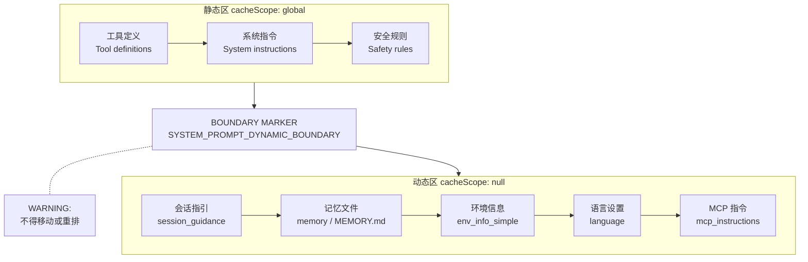
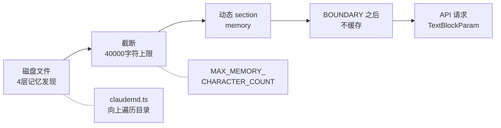

# 第 5 章：提示词的分层构建

> "一段提示词的价值不在于它说了什么，而在于下次调用时它是否还在缓存中。"

系统提示词不是一整块文本——它是 20 多个 section 拼成的数组，每个 section 有独立的缓存语义。这个"多此一举"的拆分不是代码组织的偏好，而是一条精确计算的成本原则：静态内容在前、动态内容在后，每一个分段边界都是一个缓存命中率的决策点。读完本章，你将理解 `SYSTEM_PROMPT_DYNAMIC_BOUNDARY` 这条分界线如何把系统提示词切成两个缓存世界，以及 MEMORY.md 的记忆注入为什么必须落在动态区。

## 问题——系统提示词为什么要拆成 20 多段

如果系统提示词在每次 API 调用时完全重建，Prompt Cache 命中率为零——每个 token 都要重新计费。一个典型会话中，系统提示词约占 40,000 个 token（推断）（包括工具定义、安全指令、环境信息、记忆内容等）。如果这些内容全部在缓存外，每轮调用的输入成本约为缓存命中的 2.5 倍（按 Anthropic API 定价，缓存命中的 token 单价约为未命中的 0.1 倍（推断））。

问题在于：系统提示词的某些部分在每次调用间不变（工具定义、系统指令），而某些部分每轮都可能变（用户上下文、MCP 工具列表、记忆文件）。如果把所有内容打包成一个字符串，缓存系统只能将整个字符串视为一个单元——任何一个字符变化，整个缓存失效。

Claude Code 的解决方案是 `SYSTEM_PROMPT_DYNAMIC_BOUNDARY`。源码注释（原文："Boundary marker separating static (cross-org cacheable) content from dynamic content. Everything BEFORE this marker in the system prompt array can use scope: 'global'. Everything AFTER contains user/session-specific content and should not be cached."，译：分界标记，分隔静态（可跨组织缓存的）内容与动态内容。此标记之前的所有内容可使用全局缓存作用域，之后的所有内容包含用户/会话专属信息，不应缓存）定义了一条硬分界线：

| 区域 | 位置 | 缓存语义 | 典型内容 |
|------|------|---------|---------|
| 静态区 | BOUNDARY 之前 | `cacheScope: 'global'` | 工具定义、系统指令、安全规则 |
| 动态区 | BOUNDARY 之后 | `cacheScope: null`（不缓存） | 记忆文件、环境信息、会话指引、MCP 指令 |

这条分界线的位置不是随意的。源码中有一条 WARNING 注释（原文："WARNING: Do not remove or reorder this marker without updating cache logic in: src/utils/api.ts (splitSysPromptPrefix), src/services/api/claude.ts (buildSystemPromptBlocks)"，译：不得移除或重新排列此标记，除非同步更新 `splitSysPromptPrefix` 和 `buildSystemPromptBlocks` 中的缓存逻辑）——任何对分界线位置的改动都会影响缓存分段的正确性。

**原则 5.1：缓存分段是成本结构的核心** — 系统提示词**必须**按变化频率分段，不变的内容使用全局缓存，可变的内容不缓存。分段边界**禁止**随意移动——每个边界位置都对应 API 缓存策略的精确计算。

## 黄金法则——静态在前、动态在后

Prompt Cache 的最大化命中率依赖一个简单原则：在同一会话内不变的内容**必须**始终出现在会话内可能变化的内容之前。

API 缓存不是自动的。Claude Code 在每次调用时通过 `splitSysPromptPrefix` 精确控制哪些块进缓存、用哪种缓存作用域。该函数的注释文档揭示了 4 种不同的缓存策略，每种对应一个场景：

| 模式 | 触发条件 | 缓存布局 | 块数 |
|------|---------|---------|------|
| MCP 工具存在 | `skipGlobalCacheForSystemPrompt = true` | 归属头（null）+ 前缀（org）+ 其余（org） | 3 块，全部 org 级 |
| 全局缓存 + 边界标记 | 1P 场景，边界标记存在 | 归属头（null）+ 前缀（null）+ 静态区（global）+ 动态区（null） | 4 块 |
| 默认模式 | 3P 提供商或边界缺失 | 归属头（null）+ 前缀（org）+ 其余（org） | 3 块，全部 org 级 |
| 缓存禁用 | 全局/模型级禁用 | 不分段，不附加 `cache_control` | 0 块 |

**原则 5.2：缓存作用域选择决定成本边界** — 全局缓存（global）**必须**只用于跨所有会话绝对不变的内容；组织级缓存（org）用于同一组织内不变的内容；动态内容**禁止**附加任何缓存控制。

为什么 MCP 工具存在时不能使用全局缓存？因为 MCP 服务器随时可能连接或断开——如果缓存了包含 MCP 工具指令的系统提示词，当 MCP 服务器断线后，模型仍然会尝试调用已经不存在的工具（"幽灵工具"问题）。所以在 MCP 工具存在时，整个系统提示词降级为 org 级缓存，牺牲命中率换取正确性（详见第 6 章）。

## 适用场景——哪些应用需要分段提示词

任何需要在 API 调用间复用大量相同系统提示词内容的应用，都应该考虑分段缓存策略。

**适合分段的场景**：会话内需要多轮调用的 Agent——每轮调用的系统提示词大部分相同，只有少量动态部分更新。典型例子是代码编辑 Agent，工具定义和安全规则在会话内不变，只有环境信息和记忆文件可能更新。

**不需要分段的场景**：单次调用就完成的任务（如一次性翻译、单轮问答）。这类场景没有缓存复用的机会，分段只会增加实现复杂度。

分段策略的前提是三路并行构建——系统提示词、用户上下文、系统上下文同时获取。`fetchSystemPromptParts` 通过 `Promise.all` 并行获取三个组成部分，各自独立缓存和更新。这种并行设计是分段策略的前提——如果三个部分串行构建，任何一个部分的延迟都会阻塞整条提示词管道。

| 应用特征 | 是否需要分段 | 理由 |
|---------|------------|------|
| 多轮对话 Agent，工具定义固定 | ✓ | 大量可缓存内容，分段后命中率显著提升 |
| MCP 工具动态变化的 Agent | ✓ | 分段后静态区仍可缓存，动态区正确降级 |
| 单轮问答服务 | ✗ | 无缓存复用机会 |
| 无状态函数式调用 | ✗ | 每次调用独立，无跨调用状态 |

## 工作原理——提示词构建的完整管道

系统提示词从原始 section 数组到 API 请求的最终分块，经过 5 步管道。每一步都有明确的输入输出和设计意图。

**图 5-1：系统提示词分层结构**

**步骤 1：section 数组构建**。`getSystemPrompt` 异步构建 20 多个 section，按静态/动态分区排列。静态区包含工具定义、系统指令、安全规则等固定内容。到达 `SYSTEM_PROMPT_DYNAMIC_BOUNDARY` 后，进入动态区——`systemPromptSection('memory', () => loadMemoryPrompt())` 将 MEMORY.md 的内容作为一个动态 section 注入。

**步骤 2：优先级决策**。`buildEffectiveSystemPrompt` 在 5 个级别中选择提示词基础：override（强制覆盖）→ coordinator（协调器模式）→ agent（Agent 模式）→ custom（用户自定义）→ default（默认完整版）。这个决策决定了系统提示词的"骨架"——不同模式下，section 数组的内容和长度不同。

**步骤 3：三路并行补充**。`fetchSystemPromptParts` 通过 `Promise.all` 并行获取三个组成部分：`getSystemPrompt`（系统提示词本体）、`getUserContext`（Claude.md 和日期信息）、`getSystemContext`（Git 状态和缓存破坏标记）。三路的结果在 `src/query.ts` 中合并为 `fullSystemPrompt`（详见第 4 章）。

**步骤 4：缓存语义分块**。`splitSysPromptPrefix` 按缓存语义将系统提示词数组分块。全局缓存模式下，它沿 `SYSTEM_PROMPT_DYNAMIC_BOUNDARY` 分割——边界之前的静态内容获得 `cacheScope: 'global'`，边界之后的动态内容 `cacheScope: null`。MCP 工具存在时，跳过全局缓存，全部降级为 org 级。

**步骤 5：添加 cache_control 字段**。`buildSystemPromptBlocks` 将每个分块转换为 API 的 `TextBlockParam` 格式，对 `cacheScope` 不为 null 的块附加 `cache_control` 字段。源码注释（原文："IMPORTANT: Do not add any more blocks for caching or you will get a 400"，译：不得再添加更多缓存控制块，否则会触发 400 错误）——这是 API 的硬上限，最多 4 个带 `cache_control` 的文本块。

记忆注入的位置值得特别注意。MEMORY.md 的内容通过 `systemPromptSection('memory', ...)` 注入到动态区——在 `SYSTEM_PROMPT_DYNAMIC_BOUNDARY` 之后。这个位置是刻意选择的：记忆文件每次 mount 可能不同（用户可能编辑了 MEMORY.md），如果放在静态区，任何记忆变化都会使全局缓存失效。牺牲这个局部缓存，换取整个静态区的缓存稳定性。

## 权衡——分段策略的 3 个代价

分段缓存策略在成本效率上有明显优势，但也引入了 3 个工程代价。

| 决策维度 | 选择 A（本系统） | 选择 B | 核心权衡 |
|---------|----------------|--------|---------|
| 缓存块数上限 | 最多 4 块，超出 400 报错 | 不限块数，自由分段 | API 硬约束限制了分段的精细度——必须合并某些动态内容 |
| MCP 指令缓存 | `DANGEROUS_` 前缀标记不缓存 | 所有 section 统一缓存 | 正确性优先——缓存 MCP 指令会导致幽灵工具调用 |
| 记忆文件大小 | 40,000 字符上限，超出截断 | 不限大小 | 超长记忆文件占用的缓存空间超过命中率收益 |

**代价一：缓存块数上限（4 块）**

API 允许最多 4 个带 `cache_control` 的文本块。Claude Code 的策略是把所有动态内容合并为最后 1 块（不附加 `cache_control`），静态区最多占 3 块。全局缓存模式下：归属头（null）+ 前缀（null）+ 静态区（global）+ 动态区（null）= 4 块，恰好达到上限。分段策略在设计阶段就必须固定——运行时动态增减会触发 400 错误。

**代价二：MCP 动态内容的特殊处理**

`DANGEROUS_uncachedSystemPromptSection` 是一个命名约定——`DANGEROUS_` 前缀标记那些绝对不能缓存的 section。MCP 工具指令使用这个标记，因为 MCP 服务器随时可能连接或断开。如果缓存了 MCP 指令，模型在服务器断线后仍会尝试调用已不存在的工具。`DANGEROUS_` 前缀是对开发者的警告：这里有一个你可能忽略的正确性风险。

**代价三：记忆文件大小上限（40,000 字符）**

`MAX_MEMORY_CHARACTER_COUNT = 40000` 是一个截断上限。超过此大小的记忆文件会被截断。这个限制不是随意的——超长记忆文件如果在每次调用中被完整注入动态区，会占用大量 token 预算，挤占工具调用和对话历史的空间。40,000 字符约等于 10,000 token（推断），对于一个典型会话的 200,000 token 上限来说，记忆文件最多占 5%。这是一个工程权衡——保留足够的记忆空间让 Agent 个性化，同时不至于让记忆挤占工作空间。

## 踩坑指南——提示词分段中的常见错误

**陷阱一：把动态内容放到静态区（缓存 bust）**

最常见也最隐蔽的错误。时间戳、用户 ID、会话 ID、随机 nonce——这些每轮都变的内容如果放在 `SYSTEM_PROMPT_DYNAMIC_BOUNDARY` 之前，整个静态区的缓存立即失效。症状是 `cache_read_input_tokens` 始终为零，但代码逻辑看起来完全正确。

❌ 错误做法：在系统提示词中嵌入当前时间或会话 ID，放在 BOUNDARY 之前，以为这些"很短不会影响缓存"。  
✓ 正确做法：所有每轮可能变化的内容**必须**放在 BOUNDARY 之后。如果不确定一个字段是否每轮变化，默认放在动态区。

源码中的 WARNING 注释明确列出了依赖这条分界线的两个函数——移动分界线时必须同步更新这些缓存逻辑。

**陷阱二：添加第 5 个 cache_control 块**

全局缓存模式下已经用了 4 块（归属头 + 前缀 + 静态区 + 动态区）。如果开发者新增一个 section 并给它附加 `cache_control`，第 5 个缓存块会立即触发 400 错误。更糟的是，这个错误不会告诉你"缓存块太多了"——它只说 `invalid_request`。

❌ 错误做法：新增 section 后给它附加 `cache_control`，忘记检查总块数。  
✓ 正确做法：新增 section 时，确认当前缓存布局。如果 4 块已满，新 section 必须合并到已有的某个块中，不能独立分块。

**陷阱三：对 MCP 工具使用全局缓存**

MCP 工具连接/断开是运行时事件。如果 MCP 指令被全局缓存，断线后的工具列表仍然留在缓存中——模型会尝试调用不存在的工具，返回错误，然后重试，形成循环。

❌ 错误做法：MCP 工具指令使用 `systemPromptSection` 而非 `DANGEROUS_uncachedSystemPromptSection`，导致 MCP 指令被缓存。  
✓ 正确做法：MCP 相关的 section 使用 `DANGEROUS_` 前缀标记，确保在任何缓存模式下都不被缓存。MCP 工具存在时，整个系统提示词降级为 org 级缓存。

## 实证——从 MEMORY.md 到 API 请求的完整路径

一个 MEMORY.md 文件从磁盘读取到最终出现在 API 请求中，经过了 4 次变换。这条路径揭示了记忆注入如何参与上下文构建。

**第一次变换：四层记忆发现**。`claudemd.ts`（`src/utils/claudemd.ts:1`）定义了四层记忆体系——Managed memory（全局系统级）、User memory（用户主目录）、Project memory（项目目录中的 CLAUDE.md 及 .claude/rules/*.md）、Local memory（CLAUDE.local.md）。文件发现过程从当前目录向上遍历到根目录，越靠近当前目录的文件优先级越高（后加载覆盖先加载）。

**第二次变换：大小截断**。发现的记忆文件内容合并后，如果超过 `MAX_MEMORY_CHARACTER_COUNT = 40000`（`src/utils/claudemd.ts:92`），超出部分被截断。这个截断发生在 section 构建之前——截断后的内容作为 `systemPromptSection('memory', ...)` 的返回值（`src/constants/prompts.ts:495`）。

**第三次变换：动态区注入**。记忆 section 位于 `SYSTEM_PROMPT_DYNAMIC_BOUNDARY` 之后，不附加 `cache_control`。这意味着记忆内容的变化不会影响静态区的缓存命中率——无论用户如何编辑 MEMORY.md，工具定义和安全规则的缓存始终有效。

**第四次变换：三路并行合并**。`fetchSystemPromptParts`（`src/utils/queryContext.ts:44`）中，`getUserContext` 负责处理 claudeMd 文件——它与 `getSystemPrompt` 和 `getSystemContext` 并行执行。合并后的完整系统提示词进入第 4 章描述的管道：`splitSysPromptPrefix` 分块 → `buildSystemPromptBlocks` 添加缓存控制 → API 调用。

**图 5-2：MEMORY.md 到 API 请求的路径**

这条路径验证了一个关键设计：记忆注入被刻意放在动态区，确保记忆的灵活性（随时编辑）不会破坏静态区（工具定义、系统指令）的缓存效果。这是"静态在前、动态在后"原则在记忆系统中的具体体现。

## 本章主成分：提示词分层构建

**本质**：把系统提示词按变化频率分段——不变的内容使用全局/组织级缓存，可变的内容不缓存。分段边界是成本决策点，不是代码组织偏好。

**关键机制**：
- `SYSTEM_PROMPT_DYNAMIC_BOUNDARY` 标记分界线，静态区前、动态区后
- `splitSysPromptPrefix` 按缓存语义分块，最多 4 块 `cache_control`
- `DANGEROUS_uncachedSystemPromptSection` 标记绝对不能缓存的动态内容
- MEMORY.md 注入动态区，`MAX_MEMORY_CHARACTER_COUNT = 40000` 截断上限
- `buildEffectiveSystemPrompt` 5 级优先级决策选择提示词骨架

**适用边界**：
- ✓ 适合：高频 API 调用的多轮 Agent（缓存命中率直接降低成本）
- ✓ 适合：MCP 工具动态变化的系统（正确降级策略）
- ✗ 不适合：单次调用的无状态服务（无缓存复用机会）
- ✗ 不适合：系统提示词极短（<1000 token）的场景（分段收益可忽略）

**与其他模式的关系**：
- 本章是第 4 章（单轮执行）提示词构建步骤的深入展开
- 第 6 章（按需加载的智慧）是动态内容管理的延伸——Skills 如何进一步减少动态区的体积
- 第 11 章（上下文的五把剪刀）涉及记忆文件在压缩中的处理

## 你能做什么

- **审视你的系统提示词，识别哪些内容在每次调用间不会变化**。工具定义、安全规则、系统指令通常是静态的——把它们提取出来，作为缓存区的基础。
- **把静态内容放在动态内容之前，添加 `cache_control` 边界**。确保 API 请求中的缓存块按变化频率排列——不变的最前，每轮变化的内容最后。
- **检查你是否超过了 API 的缓存块数上限**。Anthropic API 最多 4 个带 `cache_control` 的文本块。如果你使用其他 API 提供商，确认其缓存块限制。
- **对需要动态更新的工具列表，使用不缓存标记**。MCP 工具、动态加载的插件——任何可能在两次调用间变化的内容，都不应该被缓存，避免"幽灵工具"调用。
- **为你的记忆/上下文文件设置合理的大小上限**。Claude Code 使用 40,000 字符上限——超过会被截断。测量你的 Agent 记忆文件的平均大小和增长速度，设定一个不挤占工作空间的上限。
- **测量优化前后的 `cache_read_input_tokens` 变化，验证分段策略的效果**。如果没有缓存命中数据，你无法确认分段策略是否真正降低了成本。
- **学习第 6 章如何通过 Skills 懒加载进一步优化动态内容的管理**，减少每次调用的提示词体积。

---

**下一章导读**：本章看到了系统提示词如何通过分段缓存策略最大化 Prompt Cache 命中率。但静态区与动态区之间的平衡点不是固定的——动态区中有些内容可以按需加载而非每次注入。第 6 章将展示 Skills 系统如何通过懒加载和指令压缩，进一步减少动态区的体积，让更多内容留在缓存命中的静态区。
