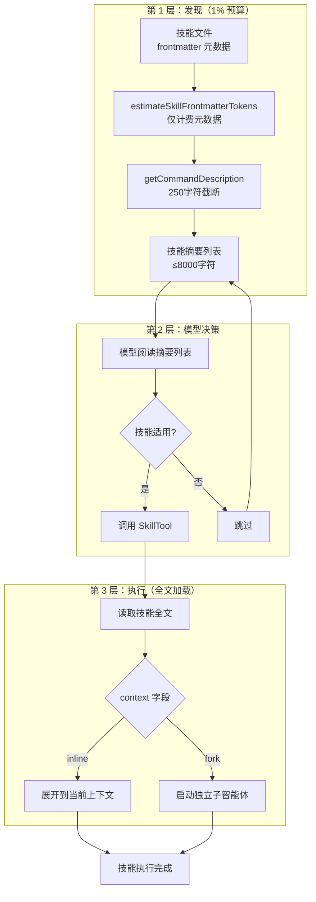
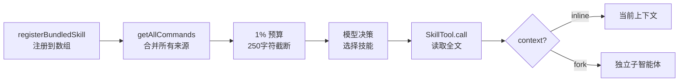

# 第 6 章：按需加载的智慧

> "把所有东西都放进上下文，和让模型自己决定需要什么——这两种策略的 token 成本可以相差 50 倍。"

Claude Code 有 50 多个技能（Skills），但系统提示词中只暴露它们的名称和摘要——全文在模型决定使用时才拉取。这个"让模型自己管理上下文窗口"的设计，不是延迟加载的性能技巧，而是 Harness 控制每次 API 调用 token 预算的核心策略。读完本章，你将理解三层懒加载架构——发现、决策、执行——如何让技能库的元信息只占用上下文窗口的 1%。

## 问题——50+ 技能如何在上下文中"不占位"

如果把 50 多个技能的完整提示词全部注入系统提示词，每个技能平均 400-800 字符，总计 20,000-40,000 字符（约 5,000-10,000 token）（推断）。在 200,000 token 的上下文窗口中，技能提示词一项就占去 2.5%-5%——留给工具定义、对话历史和工作空间的内容被大幅压缩。

Claude Code 的解法是一个反直觉的设计：只注入元数据摘要，不注入全文。系统提示词中，技能列表占用上下文窗口的 1%（`SKILL_BUDGET_CONTEXT_PERCENT = 0.01`），默认 8,000 字符（`DEFAULT_CHAR_BUDGET = 8_000`，计算方式：200k token × 4 字符/token × 1%）。每条技能的描述截断为 250 字符（`MAX_LISTING_DESC_CHARS = 250`），确保 50 个技能的摘要列表控制在预算内。

| 策略 | 技能列表 token 消耗 | 上下文占比 | 留给工作空间的 token |
|------|-------------------|-----------|-------------------|
| 全文注入 | ~5,000-10,000 | 2.5%-5% | 减少 5,000-10,000 |
| 元数据摘要（1% 预算） | ~2,000 | 1% | 仅减少 2,000 |
| 不注入任何技能信息 | 0 | 0% | 模型无法发现和使用技能 |

注释写出了精确的计算逻辑："Skill listing gets 1% of the context window (in characters)"（译：技能列表占用上下文窗口的 1%，以字符为单位）。8,000 字符不是随意设定的数字，而是从上下文窗口大小推导的精确预算。`MAX_LISTING_DESC_CHARS` 的注释进一步解释："The listing is for discovery only — the Skill tool loads full content on invoke, so verbose whenToUse strings waste turn-1 cache_creation tokens without improving match rate."（译：列表仅用于发现——Skill 工具在调用时加载完整内容，冗长的 whenToUse 字符串会浪费第一轮的缓存创建 token，却不能提高匹配率）。

**原则 6.1：预算驱动的上下文分配** — 每种上下文内容**必须**有明确的 token 预算上限。技能列表**禁止**超过上下文窗口的 1%——超出预算的信息在发现阶段被截断。

## 黄金法则——让模型决定何时拉取全文

Skills 懒加载的核心原则是"发现时只给名称和摘要，调用时才给全文"——把上下文管理的决策权从 Harness 转交给模型。

`DiscoverSkillsTool` 只做一件事：告诉模型当前有哪些技能可用（`DISCOVER_SKILLS_PROMPT = 'Discover skills'`）。这个"无操作"的发现阶段是懒加载的关键——模型在需要时调用发现工具，获得技能列表，然后根据任务需求决定是否调用具体技能。

`estimateSkillFrontmatterTokens` 函数只统计技能的 frontmatter 元数据（name + description + whenToUse），而非全文。注释说明了原因："since full content is only loaded on invocation"（译：因为完整内容只在调用时加载）。`FRONTMATTER_REGEX` 正则解析 YAML frontmatter，提取元数据用于发现阶段的摘要生成。

| 维度 | 预加载（所有技能全文） | 懒加载（先发现后调用） |
|------|-------------------|---------------------|
| 首次调用 token 成本 | 极高（全部技能全文） | 极低（仅 1% 预算的摘要） |
| 调用技能时延迟 | 零（已在上下文中） | 一轮 API 调用（先发现后执行） |
| 缓存命中率 | 低（技能内容变化频繁） | 高（摘要列表稳定可缓存） |
| 上下文窗口利用率 | 差（大量不相关技能占位） | 好（只加载需要的技能） |

**原则 6.2：模型即上下文管理者** — Harness **禁止**主动决定哪些技能内容进入上下文——只提供摘要，让模型根据任务需求自行判断。模型是唯一有权决定"我需要什么信息"的参与者。

## 适用场景——哪些功能适合懒加载

任何"存在但不常用"的能力都适合懒加载。核心判断标准是：每次任务中，有多少比例的技能实际被使用？

**适合懒加载**：
- 技能库超过 20 个，每次任务只用 1-3 个——典型场景是代码编辑 Agent，拥有代码分析、重构、测试、文档等多种技能，但单个任务只需其中一两种
- 技能内容较长（每个 400 字符以上），全文注入会显著挤占上下文
- 技能列表在不同会话间变化不大——摘要可以缓存，提高 Prompt Cache 命中率

**不适合懒加载**：
- 核心工具（文件读写、代码搜索）——每次任务几乎都用，懒加载反而增加延迟
- 极短的内容（<50 字符）——懒加载的管理开销超过节省的 token

`BundledSkillDefinition` 类型中 `userInvocable` 字段区分了两类技能：用户可直接调用的（需要在发现阶段显示）和仅供内部使用的（不需要在列表中暴露）。这个区分确保了发现阶段的列表只包含对用户有价值的信息。

## 工作原理——三层架构的完整流程

Skills 懒加载不是一个工具，是三个协作模块构成的完整系统：发现层、决策层、执行层。

**图 6-1：Skills 懒加载三层架构**

**发现层**：`DiscoverSkillsTool` 在模型需要时被调用，返回技能摘要列表。列表的生成经过三步过滤：首先 `estimateSkillFrontmatterTokens` 只提取每个技能的 name、description、whenToUse 三个字段；然后 `getCommandDescription` 将 description 和 whenToUse 拼接为完整描述；最后截断到 250 字符。整个列表控制在 8,000 字符预算内。

**决策层**：模型阅读摘要列表后，根据任务需求判断哪个技能适用。这个决策完全由模型做出——Harness 不干预。如果模型判断需要某个技能，调用 `SkillTool` 并传入技能名称和参数。

**执行层**：`SkillTool` 调用时才读取技能全文。根据技能的 `context` 字段选择执行模式：`inline`（技能内容展开到当前上下文中）适合需要访问当前会话状态的轻量技能；`fork`（启动独立子智能体执行）适合需要隔离上下文的重型任务。fork 模式的详细设计见第 12 章（隔离与交接）。

`getAllCommands` 函数合并了所有技能来源——本地技能和 MCP 技能。注释解释了过滤逻辑："Only include MCP skills (loadedFrom === 'mcp'), not plain MCP prompts"（译：只包含 MCP 技能，不包含普通 MCP prompts）——这是为了防止模型猜测 MCP prompt 名称绕过发现阶段。

## 权衡——三层架构的设计代价

三层懒加载在 token 效率上有显著优势，但引入了 3 个工程代价。

| 决策维度 | 选择 A（本系统） | 选择 B | 核心权衡 |
|---------|----------------|--------|---------|
| 调用模式 | 两步调用（先发现后执行） | 一步直接调用 | 多一轮 API 调用，换取上下文窗口的 95% 以上节省 |
| 描述精度 | 250 字符截断 | 不限长度 | 短摘要可能降低发现精度，但防止列表超出预算 |
| MCP 技能管理 | 过滤非 MCP skill 的 prompts | 允许所有 MCP 内容 | 增加约束复杂度，但防止绕过发现阶段的安全管控 |

**代价一：两步调用增加延迟**

模型需要先调用 `DiscoverSkillsTool` 获得技能列表，再调用 `SkillTool` 执行——这增加了一轮 API 调用。但代价是可接受的：技能列表在第一次发现后留在模型的上下文中，后续调用无需重复发现。在多轮对话中，首次发现的固定成本被后续所有技能调用分摊。

**代价二：描述截断降低发现精度**

250 字符的截断上限意味着复杂的技能用途可能无法在摘要中完整表达。模型可能因为描述不够精确而跳过适用的技能，或调用了不适用的技能——这是懒加载固有的精确度/效率权衡。缓解方法是让 `whenToUse` 字段聚焦于触发场景而非功能描述。

**代价三：MCP 过滤增加约束复杂度**

`getAllCommands` 中的 MCP 过滤逻辑防止模型通过猜测 prompt 名称直接调用——这确保所有技能调用都经过发现阶段。但这也意味着 MCP 提供商需要按照 BundledSkillDefinition 的格式注册技能，增加了集成复杂度。

## 踩坑指南——懒加载中的常见错误

**陷阱一：frontmatter 格式不规范**

`FRONTMATTER_REGEX` 要求严格的 `---\n` 开头和结尾。常见的错误包括：`---` 后缺少换行符、使用 `~~~` 代替 `---`、frontmatter 块内有未转义的冒号。解析失败的结果是整个技能文件被当作正文处理——技能不会出现在发现列表中，模型无法调用。

❌ 错误做法：在技能文件中随意使用 YAML 格式，不验证 frontmatter 是否被正确解析。  
✓ 正确做法：使用严格的 `---\n` 格式包裹 frontmatter，提交前用 `FRONTMATTER_REGEX` 验证解析结果。

**陷阱二：whenToUse 描述过于泛化**

"完成各种任务"或"帮助用户解决问题"——这类泛化的 whenToUse 在截断到 250 字符后，无法帮助模型判断技能是否适用。模型面对 50 个"帮助用户"的摘要，只能猜测。

❌ 错误做法：whenToUse 写成功能简介——"这个技能用于代码分析和重构"。  
✓ 正确做法：whenToUse 写成触发场景——"当用户要求分析项目架构、重构超过 50 行的函数、或解释复杂类型推导时使用"。

**陷阱三：description 和 whenToUse 的信息重叠**

`getCommandDescription` 会把 description 和 whenToUse 拼接为一条摘要。如果两者内容重叠，250 字符中会有大量冗余，导致有效信息被截断。

❌ 错误做法：description 写"代码搜索工具"，whenToUse 也写"用于搜索代码"。  
✓ 正确做法：description 写"代码搜索工具"，whenToUse 写"当用户要求查找某个函数的所有调用点、搜索特定模式的代码、或定位变量定义时使用"。

## 实证——从 Skills 列表到技能执行的完整路径

一个 bundled skill 从代码注册到模型调用，经过 4 个阶段。这条路径验证了三层懒加载架构的实际运作。

**注册阶段**：`registerBundledSkill`（`src/skills/bundledSkills.ts:47`）将技能定义注册到内部数组 `bundledSkills`。注册时，如果技能有附属文件（`files` 字段），这些文件会在首次调用时按需解压到磁盘——不是启动时解压，而是调用时。

**发现阶段**：模型调用 `DiscoverSkillsTool`，触发 `getAllCommands`（`src/tools/SkillTool/SkillTool.ts:81`）合并所有来源的技能列表。每个技能的元数据通过 `estimateSkillFrontmatterTokens`（`src/skills/loadSkillsDir.ts:100`）估算 token 数，然后截断到 250 字符（`src/tools/SkillTool/prompt.ts:29`），总列表控制在 8,000 字符预算内（`src/tools/SkillTool/prompt.ts:21`）。

**决策阶段**：模型阅读摘要列表，选择适用的技能。这个决策完全由模型做出——Harness 不干预。模型传入技能名称和参数调用 `SkillTool`。

**执行阶段**：`SkillTool` 读取技能全文。如果技能声明了 `context: 'fork'`，通过 `executeForkedSkill`（`src/tools/SkillTool/SkillTool.ts:119`）启动独立子智能体执行。否则以 inline 模式将技能内容展开到当前上下文。

**图 6-2：bundled skill 的注册→发现→选择→执行路径**

这条路径验证了核心设计：技能全文只在调用时加载——注册时只存定义，发现时只暴露摘要，执行时才读取完整内容。三个阶段各自的 token 成本递减：注册零成本（内存数组），发现 1% 预算，执行仅当前需要的技能。

## 本章主成分：Skills 懒加载

**本质**：把上下文管理的决策权从 Harness 转交给模型——Harness 只维护 1% 的发现层，模型自己决定何时加载全文。

**关键机制**：
- 1% 上下文预算（8,000 字符默认值），每条技能截断到 250 字符
- `FRONTMATTER_REGEX` 解析 YAML 元数据，`estimateSkillFrontmatterTokens` 只计费元数据
- `DiscoverSkillsTool` 发现 + `SkillTool` 执行的两步调用模式
- `context: 'inline' | 'fork'` 执行模式选择

**适用边界**：
- ✓ 适合：技能库超过 20 个，每次任务只用少数几个
- ✓ 适合：技能内容较长，全文注入会挤占上下文
- ✗ 不适合：每次任务必用的核心工具（应预加载）
- ✗ 不适合：极短内容（懒加载管理开销超过节省）

**与其他模式的关系**：
- 本章是第 5 章（提示词分层构建）动态区管理的实例——技能摘要列表属于动态区内容
- 第 7 章（最小工具基座）的工具注册采用了类似的按需声明策略
- 第 12 章（隔离与交接）详细展开 fork 执行模式的上下文隔离设计

## 你能做什么

- **为你的技能/工具库建立发现层**。只暴露名称和简短描述，不暴露全文。计算上下文预算的 1%，以此为发现层的 token 上限。
- **为每个技能写精确的 whenToUse 字段**。不超过 200 字符，聚焦于触发场景而非功能描述——确保模型能从摘要判断技能适用性。
- **检查技能 frontmatter 格式是否符合严格的 `---\n` 规范**。解析失败意味着技能不会出现在发现列表中，模型无法调用。
- **为需要隔离上下文的重型技能设置 `context: 'fork'`**。fork 模式启动独立子智能体，防止技能执行的副作用污染当前会话（详见第 12 章）。
- **对照第 5 章的缓存策略，确保技能元数据列表在静态区**。技能摘要列表在会话内不变，应该利用 Prompt Cache——如果你的技能列表每轮都变，说明摘要中有动态内容，需要排除。
- **评估你的技能库大小**。超过 20 个时特别需要懒加载策略；超过 50 个时，1% 预算可能不够——考虑对技能分组，按任务类型分批发现。
- **测量技能发现和执行的 token 消耗**。验证发现阶段的实际消耗是否在预算内，执行阶段的全文加载是否值得。

---

**下一章导读**：本章看到了 Skills 如何通过懒加载控制上下文窗口的技能列表占用。但技能只是 Harness 工具系统的一部分——更基础的问题是：哪些工具应该存在，它们如何注册、分类、分组？第 7 章将进入工具注册的最小基座设计，展示 Harness 如何用"最小工具集 + 按需扩展"的策略平衡能力与安全。
