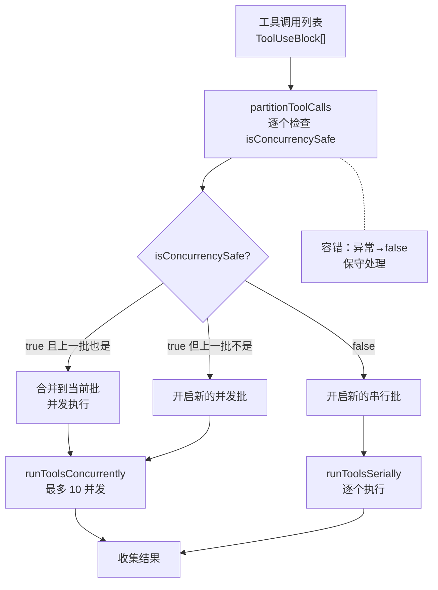
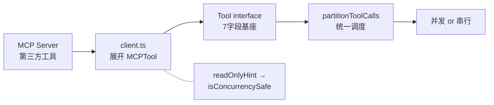

# 第 7 章：最小工具基座

> "最小不是最少，是最精。一套简单的接口，撑起了 54 个工具，也撑起了无数第三方扩展。"

Claude Code 有 50 多个工具——文件读写、代码搜索、命令执行、权限检查——但它们共用一套 7 个字段的接口。`buildTool` 工厂把所有工具约束到同一张行为合同上，`partitionToolCalls` 按一条规则决定并发还是串行。复杂度不在基座里，在 MCP 生态里。读完本章，你将理解"最小工具基座"的含义——核心接口越简单，扩展能力越强。

## 问题——50+ 工具如何共享一套行为约定

50 个工具如果各自实现安全检查、并发控制、权限验证，出错概率是单工具的 50 倍。更危险的是，一个工具的遗漏声明会破坏整个调度系统的安全假设——如果一个声明为并发安全的工具实际上修改了共享文件，所有与之并发执行的工具都会遭遇竞争条件。

Claude Code 的解决方案是 `buildTool` 工厂。它定义了 7 个可默认字段（DefaultableToolKeys），每个工具通过工厂获得统一的安全默认值，开发者只需覆盖与默认值不同的字段。源码注释写明了这个设计的核心意图："Build a complete Tool from a partial definition, filling in safe defaults for the commonly-stubbed methods. All tool exports should go through this so that defaults live in one place."（译：从部分定义构建完整的 Tool，为常用桩方法填充安全默认值。所有工具导出都应经过此函数，确保默认值集中在一处）。

7 个可默认字段分两类：

| 类别 | 字段 | 默认值 | 作用 |
|------|------|--------|------|
| 行为类 | `isEnabled` | `true` | 工具是否可用 |
| 行为类 | `isConcurrencySafe` | `false`（假定不安全） | 是否可与其他工具并发 |
| 行为类 | `isReadOnly` | `false`（假定写操作） | 是否只读 |
| 行为类 | `isDestructive` | `false` | 是否有破坏性 |
| 控制类 | `checkPermissions` | `allow`（交由通用权限系统） | 权限检查逻辑 |
| 控制类 | `toAutoClassifierInput` | `''`（跳过分类器） | AI 安全分类器输入 |
| 控制类 | `userFacingName` | 工具名 | 面向用户的显示名 |

**原则 7.1：集中默认值，分散覆盖** — 工具安全默认值**必须**集中在一处（`TOOL_DEFAULTS`），所有工具通过 `buildTool` 工厂继承。开发者**禁止**手动设置默认值——只覆盖与默认不同的字段。

## 黄金法则——fail-closed 默认值策略

`buildTool` 的 7 个默认值全部选择 fail-closed（保守安全）方向。源码注释写明了这个原则："Defaults (fail-closed where it matters): isConcurrencySafe → false (assume not safe), isReadOnly → false (assume writes)."（译：默认值在关键处采用失败关闭：isConcurrencySafe 默认 false，假定不安全；isReadOnly 默认 false，假定写操作）。

三个关键默认值的工程逻辑：

**`isConcurrencySafe → false`**：除非工具开发者显式声明为并发安全，否则工具不可与其他工具同时执行。这意味着新工具默认串行——即使开发者忘记声明，也不会导致并发竞争。

**`isReadOnly → false`**：假定工具会修改状态。在权限系统中，写操作工具需要更严格的审查（详见第 9 章）。默认为写操作确保新工具不会被意外绕过写操作权限检查。

**`toAutoClassifierInput → ''`**：AI 安全分类器收不到这个工具的描述，无法自动判断风险等级。注释明确标注："security-relevant tools must override"（译：安全相关工具必须覆盖）。代价是遗漏覆盖的工具会被分类器跳过，好处是分类器不会被无关工具的信息淹没。

| 默认策略 | 对 50+ 个工具的影响 | 如果选 fail-open 的风险 |
|---------|------------------|---------------------|
| fail-closed（当前） | 开发者需显式声明安全性 | 无风险——遗漏声明=最安全行为 |
| fail-open | 无需声明，默认允许 | 遗漏声明=最危险行为——并发竞争、权限绕过 |

**原则 7.2：安全默认值优先于便利性** — 工具默认值**必须**选择最安全的方向——`false` 优先于 `true`。开发者为了便利必须显式覆盖默认值，这个"不便"是安全的代价。

## 适用场景——哪些系统需要工具基座

任何 Agent 系统只要有 2 个以上需要不同权限的工具，就需要统一的工具接口。

**需要工具基座**：工具类型多样（读/写/破坏性），来源多样（内置/第三方/协议扩展），需要统一的并发控制和权限检查。典型场景是代码编辑 Agent——同时拥有文件读取（安全、可并发）、文件编辑（不安全、需串行）、命令执行（破坏性、需确认）三类工具。

**不需要工具基座**：只有 1-2 个工具的简单 Agent，或者所有工具行为完全相同的系统。如果每个工具都是"接收输入、返回输出"的无状态函数，统一接口的收益可忽略。

Tool interface 的 `isMcp`、`isLsp`、`shouldDefer`、`alwaysLoad` 字段揭示了基座的扩展性设计——核心接口不变，通过这些标记字段区分不同来源的工具：

| 工具来源 | 标记字段 | 注册方式 | 调度方式 |
|---------|---------|---------|---------|
| 内置工具 | 默认 | `buildTool()` 工厂 | 与所有工具统一调度 |
| MCP 工具 | `isMcp: true` | 对象展开复用基座 | 同上 |
| LSP 工具 | `isLsp` | 延迟加载 | 需要时按需启动 |

## 工作原理——只读并发、写操作串行

`toolOrchestration.ts` 实现了一个简单但有效的调度策略：把所有工具调用分批——连续的并发安全工具合并为并发批次，其余串行执行。

源码注释精确定义了分批规则："Partition tool calls into batches where each batch is either: 1. A single non-read-only tool, or 2. Multiple consecutive read-only tools."（译：将工具调用分为批次，每个批次要么是一个非只读工具，要么是多个连续的只读工具）。

**图 7-1：工具调度分批策略**

分批逻辑的执行过程：

`partitionToolCalls` 用 reduce 逐个处理工具调用。对每个工具，先通过 `findToolByName` 查找工具定义，再用 `inputSchema.safeParse` 解析输入参数，然后调用 `isConcurrencySafe(parsedInput.data)` 判断并发安全性。如果返回 `true` 且上一个批次也是并发安全的，合并到当前批次；否则开启新批次。

容错逻辑是设计的关键。`isConcurrencySafe` 调用被 try-catch 包裹——如果抛出异常（例如 shell-quote 解析失败），保守处理为 `false`（不可并发）。源码注释说明了意图："If isConcurrencySafe throws, treat as not concurrency-safe to be conservative."（译：如果 isConcurrencySafe 抛出异常，保守地视为不可并发）。

分批完成后，`runTools` 对每个批次选择执行策略：并发安全批次调用 `runToolsConcurrently`（最多 `getMaxToolUseConcurrency` 个并发，默认 10，可通过环境变量 `CLAUDE_CODE_MAX_TOOL_USE_CONCURRENCY` 覆盖），非并发安全批次调用 `runToolsSerially`（逐个执行）。

这个调度策略是贪心的——它只合并"连续"的并发安全工具，不做全局依赖分析。例如，如果工具调用序列是 [读, 写, 读]，两个读操作不会被合并，因为中间夹了一个写操作。代价是偶尔无法识别非连续的可并发机会；收益是 O(n) 复杂度、无依赖分析开销。

## 权衡——工具基座的 3 个设计选择

| 决策维度 | 选择 A（本系统） | 选择 B | 核心权衡 |
|---------|----------------|--------|---------|
| MCP 工具复用 | 对象展开继承基座 | MCP 工具独立实现接口 | 统一调度逻辑 vs MCP 工具必须适配内部接口 |
| 并发安全声明 | readOnlyHint 自动映射 | 第三方工具自行声明 isConcurrencySafe | 降低接入门槛 vs 映射精度依赖 MCP 注解质量 |
| 异常处理 | 保守处理为不可并发 | 让异常传播到调用方 | 调度层健壮性 vs 可能损失并发机会 |

**选择一：MCP 工具通过对象展开复用内置基座**

MCP 工具不是另起一套接口——它通过 `...MCPTool` 展开运算符继承内置工具基座的所有默认值和行为，然后覆盖 name、description、isConcurrencySafe 等字段。这意味着 `partitionToolCalls` 不需要区分内置工具和 MCP 工具——它们走同一条调度路径。代价是 MCP 工具必须适配 Tool interface 的 7 个字段结构。

**选择二：readOnlyHint 自动映射到 isConcurrencySafe**

MCP 协议定义了 `readOnlyHint` 注解——MCP 工具只需声明自己是否只读，Claude Code 自动将 `readOnlyHint` 映射为 `isConcurrencySafe`。第三方工具开发者无需理解 Claude Code 的内部调度机制，只需遵循 MCP 协议标准。如果 MCP 工具没有设置 `readOnlyHint`，默认 `false`——又是 fail-closed。

**选择三：isConcurrencySafe 异常保守处理**

调度层不信任工具的 `isConcurrencySafe` 实现——如果它抛出异常，调度层不传播异常，而是静默降级为串行执行。这是一个防御性设计：一个工具实现的 bug 不应该导致整个调度层崩溃。代价是偶尔损失并发机会，收益是调度层的健壮性。

## 踩坑指南——工具基座中的常见错误

**陷阱一：错误声明 isConcurrencySafe**

一个工具声明了 `isConcurrencySafe: true` 但实际上会修改共享状态——不会在单工具测试中暴露，只在多工具并发调用时出现随机竞争条件。

❌ 错误做法：为了并发性能，对"大多数时候只读"的工具声明 `isConcurrencySafe: true`。  
✓ 正确做法：只对**经过严格审查的纯只读工具**声明 `isConcurrencySafe: true`。如果有任何修改状态的可能，保持默认 `false`。

**陷阱二：忘记声明 isDestructive**

`isDestructive` 的默认值是 `false`。如果删除文件或执行不可逆操作的工具没有声明 `isDestructive: true`，权限系统不会触发额外的确认步骤——用户可能在不知情的情况下批准了不可逆操作。

❌ 错误做法：只关注 isConcurrencySafe，忽略 isDestructive 声明。  
✓ 正确做法：对每个工具逐一检查——如果有任何修改、删除、覆盖操作，声明 `isDestructive: true`。

**陷阱三：安全相关工具遗漏 toAutoClassifierInput**

`toAutoClassifierInput` 默认返回空字符串，意味着 AI 安全分类器跳过这个工具。如果安全敏感工具（如命令执行、网络请求）遗漏了这个声明，分类器无法评估风险等级（详见第 9 章）。

❌ 错误做法：只在工具的 description 里写"谨慎使用"，不实现 toAutoClassifierInput。  
✓ 正确做法：安全相关工具**必须**实现 `toAutoClassifierInput`，返回描述工具用途和风险的关键词字符串。

## 实证——MCP 工具如何复用内置基座

一个 MCP 工具从服务器注册到被调度执行，完全走内置工具的相同路径。这条路径验证了"最小基座"的扩展能力。

**注册阶段**：MCP 客户端连接到 MCP 服务器后，获取工具列表。每个 MCP 工具通过对象展开继承基座——`...MCPTool`（`src/services/mcp/client.ts:1770`）将内置工具的所有默认值复制过来，然后覆盖特定字段：`isMcp: true`（`src/tools/MCPTool/MCPTool.ts:28`）标记为 MCP 工具，`mcpInfo` 附加服务器名和工具名身份信息（`src/services/mcp/client.ts:1774`）。

**映射阶段**：MCP 协议的 `readOnlyHint` 注解自动映射到 `isConcurrencySafe`。MCP 工具的并发安全声明来自 `tool.annotations?.readOnlyHint ?? false`（`src/services/mcp/client.ts:1780`）——如果 MCP 工具声明了只读，自动获得并发调度优化；如果没有声明，默认 `false`（fail-closed）。

**调度阶段**：`partitionToolCalls`（`src/services/tools/toolOrchestration.ts:91`）不区分工具来源——内置工具和 MCP 工具走同一条 reduce 逻辑。isConcurrencySafe 为 true 的工具合并到并发批次，false 的串行执行。MCP 工具无需特殊路径。

**图 7-2：MCP 工具复用内置基座的完整路径**

这条路径验证了基座设计的核心价值：第三方工具通过 MCP 协议接入，自动获得内置工具的全部安全默认值和调度优化。54 个内置工具和无数 MCP 工具共用同一条调度路径——这就是"最小基座"的扩展力。

## 本章主成分：最小工具基座

**本质**：一套 7 个字段的 fail-closed 接口，统一约束所有工具的行为。调度决策压缩为"连续只读并发、其余串行"一条规则。

**关键机制**：
- `TOOL_DEFAULTS` 集中管理 fail-closed 安全默认值
- `buildTool` 工厂让所有工具继承默认值，开发者只覆盖差异
- `partitionToolCalls` 贪心分批——连续并发安全工具合并，其余串行
- MCP 工具通过对象展开复用基座，`readOnlyHint` 自动映射到 `isConcurrencySafe`

**适用边界**：
- ✓ 适合：多类型工具（内置+第三方）的 Agent 系统
- ✓ 适合：需要统一并发控制和权限检查的工具库
- ✗ 不适合：只有 1-2 个无状态工具的简单系统
- ✗ 不适合：所有工具行为完全相同的系统

**与其他模式的关系**：
- 工具基座是第 4 章（单轮执行）工具调度的实现基础
- 第 8 章（先规划后执行）通过工具权限编码约束工具使用
- 第 9 章（渐进式安全）在 `checkPermissions` 上构建权限评估层

## 你能做什么

- **为每个工具声明 `isConcurrencySafe`**。只读工具设为 `true` 以获得并发优化，有写操作的工具保持 `false`。用 `buildTool` 工厂而非手动设置默认值。
- **为破坏性操作工具声明 `isDestructive=true`**。删除、覆盖、不可逆操作必须声明，确保权限系统触发额外确认。
- **为安全相关工具实现 `toAutoClassifierInput`**。命令执行、网络请求等高风险工具必须提供描述信息，让 AI 安全分类器评估风险（详见第 9 章）。
- **通过环境变量调整并发上限**。默认最大并发数为 10，可通过 `CLAUDE_CODE_MAX_TOOL_USE_CONCURRENCY` 覆盖——在 I/O 密集型场景中适当增大，在资源受限环境中减小。
- **为你的 MCP 工具设置 `readOnlyHint` 注解**。声明只读的工具自动获得并发调度优化，无需实现 Claude Code 内部接口。
- **检查工具库中遗漏的 fail-closed 声明**。逐一审查每个工具的 7 个默认字段——任何"大多数时候安全"的工具都应该保持默认 `false`。
- **重新排列工具调用顺序以最大化并发批次**。`partitionToolCalls` 是贪心的——把只读工具连续排列可以增加并发机会，夹在写操作之间会打断并发批次。

---

**下一章导读**：本章看到了工具基座如何用统一接口约束 50+ 个工具的行为和调度。但工具注册只是第一步——模型在调用工具前需要知道"我能用哪些工具，什么时候用"。第 8 章将展示 Plan Mode 如何通过工具权限编码（Tool Permissions Encoding）约束模型的工具使用策略——从"什么工具可用"到"什么时候用什么工具"。
