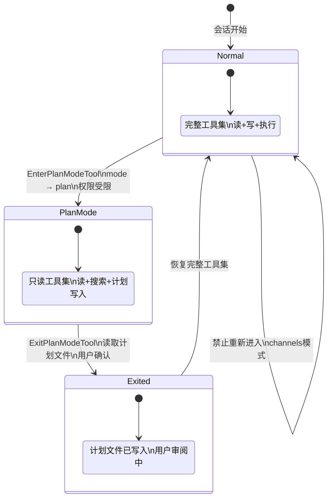

# 第 8 章：先规划后执行

> "提示词说'请先规划'，模型可以假装听了。权限撤销说'不能写文件'，模型没有选择。"

"先规划再执行"听起来像一条建议，但 Claude Code 的实现是一套机制。进入 Plan Mode 意味着写文件的工具权限被暂时撤销——模型想写代码，物理上办不到。语言劝导失败的地方，工具权限不会失败。读完本章，你将理解 Plan Mode 如何通过 `ToolPermissionContext.mode` 的状态切换，把"先规划"从建议升级为不可绕过的约束。

## 问题——"先规划后执行"为什么需要机制而非指令

同样的"先规划"要求，用提示词写和用权限约束写，结果截然不同。

提示词层面的"先规划后执行"指令，模型可以"理解"但在压力下跳过——面对一个紧急 bug 修复任务，模型可能认为"直接修改更快"而跳过规划步骤。这不是模型的错误——它做出了一个合理的效率权衡，只是这个权衡不符合安全策略。

| 约束方式 | 可靠性 | 灵活性 | 可绕过性 |
|---------|--------|--------|---------|
| 提示词指令（"请先规划"） | 低——模型可以选择忽略 | 高——可以区分紧急和非紧急场景 | 完全可绕过 |
| 工具权限撤销（写文件权限移除） | 高——模型物理上无法写文件 | 低——所有写操作一律阻止 | 不可绕过 |

Claude Code 的解法是 `EnterPlanModeTool`。它的 `call()` 方法做了两件事：切换权限模式（`setAppState` 将 `mode` 设为 `'plan'`）和在工具结果中注入指令文本（"Remember: DO NOT write or edit any files yet"）。两者的优先级不同——权限模式切换是机制层（模型物理上无法写文件），注入的指令是信息层（告知模型当前处于规划阶段）。机制层不会被绕过，信息层只是辅助。

**原则 8.1：机制约束优先于语言劝导** — 能用工具权限编码的行为约束，**禁止**退化为提示词指令。模型对权限约束没有选择权——它只能在允许的工具集内行动。

## 黄金法则——用工具权限编码行为约束

Plan Mode 的核心原则是"能用权限约束的行为，不要用提示词劝导"。这个原则的设计证据在 `prepareContextForPlanMode` 函数中——进入规划模式时，它修改 `ToolPermissionContext` 的 `mode` 字段，而非修改系统提示词。

`ToolPermissionContext.mode` 是权限系统的核心控制面（详见第 9 章）。当 mode 设为 `'plan'`，权限系统自动限制可用工具集——写文件、执行命令等修改性操作的工具不再可用。模型只能使用只读工具（文件读取、代码搜索）来探索和理解代码库，然后输出规划文本。

`handlePlanModeTransition` 管理模式转换的副作用。注释说明了状态管理逻辑："If switching TO plan mode, clear any pending exit attachment. This prevents sending both plan_mode and plan_mode_exit when user toggles quickly."（译：如果切换到 plan 模式，清除任何待处理的退出附件。这防止用户快速切换时同时发送 plan_mode 和 plan_mode_exit）。这个细节揭示了工程考量——快速切换（Enter→Exit→Enter）需要仔细的状态清理，否则会出现不一致的附件状态。

| 约束层级 | 实现方式 | Plan Mode 效果 |
|---------|---------|---------------|
| 机制层 | `ToolPermissionContext.mode = 'plan'` | 写文件工具权限撤销，模型物理上无法修改代码 |
| 信息层 | 工具结果中的指令文本 | 告知模型处于规划阶段，应专注分析而非修改 |
| 状态层 | `handlePlanModeTransition` | 记录模式转换，管理附件状态 |

**原则 8.2：约束的可审计性** — 行为约束**必须**通过可审计的机制实现——权限模式切换留下明确的状态记录，提示词劝导不留任何可追踪的痕迹。

## 适用场景——哪些任务需要 Plan Mode

不是所有任务都需要 Plan Mode。`EnterPlanModeTool` 的 `searchHint` 给出了清晰的适用范围："switch to plan mode to design an approach before coding"（译：切换到规划模式，在编码前设计方案）。这个描述揭示了 Plan Mode 的本质——不是防止模型做坏事，而是让模型先想清楚再动手。

**适合 Plan Mode 的场景**：
- 大规模重构——影响超过 5 个文件的结构调整，先规划修改范围和顺序
- 架构变更——修改核心接口或数据流，先分析影响面和兼容性
- 数据库迁移——不可逆操作，先确认迁移脚本和回滚方案
- 多步骤任务——超过 3 步且步骤间有依赖的操作链

**不需要 Plan Mode 的场景**：
- 单文件小修改——影响范围明确，规划成本高于执行成本
- 紧急 hotfix——时间敏感，规划延迟不可接受
- 探索性任务——本身就是"看看代码是什么样"，没有明确的执行目标

## 工作原理——Plan Mode 的完整状态机

Plan Mode 是一个三态状态机：正常 → 规划中 → 已退出。每次状态转换都有对应的工具权限变更和磁盘操作。

**图 8-1：Plan Mode 三态状态机**

**进入阶段**：模型调用 `EnterPlanModeTool`，触发 `prepareContextForPlanMode` 修改权限上下文。如果当前处于 auto 模式，`prepareContextForPlanMode` 会先恢复危险权限（`restoreDangerousPermissions`），保存 `prePlanMode` 状态用于退出时恢复。权限切换后，写文件和执行命令的工具从可用列表中移除。

**规划阶段**：模型在只读工具集下探索代码库。同时，`getPlanSlug` 生成唯一的计划文件名——使用可读的 word slug（如 "happy-fox-42"）而非 UUID，最多重试 10 次（`MAX_SLUG_RETRIES`）处理文件名冲突。`getPlanFilePath` 拼接完整路径，计划内容写入磁盘。

**退出阶段**：模型调用 `ExitPlanModeV2Tool`。它读取磁盘上的计划文件（`getPlanFilePath(context.agentId)`），供用户审阅。用户可以在 CCR（Continuous Code Review）场景下编辑计划——注释说明了覆盖逻辑："CCR web UI may send an edited plan via permissionResult.updatedInput"（译：CCR Web UI 可以通过 permissionResult.updatedInput 发送编辑后的计划）。确认后，`setHasExitedPlanMode(true)` 标记会话级退出状态，权限模式恢复到 `prePlanMode`。

| 状态 | 可用工具 | 磁盘操作 | 权限模式 |
|------|---------|---------|---------|
| 正常 | 完整工具集 | 无 | 原始 mode |
| 规划中 | 只读 + 计划写入 | 生成 slug → 写计划文件 | `plan` |
| 已退出 | 完整工具集 | 读取计划文件 | 恢复 `prePlanMode` |

## 权衡——计划审批流的 3 个设计选择

| 决策维度 | 选择 A（本系统） | 选择 B | 核心权衡 |
|---------|----------------|--------|---------|
| 计划存储 | 写入磁盘文件 | 存储在内存 state 中 | 用户可审批前编辑 vs 文件管理复杂度 |
| 进入门控 | channels 模式下同时禁用 Enter 和 Exit | 只禁用 Exit | 防止死锁 vs 允许进入但不允许退出 |
| 文件命名 | 可读的 word slug | UUID | 调试可读性 vs 冲突处理开销 |

**选择一：计划文件持久化到磁盘**

计划内容写入磁盘文件（`getPlanFilePath` 指向实际文件路径），而非存储在内存 state 中。这个选择的直接收益是 CCR 场景——用户可以在 Web UI 中查看和编辑计划文件，修改后的内容通过 `permissionResult.updatedInput` 覆盖磁盘版本。如果存在内存中，外部编辑是不可能的。代价是需要管理文件的生命周期——创建、读取、清理。

**选择二：进入/退出门控的对称性**

`isEnabled()` 中有一段关键的注释："When --channels is active, ExitPlanMode is disabled (its approval dialog needs the terminal). Disable entry too so plan mode isn't a trap."（译：channels 模式活跃时，ExitPlanMode 被禁用（审批对话框需要终端）。同时禁用进入，以免 Plan Mode 变成一个陷阱）。如果只禁用 Exit 而不禁用 Enter，模型可以进入 Plan Mode 但永远无法退出——一个死锁。对称门控防止了这种"陷阱"。

**选择三：word slug 代替 UUID**

`getPlanSlug` 生成如 "swift-raven-7" 的可读文件名，而非 `550e8400-e29b-41d4-a716-446655440000`。在调试和日志中，"swift-raven-7" 比 UUID 可读性高得多。代价是需要最多 10 次（`MAX_SLUG_RETRIES`）重试处理文件名冲突——多会话同时创建计划时可能出现 slug 碰撞。

## 踩坑指南——Plan Mode 中的常见错误

**陷阱一：在 agent 子任务中调用 EnterPlanMode**

`EnterPlanModeTool.call()` 的第一行就检查了上下文——如果在 agent 子任务中被调用，直接抛出异常。Plan Mode 是会话级机制，不应该在子智能体的上下文中使用——子智能体没有独立的权限上下文来管理 plan mode 的状态转换。

❌ 错误做法：在 agent 子任务中让模型进入 Plan Mode，以为子智能体也可以"先规划"。  
✓ 正确做法：Plan Mode 只在主会话中使用。子智能体有自己的任务编排机制（详见第 12 章）。

**陷阱二：计划文件目录不存在时退出失败**

`getPlanFilePath` 依赖 `getPlansDirectory`（memoized，只初始化一次）。如果计划目录在规划阶段没有正确创建，退出时读取计划文件会失败——模型完成了规划但无法交付计划内容。

❌ 错误做法：假设计划目录已经存在，不在退出前检查路径有效性。  
✓ 正确做法：在进入 Plan Mode 时确保目录创建，退出时验证计划文件路径可读。

**陷阱三：快速切换导致附件状态不一致**

`handlePlanModeTransition` 专门处理快速切换（Enter→Exit→Enter）的边界情况。如果状态清理不完整，系统可能同时发送 `plan_mode` 和 `plan_mode_exit` 附件——导致下游系统行为不一致。

❌ 错误做法：忽略快速切换场景，只处理正常的 Enter→Exit 单次流程。  
✓ 正确做法：每次进入 plan mode 时清除 `needsPlanModeExitAttachment`，确保状态干净。

## 实证——从工具调用到计划文件的完整路径

一次完整的 Plan Mode 循环涉及 3 个工具调用、2 次权限模式切换、1 次文件写入。这条路径验证了三态状态机的实际运作。

**进入**：模型调用 `EnterPlanModeTool`（`src/tools/EnterPlanModeTool/EnterPlanModeTool.ts:77`）。`prepareContextForPlanMode`（`src/utils/permissions/permissionSetup.ts:1462`）修改 `ToolPermissionContext`，保存 `prePlanMode`，切换 `mode = 'plan'`。`handlePlanModeTransition`（`src/bootstrap/state.ts:1349`）清除待处理的退出附件。

**规划**：模型在只读工具集下探索代码库。同时，`getPlanSlug`（`src/utils/plans.ts:32`）生成唯一文件名，`getPlanFilePath`（`src/utils/plans.ts:119`）拼接路径，计划内容写入磁盘。`getPlansDirectory`（`src/utils/plans.ts:79`）使用 memoize 确保目录只初始化一次。

**退出**：模型调用 `ExitPlanModeV2Tool`。读取磁盘上的计划文件供用户审阅。用户确认后，`setHasExitedPlanMode(true)`（`src/tools/ExitPlanModeTool/ExitPlanModeV2Tool.ts:359`）标记会话级退出状态，权限模式恢复到 `prePlanMode`。

**图 8-2：Plan Mode 完整调用链**

这条路径验证了核心设计：Plan Mode 通过修改权限上下文来约束模型行为，通过磁盘文件来交付规划结果。进入/退出的对称性确保模型不会陷入死锁，word slug 提升了调试效率。

## 本章主成分：Plan Mode

**本质**：通过修改 `ToolPermissionContext.mode` 撤销写文件工具的权限，把"先规划"从语言劝导升级为物理约束。

**关键机制**：
- `prepareContextForPlanMode` 切换权限模式，保存 `prePlanMode` 用于恢复
- `handlePlanModeTransition` 管理快速切换的状态清理
- 计划文件通过 `getPlanFilePath` + word slug 持久化到磁盘
- 进入/退出门控的对称性防止 channels 模式下的死锁

**适用边界**：
- ✓ 适合：不可逆操作前的强制规划（重构、迁移、架构变更）
- ✓ 适合：多步骤依赖任务链
- ✗ 不适合：单文件小修改（规划成本高于执行成本）
- ✗ 不适合：紧急 hotfix（时间敏感）

**与其他模式的关系**：
- 本章是第 7 章（工具基座 `checkPermissions`）的应用实例
- 第 9 章（渐进式安全）展示了 `ToolPermissionContext` 的完整权限体系
- 第 12 章（隔离与交接）的子智能体排除了 Plan Mode（agentId 检查）

## 你能做什么

- **为你的 Agent 中不可逆操作前添加 Plan Mode 入口**。用权限约束（而非提示词指令）来强制执行"先探索后行动"的行为顺序——模型无法绕过它不具备的工具权限。
- **把计划文件写入磁盘而非内存**。让用户可以在执行前审阅和编辑计划——外部编辑能力是文件持久化的核心价值。
- **设计进入/退出的对称门控**。禁用进入时同时禁用退出——防止模型进入后无法退出的死锁。
- **在多智能体场景中，为每个 agent 维护独立的计划文件路径**。基于 `agentId` 区分计划文件，避免多智能体写入冲突。
- **用可读的文件名（如 word slug）代替 UUID**。在调试和日志中提升可读性——接受最多 10 次重试的冲突处理开销。
- **对照第 9 章权限系统，理解 `ToolPermissionContext.mode` 的完整状态空间**。Plan Mode 只是 mode 字段的一个值——了解完整的状态空间才能设计更丰富的行为约束。
- **为快速切换场景添加状态清理**。每次进入 Plan Mode 时清除待处理的退出状态，防止不一致的附件发送。

---

**下一章导读**：本章看到了 Plan Mode 如何通过权限模式切换约束模型行为。但 Plan Mode 只是权限系统的一个应用——`ToolPermissionContext` 的完整体系如何运作？权限评估器如何分层决策？第 9 章将深入渐进式安全设计，展示 Harness 如何用多层评估器实现"默认拒绝、逐级放行"的权限策略。
