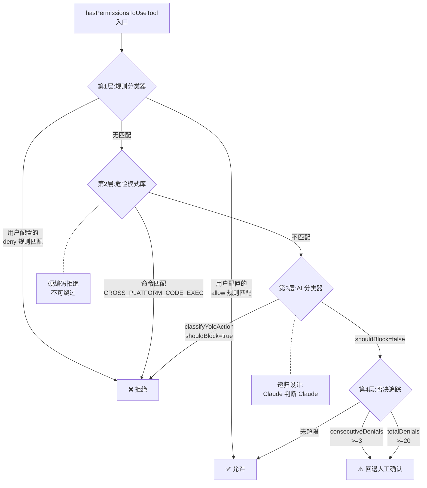
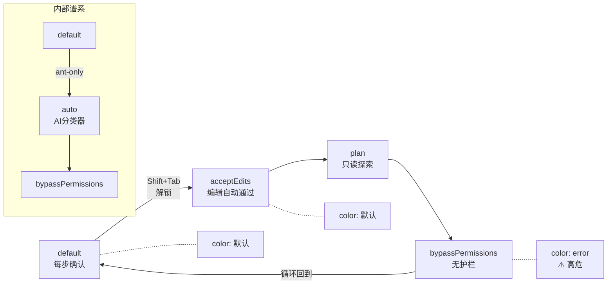

# 第 9 章:渐进式安全

> "最好的安全护栏是透明的--用户感知不到它,但越界的模型行为不可能穿过它。"

安全不是一个开关,是一条连续谱。从"每步都问用户"到"完全不问"之间,Claude Code 设计了 5 个精确的档位,每个档位有不同的守卫机制。最精妙的一档用 Claude 自己来判断 Claude 的行为是否安全--这是 Harness 在安全性上的递归应用。读完本章,你将理解 4 个子系统如何构成纵深防御,以及"默认拒绝、逐级放行"的安全谱系如何覆盖从个人开发到企业 CI 的全部场景。

## 问题--单一权限开关为什么不够

不同使用场景需要不同的安全级别。个人开发者可能希望文件编辑自动通过但命令执行需要确认;企业 CI/CD 管道需要完全自主执行不需要人工干预;代码审查场景需要模型只读不写。一个简单的"开/关"无法覆盖这些截然不同的需求。

Claude Code 的解法是一个权限谱系--`EXTERNAL_PERMISSION_MODES` 定义了 5 个面向用户的权限模式(`acceptEdits`、`bypassPermissions`、`default`、`dontAsk`、`plan`),`INTERNAL_PERMISSION_MODES` 在此基础上增加了 2 个内部模式(`auto`、`bubble`),共 7 个模式覆盖从"完全手动"到"完全自主"的全部场景。

| 模式 | 安全级别 | 用户交互 | 典型场景 |
|------|---------|---------|---------|
| `default` | 最高 | 每次操作都确认 | 首次使用、高风险操作 |
| `acceptEdits` | 高 | 文件编辑自动通过,命令需确认 | 日常开发 |
| `plan` | 限制性 | 只读探索,无写权限(详见第 8 章) | 架构分析、方案设计 |
| `dontAsk` | 中低 | 静默拒绝代替询问 | 批量非交互场景 |
| `bypassPermissions` | 无 | 无任何护栏 | 受控 CI 环境 |
| `auto`(内部) | 中 | AI 分类器自动判断 | 内部用户半自主模式 |

**原则 9.1:安全谱系覆盖全场景** - Agent 系统的安全策略**必须**提供连续的权限档位而非单一开关。不同场景的安全需求是量变的,不是质变的--用一个模式覆盖所有场景等于用一种安全级别应对所有风险。

## 黄金法则--安全谱系是从严到宽的单向门

权限谱系的设计原则是“从最严开始，用户主动解锁更宽”——默认值是 `default`（最严格），用户通过 Shift+Tab 循环解锁更宽松的模式。`getNextPermissionMode` 的 switch-case 结构是谱系顺序最直接的源码证据：`default → acceptEdits → plan → bypassPermissions → default`（循环）。

向右移动解锁更多自主性,向左移动增加安全护栏。注释说明了内部用户的谱系差异:"Ants skip acceptEdits and plan - auto mode replaces them"(译:内部用户跳过 acceptEdits 和 plan--auto 模式替代它们)。内部用户的谱系是 `default → auto → bypassPermissions`,更激进但也更有 AI 监督。

谱系的关键设计:系统**始终可以从任何模式回到 default**。这不是说用户不能手动选择更严格的模式,而是系统的默认行为是"从严开始"。即使当前处于 `bypassPermissions`(无护栏),下一次循环回到 `default` 时所有安全机制重新生效。

**原则 9.2:默认值是最安全的选项** - 系统的初始权限模式**必须**是最严格的。向宽松方向移动需要用户主动操作(如 Shift+Tab),向严格方向移动是默认行为。**禁止**将宽松模式设为默认值。

## 适用场景--哪个权限档位用于哪个场景

5 个权限档位各有精确的适用场景,从交互式开发到无人值守 CI 全覆盖。

`PERMISSION_MODE_CONFIG` 为每个模式配置了 title、shortTitle 和 color。`color = 'error'` 标记高危模式--`bypassPermissions` 和 `dontAsk` 都是 error 级,提醒用户当前处于危险区域。这不是装饰性的颜色编码,而是 UI 层面对安全等级的视觉表达。

**`default`--每次操作需确认**:适合首次使用 Claude Code 或执行高风险操作。代价是频繁的权限弹窗打断工作流--每读一个文件、执行一个命令都需要确认。

**`acceptEdits`--文件编辑自动通过**:日常开发的最佳平衡。读文件和编辑文件不需要确认,但执行命令(如 `npm test`)仍需确认。这是大多数开发者选择的档位。

**`plan`--只读探索**:详见第 8 章。模型只能读文件和搜索代码,不能写任何内容。

**`dontAsk`--静默拒绝**:模型尝试执行不允许的操作时不弹窗询问用户,而是直接拒绝并继续。适合批量非交互场景,避免弹窗阻塞管道。

**`bypassPermissions`--无护栏**:所有 4 层防御全部关闭。仅在完全受控的 CI 环境(无用户交互、操作可回滚)中使用。

## 工作原理--4 个子系统构成的纵深防御

Harness 的权限判断不是一个 if-else,而是 4 个子系统串联:规则分类器 → 危险模式库 → AI 分类器 → 否决追踪。`hasPermissionsToUseTool` 是 4 层判断的入口。

**图 9-1:auto 模式 4 层纵深防御**

**第 1 层:规则分类器**

检查用户配置的允许/拒绝规则。用户可以通过配置文件声明"允许 Bash(git:*)"或"拒绝 Edit(*)"--这些规则是最高优先级的判断。如果用户配置了明确的 allow 规则,后续 3 层检查全部跳过。这是"用户主权"的体现--用户的显式配置高于一切自动判断。

**第 2 层:危险模式库**

`CROSS_PLATFORM_CODE_EXEC` 是一个硬编码的危险模式列表--包含 `python`、`node`、`bash`、`sh` 等跨平台代码执行入口点。源码注释说明了这个库的用途:"An allow rule like Bash(python:*) lets the model run arbitrary code via that interpreter, bypassing the auto-mode classifier. These lists feed the isDangerousBashPermission predicates, which strip such rules at auto-mode entry."(译:一条 Bash(python:*) 的允许规则让模型可以通过该解释器运行任意代码,绕过 auto 模式分类器。这些列表提供给 isDangerousBashPermission 断言,在进入 auto 模式时剥离此类规则)。

这层的关键特性是**不可绕过**--即使用户配置了 `Bash(python:*)` 的 allow 规则,进入 auto 模式时这条规则也会被自动剥离。硬编码拒绝是 AI 分类器的前置守卫。

**第 3 层:AI 分类器**

`classifyYoloAction` 是最精妙的设计--它把整个对话历史发给 Claude 模型,让 Claude 判断当前操作是否安全。这是 Harness 在安全性上的递归应用:用 Claude 监督 Claude。`AutoModeRules` 定义了 AI 分类器的规则配置,规则可配置而非硬编码,说明分类器的行为可以按场景调整。

AI 分类器能理解上下文--它看到完整的对话历史,知道"这个 Bash 命令是在执行用户明确要求的重构任务"还是"模型在尝试绕过安全限制"。这种上下文理解是纯规则匹配无法实现的。

**第 4 层:否决追踪**

`DENIAL_LIMITS` 定义了精确的否决上限:`maxConsecutive: 3`(连续否决不超过 3 次)、`maxTotal: 20`(总计否决不超过 20 次)。`shouldFallbackToPrompting` 检查否决计数--如果超限,强制退出 auto 模式,回退到人工确认。

| 防御层 | 输入 | 输出 | 失败时行为 |
|--------|------|------|-----------|
| 规则分类器 | 用户配置 | allow/deny | 无匹配时传递给下一层 |
| 危险模式库 | 工具名+参数 | 硬拒绝 | 不在危险列表中时传递给下一层 |
| AI 分类器 | 完整对话历史 | shouldBlock | shouldBlock=false 时传递给下一层 |
| 否决追踪 | 否决计数 | 是否超限 | 超限时强制回退人工确认 |

## 权衡--AI 分类器的 3 个设计代价

AI 分类器在安全性和自主性之间找到了独特平衡点,但引入了 3 个不可忽视的代价。

| 决策维度 | 选择 A(本系统) | 选择 B | 核心权衡 |
|---------|----------------|--------|---------|
| AI 监督 | 用 Claude 判断 Claude | 纯规则匹配 | 上下文理解能力 vs 对抗性风险 |
| 否决阈值 | 3 次连续 / 20 次总计 | 无上限或更低阈值 | 自主模式持续性 vs 安全兜底频率 |
| auto 模式暴露 | 内部专用(Feature Flag) | 对所有用户开放 | 验证可靠性 vs 功能可达性 |

**代价一:AI 分类器的对抗性**

用 Claude 判断 Claude 的行为,在提示词注入场景下可能被绕过--攻击者可能在对话历史中注入误导性内容,让 AI 分类器误判操作为安全。这个代价的缓解方案是危险模式库--代码执行入口点(python/node/bash)的硬编码拒绝不经过 AI 分类器,即使在 auto 模式下也有效。

**代价二:否决阈值的精确校准**

`maxConsecutive: 3` 和 `maxTotal: 20` 是精确校准的数字。如果阈值太低(如 1 次连续否决就退出),auto 模式频繁退出,用户体验差;如果阈值太高(如 100 次总计才退出),连续错误操作无法被人类干预,安全风险大。3 和 20 的比例设计编码了一个判断--"连续 3 次错误操作"比"分散的 20 次错误操作"更危险。

**代价三:auto 模式不对外开放**

`auto` 模式通过 `USER_TYPE === 'ant'` 判断和 Feature Flag 控制,仅内部用户可用。这暗示 AI 分类器的可靠性尚未达到对所有用户开放的水平(推断)。内部用户对系统行为有更高的容忍度和理解力,外部用户遇到误判会造成信任损失。

## 踩坑指南--权限系统中的常见错误

**陷阱一:通配 allow 规则绕过 AI 分类器**

源码注释明确警告:`Bash(python:*)` 这样的通配允许规则让模型可以通过 python 解释器运行任意代码,绕过 auto 模式的 AI 分类器。虽然 auto 模式进入时会自动剥离此类规则,但在非 auto 模式下这些规则仍然生效。

❌ 错误做法:配置 `Bash(python:*)` 或 `Bash(node:*)` 的通配允许规则,以为"我只在受控环境中用"。
✓ 正确做法:如果需要允许 python 执行,使用精确的命令匹配(如 `Bash(python:my_script.py)`),避免通配符。理解通配 allow 规则会完全绕过危险模式库。

**陷阱二:auto 模式下高频操作触发否决累积**

auto 模式下,每次 AI 分类器拒绝操作都会增加否决计数。如果一个任务类型频繁触发 AI 分类器的误判,否决计数迅速累积到上限(3 次连续或 20 次总计),auto 模式被强制退出。

❌ 错误做法:在 auto 模式下执行大量高风险操作(如频繁的 rm 命令),不监控否决计数。
✓ 正确做法:监控 `shouldFallbackToPrompting` 的触发频率。高频触发说明 AI 分类器在当前任务类型上不可靠,应切换到更宽松或更严格的模式。

**陷阱三:误以为 bypassPermissions 只是"不问用户"**

`bypassPermissions` 不是跳过确认弹窗--它完全移除了 4 层防御。规则分类器、危险模式库、AI 分类器、否决追踪全部失效。模型可以执行任何操作,没有安全网。

❌ 错误做法:在交互式开发中使用 bypassPermissions "减少打扰"。
✓ 正确做法:bypassPermissions 仅在完全受控的 CI 环境中使用--没有用户交互、所有操作可回滚、输出经过审计。

## 实证--一次 auto 模式工具调用的决策链

在 auto 模式下,一次工具调用在执行前经过了至少 4 次独立判断。以 `Bash("rm -rf /tmp/old")` 为例追踪完整决策路径。

**入口**:`hasPermissionsToUseTool`(`src/utils/permissions/permissions.ts:473`)接收工具名(Bash)、参数(rm -rf /tmp/old)和当前权限上下文(mode=auto),启动 4 层判断。

**第 1 层(规则分类器)**:检查用户配置的 allow/deny 规则。如果用户配置了 `Bash(rm:*)` 的 allow 规则,直接允许,跳过后续 3 层。假设无匹配规则,传递给第 2 层。

**第 2 层(危险模式库)**:检查 `rm -rf /tmp/old` 是否匹配 `CROSS_PLATFORM_CODE_EXEC`(`src/utils/permissions/dangerousPatterns.ts:15`)中的代码执行入口点。`rm` 不在 python/node/bash 列表中--通过。传递给第 3 层。

**第 3 层(AI 分类器)**:`classifyYoloAction`(`src/utils/permissions/yoloClassifier.ts:1012`)把完整对话历史(包括用户最初的请求、模型之前的操作、当前要执行的命令)发给 Claude API。Claude 看到用户要求"清理临时文件",判断 `rm -rf /tmp/old` 是合理的清理操作,返回 `shouldBlock=false`。传递给第 4 层。

**第 4 层(否决追踪)**:`shouldFallbackToPrompting`(`src/utils/permissions/denialTracking.ts:40`)检查否决计数。`consecutiveDenials=0 < 3`,`totalDenials=0 < 20`--未超限。最终判定:**允许执行**。

如果第 3 层 AI 分类器返回 `shouldBlock=true`(例如模型尝试执行 `rm -rf /`),否决计数增加到 `consecutiveDenials=1`。如果连续 3 次被阻止,`shouldFallbackToPrompting=true`,auto 模式强制退出,回退到人工确认。

这条路径验证了纵深防御的核心价值:每一层独立判断,层与层之间不共享决策逻辑。一层的误判可以被下一层纠正--规则分类器的遗漏被危险模式库兜底,危险模式库的遗漏被 AI 分类器兜底,AI 分类器的误判被否决追踪兜底。

**图 9-2:权限谱系从严到宽的循环**

## 本章主成分:渐进式安全

**本质**:5 个权限档位构成从严到宽的单向解锁谱系。auto 档位通过 AI 递归判断实现"让 Claude 监督 Claude"--4 层纵深防御确保即使 AI 分类器被绕过,硬编码的危险模式库和否决追踪仍能兜底。

**关键机制**:
- 5 个外部模式 + 2 个内部模式覆盖全部安全场景
- `getNextPermissionMode` 的谱系循环:default → acceptEdits → plan → bypassPermissions
- 4 层纵深防御:规则分类器 → 危险模式库 → AI 分类器 → 否决追踪
- `DENIAL_LIMITS`(maxConsecutive=3, maxTotal=20)作为 auto 模式的安全网

**适用边界**:
- ✓ 适合:需要不同安全级别的多场景 Agent 系统
- ✓ 适合:需要在安全性和自主性之间找到平衡的半自主模式
- ✗ 不适合:所有操作安全等级完全相同的简单系统

**与其他模式的关系**:
- 本章是第 7 章(工具基座 `checkPermissions`)的运行时实现
- 第 8 章(Plan Mode)是权限谱系中 `plan` 档位的具体应用
- 第 10 章(Hooks 系统)在权限决策后提供进一步的行为拦截

## 你能做什么

- **审视你的 Agent 使用了哪个权限档位**。生产环境应避免 `bypassPermissions`--如果需要自主执行,考虑 auto 模式(需要实现 AI 分类器)而非完全移除护栏。
- **为你的工具实现 `toAutoClassifierInput`**。AI 分类器能看到的安全信息越多,判断越准确--告诉分类器工具的用途和风险等级(详见第 7 章)。
- **检查你的 allow 规则是否包含代码执行入口点**。`Bash(python:*)` 或 `Bash(node:*)` 会绕过危险模式库和 AI 分类器--使用精确匹配而非通配符。
- **设置合理的否决上限**。参考 `maxConsecutive=3` 和 `maxTotal=20` 的比例设计--连续否决比分散否决更危险,连续阈值应远低于总计阈值。
- **为高危操作构建专用的危险模式库**。代码执行入口点(python/node/bash)应在 AI 分类器之前提供硬拒绝--这是不可绕过的安全底线。
- **监控 `shouldFallbackToPrompting` 的触发频率**。高频触发说明 AI 分类器在当前任务类型上不可靠,应调整分类器规则或切换模式。
- **理解 auto 模式的递归性质**。AI 分类器本身也可能被误导--否决追踪是最后的安全网,确保即使分类器失效,系统也不会无限执行危险操作。

---

**下一章导读**:本章看到了权限系统如何通过 4 层纵深防御保护每次工具调用。但权限决策只是 Harness 控制模型行为的一种方式--第 10 章将展示 Hooks 系统如何在权限决策之后、工具执行前后提供额外的行为拦截和审计能力。这是 Harness 的"神经末梢"--最靠近执行层的控制点。
