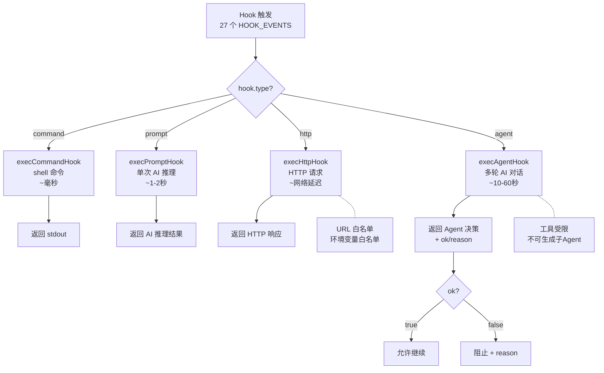
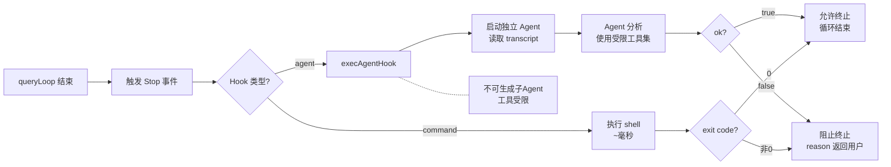

# 第 10 章：Harness 的神经末梢

> "好的扩展点不是'打开代码随便改'，而是'在正确的时机、用定义好的方式注入行为'。"

Harness 的核心代码不可修改，但它在 27 个时机点留了"钩子"（Hooks）。任何 shell 命令、HTTP 请求或 AI Agent 都可以挂上去，观察行为、改写决策、注入上下文。这些钩子是 Harness 向外延伸的神经末梢——唯一的、有设计的双向接口。读完本章，你将理解 4 种执行方式如何按能力层次递进，以及 Hooks 如何在不修改核心代码的情况下"重新接线" Harness 的行为。

## 问题——如何在不修改核心代码的情况下改变 Harness 行为

Hooks 解决的核心问题是扩展性。源码注释定义了 Hooks 的边界："Hooks are user-defined shell commands that can be executed at various points in Claude Code's lifecycle."（译：Hooks 是用户定义的 shell 命令，可以在 Claude Code 生命周期的各个时机点执行）。

`HOOK_EVENTS` 数组列出了 27 个触发点，覆盖 Harness 的完整生命周期。按功能分组：

| 类别 | 触发点 | 数量 |
|------|--------|------|
| 工具调用 | PreToolUse、PostToolUse、PostToolUseFailure | 3 |
| 会话边界 | SessionStart、SessionEnd、Setup | 3 |
| 停止条件 | Stop、StopFailure | 2 |
| 权限 | PermissionRequest、PermissionDenied | 2 |
| 上下文压缩 | PreCompact、PostCompact | 2 |
| 多智能体 | SubagentStart、SubagentStop、TeammateIdle、TaskCreated、TaskCompleted | 5 |
| 用户交互 | UserPromptSubmit、Notification、Elicitation、ElicitationResult | 4 |
| 配置与环境 | ConfigChange、CwdChanged、FileChanged、InstructionsLoaded、WorktreeCreate、WorktreeRemove | 6 |

27 个触发点意味着 Harness 的行为在 27 个位置可以被外部代码观测和修改。这些触发点不是事后添加的"插件接口"——它们是 Harness 设计之初就预留的扩展点。内部机制（如第 4 章的后采样 Hooks）和外部用户配置的 Hooks 走同一套调度系统。

**原则 10.1：预定义扩展点优于开放修改** — Agent 系统**必须**在核心代码中预定义有限的扩展点，而非允许外部代码直接修改核心逻辑。扩展点数量**禁止**无限增长——每个新触发点都有维护成本和安全审计成本。

## 黄金法则——Hook 是配置文件控制 Harness 行为的唯一接口

Hooks 是 Harness 与外部世界之间唯一的、有设计的双向接口。外部可以读取 Harness 状态（通过 Hook 的输入），也可以改变 Harness 决策（通过 Hook 的输出）。

`registerPostSamplingHook`（内部 Hook 注册机制）与用户配置的 Hooks 并列运行——这说明 Hooks 不是"用户专用"的接口，而是 Harness 内部扩展的通用模式。内部功能（如第 4 章的 `handleStopHooks`）通过 `registerPostSamplingHook` 注册到同一调度系统，与用户配置的 Hooks 走同一条执行路径。

Hooks 的双向能力通过返回值实现：

| 方向 | 能力 | 示例 |
|------|------|------|
| 读取 | Hook 收到当前会话状态 | Stop Hook 读取完整对话历史 |
| 读取 | Hook 收到触发事件上下文 | PostToolUse Hook 收到工具执行结果 |
| 写入 | 返回 `permissionBehavior` 覆盖权限决策 | PermissionRequest Hook 返回 allow/deny（与第 9 章联动） |
| 写入 | 返回 `additionalInput` 注入上下文 | PreToolUse Hook 注入当前环境信息 |
| 写入 | 返回 `preventContinuation` 终止循环 | Stop Hook 判断任务未完成，阻止 Harness 结束 |

`hook.type` 的 4 种类型（`command`、`prompt`、`agent`、`http`）在统一调度点过滤——所有 Hook 类型走同一条分发逻辑，只是执行方式不同。

**原则 10.2：扩展接口必须双向** — Hook **禁止**设计为只读接口。如果外部只能观察但不能影响决策，Hook 就退化为日志系统。真正的扩展需要"读状态 + 写决策"的双向能力。

## 适用场景——哪些场景需要 Hooks

一个 Hook 可以是一行 shell 命令，也可以是一个完整的 AI 对话循环。4 类典型场景：

**审计日志**：为 `PostToolUse` 注册 command Hook，每次工具调用后写入外部审计日志。延迟极低（毫秒级），不影响 Harness 性能。适合合规要求严格的企业环境。

**外部权限系统集成**：为 `PermissionRequest` 注册 http Hook，将权限决策转发到企业内部的权限管理系统。返回 `allow` 或 `deny`，与第 9 章的内部权限系统协同工作。

**动态上下文注入**：为 `PreToolUse` 注册 prompt Hook，在工具调用前通过单次 AI 推理注入当前环境信息（如 CI 构建状态、代码审查意见）。延迟约 1-2 秒，但提供了 Harness 静态上下文无法获得的动态信息。

**任务完成验证**：为 `Stop` 注册 agent Hook——这是能力最强的用法。`execAgentHook` 注释说明了其角色："You are verifying a stop condition in Claude Code. Your task is to verify that the agent completed the given plan."（译：你正在验证 Claude Code 的停止条件。你的任务是验证 Agent 是否完成了给定的计划）。Agent Hook 可以读取完整对话历史和代码库，判断任务是否真正完成（而非表面完成）。

## 工作原理——4 种执行方式的完整机制

4 种 Hook 执行方式不是功能重叠，而是能力层次递进——从最快的 shell 命令到最强的 AI Agent 对话，每种方式有不同的延迟和功能边界。

**图 10-1：4 种 Hook 执行方式的调度关系**

**command——shell 命令**

最快的执行方式。Harness 执行用户配置的 shell 命令，捕获 stdout 作为返回值。适合简单的日志记录和环境检查。延迟取决于命令本身，通常毫秒级。

**prompt——单次 AI 推理**

`execPromptHook` 调用 Claude API（`querySource: 'hook_prompt'`）执行单次推理。适合需要 AI 理解上下文但不需工具调用的场景——如"根据当前对话上下文，判断是否应该注入额外的安全提醒"。延迟约 1-2 秒。

**http——外部服务调用**

`execAgentHook` 发送 HTTP 请求到外部服务。适合连接企业内部系统——权限管理、审计日志、通知系统。`getHttpHookPolicy` 实现了安全策略：`allowedUrls`（URL 白名单）和 `allowedEnvVars`（允许传递的环境变量白名单）。这个策略防止对抗性提示注入修改 HTTP 请求的目标 URL 或注入恶意 header。

**agent——完整 AI 对话**

`execAgentHook` 启动完整的多轮 Agent 对话。这是能力最强但延迟最高的方式——Agent 可以访问对话历史、读取文件、执行搜索，然后用工具返回判定结果。系统提示词定义了 Agent 的角色："Use the available tools to inspect the codebase and verify the condition. Use as few steps as possible — be efficient and direct."（译：使用可用工具检查代码库并验证条件。尽量少步骤——高效直接）。

Agent Hook 有严格的工具限制。注释说明了原因："Filter out disallowed agent tools to prevent stop hook agents from spawning subagents"（译：过滤不允许的 Agent 工具，防止 stop hook Agent 生成子 Agent）。没有这个限制，Agent Hook 可以无限递归地创建子 Agent，消耗所有资源。

| 执行方式 | 延迟 | 能力 | 安全限制 | 典型用途 |
|---------|------|------|---------|---------|
| command | ~毫秒 | 执行 shell 命令 | 运行在用户权限下 | 审计日志 |
| prompt | ~1-2秒 | 单次 AI 推理 | 只读对话历史 | 上下文注入 |
| http | ~网络延迟 | 外部服务调用 | URL 白名单 + 环境变量白名单 | 企业集成 |
| agent | ~10-60秒 | 完整多轮 AI 对话 | 工具受限，不可生成子 Agent | 任务完成验证 |

## 权衡——Hooks 系统的 3 个设计代价

| 决策维度 | 选择 A（本系统） | 选择 B | 核心权衡 |
|---------|----------------|--------|---------|
| Hook 延迟容忍 | agent Hook 可用 10-60 秒 | 只允许 command Hook | 扩展能力 vs 用户体验 |
| Hook 安全沙箱 | 工具限制 + URL 白名单 | 无限制 | 安全性 vs 灵活性 |
| Hook 触发时机可观测性 | 27 个分散触发点 | 集中式注册表 | 覆盖面 vs 调试难度 |

**代价一：Hook 延迟**

每个 Hook 都在关键路径上。`PreToolUse` 在工具执行前触发——如果配置了 agent Hook，每次工具调用前都要等待 10-60 秒的 AI 对话。在频繁工具调用的场景中（一次任务 30 次工具调用），总延迟可能增加 5-30 分钟。

缓解方案：高频触发点只使用 command Hook（毫秒级），agent Hook 保留给低频触发点（如 `Stop`，每次会话最多触发一次）。

**代价二：Hook 安全性**

Agent Hook 被限制使用工具集（不能生成子 Agent），HTTP Hook 有 URL 白名单。这些限制是必要的——没有它们，一个被对抗性提示注入的 Hook 可以通过 HTTP 请求泄露内部数据，或通过 Agent 递归消耗所有资源。

代价是灵活性降低——开发者不能在 Agent Hook 中使用某些高级工具，不能在 HTTP Hook 中访问任意 URL。安全边界以牺牲灵活性为代价。

**代价三：Hook 触发时机分散**

27 个触发点分散在数千行代码中。调试 Hook 行为需要理解每个触发点的精确时机和上下文。例如，`PreCompact` 和 `PostCompact` 的区别是什么时候触发？`Stop` 和 `StopFailure` 的边界在哪里？

缓解方案：`HOOK_EVENTS` 数组本身是一张"触发点地图"——所有触发点集中定义在一处，开发者可以快速查找需要的时机。

## 踩坑指南——Hooks 中的常见错误

**陷阱一：在高频触发点使用 agent Hook**

`PreToolUse` 在每次工具调用前触发。一次典型任务可能触发 30-50 次工具调用。如果 `PreToolUse` 配置了 agent Hook，每次调用前增加 10-60 秒——总延迟可能从几分钟暴增到数十分钟。

❌ 错误做法：为 `PreToolUse` 配置 agent Hook "检查工具调用是否安全"。  
✓ 正确做法：高频触发点（PreToolUse、PostToolUse）只用 command Hook。agent Hook 保留给 `Stop`、`PreCompact` 等低频触发点。

**陷阱二：HTTP Hook 未配置 URL 白名单**

`getHttpHookPolicy` 的 `allowedUrls` 如果为空或配置过于宽松（如 `https://*`），对抗性提示注入可以在对话中注入恶意 URL，Hook 会向这个 URL 发送包含内部数据的请求。

❌ 错误做法：HTTP Hook 配置 `allowedUrls: ["*"]` 或不配置白名单。  
✓ 正确做法：精确配置白名单（如 `allowedUrls: ["https://internal-api.company.com/*"]`），只允许已知的安全 URL。

**陷阱三：Hook 返回值格式错误被静默忽略**

Hook 的返回值有严格的结构要求。如果返回的 JSON 格式不正确（如字段名拼写错误），Harness 静默忽略返回值，行为与 Hook 未触发一样——不会报错，只是不生效。

❌ 错误做法：Hook 返回自定义格式的 JSON，期望 Harness 能"理解"意图。  
✓ 正确做法：严格按照 Hook 类型的返回值规范返回。command Hook 的 stdout 解析规则、agent Hook 的 `ok` 字段格式、http Hook 的响应结构——每种类型有独立的解析逻辑。

## 实证——Stop Hook 验证任务完成的完整路径

一个 Stop Hook 从触发到影响 Harness 继续/终止决策，经过了完整的 Agent 对话循环。这条路径验证了 Hooks 作为"神经末梢"的实际运作。

**触发**：当查询循环结束时（详见第 4 章的 `handleStopHooks`），Harness 检查 `Stop` 事件（`HOOK_EVENTS` 中的第 8 个触发点）是否有配置的 Hook。

**调度**：Hook 类型匹配到 `agent`，触发 `execAgentHook`（`src/utils/hooks/execAgentHook.ts:36`）。Harness 准备 Agent 的输入——当前对话历史的 transcript 路径和任务计划。

**执行**：Agent Hook 启动独立的多轮 AI 对话。系统提示词定义角色（`src/utils/hooks/execAgentHook.ts:108`）：验证停止条件。Agent 读取 transcript 文件，检查代码库变更，判断任务是否真正完成。工具集经过过滤（`src/utils/hooks/execAgentHook.ts:98`），移除可能生成子 Agent 的工具。

**返回**：Agent 通过专用工具返回判定：`ok: true`（任务完成）或 `ok: false`（任务未完成，附带 reason）。如果 `ok: false`，Harness 不终止循环，继续执行。

**图 10-2：Stop Hook 完整执行路径**

这条路径验证了 Hooks 的核心设计价值：外部代码（用户配置的 Hook）在 Harness 最关键的决策点（"循环是否应该终止"）插入了自定义逻辑，而核心循环代码无需任何修改。内部注册的 `registerPostSamplingHook`（`src/utils/hooks/postSamplingHooks.ts:31`）走同一条路径——内部和外部扩展共享同一套机制。

## 本章主成分：Hooks 系统的本质

**本质**：在 Harness 生命周期的 27 个预定义时机点提供双向接口——外部代码可以观察 Harness 状态，也可以改变 Harness 决策，而无需修改核心代码。

**关键机制**：
- `HOOK_EVENTS`：27 个触发点覆盖完整生命周期
- 4 种执行方式（command/prompt/agent/http）按能力层次递进
- Agent Hook 有工具限制（不能生成子 Agent），HTTP Hook 有 URL 白名单
- `registerPostSamplingHook` 内部注册机制与用户 Hooks 并列

**适用边界**：
- ✓ 适合：需要外部审计、权限扩展或上下文注入的企业级 Agent 系统
- ✓ 适合：需要在 Harness 决策点插入自定义逻辑的集成场景
- ✗ 不适合：核心逻辑（核心逻辑不应依赖 Hook，Hook 是可选扩展层）
- ✗ 不适合：高频低延迟场景（agent Hook 延迟不可控）

**与其他模式的关系**：
- 第 9 章（权限系统）的 `PermissionRequest` 事件可以被 Hook 接管
- 第 4 章（单轮执行）的 `handleStopHooks` 是 `Stop` Hook 的内部实现
- 第 13 章（多智能体）的 `SubagentStart/Stop` 触发点用于多智能体 Hooks

## 你能做什么

- **为 PostToolUse 注册 command Hook 实现审计日志**。每次工具调用后写入外部日志——延迟毫秒级，不影响性能。
- **为 PermissionRequest 注册 http Hook 连接企业权限系统**。返回 allow/deny 决策，让 Harness 的权限判断由外部系统驱动（详见第 9 章权限谱系）。
- **为 Stop 注册 agent Hook 验证任务完成**。让 AI Agent 读取对话历史，判断任务是否真正完成——这是 command/prompt/http 都无法做到的能力。
- **为 PreToolUse 注册 prompt Hook 动态注入上下文**。在工具调用前通过单次 AI 推理注入当前环境信息——延迟约 1-2 秒，换取动态感知能力。
- **在高频触发点只使用 command Hook**。PreToolUse 每次工具调用都触发——agent Hook 在此处的延迟不可接受。agent Hook 保留给 `Stop` 等低频触发点。
- **为 HTTP Hook 配置 URL 白名单**。精确配置 `allowedUrls`（如 `https://internal-api.company.com/*`），防止对抗性提示注入修改目标 URL。
- **参考 `HOOK_EVENTS` 的 27 个触发点，找到你需要干预的精确时机**。不要猜测触发时机——所有触发点在 `coreTypes.ts` 中集中定义。

---

**下一章导读**：本章看到了 Hooks 如何在 Harness 生命周期的 27 个时机点提供外部扩展能力。但 Hooks 只影响行为决策——当上下文窗口不够用时，Harness 需要一种完全不同的机制来压缩对话历史。第 11 章将进入上下文管理的核心——五把"剪刀"如何在保留关键信息的同时压缩 token 消耗。
