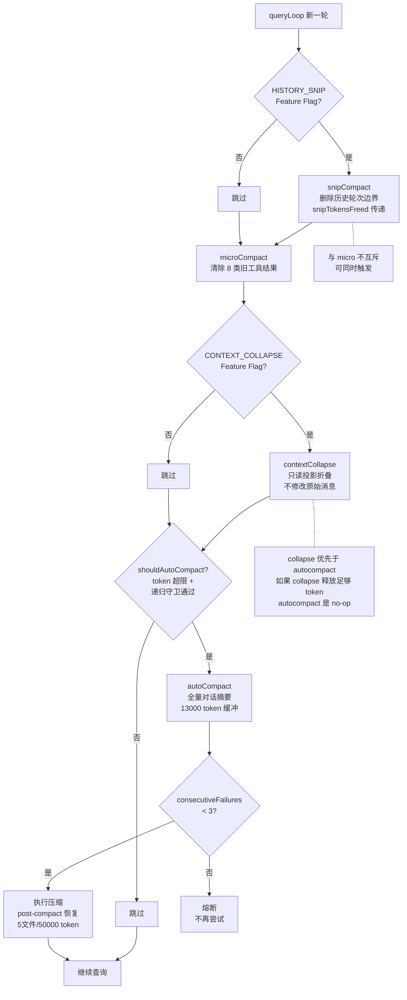
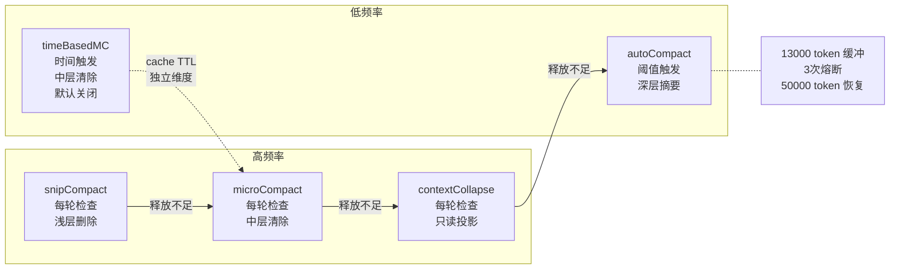

# 第 11 章：上下文的五把剪刀

> "一个上下文窗口的死亡方式不只有一种。5 种剪刀，5 种死法，5 种救法。"

同一个问题——"上下文太长了怎么办"——Claude Code 有 5 种不同的答案，每种答案针对不同的失败场景。理解为什么需要 5 种而非 1 种，比知道每种怎么用更重要。读完本章，你将理解每种压缩策略背后编码的"模型能力假设"，以及 queryLoop 中从轻到重的防线链如何在不丢失关键信息的前提下压缩 token 消耗。

## 问题——为什么需要 5 种压缩策略而非 1 种

如果上下文管理只有一个问题，就不需要 5 种策略。5 种策略的存在本身说明这是 5 个独立问题：

- **token 超限**——对话太长，超过上下文窗口，需要全量摘要
- **旧工具结果占位**——早先轮次的文件读取、命令输出占据大量空间，但模型已经不需要它们了
- **cache TTL 过期**——超过 1 小时后，服务端缓存已经失效，继续发送旧的工具结果是纯浪费
- **历史轮次边界**——某些历史消息块可以整段删除而不影响当前任务的连贯性
- **API 413 响应**——即使所有预防措施都做了，API 仍然返回"请求过长"，需要紧急压缩

queryLoop 中的执行顺序揭示了策略间的逻辑关系——源码注释说明："Apply snip before microcompact (both may run — they are not mutually exclusive)"（译：在 microcompact 之前应用 snip，两者可以同时运行——它们不是互斥的），紧接着 "Apply microcompact before autocompact"（译：在 autocompact 之前应用 microcompact）。轻量级策略先行，重量级策略托底。如果轻量级策略已经释放了足够的 token，重量级策略就不会触发。

| 策略 | 目标场景 | 触发频率 | 压缩深度 |
|------|---------|---------|---------|
| snipCompact | 历史轮次边界 | 每轮检查 | 浅（删除整块消息） |
| microCompact | 旧工具结果占位 | 每轮检查 | 中（清除工具输出） |
| contextCollapse | 可折叠上下文投影 | 每轮检查 | 中（只读投影，不修改原始消息） |
| autoCompact | token 超限 | 阈值触发 | 深（全量对话摘要） |
| timeBasedMC | cache TTL 过期 | 时间阈值 | 中（清除过期工具结果） |

**原则 11.1：压缩策略按问题分而非按算法分** — 上下文压缩策略**必须**针对不同的失控场景分别设计，而非用一种"万能摘要"应对所有情况。**禁止**将不同触发条件的压缩合并为同一策略——合并意味着要么漏掉某些场景，要么在不必要的时候触发。

## 黄金法则——每种策略编码一个"模型能力假设"

每种压缩策略不是算法选择，而是一条工程断言——"在这种条件下，模型的记忆能力边界在这里"。源码中的常量就是这些断言的数值表达。

`AUTOCOMPACT_BUFFER_TOKENS = 13000` 是 autoCompact 的核心假设：给模型留 13000 token 的缓冲区来生成摘要。这个数字编码了断言"模型需要至少 13000 token 的空间才能完成一次高质量的对话摘要"——如果缓冲区太小，摘要生成会被截断，丢失关键信息。

`timeBasedMC` 的 60 分钟阈值直接映射到 cache TTL 的工程假设。注释说明了选择："60 is the safe choice: the server's 1h cache TTL is guaranteed expired"（译：60 是安全选择——服务端 1 小时的缓存 TTL 保证已过期）。这不是关于模型能力的假设，而是关于基础设施的假设——cache 过期后，旧的工具结果既占据 token 又不提供缓存加速效果。

`POST_COMPACT_MAX_FILES_TO_RESTORE = 5` 编码了断言"模型在压缩边界后需要哪些上下文才能继续工作"——最多恢复 5 个最近读取的文件。数字 5 来自工程经验：太少则模型丢失当前工作文件，太多则恢复成本抵消了压缩收益。

| 策略 | 编码的"能力假设" | 源码常量 |
|------|-----------------|---------|
| autoCompact | 模型生成摘要需要 13000 token 缓冲区 | `AUTOCOMPACT_BUFFER_TOKENS=13000` |
| autoCompact | 连续 3 次失败应停止重试 | `MAX_CONSECUTIVE_AUTOCOMPACT_FAILURES=3` |
| autoCompact | 压缩后需要 50000 token 预算恢复上下文 | `POST_COMPACT_TOKEN_BUDGET=50000` |
| microCompact | 只有 8 类工具的结果值得清除 | `COMPACTABLE_TOOLS`（8 种） |
| timeBasedMC | cache TTL 过期后旧内容无缓存价值 | `gapThresholdMinutes=60` |

**原则 11.2：压缩参数即模型能力声明** — 每个压缩阈值和缓冲区**必须**基于对模型能力的工程判断，而非随意设置。如果模型能力变化（如上下文窗口扩大），这些参数**必须**相应调整——它们不是常量，是变量。

## 适用场景——什么条件下哪种压缩触发

5 种策略按照"触发频率 × 压缩深度"形成从轻到重的梯度。

**snipCompact（浅层、每轮检查）**——检查历史消息中是否存在可以整段删除的轮次边界。适合多轮对话中早期轮次与当前任务无关的场景。触发条件是 Feature Flag 控制。

**microCompact（中层、每轮检查）**——检查工具结果是否可以被清除。`COMPACTABLE_TOOLS` 白名单定义了 8 类可清除的工具：FileRead、Shell、Grep、Glob、WebSearch、WebFetch、FileEdit、FileWrite。白名单外的工具结果（如自定义 MCP 工具）不会被清除。

**contextCollapse（中层、每轮检查）**——与前两种不同，collapse 不修改原始消息数组，而是在读取时投影一个"折叠视图"。折叠后的消息不在 REPL 数组中，而在 collapse store 中——这意味着折叠可以跨轮次持久化。

**autoCompact（深层、阈值触发）**——当 token 使用量超过 `getAutoCompactThreshold(model)` 时触发。可以通过 `DISABLE_AUTO_COMPACT` 环境变量完全禁用。`isAutoCompactEnabled()` 让这个开关独立于其他策略。

**timeBasedMC（中层、时间阈值触发）**——默认关闭（`enabled: false`）。适合会话生命周期超过 1 小时的长会话场景，清除 cache TTL 过期后的旧工具结果。需要用户手动配置才能启用。

## 工作原理——5 种策略的执行机制

5 种策略在 queryLoop 中以固定顺序执行——这个顺序不是随意的，而是经过设计的防线链。源码注释清晰地标记了每一步的检查点：`query_snip_start` → `query_microcompact_start` → `query_autocompact_start`。

**图 11-1：queryLoop 中的压缩决策树**

**第一步：snipCompact**

检查历史消息中是否存在轮次边界。如果存在，删除边界之前的消息，计算释放的 token 数（`snipTokensFreed`）。这个数字被传递给后续的 autoCompact——因为 snip 删除了消息，但存活的 assistant 消息的 usage 字段仍反映删除前的 token 计数。源码注释解释："Snip removes messages but the surviving assistant's usage still reflects pre-snip context, so tokenCountWithEstimation can't see the savings."（译：Snip 删除了消息但存活的 assistant 的 usage 仍反映 snip 前的上下文，所以 tokenCountWithEstimation 看不到节省量）。

**第二步：microCompact**

清除白名单中 8 类工具的旧结果。被清除的结果替换为占位消息 `'[Old tool result content cleared]'`。microCompact 与 snip 不是互斥的——同一轮可以两者都触发。microCompact 在 autoCompact 之前运行，是因为如果轻量级清除已经释放了足够 token，就不需要触发代价更高的全量摘要。

**第三步：contextCollapse**

与前两种策略不同，collapse 不修改原始消息数组。它在读取时投影一个"折叠视图"——折叠后的消息存储在独立的 collapse store 中。这个设计使得折叠可以跨轮次持久化：每次进入 queryLoop 时，`projectView()` 重放提交日志生成当前视图。源码注释解释了为什么 collapse 在 autoCompact 之前运行："Runs BEFORE autocompact so that if collapse gets us under the autocompact threshold, autocompact is a no-op and we keep granular context instead of a single summary."（译：在 autocompact 之前运行，这样如果 collapse 让 token 数低于 autocompact 阈值，autocompact 就不需要运行，我们保留细粒度的上下文而非一个摘要）。

**第四步：autoCompact**

最重量级的策略——生成完整的对话摘要，替换整个历史。触发条件是 token 使用量超过模型特定的阈值。执行前有 3 层递归守卫：`session_memory` 和 `compact` 查询源不触发（防止死锁），`marble_origami`（上下文 Agent）不触发（防止破坏主线程的已提交日志）。`REACTIVE_COMPACT` Feature Flag 可以关闭主动 autoCompact，改为仅响应 API 413 错误触发。

**post-compact 恢复**

压缩完成后，系统恢复最近读取的最多 5 个文件，使用 50000 token 的预算。这是压缩后"重建模型工作记忆"的关键步骤——没有它，模型在摘要后无法继续工作。

| 策略 | 触发条件 | 压缩范围 | 代价 |
|------|---------|---------|------|
| snipCompact | Feature Flag + 轮次边界 | 删除整块历史消息 | 无 API 调用，丢失旧消息 |
| microCompact | 每轮检查 + 白名单工具 | 清除工具输出内容 | 无 API 调用，丢失工具结果 |
| contextCollapse | Feature Flag + 可折叠消息 | 只读投影，不修改原始 | 无 API 调用，可逆 |
| autoCompact | token 超阈值 + 递归守卫 | 全量对话摘要 | 一次 API 调用，不可逆 |
| timeBasedMC | cache TTL 过期 + 手动启用 | 清除过期工具结果 | 无 API 调用，默认关闭 |

## 权衡——多策略并存的 3 个设计代价

| 决策维度 | 选择 A（本系统） | 选择 B | 核心权衡 |
|---------|----------------|--------|---------|
| 熔断机制 | 3 次失败停止 | 无限重试 | 保护 API 资源 vs 放弃压缩 |
| 策略并发 | snip + micro 可同时触发 | 严格互斥 | 更细粒度控制 vs 行为不可预测 |
| 时间阈值 | 默认关闭（实验性） | 默认开启 | 安全验证 vs 功能可达性 |

**代价一：熔断机制是真实生产事故的产物**

`MAX_CONSECUTIVE_AUTOCOMPACT_FAILURES = 3` 不是理论设计——源码注释记录了真实的生产数据："BQ 2026-03-10: 1,279 sessions had 50+ consecutive failures (up to 3,272) in a single session, wasting ~250K API calls/day globally."（译：BQ 2026-03-10：1279 个会话有 50 次以上连续失败（最多 3272 次），每天全球浪费约 25 万次 API 调用）。没有熔断机制，autoCompact 会无限重试，每次都消耗 API token 但无法成功压缩。3 次上限是"快速放弃"与"给足够机会"之间的平衡。

**代价二：多策略并发增加行为不可预测性**

snip 和 micro 可以在同一轮都触发——用户可能在一轮中看到上下文被两种不同的策略同时压缩。这种并发设计让压缩更彻底（轻量级策略组合可能释放足够 token 避免重量级策略），但调试时需要同时考虑两种策略的交互效果。

**代价三：时间阈值默认关闭限制功能可达性**

timeBasedMC 是针对"cache TTL 过期后旧工具结果无缓存价值"的优化，但默认关闭。`enabled: false` 说明这是一个实验性功能——在多策略环境中引入新策略需要验证它不会与其他策略冲突。代价是用户需要手动配置才能获益。

## 踩坑指南——压缩策略中的常见错误

**陷阱一：autoCompact 在 compact 查询源中触发死锁**

`shouldAutoCompact` 有递归守卫：`session_memory` 和 `compact` 查询源直接返回 false。原因很直接——autoCompact 本身通过 forkedAgent 执行压缩，如果压缩查询再次触发 autoCompact，会无限递归。守卫不是"防御性编程"，是真实会触发的死锁预防。

❌ 错误做法：在自定义的 forkedAgent 中忽略查询源（`querySource`）参数，让压缩逻辑在所有查询源中无条件触发。  
✓ 正确做法：所有压缩逻辑必须检查查询源——`compact`、`session_memory`、`marble_origami` 等查询源应跳过压缩。

**陷阱二：期望 microCompact 清除自定义工具结果**

`COMPACTABLE_TOOLS` 只包含 8 种内置工具。自定义 MCP 工具、自定义 Agent 工具的结果不在白名单中——microCompact 不会清除它们。如果一个自定义工具返回了 5000 token 的输出，它将一直保留在上下文中，直到 autoCompact 全量摘要。

❌ 错误做法：假设所有工具输出都会被 microCompact 自动管理，不控制自定义工具的输出长度。  
✓ 正确做法：为自定义工具实现结果截断。如果工具输出可能很长，在工具内部限制返回长度——microCompact 的白名单不会扩展到自定义工具。

**陷阱三：忽视熔断后上下文继续增长**

autoCompact 连续失败 3 次后熔断，不再尝试压缩。但对话继续进行，token 持续增长。如果不监控熔断状态，上下文会一直增长到 API 的 `blocking_limit`，最终整个会话崩溃。

❌ 错误做法：在 autoCompact 熔断后继续正常使用，不调整行为。  
✓ 正确做法：监控 `consecutiveFailures` 状态。如果熔断触发，考虑手动压缩（`/compact` 命令）或开新会话。

## 实证——从 token 计数到压缩触发的决策链

一次 autoCompact 触发的完整路径可以从 `calculateTokenWarningState` 追踪到 `compactConversation`。

**入口**：`calculateTokenWarningState`（`src/services/compact/autoCompact.ts:93`）计算当前 token 使用百分比。它返回三个状态：`percentLeft`（剩余百分比）、`isAboveWarningThreshold`（超过警告阈值，使用 20000 token 缓冲）、`isAboveAutoCompactThreshold`（超过自动压缩阈值，使用 13000 token 缓冲）。

**触发判断**：`shouldAutoCompact`（`src/services/compact/autoCompact.ts:160`）执行 3 层递归守卫检查——查询源不是 `session_memory` 或 `compact`（防死锁），不是 `marble_origami`（防破坏主线程），Feature Flag 未禁用。如果全部通过，检查 token 数是否超过阈值，减去 `snipTokensFreed`（snip 已经释放的 token）。

**执行**：`autoCompactIfNeeded`（`src/services/compact/autoCompact.ts:241`）检查 `consecutiveFailures`——如果小于 3，调用 `compactConversation` 生成摘要。摘要使用 20000 token 的输出预算，保留系统提示词和用户上下文。

**恢复**：压缩后，`POST_COMPACT_MAX_FILES_TO_RESTORE = 5` 和 `POST_COMPACT_TOKEN_BUDGET = 50000`（`src/services/compact/compact.ts:122-123`）控制资源恢复。系统重新读取最近 5 个文件，使用最多 50000 token 的预算重建模型的工作记忆。

**图 11-2：5 种策略的能力/频率矩阵**

这条路径验证了多策略并存的核心理念：轻量级策略（snip、micro）在每轮都运行，如果它们释放了足够 token，重量级策略（autoCompact）就不需要触发。只有当所有轻量级策略都释放不足时，autoCompact 才作为最后一道防线执行全量摘要。

## 本章主成分：五种压缩策略的本质

**本质**：5 种策略分别针对 token 超限（autoCompact）、旧工具结果占位（microCompact）、cache TTL 过期（timeBasedMC）、历史轮次边界（snipCompact）和可折叠上下文（contextCollapse）5 种独立的上下文失控场景。每种策略的参数编码了对模型能力和基础设施的工程假设。

**关键机制**：
- 执行顺序：轻到重的防线链（snip → micro → collapse → autoCompact）
- 熔断机制：`MAX_CONSECUTIVE_AUTOCOMPACT_FAILURES=3`（生产数据驱动）
- 工具白名单：`COMPACTABLE_TOOLS` 只覆盖 8 种内置工具
- 缓冲区设计：13000 token 摘要缓冲 + 50000 token 恢复预算

**适用边界**：
- ✓ 适合：长会话多轮对话的 Agent 系统
- ✓ 适合：需要在不同压缩深度间灵活选择的场景
- ✗ 不适合：短会话单轮任务（不需要任何压缩策略）

**与其他模式的关系**：
- 本章的压缩边界是第 12 章（forkedAgent 上下文隔离）的前置概念——fork 前需要决定传递多少上下文
- 第 3 章（QueryEngine 循环）是压缩策略的触发宿主——每轮循环都检查是否需要压缩
- 第 10 章（Hooks）的 `PreCompact` 和 `PostCompact` 触发点在压缩前后提供拦截机会

## 你能做什么

- **监控上下文使用百分比**。`calculateTokenWarningState` 的 `percentLeft` 可以在用户界面中显示——让用户知道压缩何时可能触发。
- **为自定义工具实现结果截断**。microCompact 只覆盖 8 种内置工具——自定义工具的长输出不会被自动清除，在工具内部限制返回长度。
- **设置合理的摘要缓冲区**。`AUTOCOMPACT_BUFFER_TOKENS=13000` 是保守选择——如果实现类似系统，宁可多留空间也不要让摘要生成被截断。
- **加入熔断机制**。参考 `MAX_CONSECUTIVE_AUTOCOMPACT_FAILURES=3`——生产数据证明没有熔断会浪费大量 API 调用。
- **长会话场景启用时间阈值压缩**。如果会话生命周期超过 1 小时，timeBasedMC 可以清除 cache TTL 过期后的旧工具结果——但需要手动启用。
- **检查你的 COMPACTABLE_TOOLS 等价配置**。不是所有工具结果都值得被 microCompact 处理——只有可能产生大输出的工具才需要进入白名单。
- **设计压缩后的资源恢复策略**。参考 `POST_COMPACT_MAX_FILES_TO_RESTORE=5` 和 `POST_COMPACT_TOKEN_BUDGET=50000`——没有恢复，模型在摘要后无法继续工作。

---

**下一章导读**：本章看到了 5 种压缩策略如何在 queryLoop 中逐级收缩上下文。但当 Harness 需要同时执行多个子任务时，压缩不再是"在同一个上下文中腾空间"的问题——而是"如何为每个子任务隔离独立的上下文"。第 12 章将展示 forkedAgent 如何通过上下文隔离实现并行执行，以及这种隔离带来的"上下文分裂"代价。
