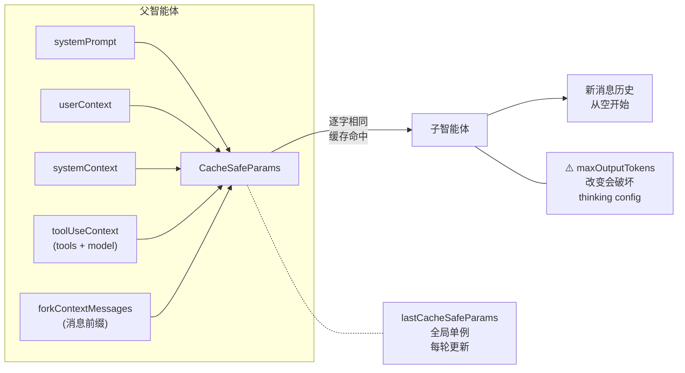
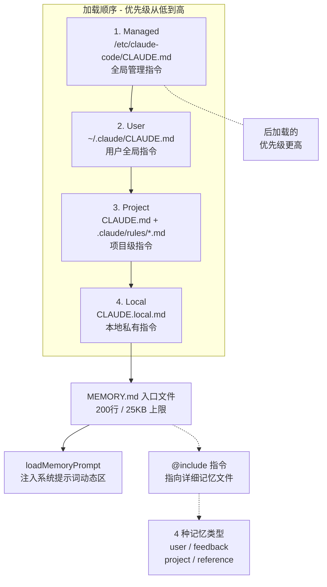

# 第 12 章：隔离与交接

> "隔离不是遗忘，是选择性遗忘。遗忘的是历史，记住的是规则和能力。"

fork 一个子智能体，它的对话历史是空的，但 Prompt Cache 是热的——隔离了让模型分心的历史对话，保留了让 API 调用省钱的缓存。"清空"与"继承"同时发生。读完本章，你将理解 CacheSafeParams 如何定义这条分界线，以及 MEMORY.md 四层记忆架构如何在会话间传递"不可从项目状态推导的信息"。

## 问题——上下文重置和 Prompt Cache 如何兼顾

forkedAgent（分支智能体）必须同时满足两个看似矛盾的目标：清空对话历史（防止历史噪音干扰子任务）和保持 Prompt Cache 热（不浪费已缓存的 token）。

源码注释说明了 helper 的定位："Helper for running forked agent query loops with usage tracking"（译：用于运行分支智能体查询循环并跟踪使用情况的辅助工具）。矛盾的核心在于 API 缓存机制——缓存 key 由系统提示词、工具、模型、消息前缀和思考配置组成。如果 fork 时完全重置上下文，缓存 key 全部改变，每次 fork 都是"冷启动"；如果不重置上下文，子任务会被父智能体的历史对话干扰。

解法在 `CacheSafeParams` 的注释中直接揭示："Parameters that must be identical between the fork and parent API requests to share the parent's prompt cache. The Anthropic API cache key is composed of: system prompt, tools, model, messages (prefix), and thinking config."（译：在分支和父智能体 API 请求之间必须完全相同的参数，以共享父智能体的提示词缓存。Anthropic API 的缓存 key 由以下部分组成：系统提示词、工具、模型、消息前缀和思考配置）。

| 目标 | 操作 | 效果 |
|------|------|------|
| 清空历史 | 子智能体的消息历史从空开始 | 子任务不受父对话干扰 |
| 保持缓存 | 5 个 CacheSafeParams 逐字相同 | API 缓存 key 不变，命中缓存 |
| 两者兼得 | 清空消息但保持系统级参数 | 隔离历史 + 继承缓存 |

**原则 12.1：上下文隔离不等于缓存失效** — Agent 系统的上下文隔离**必须**区分"对话历史"和"API 缓存参数"两个维度。清空对话历史时，**禁止**同时改变影响缓存的参数——否则隔离的代价是缓存完全失效。

## 黄金法则——隔离历史，继承能力

forkedAgent 的核心原则是"对话历史归子智能体，Prompt Cache 属于 API 边界"——清空历史不等于清空缓存。`CacheSafeParams` 类型定义了这条分界线上的 5 个参数。

**图 12-1：forkedAgent 参数继承关系**

5 个参数各有明确的缓存角色：

- **systemPrompt**——系统提示词，**必须**与父智能体逐字相同。注释直接标记："must match parent for cache hits"（译：必须与父智能体匹配才能命中缓存）
- **userContext**——用户上下文，注入到消息前缀，影响缓存
- **systemContext**——系统上下文，追加到系统提示词，影响缓存
- **toolUseContext**——工具配置和模型选择，包含 tools 和 model
- **forkContextMessages**——父智能体的消息历史，作为缓存前缀传入。注释说明："Parent context messages for prompt cache sharing"（译：用于提示词缓存共享的父上下文消息）

`lastCacheSafeParams` 是一个全局单例——主循环每轮结束后写入，供后续所有 fork 复用。这意味着 Stop Hook 验证、记忆压缩、技能执行等所有 fork 场景都共享同一套缓存参数，不需要每个调用方重新传递。

**原则 12.2：交接的内容是"能力"而非"记忆"** — fork 时子智能体继承的是系统提示词、工具和模型（能力），而非对话历史（记忆）。对话历史是任务上下文，不应跨 fork 传递——每个子任务**必须**有独立的记忆空间。

## 适用场景——什么任务应该 fork 子智能体

需要独立对话历史但共享能力配置的任务都适合 fork。`forkLabel` 字段记录了 Claude Code 内部的 fork 使用场景——注释说明："Label for analytics (e.g., 'session_memory', 'supervisor')"（译：用于分析的标签，如 'session_memory'、'supervisor'）。

| 场景 | forkLabel | 说明 |
|------|-----------|------|
| 记忆压缩 | `session_memory` | 压缩对话摘要，详见第 11 章 |
| Stop Hook 验证 | `supervisor` | 验证任务是否完成，详见第 10 章 |
| 技能执行 | `skill` | 执行独立技能的 AI 对话 |
| 自动记忆提取 | `extract_memories` | 从对话中提取值得记忆的内容 |
| 上下文折叠 | `marble_origami` | 可折叠上下文的独立 Agent |

每种场景都需要独立历史（子任务不应被父对话干扰），但共享相同的系统能力（工具、模型、提示词）。fork 的价值恰恰在于"能力继承 + 历史隔离"——如果不需要独立历史，直接在主循环中执行即可。

## 工作原理——fork 机制和分层记忆

fork 机制和分层记忆架构共同构成了 Claude Code 的"记忆管理系统"——前者解决当前对话中跨任务的上下文隔离，后者解决跨会话的信息持久化。

### fork 机制

`runForkedAgent` 是 fork 的执行入口。它复用 `CacheSafeParams`（5 个参数完全相同），但消息历史从空开始——子智能体只能看到自己的任务提示和工具调用结果。`forkContextMessages` 以只读方式传入作为缓存前缀，子智能体不能修改这部分历史——这个设计保持了 API 缓存 key 的一致性。

### 四层记忆架构

源码注释定义了四层记忆的加载顺序："Files are loaded in the following order: 1. Managed memory — Global instructions for all users; 2. User memory — Private global instructions for all projects; 3. Project memory — Instructions checked into the codebase; 4. Local memory — Private project-specific instructions."（译：文件按以下顺序加载：1. 托管记忆——所有用户的全局指令；2. 用户记忆——所有项目的私有全局指令；3. 项目记忆——检入代码库的指令；4. 本地记忆——私有的项目特定指令）。

加载顺序是优先级的逆序——后加载的优先级更高。"Files are loaded in reverse order of priority, i.e. the latest files are highest priority with the model paying more attention to them."（译：文件按优先级的逆序加载，即最后加载的文件优先级最高，模型会更关注它们）。

**图 12-2：MEMORY.md 四层记忆架构**

### MEMORY.md 入口文件

`ENTRYPOINT_NAME = 'MEMORY.md'`——记忆系统的入口文件。它有严格的大小限制：`MAX_ENTRYPOINT_LINES = 200`（最多 200 行）和 `MAX_ENTRYPOINT_BYTES = 25_000`（最多 25000 字节）。注释说明了为什么是 25KB："~125 chars/line at 200 lines. At p97 today; catches long-line indexes that slip past the line cap (p100 observed: 197KB under 200 lines)."（译：200 行约每行 125 字符。当前处于 p97 水平；捕获了绕过行数限制的长行索引（观察到 p100：200 行内 197KB））。

这个数字是真实数据驱动的——只限制行数不够（一行可以极长），必须同时限制字节数。25KB 是"足够存放重要记忆"与"不消耗过多 token"之间的平衡点。

### 4 种记忆类型

`MEMORY_TYPES = ['user', 'feedback', 'project', 'reference']`。源码注释定义了记忆的选择标准："Memories are constrained to four types capturing context NOT derivable from the current project state. Code patterns, architecture, git history, and file structure are derivable (via grep/git/CLAUDE.md) and should NOT be saved as memories."（译：记忆被限制为四种类型，捕获从当前项目状态**不可推导**的上下文。代码模式、架构、git 历史和文件结构是可推导的（通过 grep/git/CLAUDE.md），**不应**被保存为记忆）。

| 记忆类型 | 含义 | 示例 |
|---------|------|------|
| `user` | 用户偏好 | "用户喜欢函数式风格" |
| `feedback` | 用户反馈 | "上次生成的测试太简单，需要更多边界用例" |
| `project` | 项目级知识 | "这个项目使用 Effect-TS 错误处理" |
| `reference` | 参考资料 | "React Server Components 的核心限制" |

### 自动记忆提取

`initExtractMemories` 实现了自动记忆提取——从对话中识别值得记忆的内容并写入记忆文件。它是异步的：对话结束后触发，不阻塞主流程。每次会话独立初始化（闭包设计），避免上一次会话的提取状态影响新会话。

## 权衡——fork 和记忆系统的 3 个设计代价

| 决策维度 | 选择 A（本系统） | 选择 B | 核心权衡 |
|---------|----------------|--------|---------|
| maxOutputTokens | CAUTION 标记，不推荐修改 | 自由设置 | 缓存安全 vs 输出控制 |
| 入口文件大小 | 25KB/200 行（p97 数据驱动） | 无限制或更大 | token 消耗 vs 信息完整性 |
| 自动提取 | 闭包隔离，每次会话独立 | 全局单例 | 隔离性 vs 实现简单 |

**代价一：maxOutputTokens 的缓存陷阱**

fork 时设置 `maxOutputTokens` 会意外改变 thinking config。注释用 CAUTION 标记了这个问题："setting this changes both max_tokens AND budget_tokens... a different budget_tokens will invalidate the cache"（译：设置此值会同时改变 max_tokens 和 budget_tokens，不同的 budget_tokens 会使缓存失效）。这个约束非常隐蔽——开发者可能只是想限制子智能体的输出长度，却无意间破坏了所有缓存。

**代价二：入口文件大小的精确校准**

25KB/200 行的上限基于 p97 数据——即 97% 的用户 MEMORY.md 在此范围内。超过此限制的内容被截断。这意味着极端情况下（项目非常复杂），重要的记忆信息可能被截断丢失。但无限制的代价更严重——如果入口文件不限制大小，它可能消耗数万 token，直接影响上下文窗口的可用空间。

**代价三：自动提取的闭包隔离**

`initExtractMemories` 每次会话重新初始化，不共享跨会话状态。这保证了隔离性（上一次提取不会影响本次），但代价是每次会话都要重新设置提取环境。如果提取逻辑需要大量初始化（如加载模型配置），重复初始化的成本不可忽略（推断）。

## 踩坑指南——fork 和记忆系统中的常见错误

**陷阱一：fork 时修改 CacheSafeParams 中的任一参数**

注释明确标记："must be identical between the fork and parent API requests"（译：在分支和父智能体 API 请求之间必须完全相同）。哪怕系统提示词中只多了一个空格，缓存就会全部失效。对于频繁 fork 的场景（如每次 Stop Hook 验证），缓存失效意味着每次都付出完整的 API 调用成本。

❌ 错误做法：fork 时"稍微调整"系统提示词，加入子任务特定的指令。  
✓ 正确做法：子任务指令通过消息传入（不影响缓存），系统提示词保持逐字相同。子任务的特定需求用用户消息或系统上下文表达——这些不通过 CacheSafeParams 管理。

**陷阱二：在记忆文件中记录可推导的信息**

memoryTypes 注释明确说明："Code patterns, architecture, git history, and file structure are derivable (via grep/git/CLAUDE.md) and should NOT be saved as memories."（译：代码模式、架构、git 历史和文件结构是可推导的，不应保存为记忆）。记忆的定位是"不可推导的上下文"——用户偏好、历史决策、反馈。如果记忆中填满了可推导的信息，入口文件的 25KB 配额很快耗尽。

❌ 错误做法：在记忆文件中记录"项目使用 React 框架，路由在 src/routes/"——这些信息通过看代码就能获得。  
✓ 正确做法：记录"用户偏好函数式风格而非面向对象"、"上次重构时因为类型安全问题选择了 Zod 而非 io-ts"——这些是**不可从代码推导**的决策上下文。

**陷阱三：MEMORY.md 超过 25000 字节后重要信息被截断**

入口文件有双重限制（200 行 + 25KB）。超过限制后内容被截断——不在末尾的内容可能被保留，而在末尾的重要信息可能丢失。

❌ 错误做法：将所有记忆内容直接写入 MEMORY.md，不做分层组织。  
✓ 正确做法：MEMORY.md 只放索引和最关键的条目（200 行以内），详细内容用 `@include` 指令指向独立的记忆文件。这样即使入口文件截断，详细文件仍可通过 @include 路径找到。

## 实证——自动记忆提取的完整流程

自动记忆提取从对话结束到下次会话可用，经过了异步的、增量的、闭包隔离的完整路径。

**初始化**：会话启动时，`initExtractMemories`（`src/services/extractMemories/extractMemories.ts:296`）创建独立的闭包状态——提取队列、已处理的消息 ID 集合、写入频率控制。闭包确保跨会话隔离。

**触发**：对话 Stop 后，提取机制异步触发。它扫描对话中的关键信息——用户反馈、项目决策、偏好表达。过滤标准是 memoryTypes 的定义：只提取"不可从项目状态推导的信息"。

**写入**：提取结果写入记忆文件目录。`MEMORY_TYPES` 的 4 种类型决定文件的分类——用户偏好写入 `user` 类型，项目决策写入 `project` 类型。每个记忆文件有 frontmatter 标记类型和元数据。

**更新入口**：`MEMORY.md` 入口文件（`src/memdir/memdir.ts:34`）更新索引。入口文件受 200 行/25KB 限制约束——如果新增记忆导致超限，较旧的条目被截断。

**下次加载**：新会话启动时，`loadMemoryPrompt`（`src/memdir/memdir.ts:419`）按四层顺序加载记忆文件，最后加载 MEMORY.md 入口文件。所有记忆内容注入系统提示词的动态区域，成为模型的"先验知识"。`MAX_MEMORY_CHARACTER_COUNT = 40000`（`src/utils/claudemd.ts:92`）控制记忆总量的上限。

这条路径验证了记忆系统的设计理念：记忆不是"把对话历史保存下来"，而是"从对话中提取不可推导的上下文，在下次会话中以最小的 token 代价注入"。入口文件的 25KB 限制、4 种类型的严格分类、闭包隔离的状态管理——每个设计决策都在"信息完整性"和"token 效率"之间寻找精确的平衡点。

## 本章主成分：隔离与交接的本质

**本质**：fork 时隔离对话历史（子智能体从零开始），交接 Prompt Cache（5 个参数逐字相同）——"清空"与"继承"同时发生。记忆系统通过 4 层架构和 MEMORY.md 入口文件在会话间传递"不可从项目状态推导的信息"。

**关键机制**：
- `CacheSafeParams`：5 个参数（systemPrompt/userContext/systemContext/toolUseContext/forkContextMessages）
- `lastCacheSafeParams`：全局单例，每轮更新，所有 fork 共享
- `MEMORY.md`：200 行/25KB 入口文件，`@include` 指向详细文件
- 4 种记忆类型：`user`/`feedback`/`project`/`reference`
- 自动记忆提取：闭包隔离，异步执行，只提取不可推导信息

**适用边界**：
- ✓ 适合：需要子任务隔离但共享缓存的并行 Agent 系统
- ✓ 适合：需要跨会话记忆持久化的长周期 Agent
- ✗ 不适合：单任务单会话的简单 Agent（不需要 fork 和记忆系统）

**与其他模式的关系**：
- 本章是第 11 章（压缩策略）的延伸——autoCompact 用 fork 生成摘要
- 第 10 章（Hooks）的 Stop Hook 通过 fork 验证任务完成
- 第 13 章（生成器与评估器）中每个 Agent 都是一次 fork

## 你能做什么

- **实现 fork 时确保 CacheSafeParams 逐字相同**。系统提示词、用户上下文、系统上下文、工具配置、消息前缀——任何一个字不同都会破坏缓存。
- **避免在 fork 时设置 maxOutputTokens**。它会改变 thinking config（budget_tokens），破坏缓存——用 CAUTION 标记的隐蔽陷阱。
- **用 forkLabel 标记不同场景的 fork**。`session_memory`、`supervisor`、`skill`——标签让调试和监控成为可能。
- **为你的 Agent 建立分层记忆系统**。区分全局规则（User 层）和项目规则（Project 层），后加载的优先级更高（详见第 5 章记忆加载机制）。
- **把 MEMORY.md 入口文件控制在 200 行/25KB 以内**。超出部分用 `@include` 指向详细文件——入口文件是索引，不是全文。
- **在记忆文件中只记录不可推导的信息**。用户偏好、历史决策、反馈——代码模式、架构、文件结构可以通过 grep/git 获得不应占用记忆配额。
- **实现自动记忆提取时使用闭包隔离状态**。每次会话独立初始化，防止跨会话的状态泄漏。

---

**下一章导读**：本章看到了 fork 如何在隔离和继承之间找到平衡。但当 Harness 需要同时运行多个智能体协同工作时，单层的 fork 就不够了——需要一个"调度器"来编排它们的协作和竞争。第 13 章将展示生成器与评估器模式如何让多个智能体在共享上下文中分工协作，以及这种协作带来的"上下文争用"挑战。
