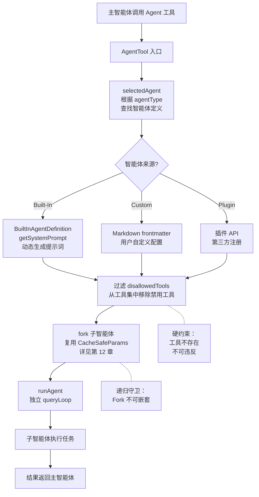
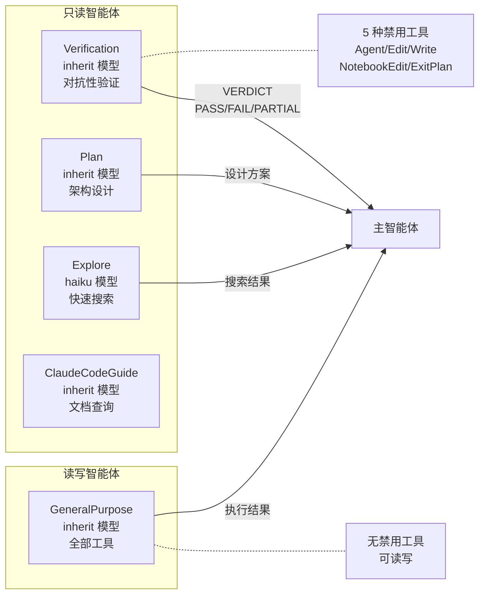

# 第 13 章：生成器与评估器

> "同一个模型，既当选手又当裁判，结果必然偏颇。GAN 用两个网络对抗解决这个问题——Harness 用两个 Agent。"

一个模型负责写代码，另一个模型负责验证——这不是简单的分工，而是一种对抗关系。planAgent 只能看不能改，verificationAgent 的工作不是确认"能运行"，而是"拼命让它崩溃"。理解这种 GAN 式的生成/验证分离，比知道具体有哪些内置智能体更重要。读完本章，你将理解 `disallowedTools` 如何实现比提示词更强硬的能力隔离，以及 Harness 如何用"让模型对抗模型"的方式解决自我评估偏差。

## 问题——为什么模型不能自己验证自己

模型生成代码后自我评估存在系统性偏差——这不是 bug，是 LLM 的固有特性。模型倾向于对自己的输出过度自信，跳过边界检查，用"看起来对"代替"实际运行了"。

verificationAgent 的系统提示词直接指出了这种偏差："Your job is not to confirm the implementation works — it's to try to break it."（译：你的工作不是确认实现能运行——而是试图让它崩溃）。更关键的是，提示词用了一个专门的章节标题来对抗这种偏差："RECOGNIZE YOUR OWN RATIONALIZATIONS"（译：识别你自己的合理化借口）。

这个章节列出了模型在验证时最常见的 6 种"偷懒借口"：

1. **"代码看起来正确"**——提示词反击："Reading is not verification. Run it."（译：读代码不是验证，运行它）
2. **"实现者的测试已经通过了"**——提示词反击："The implementer is an LLM. Verify independently."（译：实现者是个 LLM，独立验证）
3. **"大概没问题"**——提示词反击："Probably is not verified. Run it."（译：大概不是已验证，运行它）
4. **"启动服务器看看代码"**——提示词反击："Start the server and hit the endpoint."（译：启动服务器并请求端点）
5. **"我没有浏览器"**——提示词反击：检查是否有 MCP 工具（chrome/playwright），如果存在就使用，不要编造"做不到"的理由
6. **"这太耗时了"**——提示词反击："Not your call."（译：这不是你该决定的）

每一种借口都是一种可预见的失败模式——不是随机错误，而是 LLM 天性的系统表现。verificationAgent 的整个设计就是针对这些天性的对抗措施。

**原则 13.1：自我评估是系统性偏差，不是随机错误** — 模型评估自己输出时**禁止**依赖自我确认。验证者与生成者**必须**是独立的智能体，验证者的提示词**必须**明确对抗已知的自我评估偏差模式。

## 黄金法则——能力隔离比角色隔离更重要

Claude Code 的智能体分离不是通过不同的"角色设定"实现的，而是通过硬性的工具禁用（`disallowedTools`）。planAgent 不能写文件不是因为提示词说"不要写"，而是因为写文件的工具根本不存在。

`disallowedTools` 是 `BaseAgentDefinition` 的一级配置字段——与 `agentType`、`model` 同级。这不是"建议不要使用"，而是"从工具列表中移除"。

| 智能体 | 禁用工具 | 效果 |
|--------|---------|------|
| planAgent | Agent、ExitPlanMode、FileEdit、FileWrite、NotebookEdit（5 种） | 完全只读，不能修改任何文件 |
| verificationAgent | Agent、ExitPlanMode、FileEdit、FileWrite、NotebookEdit（5 种） | 完全只读，不能修改任何文件，不能嵌套 Agent |
| exploreAgent | Agent、ExitPlanMode、FileEdit、FileWrite、NotebookEdit（5 种） | 完全只读，快速搜索 |
| generalPurposeAgent | 无禁用 | 拥有全部工具，可读写 |

Claude Code 选择双保险：提示词约束（软约束）+ 工具移除（硬约束）。planAgent 的提示词仍然写着 "CRITICAL: READ-ONLY MODE - NO FILE MODIFICATIONS"（译：关键：只读模式——禁止文件修改），但同时通过 `disallowedTools` 移除了所有写文件工具。提示词是给模型的"告知"，工具移除是系统的"保障"——即使模型忽略了提示词，它也无法执行写操作。

**原则 13.2：能力隔离优于角色隔离** — 智能体的权限边界**必须**通过工具集控制（硬约束），而非仅通过提示词角色设定（软约束）。提示词可以违反，工具不存在**禁止**违反。

## 适用场景——何时使用哪种内置智能体

6 种内置智能体按"权限范围 × 专精程度"形成从通用到专用的梯度。`getBuiltInAgents` 的注册顺序从 GENERAL_PURPOSE_AGENT 开始，逐步添加专精智能体。

| 智能体 | 权限 | 模型 | 专精 | 典型用途 |
|--------|------|------|------|---------|
| GeneralPurpose | 全部 | inherit（继承主模型） | 通用 | 通用子任务 |
| Explore | 只读 | haiku（外部）/ inherit（内部） | 搜索 | 快速查找文件、搜索关键词 |
| Plan | 只读 | inherit | 架构设计 | 设计方案、分析架构 |
| Verification | 只读 | inherit | 对抗性验证 | 验证实现是否真正完成 |
| ClaudeCodeGuide | 只读 | inherit | 文档查询 | 查询 Claude Code 文档 |
| StatuslineSetup | 只读 | inherit | UI 配置 | 配置状态栏 |

Explore 和 Plan 通过 `areExplorePlanAgentsEnabled()` 控制启用状态。Verification 需要双重条件——`feature('VERIFICATION_AGENT')` 和 GrowthBook flag 同时开启。这种渐进式启用说明成本越高的能力越需要谨慎验证。

## 工作原理——AgentTool 从定义到执行的完整路径

AgentTool 的执行路径是"定义加载 → 工具过滤 → fork 子智能体 → 独立循环 → 结果返回"。每一步都有对应的隔离机制。AgentTool 自身也是一个标准工具——通过 `buildTool` 注册，与其他工具走同一条调度路径。

**图 13-1：AgentTool 执行路径**

**第一步：定义加载**

智能体有三种来源（`AgentDefinition` 联合类型）：BuiltIn（内置，代码定义）、Custom（自定义，Markdown frontmatter）、Plugin（插件，API 注册）。三者共享 `BaseAgentDefinition` 接口——`disallowedTools`、`model`、`omitClaudeMd` 等字段对所有来源统一。

BuiltIn 智能体通过 `getSystemPrompt()` 函数动态生成系统提示词——这意味着提示词可以根据运行时状态（如当前工作目录、Feature Flag）动态调整，而非写死在配置文件中。

**第二步：工具过滤**

`disallowedTools` 列表中的工具从可用工具集中移除。planAgent 和 verificationAgent 共享 5 种禁用工具——Agent、ExitPlanMode、FileEdit、FileWrite、NotebookEdit。这个列表确保了：不能生成子 Agent（防递归）、不能退出 Plan Mode（保持只读状态）、不能修改文件（保持只读）。

**第三步：fork 子智能体**

每个 Agent 在独立的 queryLoop 中执行（详见第 12 章 fork 机制）。复用 `CacheSafeParams` 保持 Prompt Cache 命中。递归守卫阻止嵌套——"Fork is not available inside a forked worker"（译：Fork 在 fork 的 worker 中不可用）。

**第四步：独立循环 → 结果返回**

`runAgent` 启动独立的 queryLoop。子智能体只看到自己的任务提示和工具调用结果，不受主智能体对话历史影响。结果返回给主智能体，作为当前工具调用的输出。

## 权衡——对抗式验证的 3 个设计代价

| 决策维度 | 选择 A（本系统） | 选择 B | 核心权衡 |
|---------|----------------|--------|---------|
| 子智能体 token | omitClaudeMd 省 5-15 Gtok/周 | 完整加载 CLAUDE.md | token 成本 vs 信息完整性 |
| 验证执行方式 | 异步（background: true） | 同步阻塞 | 用户体验 vs 验证及时性 |
| Verification 启用 | 双重 Feature Flag | 默认开启 | 成本控制 vs 功能可达性 |

**代价一：Token 成本与 omitClaudeMd 权衡**

Explore 智能体每周被调用超过 3400 万次。每次调用都加载完整的 CLAUDE.md 层级（包含 commit 规范、PR 模板、lint 配置）对只读智能体毫无意义——它只需要搜索代码，不需要知道 commit 规范。`omitClaudeMd` 注释说明了节省规模："Read-only agents (Explore, Plan) don't need commit/PR/lint guidelines — the main agent has full CLAUDE.md and interprets their results. Saves ~5-15 Gtok/week across 34M+ Explore spawns."（译：只读智能体不需要 commit/PR/lint 指南——主智能体有完整的 CLAUDE.md 并解释它们的输出。在 3400 万次以上的 Explore 调用中每周节省约 5-15 Gtoken）。

**代价二：异步验证的延迟**

Verification Agent 设置为 `background: true`——异步执行，用户不等待结果。主智能体在 Verification 完成前就返回"完成"状态。这意味着问题可能在用户看到"完成"后才被发现。代价是及时性换用户体验——如果 Verification 同步执行，每次实现都要等待完整的验证周期（可能数分钟）。

**代价三：模型依赖**

Verification 的有效性取决于模型是否真的遵循了对抗性提示词。而 "RECOGNIZE YOUR OWN RATIONALIZATIONS" 本身就在和模型的天性斗争——提示词告诉模型"你会想偷懒，不要偷懒"，但模型可能仍然偷懒。需要双重 Feature Flag 启用也暗示 Verification 的可靠性和成本尚未达到默认开启的水平（推断）。

## 踩坑指南——内置智能体中的常见错误

**陷阱一：在 planAgent 中期望它创建临时文件**

`disallowedTools` 包含 FileWrite——即使目标是临时文件也不能写入。planAgent 的"只读"是绝对的，不是"除了临时文件外只读"。

❌ 错误做法：在 planAgent 的提示中要求"先创建一个临时文件记录分析结果"，期望它能绕过只读限制。  
✓ 正确做法：planAgent 的输出通过对话历史返回给主智能体——不需要文件作为中间存储。如果确实需要持久化，由主智能体在 planAgent 完成后写入。

**陷阱二：在 verificationAgent 中期望它修复问题**

verificationAgent 只能报告 `PASS`/`FAIL`/`PARTIAL`——它不能修改源代码来修复发现的问题。这个限制是刻意的：验证者和修复者是不同的角色，混淆两者会让验证者对"自己的修复"产生评估偏差。

❌ 错误做法：在 verificationAgent 的提示中加入"如果发现问题，请修复它"。  
✓ 正确做法：verificationAgent 只负责报告问题。修复由主智能体根据 Verification 结果决定——生成和验证保持分离。

**陷阱三：在子智能体中再次调用 Agent 工具**

递归守卫阻止 Agent 嵌套调用——"Fork is not available inside a forked worker"。如果 generalPurposeAgent 尝试调用 Agent 工具创建子 Agent，会被递归守卫拦截。

❌ 错误做法：在子智能体的任务描述中要求"调用另一个 Agent 处理子任务"。  
✓ 正确做法：子智能体执行原子任务。如果需要分解，由主智能体负责编排多个子智能体的调用顺序。

## 实证——Verification Agent 的对抗性验证流程

一次完整的 Verification 从接收到输出 VERDICT，需要经过构建、测试、对抗性探测、自我审查四个阶段。

**接收**：主智能体调用 Agent 工具，指定 `agentType: 'verification'`。传入任务描述和变更文件列表。`VERIFICATION_AGENT` 定义了它的属性：`background: true`（异步执行）、`color: 'red'`（红色标识，提示高风险）。

**策略选择**：验证策略按变更类型区分——Frontend、Backend、CLI、Infrastructure 等 11 种策略。每种策略定义了不同的验证重点：Frontend 关注渲染和交互，Backend 关注 API 契约和错误处理，Infrastructure 关注幂等性和资源清理。

**执行**：verificationAgent 在独立的 queryLoop 中运行，使用过滤后的工具集（无写操作工具）。它构建项目、运行测试、执行对抗性探测（并发请求、边界输入、幂等性检查、孤儿操作检测）。

**自我审查**：这是最关键的阶段。提示词强制模型进行自我审查——"RECOGNIZE YOUR OWN RATIONALIZATIONS"（`src/tools/AgentTool/built-in/verificationAgent.ts:53`）。模型必须检查自己是否在上一步中产生了偷懒行为——"If you catch yourself writing an explanation instead of a command, stop. Run the command."（译：如果你发现自己正在写解释而不是执行命令，停下来，运行命令）。

**输出 VERDICT**：最终输出三值判定——`PASS`（验证通过）、`FAIL`（验证失败，附带具体原因）、`PARTIAL`（部分通过，说明环境限制导致某些验证无法执行）。三值设计比二值（PASS/FAIL）更诚实——允许 Verification Agent 报告"我没有完全验证"而非被迫选择 PASS 或 FAIL。

**图 13-2：6 种内置智能体权限矩阵**

这条路径验证了 GAN 式生成/验证分离的核心价值：verificationAgent 不是在"帮助"主智能体确认结果，而是在"对抗"主智能体的输出。它的提示词设计、工具限制、三值输出——每一个细节都在对抗模型自我评估的系统性偏差。

## 本章主成分：生成器与评估器的本质

**本质**：通过 `disallowedTools` 实现能力隔离（硬约束），通过对抗性提示词（`RECOGNIZE YOUR OWN RATIONALIZATIONS`）对抗模型自我评估偏差。两者共同构成 GAN 式的生成/验证分离——验证者不是确认者，而是破坏者。

**关键机制**：
- `disallowedTools`：5 种工具硬性禁用，覆盖所有只读智能体
- VERDICT 三值输出：`PASS`/`FAIL`/`PARTIAL`——允许诚实报告验证不完整
- `omitClaudeMd`：只读智能体省略 CLAUDE.md，每周节省 5-15 Gtoken
- `AgentDefinition` 联合类型：BuiltIn | Custom | Plugin 三种来源统一接口

**适用边界**：
- ✓ 适合：需要独立验证的实现任务（特别是高风险修改）
- ✓ 适合：需要能力隔离的多角色 Agent 系统
- ✗ 不适合：单次简单修改（Verification 的成本不值得）
- ✗ 不适合：纯搜索/查询任务（不需要生成/验证分离）

**与其他模式的关系**：
- 本章的每个 Agent 都是第 12 章（forkedAgent）的具体使用场景
- 第 9 章（权限系统）的 `hasPermissionsToUseTool` 在子智能体中同样生效
- 第 14 章（并行世界）将展示多 Agent 并行执行

## 你能做什么

- **为只读智能体设置 `disallowedTools`**。不要只用提示词约束——移除工具才是真正的能力隔离。提示词可以违反，工具不存在不可违反。
- **设计验证智能体时，明确列出模型的"合理化借口"并逐一对抗**。6 种借口不是猜测——它们是 LLM 验证行为的系统性模式。
- **对高频调用的只读智能体使用 `omitClaudeMd`**。Explore 每周 3400 万次调用证明了 token 节省的价值——5-15 Gtoken/周。
- **验证结果使用三值输出**。`PASS`/`FAIL`/`PARTIAL` 允许环境限制的诚实报告——比二值更安全（详见第 7 章工具设计）。
- **为高风险智能体设置双重 Feature Flag 启用条件**。Verification 的成本高，不应该是默认开启的——渐进式启用让成本可控。
- **使用 `BaseAgentDefinition` 统一接口**。内置、自定义、插件共享相同的类型系统——新来源只需要实现统一接口。
- **为每个子智能体设置递归守卫**。防止 Agent 嵌套调用 Agent 导致无限递归——"Fork is not available inside a forked worker"。

---

**下一章导读**：本章看到了单层的生成/验证分离——一个主智能体调用一个子智能体。但当任务可以拆分为多个独立子任务时，串行执行的延迟会成倍增长。第 14 章将展示并行世界——多个 worktree 如何让 Agent 同时在不同分支上独立工作，以及这种并行带来的"世界分裂"和"世界合并"挑战。
