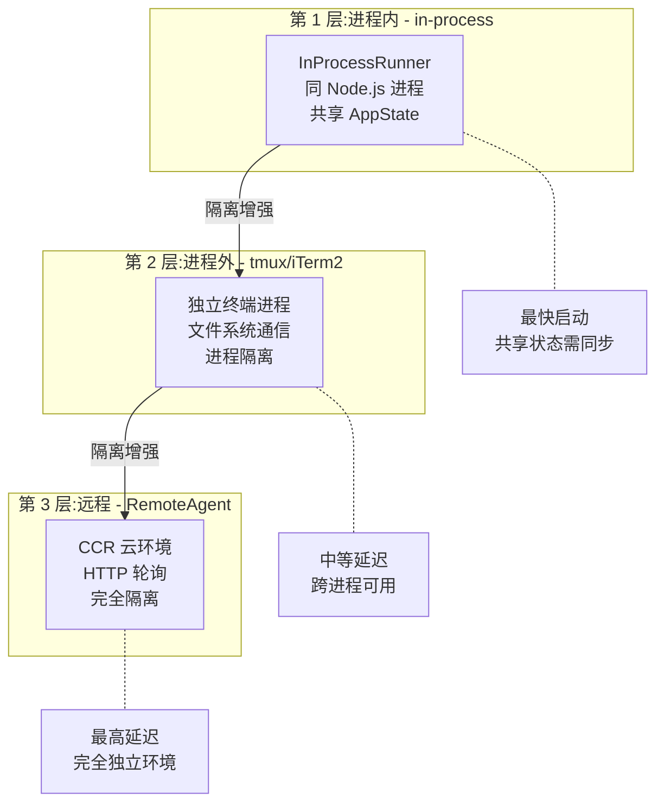
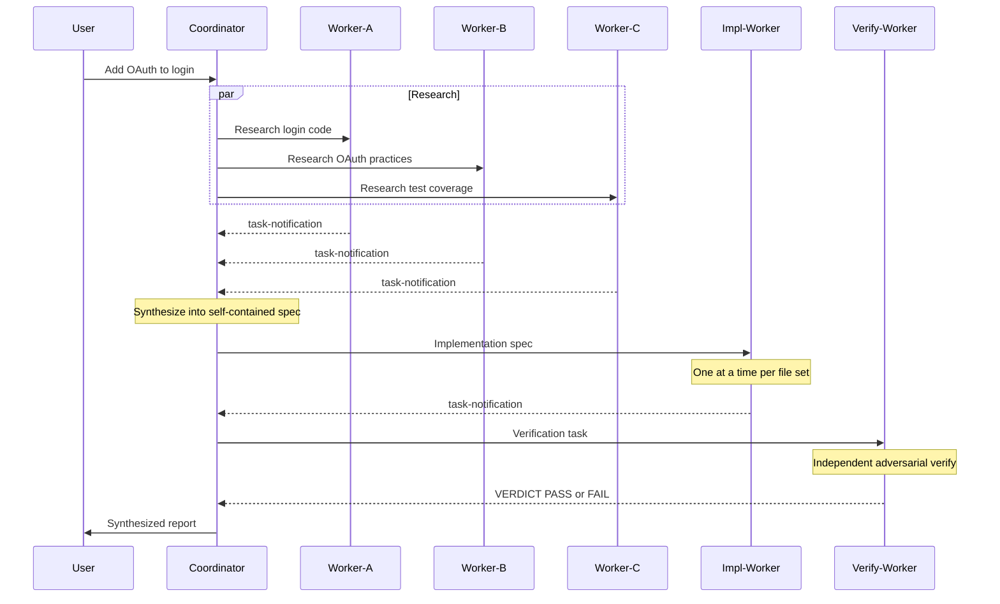

# 第 14 章:并行世界

> "单线程是 REPL 的命运,但不是 Agent 的命运。后台任务是暗线,Coordinator 是明线,两条线织出并行的世界。"

REPL 是单线程的--一轮对话、一个响应、一个任务。但用户的现实世界不是单线程的。Claude Code 用两种方式突破这个限制:后台任务让主循环不阻塞,Coordinator 模式让多个智能体真正并行工作。理解这两种并行的区别--以及它们按"进程内→进程外→远程"三个层次的隔离递进--比知道怎么 spawn 一个后台任务更重要。读完本章,你将理解 Harness 如何在单线程 REPL 之外开辟出并行的执行维度。

## 问题--REPL 是单线程的,但现实世界不是

REPL 的"一问一答"模型无法处理需要同时进行的任务。如果用户需要同时调研两个问题、同时运行测试和构建、同时修复多个文件--REPL 的单线程循环无法满足。

`TaskState` 联合类型揭示了任务系统的复杂度--7 种任务状态(LocalShell、LocalAgent、RemoteAgent、InProcessTeammate、LocalWorkflow、MonitorMcp、Dream),远比简单的"前台/后台"二元分类复杂。`isBackgroundTask` 函数的判断逻辑是:任务存在 `isBackgrounded` 属性且值为 `false` 时不计为后台任务--这意味着"运行中"和"后台"是独立的维度,一个任务可以正在运行但不在后台。

两种并行解法:

| 维度 | 后台任务 | Coordinator 模式 |
|------|---------|-----------------|
| 目标 | 主对话不阻塞 | 多 Agent 协调工作 |
| 执行者 | 单个 shell 命令或 Agent | 多个 worker Agent |
| 通信 | 结果返回主对话 | 协调器综合 worker 结果 |
| 适用 | 独立子任务 | 多任务协调流水线 |

**原则 14.1:并行不是单一能力,是分层能力** - Agent 系统**必须**按隔离程度提供不同层次的并行能力,而非一个"并行开关"。进程内并行、进程外并行、远程并行的隔离级别和代价完全不同--**禁止**用同一种机制覆盖所有场景。

## 黄金法则--并行是能力分层,不是功能开关

Claude Code 的并行能力按"进程内→进程外→远程"三个层次递进,每个层次的隔离和代价不同。`BackendType` 定义了三种后端--源码注释说明:"Types of backends available for teammate execution."(译:可用于队友执行的后端类型)。

**图 14-1:三层并行架构**

**第 1 层:进程内(in-process)**

队友在同一 Node.js 进程中运行，共享 AppState（`InProcessRunnerConfig`）。启动最快（无进程创建开销），但隔离最弱——共享状态需要同步机制。`LocalAgentTask` 和 `InProcessTeammate` 属于这一层。

**第 2 层:进程外(tmux/iTerm2)**

队友在独立终端进程中运行，通过文件系统通信。`SWARM_SESSION_NAME = 'claude-swarm'` 定义了 tmux 会话名。进程隔离意味着一个队友崩溃不影响其他进程，但通信需要通过文件系统的 `teammateMailbox`。

**第 3 层:远程(RemoteAgent)**

队友在 CCR（Cloud Compute Runtime）云环境中执行（`RemoteAgentTaskState`）。完全独立的环境，HTTP 轮询获取结果。隔离最强（不同机器），延迟最高（网络通信）。

| 并行层次 | 隔离级别 | 启动速度 | 通信方式 | 适用场景 |
|---------|---------|---------|---------|---------|
| 进程内 | 共享内存 | 最快 | 函数调用 | 快速探索、轻量验证 |
| 进程外 | 进程隔离 | 中等 | 文件邮箱 | 长时间运行任务 |
| 远程 | 完全隔离 | 最慢 | HTTP 轮询 | 云端大规模任务 |

**原则 14.2:隔离越强,代价越高** - 并行层次的选择**必须**匹配任务的安全需求。简单的只读搜索不需要远程执行,高风险的代码修改**禁止**在共享状态的进程内运行。

## 适用场景--何时用后台任务,何时用 Coordinator

后台任务和 Coordinator 解决不同的问题--"主对话不被阻塞"和"多任务需要协调"。

**后台任务适合**:
- 独立 shell 命令(`LocalShellTask`)--构建、测试、lint,不需要主对话等待
- 独立 Agent 任务(`LocalAgentTask`)--探索代码库、验证实现,结果异步返回
- 远程 Agent 任务(`RemoteAgentTask`)--在云端执行,主对话继续工作

**Coordinator 模式适合**:
- 多文件并行修改--每个 worker 负责一组文件,协调器综合结果
- 研究→实现→验证流水线--协调器编排阶段转换,确保前序阶段完成后再启动后续阶段
- 需要多视角分析的任务--多个 worker 从不同角度并行研究,协调器综合不同视角

`isCoordinatorMode()` 需要显式启用(Feature Flag + 环境变量)--Coordinator 模式不是默认开启的,它有显著的资源成本和复杂度。

## 工作原理--Coordinator 模式的任务分配和通信机制

Coordinator 模式通过“协调器→worker→通知→综合”的循环实现多智能体协作。`TEAM_LEAD_NAME = 'team-lead'` 是协调器的固定名称。协调器的系统提示词定义了完整的工作流。

### 协调器角色

提示词明确定义了协调器的职责:"You are a coordinator. Your job is to: Direct workers to research, implement and verify code changes; Synthesize results and communicate with the user; Answer questions directly when possible - don't delegate work that you can handle without tools."(译:你是一个协调器。你的职责是:指导 worker 研究、实现和验证代码变更;综合结果并与用户沟通;尽可能直接回答问题--不要委托你自己能处理的工作)。

### 并发策略

提示词给出了明确的并发规则:"Parallelism is your superpower. Workers are async. Launch independent workers concurrently whenever possible - don't serialize work that can run simultaneously."(译:并行是你的超能力。Worker 是异步的。尽可能并发启动独立的 worker--不要把可以同时运行的工作串行化)。

同时有约束条件:"Read-only tasks - run in parallel freely; Write-heavy tasks - one at a time per set of files."(译:只读任务自由并行;写操作任务按文件集合一次一个)。这条规则编码了一个关键设计决策--写操作必须按文件集合串行化,否则多个 worker 同时修改同一文件会产生冲突。

### 通信机制

**teammateMailbox**:源码注释定义了它的定位:"Teammate Mailbox - File-based messaging system for agent swarms"(译:队友邮箱--基于文件系统的 Agent 群组消息系统)。`TeammateMessage` 类型定义了消息结构,`readMailbox` 函数读取队友的消息。文件系统的选择让通信跨进程可用--无论后端是 in-process、tmux 还是 iTerm2。

**SendMessage 工具**:队友间的实时通信通过 SendMessage 工具实现。`TEAMMATE_SYSTEM_PROMPT_ADDENDUM` 告诉队友:"IMPORTANT: You are running as an agent in a team. To communicate with anyone on your team: Use the SendMessage tool with `to: '<name>'` to send messages to specific teammates."(译:重要:你正在作为团队中的一个 Agent 运行。要与团队中的任何人通信:使用 SendMessage 工具发送消息给指定队友)。

**task-notification XML**:Worker 完成任务后,通过 task-notification XML 格式汇报结果--包含 task-id、status、summary、result 和 usage。协调器解析这些通知,综合 worker 的输出。

| 通信方式 | 适用范围 | 延迟 | 方向 |
|---------|---------|------|------|
| teammateMailbox | 跨进程队友 | I/O 延迟 | 双向 |
| SendMessage 工具 | 队友间实时 | 函数调用级 | 双向 |
| task-notification XML | Worker→协调器 | 随任务完成 | 单向 |

### 自包含提示词原则

协调器提示词中最关键的设计约束:"Workers can't see your conversation. Every prompt must be self-contained with everything the worker needs."(译:Worker 看不到你的对话。每个提示词必须自包含 worker 需要的所有信息)。这意味着协调器不能写"基于你刚才的研究结果"这样的模糊指令--worker 不知道"刚才的研究"是什么。

## 权衡--并行系统的 3 个设计代价

| 决策维度 | 选择 A(本系统) | 选择 B | 核心权衡 |
|---------|----------------|--------|---------|
| 共享状态 | 进程内需同步 | 完全隔离 | 速度 vs 安全 |
| 通信方式 | 文件邮箱 | 进程内调用 | 跨进程可用性 vs 延迟 |
| 提示词设计 | 自包含(重复上下文) | 共享对话历史 | 隔离性 vs token 成本 |

**代价一:共享状态冲突**

in-process 队友共享 AppState--文件系统状态、权限配置、工具上下文都在同一进程中。写操作必须按文件集合串行化,否则两个 worker 同时修改同一文件会产生冲突。这个约束不是"建议",是系统提示词中的硬规则--违反它会导致不可预测的文件损坏。

**代价二:通信延迟**

文件邮箱(teammateMailbox)用文件系统作为消息队列。好处是跨进程可用(tmux/iTerm2 后端),代价是每次消息传递都有 I/O 延迟。对于高频消息(如进度更新),这个延迟可能成为瓶颈。进程内后端不需要文件邮箱(直接函数调用),但通信方式的不统一增加了维护复杂度(推断)。

**代价三:上下文重复**

"Workers can't see your conversation"意味着每个 worker 都需要完整的自包含提示词--包括任务背景、代码上下文、约束条件。协调器必须把所有信息写进每个 worker 的提示词。对于复杂任务,一个 worker 的提示词可能消耗数千 token。多个 worker 并行时,token 成本成倍增长。

## 踩坑指南--并行系统中的常见错误

**陷阱一:给 worker 的提示词不够自包含**

"Workers can't see your conversation"是最常被忽视的约束。协调器写了"基于你的发现修复问题"这样的指令--但 worker 看不到协调器的对话历史,不知道"你的发现"是什么。

❌ 错误做法:在 worker 提示中引用之前的对话上下文("根据你刚才的研究"或"继续上面的任务")。
✓ 正确做法:每个 worker 的提示词必须完全自包含--包括任务目标、相关文件路径、具体约束。假设 worker 是一个刚加入团队的新成员,对之前的对话一无所知。

**陷阱二:多个 worker 同时修改同一组文件**

协调器提示词的并发规则明确:"Write-heavy tasks - one at a time per set of files."违反这个规则会导致文件冲突--两个 worker 的修改互相覆盖。

❌ 错误做法:让两个 worker 同时修改同一个模块的不同部分,期望 git 能自动合并。
✓ 正确做法:按文件集合分配任务--每个 worker 负责一组互不重叠的文件。如果两个 worker 必须修改同一文件,串行执行。

**陷阱三:在 in-process 后端中忽视共享状态**

in-process 队友共享 AppState。如果一个 worker 修改了全局状态(如切换工作目录、修改权限配置),会影响同一进程中的所有 worker。

❌ 错误做法:在 in-process worker 中修改全局状态(如切换 `cwd`),期望其他 worker 不受影响。
✓ 正确做法:需要进程隔离的任务使用 tmux/iTerm2 后端。in-process 只用于只读或无状态的任务。

## 实证--Coordinator 的一次完整任务分配循环

一次完整的 Coordinator 任务循环包含"研究→综合→实现→验证"四个阶段,协调器在每个阶段做出不同的并行策略选择。

**阶段一:Research(并行只读)**

协调器接收到用户任务"为登录模块添加 OAuth 支持"。它分析任务,决定启动 3 个并行只读 worker:Worker A 调研现有登录代码,Worker B 调研 OAuth 库的最佳实践,Worker C 调研现有测试覆盖。只读任务自由并行--提示词明确允许:"Read-only tasks - run in parallel freely"。

**阶段二:Synthesis(协调器综合)**

3 个 worker 通过 task-notification XML 汇报结果。协调器读取 `readMailbox`(`src/utils/teammateMailbox.ts:84`)收集所有结果。提示词的核心指令:"Always synthesize - your most important job is to synthesize findings into a specific prompt."(译:始终综合--你最重要的工作是将发现综合为具体的提示词)。协调器不是简单转发 worker 结果,而是理解后重新组织为自包含的实现规格。

**阶段三:Implementation(按文件集合串行)**

协调器根据综合结果,编写自包含的实现提示词,启动实现 worker。如果涉及多组文件,按文件集合串行分配--同一组文件只有一个 worker 在修改。每个 worker 的提示词包含完整的实现规格,不引用对话历史。

**阶段四:Verification(独立验证)**

协调器启动独立的验证 worker--最好使用全新的 worker 以避免实现偏差(详见第 13 章的对抗性验证理念)。验证结果以 `PASS`/`FAIL`/`PARTIAL` 返回,协调器决定是否需要重新实现。

**图 14-2:Coordinator 任务分配循环**

这条路径验证了 Coordinator 模式的核心价值:协调器不做具体工作("don't delegate work that you can handle without tools"是例外),它的核心职责是"综合"--理解多个 worker 的输出,重新组织为下一个阶段的自包含输入。综合质量直接决定并行系统的整体效果。

## 本章主成分:并行世界的本质

**本质**:并行不是单一能力,是按隔离程度分层的(进程内→进程外→远程),每一层有不同的通信机制和代价。后台任务解决"主对话不被阻塞",Coordinator 模式解决"多任务需要协调"--两种并行的目标、机制和适用场景完全不同。

**关键机制**:
- `BackendType`:3 种后端(in-process/tmux/iTerm2),递进的隔离策略
- `TaskState`:7 种任务状态,覆盖从本地 shell 到远程 Agent 的全部场景
- Coordinator 系统提示词:角色定义 + 并发规则 + 自包含约束
- `teammateMailbox`:基于文件系统的消息队列,跨进程可用
- "Workers can't see your conversation":自包含提示词原则

**适用边界**:
- ✓ 适合:需要并行执行多个独立子任务的场景
- ✓ 适合:需要协调多阶段流水线(研究→实现→验证)的复杂任务
- ✗ 不适合:单任务单步骤的简单操作(并行开销不值得)
- ✗ 不适合:所有步骤都有强依赖关系的线性任务(无法并行)

**与其他模式的关系**:
- 第 13 章(生成器与评估器)的内置智能体在 Coordinator 模式中就是 worker
- 第 12 章(fork 机制)是每个 worker 的底层执行机制
- 第 10 章(Hooks)的 `SubagentStart/Stop` 触发点在 Coordinator 中触发

## 你能做什么

- **区分"后台任务"和"Coordinator 模式"**。前者是主对话不被阻塞,后者是多个 Agent 协调工作。混淆两者会导致设计方向错误。
- **为每个 worker 提供自包含的提示词**。Worker 看不到你的对话,所有上下文必须写进提示词--"Workers can't see your conversation"。
- **只读任务自由并行,写操作按文件集合串行**。这是 Coordinator 系统提示词中的显式规则--违反它会导致文件冲突。
- **协调器的核心职责是"综合"**。不是简单转发 worker 结果,而是理解后重新组织为下一个阶段的自包含输入。
- **选择后端时按隔离需求决定**。进程内(最快)→ 进程外(隔离好)→ 远程(完全隔离)--不要对所有任务使用同一种后端。
- **为队友间通信实现基于文件的消息队列**。参考 `teammateMailbox`--文件系统通信让跨进程可用,I/O 延迟在大多数场景中可接受。
- **在协调器提示词中明确"什么是好的提示词"和"什么是坏的提示词"**。减少 worker 的无效调用--每个 worker 的提示词质量直接决定并行系统的效率。

---

**下一章导读**:本章看到了 Coordinator 模式如何让多个 Agent 并行工作。但 Agent 能力的边界在哪里?第 15 章将展示 Claude Code 的扩展机制--MCP(Model Context Protocol)如何让 Harness 连接外部世界,以及插件的动态加载系统如何在不修改核心代码的情况下添加新能力。
