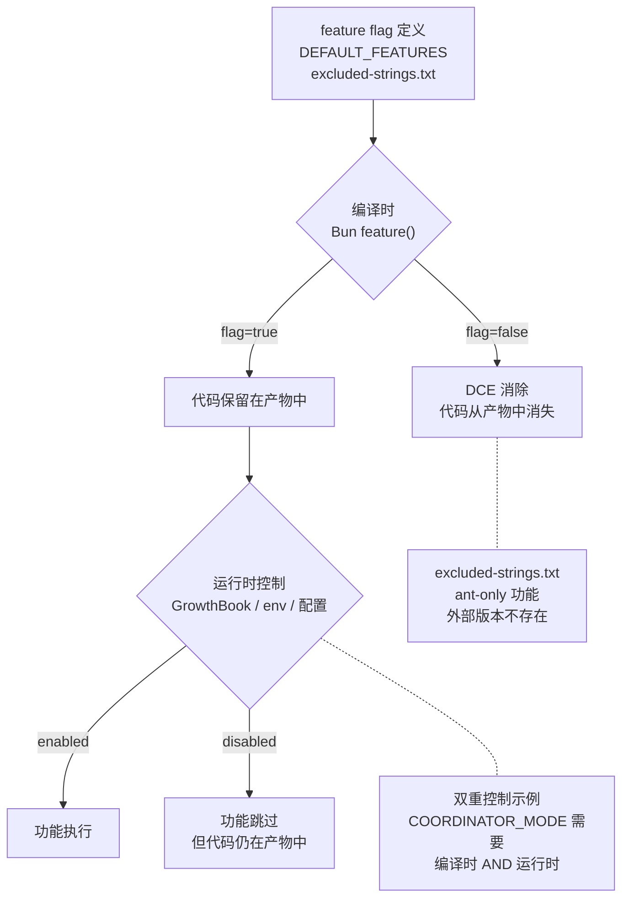
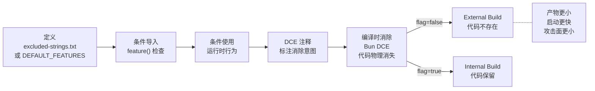

# 第 15 章：脚手架会消失

> "最好的 Harness 是你正在拆的那个。每个 feature flag 都是一张拆除许可证：盖章日期待定。"

89 个 feature flag，828 处调用——每一处都是一个赌注："有一天这个 flag 会关掉，这段代码会消失。"理解 feature flag 不是开关，而是"脚手架拆除计划"，比知道有哪些 flag 更重要。读完本章，你将理解 `feature()` 如何在编译时物理消除代码，以及为什么 Harness 的大部分功能是在等待模型变得足够好以至于自己变得多余。

## 问题——Harness 会随着模型进步变得多余吗

如果模型有一天能完美管理上下文、评估输出、协调任务，那么压缩策略、Verification Agent、Coordinator 模式都不再需要。89 个 feature flag 的存在本身就说明 Harness 的大部分功能是在弥补模型能力的不足——当模型变得更好，这些功能应该消失。

`DEFAULT_FEATURES` 只有 3 个条目：`KAIROS`、`COORDINATOR_MODE`、`CLAUDE_CODE_SIMPLE`——全部默认 `false`。这意味着大部分 feature 在默认配置中是关闭的，只有在特定构建中才启用。`feature()` 函数的实现更直接：`currentFeatures[featureName] ?? false`——未配置的 flag 返回 `false`，代码不执行。

更关键的是 `import { feature } from 'bun:bundle'`——这不是普通的配置读取，而是 Bun 编译器的 DCE（Dead Code Elimination，死代码消除）钩子。当 `feature('X')` 返回 `false` 时，Bun 编译器在构建产物中**物理消除** `false` 分支的代码——不是注释掉，不是跳过，是从产物中彻底消失。

| 统计维度 | 数字 | 含义 |
|---------|------|------|
| Feature flag 总数 | 89 个 | 89 个"模型能力假设" |
| `feature()` 调用总数 | 828 处 | 828 处条件代码路径 |
| `DEFAULT_FEATURES` | 3 个 | 默认全关闭 |
| main.tsx 中的调用 | 60 处 | 入口文件最密集 |

**原则 15.1：每个补偿模型不足的功能都必须可消除** — Harness 中每个弥补模型能力缺陷的功能**必须**受 feature flag 控制。**禁止**将补偿性代码硬编码为无条件行为——当模型进步时，这些代码**必须**能被安全移除。

## 黄金法则——每个 feature flag 编码一个"模型能力假设"

feature flag 不是功能开关，而是一条工程断言——"在当前模型能力下，这段 Harness 代码是必需的；当模型超越这个阈值，这段代码可以安全移除"。源码中的注释反复强调 DCE 目的，而非"开关"语义。

| Feature flag | 编码的能力假设 | 关联章节 |
|-------------|--------------|---------|
| `REACTIVE_COMPACT` | 模型可能产生超长输出导致 API 413 错误 | 第 11 章 |
| `HISTORY_SNIP` | 模型处理完整长历史的能力不足 | 第 11 章 |
| `CACHED_MICROCOMPACT` | API cache 机制不完美，需要手动管理 | 第 11 章 |
| `VERIFICATION_AGENT` | 模型无法可靠评估自己的输出 | 第 13 章 |
| `COORDINATOR_MODE` | 单 Agent 无法高效处理并行任务 | 第 14 章 |
| `CONTEXT_COLLAPSE` | 简单压缩策略释放空间不够 | 第 11 章 |
| `KAIROS`（24 处调用） | 需要独立的 assistant 模块 | main.tsx |

每个 flag 的 `true` 状态意味着"模型在这方面还不够好，需要 Harness 补偿"；`false` 状态意味着"这段补偿代码不需要"。autoCompact 源码中的注释直接标注了这种语义："Inside feature() so the string DCEs from external builds (it's in excluded-strings.txt)."（译：放在 feature() 内部以使字符串从外部构建中通过 DCE 消除（它在 excluded-strings.txt 中））。

microCompact 的延迟导入也遵循同样的原则："The imports and state live inside feature() checks for dead code elimination."（译：导入和状态放在 feature() 检查内部以实现死代码消除）。不只是运行时行为，连模块的物理存在都受 flag 控制。

**原则 15.2：Flag 消除的是代码，不是行为** — Feature flag **必须**通过编译时 DCE 物理消除代码，而非仅通过运行时 `if` 跳过。代码物理消失意味着产物更小、启动更快、攻击面更小——这些是运行时 `if` 无法提供的优势。

## 适用场景——哪些 Harness 功能最可能先消失

按"模型进步速度 × Harness 代码量"排列，压缩策略最可能先被移除。

| 消失速度 | 功能 | 理由 |
|---------|------|------|
| 最快 | `REACTIVE_COMPACT` | 模型的输出长度控制正在改善 |
| 最快 | `HISTORY_SNIP` | 上下文窗口在增长，长历史不再是致命问题 |
| 中等 | `CACHED_MICROCOMPACT` | API cache 机制在改善 |
| 中等 | `microCompact`（整体） | cache TTL 优化后，手动清除的价值降低 |
| 最慢 | `VERIFICATION_AGENT` | 自我评估是模型的根本困难 |
| 最慢 | `COORDINATOR_MODE` | 并行协调是架构问题，不只是能力问题 |

`REACTIVE_COMPACT` 标记为 "ant-only"——源码注释明确说："REACTIVE_COMPACT is ant-only"。ant-only 功能只在内部构建中存在，外部版本通过 DCE 完全消除。这意味着这个功能可能已经在评估是否可以永久关闭。

## 工作原理——feature flag 的编译时和运行时两层机制

Claude Code 的 feature flag 有两层——编译时 DCE（Bun feature）和运行时控制（GrowthBook/环境变量/配置），两层配合实现"开发时灵活、生产时精简"。

**图 15-1：feature flag 两层机制**

### 编译时 DCE

`feature()` 函数在 Bun 编译时被编译器识别。当 `feature('X')` 返回 `false` 时，Bun 编译器将 `if (feature('X')) { ... }` 中的整个代码块从产物中消除。这比运行时 `if` 更彻底：

- **产物更小**——828 处 `feature()` 调用中，大部分在外部版本中返回 `false`，对应代码不进入产物
- **启动更快**——不需要初始化不存在的模块
- **攻击面更小**——代码物理不存在，无法被利用

`excluded-strings.txt` 是 Bun 的 DCE 配置文件——列出所有只存在于内部构建的 flag 名称。autoCompact 源码中的注释解释了它的工作方式："Inside feature() so the string DCEs from external builds (it's in excluded-strings.txt)"。flag 名称字符串本身也从外部版本中消除——连字符串常量都不留。

### 运行时控制

即使代码通过了编译时 DCE，运行时仍有多层控制。`COORDINATOR_MODE` 是最典型的双重控制：编译时需要 `feature('COORDINATOR_MODE')` 为 `true`，运行时还需要 `isEnvTruthy(process.env.CLAUDE_CODE_COORDINATOR_MODE)` 为 `true`。两者缺一不可。

运行时控制来源包括：
- **GrowthBook Feature Flags**——远程配置，可动态切换
- **环境变量**——如 `DISABLE_AUTO_COMPACT`、`CLAUDE_CODE_COORDINATOR_MODE`
- **用户配置**——如 `autoCompactEnabled`（详见第 11 章）

### 两层配合的价值

两层机制不是冗余，而是互补。编译时 DCE 解决"外部版本不应该有这段代码"的安全和性能问题；运行时控制解决"即使代码存在，也应该可以动态开关"的灵活性问题。Coordinator 模式需要两层都启用——编译时确保外部版本不包含 Coordinator 代码（功能尚未成熟），运行时允许内部用户按需启用。

| 控制层 | 时机 | 机制 | 效果 |
|--------|------|------|------|
| 编译时 DCE | 构建时 | `bun:bundle` feature() + excluded-strings.txt | 代码物理消除 |
| 运行时 | 执行时 | GrowthBook / env / 配置 | 行为开关 |

## 权衡——DCE 驱动架构的 3 个设计代价

| 决策维度 | 选择 A（本系统） | 选择 B | 核心权衡 |
|---------|----------------|--------|---------|
| 代码分割 | 条件 require 切断模块图 | 统一构建 | 产物精简 vs 构建复杂 |
| 测试矩阵 | 89 个 flag 的排列组合 | 固定配置 | 覆盖面 vs 测试成本 |
| 延迟导入 | feature-gated 模块按需加载 | 全量导入 | 安全性 vs 开发便利 |

**代价一：代码分割**

main.tsx 中的条件 `require()` 切断了模块依赖——`coordinatorModeModule` 只在 `feature('COORDINATOR_MODE')` 为 `true` 时存在。不同构建的模块图不同。这意味着开发者需要理解"这段代码在哪个构建中存在"——microCompact 的注释直接说明了这个问题："Lazy-initialized cached MC module and state to avoid importing in external builds."（译：延迟初始化缓存 MC 模块和状态，以避免在外部构建中导入）。

**代价二：测试矩阵**

89 个 flag 的所有组合不可能穷尽——2^89 是天文数字。团队只能聚焦高风险组合测试（推断）。每个新增 flag 都增加测试负担，但移除 flag 需要评估模型能力是否已经足够好——这个评估本身就有成本。

**代价三：延迟导入的开发便利性**

顶层 `import` 更直观，但 external builds 中某些模块不存在，直接 import 会导致编译错误。开发者必须使用延迟导入（条件 `require` 或动态 `import()`），增加了代码的间接性。

## 踩坑指南——feature flag 的常见错误

**陷阱一：在 feature() 外的顶层代码中引用 feature-gated 模块**

DCE 消除的不是变量，是整个导入链。如果顶层 `import` 引用了只存在于内部构建的模块，external builds 会编译失败。

❌ 错误做法：在文件顶部直接 `import { someInternalAPI } from './internalModule.ts'`——即使只在 `feature()` 内部使用，顶层 import 也会在 external builds 中失败。  
✓ 正确做法：使用条件 `require()` 或动态 `import()` 在 `feature()` 检查内部延迟导入。microCompact 的延迟导入模式是标准参考。

**陷阱二：假设 feature flag 只控制运行时行为**

`feature('X')` 返回 `false` 时，代码不仅不执行——它在产物中不存在。这意味着你不能通过运行时日志或错误追踪来调试不存在的代码。

❌ 错误做法：在 external builds 中调试 feature-gated 功能，期望看到"flag is false"的日志。  
✓ 正确做法：理解 DCE 消除的代码在产物中完全不存在。调试时需要确认构建配置中目标 flag 是否为 `true`。

**陷阱三：忘记 lazy import 导致 external build 失败**

microCompact 的注释是教训："The imports and state live inside feature() checks for dead code elimination."——如果你忘记了这一点，把 import 放在 `feature()` 外面，external builds 会在编译时失败。

❌ 错误做法：在 `feature()` 检查外面声明依赖 feature-gated 模块的变量或函数。  
✓ 正确做法：所有依赖 feature-gated 模块的代码都放在 `feature()` 检查内部。使用 lazy import 模式确保 external builds 不引入不存在的模块。

## 实证——从 feature flag 到代码消失的完整路径

追踪 `REACTIVE_COMPACT` 从定义到使用到 DCE 的完整路径，展示一个 feature flag 如何控制代码的物理存在。

**定义**：`REACTIVE_COMPACT` 不在 `DEFAULT_FEATURES` 中（默认不存在），通过 `excluded-strings.txt` 注册为 ant-only 功能。

**条件导入**：`src/query.ts` 中通过 `const reactiveCompact = feature('REACTIVE_COMPACT')` 条件加载。如果 flag 为 `false`，`reactiveCompact` 为 `false`（falsy），相关代码路径不执行。

**条件使用**：autoCompact 的 `shouldAutoCompact` 中，`REACTIVE_COMPACT` 为 `true` 时关闭主动压缩，让 reactive compact 在 API 返回 413 错误时触发。注释标注了 DCE 目的："feature() wrapper keeps the flag string out of external builds (REACTIVE_COMPACT is ant-only)."（译：feature() 包装保持 flag 字符串不出现在外部构建中（REACTIVE_COMPACT 是仅限内部的））。

**DCE 注释**：query.ts 中的注释进一步说明："Gated behind feature() so the string is eliminated from external builds."（译：用 feature() 门控以使字符串从外部构建中消除）。

**编译时消除**：Bun 构建时，`feature('REACTIVE_COMPACT')` 返回 `false`，整个条件分支从产物中消除——不是注释掉，不是空函数，是彻底消失。

**图 15-2：Feature flag 生命周期**

这条路径验证了脚手架设计的核心价值：每个 feature flag 是一条从"补偿模型不足"到"代码物理消失"的完整生命周期。flag 关闭不是"功能关闭"——是代码不存在。这种设计让 Harness 随模型进步而自我精简，而非越做越臃肿。

## 本章主成分：脚手架会消失的本质

**本质**：89 个 feature flag 是 89 个"模型能力假设"，每个 flag 的 `false` 状态意味着"这段 Harness 代码在外部版本中不存在"——不是关闭，是消失。Harness 不是越做越大的护城河，而是一座设计好拆除方案的脚手架。

**关键机制**：
- 编译时 DCE：Bun `feature()` + `excluded-strings.txt`，代码物理消除
- 运行时控制：GrowthBook / 环境变量 / 用户配置，行为动态开关
- 双重控制：`COORDINATOR_MODE` 等需要两层同时启用
- 828 处 `feature()` 调用，覆盖从压缩到验证到协调的全部 Harness 功能

**适用边界**：
- ✓ 适合：需要随模型进步逐步精简的 Harness 系统
- ✓ 适合：有 internal/external 构建差异的多版本系统
- ✗ 不适合：一次性工具（不需要渐进式架构）
- ✗ 不适合：所有功能都是永久性的系统

**与其他模式的关系**：
- 本章综合了第 3-14 章所有 feature flag 的用法
- 第 11 章（压缩策略）的 5 种策略各有对应的 feature flag
- 第 13 章（Verification Agent）需要 `VERIFICATION_AGENT` flag 双重启用
- 第 14 章（Coordinator 模式）需要 `COORDINATOR_MODE` 编译时 + 运行时控制
- 第 16 章将把这些观察提炼为通用的设计原则

## 你能做什么

- **为你的 Harness 系统建立 feature flag 机制**。每个补偿模型不足的功能都用 flag 控制——flag 关闭时，补偿代码应该可以安全移除。
- **使用编译时 DCE 而不是运行时 if**。产物大小和启动时间都受益——代码物理消失比运行时跳过更彻底。
- **在 feature flag 代码中标注 DCE 注释**。参考 query.ts 的 "Gated behind feature() so the string is eliminated from external builds" 模式——帮助维护者理解哪些代码可能不存在。
- **定期审查 feature flag**。如果模型在某方面已经足够好，就关掉对应的 flag——flag 的目标是消失，不是永久存在。
- **对 ant-only 功能使用 excluded-strings.txt**。从外部版本中彻底消除——连 flag 名称字符串都不留。
- **延迟导入 feature-gated 模块**。参考 microCompact 的 lazy import 模式——避免顶层 import 导致 external builds 失败。
- **为 flag 的排列组合建立优先级矩阵**。不可能测试所有 2^89 种组合——聚焦高风险的 flag 组合测试。

---

**下一章导读**：本章看到了 89 个 feature flag 如何编码"模型能力假设"，以及 DCE 如何让 Harness 随模型进步而自我精简。第 16 章是全书的最后一章——将前 15 章的所有观察提炼为 7 条通用设计原则，一套可迁移到任何 AI Agent 系统的 Harness 架构蓝图。
