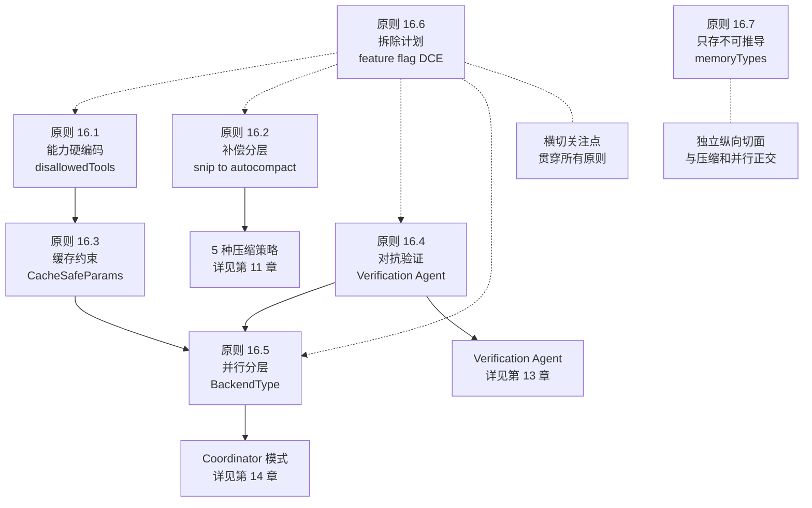
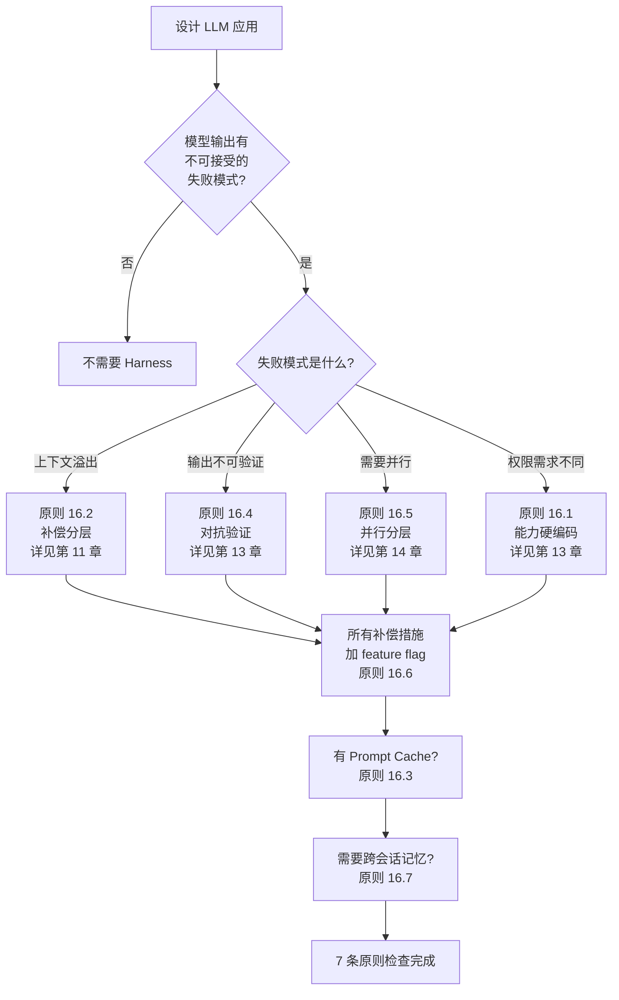

# 第 16 章：从 Claude Code 到通用原则

> "15 章之后，问题没有变——什么交给模型，什么交给代码？但答案变了：这不是一个二选一，而是一个有 7 条原则的决策框架。"

15 章源码分析，数百处锚点，最终归于一个问题：什么该交给模型，什么必须由 Harness 控制？本章不教你怎么复制 Claude Code 的实现——它给你一套决策框架，让你在任何 LLM 应用中回答同一个问题。每条原则都有源码中的真实决策支撑，每条都有明确的适用边界。

## 问题——"模型 vs Harness"是一个伪问题

前 15 章的分析反复证明，"模型"和"Harness"不是竞争关系。Harness 编码的是模型在当前版本中做不到的事，而 feature flag 机制确保这些代码在模型足够好时会消失（详见第 15 章）。

| 模型能力不足 | Harness 补偿 | 章节 |
|-------------|-------------|------|
| 上下文窗口有限 | 5 种压缩策略按深度执行 | 第 11 章 |
| 摘要生成不稳定 | `MAX_CONSECUTIVE_AUTOCOMPACT_FAILURES=3` 熔断 | 第 11 章 |
| 自我评估偏差 | Verification Agent 对抗性验证 | 第 13 章 |
| 单 Agent 无法并行 | Coordinator 模式多智能体协作 | 第 14 章 |
| 旧工具结果占位 | microCompact 清除白名单工具输出 | 第 11 章 |
| 权限判断不完美 | 4 层纵深防御 + AI 分类器 | 第 9 章 |
| 缓存失效浪费 token | CacheSafeParams 保持缓存命中 | 第 12 章 |

"模型 vs Harness"的正确理解是：Harness 是模型能力的历史快照。89 个 feature flag 中的每一个都记录了一个"模型在某个版本中还做不到"的事实（详见第 15 章）。当模型进步时，flag 关闭，代码消失——Harness 缩小，不是扩大。

## 黄金法则——7 条 Harness 工程原则

从 15 章的源码分析中，可以提炼 7 条可复用的原则。每条都不是理论设计，而是 Claude Code 源码中真实存在的工程决策。

**原则 16.1：能力边界硬编码，行为指导软编码** — 用工具禁用（`disallowedTools`）而非提示词约束来隔离能力。提示词可以违反，工具不存在不可违反。

planAgent 的 `disallowedTools` 列出了 5 种被硬性移除的工具（Agent、ExitPlanMode、FileEdit、FileWrite、NotebookEdit）。planAgent 不能写文件不是因为提示词说"不要写"，而是因为写文件的工具根本不存在（详见第 13 章）。

**原则 16.2：补偿措施分层，轻量先行，重量托底** — 5 种压缩策略按深度排序执行，轻量级策略释放足够 token 时重量级策略不触发。

queryLoop 中的执行顺序是 `snip → microCompact → contextCollapse → autoCompact`——每一步都尝试释放 token，如果足够就停止。只有所有轻量策略都释放不足时，autoCompact 才执行全量摘要（详见第 11 章）。

**原则 16.3：缓存是约束，不是优化** — `CacheSafeParams` 的 5 个参数必须逐字相同才能命中缓存。改一个字，缓存全部失效。

fork 时隔离对话历史但不破坏缓存——这要求 systemPrompt、userContext、systemContext、toolUseContext、forkContextMessages 完全相同。哪怕系统提示词只多了一个空格，缓存就失效，每次 fork 都是"冷启动"（详见第 12 章）。

**原则 16.4：对抗优于自评** — 用独立的 Verification Agent 对抗模型的自我评估偏差。验证者的工作不是确认，是破坏。

模型的 6 种"合理化借口"（"代码看起来对"、"大概没问题"、"太耗时了"）是系统性的，不是随机的。Verification Agent 的系统提示词用 "RECOGNIZE YOUR OWN RATIONALIZATIONS" 对抗这些借口——这不是改进模型的评估能力，而是用一个独立模型对抗另一个模型的偷懒倾向（详见第 13 章）。

**原则 16.5：并行按隔离分层** — in-process → tmux → remote 三层，每层的隔离和代价递增。不是所有并行都需要最大隔离。

三种 BackendType 编码了三种不同的信任假设：进程内共享状态（信任度高、延迟低）、tmux/iTerm2 进程隔离（中等信任、I/O 延迟）、远程云环境（零信任、网络延迟）。选择后端时按任务的安全需求匹配，不是一律用最安全的（详见第 14 章）。

**原则 16.6：每个补偿措施都有拆除计划** — feature flag 确保 Harness 代码可以随模型进步而消失。补偿是临时的，不是永久的。

828 处 `feature()` 调用中的大部分在外部版本中返回 `false`——代码物理消除，不是注释掉。autoCompact 的 DCE 注释直接标注："Inside feature() so the string DCEs from external builds"。flag 的目标不是"控制功能开关"，而是"标记这段代码应该在未来消失"（详见第 15 章）。

**原则 16.7：记忆只存不可推导的信息** — MEMORY.md 只存用户偏好、历史决策和反馈，不存代码架构。可推导的信息通过工具实时获取。

4 种记忆类型（user/feedback/project/reference）的选择标准是"不可从项目状态推导"。代码模式、架构、git 历史通过 grep/git 获得不应占用记忆配额。这个约束确保记忆系统的入口文件（200 行/25KB）不会填满可推导的信息（详见第 12 章）。

| 原则 | 源码锚点 | 关联章节 | 适用边界 |
|------|---------|---------|---------|
| 16.1 能力硬编码 | planAgent `disallowedTools` | 第 13 章 | 需要不可违反的权限边界 |
| 16.2 补偿分层 | queryLoop 压缩执行顺序 | 第 11 章 | 多种补偿策略并存时 |
| 16.3 缓存是约束 | `CacheSafeParams` 5 参数 | 第 12 章 | 有 Prompt Cache 的 API |
| 16.4 对抗优于自评 | RATIONALIZATIONS 提示词 | 第 13 章 | 需要验证输出质量 |
| 16.5 并行按隔离 | `BackendType` 三种类型 | 第 14 章 | 需要并行执行子任务 |
| 16.6 拆除计划 | `feature()` DCE 注释 | 第 15 章 | 所有补偿性代码 |
| 16.7 只存不可推导 | memoryTypes 4 种类型 | 第 12 章 | 有跨会话记忆的系统 |

## 适用场景——什么时候你需要一个 Harness

不是所有 LLM 应用都需要完整的 Harness。需要 Harness 的信号是"模型输出有不可接受的失败模式"。

| 失败模式 | 是否需要 Harness | 对应原则 | 参考 |
|---------|----------------|---------|------|
| 单轮问答不准确 | 可能不需要 | — | 模型可能已经够好 |
| 上下文窗口溢出 | 是 | 16.2 分层补偿 | 第 11 章 |
| 输出质量不可验证 | 是 | 16.4 对抗验证 | 第 13 章 |
| 需要同时执行多个子任务 | 是 | 16.5 并行分层 | 第 14 章 |
| 子任务有不同权限需求 | 是 | 16.1 能力硬编码 | 第 13 章 |
| 有 Prompt Cache 成本 | 是 | 16.3 缓存约束 | 第 12 章 |
| 跨会话需要记忆 | 是 | 16.7 只存不可推导 | 第 12 章 |

简单的单轮问答不需要 Harness。长会话 Agent 需要压缩策略。代码生成需要验证。多任务需要协调。当失败模式可以容忍时（如创意写作中的偶尔不完美），Harness 的成本可能不值得。

## 工作原理——7 条原则的协同关系

7 条原则不是独立的检查清单，它们之间存在依赖和协同。能力隔离（原则 16.1）是 fork 机制的前提，fork 是多 Agent 并行（原则 16.5）的基础，feature flag（原则 16.6）是所有原则的退出机制。

**图 16-1：7 条原则的依赖关系**

依赖链条是这样的：

**能力隔离 → fork 安全 → 多 Agent 并行**：planAgent 和 verificationAgent 的 `disallowedTools` 确保子智能体不会越权（原则 16.1），`CacheSafeParams` 确保隔离历史时不破坏缓存（原则 16.3），`runForkedAgent` 在安全隔离的基础上实现并行（原则 16.5）。没有能力隔离，fork 出的子智能体可能修改不应该修改的文件；没有缓存约束，每次 fork 都是冷启动。

**对抗验证作为独立切面**：Verification Agent 不依赖压缩策略或并行机制——它是验证阶段的独立关注点。但它的 `disallowedTools`（不能修改文件、不能生成子 Agent）仍然遵循原则 16.1。

**feature flag 作为横切关注点**：原则 16.6（拆除计划）不参与具体的执行路径，但贯穿所有层级——从压缩策略（`REACTIVE_COMPACT`）到验证（`VERIFICATION_AGENT`）到并行（`COORDINATOR_MODE`），每个补偿措施都有对应的 feature flag。

**记忆系统作为独立纵向切面**：原则 16.7（只存不可推导信息）与压缩和并行正交——它解决的是跨会话的信息持久化，不是当前会话的执行效率。

## 权衡——7 条原则的适用边界

7 条原则各有适用边界——超出边界时遵循原则反而会增加复杂度。

| 原则 | 适用边界 | 过度应用的代价 |
|------|---------|--------------|
| 16.1 能力硬编码 | 需要不可违反的权限边界 | 所有工具都禁用 = Agent 无法完成任务 |
| 16.2 补偿分层 | 多种策略并存的场景 | 策略太多 = 调试困难、行为不可预测 |
| 16.3 缓存约束 | 有 Prompt Cache 的 API | 无缓存时过度维护 CacheSafeParams 是浪费 |
| 16.4 对抗验证 | 输出质量有高风险的场景 | 简单任务用 Verification = token 成本不值得 |
| 16.5 并行分层 | 子任务真正独立的场景 | 有依赖关系的任务强行并行 = 结果冲突 |
| 16.6 拆除计划 | 所有补偿性代码 | 简单功能加 feature flag = 增加维护负担 |
| 16.7 只存不可推导 | 有明确"可推导 vs 不可推导"边界的场景 | 边界模糊时 = 自动提取质量差 |

原则 16.2（补偿分层）在短会话中完全不触发——5 种压缩策略的阈值都不满足。为一个 5 轮对话的系统设计 5 种压缩策略是过度设计。

原则 16.4（对抗验证）默认关闭——Verification Agent 需要双重 Feature Flag 启用（详见第 13 章）。这不是缺陷，而是对成本的诚实评估：验证的 token 成本在简单任务中不值得。

原则 16.5（并行分层）的 in-process 后端需要处理共享状态的并发访问——如果任务之间有文件依赖，强行并行会产生冲突。Coordinator 提示词明确要求"Write-heavy tasks — one at a time per set of files"（详见第 14 章）。

## 踩坑指南——设计 Harness 时的 3 个常见误区

**误区一：为模型还不需要补偿的地方建补偿**

模型的能力在快速进步。在构建 Harness 之前，先用当前最好的模型测试——如果模型在某个场景中已经足够好，就不需要补偿。`DEFAULT_FEATURES` 只有 3 个条目，说明大部分补偿是实验性的，默认关闭（详见第 15 章）。

❌ 错误做法：预判"模型可能在这里出错"，提前构建复杂的补偿机制。  
✓ 正确做法：先让模型尝试，收集失败数据，只为有证据的失败模式构建补偿。

**误区二：把 Harness 功能做成永久架构**

没有 feature flag 的补偿会变成技术债务——当模型进步后，这些代码仍然存在，增加维护负担和产物大小。autoCompact 的 DCE 注释明确标注了代码应该从外部版本中消除（详见第 15 章）。

❌ 错误做法：将补偿逻辑硬编码为核心路径的一部分，没有退出机制。  
✓ 正确做法：每个补偿措施都受 feature flag 控制。定期审查 flag——模型在进步，Harness 应该在缩小。

**误区三：忽视 Harness 自身的 token 成本**

Harness 的每个子系统都有 token 消耗。Explore 智能体每周被调用 3400 万次，`omitClaudeMd` 通过省略不必要的 CLAUDE.md 内容每周节省 5-15 Gtoken（详见第 13 章）。如果忽视 Harness 的 token 成本，补偿措施本身可能比它解决的问题更昂贵。

❌ 错误做法：为子智能体加载完整的上下文（包括不需要的 CLAUDE.md 层级）。  
✓ 正确做法：只读智能体使用 `omitClaudeMd` 省略不相关的上下文。计算 Harness 补偿的 token 成本，与它解决的问题的代价比较。

## 实证——用 7 条原则审视一个新项目

用 7 条原则检查一个假设的 LLM 应用——"代码审查 Agent"，展示原则如何指导具体决策。

**场景**：设计一个自动代码审查 Agent，读取 PR diff 并输出审查意见。

**原则 16.1 检查（能力硬编码）**：审查 Agent 只能读代码和输出意见，不能修改代码。用 `disallowedTools` 移除 FileEdit 和 FileWrite——硬性保证审查者不会"顺手"修改代码（参考 planAgent 的设计，详见第 13 章）。

**原则 16.2 检查（补偿分层）**：大型 PR 的 diff 可能很长。先尝试截断 diff（轻量），不够时压缩历史对话（中等），最后全量摘要 diff（重量）。不需要 5 种策略——3 种可能就够。

**原则 16.3 检查（缓存约束）**：如果多个文件需要独立审查，可以用 fork 并行。fork 时确保 CacheSafeParams 完全相同——系统提示词、工具配置、模型选择逐字匹配（详见第 12 章）。

**原则 16.4 检查（对抗验证）**：审查质量需要独立验证。用一个独立的 Agent 检查审查意见是否有遗漏——它的工作不是确认"审查不错"，而是找审查漏掉的问题（参考 Verification Agent 的对抗性设计，详见第 13 章）。

**原则 16.5 检查（并行分层）**：多文件审查可以并行——但只读审查用 in-process 就够了（不需要进程隔离）。如果审查涉及运行测试（写操作），才需要进程外或远程后端（详见第 14 章）。

**原则 16.6 检查（拆除计划）**：所有补偿措施受 feature flag 控制。当模型的代码审查能力足够好时，Verification Agent 可以关闭。当模型能处理任意长度的 diff 时，截断策略可以移除。

**原则 16.7 检查（只存不可推导）**：记忆用户的审查偏好（"关注性能而非风格"），不存代码模式（代码本身就在仓库里）。

**图 16-2：Harness 适用性决策树**

这个决策树不是一次性的——它是迭代使用的。随着模型进步，某些失败模式可能消失，对应的 Harness 组件应该被移除。定期回到这个决策树，重新评估每条原则是否仍然适用。

## 本章主成分：从 Claude Code 到通用原则

**本质**：Harness 不是产品的永久部分，是产品在"模型还不够好"阶段的临时支架。7 条原则是设计支架的工程方法，不是产品设计方法。当模型能力超越 Harness 补偿的阈值时，对应的 Harness 代码应该消失。

**关键机制**：
- 能力隔离（`disallowedTools`，硬约束）
- 分层补偿（snip → micro → collapse → auto，轻→重）
- 缓存一致性（`CacheSafeParams`，5 参数逐字相同）
- 对抗性验证（Verification Agent，独立破坏者）
- 并行分层（in-process → tmux → remote，按需隔离）
- 拆除计划（`feature()` DCE，代码物理消失）
- 记忆约束（4 种类型，只存不可推导信息）

**全书结论**：Harness 工程的最高目标不是建更好的 Harness，而是让 Harness 变得不需要。89 个 feature flag 中的每一个都在等待这一天。

## 你能做什么

- **列出你的 LLM 应用中"模型还不够好"的具体场景**。每个场景都是一条 Harness 候选——但只有不可接受的失败模式才值得补偿。
- **为每条 Harness 设计 feature flag**。确保将来可以安全移除——当模型进步时，你的 Harness 应该在缩小。
- **用 `disallowedTools`（或等价机制）硬性隔离能力**。不要只靠提示词——提示词可以违反，工具不存在不可违反。
- **为补偿措施设计分层**。先轻量后重量，先尝试微补偿再考虑全量重做——不是所有问题都需要最重的解决方案。
- **如果需要并行执行，按隔离需求选择后端**。进程内（最快）→ 进程外（隔离好）→ 远程（完全隔离）——不要对所有任务使用同一种后端。
- **为每个子 Agent 提供自包含的提示词**。它看不到你的对话——所有上下文必须写进提示词。
- **定期审查 feature flag**。模型在进步，你的 Harness 应该在缩小。如果一个 flag 已经存在一年没有更新，要么它补偿的问题已经解决，要么你需要重新评估。

---

**全书结语**：16 章，从一次 API 调用的生命周期到 7 条通用原则。我们看到了 Harness 如何在查询循环中编排模型行为，如何用工具系统约束模型能力，如何用压缩策略管理有限上下文，如何用对抗性验证弥补自我评估偏差，如何用并行机制突破单线程限制，以及如何用 feature flag 确保这一切都是临时的。Claude Code 的源码是一本工程教科书——它教的不只是"怎么用 Claude"，而是"怎么设计一个让 AI 安全、高效、可控地工作的系统"。而这 7 条原则，就是这本教科书的目录。
